# 定义
```
正则表达式是一组由字母和符号组成的特殊文本, 它可以用来从文本中找出满足你想要的格式的句子
正则表达式是一种从左到右匹配主体字符串的模式, 可以从一个基础字符串中根据一定的匹配模式替换文本中的字符串、验证表单、提取字符串等等
```
> - 例如：`^[a-z0-9_]{3,15}$`, 该正则表达式可以接受小写字母、数字、下划线、且长度为3-15的字符串


# 元字符
> - 正则表达式主要依赖于元字符, 元字符不代表他们本身的字面意思, 他们都有特殊的含义, 一些元字符写在方括号中的时候有一些特殊的意思, 以下是一些元字符的介绍

|元字符|描述|
|:----:|:----:|
|.|句号匹配任意单个字符除了换行符|
|[]|字符种类, 匹配方括号内的任意字符|
|[^]|否定的字符种类, 匹配除了方括号里的任意字符|
|*|匹配>=0个重复的在*号之前的字符|
|+|匹配>=1个重复的+号前的字符|
|?|标记?之前的字符为可选|
|{n,m}|匹配num个大括号之前的字符或字符集 (n <= num <= m)|
|(xyz)|字符集, 匹配与 xyz 完全相等的字符串|
|&#124;|或运算符, 匹配符号前或后的字符|
|&#92;|转义字符,用于匹配一些保留的字符 [ ] ( ) { } . * + ? ^ $ \ \||
|^|从开始行开始匹配|
|$|从末端开始匹配|

## 点运算符 - `.`
> - 例如：`.misc` 匹配一个任意字符串后面跟着的是 `misc` 的字符串

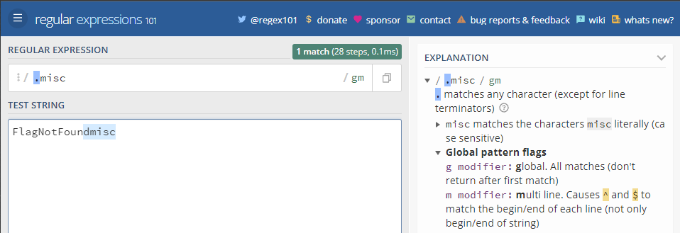

## 字符集
> - 例如：表达式 `[Tt]he` 匹配 the 和 The; 方括号的句号就表示句号, 表达式 `ar[.]` 匹配 ar. 字符串

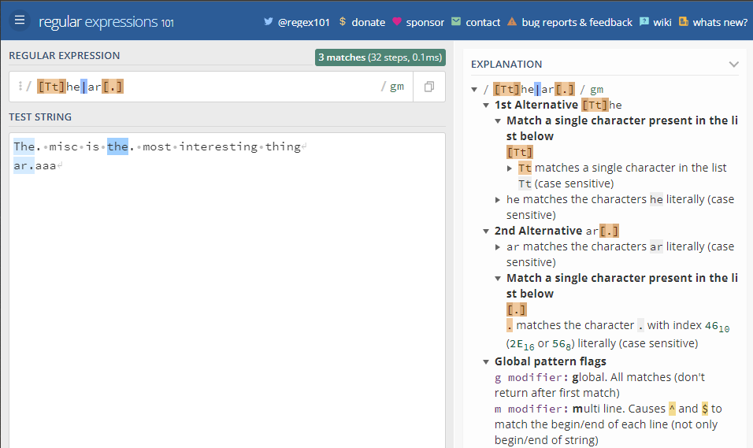

## 否定字符集
> - 例如：表达式 `[^c]ar` 匹配一个后面跟着 ar 的除了 c 的任意字符

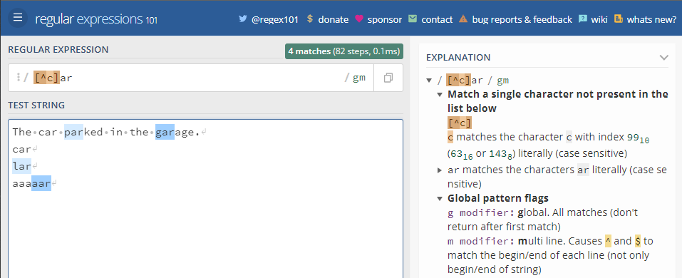

## 重复次数 - `*` 号
> -  例如：表达式 `a*` 匹配 0 或更多个以 a 开头的字符; 表达式 `[a-z]*` 匹配一个行中所有以小写字母开头的字符串; `*` 字符和 `.` 字符搭配可以匹配所有的字符 .* ; `*` 和表示匹配空格的符号 `\s` 连起来用, 如表达式 \s*cat\s* 匹配 0 或更多个空格开头和 0 或更多个空格结尾的 cat 字符串

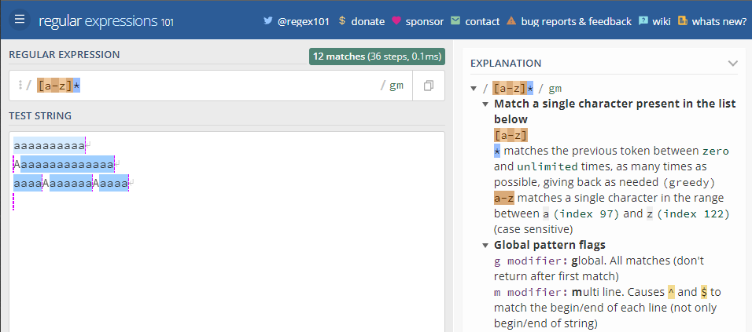

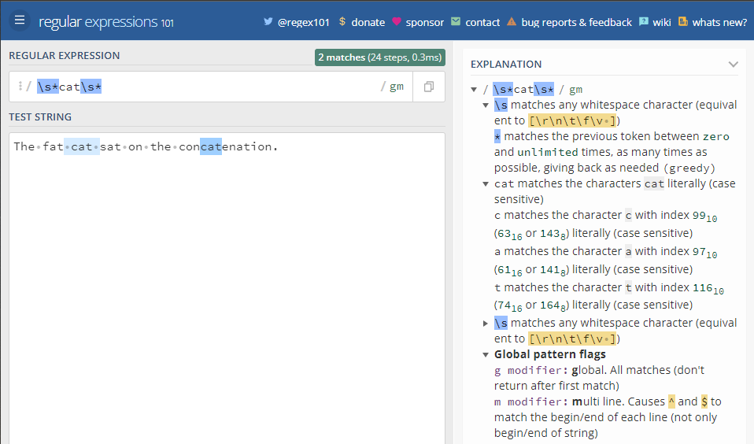

## 重复次数 - `+` 号
> - 例如：表达式 `c.+t` 匹配以首字母 c 开头以 t 结尾, 中间跟着至少一个字符的字符串


## 重复次数 - `?` 号
> - 例如：表达式 `[T]?he` 匹配字符串 `he` 和 `The`

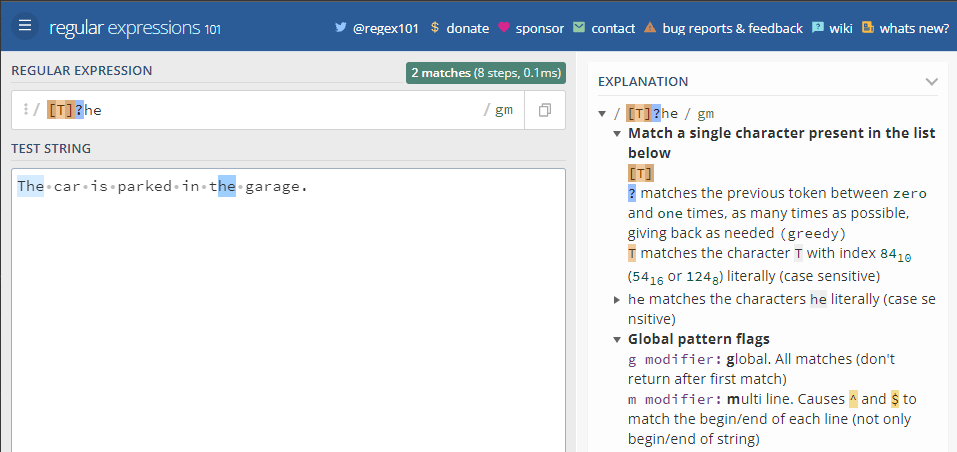

## {} 号
> - 例如：表达式 `[0-9]{2,3}` 匹配最少 2 位最多 3 位 0-9 的数字; `[0-9]{2,}` 匹配至少两位 0~9 的数字; `[0-9]{3}` 匹配 3 位数字

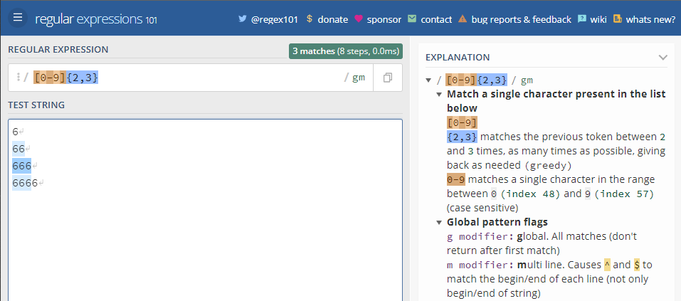

## (...) 特征标群
> - 例如：表达式 `(ab)*` 匹配连续出现 0 或更多个 ab, 如果没有使用 (...), 那么表达式 `ab*` 将匹配连续出现 0 或更多个 b, 再比如之前说的 {} 是用来表示前面一个字符出现指定次数, 但如果在 {} 前加上特征标群 (...) 则表示整个标群内的字符重复 N 次; 还可以在 () 中用或字符 | 表示或, `(c|g|p)ar` 匹配 car 或 gar 或 par

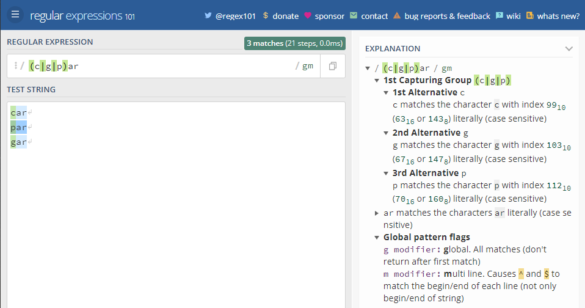

## | 或运算符
> - 例如：`(T|t)he|car` 匹配 (T|t)he 或 car

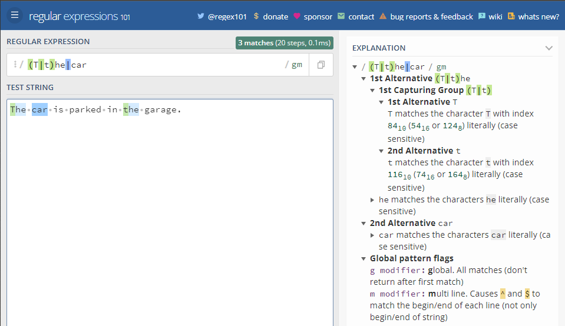

## 转码特殊字符
> - 反斜线 `\` 在表达式中用于转码紧跟其后的字符, 用于指定 `{ } [ ] / \ + * . $ ^ | ?` 这些特殊字符, 如果想要匹配这些特殊字符则要在其前面加上反斜线
> - 例如：`.` 是用来匹配除换行符外的所有字符的, 如果想要匹配句子中的 `.` 则要写成 `\.` 以下这个例子 `\.?` 是选择性匹配

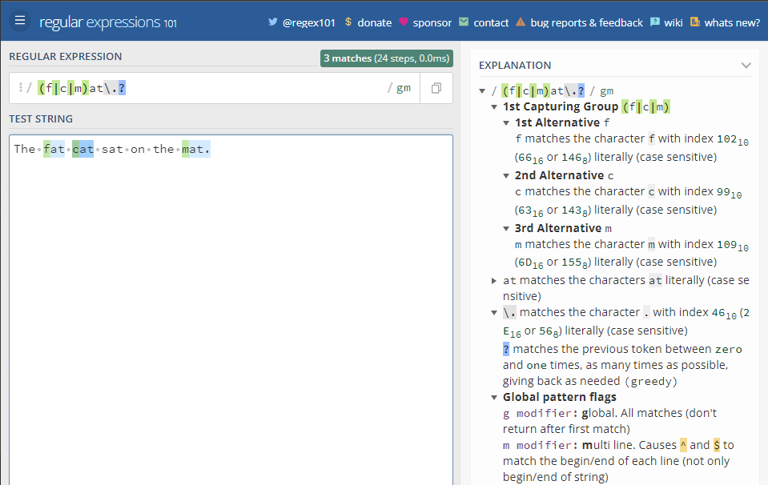

## 锚点 - `^` 号
> - 例如：`^(T|t)he` 匹配以 The 或 the 开头的字符串

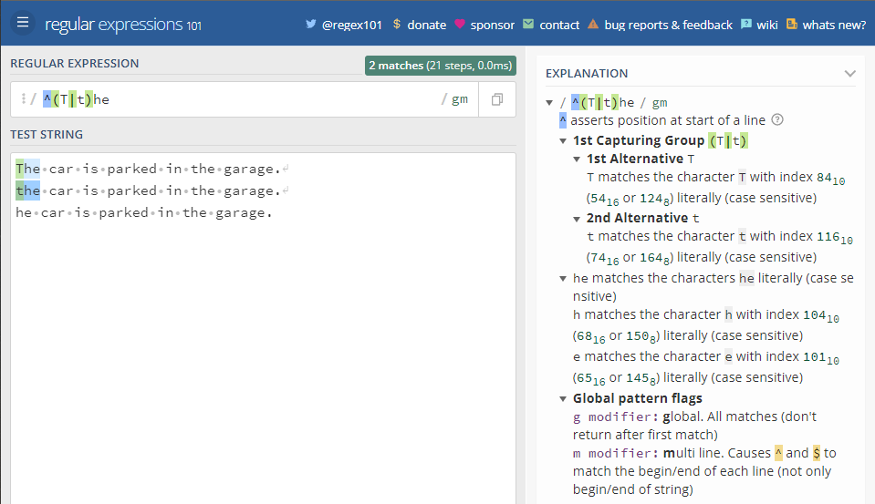

## 锚点 - `$` 号
> - 例如：`(at\.)$` 匹配以 at. 结尾的字符串

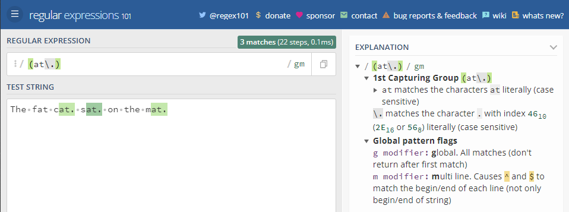

# 简写字符集
|简写|描述|
|:----:|:----:|
|.|除换行符外的所有字符|
|\w|匹配所有字母数字, 等同于 [a-zA-Z0-9_]|
|\W|匹配所有非字母数字, 即符号, 等同于：[^\w]|
|\d|匹配数字：[0-9]|
|\D|匹配非数字：[^\d]|
|\s|匹配所有空格字符, 等同于：[\t\n\f\r\p{Z}]|
|\S|匹配所有非空格字符：[^\s]|
|\f|匹配一个换页符|
|\n|匹配一个换行符|
|\r|匹配一个回车符|
|\t|匹配一个制表符|
|\v|匹配一个垂直制表符|
|\p|匹配 CR/LF (等同于 \r\n), 用来匹配 DOS 行终止符|

# 零宽度断言（前后预查）
> - 先行断言和后发断言都属于非捕获簇 (不捕获文本, 也不针对组合计进行计数), 先行断言用于判断所匹配的格式是否在另一个确定的格式之前, 匹配结果不包含该确定格式 (仅作为约束)
> - 例如：想要获得所有跟在 $ 符号后的数字, 我们可以使用正后发断言 `(?<=\$)[0-9\.]*`, 这个表达式匹配 $ 开头, 之后跟着 0,1,2,3,4,5,6,7,8,9,. 这些字符可以出现大于等于 0 次


> - 零宽度断言

|符号|描述|
|:----:|:----:|
|?=|正先行断言-存在|
|?!|负先行断言-排除|
|?<=|正后发断言-存在|
|?<!|负后发断言-排除|

## ?=... 正先行断言
> - `?=...` 正先行断言, 表示第一部分表达式之后必须跟着 ?=... 定义的表达式
> - 返回结果只包含满足匹配条件的第一部分表达式, 定义一个正先行断言要使用 (), 在括号内部使用一个问号和等号：`(?=...)`
> - 正先行断言的内容写在括号中的等号后面, 例如：表达式 `(T|t)he(?=\sfat)` 匹配 The 和 the, 在括号中又定义了正先行断言 `(?=\sfat)`, 即 The 和 the 后面紧跟着 (空格)fat


## ?!... 负先行断言
> - 负先行断言 `?!` 用于筛选所有匹配结果, 筛选条件为其后不跟随着断言中定义的格式, 正先行断言定义和负先行断言一样, 区别就是 = 替换成 ! 也就是 (?!...)
> - 例如：表达式 `(T|t)he(?!\sfat)` 匹配 The 和 the, 且其后不跟着 (空格)fat

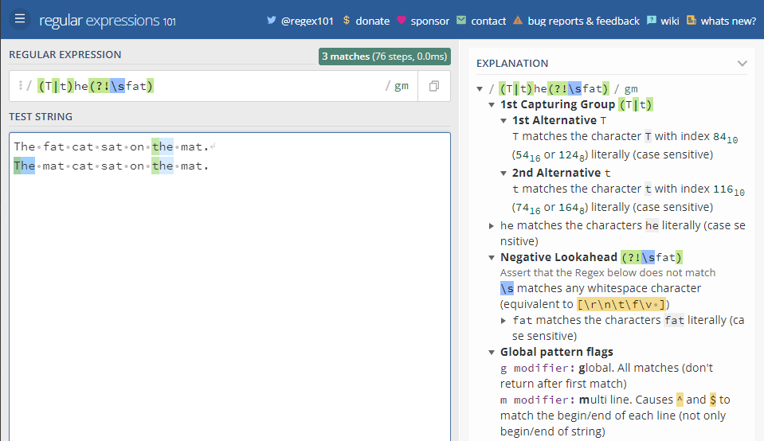

## ?<= ... 正后发断言
> - 正后发断言记作 `(?<=...)`, 用于筛选所有匹配结果, 筛选条件为其前跟随着断言中定义的格式
> - 例如：表达式 `(?<=(T|t)he\s)(fat|mat)` 匹配 fat 和 mat, 且其前跟着 The 或 the

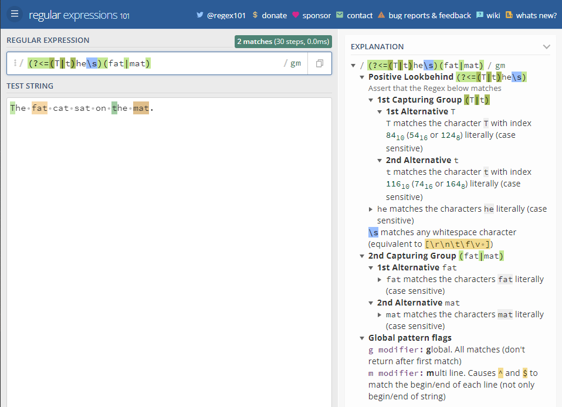

## ?<!... 负后发断言
> - 负后发断言记作 `(?<!...)`, 用于筛选所有匹配结果, 筛选条件为其前不跟随着断言中定义的格式
> - 例如：表达式 `(?<!(T|t)he\s)(cat)` 匹配 cat, 且其前不跟着 The 或 the


# 标志
> - 标志也叫模式修正符, 因为它可以用来修改表达式的搜索结果, 这些标志可以任意的组合使用, 它也是整个正则表达式的一部分

|标志|描述|
|:----:|:----:|
|i|忽略大小写|
|g|全局搜索|
|m|多行修饰符：锚点元字符 `^ $` 工作范围在每行的起始|

## 忽略大小写 (Case Insensitive)
> - 修饰语 `i` 用于忽略大小写
> - 例如：表达式 `/The/gi` 表示在全局搜索 The, 在后面的 i 将其条件修改为忽略大小写, 则变成搜索 the 和 The, g 表示全局搜索


## 全局搜索 (Global search)
> - 修饰符 `g` 常用于执行一个全局搜索匹配, 即 (不仅仅返回第一个匹配的, 而是返回全部)
> - 例如：表达式 `/.(at)/g` 表示搜索任意字符 (除了换行) + at, 并返回全部结果


## 多行修饰符 (Multiline)
> - 多行修饰符 `m` 常用于执行一个多行匹配
> - 之前介绍的 `(^,$)` 用于检查格式是否是在待检测字符串的开头或结尾, 但如果想要它在每行的开头和结尾生效, 就需要用到多行修饰符 m
> - 例如：表达式 `/at(.)?$/gm` 表示小写字符 a 后跟小写字符 t, 末尾可选除换行符外任意字符, 根据 m 修饰符, 表现在表达式匹配每行的结尾


# 贪婪匹配与惰性匹配 (Greedy vs lazy matching)
> - 正则表达式默认采用贪婪匹配模式, 在该模式下意味着会匹配尽可能长的子串, 可以使用 `?` 将贪婪匹配模式转化为惰性匹配模式

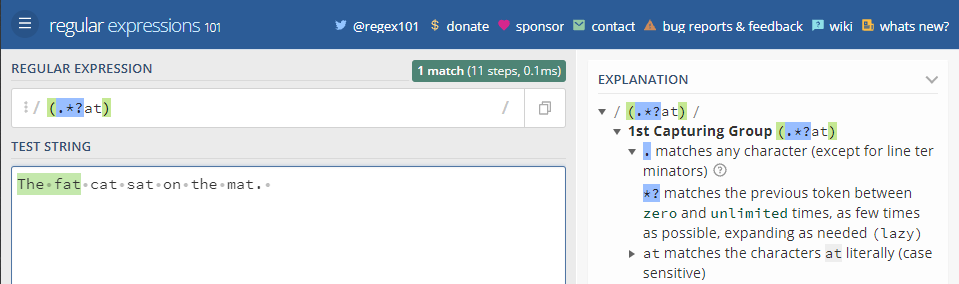