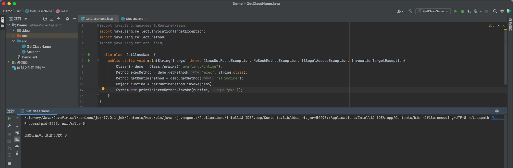

# 前言
> 在之前粗略的了解了一下 Java 的反射机制，这里进一步总结一下 Java 安全中反射的知识点

# Java 反射机制定义
> Java反射机制是在运行状态中，对于任意一个类，都能够知道这个类中的所有属性和方法
> 对于任意一个对象，都能够调用它的任意一个方法和属性
> 这种动态获取的信息以及动态调用对象的方法的功能称为 Java 语言的反射机制

> 需要注意的是：Java 的反序列化问题都基于反射机制

# Java 反射机制功能
> 1. 在运行时判断任意一个对象所属的类
> 2. 在运行时构造任意一个类的对象
> 3. 在运行时判断任意一个类所具有的成员变量和方法
> 4. 在运行时调用任意一个方法
> 5. 生成动态代理

# Java 反射机制应用场景
> 1. 逆向代码
> 2. 与注解相结合的框架
> 3. 单纯的反射机制应用框架
> 4. 动态生成类框架

# 反射常见的几种使用方法
> 获取类：forName()
> 实例化类的对象：newInstance()
> 获取函数：getMethod()
> 执行函数：invoke()

# 获取 Class 对象的方法
```java
1、
Class demo1 = ReflectDemo.class;

2、
ReflectDemo reflectDemo = new ReflectDemo();
Class demo2 = reflectDemo.getClass();

3、
Class demo3 = Class.forName("reflectdemo.ReflectDemo");

4、
Class demo4 = ClassLoader.getSystemClassLoader().loadClass("reflectdemo.ReflectDemo");
```

# 获取成员变量 Field
```java
import java.lang.reflect.Field

Field[] getFields(): 获取所有 public 修饰的成员变量
Field[] getDeclaredFields(): 获取所有的成员变量，不考虑修饰符
Field getField(String name): 获取指定名称的 public 修饰的成员变量
Field getDeclaredField(String name): 获取指定的成员变量 
```

# 获取成员方法 Method
```java
//第一个参数获取该方法的名字，第二个参数获取标识该方法的参数类型
Method getMethod(String name, 类<?>... parameterTypes) //返回该类所声明的public方法
Method getDeclaredMethod(String name, 类<?>... parameterTypes) //返回该类所声明的所有方法

Method[] getMethods() //获取所有的public方法，包括类自身声明的public方法，父类中的public方法、实现的接口方法
Method[] getDeclaredMethods() // 获取该类中的所有方法
```

# 获取构造函数
```java
Constructor<?>[] getConstructors() ：只返回public构造函数
Constructor<?>[] getDeclaredConstructors() ：返回所有构造函数
Constructor<> getConstructor(类<?>... parameterTypes) : 匹配和参数配型相符的public构造函数
Constructor<> getDeclaredConstructor(类<?>... parameterTypes) ： 匹配和参数配型相符的构造函数
```

# 利用 Java 反射机制创建类对象
> 可以通过反射来生成实例化对象，一般使用 Class 对象的 `newInstance()` 方法来进行创建类对象，使用的方式只需要通过 `forName()` 方法获取到的 class 对象中进行 `newInstance()` 方法创建即可

```java
Class demo = Class.forName("com.reflect.MethodDemo");    //创建 Class 对象
Object test = demo.newInstance();
```

# 利用 Java 反射机制创建类并执行方法
```java
import java.lang.reflect.Method;

public class ReflectDemo {
    public void reflectMethod() {
        System.out.println("成功反射");
    }
    public static void main(String[] args) {
        try {
            Class demo = Class.forName("com.reflect.ReflectDemo");  //创建 Class 对象
            Object test = demo.newInstance();   //创建实例对象
            Method method = demo.getMethod("reflectMethod");    //创建 reflectMethod 方法
            method.invoke(test);    //调用实例对象方法
        } catch (Exception e) {
            e.printStackTrace();
        }
    }
}
```

# 命令执行
> 除了系统类，想拿到一个类时需要先使用 import，而利用 forName 就不需要这个步骤，这在攻击时是非常有利的，可以加载任意类；同时，forName 可以获取内部类

> 有时候通过 forName 获得类之后使用 newInstance 来调用这个类的无参构造函数会失败，原因有：

```java
1、使用的类没有无参构造函数
2、使用的类构造函数是私有的

例如：不能利用如下 Payload 来直接执行命令，其原因就是 Runtime 类的构造方法是私有的
Class demo = Class.forName("java.lang.Runtime");
demo.getMethod("exec", String.class).invoke(demo.newInstance(), "whoami");
```

> 但还是有方法获取到这个类的，这涉及到单例模式
> 例如，对于Web应用来说，数据库连接只需要建立一次，而不是每次用到数据库的时候再新建立一个连接，此时作为开发者就可以将数据库连接使用的类的构造函数设置为私有，然后编写一个静态方法来获取，之后获取这个类的方法就是 getInstance

```java
public class TrainDB {
	private static TrainDB instance = new TrainDB();
	public static TrainDB getInstance() {
		return instance;
	}
    private TrainDB() {
		// 建立连接的代码...
    }
```

> 参照上面的方法，Runtime 类就是单例模式，只能通过 `Runtime.getRuntime()` 来获取到 Runtime 对象，Payload 如下

```java
Class demo = Class.forName("java.lang.Runtime");
demo.getMethod("exec", String.class).invoke(demo.getMethod("getRuntime").invoke(demo.newInstance(), "whoami"));
```

> Runtime.exec有6个重载，第一个重载，它只有一个参数，类型是String，所以使用 `getMethod(“exec”, String.class)` 来获取 `Runtime.exec` 方法
> invoke 的作用是执行方法，它的第一个参数是：
> 1. 如果这个方法是一个普通方法，那么第一个参数是类对象
> 2. 如果这个方法是一个静态方法，那么第一个参数是类

> 正常执行方法是 `[1].method([2], [3], [4]…)`，在反射里就是 `method.invoke([1], [2], [3], [4]…)`
> 所以将上述命令执行的 Payload 分解一下就是

```java
Class demo = Class.forName("java.lang.Runtime");
Method execMethod = demo.getMethod("exec", String.class);
Method getRuntimeMethod = demo.getMethod("getRuntime");
Object runtime = getRuntimeMethod.invoke(demo);
execMethod.invoke(runtime, "calc.exe");
```



# 无构造方法与无单例模式静态方法来反射实例化该类
> 这里需要引入新的反射方法 `getConstructor`，与 `getMethod` 类似，该方法接收的参数是构造函数列表类型，由于构造函数也支持重载，因此必须用参数列表类型才能唯一确定一个构造函数，获取到构造类之后使用 newInstance 来执行

```java
ProcessBuilder 的构造函数

public ProcessBuilder(List<String> command)
public ProcessBuilder(String... command)
```

> 例如，常用的另一种执行命令的方式为 `ProcessBuilder`，使用反射来获取其构造函数，然后调用 `start()` 来执行命令

```java
Class demo = Class.forName("java.lang.ProcessBuilder");
((ProcessBuilder) demo.getConstructor(List.class).newInstance(Arrays.asList("whoami"))).start();
```

> 上面用到了第一个形式的构造函数，所以在 `getConstructor` 的时候传入的是 `List.class`
> 但是前面这个 Payload 用到了 Java 里的强制类型转换，有时候利用漏洞的时候（在表达式上下文中）是没有这种语法的，所以，仍需利用反射来完成这一步

```java
Class demo = Class.forName("java.lang.ProcessBuilder");
demo.getMethod("start").invoke(demo.getConstructor(List.class).newInstance(Arrays.asList(whoami)));
```

> 通过 `getMethod(“start”)` 获取到 start 方法，然后 invoke 执行，invoke 的第一个参数就是 `ProcessBuilder Object` 了,如果要使用 `public ProcessBuilder(String… command)` 这个构造函数，就涉及到 Java 里的可变长参数 `(varargs)`了，即定义函数的时候不确定参数数量的时候可以使用 `…` 这样的语法来表示"这个函数的参数个数是可变的"，对于可变长参数，Java 其实在编译的时候会编译成一个数组，如下这两种写法在底层是等价的（也就不能重载）

```java
public void hello(String[] names) {}
public void hello(String...names) {}
```

> 那么对于反射来说，如果要获取的目标函数里包含可变长参数，当作数组处理即可，所以可以将将字符串数组的类 `String[].class` 传给 `getConstructor` 来获取 `ProcessBuilder` 的第二种构造函数

```java
Class demo = Class.forName("java.lang.ProcessBuilder");
demo.getConstructor(String[].class);
```

> 在调用 `newInstance` 的时候，因为这个函数本身接收的是一个可变长参数，传给 `ProcessBuilder` 的也是一个可变长参数，二者叠加为一个二维数组，所以整个 Payload 如下

```java
Class clazz = Class.forName("java.lang.ProcessBuilder");
((ProcessBuilder)clazz.getConstructor(String[].class).newInstance(new String[][]{{"whoami"}})).start();
```

# getDeclared 系列反射
> getMethod 系列方法获取的是当前类中所有公共方法，包括从父类继承的方法
> getDeclaredMethod 系列方法获取的是当前类中"声明"的方法，是实在写在这个类里的，包括私有的方法，但不包括从父类里继承来的方法

> 例如之前说过 Runtime 这个类的构造函数是私有的，需要用 `Runtime.getRuntime()` 来获取对象，现在也可以直接用 `getDeclaredConstructor` 来获取这个私有的构造方法来实例化对象，进而执行命令

```java
Class demo = Class.forName("java.lang.Runtime");
Constructor test = demo.getDeclaredConstructor();
test.setAccessible(true);
demo.getMethod("exec", String.class).invoke(test.newInstance(), "whoami");
```
