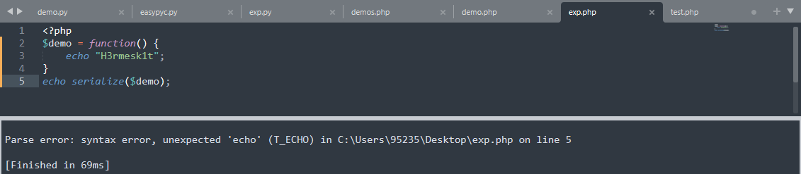

# 匿名函数
> 在 Manual 中的定义为：[匿名函数](https://www.php.net/manual/zh/functions.anonymous.php)(Anonymous functions)，也叫闭包函数(closures)，允许临时创建一个没有指定名称的函数，最经常用作回调函数 callable 参数的值，匿名函数目前是通过 [Closure](https://www.php.net/manual/zh/class.closure.php) 类来实现的

# Closure 序列化


> 既然是一个类，就应该具有序列化和反序列化的操作，但是上图代码中可以看出 PHP 并没有提供序列化闭包的操作，这里需要引入一个依赖：[Opis Closure](https://github.com/opis/closure)，`Opis Closure`实现了PHP没有提供的反序列化闭包操作
> 这里可以用 composer 获取，也可以通过 GitHub 下载

```bash
composer require opis/closure
git clone https://hub.fastgit.org/opis/closure.git
```

