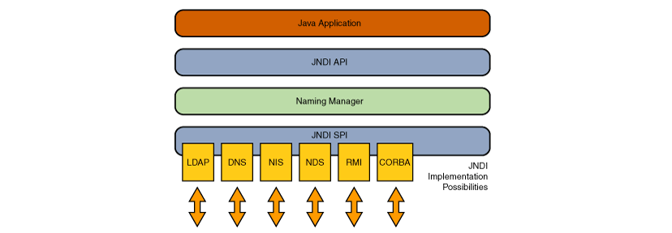

# JNDI 概述
> 在`Java-Documentation`中对`JNDI`的描述是：

```text
The Java Naming and Directory Interface™ (JNDI) is an application programming interface (API) that provides naming and directory functionality to applications written using the Java™ programming language. It is defined to be independent of any specific directory service implementation. Thus a variety of directories -new, emerging, and already deployed can be accessed in a common way.

The JNDI architecture consists of an API and a service provider interface (SPI). Java applications use the JNDI API to access a variety of naming and directory services. The SPI enables a variety of naming and directory services to be plugged in transparently, thereby allowing the Java application using the JNDI API to access their services. 

JNDI is included in the Java SE Platform. To use the JNDI, you must have the JNDI classes and one or more service providers. The JDK includes service providers for the following naming/directory services:
    Lightweight Directory Access Protocol (LDAP)
    Common Object Request Broker Architecture (CORBA) Common Object Services (COS) name service
    Java Remote Method Invocation (RMI) Registry
    Domain Name Service (DNS)
```


> 简单来说，`JNDI`就是一组`API`接口，通过不同的访问提供者接口`JNDI`服务供应接口(`SPI`)的实现，由管理者将`JNDI API`映射为特定的命名服务和目录系统，使得`Java`应用程序可以和这些命名服务和目录服务之间进行交互。

> JNDI可访问的现有的目录及服务有：

```text
DNS、XNam、Novell目录服务、LDAP(Lightweight Directory Access Protocol轻型目录访问协议)、CORBA对象服务、文件系统、Windows XP/2000/NT/Me/9x的注册表、RMI、DSML v1&v2、NIS
```
> 在`JDK`中对`JNDI`提供了`5`个包用来实现功能，分别是：

```text
javax.naming
主要用于命名操作，它包含了命名服务的类和接口，该包定义了Context接口和InitialContext类

javax.naming.directory
主要用于目录操作，它定义了DirContext接口和InitialDir-Context类

javax.naming.event
在命名目录服务器中请求事件通知

javax.naming.ldap
提供LDAP支持

javax.naming.spi
允许动态插入不同实现，为不同命名目录服务供应商的开发人员提供开发和实现的途径，以便应用程序通过JNDI可以访问相关服务
```

