# 前言
在后续学习`fastjson`等`JAVA`反序列化漏洞时，需要先了解`RMI`机制和`JNDI`注入等知识点，因此借用本篇文章来记录学习一下`RMI`机制

# 概念原理
`RMI`是远程方法调用的简称，能够帮助我们查找并执行远程对象的方法。简单来说，远程调用就像将一个`class`放在`A`机器上，然后在`B`机器中调用这个`class`的方法。

`RMI`（Remote Method Invocation）为远程方法调用，是允许运行在一个`Java`虚拟机的对象调用运行在另一个`Java`虚拟机上的对象的方法，这两个虚拟机可以是运行在相同计算机上的不同进程中，也可以是运行在网络上的不同计算机中。

`Java RMI`（Java Remote Method Invocation）是`Java`编程语言里一种用于实现远程过程调用的应用程序编程接口，它使客户机上运行的程序可以调用远程服务器上的对象。远程方法调用特性使`Java`编程人员能够在网络环境中分布操作，`RMI`全部的宗旨就是尽可能简化远程接口对象的使用。

从客户端-服务器模型来看，客户端程序直接调用服务端，两者之间是通过`JRMP`（ Java Remote Method Protocol）协议通信，这个协议类似于`HTTP`协议，规定了客户端和服务端通信要满足的规范。

在`RMI`中对象是通过序列化方式进行编码传输的，`RMI`分为三个主体部分:

> * Client-客户端：客户端调用服务端的方法
> * Server-服务端：远程调用方法对象的提供者，也是代码真正执行的地方，执行结束会返回给客户端一个方法执行的结果
> * Registry-注册中心：其实本质就是一个map，相当于是字典一样，用于客户端查询要调用的方法的引用，在低版本的JDK中，Server与Registry是可以不在一台服务器上的，而在高版本的JDK中，Server与Registry只能在一台服务器上，否则无法注册成功

总体`RMI`的调用实现目的就是调用远程机器的类跟调用一个写在自己的本地的类一样，唯一区别就是`RMI`服务端提供的方法，被调用的时候该方法是执行在服务端

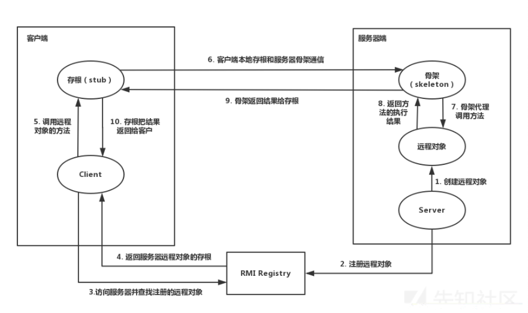

# RMI实现过程
`RMI`可以调用远程的一个`Java`的对象进行本地执行，但是远程被调用的该类必须继承`java.rmi.Remote`接口。
## RMI服务端
### 定义一个远程接口

```java
package RMI.Interface;

import java.rmi.Remote;
import java.rmi.RemoteException;

/**
 * @Author: H3rmesk1t
 * @Data: 2021/12/16 5:32 下午
 */
public interface DemoInterface extends Remote {
    public String ctf() throws RemoteException;
}
```

要求

> * 使用public声明，否则客户端在尝试加载实现远程接口的远程对象时会出错（如果客户端、服务端放一起没关系）
> * 同时需要继承Remote类
> * 接口的方法需要声明java.rmi.RemoteException报错
> * 服务端实现这个远程接口

### 服务端实现远程接口
```java
package RMI.Server;

import java.rmi.Naming;
import java.rmi.RemoteException;
import java.rmi.registry.LocateRegistry;
import java.rmi.server.UnicastRemoteObject;

/**
 * @Author: H3rmesk1t
 * @Data: 2021/12/16 5:33 下午
 */
public class RMIServer extends UnicastRemoteObject implements RMI.Interface.DemoInterface {
    public RMIServer() throws RemoteException {
        super();
    }

    public String ctf() throws RemoteException {
        System.out.println("Ctfer is so cool!");
        return "Hello World!";
    }

    public void start() throws Exception {
        RMIServer rmiServer = new RMIServer();
        LocateRegistry.createRegistry(8888);
        Naming.rebind("rmi://127.0.0.1:8888/h3rmesk1t", rmiServer);
        System.out.println("RMI服务在9999端口已启动.");
    }

    public static void main(String[] args) throws Exception {
        new RMIServer().start();
    }
}
```

要求

> * 实现远程接口
> * 继承UnicastRemoteObject类，貌似继承了之后会使用默认socket进行通讯，并且该实现类会一直运行在服务器上（如果不继承UnicastRemoteObject类，则需要手工初始化远程对象，在远程对象的构造方法的调用UnicastRemoteObject.exportObject()静态方法）
> * 构造函数需要抛出一个RemoteException错误
> * 实现类中使用的对象必须都可序列化，即都继承java.io.Serializable

## RMI客户端
```java
package RMI.Client;

import RMI.Interface.DemoInterface;

import java.net.MalformedURLException;
import java.rmi.Naming;
import java.rmi.NotBoundException;
import java.rmi.RemoteException;

/**
 * @Author: H3rmesk1t
 * @Data: 2021/12/16 5:40 下午
 */
public class RMIClient {
    public static void main(String[] args) throws RemoteException, MalformedURLException, NotBoundException {
        DemoInterface demoInterface = (DemoInterface) Naming.lookup("rmi://127.0.0.1:8888/h3rmesk1t");

        String res = demoInterface.ctf();
        System.out.println(res);
    }
}
```

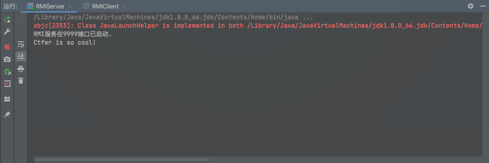

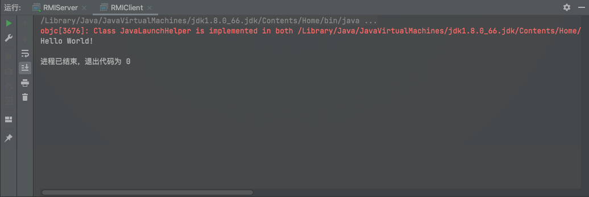

# 源码分析
获取注册中心有两种方式：一种是创建时获取（LocateRegistry#createRegistry），另外一种则是远程获取（LocateRegistry#getRegistry）

## 本地获取注册中心
跟踪源码，发现`createRegistry`有两种方法，区别在于其传递的参数不一样，第一种只需要传递`port`，即注册中心监听的端口，另一种在传递`port`的同时，还需要传递`RMIClientSocketFactory csf`和`RMIServerSocketFactory ssf`，这两种方法最后获取到的都是`Registrylmpl`对象

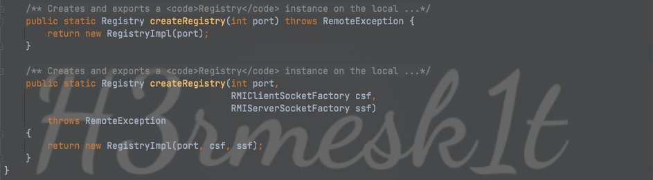

由于两种方法差别不大，因此这里选择分析第一种方法，跟进`Registrylmpl`，这里`new`了一个`LiveRef`对象，包括`ip`和监听的端口信息等

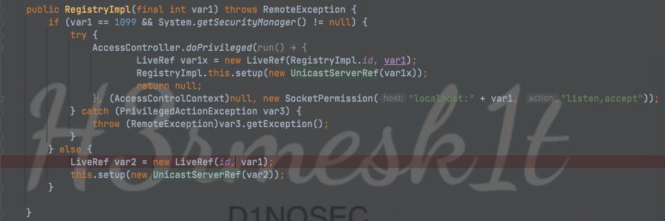

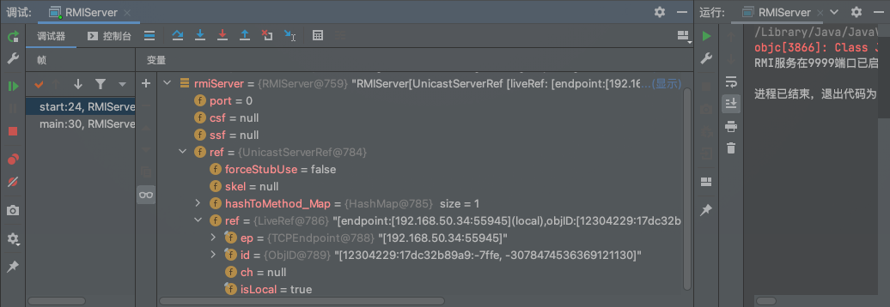

跟进`Registrylmpl#setup`

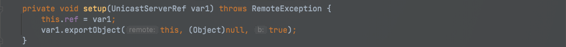

跟进`UnicastServerRef#exportObject`，

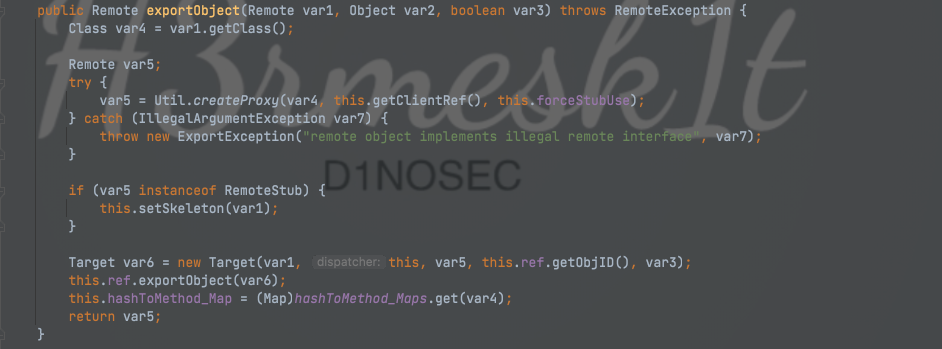

接着调用`Util.createProxy`方法

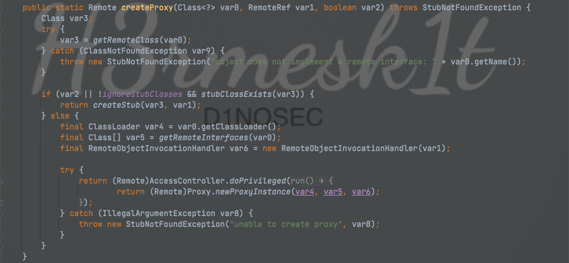

跟进`CreateStub`方法，这里返回`RegistryImpl_Stub`对象

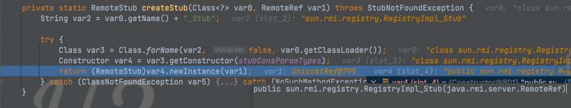

回到`UnicastServerRef.class`，因此`var5`也是`RegistryImpl_Stub`对象
进入`setSkeleton`方法，这里也利用`Util.createSkeleton`来获取`RegistryImpl_Skel`对象

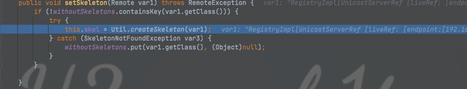

继续跟进，在创建完`RegistryImpl_Stub`和`RegistryImpl_Skel`对象后，会实例化创建一个`Target`对象

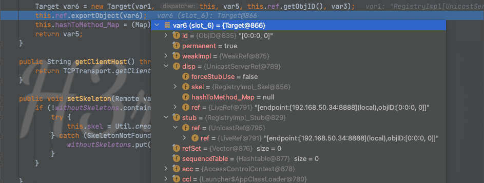

`var6`把上面获取到的`RegistryImpl_Stub`、`RegistryImpl_Skel`对象以及一些`ip`端口信息封装在一个对象里边，之后会调用`LiveRef#exportObject`，并且将`Target`对象传进去，接着会调用多个`exportObject`，进入到`TCPTransport#exportObject`中

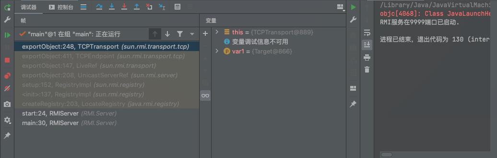

接着进入到网络层的操作，包括监听端口、设置当遇到请求时的处理方式等

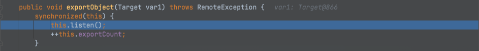

进入`listen`方法，调用`TCPEndpoint#newServerSocket`时会开启端口监听

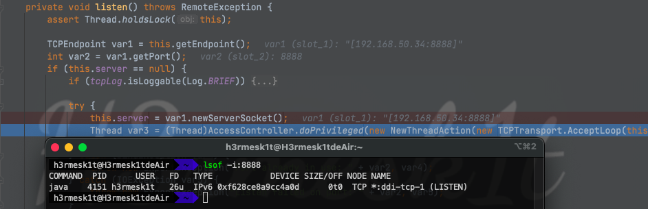

接着调用`TCPTransport#AcceptLoop`，设置`AcceptLoop`线程，触发`run`方法

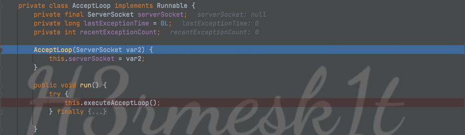

这里会获取到请求的一些相关信息，比如`Host`之类，之后在下边会创建一个线程调用`ConnectionHandler`来处理请求，跟入`ConnectionHandler#run`，紧接着调用`ConnectionHandler#run0`

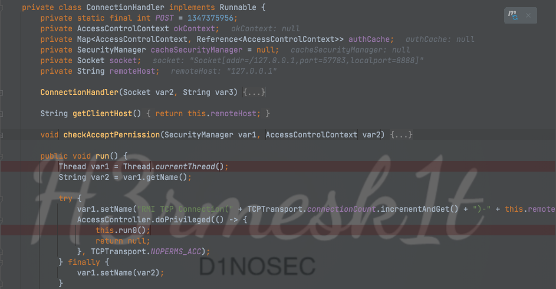

跟进下去，`var15`的值为`75`，从而在`switch-case`循环中进入`case 75` ,调用`TCPTransport#handleMessages`来处理请求，跟入`handlerMessages`，`var5`的值为`80`，进入`case 80`中

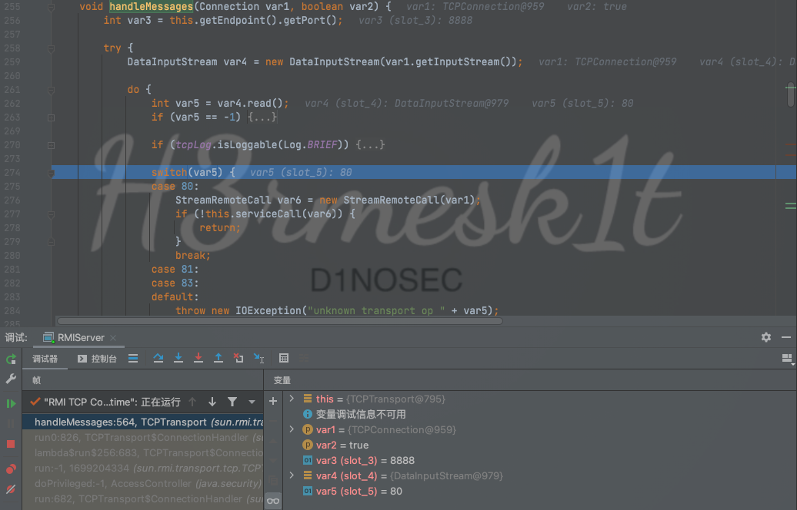

接着创建了一个`StreamRemoteCall`对象，并传入`var1`，`var1`是当前连接的`Connection`对象，接着跟入`TCPTransport#serviceCall`，获取了传来的一些信息，比如`ObjID`，接着会获取`Target`对象，在下边会调用`UnicastServerRef#dispatch`来处理请求

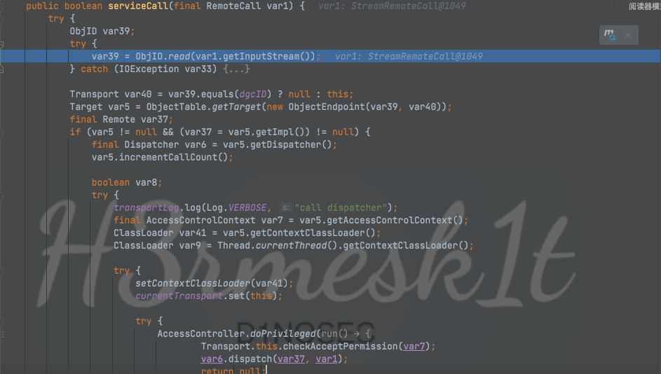

在`UnicastServerRef#dispatch`中传递了两个参数，一个是`Remote`对象，一个是当前连接的`StreamRemoteCall`对象

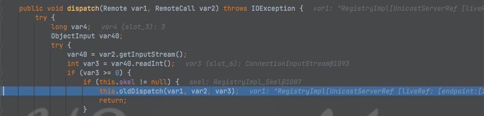

继续读入数据，接着调用`UnicastServerRef#oldDispatch`，调用`this.skel.dispatch`，这里的`this.skel`为刚刚创建的`RegistryImpl_Skel`对象，并调用其`dispatch`方法

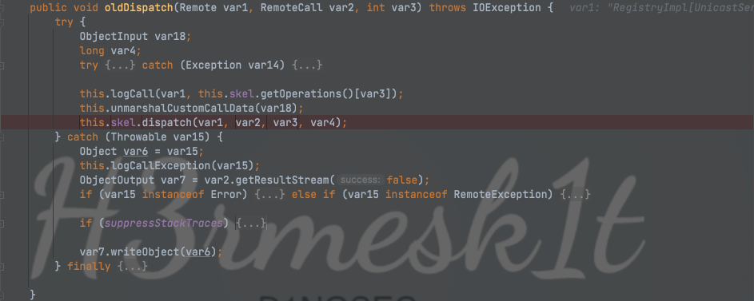

跟进`RegistryImpl_Skel#dispatch`，在这里进入真正处理请求的核心，`var3`是传递过来的`int`类型的参数，在这里有如下关系的对应

> * 0 -> bind
> * 1 -> list
> * 2 -> lookup
> * 3 -> rebind
> * 4 -> unbind

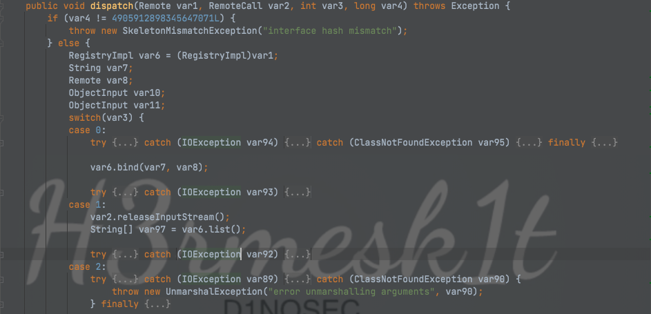

在这里会对每个调用的方法进行处理，例如前面代码中调用了`rebind`方法，就会先`readObject`反序列化传过来的序列化对象，之后再调用`var6.rebind`来注册服务，此时的`var6`为`RegistryImpl`对象，这个对象其实就是调用`createRegistry`获得的，无论是客户端还是服务端，最终其调用注册中心的方法都是通过对创建的`RegistryImpl`对象进行调用

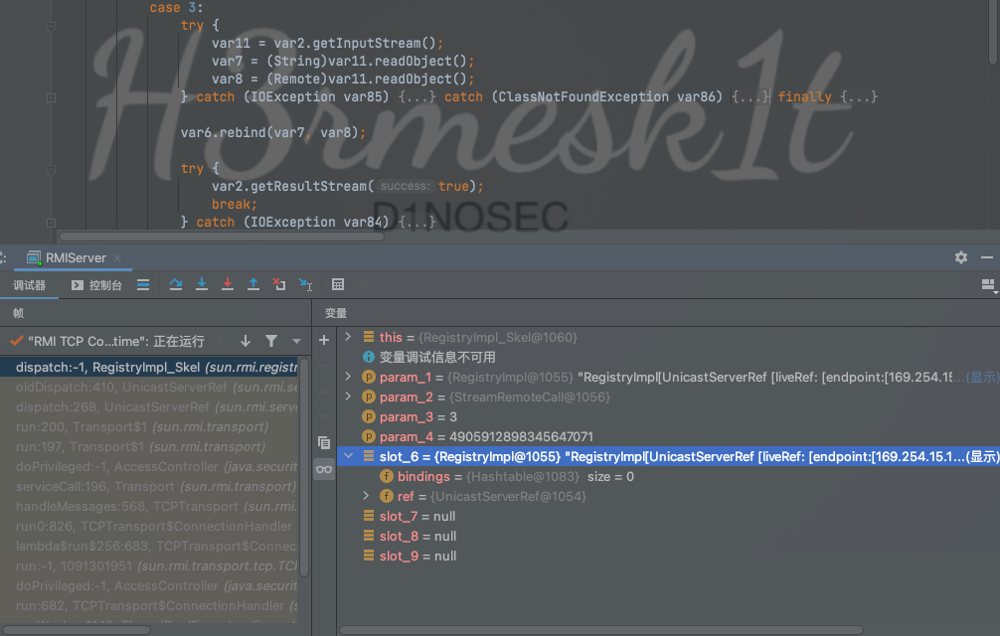

## 远程获取注册中心
通过`getRegistry`方法获得的对象是`RegistryImpl_Stub`对象，而通过`createRegistry`获得的对象是`RegistryImpl`对象

当调用这两者的方法时，其对应的处理方式也十分不同，以`rebind`方法举例，通过`createRegistry`获得的注册中心调用`bind`方法十分简单，在第一步会`checkAccess`，里边有一些判断，会对当前的权限、来源IP进行判断(高版本`JDK`中不允许除了`localhost`之外的地址注册服务也是在这里进行判断)，之后则将键和对象都`put`到`Hashtable`中

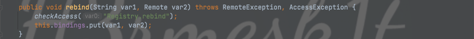


# RMI反序列化攻击


# 参考文章
[Java安全之RMI反序列化](https://xz.aliyun.com/t/9053)