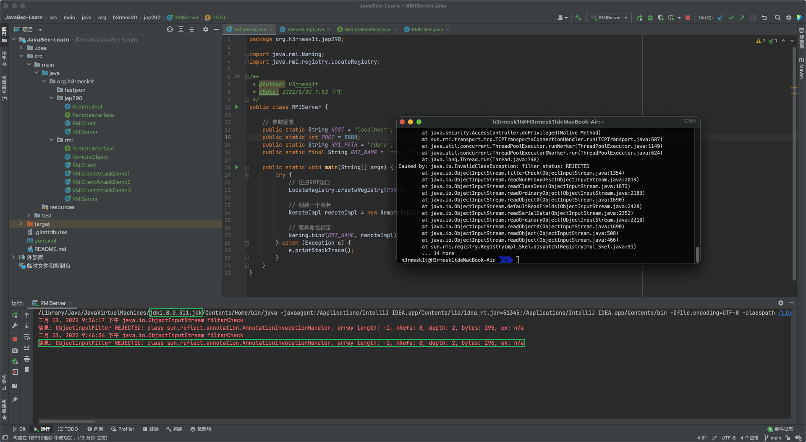
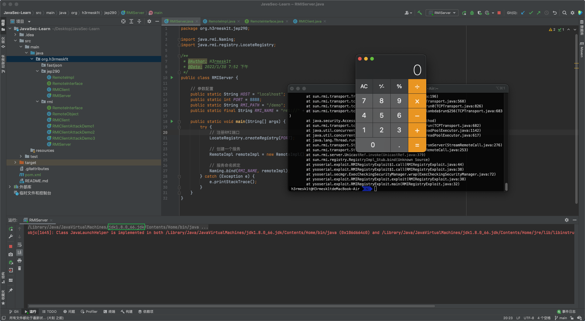
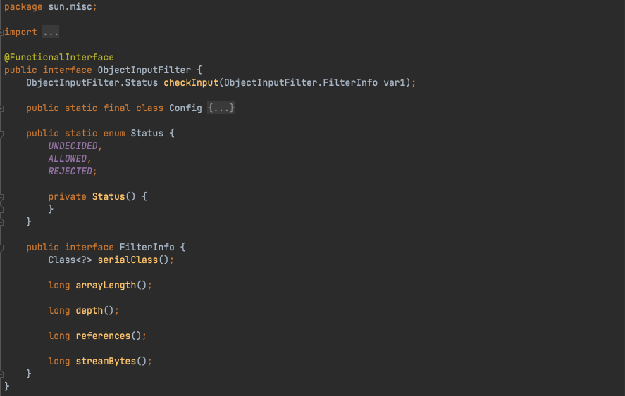
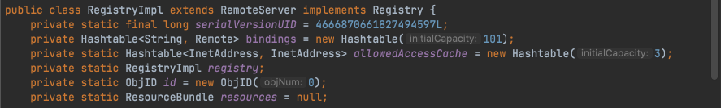

## 简介
`JEP 290`是`Java`底层为了缓解反序列化攻击提出的一种解决方案, 理想状态是让开发者只反序列化其想反序列化的类, 这样使用类似`CC链`这样的, 就会因为无法反序列化`Tranformer`、`HashMap`等, 从而没法触发漏洞.

[官方描述](http://openjdk.java.net/jeps/290)


`JEP 290`主要描述了如下几个机制:
 - Provide a flexible mechanism to narrow the classes that can be deserialized from any class available to an application down to a context-appropriate set of classes. (提供一个限制反序列化类的机制,白名单或者黑名单)
 - Provide metrics to the filter for graph size and complexity during deserialization to validate normal graph behaviors. (限制反序列化深度和复杂度)
 - Provide a mechanism for RMI-exported objects to validate the classes expected in invocations. (为 RMI 导出的对象设置了验证机制)
 - The filter mechanism must not require subclassing or modification to existing subclasses of ObjectInputStream. (过滤机制不得要求对 ObjectInputStream 的现有子类进行子类化或修改)
 - Define a global filter that can be configured by properties or a configuration file. (定义一个可配置的过滤机制, 比如可以通过配置properties文件的形式来定义过滤器)

`JEP 290`过滤规则如下:
 - 如果模式以" !"开头, 如果模式的其余部分匹配, 则该类被拒绝, 否则被接受.
 - 如果模式包含"/", 则"/"之前的非空前缀是模块名称. 如果模块名称与类的模块名称匹配, 则剩余模式与类名称匹配. 如果没有"/", 则不比较模块名称.
 - 如果模式以" .**"结尾, 则它匹配包和所有子包中的任何类
 - 如果模式以" .*"结尾, 则它匹配包中的任何类
 - 如果模式以" *"结尾, 它匹配任何以该模式为前缀的类.
 - 如果模式等于类名, 则匹配.
 - 否则状态未定.


`JEP 290`在`JDK 9`中加入, 但在`JDK 6,7,8`一些高版本中也添加了, 具体为`JDK 8u121`、`JDK 7u131`和`JDK 6u141`. [官方说明](https://blogs.oracle.com/java-platform-group/filter-incoming-serialization-data-a-little-of-jdk-9-goodness-available-now-in-current-release-families)


## JEP290实际限制
这里用`8u311`和`8u66`来做比较, 示例代码如下:

 - RMIServer.java
```java
package org.h3rmesk1t.jep290;

import java.rmi.Naming;
import java.rmi.registry.LocateRegistry;

/**
 * @Author: H3rmesk1t
 * @Data: 2022/1/30 7:52 下午
 */
public class RMIServer {

    // 参数配置
    public static String HOST = "localhost";
    public static int PORT = 8888;
    public static String RMI_PATH = "/demo";
    public static final String RMI_NAME = "rmi://" + HOST + ":" + PORT + RMI_PATH;

    public static void main(String[] args) {
        try {
            // 注册RMI端口
            LocateRegistry.createRegistry(PORT);

            // 创建一个服务
            RemoteImpl remoteImpl = new RemoteImpl();

            // 服务命名绑定
            Naming.bind(RMI_NAME, remoteImpl);
        } catch (Exception e) {
            e.printStackTrace();
        }
    }
}
```

 - RemoteImpl.java
```java
package org.h3rmesk1t.jep290;

import java.rmi.RemoteException;
import java.rmi.server.UnicastRemoteObject;

/**
 * @Author: H3rmesk1t
 * @Data: 2022/1/30 7:53 下午
 */
public class RemoteImpl extends UnicastRemoteObject implements RemoteInterface {

    protected RemoteImpl() throws RemoteException {
    }

    @Override
    public String demo() throws RemoteException {
        return "Hello, h3rmesk1t!";
    }

    @Override
    public String demo(Object object) throws RemoteException {
        return object.getClass().getName();
    }
}
```

 - RemoteInterface.java
```java
package org.h3rmesk1t.jep290;

import java.rmi.Remote;
import java.rmi.RemoteException;

/**
 * @Author: H3rmesk1t
 * @Data: 2022/1/30 7:53 下午
 */
public interface RemoteInterface extends Remote {

    public String demo() throws RemoteException;

    public String demo(Object object) throws RemoteException;
}
```

利用`ysoserial`项目中的`ysoserial.exploit.RMIRegistryExploit`来进行攻击, 可以发现当`jdk8`版本大于`8u121`时来启动`RMIServer`, 会显示攻击失败; 而低于`8u121`时, 则可以成功攻击, 弹出计算器.





## 核心类
`JEP 290`涉及的核心类有: `ObjectInputStream`类, `ObjectInputFilter`接口, `Config`静态类以及`Global`静态类. 其中`Config`类是`ObjectInputFilter`接口的内部类, `Global`类又是`Config`类的内部类.


### ObjectInputStream 类
跟进之前测试时的报错信息, 跟进`java.io.ObjectInputStream`类, `JEP 290`进行过滤的具体实现方法是在`ObjectInputStream`类中增加了一个`serialFilter`属性和一个`filterChcek`函数, 两者搭配来实现过滤.

#### 构造函数
在`ObjectInputStream`类中含有两个构造函数, 需要注意的是, 在这两个构造函数中都会给属性`serialFilter`赋值为`Config.getSerialFilterFactorySingleton().apply(null, Config.getSerialFilter())`.


跟进`Config.getSerialFilter()`, 可以看到`ObjectInputFilter.Config.getSerialFilter()`返回`ObjectInputFilter#Config`静态类中的`serialFilter`静态字段.


#### serialFilter 属性
`serialFilter`属性是一个`ObjectInputFilter`接口类型, 并且这个接口声明了一个`checkInput`方法.


#### filterCheck 函数
在`filterCheck`函数中, 函数逻辑流程大致可以分为三步:
  1. 先判断`serialFilter`的属性值是否为`null`, 当不为`null`时则会进行过滤操作.
  2. 当判断`serialFilter`的属性值不为`null`后, 创建一个`FilterValues`对象, 并把需要检查的信息封装进去, 再调用`serialFilter.checkInput`方法进行判断, 并返回`ObjectInputFilter.Status`类型的返回值
  3. 根据返回值进行判断, 当返回值为`null`或`ObjectInputFilter.Status.REJECTED`时会抛出异常.


### ObjectInputFilter 接口
该接口是`JEP 290`中实现过滤操作的一个最基础的接口, 在低于`JDK 9`的时候的全限定名是`sun.misc.ObjectInputFIlter`, `JDK 9`及以上是`java.io.ObjectInputFilter`. `ObjectInputFilter`接口的结构大致分为`checkInput`函数、`Config`静态类、`FilterInfo`接口、`Status`枚举类.



### Config 静态类
`Config`静态类是`ObjcectInputFilter`接口的一个内部静态类. 在初始化时, 会将`Config.serialFilter`赋值为一个`Global`对象, 而`ObjectInputStream`的构造函数中取的就是` Config.serialFilter`这个静态字段, 所以设置了`Config.serialFilter`这个静态字段就相当于设置了`ObjectInputStream`类全局过滤器. 


这里可以通过配置`JVM`的`jdk.serialFilter`或者`%JAVA_HOME%\conf\security\java.security`文件的`jdk.serialFilter`字段值, 来设置`Config.serialFilter`, 也是设置了全局过滤. 另外还有就是一些框架, 在开始的时候设置也会设置`Config.serialFilter`, 来设置`ObjectInputStream`类的全局过滤, 例如`weblogic`在启动的时候会设置`Config.serialFilter`为`WebLogicObjectInputFilterWrapper`对象.

#### createFilte 方法
`Config#createFilter`会进一步调用`Global.createFilter`方法, 主要功能就是将传入的`JEP 290`规则字符串解析到`Global`对象的`filters`字段上, 并且返回这个`Global`对象.


#### getSerialFilter 方法
`Config#getSerialFilter`主要功能就是返回`Config#serialFilter`的字段值.


### Global 静态类
`Global`静态类是`Config`类中的一个内部静态类, 其重要特征是实现了`ObjectInputFilter`接口中的`checkInput`方法. 所以`Global`类可以直接赋值到`ObjectInputStream.serialFilter`上.

#### 构造函数
`Global`中的构造函数会解析`JEP 290`规则为对应的`lambda`表达式, 然后添加到`Global.filters`.


#### filters 字段
`filters`字段作为一个函数列表, 用来后续过滤操作.

#### checkInput 方法
`checkInput`方法会遍历`filters`来检测要反序列化的类.


## 过滤器
在核心类中的`ObjectInputStream`类中说过, 配置过滤器其实就是设置`ObjectInputStream`类中的`serialFilter`属性. 根据上文提到的过滤配置规则也不难看出过滤器的类型有两种:
 1. 通过配置文件或者`JVM`属性来配置的全局过滤器.
 2. 通过改变`ObjectInputStream`的`serialFilter`属性来配置的局部过滤器.

### 全局过滤器
全局过滤器实际上就是通过设置`Config`静态类中的`serialFilter`静态字段值来进行过滤. 上文中也提到了在`ObjectInputStream`的两个构造方法中都会`serialFilter`属性赋值`Config.getSerialFilterFactorySingleton().apply(null, Config.getSerialFilter())`, 通过调用链可以知道最后返回的是`Config#serialFilter`.

#### jdk.serailFilter
上文中提到了`Config`静态类初始化的时候会解析`jdk.serailFilter`属性设置的`JEP 290`规则到一个`Global`对象的`filters`属性, 并且会将这个`Global`对象赋值到`Config`静态类的`serialFilter`属性上. 因此, `Config.serialFilter`值默认是解析`jdk.serailFilter`属性得到得到的`Global`对象.

### 局部过滤器
局部过滤器实际上是在`new objectInputStream`对象之后通过改变单个`ObjectInputStream`对象的`serialFilter`字段值来实现局部过滤, 通常有两种方法来达到该目的:
 - 通过调用`ObjectInputStream`对象的`setInternalObjectInputFilter`方法(低于`JDK 9`的时候是`getInternalObjectInputFilter`和`setInternalObjectInputFilter`, `JDK 9`以及以上是`getObjectInputFilter`和`setObjectInputFIlter`).


 - 通过调用`Config`静态类的`setObjectInputFIlter`方法.


## RMI 过滤机制
在`RMI`中采用的是局部过滤的机制, 对于`RMI`的学习具体可以看看之前的[Java安全学习-RMI学习](https://github.com/H3rmesk1t/Learning_summary/blob/main/2022-1-19/Java%E5%AE%89%E5%85%A8%E5%AD%A6%E4%B9%A0-RMI%E5%AD%A6%E4%B9%A0.md#)或者[官方文档](https://docs.oracle.com/javase/tutorial/rmi/overview.html)

### RegistryImpl 对象与 JEP290
`RegistryImpl`作为一个特殊的对象, 导出在`RMI`服务端, 客户端调用的`bind`、`lookup`、`list`等操作, 实际上是操作`RegistryImpl`的`bindings`这个`Hashtable`. `RegistryImpl`特殊在导出过程中生成的`Target`对象是一个"定制"的`Target`对象, 具体体现在:
 - 这个`Target`中`id`的`objNum`是固定的, 为`ObjID.REGISTRY_ID`, 也就是`0`.
 - 这个`Target`中`disp`是`filter`为`RegisryImpl::RegistryFilter`, `skel`为`RegsitryImpl_skel`的`UnicastServerRef`对象.
 - 这个`Target`中`stub`为`RegistryImpl_stub`.



#### 导出过程


## 参考
 - [漫谈 JEP 290](https://paper.seebug.org/1689/)
 - [RMI-JEP290的分析与绕过](https://www.anquanke.com/post/id/259059)
 - [反序列化漏洞的末日？JEP290机制研究](https://paper.seebug.org/454/)
 - [JEP 290: Filter Incoming Serialization Data](https://openjdk.java.net/jeps/290)

## 工具
学习时找`ysoserial`的现成`jar`包找了半天, 这里挂个链接(但愿不会寄了)方便后续学习和复习时用.
 - [ysoserial](https://jitpack.io/com/github/frohoff/ysoserial/)