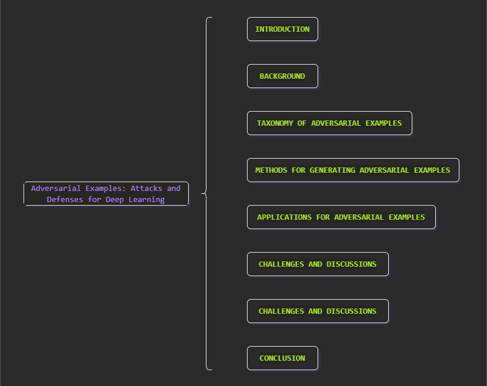
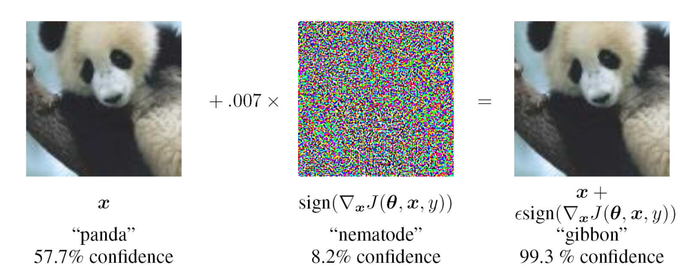
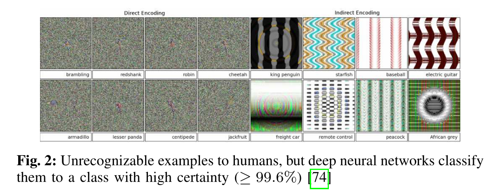
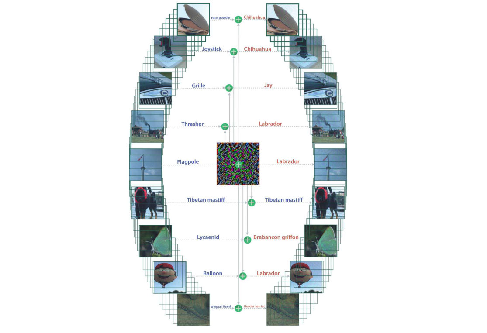
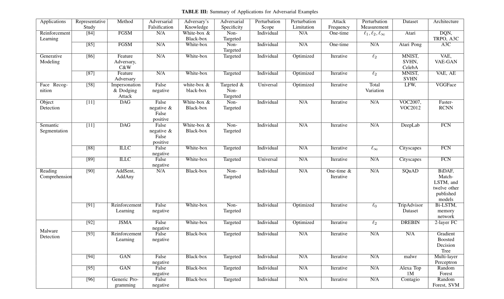
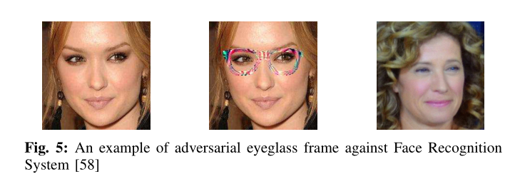
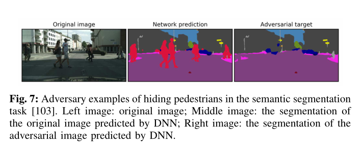
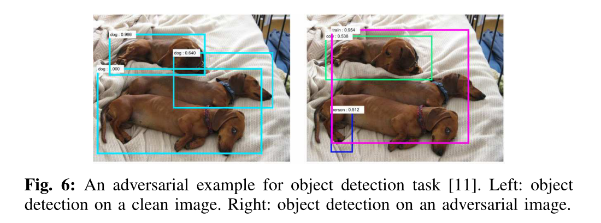
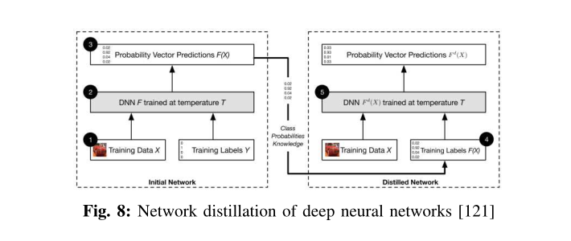
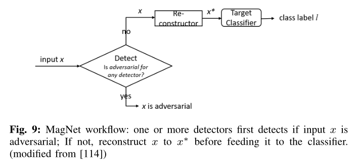

# 从论文学习对抗攻击—综述

Author: H3rmesk1t

Data: 2022.04.25

# 论文信息
[Adversarial Examples: Attacks and Defenses for Deep Learning](https://arxiv.org/abs/1712.07107).

# 论文研究背景
随着深度学习在广泛的应用领域的快速进展和显著成功, 它正被应用于许多安全关键环境. 然而, 在最近的研究中发现深度神经网络容易受到设计良好的输入样本的攻击, 这种攻击叫做`adversarial examples`(对抗性样本). 对抗性干扰对于人工来说是难以察觉到的, 但是在测试/部署阶段中可以很容易地对深度神经网络进行欺骗. 当在具有较高安全要求的环境中应用深度神经网络时, 如何解决深度神经网络面对对抗样本攻击的脆弱性已然成为了一个重要的研究方向. 因此, 对抗样本的攻击与防御引起了人工智能安全研究员们的注意.

# 论文主体结构

## INTRODUCTION
深度学习(DL)在机器学习(ML)的广泛领域取得了重大进展: 图像分类、目标识别、目标检测、语音识别、语言翻译、语音合成. 许多支持深度学习的应用程序至关重要, 引起了安全领域的极大关注. 尽管在许多应用中取得了巨大的成功, 但最近的研究发现, 深度学习在设计良好的输入样本面前很脆弱. 这些样本可以很容易地欺骗一个运行良好的深度学习模型, 只需很少的人类察觉不到的扰动. `Szegedy`等人首先为图像分类问题生成了图像上的小扰动, 并以高概率欺骗了最先进的深度神经网络, 这些错误分类的样本被命名为对抗性样本.

## BACKGROUND
简要地介绍了与对抗性例子相关的基本深度学习技术和方法, 回顾了传统学习时代的对抗性例子, 并比较了传统学习时代的对抗性例子和`DL`时代的对抗性例子的差异.

## TAXONOMY OF ADVERSARIAL EXAMPLES
为了系统地分析生成对抗例子的方法, 分析了生成对抗例子的方法, 并将它们按照三个维度分类: 威胁模型、扰动和基准.

## METHODS FOR GENERATING ADVERSARIAL EXAMPLES
演示几种具有代表性的生成对抗性示例的方法, 阐述了对抗样本的分类方法. 尽管在后来的研究中, 这些方法中的许多都被反制措施打败了, 但提出这些方法是为了展示对抗攻击是如何改进的, 以及最先进的对抗攻击可以达到什么程度.

## APPLICATIONS FOR ADVERSARIAL EXAMPLES
研究了图像分类任务中的对抗性例子, 主要关注三个问题: 对抗性例子在新任务中应用的场景是什么; 如何在新的任务中生成敌对的例子; 是提出一种新的方法, 还是将问题转化为图像分类任务.

## COUNTERMEASURES FOR ADVERSARIAL EXAMPLES
讨论了相应的对抗样本例子的对策, 对抗实例的防御策略有两种:
 - 反应性防御: 在建立深度神经网络后检测对抗实例.
 - 先发制人: 让深度神经网络在对手生成敌对的例子之前更强大.

## CHALLENGES AND DISCUSSIONS
讨论当前的挑战和对抗性例子的潜在解决方案, 尽管最近提出和发展了许多方法和定理, 但许多基本问题需要很好地解释, 许多挑战需要解决.

## CONCLUSION
对本篇论文所做工作的总结.

# 对抗攻击方法
本部分简要阐述了论文中提到的典型的生成对抗样本方法, 在后续对抗攻击方法用到的公式中参数说明如下表所示:

|Notations and Symbols|Description|
|:----:|:----:|
|$x$|original (clean, unmodified) input data|
|$l$|label of class in the classification problem. $l = 1, 2, . . . , m$, where m is the number of classes|
|$x'$|adversarial example (modified input data)|
|$l'$|label of the adversarial class in targeted adversarial examples|
|$f(·)$|deep learning model (for the image classification task, $f ∈ F : Rn → l)$|
|$θ$|parameters of deep learning model $f$|
|$Jf (·, ·)$|loss function (e.g., cross-entropy) of model $f$|
|$η$|difference between original and modified input data: $η = x' − x$ (the exact same size as the input data)|
|$\|·\|_p$ | $ℓp$ norm|
|$∇$|gradient|
|$H(·)$|Hessian, the second-order of derivatives|
|$KL(·)$|Kullback-Leibler (KL) divergence function|

## L-BFGS
`Szegedy`等人在`2014`年首次提出了使用对抗样本攻击深度神经网络, 他们通过`L-BFGS`方法产生对抗样本, 方法如下:
$$
    min\ x' \quad c\|\eta\|+J_θ(x',l') \\
    s.t. \quad x' ∈ [0,1]
$$
为了找到一个合适的常数$c$, `L-BFGS`攻击通过行搜索$c > 0$计算出对抗性例子的近似值. 结果表明, 所生成的对抗例子也可以推广到不同的模型和不同的训练数据集. 他们认为对抗性的例子在测试数据集中从未/很少见到.

## FGSM (Fast Gradient Sign Method)
### 原方法
`L-BFGS`攻击使用了一种昂贵的线性搜索方法来寻找最优值, 这种方法耗时且不切实际. `Goodfellow`等人提出了一种快速方法, 称为快速梯度符号法(fast Gradient Sign method), 用于生成对抗式示例. 他们只在每个像素沿梯度符号的方向执行一步梯度更新, 它们的扰动可表示为:
$$
    \eta = \epsilon sign(∇_x J_θ(x,l))
$$
其中$\epsilon$是扰动的大小, 生成的对抗示例$x'$计算为: $x' = x + \eta$. 这种扰动可以用反向传播法计算. 作者发现, 高维神经网络的线性部分无法抵抗对抗样本. 因此, 一些正则化可以被用于深度神经网络, 且预训练不能够增加网络的鲁棒性, `FGSM`是一种无目标攻击. 下图显示了`ImageNet`上的一个对抗性示例.

### 改进方法一
`FGSM`的改进方法之`Fast Gradient Value method`, 其扰动可表示为:
$$
    \eta = ∇_x J(θ,x,l)
$$
在该改进方法中, 由于没有限制每个像素, 因此可以生成具有较大差异的图像.

### 改进方法二
`FGSM`的改进方法之`One-step Target Class Method`(OTCM), 在该方法中, 作者认为单步攻击是很容易迁移但是也很容易防御. 所以将动量的思想放入`FGSM`中, 来迭代的生成对抗样本. 每次迭代的梯度计算公式为:
$$
    g_{t+1} = \mu g_t + \frac{∇_x J_θ(x'_t,l)}{\|∇_x J_θ(x'_t,l)\|}
$$
然后, 对抗样本通过公式$x'_{t+1} = x'_t + \epsilon sign(g_{t+1})$获得. 该方法通过引入动量提高了攻击的有效性, 通过使用单步攻击和压缩方法提高了其迁移性. 同时, 该方法将`FGSM`拓展到了目标攻击, 其公式如下:
$$
    x' = x - \epsilon sign(∇_x J_θ(θ,x,l'))
$$

### 改进方法三
`FGSM`的改进方法之`RAND-FGSM`,  作者发现, 由于`gradient masking`, `FGSM`对白盒攻击比黑盒攻击更有鲁棒性. 所以, 作者提出了随机`FGSM`, 在更新对抗样本时, 对样本增加随机值来进行对抗样本的防御. 公式如下:
$$
    x_{tmp} = x + \alpha \cdot sign(N(0^d.I^d)) \\
    x' = x_{tmp} + (\epsilon - \alpha) \cdot sign(∇_{x_{tmp}} J(x_{tmp},l)) \\
    \alpha < \epsilon   \\
    \alpha, \epsilon \in variable
$$

## BIM (Basic Iterative Method)
以前的方法假设数据能够直接被送入到神经网络. 然而, 在许多应用程序中, 只能通过设备(例如, 相机、传感器等)来传递数据. `Kurakin`等人将对抗样本应用到现实世界中, 他们扩展了`FGSM`方法, 使用了一个更好的优化方式(多次迭代). 在每次迭代过程中, 通过剪裁像素值来避免每个像素发生较大的变化:
$$
    Clip_{x,\xi}\{x'\} = min\{255,x+\xi,max\{0,x-\epsilon,x'\}\}
$$
在这里$Clip_{x,\xi}x'$函数限制了在每次迭代过程中的对抗样本的改变的大小. 对抗样本通过多次迭代产生:
$$
    x_0 = x \\
    x_{n+1} = Clip_{x,\xi}\{x_n + \epsilon sign(∇_x J(x_n,y))\}
$$

## ILLC (Iterative Least-Likely Class Method)
为了进一步攻击特定类别, 将`BIM`方法拓展到目标攻击, 使用与原始标签最不像的类作为目标, 通过最大化交叉熵损失函数的方法来实现, 这种方法被称为迭代最小可能类方法:
$$
    x_0 = x \\
    y_{LL} = arg \ min_y\{p(y|x)\}    \\
    x_{n+1} = Clip_{x,\epsilon}\{x_n - \epsilon sign(∇_x J(x_n, y_{LL}))\}
$$
该方法成功用一张手机拍摄的精心制作的图片欺骗了神经网络, 同时发现了`FGSM`对光转化的鲁棒性更好, 而迭代性方法不能够抵挡光转化.

## JSMA (Jacobian-based Saliency Map Attack)
`Papernot`等人设计了一种高效的显著对抗映射, 称为`JSMA`, 首先计算给定样本$x$的$Jacobian$矩阵, 计算方法如下:
$$
    J_{p(x)} = \frac{\partial F(x)}{\partial x} = [\frac{\partial F_j(x)}{\partial x_i}]_{i \times j}
$$
$F$表示第二层到最后一层神经网络(刚开始最后一层使用`logit`, 之后修改为`softmax`), 通过这种方法, 样本$x$的输入特征对输出有着最显著的影响. 一个被设计好的小的扰动就能够引起输出的较大改变, 这样, 一小部分特征的变化就可以欺骗神经网络.

然后, 作者定义了两个对抗性的`saliency maps`来选择在每次迭代过程中被创建的特征/像素, 通过修改每个样本仅`4.02%`的输入特征, 实现了`97%`的对抗攻击成功率. 然后, 由于计算`Jacobian`矩阵的成本很大, 导致该方法运行的很慢.

## DeepFool
`Moosavi-Dezfooli`等人提出了`DeppFool`来寻找从原始输入到对抗样本决策边界最近的距离. 为了克服高维中的非线性, 他们用线性估计执行迭代攻击. 从仿射分类器开始, 他们发现, 一个仿射分类器的最小扰动是到分类超平面$F=x : w^T x \! + \! b = 0$的距离. 一个仿射分类器$f$的扰动可能是$\eta \! \ast \! (x) = − \frac{f(x)}{\| \omega \|^2} \omega$.

如果分类器$f$是一个二分类器, 他们使用一种迭代方法来近似扰动, 考虑$f$在每次迭代时围绕$x_i$线性化的, 其最小扰动计算为:
$$
    argmin_{\eta_i} \|\eta_i\|_2    \\
    s.t. \quad f(x_i) + ∇ f(x_i) ^ T \eta_i = 0
$$
这个结果可以通过找到最近的超平面的方法拓展到多分类任务. 这也可以拓展到更普遍的$l_p$正则化. 相比于`FGSM`和`JSMA`, `DeepFool`提供了更少的扰动. 相比于`JSMA`, `DeepFool`降低了扰动的强度而不是选中的特征的数目.

## CPPN EA Fool
`Nguyen`等人发现了一个新的攻击类型, `compositional pattern-producing network-encoded EA`. 在该方法中, 一个不能够被人类识别是什么种类的对抗样本可以被深度神经网络以很高的置信度分成一个类, 把这种方法分类为假阳性攻击.

他们使用进化算法(EA)来生成对抗样本. 为了解决使用`EA`算法的多分类任务, 使用了`multidimensional archive of phenotypic elites MAP-Elites`. 作者首次用两种不同的方法编码图片, 直接编码(灰度或`HSV`值)和间接编码(合成模式生成网络, `CPPN`). 在每次迭代过程中`MAP-Elites`就像普通的进化算法一样, 选择一个随机的有机体, 随机的变换它们, 如果新的这个更健壮(有着更高的关于某类的可能性), 就取代旧的那个有机体. 通过这种方式, `MAP-Elites`可以在每个类中找到最好的个体. 对许多对抗样本来说, `CPPN`就像`JSMA`一样, 可以找到关键特征来改变深度神经网络的输出. 同一进化过程中的许多图像在密切相关的类别上都是相似的.

## C&W’s Attack
`Carlini`和`Wagner`为了攻击防御蒸馏(Defensive distillation)网络, 提出了几种方法. 他们研究发现, `C&W’s Attack`对大多数现存的防御方法都是有效的.

第一, 他们首先定义了一个新的目标函数$g$, 同时满足:
$$
    min_{\eta} \quad \|\eta\|_p + c \cdot g(x+\eta) \\
    s.t. \quad x+ \eta \in [0,1]^n
$$
并且, 当且仅当$f(x')=l'$时$g(x') \geq 0$. 用这种方式, 距离和惩罚条件可以得到更好的优化. 作者列举了`7`个目标函数$g$, 通过实验凭据, 有效的函数之一是:
$$
    g(x') = max(max_{{x_i} \neq l'} (Z(x')_i) - Z(x')_t, -k)
$$
其中, $Z$表示`softmax`; $k$是一个常数, 用来控制置信度, 论文中$k$置`0`.

第二, 相比于使用`box`约束来寻找最小扰动的`L-BFGS`攻击方法, 作者引入了一个新的变量$w$来避免`box`约束, 其中$w$满足$\eta = \frac{1}{2} (tanh(\omega)+1)−x$. 在深度学习中通用的优化器, 像`Adam`和`SGD`, 被用来生成对抗样本, 执行了`20`个迭代, 通过二值搜索找到最优值$c$. 但是, 他们发现, 如果$\|\eta\|$和$g(x+\eta)$的梯度不在同一范围, 那么在梯度迭代搜索过程中找到一个合适的常量$c$是很困难的. 因为这个原因, 他们提出的目标函数$g$中的两个没有找到对抗性例子的最优解.

第三, 三种扰动的距离测量方法在论文中被讨论, $l_0$, $l_2$, $l_∞$. 作者基于距离测量方法提出了三种攻击方式, $l_0$攻击, $l_2$攻击, $l_∞$攻击.
 - $l_0$攻击是迭代进行的, 因为$l_0$是不可微的. 在每次迭代过程中, 一些像素被认为是不重要的, 然后被移除. 像素的重要性取决于$l_2$距离的梯度. 当剩下的像素不能够生成一个对抗样本的时候, 迭代停止.
 - $l_2$攻击可以将上文中提到的目标函数描述为如下公式, 同时, 作者表示, 蒸馏网络不能抵御$l_2$攻击.
$$
    min_{\omega} \|\frac{1}{2} (tanh(\omega) + 1)\|_2 + c \cdot g(\frac{1}{2}(tanh(\omega) + 1))
$$
 - $l_∞$攻击也是一个迭代攻击方式, 在每次迭代的过程中用一个新的惩罚权重取代$l_2$条件. 在每次迭代过程中, 会以`0.9`的因子, 减少$\tau$, 如果所有的$\eta_i < \tau$, $l_∞$攻击把$\tau$认为$l_∞$的评估方式.
$$
    min c \cdot g (x + \eta) + \displaystyle \sum_{i}[(\eta_i - \tau)^+]
$$

## ZOO (Zeroth Order Optimization)
与基于梯度的对抗生成方法不同, `Chen`等人提出了`Zeroth Order Optimization`, 这种攻击方法不需要梯度, 所以它可以直接的部署到黑盒攻击中, 而不需要模型迁移. 作者修改$g$函数为一种像`hinge loss`的损失函数:
$$
    g(x') = max(max_{i \neq l'}(log[f(x)]_i) - log[f(x)]_{l'},-k)
$$
并且使用对称差商估计梯度和`Hessian`:
$$
    \frac{\partial f(x)}{\partial x_i} \approx \frac{f(x+he_i) - f(x-he_i)}{2h} \\
    \frac{\partial^2 f(x)}{\partial^2 x_i} \approx \frac{f(x+he_i) - 2f(x) + f(x-he_i)}{h^2}
$$
其中, $e_i$表示第$i$个分量的标准基向量; $h$是一个小常数.

通过运用梯度估计和`Hessian`, `ZOO`不需要接触要被攻击的深度学习模型. 但是, 它需要昂贵的代价来查询和估计梯度. 作者提出了`ZOO-ADAM`来随机的选择一个变量并且更新对抗样本. 实验结果显示, `ZOO`取得了与`C&W's Attack`相当的性能.

## Universal Perturbation
`Dezfooli`等人提出了一种普适性攻击方法, 他们的构想是找到一个普适性的扰动向量满足:
$$
    \|\eta|\ _ p \leq \epsilon  \\
    P(x' \neq f(x)) \geq 1 - \delta
$$
其中, $\epsilon$限制了普适性扰动的大小; $\delta$控制了所有对抗样本的攻击失败率.

在每次迭代中, 使用`DeepFool`方法为每一个输入数据获得一个最小的样本扰动, 并且更新该扰动到总扰动$\eta$中去. 直到大多数的样本攻击成功$(P < 1 − \delta)$, 迭代才停止. 实验发现, 普适性扰动可以通过使用一小部分的数据集即可生成.

## One Pixel Attack
为了避免感知测量的问题, `Su`等人通过仅仅修改了一个像素, 生成了对抗样本. 优化问题变成了:
$$
    min_{x'} \quad J(f(x'),l')  \\
    s.t. \quad \|\eta\|_0 \leq \epsilon_0
$$
其中, $\epsilon _0 = 1$表示只修改一个像素, 新的约束使得优化问题变得困难.

`Su`等人应用了微分进化(differential evolution, DE)来找到优化解. `DE`不需要知道神经网络的梯度, 也可以用在不可微的目标函数上. 他们在`CIFAR-10`数据集上用三个神经网络评价了提出的方法((All convolution network, AllConv), (Network in Network, NiN), (VGG16)). 结果表明, `70.97%`的图像成功地欺骗了深层神经网络至少有一个目标类的平均置信度为`97.47%`.

## Feature Adversary
`Sabour`等人通过最小化内部神经网络层而不是输出层的表示距离来执行了一次目标攻击. 该问题可以描述为:
$$
    min_{x'} \quad \|\Phi_k(x) - \Phi_k(x')\|   \\
    s.t. \quad \|x-x'\|_∞ < \delta
$$
其中, $\Phi_k$表示从图片输入到第`k`层输出的映射. 这种方法并不是要去找到最小的扰动, $\delta$用作扰动的约束. 作者表示, 一个固定的$\delta$值对人类的感知来说已经足够了. 他们使用了`L-BFGS-B`来解决优化问题. 对抗性图像更自然, 更接近内部层的目标图像.

## Hot/Cold
`Rozsa`等人提出了该方法为每个输入图片寻找多个对抗样本, 他们认为只要人类感知不到, 进行一些小的转换和旋转是可以的.

他们定义了一个新的标准, `Psychometric Perceptual Adversarial Similarity Score`(PASS), 用来衡量与人类的明显相似性. `Hot/Cold`忽略了像素上的不明显的差别, 并用带有`PASS`的$l_p$距离取代. `PASS`包括两个步骤:
 - 将修改后的图片与原图片对齐.
 - 测量两个图片的的相似度.

$\Phi(x', x)$是从对抗样本到原始样本的一个单对应性的函数, $H$是一个单对应性的`3x3`的矩阵. 通过最大化$x'$和$x$之间的`enhanced correlation coefficient`(ECC)来获得$H$. 优化函数如下；
$$
    argmin_H \| \frac{\overline{x}}{\|\overline{x}\|} - \frac{\overline{\Phi(x',x)}}{\|\overline{\Phi(x',x)\|}}\|
$$
其中, $\overline{\cdot}$代表图片的归一化.

采用结构相似性指数`Structural SIMilarity`(SSIM)来衡量图像的仅显着差异. 利用`SSIM`, 定义了一个新的度量`Structural SIMilarity`(RSSIM):
$$
    RSSIM(x_{i,j},x'_{i,j})=L(x_{i,j},x'_{i,j})^\alpha C(x_{i,j},x'_{i,j})^\beta S(x_{i,j}, x'_{i,j})^\gamma
$$
`SSIM`可以通过平均`RSSIM`的方式来计算:
$$
    SSIM(x_{i,j}, x'_{i,j}) = \frac{1}{n \ast m} \displaystyle \sum_{i,j} RSSIM(x_{i,j},x'_{i,j})
$$
`PASS`由对齐和相似性度量的组合定义:
$$
    PASS(x', x) = SSIM(\Phi^\ast (x',x),x)
$$
当有了新的距离后, 对抗问题可以描述为:
$$
    min \quad D(x,x')   \\
    s.t. \quad f(x')=y' \\
    PASS(x,x') \geq \gamma
$$
其中, $D(x,x')$表示距离的测量函数(例如$1-PASS(x,x')$或者$\|x-x'\|_p$).

为了生成各种各样的对抗样本, 作者定义了目标标签$l'$为`hot`类, 原始标签$l$为`cold`类. 在每次迭代中, 它们都会移向目标(`hot`)类, 同时远离原始(`cold`)类. 他们的结果表明, 生成的对抗性例子与`FGSM`相似, 并且具有更多的多样性.

## Natural GAN
`Zhao`等人利用`GAN`作为他们方法的一部分来生成图片和文本的对抗样本, 这种方法使对对抗样本对人类来说更自然. 作者首先训练了一个`WGAN`模型, 生成器$G$将随机噪声映射到输入域. 他们还训练了一个"反相器"$L$将输入数据映射到密集的内部表示. 因此, 通过最小化内在表示距离, 像`Feature Adversary`那样, 来生成对抗性噪声. 使用生成器来生成对抗样本:
$$
    min_z \quad \|z-L(x)\|  \\
    s.t. \quad f(G(z)) \neq f(x)
$$

生成器和反相器都是用来让对抗样本变得自然的东西. `Natural GAN`是许多深度学习领域的通用框架, 作者使用`Natural GAN`来进行图像分类、文本蕴含(textual entailment)和机器翻译. 因为`Natural GAN`不需要原始神经网络的梯度, 所以它也可以用到黑盒攻击中.

## Model-based Ensembling Attack
`Liu`等人, 在`ImageNet`上对深度神经网络的可迁移性进行了一项研究, 然后提出了`Model-based Ensembling Attack`用来目标攻击. 作者称, 相比于无目标攻击, 目标攻击在深度模型上迁移是更加困难的. 使用`Model-based Ensembling Attack`可以生成可转移的对抗样本来攻击一个黑盒模型.

作者现在大量的深度神经网络上进行白盒攻击, 生成对抗样本, 然后在一个黑盒模型上测试它们. `Model-based Ensembling Attack`通过下面的优化问题来得到:
$$
    argmin_{x'} \quad -log(\displaystyle \sum^{k}_{i=1}\alpha_i J_i(x',l')) + \lambda \|x'-x\|
$$
其中, $k$是深度神经网络的个数, $f_i$是每个网络的函数, $\alpha_i$是`ensemble`权重$(\displaystyle \sum^{k}_{i} \alpha_i = 1)$. 结果表明, `Model-based Ensembling Attack`可以生成可转移性的目标对抗样本, 同时增强了对抗样本对黑盒攻击的能力. 他们也证明了这个方法在生成无目标的对抗样本时, 比之前的方法表现得更好.

## Ground-Truth Attack
形式化验证技术旨在评估神经网络对`zero-day`攻击的鲁棒性. `Carlini`等人提出了`Ground-Truth`攻击, 该方法生成了具有最小扰动($l_1$和$l_∞$)的对抗样本. 网络验证(Network Verificatio)总是检查对抗样本是否违反深度神经网络的属性, 以及是否存在示例在一定距离内改变标签. `Ground-Truth Attack`执行了一个二值搜索, 并且迭代的调用`Reluplex`来找到一个最小扰动的对抗样本. 最初的对抗性例子是使用`C&W’s Attack`来提高性能.

# 其他领域的对抗攻击示例
对抗攻击还存在于强化学习、生成式网络、人脸识别、目标检测、语义分割、自然语言处理、恶意软件检测等领域的应用.

 - 对抗性例子的应用摘要.

 - 一个对抗人脸识别系统的眼镜框架的例子.

 - 在语义分割任务中隐藏行人的例子.

 - 目标检测任务的一个对抗性例子.

# 对抗防御方法
论文中提到, 对抗防御主要有两种方式:
 - `reactive`: 在深度神经网络被构建之后检测对抗样本.
 - `proactive`: 在攻击者生成对抗样本前, 让深度网络更鲁棒.

## reactive
这里主要来看看三种`reactive`方法: `Adversarial Detecting`, `Input Reconstruction`, `Network V erification`.
### Adversarial Detecting (对抗检测)
该方法是在测试阶段来检测对抗样本.

 - 方法一: 在一些论文中训练了一个二分类网络作为检测器来辨别输入数据是合理的数据还是对抗样本. `SafetyNet`提取每个`ReLU`层输出的二值阈值作为对抗检测器的特征, 并通过`RBF-SVM`分类器检测对抗图像. 作者认为, 即使对手知道检测器, 他们的方法也很难被对手打败, 因为对手很难找到一个最优值, 无论是对对抗样本还是对`SafetyNet`检测器的新特征.
 - 方法二: 增添了一个新的类别到原始模型中, 模型能够将对抗样本分类成该类. 他们发现, 最大平均差(MMD)和能量距离(ED)的测量可以区分是对抗样本数据集还是干净的数据集.
 - 方法三: 提供了检测对抗样本的贝叶斯视野. 其表示, 对抗样本的不确定性比干净的数据更高. 因此, 他们使用一个贝叶斯神经网络来平局输入数据的不确定性来区分对抗样本和干净的数据.
 - 方法四: 使用了概率差(詹森-香农散度)作为检测器之一.
 - 方法五: `PixelCNN`, 对抗样本的分布与干净数据的分布是不同的. 他们基于`PixelCNN`计算了`p`值, 然后使用`p`值来检测对抗样本. 结果表明, 该方法可以检测`FGSM`, `BIM`, `DeepFool`和`C&W‘s attack`.
 - 方法六: 训练了一个具有`reverse cross-entropy`的神经网络, 发现它能够更好的从干净数据中辨别出对抗样本, 然后使用一种叫做`Kernel density`的方法检测对抗样本. `reverse cross-entropy`可以让深度网络以比较高置信度预测出正确的类, 在其他类上由统一的分布. 通过这种方式, 深层神经网络被训练来将干净的输入映射到`softmax`之前的层中的低维流形. 这为进一步检测对抗样本提供了极大的便利.
 - 方法七: 利用了大量的先前输入的图片来预测未来的输入并检测对抗样本.

但是这些方法在损失函数稍有变化的情况下, 无法抵抗`C&W’s Attack`.

### Input Reconstruction (输入重建)
对抗样本可以通过重建的方式变换成干净数据. 在转变后, 对抗样本并不会影响深度模型的预测. `Gu`和`Rigazio`提出了一种带有惩罚的自动编码器网络变体, 称为深度压缩自动编码器(deep contractive autoencoder), 以提高神经网络的鲁棒性. 一个去噪的自动编码网络被训练用来压缩对抗样本成原始样本来消除对抗性扰动. 通过两种方法来重建对抗样本, 添加高斯噪声和用自动编码器压缩它们, 即`MagNet`的`plan B`.

`PixelDefend`重建对抗样本, 使其回到了使用`PixelCNN`时的训练分布. `PixelDefend`改变了每一个通道的所有像素来最大化分布概率:
$$
    max_{x'} \quad P_t(x')  \\
    s.t. \quad \|x'-x\|_∞ \leq \epsilon_{defend}
$$
其中, $P_t$表示训练时的分布, $\epsilon_{defend}$控制对抗样本中的新的更改. `PixelDefend`也使用了对抗检测, 为了当对抗样本没有被检测出来时, 对抗样本不会有任何改变, 即$\epsilon_{defend}=0$.

### Network Verificatio (网络验证)
验证深度网络的属性是一个对抗防御的不错的方式, 因为它可以检测出新的不可见的攻击. 网络验证会检查一个神经网络的属性, 输入是否违反或是否满足属性.

`Katz`等人提出了一个使用`ReLU`激活函数的验证方法, 叫做`Reluplex`. 他们使用`Satisfiability Modulo Theory`(`SMT`可满足性模理论)来验证神经网络. 即, 在一个小扰动下, 没有现有的对抗样本可以让神经网络进行错误分类. 他们也证明了网络验证问题是一个`NP`难问题. `Carlini`等人提出的$max(x,y)=ReLU(x−y)+y$和$\|x\|=ReLU(2x)−x$拓展了`ReLU`函数的假设. 但是`Reluplex`由于巨大的计算量, 运行的十分慢, 只能针对那些由几百个节点的神经网络. 之后, 提出了两种解决方法:
 - 优先检查节点.
 - 共享验证信息.

`Gopinath`等人放弃了单独检查每个节点的方法, 提出了了`DeepSafe`, 使用`Reluplex`提供深层神经网络的安全区域. 他们还引入了目标鲁棒性(targeted robustness), 一个只针对目标类的安全域.

## proactive
这里同样也来看看三种`proactive`方法: `Network Distillation`, `Adversarial (Re)training`, `Classifier Robustifying`.
### Network Distillation (网络蒸馏)
`Papernot`等人使用`Network Distillation`技术来保护深度神经网络免受敌对实例的攻击. `Network Distillation`最初旨在减少深层神经网络的规模, 将大网络的知识转移到小网络中. 

由第一个`DNN`生成的类的概率被用来当作第二个`DNN`的输入. 类的概率提取了第一个`DNN`学到的知识. `Softmax`通常是用来归一化`DNN`的最后一层, 然后生成类的概率. 第一个`DNN`的`softmax`输出是第二个`DNN`的输入, 可以描述为:
$$
    q_i = \frac{exp(z_i / T)}{\displaystyle \sum_{j} exp(z_i / T)}
$$
其中, $T$是一个控制知识蒸馏等级的临时变量. 在深度神经网络中, 临时变量$T$设为`1`. 当$T$变大时, `Softmax`的输出会变模糊. 当$T$趋近于正无穷大时, 所有类的概率趋近于$1/m$. 当$T$变小时, 只有一个类是`1`, 剩下的都是`0`. 这种网络蒸馏的模式可以重复多次, 可以连接多个深度神经网络.

在论文中, 作者提到, 网络蒸馏可以提取深度网络的知识并能够提高鲁棒性. 作者发现攻击主要针对网络的敏感性, 接着证明了使用`high-temperature softmax`可以降低模型的敏感度. 网络蒸馏防御在`MNIST`和`CIFAR-10`上进行了测试, 降低了`JSMA`攻击`0.5`%和`5%`的成功率. 同时, 蒸馏网络也提高了神经网络的泛化能力.

### Adversarial (Re)training (对抗训练)
带有对抗样本的训练是一个可以让神经网络更加鲁棒的一个方法. `Goodfellow`等人和`Huang`等人在训练阶段引入了对抗样本. 他们在训练的每一步生成对抗样本, 然后把他们加入到训练集中. 对抗训练可以为神经网络提供正则化, 并且提高了其准确率.

实验表明, 对抗训练可以抵御单步攻击, 但不能抵御迭代攻击. 对抗训练只是被用来充当正则化手段来降低了过拟合. 而且, 对抗训练对白盒攻击更加鲁棒. 为了对付黑盒攻击, 之后提出了`Ensembling Adversarial Training method`.

### Classifier Robustifying (鲁棒的分类器)
由于对抗样本的不确定性, `Bradshaw`等人利用了贝叶斯分类来建立了一个更加鲁棒的神经网络. 高斯变换(`RBF`核)也被用来提供不确定检测. 提出来的神经网络叫做`Gaussian Process Hybrid Deep Neural Networks`(GPDNNs). 高斯变换将潜变量表示为均值和协方差函数参数化的高斯分布, 并用`RBF`核对其进行编码.

有研究表明`GPDNNs`比普通的神经网络表现更好, 对对抗样本更加鲁棒. 作者称, `GPDNNs`知道它们不知道的东西.

有一篇论文观察到对抗性的例子通常是不正确类的一小部分. 将类分成子类, 并通过投票将所有子类的结果集合起来, 以防止对抗性示例被错误分类.

## Ensembling Defenses
由于对抗样本的多样性, 因此可以使用多种防御策略一起运行来进行防御. 例如, 之前提及的`PixelDefend`是由一个对抗样本检测器和一个输入重建器组合成的防御策略.

`MagNet`包含一个或多个检测器以及一个重建器, 分别为`Plan A`和`Plan B`. 检测器用来找到离分类边界比较远的对抗样本. 在一篇论文中, 测量了在输入和编码输入的距离, 以及(输入和编码输入的)`softmax`输出概率散度. 对抗样本具有大的距离和概率散度. 为了解决距离边界比较近的对抗样本, `MagNet`使用了一个基于自动编码器的重建器, 重建器会将对抗样本映射到合理的样本.

## Summary
几乎所有的防御都只对部分攻击有效, 往往不会对一些强大的(未能防御)和看不见的攻击进行防御. 

在计算机视觉任务中, 大多数防御以对抗性为目标. 然而, 随着其他领域对抗性例子的发展, 这些领域的新防御, 特别是安全关键系统, 是迫切需要的.

# 参考
 - [Adversarial Examples: Attacks and Defenses for Deep Learning](https://arxiv.org/abs/1712.07107)