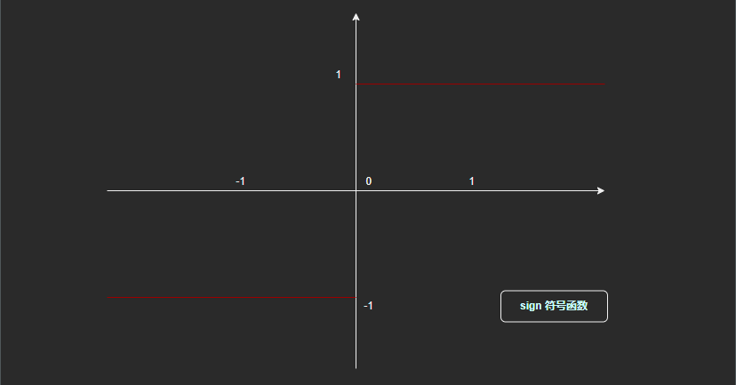
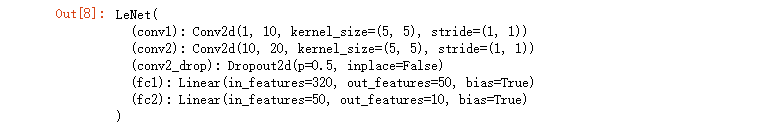
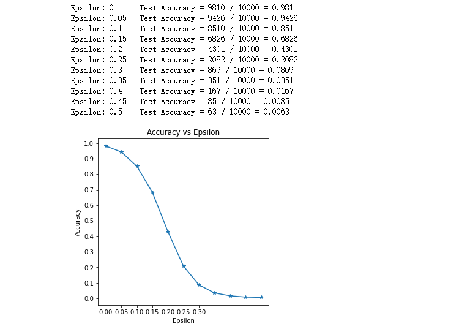
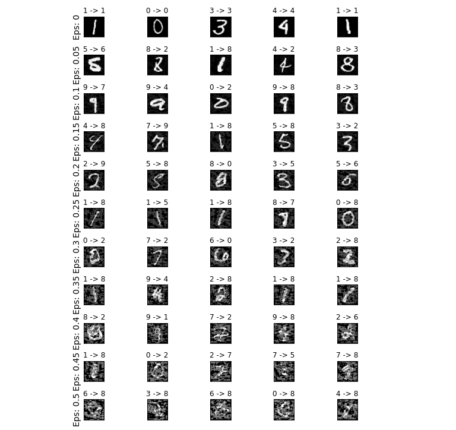

# 对抗攻击—FGSM实战

Author: H3rmesk1t

Data: 2022.04.26

# 论文
## 论文信息
[Explaining and Harnessing Adversarial Examples](https://arxiv.org/abs/1412.6572).

## 论文简介
早期对对抗样本产生的原因的猜测集中于神经网络的非线性性和过拟合, 但是这篇论文证明神经网络的线性性质是造成神经网络具有对抗样本的主要原因. 同时, 该篇论文提出了一个能供更简单与更快速的生成对抗样本的方法.

## 论文主要内容
 - 否定了对抗样本是因为非线性和过拟合导致的, 认为对抗样本是因为神经网络在高维空间的线性导致的, 并提出了大量的实验加以说明. 对抗样本可以被解释成高维空间点乘的一个属性, 他们是模型太过于线性的结果.
 - 模型的线性让其更容易被训练, 而其非线性让其容易抵御对抗扰动的攻击, 即容易优化的模型也容易被扰动.
 - 提出了一种特别快的生成对抗样本的方法`FGSM`:

<div align=center></div>

 - `FGSM`的实质是输入图片在模型的权重方向上增加了一些扰动(方向一样, 点乘最大). 这样可以让图片在较小的扰动下出现较大的改变, 从而得到对抗样本.
 - 不同模型之间的对抗性示例的泛化可以解释为, 对抗性扰动与模型的权重向量高度一致, 不同模型在训练执行相同任务时学习相似的函数.
 - 提出了一种基于`FGSM`的正则化方法, 对抗训练可以用来正则化, 甚至效果比`dropout`还要好:

<div align=center></div>

 - 相比于模型融合, 单个模型的对抗防御能力更好一些, 集成策略不能够抵御对抗样本.
 - 线性模型缺乏抵抗对抗性扰动的能力, 只有具有隐藏层的结构(在普遍近似定理适用的情况下)才应该被训练来抵抗对抗性扰动.
 - `RBF`网络可以抵御对抗样本.
 - 对抗样本的分布特征, 即对抗样本往往存在于模型决策边界的附近, 在线性搜索范围内, 模型的正常分类区域和被对抗样本攻击的区域都仅占分布范围的较小一部分, 剩余部分为垃圾类别(rubbish class).
 - 垃圾类别样本是普遍存在的且很容易生成, 浅的线性模型不能抵御垃圾类别样本, `RBF`网络可以抵御垃圾类别样本.

# FGSM
## 原理
`fast gradient sign method`是一种基于梯度生成对抗样本的算法, 属于对抗攻击中的无目标攻击, 即不要求对抗样本经过`model`预测指定的类别, 只要与原样本预测的不一样即可. 它旨在通过利用模型学习的方式和渐变来攻击神经网络, 攻击调整输入数据以基于相同的反向传播梯度来最大化损失, 而不是通过基于反向传播的梯度调整权重来最小化损失. 简而言之, 攻击是利用损失函数的梯度, 然后调整输入数据以最大化损失. 

例如, 下图中, 大熊猫照片加入一定的扰动(噪音点), 输入`model`之后就被判断为长臂猿.

<div align=center></div>

## 公式
`FGSM`公式如下图所示:

<div align=center></div>

在公式中, `x`是原始样本; `θ`是模型的权重参数, 即`w`; `y`是`x`的真实类别. 输入原始样本, 权重参数以及真实类别, 通过`J`损失函数求得神经网络的损失值, `∇x`表示对`x`求偏导, 即损失函数`J`对`x`样本求偏导. `sign`是符号函数, 即`sign(-1)`, `sign(-99.9)`等都等于`-1`; `sign(1)`, `sign(99.9)`等都等于`1`. `epsilon`的值通常是人为设定, 可以视作学习率, 一旦扰动值超出阈值, 该对抗样本会被人眼识别.

<div align=center></div>

## 算法
### 搭建模型

```python
# 库文件引入
import torch
import torch.nn as nn
import torch.optim as optim
import torch.nn.functional as F
import numpy as np
import matplotlib.pyplot as plt
from __future__ import print_function
from torchvision import datasets, transforms

# 设置多个 epsilons 便于后续可视化展示其影响
epsilons = [0, .05, .1, .15, .2, .25, .3, .35, .4, .45, .5]

# 加载预训练模型
# 预训练模型下载地址：https://drive.google.com/drive/folders/1fn83DF14tWmit0RTKWRhPq5uVXt73e0h
pretrained_model = 'data/lenet_mnist_model.pth'

# 是否使用 cuda
use_cuda = False

# 搭建被攻击的模型
# 定义 LeNet 模型
class LeNet(nn.Module):
    def __init__(self):
        super(LeNet, self).__init__()
        self.conv1 = nn.Conv2d(1, 10, kernel_size=5)
        self.conv2 = nn.Conv2d(10, 20, kernel_size=5)
        self.conv2_drop = nn.Dropout2d()
        self.fc1 = nn.Linear(320, 50)
        self.fc2 = nn.Linear(50, 10)
        
    def forward(self, x):
        x = F.relu(F.max_pool2d(self.conv1(x), 2))
        x = F.relu(F.max_pool2d(self.conv2_drop(self.conv2(x)), 2))
        x = x.view(-1, 320)
        x = F.relu(self.fc1(x))
        x = F.dropout(x, training=self.training)
        x = self.fc2(x)
        return F.log_softmax(x, dim=1)

# 下载并加载数据集
loader = torch.utils.data.DataLoader(
    datasets.MNIST('data/', train=False, download=True, transform=transforms.Compose([
        transforms.ToTensor(),
    ])),
    batch_size=1,
    shuffle=True
)

# 配置 GPU
cuda_available = torch.cuda.is_available()
device = torch.device('cude' if (use_cuda and cuda_available) else 'cpu')
print('CUDA is available: ', cuda_available)

# 初始化网络模型
model = LeNet().to(device)
# 加载预训练模型
model.load_state_dict(torch.load(pretrained_model, map_location='cpu'))
# 设置为验证模式
model.eval()
```

<div align=center></div>

### FGSM 攻击模块

```python
# FGSM Attack Module
def fgsm_attack_module(image, epsilon, data_grad):
    # 使用 sign 符号函数，将对 x 求了偏导的梯度进行符号化
    sign_data_grad = data_grad.sign()
    # 通过 epsilon 生成对抗样本
    adversarial_image = image + epsilon * sign_data_grad
    # 做一个剪裁的工作，将 torch.clamp 内部大于 1 的数值变为 1 ，小于 0 的数值等于 0，防止 image 越界
    adversarial_image = torch.clamp(adversarial_image, 0, 1)
    # 返回对抗样本
    return adversarial_image
```

### 测试模块

```python
def test( model, device, test_loader, epsilon ):

    # 准确度计数器
    correct = 0
    # 对抗样本
    adv_examples = []

    # 循环遍历测试集中的所有示例
    for data, target in test_loader:

        # 把数据和标签发送到设备
        data, target = data.to(device), target.to(device)

        # 设置张量的 requires_grad 属性，这对于攻击很关键
        data.requires_grad = True

        # 通过模型前向传递数据
        output = model(data)
        init_pred = output.max(1, keepdim=True)[1] # get the index of the max log-probability

        # 如果初始预测是错误的，不打断攻击，继续
        if init_pred.item() != target.item():
            continue

        # 计算损失
        loss = F.nll_loss(output, target)

        # 将所有现有的渐变归零
        model.zero_grad()

        # 计算后向传递模型的梯度
        loss.backward()

        # 收集 datagrad
        data_grad = data.grad.data

        # 唤醒 FGSM 进行攻击
        perturbed_data = fgsm_attack_module(data, epsilon, data_grad)

        # 重新分类受扰乱的图像
        output = model(perturbed_data)

        # 检查是否成功
        final_pred = output.max(1, keepdim=True)[1] # get the index of the max log-probability
        if final_pred.item() == target.item():
            correct += 1
            # 保存 0 epsilon 示例的特例
            if (epsilon == 0) and (len(adv_examples) < 5):
                adv_ex = perturbed_data.squeeze().detach().cpu().numpy()
                adv_examples.append( (init_pred.item(), final_pred.item(), adv_ex) )
        else:
            # 稍后保存一些用于可视化的示例
            if len(adv_examples) < 5:
                adv_ex = perturbed_data.squeeze().detach().cpu().numpy()
                adv_examples.append( (init_pred.item(), final_pred.item(), adv_ex) )

    # 计算这个 epsilon 的最终准确度
    final_acc = correct / float(len(test_loader))
    print("Epsilon: {}\tTest Accuracy = {} / {} = {}".format(epsilon, correct, len(test_loader), final_acc))

    # 返回准确性和对抗性示例
    return final_acc, adv_examples
```

### 可视化结果对比模块
```python
# 开始攻击
accuracies = []
examples = []

# Run test for each epsilon
for eps in epsilons:
    acc, ex = test(model, device, loader, eps)
    accuracies.append(acc)
    examples.append(ex)

plt.figure(figsize=(5,5))
plt.plot(epsilons, accuracies, "*-")
plt.yticks(np.arange(0, 1.1, step=0.1))
plt.xticks(np.arange(0, .35, step=0.05))
plt.title("Accuracy vs Epsilon")
plt.xlabel("Epsilon")
plt.ylabel("Accuracy")
plt.show()
```

<div align=center></div>

### 样本与对抗样本对比模块

```python
# Plot several examples of adversarial samples at each epsilon
cnt = 0
plt.figure(figsize=(8,10))
for i in range(len(epsilons)):
    for j in range(len(examples[i])):
        cnt += 1
        plt.subplot(len(epsilons),len(examples[0]),cnt)
        plt.xticks([], [])
        plt.yticks([], [])
        if j == 0:
            plt.ylabel("Eps: {}".format(epsilons[i]), fontsize=14)
        orig,adv,ex = examples[i][j]
        plt.title("{} -> {}".format(orig, adv))
        plt.imshow(ex, cmap="gray")
plt.tight_layout()
plt.show()
```

<div align=center></div>

# 实战
下面通过几道`CTF`题目来简单地了解一下在应用场景中, `FGSM`是如何使用的.

## N1CTF2021 Collision
题目附件中给了一份代码文件和一个模型参数, 先来看看代码:

```python
import base64

import numpy as np
import torch
import torch.nn as nn
import torch.nn.functional as F


class Net(nn.Module):
    def __init__(self):
        super(Net, self).__init__()
        self.conv1 = nn.Conv2d(1, 32, 3, 1)
        self.conv2 = nn.Conv2d(32, 64, 3, 1)
        self.dropout1 = nn.Dropout(0.25)
        self.dropout2 = nn.Dropout(0.5)
        self.fc1 = nn.Linear(9216, 128)
        self.fc2 = nn.Linear(128, 10)

    def forward(self, x):
        x = self.conv1(x)
        x = F.relu(x)
        x = self.conv2(x)
        x = F.relu(x)
        x = F.max_pool2d(x, 2)
        x = self.dropout1(x)
        x = torch.flatten(x, 1)
        x = self.fc1(x)
        return x


def load_model(path):
    model = Net()
    model.load_state_dict(torch.load(path, map_location="cpu"))
    return model.eval()


model = load_model("convNet.pt")


def hex_hash(hash_bits):
    x = hash_bits.detach().numpy()
    res = [str(int(i > 0)) for i in x[0]]
    return hex(int(''.join(res), 2))


L0_THRES = 54.1
L2_THRES = 6.45
src = np.frombuffer(base64.b64decode(
    'AAAAAAAAAAAAAAAAAAAAAAAAAAAAAAAAAAAAAAAAAAAAAAAAAAAAAAAAAAAAAAAAAAAAAAAAAAAAAAAAAAAAAAAAAAAAAAAAAAAAAAAAAAAAAAAAAAAAAAAAAAAAAAAAAAAAAAAAAAAAAAAAAAAAAAAAAAAAAAAAAAAAAAAAAAAAAAAAAAAAAAAAAAAAAAAAAAAAAAAAAAAAAAAAAAAAAAAAAAAAAAAAAAAAAAAAAAAAAAAAAAAAAAAAAAAAAAAAAAAAAAAAAAAAAAAAAAAAAAAAAAAAAAAAAAAAAAAAAAAAAAAAAAAAAAAAAAAAAAAAAAAAAAAAAAAAAAAAAAAAAAAAAAAAAAAAAAAAAAAAAAAAAAAAAAAAAAAAAAAAAAAAAAAAAAAAAAAAAAAAAAAAAAAAAAAAAAAAAAAAAAAAAAAAAAAAAAAAAAAAAAAAAAAAAAAAAAAAAAAAAAAAAAAAAAAAAAAAAAAAAAAAAAAAAAAAAAAA5eTkPgAAgD/l5GQ+AAAAAAAAAAAAAAAAAAAAAAAAAAAAAAAAAAAAAAAAAAAAAAAAAAAAAAAAAAAAAAAAAAAAAAAAAAAAAAAAAAAAAAAAAAAAAAAAAAAAAAAAAAAAAAAAAAAAAAAAAAAAAAAAAAAAAOPiYj8AAIA/5eRkPgAAAAAAAAAAAAAAAAAAAAAAAAAAAAAAAAAAAAAAAAAAAAAAAAAAAAAAAAAAAAAAAAAAAAAAAAAAAAAAAAAAAAAAAAAAAAAAAAAAAAAAAAAAAAAAAAAAAAAAAAAAAAAAAOno6D0AAIA/5eTkPgAAAAAAAAAAAAAAAAAAAAAAAAAAAAAAAAAAAAAAAAAAAAAAAAAAAAAAAAAAAAAAAAAAAAAAAAAAAAAAAAAAAAAAAAAAAAAAAAAAAAAAAAAAAAAAAAAAAAAAAAAAAAAAAAAAAADl5OQ+AACAP62srD4AAAAAAAAAAAAAAAAAAAAAAAAAAAAAAAAAAAAAAAAAAAAAAAAAAAAAAAAAAAAAAAAAAAAAAAAAAAAAAAAAAAAAAAAAAAAAAAAAAAAAAAAAAAAAAAAAAAAAAAAAAAAAAAAAAAAAx8ZGPwAAgD/p6Og9AAAAAAAAAAAAAAAAAAAAAAAAAAAAAAAAAAAAAAAAAAAAAAAAAAAAAAAAAAAAAAAAAAAAAAAAAAAAAAAAAAAAAAAAAAAAAAAAAAAAAAAAAAAAAAAAAAAAAAAAAAAAAAAA6ejoPQAAgD/j4mI/AAAAAAAAAAAAAAAAAAAAAAAAAAAAAAAAAAAAAAAAAAAAAAAAAAAAAAAAAAAAAAAAAAAAAAAAAAAAAAAAAAAAAAAAAAAAAAAAAAAAAAAAAAAAAAAAAAAAAAAAAAAAAAAAAAAAAI6NDT8AAIA/jo0NPwAAAAAAAAAAAAAAAAAAAAAAAAAAAAAAAOXkZD6trKw+raysPo6NDT/l5GQ+AAAAAAAAAAAAAAAAAAAAAAAAAAAAAAAAAAAAAAAAAAAAAAAAAAAAAAAAAAAAAAAAAAAAAAAAAACrqio/AACAP62srD4AAAAAAAAAAAAAAAAAAAAAAAAAAOXkZD7j4mI/AACAPwAAgD8AAIA/AACAP+XkZD4AAAAAAAAAAAAAAAAAAAAAAAAAAAAAAAAAAAAAAAAAAAAAAAAAAAAAAAAAAAAAAAAAAAAAq6oqPwAAgD+trKw+AAAAAAAAAAAAAAAAAAAAAAAAAACrqio/AACAPwAAgD/l5OQ+5eRkPuPiYj/HxkY/AAAAAAAAAAAAAAAAAAAAAAAAAAAAAAAAAAAAAAAAAAAAAAAAAAAAAAAAAAAAAAAAAAAAAKuqKj8AAIA/raysPgAAAAAAAAAAAAAAAAAAAADl5GQ+AACAPwAAgD+trKw+AAAAAAAAAACrqio/AACAPwAAAAAAAAAAAAAAAAAAAAAAAAAAAAAAAAAAAAAAAAAAAAAAAAAAAAAAAAAAAAAAAAAAAACrqio/AACAP62srD4AAAAAAAAAAAAAAAAAAAAAq6oqPwAAgD+trKw+AAAAAAAAAAAAAAAAq6oqPwAAgD+trKw+AAAAAAAAAAAAAAAAAAAAAAAAAAAAAAAAAAAAAAAAAAAAAAAAAAAAAAAAAAAAAAAAjo0NPwAAgD/l5OQ+AAAAAAAAAAAAAAAA6ejoPQAAgD/HxkY/AAAAAAAAAAAAAAAAAAAAAKuqKj8AAIA/raysPgAAAAAAAAAAAAAAAAAAAAAAAAAAAAAAAAAAAAAAAAAAAAAAAAAAAAAAAAAAAAAAAOno6D0AAIA/AACAPwAAAAAAAAAAAAAAAKuqKj8AAIA/5eTkPgAAAAAAAAAAAAAAAAAAAADHxkY/4+JiPwAAAAAAAAAAAAAAAAAAAAAAAAAAAAAAAAAAAAAAAAAAAAAAAAAAAAAAAAAAAAAAAAAAAAAAAAAAx8ZGPwAAgD/l5OQ+AAAAAAAAAACrqio/AACAP62srD4AAAAAAAAAAAAAAACtrKw+AACAP+Xk5D4AAAAAAAAAAAAAAAAAAAAAAAAAAAAAAAAAAAAAAAAAAAAAAAAAAAAAAAAAAAAAAAAAAAAAAAAAAK2srD4AAIA/AACAP6uqKj/l5GQ+AACAPwAAgD/p6Og9AAAAAAAAAACtrKw+4+JiP+PiYj/p6Og9AAAAAAAAAAAAAAAAAAAAAAAAAAAAAAAAAAAAAAAAAAAAAAAAAAAAAAAAAAAAAAAAAAAAAAAAAAAAAAAA5eTkPuPiYj8AAIA/AACAPwAAgD8AAIA/raysPq2srD6rqio/AACAPwAAgD/l5GQ+AAAAAAAAAAAAAAAAAAAAAAAAAAAAAAAAAAAAAAAAAAAAAAAAAAAAAAAAAAAAAAAAAAAAAAAAAAAAAAAAAAAAAAAAAADp6Og9jo0NPwAAgD8AAIA/AACAPwAAgD8AAIA/AACAP8fGRj/p6Og9AAAAAAAAAAAAAAAAAAAAAAAAAAAAAAAAAAAAAAAAAAAAAAAAAAAAAAAAAAAAAAAAAAAAAAAAAAAAAAAAAAAAAAAAAAAAAAAAAAAAAAAAAAAAAAAA4+JiPwAAgD8AAIA/jo0NP62srD4AAAAAAAAAAAAAAAAAAAAAAAAAAAAAAAAAAAAAAAAAAAAAAAAAAAAAAAAAAAAAAAAAAAAAAAAAAAAAAAAAAAAAAAAAAAAAAAAAAAAAAAAAAAAAAAAAAAAAAAAAAI6NDT8AAIA/AACAP6uqKj+rqio/5eRkPgAAAAAAAAAAAAAAAAAAAAAAAAAAAAAAAAAAAAAAAAAAAAAAAAAAAAAAAAAAAAAAAAAAAAAAAAAAAAAAAAAAAAAAAAAAAAAAAAAAAAAAAAAAAAAAAAAAAAAAAAAAjo0NP+PiYj+rqio/5eTkPuno6D0AAAAAAAAAAAAAAAAAAAAAAAAAAAAAAAAAAAAAAAAAAAAAAAAAAAAAAAAAAAAAAAAAAAAAAAAAAAAAAAAAAAAAAAAAAAAAAAAAAAAAAAAAAAAAAAAAAAAAAAAAAAAAAAAAAAAAAAAAAAAAAAAAAAAAAAAAAAAAAAAAAAAAAAAAAAAAAAAAAAAAAAAAAAAAAAAAAAAAAAAAAAAAAAAAAAAAAAAAAAAAAAAAAAAAAAAAAAAAAAAAAAAAAAAAAAAAAAAAAAAAAAAAAAAAAAAAAAAAAAAAAAAAAAAAAAAAAAAAAAAAAAAAAAAAAAAAAAAAAAAAAAAAAAAAAAAAAAAAAAAAAAAAAAAAAAAAAAAAAAAAAAAAAAAAAAAAAAAAAAAAAAAAAAAAAAAAAAAAAAAAAAAAAAAAAAAAAAAAAAAAAAAAAAAAAAAAAAAAAAAAAAAAAAAAAAAAAAAAAAAAAAAAAAAAAAAAAAAAAAAAAAAAAAAAAAAAAAAAAAAAAAAAAAAAAAAAAAAAAAAAAAAAAAAAAAAAAAAAAAAAAAAAAAAAAAAAAAAAAAAAAAAAAAAAAAAAAAAAAAAAAAAAAAAAAAAAAAAAAAAAAAAAAAAAAAAAAAAAAAAAAAAAAAAAAAAAAAAAAAAAAAAAAAAAAAAAAAAAAAAAAAAAAAAAAAAAAAAAAAAAAAAAAAAAAAAAAAAAAAAAAAAAAAAAAAAAAAAAAAAAAAAAAAAAAAAAAAAAAAAAAAAAAAAAAAAAAAAAAAAAAAAAAAAAAAAAAAAAAAAAAAAAAAAAAAAAAA=='),
                    dtype="float32")


def hash_buf(buf):
    global src
    arr = np.frombuffer(buf, dtype="float32")
    if arr.shape[0] != 28 * 28:
        raise BufferError("hacker")
    arr = np.clip(arr, 0, 1)
    diff = arr - src
    #print(np.linalg.norm(diff, 0), np.linalg.norm(diff, 2))
    if np.linalg.norm(diff, 0) > L0_THRES or np.linalg.norm(diff, 2) > L2_THRES:
        raise BufferError("attack failed")
    arr = torch.FloatTensor(arr).reshape(1, 1, 28, 28)
    # need=0x1046822029745355ca048937f624fb87
    # hash(src)=0x91460a702d62d166a9942cb7fc10d7a2
    return hex_hash(model(arr))
```

### 分析
首先, 代码中给出了一个`CNN`模型`Net`, 类似上文实现的`LeNet`.

接着, `load_model`函数初始化模型, 载入已有的`convNet.pt`模型参数.

在`hex_hash`方法中, 将给定的`numpy`数组的数值映射为`0`和`1`, 当数组元素小于等于`0`时该位对应的`hash`值为`0`, 反之则为`1`, 从而来生成`hash`值.

然后给出了`L0_THRES`和`L2_THRES`两个在图像攻击中常见的范数约束, 具体可以看看之前写的[从论文学习对抗攻击—综述](https://github.com/H3rmesk1t/Learning_summary/blob/main/AISec/%E5%AF%B9%E6%8A%97%E6%94%BB%E5%87%BB/%E4%BB%8E%E8%AE%BA%E6%96%87%E5%AD%A6%E4%B9%A0%E5%AF%B9%E6%8A%97%E6%94%BB%E5%87%BB%E2%80%94%E7%BB%BC%E8%BF%B0/%E4%BB%8E%E8%AE%BA%E6%96%87%E5%AD%A6%E4%B9%A0%E5%AF%B9%E6%8A%97%E6%94%BB%E5%87%BB%E2%80%94%E7%BB%BC%E8%BF%B0.md), 以及作为对照图片的`Base64`值. 先将对照图片恢复一下, 恢复后的图片是`MNIST`数据集中的`4`, 这也和`Net`模型最后输出层单元数为`10`相呼应:

```python
import cv2
import base64
import numpy as np

src = np.frombuffer(base64.b64decode('AAAAAAAAAAAAAAAAAAAAAAAAAAAAAAAAAAAAAAAAAAAAAAAAAAAAAAAAAAAAAAAAAAAAAAAAAAAAAAAAAAAAAAAAAAAAAAAAAAAAAAAAAAAAAAAAAAAAAAAAAAAAAAAAAAAAAAAAAAAAAAAAAAAAAAAAAAAAAAAAAAAAAAAAAAAAAAAAAAAAAAAAAAAAAAAAAAAAAAAAAAAAAAAAAAAAAAAAAAAAAAAAAAAAAAAAAAAAAAAAAAAAAAAAAAAAAAAAAAAAAAAAAAAAAAAAAAAAAAAAAAAAAAAAAAAAAAAAAAAAAAAAAAAAAAAAAAAAAAAAAAAAAAAAAAAAAAAAAAAAAAAAAAAAAAAAAAAAAAAAAAAAAAAAAAAAAAAAAAAAAAAAAAAAAAAAAAAAAAAAAAAAAAAAAAAAAAAAAAAAAAAAAAAAAAAAAAAAAAAAAAAAAAAAAAAAAAAAAAAAAAAAAAAAAAAAAAAAAAAAAAAAAAAAAAAAAAAA5eTkPgAAgD/l5GQ+AAAAAAAAAAAAAAAAAAAAAAAAAAAAAAAAAAAAAAAAAAAAAAAAAAAAAAAAAAAAAAAAAAAAAAAAAAAAAAAAAAAAAAAAAAAAAAAAAAAAAAAAAAAAAAAAAAAAAAAAAAAAAAAAAAAAAOPiYj8AAIA/5eRkPgAAAAAAAAAAAAAAAAAAAAAAAAAAAAAAAAAAAAAAAAAAAAAAAAAAAAAAAAAAAAAAAAAAAAAAAAAAAAAAAAAAAAAAAAAAAAAAAAAAAAAAAAAAAAAAAAAAAAAAAAAAAAAAAOno6D0AAIA/5eTkPgAAAAAAAAAAAAAAAAAAAAAAAAAAAAAAAAAAAAAAAAAAAAAAAAAAAAAAAAAAAAAAAAAAAAAAAAAAAAAAAAAAAAAAAAAAAAAAAAAAAAAAAAAAAAAAAAAAAAAAAAAAAAAAAAAAAADl5OQ+AACAP62srD4AAAAAAAAAAAAAAAAAAAAAAAAAAAAAAAAAAAAAAAAAAAAAAAAAAAAAAAAAAAAAAAAAAAAAAAAAAAAAAAAAAAAAAAAAAAAAAAAAAAAAAAAAAAAAAAAAAAAAAAAAAAAAAAAAAAAAx8ZGPwAAgD/p6Og9AAAAAAAAAAAAAAAAAAAAAAAAAAAAAAAAAAAAAAAAAAAAAAAAAAAAAAAAAAAAAAAAAAAAAAAAAAAAAAAAAAAAAAAAAAAAAAAAAAAAAAAAAAAAAAAAAAAAAAAAAAAAAAAA6ejoPQAAgD/j4mI/AAAAAAAAAAAAAAAAAAAAAAAAAAAAAAAAAAAAAAAAAAAAAAAAAAAAAAAAAAAAAAAAAAAAAAAAAAAAAAAAAAAAAAAAAAAAAAAAAAAAAAAAAAAAAAAAAAAAAAAAAAAAAAAAAAAAAI6NDT8AAIA/jo0NPwAAAAAAAAAAAAAAAAAAAAAAAAAAAAAAAOXkZD6trKw+raysPo6NDT/l5GQ+AAAAAAAAAAAAAAAAAAAAAAAAAAAAAAAAAAAAAAAAAAAAAAAAAAAAAAAAAAAAAAAAAAAAAAAAAACrqio/AACAP62srD4AAAAAAAAAAAAAAAAAAAAAAAAAAOXkZD7j4mI/AACAPwAAgD8AAIA/AACAP+XkZD4AAAAAAAAAAAAAAAAAAAAAAAAAAAAAAAAAAAAAAAAAAAAAAAAAAAAAAAAAAAAAAAAAAAAAq6oqPwAAgD+trKw+AAAAAAAAAAAAAAAAAAAAAAAAAACrqio/AACAPwAAgD/l5OQ+5eRkPuPiYj/HxkY/AAAAAAAAAAAAAAAAAAAAAAAAAAAAAAAAAAAAAAAAAAAAAAAAAAAAAAAAAAAAAAAAAAAAAKuqKj8AAIA/raysPgAAAAAAAAAAAAAAAAAAAADl5GQ+AACAPwAAgD+trKw+AAAAAAAAAACrqio/AACAPwAAAAAAAAAAAAAAAAAAAAAAAAAAAAAAAAAAAAAAAAAAAAAAAAAAAAAAAAAAAAAAAAAAAACrqio/AACAP62srD4AAAAAAAAAAAAAAAAAAAAAq6oqPwAAgD+trKw+AAAAAAAAAAAAAAAAq6oqPwAAgD+trKw+AAAAAAAAAAAAAAAAAAAAAAAAAAAAAAAAAAAAAAAAAAAAAAAAAAAAAAAAAAAAAAAAjo0NPwAAgD/l5OQ+AAAAAAAAAAAAAAAA6ejoPQAAgD/HxkY/AAAAAAAAAAAAAAAAAAAAAKuqKj8AAIA/raysPgAAAAAAAAAAAAAAAAAAAAAAAAAAAAAAAAAAAAAAAAAAAAAAAAAAAAAAAAAAAAAAAOno6D0AAIA/AACAPwAAAAAAAAAAAAAAAKuqKj8AAIA/5eTkPgAAAAAAAAAAAAAAAAAAAADHxkY/4+JiPwAAAAAAAAAAAAAAAAAAAAAAAAAAAAAAAAAAAAAAAAAAAAAAAAAAAAAAAAAAAAAAAAAAAAAAAAAAx8ZGPwAAgD/l5OQ+AAAAAAAAAACrqio/AACAP62srD4AAAAAAAAAAAAAAACtrKw+AACAP+Xk5D4AAAAAAAAAAAAAAAAAAAAAAAAAAAAAAAAAAAAAAAAAAAAAAAAAAAAAAAAAAAAAAAAAAAAAAAAAAK2srD4AAIA/AACAP6uqKj/l5GQ+AACAPwAAgD/p6Og9AAAAAAAAAACtrKw+4+JiP+PiYj/p6Og9AAAAAAAAAAAAAAAAAAAAAAAAAAAAAAAAAAAAAAAAAAAAAAAAAAAAAAAAAAAAAAAAAAAAAAAAAAAAAAAA5eTkPuPiYj8AAIA/AACAPwAAgD8AAIA/raysPq2srD6rqio/AACAPwAAgD/l5GQ+AAAAAAAAAAAAAAAAAAAAAAAAAAAAAAAAAAAAAAAAAAAAAAAAAAAAAAAAAAAAAAAAAAAAAAAAAAAAAAAAAAAAAAAAAADp6Og9jo0NPwAAgD8AAIA/AACAPwAAgD8AAIA/AACAP8fGRj/p6Og9AAAAAAAAAAAAAAAAAAAAAAAAAAAAAAAAAAAAAAAAAAAAAAAAAAAAAAAAAAAAAAAAAAAAAAAAAAAAAAAAAAAAAAAAAAAAAAAAAAAAAAAAAAAAAAAA4+JiPwAAgD8AAIA/jo0NP62srD4AAAAAAAAAAAAAAAAAAAAAAAAAAAAAAAAAAAAAAAAAAAAAAAAAAAAAAAAAAAAAAAAAAAAAAAAAAAAAAAAAAAAAAAAAAAAAAAAAAAAAAAAAAAAAAAAAAAAAAAAAAI6NDT8AAIA/AACAP6uqKj+rqio/5eRkPgAAAAAAAAAAAAAAAAAAAAAAAAAAAAAAAAAAAAAAAAAAAAAAAAAAAAAAAAAAAAAAAAAAAAAAAAAAAAAAAAAAAAAAAAAAAAAAAAAAAAAAAAAAAAAAAAAAAAAAAAAAjo0NP+PiYj+rqio/5eTkPuno6D0AAAAAAAAAAAAAAAAAAAAAAAAAAAAAAAAAAAAAAAAAAAAAAAAAAAAAAAAAAAAAAAAAAAAAAAAAAAAAAAAAAAAAAAAAAAAAAAAAAAAAAAAAAAAAAAAAAAAAAAAAAAAAAAAAAAAAAAAAAAAAAAAAAAAAAAAAAAAAAAAAAAAAAAAAAAAAAAAAAAAAAAAAAAAAAAAAAAAAAAAAAAAAAAAAAAAAAAAAAAAAAAAAAAAAAAAAAAAAAAAAAAAAAAAAAAAAAAAAAAAAAAAAAAAAAAAAAAAAAAAAAAAAAAAAAAAAAAAAAAAAAAAAAAAAAAAAAAAAAAAAAAAAAAAAAAAAAAAAAAAAAAAAAAAAAAAAAAAAAAAAAAAAAAAAAAAAAAAAAAAAAAAAAAAAAAAAAAAAAAAAAAAAAAAAAAAAAAAAAAAAAAAAAAAAAAAAAAAAAAAAAAAAAAAAAAAAAAAAAAAAAAAAAAAAAAAAAAAAAAAAAAAAAAAAAAAAAAAAAAAAAAAAAAAAAAAAAAAAAAAAAAAAAAAAAAAAAAAAAAAAAAAAAAAAAAAAAAAAAAAAAAAAAAAAAAAAAAAAAAAAAAAAAAAAAAAAAAAAAAAAAAAAAAAAAAAAAAAAAAAAAAAAAAAAAAAAAAAAAAAAAAAAAAAAAAAAAAAAAAAAAAAAAAAAAAAAAAAAAAAAAAAAAAAAAAAAAAAAAAAAAAAAAAAAAAAAAAAAAAAAAAAAAAAAAAAAAAAAAAAAAAAAAAAAAAAAAAAAAAAAAAAAAAAAAAAAAAAAAAAAAAAAAAAAAAAAAA=='),dtype="float32")
src = src.reshape((28,28,1))
cv2.imshow("test_img", src)
cv2.waitKey()
```

<div align=center></div>

最后来看看`hash_buf`方法, 先接收攻击图片的`base64`解码后的比特流, 接着将其转换为`float32`数组, 然后对攻击图片的大小进行判断, 然后将图像像素值强制约束到`[0,1]`, 如果像素值小于`0`则会变成`0`, 大于`1`变成`1`, 其他不变.

接着根据攻击图片与对照图片的差值来求出`l0`和`l2`, 如果不满足要求则失败, 若满足要求, 将发送的图像送入网络, 取出倒数第二层的特征值数组转换为`numpy`后求取`hash`值. 如果计算得到的`hash`值与`0x1046822029745355ca048937f624fb87`相等, 则攻击成功.

### 解题
根据上文的分析思路, 需要生成一张按照代码中方法计算得到的`hash`为`0x1046822029745355ca048937f624fb87`且满足`L0_THRES`、`L2_THRES`要求的`28 * 28`大小的攻击图片.

相应的`EXP`如下:

```python
import numpy as np
import torch
import torch.nn as nn
import torch.nn.functional as F
from torch.autograd import Variable
from pwn import *
from PIL import Image
import hashlib
import string

class Net(nn.Module):
    def __init__(self):
        super(Net, self).__init__()
        self.conv1 = nn.Conv2d(1, 32, 3, 1)
        self.conv2 = nn.Conv2d(32, 64, 3, 1)
        self.dropout1 = nn.Dropout(0.25)
        self.dropout2 = nn.Dropout(0.5)
        self.fc1 = nn.Linear(9216, 128)
        self.fc2 = nn.Linear(128, 10)

    def forward(self, x):
        x = self.conv1(x)
        x = F.relu(x)
        x = self.conv2(x)
        x = F.relu(x)
        x = F.max_pool2d(x, 2)
        x = self.dropout1(x)
        x = torch.flatten(x, 1)
        x = self.fc1(x)
        return x

def load_model(path):
    model = Net()
    model.load_state_dict(torch.load(path, map_location="cpu"))
    return model.eval()

def save_image(arr, path):
    im = Image.fromarray(arr)
    im.save(path)

def get_hash_sim(adv_hash, std_hash):
    cnt = 0
    for i in range(len(adv_hash[0])):
        tmp1 = adv_hash[0][i] > 0
        tmp2 = std_hash[0][i] > 0
        if tmp1 != tmp2:
            cnt += 1
    return 1 - (cnt / len(adv_hash[0]))

def cal_hash_bits(out):
    return out

def hex_hash(hash_bits):
    x = hash_bits.detach().numpy()
    res = [str(int(i > 0)) for i in x[0]]
    return hex(int(''.join(res), 2))
model = load_model("./model/convNet.pt")
target_image=torch.FloatTensor(np.load("mnist.npz")['test_images'][8583]).reshape(1,1,28,28)
target_out = model(target_image).detach()
target_nsgn=-torch.sign(target_out).detach()
image = torch.FloatTensor(np.load("mnist.npz")['test_images'][22]).reshape(1,1,28,28)
adv=Variable(image,requires_grad=True)

loss_f=nn.L1Loss()
loss_l2=nn.MSELoss()

def hex_hash(hash_bits):
    x = hash_bits.detach().numpy()
    res = [str(int(i > 0)) for i in x[0]]
    return hex(int(''.join(res), 2))


L0_THRES = 54.1
L2_THRES = 6.45
src = np.frombuffer(base64.b64decode(
    'AAAAAAAAAAAAAAAAAAAAAAAAAAAAAAAAAAAAAAAAAAAAAAAAAAAAAAAAAAAAAAAAAAAAAAAAAAAAAAAAAAAAAAAAAAAAAAAAAAAAAAAAAAAAAAAAAAAAAAAAAAAAAAAAAAAAAAAAAAAAAAAAAAAAAAAAAAAAAAAAAAAAAAAAAAAAAAAAAAAAAAAAAAAAAAAAAAAAAAAAAAAAAAAAAAAAAAAAAAAAAAAAAAAAAAAAAAAAAAAAAAAAAAAAAAAAAAAAAAAAAAAAAAAAAAAAAAAAAAAAAAAAAAAAAAAAAAAAAAAAAAAAAAAAAAAAAAAAAAAAAAAAAAAAAAAAAAAAAAAAAAAAAAAAAAAAAAAAAAAAAAAAAAAAAAAAAAAAAAAAAAAAAAAAAAAAAAAAAAAAAAAAAAAAAAAAAAAAAAAAAAAAAAAAAAAAAAAAAAAAAAAAAAAAAAAAAAAAAAAAAAAAAAAAAAAAAAAAAAAAAAAAAAAAAAAAAAAA5eTkPgAAgD/l5GQ+AAAAAAAAAAAAAAAAAAAAAAAAAAAAAAAAAAAAAAAAAAAAAAAAAAAAAAAAAAAAAAAAAAAAAAAAAAAAAAAAAAAAAAAAAAAAAAAAAAAAAAAAAAAAAAAAAAAAAAAAAAAAAAAAAAAAAOPiYj8AAIA/5eRkPgAAAAAAAAAAAAAAAAAAAAAAAAAAAAAAAAAAAAAAAAAAAAAAAAAAAAAAAAAAAAAAAAAAAAAAAAAAAAAAAAAAAAAAAAAAAAAAAAAAAAAAAAAAAAAAAAAAAAAAAAAAAAAAAOno6D0AAIA/5eTkPgAAAAAAAAAAAAAAAAAAAAAAAAAAAAAAAAAAAAAAAAAAAAAAAAAAAAAAAAAAAAAAAAAAAAAAAAAAAAAAAAAAAAAAAAAAAAAAAAAAAAAAAAAAAAAAAAAAAAAAAAAAAAAAAAAAAADl5OQ+AACAP62srD4AAAAAAAAAAAAAAAAAAAAAAAAAAAAAAAAAAAAAAAAAAAAAAAAAAAAAAAAAAAAAAAAAAAAAAAAAAAAAAAAAAAAAAAAAAAAAAAAAAAAAAAAAAAAAAAAAAAAAAAAAAAAAAAAAAAAAx8ZGPwAAgD/p6Og9AAAAAAAAAAAAAAAAAAAAAAAAAAAAAAAAAAAAAAAAAAAAAAAAAAAAAAAAAAAAAAAAAAAAAAAAAAAAAAAAAAAAAAAAAAAAAAAAAAAAAAAAAAAAAAAAAAAAAAAAAAAAAAAA6ejoPQAAgD/j4mI/AAAAAAAAAAAAAAAAAAAAAAAAAAAAAAAAAAAAAAAAAAAAAAAAAAAAAAAAAAAAAAAAAAAAAAAAAAAAAAAAAAAAAAAAAAAAAAAAAAAAAAAAAAAAAAAAAAAAAAAAAAAAAAAAAAAAAI6NDT8AAIA/jo0NPwAAAAAAAAAAAAAAAAAAAAAAAAAAAAAAAOXkZD6trKw+raysPo6NDT/l5GQ+AAAAAAAAAAAAAAAAAAAAAAAAAAAAAAAAAAAAAAAAAAAAAAAAAAAAAAAAAAAAAAAAAAAAAAAAAACrqio/AACAP62srD4AAAAAAAAAAAAAAAAAAAAAAAAAAOXkZD7j4mI/AACAPwAAgD8AAIA/AACAP+XkZD4AAAAAAAAAAAAAAAAAAAAAAAAAAAAAAAAAAAAAAAAAAAAAAAAAAAAAAAAAAAAAAAAAAAAAq6oqPwAAgD+trKw+AAAAAAAAAAAAAAAAAAAAAAAAAACrqio/AACAPwAAgD/l5OQ+5eRkPuPiYj/HxkY/AAAAAAAAAAAAAAAAAAAAAAAAAAAAAAAAAAAAAAAAAAAAAAAAAAAAAAAAAAAAAAAAAAAAAKuqKj8AAIA/raysPgAAAAAAAAAAAAAAAAAAAADl5GQ+AACAPwAAgD+trKw+AAAAAAAAAACrqio/AACAPwAAAAAAAAAAAAAAAAAAAAAAAAAAAAAAAAAAAAAAAAAAAAAAAAAAAAAAAAAAAAAAAAAAAACrqio/AACAP62srD4AAAAAAAAAAAAAAAAAAAAAq6oqPwAAgD+trKw+AAAAAAAAAAAAAAAAq6oqPwAAgD+trKw+AAAAAAAAAAAAAAAAAAAAAAAAAAAAAAAAAAAAAAAAAAAAAAAAAAAAAAAAAAAAAAAAjo0NPwAAgD/l5OQ+AAAAAAAAAAAAAAAA6ejoPQAAgD/HxkY/AAAAAAAAAAAAAAAAAAAAAKuqKj8AAIA/raysPgAAAAAAAAAAAAAAAAAAAAAAAAAAAAAAAAAAAAAAAAAAAAAAAAAAAAAAAAAAAAAAAOno6D0AAIA/AACAPwAAAAAAAAAAAAAAAKuqKj8AAIA/5eTkPgAAAAAAAAAAAAAAAAAAAADHxkY/4+JiPwAAAAAAAAAAAAAAAAAAAAAAAAAAAAAAAAAAAAAAAAAAAAAAAAAAAAAAAAAAAAAAAAAAAAAAAAAAx8ZGPwAAgD/l5OQ+AAAAAAAAAACrqio/AACAP62srD4AAAAAAAAAAAAAAACtrKw+AACAP+Xk5D4AAAAAAAAAAAAAAAAAAAAAAAAAAAAAAAAAAAAAAAAAAAAAAAAAAAAAAAAAAAAAAAAAAAAAAAAAAK2srD4AAIA/AACAP6uqKj/l5GQ+AACAPwAAgD/p6Og9AAAAAAAAAACtrKw+4+JiP+PiYj/p6Og9AAAAAAAAAAAAAAAAAAAAAAAAAAAAAAAAAAAAAAAAAAAAAAAAAAAAAAAAAAAAAAAAAAAAAAAAAAAAAAAA5eTkPuPiYj8AAIA/AACAPwAAgD8AAIA/raysPq2srD6rqio/AACAPwAAgD/l5GQ+AAAAAAAAAAAAAAAAAAAAAAAAAAAAAAAAAAAAAAAAAAAAAAAAAAAAAAAAAAAAAAAAAAAAAAAAAAAAAAAAAAAAAAAAAADp6Og9jo0NPwAAgD8AAIA/AACAPwAAgD8AAIA/AACAP8fGRj/p6Og9AAAAAAAAAAAAAAAAAAAAAAAAAAAAAAAAAAAAAAAAAAAAAAAAAAAAAAAAAAAAAAAAAAAAAAAAAAAAAAAAAAAAAAAAAAAAAAAAAAAAAAAAAAAAAAAA4+JiPwAAgD8AAIA/jo0NP62srD4AAAAAAAAAAAAAAAAAAAAAAAAAAAAAAAAAAAAAAAAAAAAAAAAAAAAAAAAAAAAAAAAAAAAAAAAAAAAAAAAAAAAAAAAAAAAAAAAAAAAAAAAAAAAAAAAAAAAAAAAAAI6NDT8AAIA/AACAP6uqKj+rqio/5eRkPgAAAAAAAAAAAAAAAAAAAAAAAAAAAAAAAAAAAAAAAAAAAAAAAAAAAAAAAAAAAAAAAAAAAAAAAAAAAAAAAAAAAAAAAAAAAAAAAAAAAAAAAAAAAAAAAAAAAAAAAAAAjo0NP+PiYj+rqio/5eTkPuno6D0AAAAAAAAAAAAAAAAAAAAAAAAAAAAAAAAAAAAAAAAAAAAAAAAAAAAAAAAAAAAAAAAAAAAAAAAAAAAAAAAAAAAAAAAAAAAAAAAAAAAAAAAAAAAAAAAAAAAAAAAAAAAAAAAAAAAAAAAAAAAAAAAAAAAAAAAAAAAAAAAAAAAAAAAAAAAAAAAAAAAAAAAAAAAAAAAAAAAAAAAAAAAAAAAAAAAAAAAAAAAAAAAAAAAAAAAAAAAAAAAAAAAAAAAAAAAAAAAAAAAAAAAAAAAAAAAAAAAAAAAAAAAAAAAAAAAAAAAAAAAAAAAAAAAAAAAAAAAAAAAAAAAAAAAAAAAAAAAAAAAAAAAAAAAAAAAAAAAAAAAAAAAAAAAAAAAAAAAAAAAAAAAAAAAAAAAAAAAAAAAAAAAAAAAAAAAAAAAAAAAAAAAAAAAAAAAAAAAAAAAAAAAAAAAAAAAAAAAAAAAAAAAAAAAAAAAAAAAAAAAAAAAAAAAAAAAAAAAAAAAAAAAAAAAAAAAAAAAAAAAAAAAAAAAAAAAAAAAAAAAAAAAAAAAAAAAAAAAAAAAAAAAAAAAAAAAAAAAAAAAAAAAAAAAAAAAAAAAAAAAAAAAAAAAAAAAAAAAAAAAAAAAAAAAAAAAAAAAAAAAAAAAAAAAAAAAAAAAAAAAAAAAAAAAAAAAAAAAAAAAAAAAAAAAAAAAAAAAAAAAAAAAAAAAAAAAAAAAAAAAAAAAAAAAAAAAAAAAAAAAAAAAAAAAAAAAAAAAAAAAAAAAAAAAAAAAAAAAAAAAAAAAAAAAAAAAAAA=='),
                    dtype="float32")


def hash_buf(buf):
    global src
    arr = np.frombuffer(buf, dtype="float32")
    if arr.shape[0] != 28 * 28:
        raise BufferError("hacker")
    arr = np.clip(arr, 0, 1)
    diff = arr - src
    print(np.linalg.norm(diff, 0), np.linalg.norm(diff, 2))
    if np.linalg.norm(diff, 0) > L0_THRES or np.linalg.norm(diff, 2) > L2_THRES:
        raise BufferError("attack failed")
    arr = torch.FloatTensor(arr).reshape(1, 1, 28, 28)
    # need=0x1046822029745355ca048937f624fb87
    # hash(src)=0x91460a702d62d166a9942cb7fc10d7a2
    return hex_hash(model(arr))

def getsha256(s):
    sha256=hashlib.sha256()
    sha256.update(str(s).encode('utf-8'))
    ans=sha256.hexdigest()
    return ans

def attack():
    global adv
    # load model, seed, image
    max_sim = 0
    cnt = 0
    loss_cnt = 0
    losses = []
    lr=0.1
    RATIO=10
    itercnt=0
    best = 9999
    best_l0 = 9999
    best_l2 = 9999
    save_image(image.squeeze().detach().numpy(), 'origion.tiff')
    save_image(target_image.squeeze().detach().numpy(), 'target.tiff')
    for i in range(10000):
        adv_out=model(adv)
        l1l=loss_f(adv,image)*RATIO
        hashl=torch.sum(F.relu(target_nsgn*adv_out))
        l2l=loss_l2(adv,image)
        loss=l1l+hashl
        loss.backward()
        adv.requires_grad=False
        data1 = adv.squeeze().detach().numpy().astype("float32").tobytes()
        arr1 = np.frombuffer(data1, dtype="float32")
        arr1 = np.clip(arr1, 0, 1)
        diff = arr1 - src
        a,b=(np.linalg.norm(diff, 0), np.linalg.norm(diff, 2))
        if hex_hash(adv_out)==hex_hash(target_out) and a< L0_THRES and b < L2_THRES:
            save_image(adv.squeeze().detach().numpy(), 'collision_pic.tiff')
            data = adv.squeeze().detach().numpy().astype("float32").tobytes()
            print(hash_buf(data))
            r = remote("175.27.158.159", "59101")
            context(log_level='debug')
            tmpstr = r.recvline().decode().replace('\n', '')
            sha_ans = tmpstr[45:109]
            sha_str = tmpstr[12:40]
            print(sha_str)
            print(sha_ans)
            print(tmpstr)
            prefix = ''
            flag = False
            ss = string.ascii_letters
            for i in ss:
                if (flag):
                    break
                for j in ss:
                    if (flag):
                        break
                    for k in ss:
                        if (flag):
                            break
                        for l in ss:
                            xxxx = i + j + k + l
                            if (sha_ans == getsha256(xxxx + sha_str)):
                                prefix = xxxx
                                print('in')
                                flag = True
                                break
            print(prefix)
            r.recvline()
            r.sendline(prefix)
            tt = r.recvline().decode().replace('\n', '')
            print(tt)
            r.sendline(base64.b64encode(data))
            r.interactive()
            exit(0)
        adv=adv-adv.grad*lr
        adv=adv.clamp(0,1)
        update = f"Iteration #{i}: l1={l1l} l2loss={l2l} hashloss={hashl}"
        print(update)
        print(hex_hash(adv_out))
        print(hex_hash(target_out))
        print("diffcount",torch.sum(torch.abs(adv-image)>0.005))
        print(f"l0 loss: {torch.sum(adv!=image)}")
        print("best ", best)
        print(f"best_l0: {best_l0}")
        print(f"best_l2: {best_l2}")
        if hex_hash(adv_out)==hex_hash(target_out):
            best=min(best,torch.sum(torch.abs(adv-image)>0.005).numpy())
            best_l0=min(best_l0,torch.sum(adv!=image).numpy())
            best_l2 = min(best_l2, l2l)
            itercnt+=1
            mask=(torch.abs(adv-image)<np.clip(0.02+0.04*itercnt,0.02,0.4)).type(torch.FloatTensor)
            adv=adv*(1-mask)+image*mask
        adv.requires_grad = True
    save_image(adv.squeeze().detach().numpy(), 'collision_pic.tiff')
if __name__ == "__main__":
    attack()
```

在`exp`中不难看出这个攻击代码的主体算法是`FGSM`:

```python
adv = adv - adv.grad * lr
adv = adv.clamp(0,1)
```

而`FGSM`在代码中起到的作用是使得虚假图像的`hash`和目标`hash`更加相似, 这是因为代码中图像梯度是通过计算`target_nsgn`(目标特征层, 这里将其设置为小于等于`0`时为`-1`, 大于`0`为`1`)和攻击图像的`adv_out`得到的, 使用`FGSM`就可以使得图像在梯度上沿着使得俩特征层`hash`值相同的方向移动, 因此最终可以使得攻击图像的`hash`值和目标`hash`相同.

<div align=center></div>

再来看看, `exp`中对`hash`值的损失函数的设计, 这里将俩`hash`相乘, 其中一个`hash`先乘以`-1`, 再使用激活函数`relu`筛去符号相同的位后求和. 因为损失函数为`0`是, 攻击图像的`hash`值和目标`hash`值每一位正负号完全相同, 所以这个损失函数可以有效地使得攻击图像的`hash`值朝着目标`hash`移动.

```python
adv_out=model(adv)
l1l=loss_f(adv,image)*RATIO
hashl=torch.sum(F.relu(target_nsgn*adv_out))
l2l=loss_l2(adv,image)
loss=l1l+hashl
```

接下来再看一看如何解决`l0`和`l2`的问题, `l0`起到约束改变多少像素的作用, `l2`则起到约束两张图相似性的作用. 因此, 可以使用`l1`损失函数`nn.L1Loss()`来对`l0`进行约束(这是因为`numpy`计算`l0`范数是`sum(x!=0)`), 使用`nn.MSEloss()`对`l2`进行约束.

将初始攻击图像设置为题目给出的`Base64`编码的图片, 但是由于损失函数作用范围和`FGSM`都是在整个图像上进行的, 往往生成的攻击图像与对比图像在很多像素值上有细小的区别, 这将导致难以通过较硬的`l0`约束. 因此, 在`exp`中使用了一种启发式的硬`mask`来解决这个问题. 在`hash`值相等的前提下, 这个`mask`将会筛去攻击图像中和对比图像差值小于阈值`sita=np.clip(0.02+0.04*itercnt,0.02,0.4))`的像素并将其替代为对比图像的像素值以便减小`l0`的值. 启发式体现在`mask`的`sita`阈值随着迭代次数的增加不断变大, 最终不大于`0.4`, 这将鼓励攻击图像生成数量更少但是对于`hash`值影响更大的像素, 从而降低`l0`和`l2`.

```python
mask=(torch.abs(adv-image)<np.clip(0.02+0.04*itercnt,0.02,0.4)).type(torch.FloatTensor)
adv=adv*(1-mask)+image*mask
```

## TJUCTF新生赛 简单的FGSM
题目描述: 我在本题中使用`LeNet`训练了一个二分类网络(`mnist`中的`4`和`7`). 我将会给你训练好的网络`target.pt`, 以及一张原始图像`4`的`base64`编码, 你需要生成一张图片, 使其在满足`Check`函数中的`L1`和`L2`约束的情况下, 让`target.pt`网络误以为它是一张`7`. 先来看看代码:

```python
from base64 import b64decode
from torch import nn
import torch.nn.functional as func
import numpy as np
import torch
import os

class LeNet(nn.Module):
    def __init__(self,dimy):
        super(LeNet,self).__init__()
        self.conv1=nn.Conv2d(3,6,5)
        self.conv2=nn.Conv2d(6,16,5)
        self.linear1=nn.Linear(256,120)
        self.linear2=nn.Linear(120,84)
        self.linear3=nn.Linear(84,10)
        self.linear4=nn.Linear(10,dimy)

    def forward(self,x):
        x=func.relu(self.conv1(x))
        x=func.max_pool2d(x,2)
        x=func.relu(self.conv2(x))
        x=func.max_pool2d(x,2)
        x=x.view(x.size(0),-1)
        x=func.relu(self.linear1(x))
        x=func.relu(self.linear2(x))
        x=self.linear3(x)
        x=torch.sigmoid(self.linear4(x))
        return x

mymodal=torch.load('./target.pt')
mymodal.eval()

base64_src='AAAAAAAAAAAAAAAAAAAAAAAAAAAAAAAAAAAAAAAAAAAAAAAAAAAAAAAAAAAAAAAAAAAAAAAAAAAAAAAAAAAAAAAAAAAAAAAAAAAAAAAAAAAAAAAAAAAAAAAAAAAAAAAAAAAAAAAAAAAAAAAAAAAAAAAAAAAAAAAAAAAAAAAAAAAAAAAAAAAAAAAAAAAAAAAAAAAAAAAAAAAAAAAAAAAAAAAAAAAAAAAAAAAAAAAAAAAAAAAAAAAAAAAAAAAAAAAAAAAAAAAAAAAAAAAAAAAAAAAAAAAAAAAAAAAAAAAAAAAAAAAAAAAAAAAAAAAAAAAAAAAAAAAAAAAAAAAAAAAAAAAAAAAAAAAAAAAAAAAAAAAAAAAAAAAAAAAAAAAAAAAAAAAAAAAAAAAAAAAAAAAAAAAAAAAAAAAAAAAAAAAAAAAAAAAAAAAAAAAAAAAAAAAAAAAAAAAAAAAAAAAAAAAAAAAAAAAAAAAAAAAAAAAAAAAAAAAAAAAAAAAAAAAAAAAAAAAAAAAAAAAAAAAAAAAAAAAAAAAAAAAAAAAAAAAAAAAAAAAAAAAAAAAAAAAAAAAAAAAAAAAAAAAAAAAAAAAAAAAAAAAAAAAAAAAAAAAAAAAAAAAAAAAAAAAAAAAAAAAAAAAAAAAAAAAAAAAAAAAAAAAAAAAAAAAAAAAAAAAAAAAAAAAAAAAAAAAAAAAAAAAAAAAAAAAAAAAAAAAAAAAAAAAAAAAAAAAAAAAAAAAAAAAAAAAAAAAAAAAAAAAAAAAAAAAAAAAAAAAAAAAAAAAAAAAAAAAAAAAAAAAAAAAAAAAAAAAAAAAAAAAAAAAAAAAAAAAAAAAAAAAAAAAAAAAAAAAAAAAAAAAAAAAAAAAAAAAAAAAAAAAAAAAAAAAAAAAAAAAAAAAAAAAAAAAAAAAAAAAAAAAAAAAAAAAAAAAAAAAAAAAAAAAAAAAAAAAAAAAAAAAAAAAAAAAAAAAAAAAAAAAAAAAAAAAAAAAAAAAAAAAAAAAAAAAAAAAAAAAAAAAAAAAAAAAAAAAAAAAAAAAAAAAAAAAAAAAAAAAAAAAAAAAAAAAAAAAAAAAAAAAAAAAAAAAAAAAAAAAAAAAAAAAAAAAAAAAAAAAAAAAAAAAAAAAAAAAAAAAAAAAAAAAAAAAAAAAAAAAAAAAAAAAAAAAAAAAAAAAAAAAAAAAAAAAAAAAAAAAAAAAAAAAAAAAAAAAAAAAAAAAAAAAAAAAAAAAAAAAAAAAAAAAAAAAAAAAAAAAAAAAAAAAAAAAAAAAAAAAAAAAAAAAAAAAAAAAAAAAAAAAAAAAAAAAAAAAAAAAAAAAAAAAAAAAAAAAAAAAAAAAAAAAAAAAAAAAAAAAAAAAAAAAAAAAAAAAAAAAAAAAAAAAAAAAAAAAAAAAAAAAAAAAAAAAAAAAAAAAAAAAAAAAAAAAAAAAAAAAAAAAAAAAAAAAAAAAAAAAAAAAAAAAAAAAAAAAAAAAAAAAAAAAAAAAAAAAAAAAAAAAAAAAAAAAAAAAAAAAAAAAAAAAAAAAAAAAAAAAAAAAAAAAAAAAAAAAAAAAAAAAAAAAAAAAAAAAAAAAAAAAAAAAAAAAAAAAAAAAAAAAAAAAAAAAAAADAuLjoPwAAACAeHs4/AAAAAAAAAAAAAAAAAAAAAAAAAAAAAAAAAAAAAAAAAAAAAAAAAAAAAAAAAAAAAAAAAAAAAAAAAAAAAAAAAAAAAAAAAAAAAAAAAAAAAAAAAAAAAAAAAAAAAAAAAAAAAAAAAAAAAAAAAAAAAAAAAAAAAAAAAAAAAAAAAAAAAAAAAAAAAAAAAAAAAAAAAAAAAAAAAAAAAAAAAAAAAAAAAAAAAAAAAAAAAAAAAAAAAAAAAAAAAAAAAAAAAAAAAAAAAAAAAAAAAAAAAAAAAAAgGRnJPwAAAIB+fu4/AAAAIBUVxT8AAAAAAAAAAAAAAAAAAAAAAAAAAAAAAAAAAAAAAAAAAAAAAAAAAAAAAAAAAAAAAAAAAAAAAAAAAAAAAAAAAAAAAAAAAAAAAAAAAAAAAAAAAAAAAAAAAAAAAAAAAAAAAAAAAAAAAAAAAAAAAAAAAAAAAAAAAAAAAAAAAAAAAAAAAAAAAAAAAAAAAAAAAAAAAAAAAAAAAAAAAAAAAAAAAAAAAAAAAAAAAAAAAAAAAAAAAAAAAAAAAAAAAAAAAAAAAAAAAAAgEBCAPwAAAGBXV+c/AAAAoJ2d7T8AAAAgFRW1PwAAAAAAAAAAAAAAAAAAAAAAAAAAAAAAAAAAAODQ0OA/AAAA4NTU1D8AAAAAAAAAAAAAAAAAAAAAAAAAAAAAAAAAAAAAAAAAAAAAAAAAAAAAAAAAAAAAAAAAAAAAAAAAAAAAAAAAAAAAAAAAAAAAAAAAAAAAAAAAAAAAAAAAAAAAAAAAAAAAAAAAAAAAAAAAAAAAAAAAAAAAAAAAAAAAAAAAAAAAAAAAAAAAAAAAAAAAAAAAAAAAAAAAAAAAAAAAAAAAACAWFtY/AAAAwLq66j8AAAAgGhq6PwAAAAAAAAAAAAAAAAAAAAAAAAAAAAAAAAAAAAAAAAAAAAAAQDAw4D8AAABgVVXlPwAAAAAAAAAAAAAAAAAAAAAAAAAAAAAAAAAAAAAAAAAAAAAAAAAAAAAAAAAAAAAAAAAAAAAAAAAAAAAAAAAAAAAAAAAAAAAAAAAAAAAAAAAAAAAAAAAAAAAAAAAAAAAAAAAAAAAAAAAAAAAAAAAAAAAAAAAAAAAAAAAAAAAAAAAAAAAAAAAAAAAAAAAAAAAAAAAAAAAAAAAAAAAAIBAQ4D8AAAAgHh7ePwAAAAAAAAAAAAAAAAAAAAAAAAAAAAAAAAAAAAAAAAAAAAAAAAAAAAAAAADg1tbWPwAAAEA6Ouo/AAAAAAAAAAAAAAAAAAAAAAAAAAAAAAAAAAAAAAAAAAAAAAAAAAAAAAAAAAAAAAAAAAAAAAAAAAAAAAAAAAAAAAAAAAAAAAAAAAAAAAAAAAAAAAAAAAAAAAAAAAAAAAAAAAAAAAAAAAAAAAAAAAAAAAAAAAAAAAAAAAAAAAAAAAAAAAAAAAAAAAAAAAAAAAAAAAAAIBAQwD8AAABgXV3tPwAAACAcHNw/AAAAAAAAAAAAAAAAAAAAAAAAAAAAAAAAAAAAAAAAAAAAAAAAAAAAAAAAAODW1tY/AAAAYF5e7j8AAAAgHh6+PwAAAAAAAAAAAAAAAAAAAAAAAAAAAAAAAAAAAAAAAAAAAAAAAAAAAAAAAAAAAAAAAAAAAAAAAAAAAAAAAAAAAAAAAAAAAAAAAAAAAAAAAAAAAAAAAAAAAAAAAAAAAAAAAAAAAAAAAAAAAAAAAAAAAAAAAAAAAAAAAAAAAAAAAAAAAAAAAAAAAAAAAAAgHR3dPwAAAODb2+s/AAAAIBUVtT8AAAAAAAAAAAAAAAAAAAAAAAAAAAAAAAAAAAAAAAAAAAAAAAAAAAAAAAAAYFVV5T8AAACgnp7uPwAAACAdHc0/AAAAAAAAAAAAAAAAAAAAAAAAAAAAAAAAAAAAAAAAAAAAAAAAAAAAAAAAAAAAAAAAAAAAAAAAAAAAAAAAAAAAAAAAAAAAAAAAAAAAAAAAAAAAAAAAAAAAAAAAAAAAAAAAAAAAAAAAAAAAAAAAAAAAAAAAAAAAAAAAAAAAAAAAAAAAAAAgHh6+PwAAACAeHu4/AAAAIB8f3z8AAAAAAAAAAAAAAAAAAAAAAAAAAAAAAAAAAAAAAAAAAAAAAAAAAAAAAAAAIBQUxD8AAABAPz/vPwAAAGBRUeE/AAAAAAAAAAAAAAAAAAAAAAAAAAAAAAAAAAAAAAAAAAAAAAAAAAAAAAAAAAAAAAAAAAAAAAAAAAAAAAAAAAAAAAAAAAAAAAAAAAAAAAAAAAAAAAAAAAAAAAAAAAAAAAAAAAAAAAAAAAAAAAAAAAAAAAAAAAAAAAAAAAAAAAAAAAAAAAAgGBiIPwAAAODf398/AAAAQD4+7j8AAAAgEhKyPwAAAAAAAAAAAAAAAAAAAAAAAAAAAAAAAAAAAAAAAAAAAAAAAAAAAAAAAAAgHh6uPwAAAODc3Ow/AAAA4NDQ4D8AAAAAAAAAAAAAAAAAAAAAAAAAAAAAAAAAAAAAAAAAAAAAAAAAAAAAAAAAAAAAAAAAAAAAAAAAAAAAAAAAAAAAAAAAAAAAAAAAAAAAAAAAAAAAAAAAAAAAAAAAAAAAAAAAAAAAAAAAAAAAAAAAAAAAAAAAAAAAAAAAAAAAAAAAAAAAACAQELA/AAAA4N/f7z8AAACAdnbmPwAAAAAAAAAAAAAAAAAAAAAAAAAAAAAAAAAAAAAAAAAAAAAAAAAAAAAAAAAAAAAAAAAAAAAAAAAAAAAAwLS05D8AAADg0NDgPwAAAAAAAAAAAAAAAAAAAAAAAAAAAAAAAAAAAAAAAAAAAAAAAAAAAAAAAAAAAAAAAAAAAAAAAAAAAAAAAAAAAAAAAAAAAAAAAAAAAAAAAAAAAAAAAAAAAAAAAAAAAAAAAAAAAAAAAAAAAAAAAAAAAAAAAAAAAAAAAAAAAAAAAAAAAAAAIBISoj8AAAAA+PfnPwAAAEA9Pe0/AAAAIBER4T8AAABgWVnZPwAAACAUFLQ/AAAAAAAAAAAAAAAAAAAAAAAAAAAAAAAAAAAAAAAAAAAAAABgXFzcPwAAAAD7+uo/AAAAIB8fvz8AAAAgHx+/PwAAACAfH78/AAAAIBAQgD8AAAAAAAAAAAAAAAAAAAAAAAAAAAAAAAAAAAAAAAAAAAAAAAAAAAAAAAAAAAAAAAAAAAAAAAAAAAAAAAAAAAAAAAAAAAAAAAAAAAAAAAAAAAAAAAAAAAAAAAAAAAAAAAAAAAAAAAAAAAAAACAQEKA/AAAAYFZW1j8AAAAgEBDgPwAAAGBYWOg/AAAAYFtb6z8AAABgWlrqPwAAAGBaWuo/AAAAgHp66j8AAABgWlrqPwAAAGBcXOw/AAAA4N/f7z8AAADg39/vPwAAAKCZmek/AAAAIB4e3j8AAAAgHBycPwAAAAAAAAAAAAAAAAAAAAAAAAAAAAAAAAAAAAAAAAAAAAAAAAAAAAAAAAAAAAAAAAAAAAAAAAAAAAAAAAAAAAAAAAAAAAAAAAAAAAAAAAAAAAAAAAAAAAAAAAAAAAAAAAAAAAAAAAAAAAAAAAAAAAAAAAAAAAAAAAAAAAAAAAAAAAAAAAAAAAAAAAAgFBSkPwAAACAeHq4/AAAAoJKSwj8AAACglpbWPwAAAKCWltY/AAAAoJiY6D8AAABAPj7uPwAAACAREcE/AAAAIBQUlD8AAAAAAAAAAAAAAAAAAAAAAAAAAAAAAAAAAAAAAAAAAAAAAAAAAAAAAAAAAAAAAAAAAAAAAAAAAAAAAAAAAAAAAAAAAAAAAAAAAAAAAAAAAAAAAAAAAAAAAAAAAAAAAAAAAAAAAAAAAAAAAAAAAAAAAAAAAAAAAAAAAAAAAAAAAAAAAAAAAAAAAAAAAAAAAAAAAAAAAAAAAAAAAAAAAAAAAAAAAAAAAAAAAAAAAAAAAAAAAAAAAAAAAAAAAAAAAAAAAADAtLTkPwAAAEA9Pe0/AAAAIBAQsD8AAAAAAAAAAAAAAAAAAAAAAAAAAAAAAAAAAAAAAAAAAAAAAAAAAAAAAAAAAAAAAAAAAAAAAAAAAAAAAAAAAAAAAAAAAAAAAAAAAAAAAAAAAAAAAAAAAAAAAAAAAAAAAAAAAAAAAAAAAAAAAAAAAAAAAAAAAAAAAAAAAAAAAAAAAAAAAAAAAAAAAAAAAAAAAAAAAAAAAAAAAAAAAAAAAAAAAAAAAAAAAAAAAAAAAAAAAAAAAAAAAAAAAAAAAAAAAAAAAAAAAAAAAAAAAMC0tOQ/AAAAAPLx4T8AAAAAAAAAAAAAAAAAAAAAAAAAAAAAAAAAAAAAAAAAAAAAAAAAAAAAAAAAAAAAAAAAAAAAAAAAAAAAAAAAAAAAAAAAAAAAAAAAAAAAAAAAAAAAAAAAAAAAAAAAAAAAAAAAAAAAAAAAAAAAAAAAAAAAAAAAAAAAAAAAAAAAAAAAAAAAAAAAAAAAAAAAAAAAAAAAAAAAAAAAAAAAAAAAAAAAAAAAAAAAAAAAAAAAAAAAAAAAAAAAAAAAAAAAAAAAAAAAAAAAAAAAAAAAAAAAAAAAAAAA4NbW1j8AAACgl5fnPwAAAAAAAAAAAAAAAAAAAAAAAAAAAAAAAAAAAAAAAAAAAAAAAAAAAAAAAAAAAAAAAAAAAAAAAAAAAAAAAAAAAAAAAAAAAAAAAAAAAAAAAAAAAAAAAAAAAAAAAAAAAAAAAAAAAAAAAAAAAAAAAAAAAAAAAAAAAAAAAAAAAAAAAAAAAAAAAAAAAAAAAAAAAAAAAAAAAAAAAAAAAAAAAAAAAAAAAAAAAAAAAAAAAAAAAAAAAAAAAAAAAAAAAAAAAAAAAAAAAAAAAAAAAAAAAAAAAAAAAADg1tbWPwAAAEA9Pe0/AAAAIBERwT8AAAAAAAAAAAAAAAAAAAAAAAAAAAAAAAAAAAAAAAAAAAAAAAAAAAAAAAAAAAAAAAAAAAAAAAAAAAAAAAAAAAAAAAAAAAAAAAAAAAAAAAAAAAAAAAAAAAAAAAAAAAAAAAAAAAAAAAAAAAAAAAAAAAAAAAAAAAAAAAAAAAAAAAAAAAAAAAAAAAAAAAAAAAAAAAAAAAAAAAAAAAAAAAAAAAAAAAAAAAAAAAAAAAAAAAAAAAAAAAAAAAAAAAAAAAAAAAAAAAAAAAAAAAAAACAUFLQ/AAAA4N/f7z8AAACgnp7OPwAAAAAAAAAAAAAAAAAAAAAAAAAAAAAAAAAAAAAAAAAAAAAAAAAAAAAAAAAAAAAAAAAAAAAAAAAAAAAAAAAAAAAAAAAAAAAAAAAAAAAAAAAAAAAAAAAAAAAAAAAAAAAAAAAAAAAAAAAAAAAAAAAAAAAAAAAAAAAAAAAAAAAAAAAAAAAAAAAAAAAAAAAAAAAAAAAAAAAAAAAAAAAAAAAAAAAAAAAAAAAAAAAAAAAAAAAAAAAAAAAAAAAAAAAAAAAAAAAAAAAAAAAAAAAAIBAQkD8AAABAOjrqPwAAAIB7e+s/AAAAAAAAAAAAAAAAAAAAAAAAAAAAAAAAAAAAAAAAAAAAAAAAAAAAAAAAAAAAAAAAAAAAAAAAAAAAAAAAAAAAAAAAAAAAAAAAAAAAAAAAAAAAAAAAAAAAAAAAAAAAAAAAAAAAAAAAAAAAAAAAAAAAAAAAAAAAAAAAAAAAAAAAAAAAAAAAAAAAAAAAAAAAAAAAAAAAAAAAAAAAAAAAAAAAAAAAAAAAAAAAAAAAAAAAAAAAAAAAAAAAAAAAAAAAAAAAAAAAAAAAAAAAAAAAAAAAAAAAAODa2to/AAAA4NTU5D8AAAAAAAAAAAAAAAAAAAAAAAAAAAAAAAAAAAAAAAAAAAAAAAAAAAAAAAAAAAAAAAAAAAAAAAAAAAAAAAAAAAAAAAAAAAAAAAAAAAAAAAAAAAAAAAAAAAAAAAAAAAAAAAAAAAAAAAAAAAAAAAAAAAAAAAAAAAAAAAAAAAAAAAAAAAAAAAAAAAAAAAAAAAAAAAAAAAAAAAAAAAAAAAAAAAAAAAAAAAAAAAAAAAAAAAAAAAAAAAAAAAAAAAAAAAAAAAAAAAAAAAAAAAAAAAAAAAAAAAAAAAAAAAAAAAAAAAAAAAAAAAAAAAAAAAAAAAAAAAAAAAAAAAAAAAAAAAAAAAAAAAAAAAAAAAAAAAAAAAAAAAAAAAAAAAAAAAAAAAAAAAAAAAAAAAAAAAAAAAAAAAAAAAAAAAAAAAAAAAAAAAAAAAAAAAAAAAAAAAAAAAAAAAAAAAAAAAAAAAAAAAAAAAAAAAAAAAAAAAAAAAAAAAAAAAAAAAAAAAAAAAAAAAAAAAAAAAAAAAAAAAAAAAAAAAAAAAAAAAAAAAAAAAAAAAAAAAAAAAAAAAAAAAAAAAAAAAAAAAAAAAAAAAAAAAAAAAAAAAAAAAAAAAAAAAAAAAAAAAAAAAAAAAAAAAAAAAAAAAAAAAAAAAAAAAAAAAAAAAAAAAAAAAAAAAAAAAAAAAAAAAAAAAAAAAAAAAAAAAAAAAAAAAAAAAAAAAAAAAAAAAAAAAAAAAAAAAAAAAAAAAAAAAAAAAAAAAAAAAAAAAAAAAAAAAAAAAAAAAAAAAAAAAAAAAAAAAAAAAAAAAAAAAAAAAAAAAAAAAAAAAAAAAAAAAAAAAAAAAAAAAAAAAAAAAAAAAAAAAAAAAAAAAAAAAAAAAAAAAAAAAAAAAAAAAAAAAAAAAAAAAAAAAAAAAAAAAAAAAAAAAAAAAAAAAAAAAAAAAAAAAAAAAAAAAAAAAAAAAAAAAAAAAAAAAAAAAAAAAAAAAAAAAAAAAAAAAAAAAAAAAAAAAAAAAAAAAAAAAAAAAAAAAAAAAAAAAAAAAAAAAAAAAAAAAAAAAAAAAAAAAAAAAAAAAAAAAAAAAAAAAAAAAAAAAAAAAAAAAAAAAAAAAAAAAAAAAAAAAAAAAAAAAAAAAAAAAAAAAAAAAAAAAAAAAAAAAAAAAAAAAAAAAAAAAAAAAAAAAAAAAAAAAAAAAAAAAAAAAAAAAAAAAAAAAAAAAAAAAAAAAAAAAAAAAAAAAAAAAAAAAAAAAAAAAAAAAAAAAAAAAAAAAAAAAAAAAAAAAAAAAAAAAAAAAAAAAAAAAAAAAAAAAAAAAAAAAAAAAAAAAAAAAAAAAAAAAAAAAAAAAAAAAAAAAAAAAAAAAAAAAAAAAAAAAAAAAAAAAAAAAAAAAAAAAAAAAAAAAAAAAAAAAAAAAAAAAAAAAAAAAAAAAAAAAAAAAAAAAAAAAAAAAAAAAAAAAAAAAAAAAAAAAAAAAAAAAAAAAAAAAAAAAAAAAAAAAAAAAAAAAAAAAAAAAAAAAAAAAAAAAAAAAAAAAAAAAAAAAAAAAAAAAAAAAAAAAAAAAAAAAAAAAAAAAAAAAAAAAAAAAAAAAAAAAAAAAAAAAAAAAAAAAAAAAAAAAAAAAAAAAAAAAAAAAAAAAAAAAAAAAAAAAAAAAAAAAAAAAAAAAAAAAAAAAAAAAAAAAAAAAAAAAAAAAAAAAAAAAAAAAAAAAAAAAAAAAAAAAAAAAAAAAAAAAAAAAAAAAAAAAAAAAAAAAAAAAAAAAAAAAAAAAAAAAAAAAAAAAAAAAAAAAAAAAAAAAAAAAAAAAAAAAAAAAAAAAAAAAAAAAAAAAAAAAAAAAAAAAAAAAAAAAAAAAAAAAAAAAAAAAAAAAAAAAAAAAAAAAAAAAAAAAAAAAAAAAAAAAAAAAAAAAAAAAAAAAAAAAAAAAAAAAAAAAAAAAAAAAAAAAAAAAAAAAAAAAAAAAAAAAAAAAAAAAAAAAAAAAAAAAAAAAAAAAAAAAAAAAAAAAAAAAAAAAAAAAAAAAAAAAAAAAAAAAAAAAAAAAAAAAAAAAAAAAAAAAAAAAAAAAAAAAAAAAAAAAAAAAAAAAAAAAAAAAAAAAAAAAAAAAAAAAAAAAAAAAAAAAAAAAAAAAAAAAAAAAAAAAAAAAAAAAAAAAAAAAAAAAAAAAAAAAAAAAAAAAAAAAAAAAAAAAAAAAAAAAAAAAAAAAAAAAAAAAAAAAAAAAAAAAAAAAAAAAAAAAAAAAAAAAAAAAAAAAAAAAAAAAAAAAAAAAAAAAAAAAAAAAAAAAAAAAAAAAAAAAAAAAAAAAAAAAAAAAAAAAAAAAAAAAAAAAAAAAAAAAAAAAAAAAAAAAAAAAAAAAAAAAAAAAAAAAAAAAAAAAAAAAAAAAAAAAAAAAAAAAAAAAAAAAAAAAAAAAAAAAAAAAAAAAAAAAAAAAAAAAAAAAAAAAAAAAAAAAAAAAAAAAAAAAAAAAAAAAAAAAAAAAAAAAAAAAAAAAAAAAAAAAAAAAAAAAAAAAAAAAAAAAAAAAAAAAAAAAAAAAAAAAAAAAAAAAAAAAAAAAAAAAAAAAAAAAAAAAAAAAAAAAAAAAAAAAAAAAAAAAAAAAAAAAAAAMC4uOg/AAAAIB4ezj8AAAAAAAAAAAAAAAAAAAAAAAAAAAAAAAAAAAAAAAAAAAAAAAAAAAAAAAAAAAAAAAAAAAAAAAAAAAAAAAAAAAAAAAAAAAAAAAAAAAAAAAAAAAAAAAAAAAAAAAAAAAAAAAAAAAAAAAAAAAAAAAAAAAAAAAAAAAAAAAAAAAAAAAAAAAAAAAAAAAAAAAAAAAAAAAAAAAAAAAAAAAAAAAAAAAAAAAAAAAAAAAAAAAAAAAAAAAAAAAAAAAAAAAAAAAAAAAAAAAAAAAAAAAAAACAZGck/AAAAgH5+7j8AAAAgFRXFPwAAAAAAAAAAAAAAAAAAAAAAAAAAAAAAAAAAAAAAAAAAAAAAAAAAAAAAAAAAAAAAAAAAAAAAAAAAAAAAAAAAAAAAAAAAAAAAAAAAAAAAAAAAAAAAAAAAAAAAAAAAAAAAAAAAAAAAAAAAAAAAAAAAAAAAAAAAAAAAAAAAAAAAAAAAAAAAAAAAAAAAAAAAAAAAAAAAAAAAAAAAAAAAAAAAAAAAAAAAAAAAAAAAAAAAAAAAAAAAAAAAAAAAAAAAAAAAAAAAACAQEIA/AAAAYFdX5z8AAACgnZ3tPwAAACAVFbU/AAAAAAAAAAAAAAAAAAAAAAAAAAAAAAAAAAAA4NDQ4D8AAADg1NTUPwAAAAAAAAAAAAAAAAAAAAAAAAAAAAAAAAAAAAAAAAAAAAAAAAAAAAAAAAAAAAAAAAAAAAAAAAAAAAAAAAAAAAAAAAAAAAAAAAAAAAAAAAAAAAAAAAAAAAAAAAAAAAAAAAAAAAAAAAAAAAAAAAAAAAAAAAAAAAAAAAAAAAAAAAAAAAAAAAAAAAAAAAAAAAAAAAAAAAAAAAAAAAAAIBYW1j8AAADAurrqPwAAACAaGro/AAAAAAAAAAAAAAAAAAAAAAAAAAAAAAAAAAAAAAAAAAAAAABAMDDgPwAAAGBVVeU/AAAAAAAAAAAAAAAAAAAAAAAAAAAAAAAAAAAAAAAAAAAAAAAAAAAAAAAAAAAAAAAAAAAAAAAAAAAAAAAAAAAAAAAAAAAAAAAAAAAAAAAAAAAAAAAAAAAAAAAAAAAAAAAAAAAAAAAAAAAAAAAAAAAAAAAAAAAAAAAAAAAAAAAAAAAAAAAAAAAAAAAAAAAAAAAAAAAAAAAAAAAAAAAgEBDgPwAAACAeHt4/AAAAAAAAAAAAAAAAAAAAAAAAAAAAAAAAAAAAAAAAAAAAAAAAAAAAAAAAAODW1tY/AAAAQDo66j8AAAAAAAAAAAAAAAAAAAAAAAAAAAAAAAAAAAAAAAAAAAAAAAAAAAAAAAAAAAAAAAAAAAAAAAAAAAAAAAAAAAAAAAAAAAAAAAAAAAAAAAAAAAAAAAAAAAAAAAAAAAAAAAAAAAAAAAAAAAAAAAAAAAAAAAAAAAAAAAAAAAAAAAAAAAAAAAAAAAAAAAAAAAAAAAAAAAAgEBDAPwAAAGBdXe0/AAAAIBwc3D8AAAAAAAAAAAAAAAAAAAAAAAAAAAAAAAAAAAAAAAAAAAAAAAAAAAAAAAAA4NbW1j8AAABgXl7uPwAAACAeHr4/AAAAAAAAAAAAAAAAAAAAAAAAAAAAAAAAAAAAAAAAAAAAAAAAAAAAAAAAAAAAAAAAAAAAAAAAAAAAAAAAAAAAAAAAAAAAAAAAAAAAAAAAAAAAAAAAAAAAAAAAAAAAAAAAAAAAAAAAAAAAAAAAAAAAAAAAAAAAAAAAAAAAAAAAAAAAAAAAAAAAAAAAACAdHd0/AAAA4Nvb6z8AAAAgFRW1PwAAAAAAAAAAAAAAAAAAAAAAAAAAAAAAAAAAAAAAAAAAAAAAAAAAAAAAAABgVVXlPwAAAKCenu4/AAAAIB0dzT8AAAAAAAAAAAAAAAAAAAAAAAAAAAAAAAAAAAAAAAAAAAAAAAAAAAAAAAAAAAAAAAAAAAAAAAAAAAAAAAAAAAAAAAAAAAAAAAAAAAAAAAAAAAAAAAAAAAAAAAAAAAAAAAAAAAAAAAAAAAAAAAAAAAAAAAAAAAAAAAAAAAAAAAAAAAAAACAeHr4/AAAAIB4e7j8AAAAgHx/fPwAAAAAAAAAAAAAAAAAAAAAAAAAAAAAAAAAAAAAAAAAAAAAAAAAAAAAAAAAgFBTEPwAAAEA/P+8/AAAAYFFR4T8AAAAAAAAAAAAAAAAAAAAAAAAAAAAAAAAAAAAAAAAAAAAAAAAAAAAAAAAAAAAAAAAAAAAAAAAAAAAAAAAAAAAAAAAAAAAAAAAAAAAAAAAAAAAAAAAAAAAAAAAAAAAAAAAAAAAAAAAAAAAAAAAAAAAAAAAAAAAAAAAAAAAAAAAAAAAAACAYGIg/AAAA4N/f3z8AAABAPj7uPwAAACASErI/AAAAAAAAAAAAAAAAAAAAAAAAAAAAAAAAAAAAAAAAAAAAAAAAAAAAAAAAACAeHq4/AAAA4Nzc7D8AAADg0NDgPwAAAAAAAAAAAAAAAAAAAAAAAAAAAAAAAAAAAAAAAAAAAAAAAAAAAAAAAAAAAAAAAAAAAAAAAAAAAAAAAAAAAAAAAAAAAAAAAAAAAAAAAAAAAAAAAAAAAAAAAAAAAAAAAAAAAAAAAAAAAAAAAAAAAAAAAAAAAAAAAAAAAAAAAAAAAAAAIBAQsD8AAADg39/vPwAAAIB2duY/AAAAAAAAAAAAAAAAAAAAAAAAAAAAAAAAAAAAAAAAAAAAAAAAAAAAAAAAAAAAAAAAAAAAAAAAAAAAAADAtLTkPwAAAODQ0OA/AAAAAAAAAAAAAAAAAAAAAAAAAAAAAAAAAAAAAAAAAAAAAAAAAAAAAAAAAAAAAAAAAAAAAAAAAAAAAAAAAAAAAAAAAAAAAAAAAAAAAAAAAAAAAAAAAAAAAAAAAAAAAAAAAAAAAAAAAAAAAAAAAAAAAAAAAAAAAAAAAAAAAAAAAAAAAAAgEhKiPwAAAAD49+c/AAAAQD097T8AAAAgERHhPwAAAGBZWdk/AAAAIBQUtD8AAAAAAAAAAAAAAAAAAAAAAAAAAAAAAAAAAAAAAAAAAAAAAGBcXNw/AAAAAPv66j8AAAAgHx+/PwAAACAfH78/AAAAIB8fvz8AAAAgEBCAPwAAAAAAAAAAAAAAAAAAAAAAAAAAAAAAAAAAAAAAAAAAAAAAAAAAAAAAAAAAAAAAAAAAAAAAAAAAAAAAAAAAAAAAAAAAAAAAAAAAAAAAAAAAAAAAAAAAAAAAAAAAAAAAAAAAAAAAAAAAAAAAIBAQoD8AAABgVlbWPwAAACAQEOA/AAAAYFhY6D8AAABgW1vrPwAAAGBaWuo/AAAAYFpa6j8AAACAenrqPwAAAGBaWuo/AAAAYFxc7D8AAADg39/vPwAAAODf3+8/AAAAoJmZ6T8AAAAgHh7ePwAAACAcHJw/AAAAAAAAAAAAAAAAAAAAAAAAAAAAAAAAAAAAAAAAAAAAAAAAAAAAAAAAAAAAAAAAAAAAAAAAAAAAAAAAAAAAAAAAAAAAAAAAAAAAAAAAAAAAAAAAAAAAAAAAAAAAAAAAAAAAAAAAAAAAAAAAAAAAAAAAAAAAAAAAAAAAAAAAAAAAAAAAAAAAAAAAACAUFKQ/AAAAIB4erj8AAACgkpLCPwAAAKCWltY/AAAAoJaW1j8AAACgmJjoPwAAAEA+Pu4/AAAAIBERwT8AAAAgFBSUPwAAAAAAAAAAAAAAAAAAAAAAAAAAAAAAAAAAAAAAAAAAAAAAAAAAAAAAAAAAAAAAAAAAAAAAAAAAAAAAAAAAAAAAAAAAAAAAAAAAAAAAAAAAAAAAAAAAAAAAAAAAAAAAAAAAAAAAAAAAAAAAAAAAAAAAAAAAAAAAAAAAAAAAAAAAAAAAAAAAAAAAAAAAAAAAAAAAAAAAAAAAAAAAAAAAAAAAAAAAAAAAAAAAAAAAAAAAAAAAAAAAAAAAAAAAAAAAAAAAAMC0tOQ/AAAAQD097T8AAAAgEBCwPwAAAAAAAAAAAAAAAAAAAAAAAAAAAAAAAAAAAAAAAAAAAAAAAAAAAAAAAAAAAAAAAAAAAAAAAAAAAAAAAAAAAAAAAAAAAAAAAAAAAAAAAAAAAAAAAAAAAAAAAAAAAAAAAAAAAAAAAAAAAAAAAAAAAAAAAAAAAAAAAAAAAAAAAAAAAAAAAAAAAAAAAAAAAAAAAAAAAAAAAAAAAAAAAAAAAAAAAAAAAAAAAAAAAAAAAAAAAAAAAAAAAAAAAAAAAAAAAAAAAAAAAAAAAAAAwLS05D8AAAAA8vHhPwAAAAAAAAAAAAAAAAAAAAAAAAAAAAAAAAAAAAAAAAAAAAAAAAAAAAAAAAAAAAAAAAAAAAAAAAAAAAAAAAAAAAAAAAAAAAAAAAAAAAAAAAAAAAAAAAAAAAAAAAAAAAAAAAAAAAAAAAAAAAAAAAAAAAAAAAAAAAAAAAAAAAAAAAAAAAAAAAAAAAAAAAAAAAAAAAAAAAAAAAAAAAAAAAAAAAAAAAAAAAAAAAAAAAAAAAAAAAAAAAAAAAAAAAAAAAAAAAAAAAAAAAAAAAAAAAAAAAAAAADg1tbWPwAAAKCXl+c/AAAAAAAAAAAAAAAAAAAAAAAAAAAAAAAAAAAAAAAAAAAAAAAAAAAAAAAAAAAAAAAAAAAAAAAAAAAAAAAAAAAAAAAAAAAAAAAAAAAAAAAAAAAAAAAAAAAAAAAAAAAAAAAAAAAAAAAAAAAAAAAAAAAAAAAAAAAAAAAAAAAAAAAAAAAAAAAAAAAAAAAAAAAAAAAAAAAAAAAAAAAAAAAAAAAAAAAAAAAAAAAAAAAAAAAAAAAAAAAAAAAAAAAAAAAAAAAAAAAAAAAAAAAAAAAAAAAAAAAAAODW1tY/AAAAQD097T8AAAAgERHBPwAAAAAAAAAAAAAAAAAAAAAAAAAAAAAAAAAAAAAAAAAAAAAAAAAAAAAAAAAAAAAAAAAAAAAAAAAAAAAAAAAAAAAAAAAAAAAAAAAAAAAAAAAAAAAAAAAAAAAAAAAAAAAAAAAAAAAAAAAAAAAAAAAAAAAAAAAAAAAAAAAAAAAAAAAAAAAAAAAAAAAAAAAAAAAAAAAAAAAAAAAAAAAAAAAAAAAAAAAAAAAAAAAAAAAAAAAAAAAAAAAAAAAAAAAAAAAAAAAAAAAAAAAAAAAAIBQUtD8AAADg39/vPwAAAKCens4/AAAAAAAAAAAAAAAAAAAAAAAAAAAAAAAAAAAAAAAAAAAAAAAAAAAAAAAAAAAAAAAAAAAAAAAAAAAAAAAAAAAAAAAAAAAAAAAAAAAAAAAAAAAAAAAAAAAAAAAAAAAAAAAAAAAAAAAAAAAAAAAAAAAAAAAAAAAAAAAAAAAAAAAAAAAAAAAAAAAAAAAAAAAAAAAAAAAAAAAAAAAAAAAAAAAAAAAAAAAAAAAAAAAAAAAAAAAAAAAAAAAAAAAAAAAAAAAAAAAAAAAAAAAAAAAgEBCQPwAAAEA6Ouo/AAAAgHt76z8AAAAAAAAAAAAAAAAAAAAAAAAAAAAAAAAAAAAAAAAAAAAAAAAAAAAAAAAAAAAAAAAAAAAAAAAAAAAAAAAAAAAAAAAAAAAAAAAAAAAAAAAAAAAAAAAAAAAAAAAAAAAAAAAAAAAAAAAAAAAAAAAAAAAAAAAAAAAAAAAAAAAAAAAAAAAAAAAAAAAAAAAAAAAAAAAAAAAAAAAAAAAAAAAAAAAAAAAAAAAAAAAAAAAAAAAAAAAAAAAAAAAAAAAAAAAAAAAAAAAAAAAAAAAAAAAAAAAAAAAA4Nra2j8AAADg1NTkPwAAAAAAAAAAAAAAAAAAAAAAAAAAAAAAAAAAAAAAAAAAAAAAAAAAAAAAAAAAAAAAAAAAAAAAAAAAAAAAAAAAAAAAAAAAAAAAAAAAAAAAAAAAAAAAAAAAAAAAAAAAAAAAAAAAAAAAAAAAAAAAAAAAAAAAAAAAAAAAAAAAAAAAAAAAAAAAAAAAAAAAAAAAAAAAAAAAAAAAAAAAAAAAAAAAAAAAAAAAAAAAAAAAAAAAAAAAAAAAAAAAAAAAAAAAAAAAAAAAAAAAAAAAAAAAAAAAAAAAAAAAAAAAAAAAAAAAAAAAAAAAAAAAAAAAAAAAAAAAAAAAAAAAAAAAAAAAAAAAAAAAAAAAAAAAAAAAAAAAAAAAAAAAAAAAAAAAAAAAAAAAAAAAAAAAAAAAAAAAAAAAAAAAAAAAAAAAAAAAAAAAAAAAAAAAAAAAAAAAAAAAAAAAAAAAAAAAAAAAAAAAAAAAAAAAAAAAAAAAAAAAAAAAAAAAAAAAAAAAAAAAAAAAAAAAAAAAAAAAAAAAAAAAAAAAAAAAAAAAAAAAAAAAAAAAAAAAAAAAAAAAAAAAAAAAAAAAAAAAAAAAAAAAAAAAAAAAAAAAAAAAAAAAAAAAAAAAAAAAAAAAAAAAAAAAAAAAAAAAAAAAAAAAAAAAAAAAAAAAAAAAAAAAAAAAAAAAAAAAAAAAAAAAAAAAAAAAAAAAAAAAAAAAAAAAAAAAAAAAAAAAAAAAAAAAAAAAAAAAAAAAAAAAAAAAAAAAAAAAAAAAAAAAAAAAAAAAAAAAAAAAAAAAAAAAAAAAAAAAAAAAAAAAAAAAAAAAAAAAAAAAAAAAAAAAAAAAAAAAAAAAAAAAAAAAAAAAAAAAAAAAAAAAAAAAAAAAAAAAAAAAAAAAAAAAAAAAAAAAAAAAAAAAAAAAAAAAAAAAAAAAAAAAAAAAAAAAAAAAAAAAAAAAAAAAAAAAAAAAAAAAAAAAAAAAAAAAAAAAAAAAAAAAAAAAAAAAAAAAAAAAAAAAAAAAAAAAAAAAAAAAAAAAAAAAAAAAAAAAAAAAAAAAAAAAAAAAAAAAAAAAAAAAAAAAAAAAAAAAAAAAAAAAAAAAAAAAAAAAAAAAAAAAAAAAAAAAAAAAAAAAAAAAAAAAAAAAAAAAAAAAAAAAAAAAAAAAAAAAAAAAAAAAAAAAAAAAAAAAAAAAAAAAAAAAAAAAAAAAAAAAAAAAAAAAAAAAAAAAAAAAAAAAAAAAAAAAAAAAAAAAAAAAAAAAAAAAAAAAAAAAAAAAAAAAAAAAAAAAAAAAAAAAAAAAAAAAAAAAAAAAAAAAAAAAAAAAAAAAAAAAAAAAAAAAAAAAAAAAAAAAAAAAAAAAAAAAAAAAAAAAAAAAAAAAAAAAAAAAAAAAAAAAAAAAAAAAAAAAAAAAAAAAAAAAAAAAAAAAAAAAAAAAAAAAAAAAAAAAAAAAAAAAAAAAAAAAAAAAAAAAAAAAAAAAAAAAAAAAAAAAAAAAAAAAAAAAAAAAAAAAAAAAAAAAAAAAAAAAAAAAAAAAAAAAAAAAAAAAAAAAAAAAAAAAAAAAAAAAAAAAAAAAAAAAAAAAAAAAAAAAAAAAAAAAAAAAAAAAAAAAAAAAAAAAAAAAAAAAAAAAAAAAAAAAAAAAAAAAAAAAAAAAAAAAAAAAAAAAAAAAAAAAAAAAAAAAAAAAAAAAAAAAAAAAAAAAAAAAAAAAAAAAAAAAAAAAAAAAAAAAAAAAAAAAAAAAAAAAAAAAAAAAAAAAAAAAAAAAAAAAAAAAAAAAAAAAAAAAAAAAAAAAAAAAAAAAAAAAAAAAAAAAAAAAAAAAAAAAAAAAAAAAAAAAAAAAAAAAAAAAAAAAAAAAAAAAAAAAAAAAAAAAAAAAAAAAAAAAAAAAAAAAAAAAAAAAAAAAAAAAAAAAAAAAAAAAAAAAAAAAAAAAAAAAAAAAAAAAAAAAAAAAAAAAAAAAAAAAAAAAAAAAAAAAAAAAAAAAAAAAAAAAAAAAAAAAAAAAAAAAAAAAAAAAAAAAAAAAAAAAAAAAAAAAAAAAAAAAAAAAAAAAAAAAAAAAAAAAAAAAAAAAAAAAAAAAAAAAAAAAAAAAAAAAAAAAAAAAAAAAAAAAAAAAAAAAAAAAAAAAAAAAAAAAAAAAAAAAAAAAAAAAAAAAAAAAAAAAAAAAAAAAAAAAAAAAAAAAAAAAAAAAAAAAAAAAAAAAAAAAAAAAAAAAAAAAAAAAAAAAAAAAAAAAAAAAAAAAAAAAAAAAAAAAAAAAAAAAAAAAAAAAAAAAAAAAAAAAAAAAAAAAAAAAAAAAAAAAAAAAAAAAAAAAAAAAAAAAAAAAAAAAAAAAAAAAAAAAAAAAAAAAAAAAAAAAAAAAAAAAAAAAAAAAAAAAAAAAAAAAAAAAAAAAAAAAAAAAAAAAAAAAAAAAAAAAAAAAAAAAAAAAAAAAAAAAAAAAAAAAAAAAAAAAAAAAAAAAAAAAAAAAAAAAAAAAAAAAAAAAAAAAAAAAAAAAAAAAAAAAAAAAAAAAAAAAAAAAAAAAAAAAAAAAAAAAAAAAAAAAAAAAAAAAAAAAAAAAAAAAAAAAAAAAAAAAAAAAAAAAAAAAAAAAAAAAAAAAAAAAAAAAwLi46D8AAAAgHh7OPwAAAAAAAAAAAAAAAAAAAAAAAAAAAAAAAAAAAAAAAAAAAAAAAAAAAAAAAAAAAAAAAAAAAAAAAAAAAAAAAAAAAAAAAAAAAAAAAAAAAAAAAAAAAAAAAAAAAAAAAAAAAAAAAAAAAAAAAAAAAAAAAAAAAAAAAAAAAAAAAAAAAAAAAAAAAAAAAAAAAAAAAAAAAAAAAAAAAAAAAAAAAAAAAAAAAAAAAAAAAAAAAAAAAAAAAAAAAAAAAAAAAAAAAAAAAAAAAAAAAAAAAAAAAAAAIBkZyT8AAACAfn7uPwAAACAVFcU/AAAAAAAAAAAAAAAAAAAAAAAAAAAAAAAAAAAAAAAAAAAAAAAAAAAAAAAAAAAAAAAAAAAAAAAAAAAAAAAAAAAAAAAAAAAAAAAAAAAAAAAAAAAAAAAAAAAAAAAAAAAAAAAAAAAAAAAAAAAAAAAAAAAAAAAAAAAAAAAAAAAAAAAAAAAAAAAAAAAAAAAAAAAAAAAAAAAAAAAAAAAAAAAAAAAAAAAAAAAAAAAAAAAAAAAAAAAAAAAAAAAAAAAAAAAAAAAAAAAAIBAQgD8AAABgV1fnPwAAAKCdne0/AAAAIBUVtT8AAAAAAAAAAAAAAAAAAAAAAAAAAAAAAAAAAADg0NDgPwAAAODU1NQ/AAAAAAAAAAAAAAAAAAAAAAAAAAAAAAAAAAAAAAAAAAAAAAAAAAAAAAAAAAAAAAAAAAAAAAAAAAAAAAAAAAAAAAAAAAAAAAAAAAAAAAAAAAAAAAAAAAAAAAAAAAAAAAAAAAAAAAAAAAAAAAAAAAAAAAAAAAAAAAAAAAAAAAAAAAAAAAAAAAAAAAAAAAAAAAAAAAAAAAAAAAAAAAAgFhbWPwAAAMC6uuo/AAAAIBoauj8AAAAAAAAAAAAAAAAAAAAAAAAAAAAAAAAAAAAAAAAAAAAAAEAwMOA/AAAAYFVV5T8AAAAAAAAAAAAAAAAAAAAAAAAAAAAAAAAAAAAAAAAAAAAAAAAAAAAAAAAAAAAAAAAAAAAAAAAAAAAAAAAAAAAAAAAAAAAAAAAAAAAAAAAAAAAAAAAAAAAAAAAAAAAAAAAAAAAAAAAAAAAAAAAAAAAAAAAAAAAAAAAAAAAAAAAAAAAAAAAAAAAAAAAAAAAAAAAAAAAAAAAAAAAAACAQEOA/AAAAIB4e3j8AAAAAAAAAAAAAAAAAAAAAAAAAAAAAAAAAAAAAAAAAAAAAAAAAAAAAAAAA4NbW1j8AAABAOjrqPwAAAAAAAAAAAAAAAAAAAAAAAAAAAAAAAAAAAAAAAAAAAAAAAAAAAAAAAAAAAAAAAAAAAAAAAAAAAAAAAAAAAAAAAAAAAAAAAAAAAAAAAAAAAAAAAAAAAAAAAAAAAAAAAAAAAAAAAAAAAAAAAAAAAAAAAAAAAAAAAAAAAAAAAAAAAAAAAAAAAAAAAAAAAAAAAAAAACAQEMA/AAAAYF1d7T8AAAAgHBzcPwAAAAAAAAAAAAAAAAAAAAAAAAAAAAAAAAAAAAAAAAAAAAAAAAAAAAAAAADg1tbWPwAAAGBeXu4/AAAAIB4evj8AAAAAAAAAAAAAAAAAAAAAAAAAAAAAAAAAAAAAAAAAAAAAAAAAAAAAAAAAAAAAAAAAAAAAAAAAAAAAAAAAAAAAAAAAAAAAAAAAAAAAAAAAAAAAAAAAAAAAAAAAAAAAAAAAAAAAAAAAAAAAAAAAAAAAAAAAAAAAAAAAAAAAAAAAAAAAAAAAAAAAAAAAIB0d3T8AAADg29vrPwAAACAVFbU/AAAAAAAAAAAAAAAAAAAAAAAAAAAAAAAAAAAAAAAAAAAAAAAAAAAAAAAAAGBVVeU/AAAAoJ6e7j8AAAAgHR3NPwAAAAAAAAAAAAAAAAAAAAAAAAAAAAAAAAAAAAAAAAAAAAAAAAAAAAAAAAAAAAAAAAAAAAAAAAAAAAAAAAAAAAAAAAAAAAAAAAAAAAAAAAAAAAAAAAAAAAAAAAAAAAAAAAAAAAAAAAAAAAAAAAAAAAAAAAAAAAAAAAAAAAAAAAAAAAAAIB4evj8AAAAgHh7uPwAAACAfH98/AAAAAAAAAAAAAAAAAAAAAAAAAAAAAAAAAAAAAAAAAAAAAAAAAAAAAAAAACAUFMQ/AAAAQD8/7z8AAABgUVHhPwAAAAAAAAAAAAAAAAAAAAAAAAAAAAAAAAAAAAAAAAAAAAAAAAAAAAAAAAAAAAAAAAAAAAAAAAAAAAAAAAAAAAAAAAAAAAAAAAAAAAAAAAAAAAAAAAAAAAAAAAAAAAAAAAAAAAAAAAAAAAAAAAAAAAAAAAAAAAAAAAAAAAAAAAAAAAAAIBgYiD8AAADg39/fPwAAAEA+Pu4/AAAAIBISsj8AAAAAAAAAAAAAAAAAAAAAAAAAAAAAAAAAAAAAAAAAAAAAAAAAAAAAAAAAIB4erj8AAADg3NzsPwAAAODQ0OA/AAAAAAAAAAAAAAAAAAAAAAAAAAAAAAAAAAAAAAAAAAAAAAAAAAAAAAAAAAAAAAAAAAAAAAAAAAAAAAAAAAAAAAAAAAAAAAAAAAAAAAAAAAAAAAAAAAAAAAAAAAAAAAAAAAAAAAAAAAAAAAAAAAAAAAAAAAAAAAAAAAAAAAAAAAAAAAAgEBCwPwAAAODf3+8/AAAAgHZ25j8AAAAAAAAAAAAAAAAAAAAAAAAAAAAAAAAAAAAAAAAAAAAAAAAAAAAAAAAAAAAAAAAAAAAAAAAAAAAAAMC0tOQ/AAAA4NDQ4D8AAAAAAAAAAAAAAAAAAAAAAAAAAAAAAAAAAAAAAAAAAAAAAAAAAAAAAAAAAAAAAAAAAAAAAAAAAAAAAAAAAAAAAAAAAAAAAAAAAAAAAAAAAAAAAAAAAAAAAAAAAAAAAAAAAAAAAAAAAAAAAAAAAAAAAAAAAAAAAAAAAAAAAAAAAAAAACASEqI/AAAAAPj35z8AAABAPT3tPwAAACAREeE/AAAAYFlZ2T8AAAAgFBS0PwAAAAAAAAAAAAAAAAAAAAAAAAAAAAAAAAAAAAAAAAAAAAAAYFxc3D8AAAAA+/rqPwAAACAfH78/AAAAIB8fvz8AAAAgHx+/PwAAACAQEIA/AAAAAAAAAAAAAAAAAAAAAAAAAAAAAAAAAAAAAAAAAAAAAAAAAAAAAAAAAAAAAAAAAAAAAAAAAAAAAAAAAAAAAAAAAAAAAAAAAAAAAAAAAAAAAAAAAAAAAAAAAAAAAAAAAAAAAAAAAAAAAAAgEBCgPwAAAGBWVtY/AAAAIBAQ4D8AAABgWFjoPwAAAGBbW+s/AAAAYFpa6j8AAABgWlrqPwAAAIB6euo/AAAAYFpa6j8AAABgXFzsPwAAAODf3+8/AAAA4N/f7z8AAACgmZnpPwAAACAeHt4/AAAAIBwcnD8AAAAAAAAAAAAAAAAAAAAAAAAAAAAAAAAAAAAAAAAAAAAAAAAAAAAAAAAAAAAAAAAAAAAAAAAAAAAAAAAAAAAAAAAAAAAAAAAAAAAAAAAAAAAAAAAAAAAAAAAAAAAAAAAAAAAAAAAAAAAAAAAAAAAAAAAAAAAAAAAAAAAAAAAAAAAAAAAAAAAAAAAAIBQUpD8AAAAgHh6uPwAAAKCSksI/AAAAoJaW1j8AAACglpbWPwAAAKCYmOg/AAAAQD4+7j8AAAAgERHBPwAAACAUFJQ/AAAAAAAAAAAAAAAAAAAAAAAAAAAAAAAAAAAAAAAAAAAAAAAAAAAAAAAAAAAAAAAAAAAAAAAAAAAAAAAAAAAAAAAAAAAAAAAAAAAAAAAAAAAAAAAAAAAAAAAAAAAAAAAAAAAAAAAAAAAAAAAAAAAAAAAAAAAAAAAAAAAAAAAAAAAAAAAAAAAAAAAAAAAAAAAAAAAAAAAAAAAAAAAAAAAAAAAAAAAAAAAAAAAAAAAAAAAAAAAAAAAAAAAAAAAAAAAAAAAAwLS05D8AAABAPT3tPwAAACAQELA/AAAAAAAAAAAAAAAAAAAAAAAAAAAAAAAAAAAAAAAAAAAAAAAAAAAAAAAAAAAAAAAAAAAAAAAAAAAAAAAAAAAAAAAAAAAAAAAAAAAAAAAAAAAAAAAAAAAAAAAAAAAAAAAAAAAAAAAAAAAAAAAAAAAAAAAAAAAAAAAAAAAAAAAAAAAAAAAAAAAAAAAAAAAAAAAAAAAAAAAAAAAAAAAAAAAAAAAAAAAAAAAAAAAAAAAAAAAAAAAAAAAAAAAAAAAAAAAAAAAAAAAAAAAAAADAtLTkPwAAAADy8eE/AAAAAAAAAAAAAAAAAAAAAAAAAAAAAAAAAAAAAAAAAAAAAAAAAAAAAAAAAAAAAAAAAAAAAAAAAAAAAAAAAAAAAAAAAAAAAAAAAAAAAAAAAAAAAAAAAAAAAAAAAAAAAAAAAAAAAAAAAAAAAAAAAAAAAAAAAAAAAAAAAAAAAAAAAAAAAAAAAAAAAAAAAAAAAAAAAAAAAAAAAAAAAAAAAAAAAAAAAAAAAAAAAAAAAAAAAAAAAAAAAAAAAAAAAAAAAAAAAAAAAAAAAAAAAAAAAAAAAAAAAODW1tY/AAAAoJeX5z8AAAAAAAAAAAAAAAAAAAAAAAAAAAAAAAAAAAAAAAAAAAAAAAAAAAAAAAAAAAAAAAAAAAAAAAAAAAAAAAAAAAAAAAAAAAAAAAAAAAAAAAAAAAAAAAAAAAAAAAAAAAAAAAAAAAAAAAAAAAAAAAAAAAAAAAAAAAAAAAAAAAAAAAAAAAAAAAAAAAAAAAAAAAAAAAAAAAAAAAAAAAAAAAAAAAAAAAAAAAAAAAAAAAAAAAAAAAAAAAAAAAAAAAAAAAAAAAAAAAAAAAAAAAAAAAAAAAAAAAAA4NbW1j8AAABAPT3tPwAAACAREcE/AAAAAAAAAAAAAAAAAAAAAAAAAAAAAAAAAAAAAAAAAAAAAAAAAAAAAAAAAAAAAAAAAAAAAAAAAAAAAAAAAAAAAAAAAAAAAAAAAAAAAAAAAAAAAAAAAAAAAAAAAAAAAAAAAAAAAAAAAAAAAAAAAAAAAAAAAAAAAAAAAAAAAAAAAAAAAAAAAAAAAAAAAAAAAAAAAAAAAAAAAAAAAAAAAAAAAAAAAAAAAAAAAAAAAAAAAAAAAAAAAAAAAAAAAAAAAAAAAAAAAAAAAAAAAAAgFBS0PwAAAODf3+8/AAAAoJ6ezj8AAAAAAAAAAAAAAAAAAAAAAAAAAAAAAAAAAAAAAAAAAAAAAAAAAAAAAAAAAAAAAAAAAAAAAAAAAAAAAAAAAAAAAAAAAAAAAAAAAAAAAAAAAAAAAAAAAAAAAAAAAAAAAAAAAAAAAAAAAAAAAAAAAAAAAAAAAAAAAAAAAAAAAAAAAAAAAAAAAAAAAAAAAAAAAAAAAAAAAAAAAAAAAAAAAAAAAAAAAAAAAAAAAAAAAAAAAAAAAAAAAAAAAAAAAAAAAAAAAAAAAAAAAAAAACAQEJA/AAAAQDo66j8AAACAe3vrPwAAAAAAAAAAAAAAAAAAAAAAAAAAAAAAAAAAAAAAAAAAAAAAAAAAAAAAAAAAAAAAAAAAAAAAAAAAAAAAAAAAAAAAAAAAAAAAAAAAAAAAAAAAAAAAAAAAAAAAAAAAAAAAAAAAAAAAAAAAAAAAAAAAAAAAAAAAAAAAAAAAAAAAAAAAAAAAAAAAAAAAAAAAAAAAAAAAAAAAAAAAAAAAAAAAAAAAAAAAAAAAAAAAAAAAAAAAAAAAAAAAAAAAAAAAAAAAAAAAAAAAAAAAAAAAAAAAAAAAAADg2traPwAAAODU1OQ/AAAAAAAAAAAAAAAAAAAAAAAAAAAAAAAAAAAAAAAAAAAAAAAAAAAAAAAAAAAAAAAAAAAAAAAAAAAAAAAAAAAAAAAAAAAAAAAAAAAAAAAAAAAAAAAAAAAAAAAAAAAAAAAAAAAAAAAAAAAAAAAAAAAAAAAAAAAAAAAAAAAAAAAAAAAAAAAAAAAAAAAAAAAAAAAAAAAAAAAAAAAAAAAAAAAAAAAAAAAAAAAAAAAAAAAAAAAAAAAAAAAAAAAAAAAAAAAAAAAAAAAAAAAAAAAAAAAAAAAAAAAAAAAAAAAAAAAAAAAAAAAAAAAAAAAAAAAAAAAAAAAAAAAAAAAAAAAAAAAAAAAAAAAAAAAAAAAAAAAAAAAAAAAAAAAAAAAAAAAAAAAAAAAAAAAAAAAAAAAAAAAAAAAAAAAAAAAAAAAAAAAAAAAAAAAAAAAAAAAAAAAAAAAAAAAAAAAAAAAAAAAAAAAAAAAAAAAAAAAAAAAAAAAAAAAAAAAAAAAAAAAAAAAAAAAAAAAAAAAAAAAAAAAAAAAAAAAAAAAAAAAAAAAAAAAAAAAAAAAAAAAAAAAAAAAAAAAAAAAAAAAAAAAAAAAAAAAAAAAAAAAAAAAAAAAAAAAAAAAAAAAAAAAAAAAAAAAAAAAAAAAAAAAAAAAAAAAAAAAAAAAAAAAAAAAAAAAAAAAAAAAAAAAAAAAAAAAAAAAAAAAAAAAAAAAAAAAAAAAAAAAAAAAAAAAAAAAAAAAAAAAAAAAAAAAAAAAAAAAAAAAAAAAAAAAAAAAAAAAAAAAAAAAAAAAAAAAAAAAAAAAAAAAAAAAAAAAAAAAAAAAAAAAAAAAAAAAAAAAAAAAAAAAAAAAAAAAAAAAAAAAAAAAAAAAAAAAAAAAAAAAAAAAAAAAAAAAAAAAAAAAAAAAAAAAAAAAAAAAAAAAAAAAAAAAAAAAAAAAAAAAAAAAAAAAAAAAAAAAAAAAAAAAAAAAAAAAAAAAAAAAAAAAAAAAA'
src= np.frombuffer(b64decode(base64_src),dtype="float64")
src=np.clip(src, 0, 1)

def Check(buf):
    L1_THRES=12.0
    L2_THRES=1.0
    global src
    arr = np.frombuffer(buf, dtype="float64")
    if arr.shape[0] != 3 * 28 * 28:
        raise BufferError("hacker")
    arr = np.clip(arr, 0, 1)
    diff = arr - src
    if np.linalg.norm(diff, 1) > L1_THRES or np.linalg.norm(diff, 2) > L2_THRES:
        raise BufferError("attack failed")
    arr = torch.FloatTensor(arr).reshape(1, 3, 28, 28)
    return (mymodal(arr)<0.5).tolist()[0][0]

print(Check(b64decode(base64_src)))
```

### 分析
这道题目依旧考察的是`FGSM`这种常用的对抗样本算法, 类似于`N1CTF2021 Collision`的简化版.

### 解题
这里直接贴出出题人`Alice`的`exp`.

```python
from torch import nn
from torch.utils.data import Dataset,DataLoader
import torch.nn.functional as func
import numpy as np
import torch
from PIL import Image
import os
import base64
import random
from torchvision import transforms
from torch.autograd import Variable


class LeNet(nn.Module):
    def __init__(self,dimy):
        super(LeNet,self).__init__()
        self.conv1=nn.Conv2d(3,6,5)
        self.conv2=nn.Conv2d(6,16,5)
        self.linear1=nn.Linear(256,120)
        self.linear2=nn.Linear(120,84)
        self.linear3=nn.Linear(84,10)
        self.linear4=nn.Linear(10,dimy)
    def forward(self,x):
        x=func.relu(self.conv1(x))
        x=func.max_pool2d(x,2)
        x=func.relu(self.conv2(x))
        x=func.max_pool2d(x,2)
        x=x.view(x.size(0),-1)
        x=func.relu(self.linear1(x))
        x=func.relu(self.linear2(x))
        x=self.linear3(x)
        x=torch.sigmoid(self.linear4(x))
        return x

class MyDataSet(Dataset):
    def __init__(self,datapath,trans=None):
        self.datapath=datapath
        self.trans=trans
        self.data=list()
        self.label_map={'4':0,'7':1}
        path1=datapath+'/4/'
        path2=datapath+'/7/'
        filist1=os.listdir(path1)
        flist2=os.listdir(path2)
        for i in range(len(filist1)):
            tmppath=path1+filist1[i]
            tmpimg = Image.open(tmppath).convert('RGB')
            if (self.trans != None):
                tmpimg = self.trans(tmpimg)
            self.data.append((tmpimg, 1.0))
        for i in range(len(flist2)):
            tmppath=path2+flist2[i]
            tmpimg = Image.open(tmppath).convert('RGB')
            if (self.trans != None):
                tmpimg = self.trans(tmpimg)
            self.data.append((tmpimg, 0.36))

    def __len__(self):
        return len(self.data)

    def __getitem__(self, item):
        return self.data[item][0],self.data[item][1]

def set_seed(seed=0):
    random.seed(seed)
    np.random.seed(seed)
    torch.manual_seed(seed)
    torch.cuda.manual_seed(seed)

def save_image(arr, path):
    im = Image.fromarray(arr)
    im.save(path)

atk_trans=transforms.Compose([transforms.ToTensor()])

mainpath="./database/mnist/"
atkpath=os.path.join(mainpath,"atk")
atk_data=MyDataSet(atkpath,atk_trans)
batch_size=1
atk_load=DataLoader(atk_data,batch_size=batch_size,drop_last=True)

mymodal=torch.load('./database/target.pt')
mymodal.train()
tmpans=0
image=0
cnt=0
for _, data in enumerate(atk_load):
    images, ans = data
    if(cnt==1):
        tmpans = ans.float()
    if(cnt==0):
        image=images
    cnt += 1

src=image.squeeze().detach().flatten().numpy().astype("float64")
src=np.clip(src, 0, 1)

picpath=mainpath+'/atk/4/mnist_test_24.png'
adv=Variable(image,requires_grad=True)
loss_f=nn.L1Loss()
loss_l2=nn.MSELoss()
lr=0.1
RATIO=1.0
epoch=1000
print("before atk:  ",mymodal(adv))
print(mymodal(adv))

for i in range(epoch):
    y=mymodal(adv)
    l1l = loss_f(adv, image) * RATIO
    l2l = loss_l2(y,tmpans)
    loss = l1l+l2l
    loss=loss
    loss.backward()
    adv.requires_grad = False
    data1 = adv.squeeze().detach().numpy().astype("float64").tobytes()
    arr1 = np.frombuffer(data1, dtype="float64")
    arr1 = np.clip(arr1, 0, 1)
    diff = arr1 - src
    a, b = (np.linalg.norm(diff, 1), np.linalg.norm(diff, 2))
    if(i==epoch-1):
        print(a,' --------------------> ',b)
    adv = adv - adv.grad * lr
    adv = adv.clamp(0, 1)
    adv.requires_grad = True

print("after atk:  ",mymodal(adv))
ans=adv.squeeze().detach().flatten().numpy().astype("float64")
ans=np.clip(ans, 0, 1)
ans=base64.b64encode(ans.tobytes())


from pwn import *
r=remote('0.0.0.0',9998)
r.recvuntil(b'> \n')
r.sendline(ans)
flag=r.recvline()
print(bytes.decode(flag))
r.interactive()
```

# 参考
 - [Explaining and Harnessing Adversarial Examples](https://arxiv.org/abs/1412.6572)

 - [N1CTF2021 Collision exp](https://github.com/Nu1LCTF/n1ctf-2021/blob/main/Misc/collision/exp.py)

 - [N1CTF2021 Collision exp解析write up](https://blog.csdn.net/qq_42940521/article/details/121510845)

 - [TJUCTF新生赛-AI安全专栏write up](https://blog.csdn.net/qq_42940521/article/details/122664019)