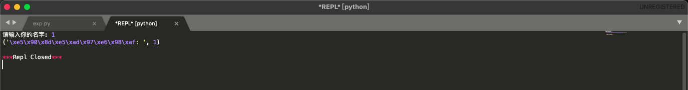

# Sublime 交互环境
> 设置一个新的`System`: `Tools` -> `Build System` -> `New Build System`

```json
{
"path": "/usr/local/bin:/usr/bin:/bin:/usr/sbin:/sbin",
"env":
{
    "TERM":"linux",
    "TERMINFO":"/etc/zsh"
},
"cmd": ["/usr/bin/python2.7", "-u", "$file"],
"file_regex": "^(...*?):([0-9]*):?([0-9]*)",
"selector": "source.python"
}
```
> 在`Sublime`界面按`command + shift + p`输入`install Package`


> 接着在输入框中输入`SublimeREPL`后等待下载安装


> 安装后，依次选择`Tools` -> `SublimeREPL` -> `Python` -> `Python - RUN current file`，接着配置快捷键: `preferences` -> `Key Binding`添加如下代码

```json
{
    "keys": ["command+n"],
    "caption": "SublimeREPL: Python - RUN current file",
    "command": "run_existing_window_command",
    "args": {
        "id": "repl_python_run",
        "file": "config/Python/Main.sublime-menu"}
},
{
    "keys": ["command+m"],
    "caption": "SublimeREPL: Python - PDB current file",
    "command": "run_existing_window_command",
    "args": {
        "id": "repl_python_pdb",
        "file": "config/Python/Main.sublime-menu"}
}
```



# pwndocker 一体化环境
> docker 安装：采用命令`brew install --cask --appdir=/Applications docker`，或者在[官网](https://docs.docker.com/desktop/mac/install/)手动下载都行

> docker 换源，用`docker info`查看换源后的内容

```json
{
  "debug": true,
  "experimental": false,
  "registry-mirrors": [
    "https://registry.docker-cn.com",
    "https://dockerhub.azk8s.cn",
    "http://hub-mirror.c.163.com"
  ]
}
```


> `pwndocker`可以在[`Docker Hub`](https://hub.docker.com/search?q=pwndocker&type=image)中寻找，这里推荐[`skysider/pwndocker`](https://hub.docker.com/r/skysider/pwndocker)

## skysider/pwndocker 安装过程
> `docker`安装`skysider/pwndocker`: `sudo docker pull skysider/pwndocker`
> 由于`python2`在`PWN`中利用的还是很频繁的，这里修改了一下`docker`，故启动命令如下

```bash
docker run -d \
    --rm \
    -h ${ctf_name} \
    --name ${ctf_name} \
    -v $(pwd)/${ctf_name}:/ctf/work \
    -p 22222:22222 \
    --privileged \
    --cap-add=SYS_PTRACE \
    h3rmesk1t/pwndocker:v1.0 \
    /sbin/init

docker exec -it ${CONTAINER ID} /bin/bash
```

# 分屏
> 调试脚本时，要先进去`tmux`，`python`脚本里面指定终端为`tmux`

```python
context.terminal = ['tmux', 'sp', '-h']
```
> 分屏使用命令

```
1，输入命令tmux使用工具
2，上下分屏：ctrl + b  再按 "
3，左右分屏：ctrl + b  再按 %
4，切换屏幕：ctrl + b  再按 o
5，关闭一个终端：ctrl + b  再按 x
6，上下分屏与左右分屏切换： ctrl + b  再按空格键
```

# 自动启动脚本
> 这里借鉴一下`0xc4m3l`师傅的脚本，使用时运行该脚本并输入`libc`的版本

```sh
export DISABLE_AUTO_TITLE="true"

session="pwn"
path=$(pwd)
libc=$1

if [ -z "$libc" ];then
	echo "plz input (pwndocker [libc])"
	exit
fi

docker stop $(docker ps -a -q)
docker rm $(docker ps -a -q)
docker run -d -it -h pwn --name pwn -v $(pwd):/ctf/work -p 22222:22222 --cap-add=SYS_PTRACE h3rmesk1t/pwndocker:v1.0 bash
docker exec -it pwn mkdir lib
docker exec -it pwn cp /glibc/"${libc}"/64/lib/ld-"${libc}".so /ctf/work/lib
docker exec -it pwn cp /glibc/"${libc}"/64/lib/libc.so.6 /ctf/work/lib
docker exec -it pwn patchelf --set-interpreter /ctf/work/lib/ld-"${libc}".so /ctf/work/pwn
docker exec -it pwn tmux
docker exec -it pwn bash
```