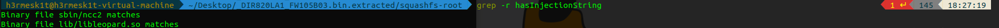

# D-Link DIR-820L

Author: H3rmesk1t

Data: 2022.07.28

# CVE-2022-26258
## 漏洞信息
漏洞信息描述: D-Link DIR-820L 1.05B03 was discovered to contain a remote command execution (RCE) vulnerability via the Device Name parameter in /lan.asp.

固件下载地址: http://www.dlinktw.com.tw/techsupport/download.ashx?file=2663.

## 漏洞分析
先分离出固件, 根据漏洞描述信息看看哪里调用了`lan.asp`.

根据漏洞描述信息, 发先在`lan.asp`中多次出现`device_name`字段.

分析一下二进制文件`ncc2`, 搜索一下`device_name`.

跟进函数`sub_4F6DFC`, 可以看到函数先会调用`hasInjectionString`函数对`Obj`进行校验, 通过后调用`_system`执行命令.

全局查找`hasInjectionString`函数在哪, 根据搜索结果进一步分析`libleopard.so`二进制文件.

可以看到`hasInjectionString`函数过滤了反引号, `\`, `;`, `'`, `|`.

## 漏洞复现
在前面的`hasInjectionString`函数中`\n`并没有被过滤, 这也就导致了`lanHostCfg_DeviceName_1.1.1.0`参数命令注入的发生, `payload`: `aa%0Atelnetd%20-l%20%2Fbin%2Fsh%20-p%204444%0A`.

