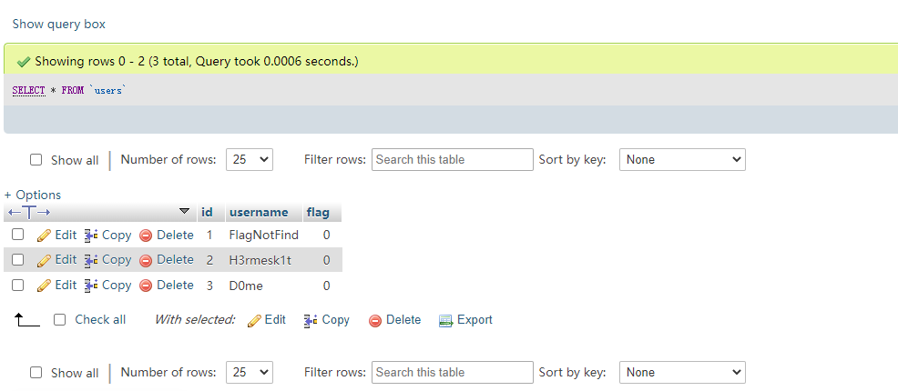
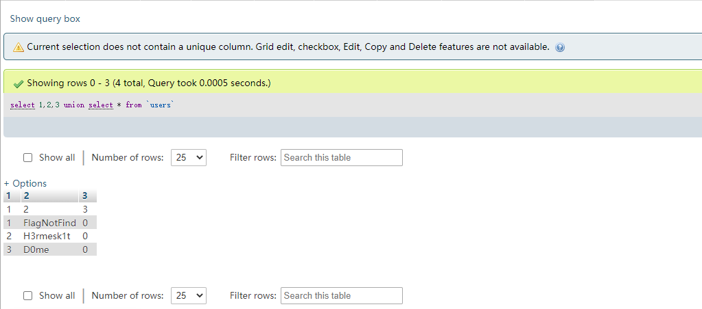

# 前言
> ​ 在 mysql => 5 的版本中存在库 information_schema 记录着 mysql 中所有表的结构；通常在 mysql 的 sql 注入中会通过此库中的表去获取其他表的表名，列名等，但是如果 information_schmea 因为某些原因被严格的过滤无法绕过的话，就可能可以通过无列名注入来获得数据信息

# 正常的查询
```sql
select * from `users`;  //正常在数据库查询时，表名需带反引号；在php端中并不需要
```



# 无列名查询
> 当正常的查询配合联合查询时，会得到一个临时的虚拟表

```sql
select 1,2,3 union select * from `users`;
```



> 此时可以看到列名被替换成了数字，因此利用这个临时的虚拟表可以进一步来查询对应列

```sql
select `2` from (select 1,2,3 union select * from `users`)a;    //需要注意每个派生表都需要一个自己的别名
```


> 如果反引号被过滤，同样继续用别名代替

```sql
select a from (select 1,2 as a,3 union select * from `users`)b;
```


> 