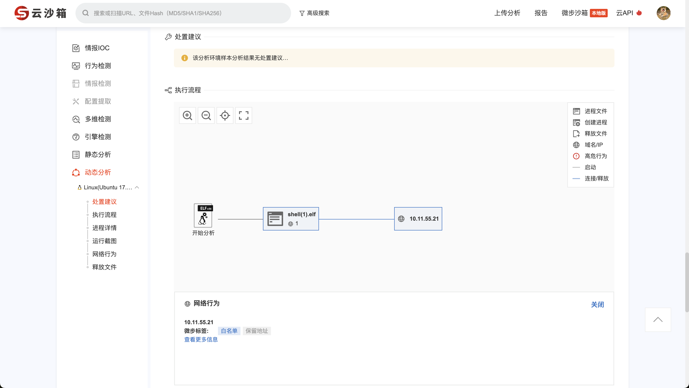
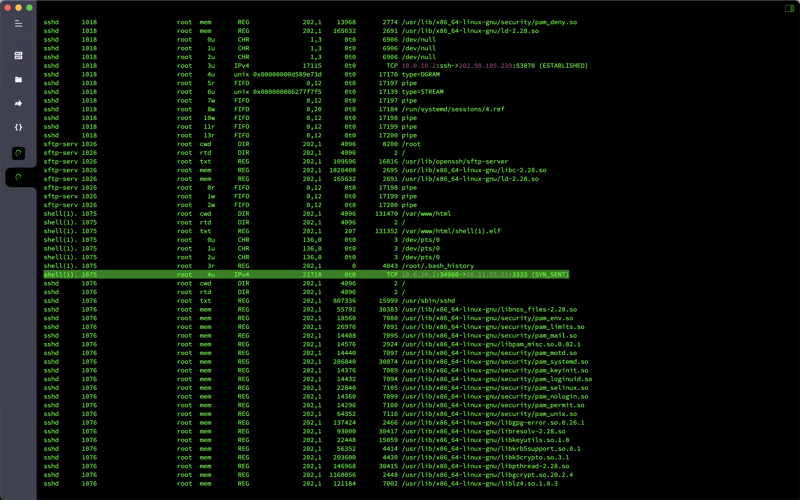

# 应急响应-Linux入侵排查

## 概述
- 靶机名：`Linux`入侵排查
- 靶机账号密码：`root`/`linuxruqin`
- 题目信息
  - `web`目录存在木马，请找到木马的密码提交
  - 服务器疑似存在不死马，请找到不死马的密码提交
  - 不死马是通过哪个文件生成的，请提交文件名
  - 黑客留下了木马文件，请找出黑客的服务器`ip`提交
  - 黑客留下了木马文件，请找出黑客服务器开启的监听端口提交

## 分析

在`WEB`目录下发现存在多个`PHP`木马，其中`1.php`是一句话木马，`index.php`是不死马，`.shell.php`是不死马生成的一句话木马。

```bash
find /var/www/html -name "*.php" | xargs egrep 'assert|eval|phpinfo\(\)|\(base64_decoolcode|shell_exec|passthru|file_put_contents\(\.\*\$|base64_decode\('
```


解一下木马中的`MD5`值，为`hello`。


在`WEB`目录下发现存在`elf`文件，丢到微步云沙箱中`Check`一下，确定是后门回连文件，回连`IP`为`10.11.55.21`，。



尝试在虚拟机里运行`shell.elf`文件，然后查看网络连接信息，发现回连黑客服务器的`3333`端口。



## Flag

- `web`目录存在木马，请找到木马的密码提交：`flag{1}`
- 服务器疑似存在不死马，请找到不死马的密码提交：`flag{hello}`
- 不死马是通过哪个文件生成的，请提交文件名：`flag{index.php}`
- 黑客留下了木马文件，请找出黑客的服务器`ip`提交：`flag{10.11.55.21}`
- 黑客留下了木马文件，请找出黑客服务器开启的监听端口提交：`flag{3333}`
