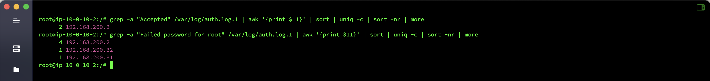
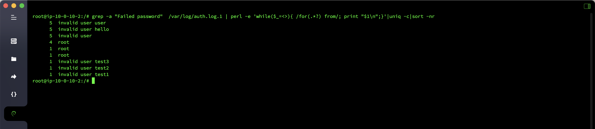
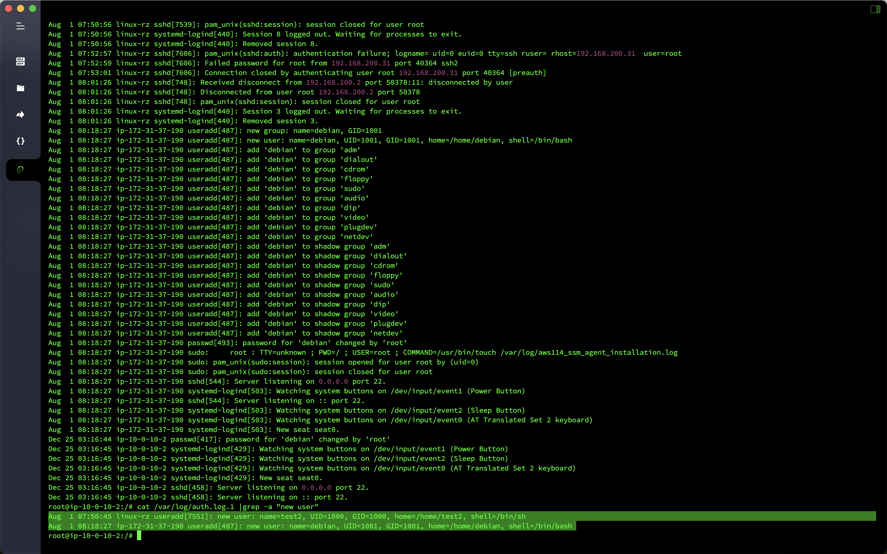

# 应急响应-Linux日志分析

## 概述
- 靶机名：`Linux`日志分析
- 靶机账号密码：`root`/`linuxrz`
- 题目信息
  - 有多少`IP`在爆破主机`ssh`的`root`帐号，如果有多个使用`,`分割
  - `ssh`爆破成功登陆的`IP`是多少，如果有多个使用`,`分割
  - 爆破用户名字典是什么，如果有多个使用`,`分割
  - 登陆成功的`IP`共爆破了多少次
  - 黑客登陆主机后新建了一个后门用户，用户名是多少

## 分析

查看爆破主机`ssh`的`root`账号失败的日志，发现一共有三个`IP`是在爆破的。

```bash
grep -a "Failed password for root" /var/log/auth.* | awk '{print $11}' | sort | uniq -c | sort -nr | more
```


查看爆破主机`ssh`的`root`账号成功的日志，发现有一个`IP`是爆破成功的，并且一共爆破了四次。

```bash
grep -a "Accepted" /var/log/auth.log.1 | awk '{print $11}' | sort | uniq -c | sort -nr | more
```

```bash
grep -a "Failed password for root" /var/log/auth.log.1 | awk '{print $11}' | sort | uniq -c | sort -nr | more
```



统计一下用来爆破的用户名有哪些，一共有六个。

```bash
grep -a "Failed password"  /var/log/auth.log.1 | perl -e 'while($_=<>){ /for(.*?) from/; print "$1\n";}'|uniq -c|sort -nr
```



服务器新建了两个后门用户，用户名分别为`test2`和`debian`。

```bash
cat /var/log/auth.log.1 |grep -a "new user"
```



## Flag

- 有多少`IP`在爆破主机`ssh`的`root`帐号，如果有多个使用`,`分割：`flag{192.168.200.2,192.168.200.32,192.168.200.31}`
- `ssh`爆破成功登陆的`IP`是多少，如果有多个使用`,`分割：`flag{192.168.200.2}`
- 爆破用户名字典是什么，如果有多个使用`,`分割：`flag{user,hello,root,test3,test2,test1}`
- 登陆成功的`IP`共爆破了多少次：`flag{4}`
- 黑客登陆主机后新建了一个后门用户，用户名是多少：`flag{test2}`
