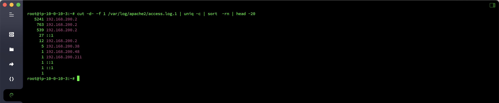
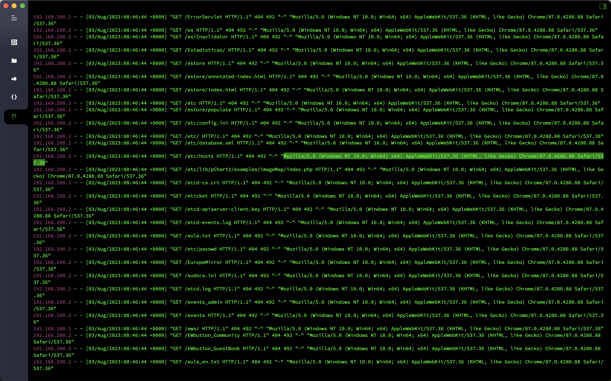

# 日志分析-Apache日志分析

## 概述
- 靶机名：`Apache`日志分析
- 靶机账号密码：`root`/`apacherizhi`
- 题目信息
  - 提交当天访问次数最多的`IP`，即黑客`IP`
  - 黑客使用的浏览器指纹是什么，提交指纹的`md5`
  - 查看`index.php`页面被访问的次数，提交次数
  - 查看黑客`IP`访问了多少次，提交次数
  - 查看`2023`年`8`月`03`日`8`时这一个小时内有多少`IP`访问，提交次数

## 分析

查看`Apache`的访问日志，统计一下访问的`IP`，当天访问次数最多的`IP`为`192.168.200.2`

```bash
cut -d- -f 1 /var/log/apache2/access.log.1 | uniq -c | sort  -rn | head -20
```



查看一下黑客的请求头信息，其使用的浏览器指纹为`Mozilla/5.0 (Windows NT 10.0; Win64; x64) AppleWebKit/537.36 (KHTML, like Gecko) Chrome/87.0.4280.88 Safari/537.36`。


```bash
cat /var/log/apache2/access.log.1 | grep -a '192.168.200.2'
```



`index.php`页面一共被访问了`27`次。

```bash
cat /var/log/apache2/access.log.1 | grep "/index.php" | wc -l
```

黑客`IP`一共访问了`6555`次

```bash
awk '{++S[$1]} END {for (a in S) print  a,S[a]}' /var/log/apache2/access.log.1
```

`2023`年`8`月`03`日`8`时这一个小时内有`5`个`IP`访问

```bash
awk '{print $4,$1}' /var/log/apache2/access.log.1 | grep  03/Aug/2023:08 | awk '{print $2}'| sort | uniq | wc -l
```


## Flag

- 提交当天访问次数最多的`IP`，即黑客`IP`：`flag{192.168.200.2}`
- 黑客使用的浏览器指纹是什么，提交指纹的`md5`：`flag{2d6330f380f44ac20f3a02eed0958f66}`
- 查看`index.php`页面被访问的次数，提交次数：`flag{27}`
- 查看黑客`IP`访问了多少次，提交次数：`flag{6555}`
- 查看`2023`年`8`月`03`日`8`时这一个小时内有多少`IP`访问，提交次数：`flag{5}`

