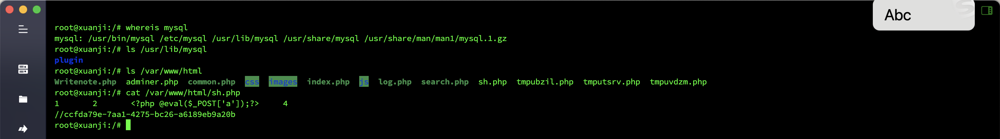
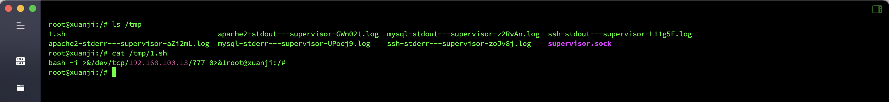
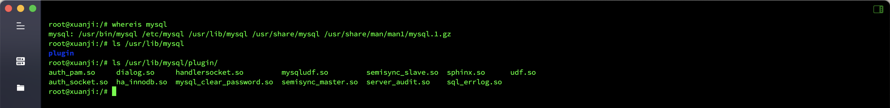
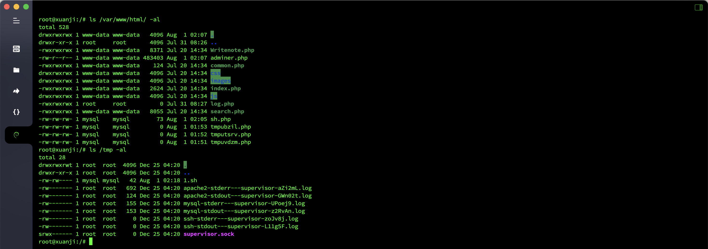

# 日志分析-MySQL应急响应

## 概述
- 靶机名：`MySQL`应急响应
- 靶机账号密码：`root`/`xjmysql`
- 题目信息
  - 黑客第一次写入的`shell`
  - 黑客反弹`shell`的`ip`
  - 黑客提权文件的完整路径的`md5`
  - 黑客获取的权限

## 分析

查看一下`WEB`目录，黑客第一次写入的`shell`为`/var/www/html/sh.php`。

在`tmp`目录下发现反弹`Shell`文件，反弹`Shell`的`IP`为`192.168.100.13`

由于是`MySQL`，猜测是`UDF`提权，先查找一下`MySQL`的插件路径，提权文件路径为`/usr/lib/mysql/plugin/udf.so`。

查看文件权限，为`mysql`。

## Flag

- 黑客第一次写入的`shell`：`flag{ccfda79e-7aa1-4275-bc26-a6189eb9a20b}`
- 黑客反弹`shell`的`ip`：`flag{192.168.100.13}`
- 黑客提权文件的完整路径的`md5`：`flag{b1818bde4e310f3d23f1005185b973e7}`
- 黑客获取的权限：`flag{mysql}`
