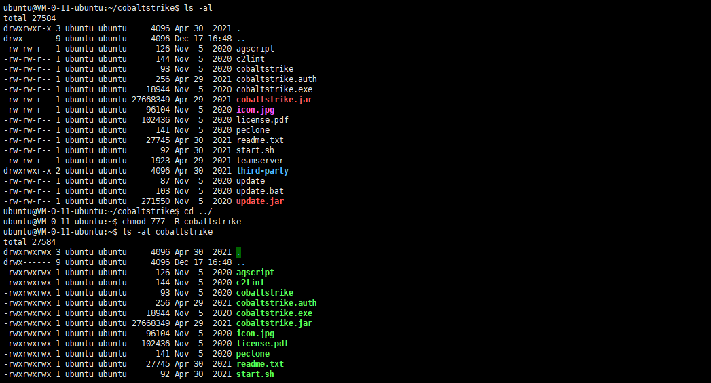
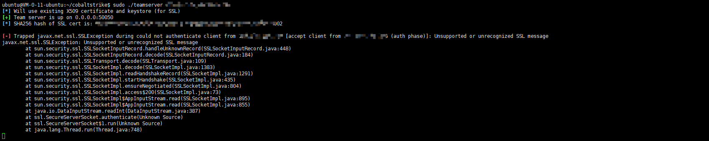

# VPS搭建CobaltStrike

# 前言
在研究`CobaltStrike`甚至是`Metasploit`都是在内网环境中，在测试某些东西时都是内网环境且没有公网地址；或者当打下一台边界主机需要在上面架设一个`CobaltStrike`时，本文记录一下在`vps`上搭建`CobaltStrike`服务端，解决打单点主机的一些问题。

# Cobalt Strike简介
`Cobalt Strike`是一款米国开发的渗透测试神器，常被业界人称为`CS`，其拥有多种协议主机上线方式，集成了提权，凭据导出，端口转发，`socket`代理，`office`攻击，文件捆绑，钓鱼等功能

`Cobalt Strike`由`3`部分构成：TeamServer、Client、Server
> * Server：被控主机，就是植入后门、获取了权限的服务器，代表被攻击方，`Server`会和`TeamServer`联系
> * Client：客户机，也就是攻击机，代表攻击方，`Client`会和`TeamServer`联系。
> * TeamServer：团队协作服务器，可以管理多个`beacon`会话，同一个`beacon`会话可以被多个`Clinet`所使用，一个`beacon`会话就相当于一个协作文档，可以多人操作

需要注意的是，服务端只有一个，而客户端可以有多个，团队可进行分布式协团操作。客户端可在`windows`上运行，但服务端必须在`Linux`上运行，且两者都需`Java`环境。

# 环境搭建
## JDK环境搭建
由于`CobaltStrike`是`Java`开发，在`Windows`或`Linux`上使用都需要一个`Java`环境，因此先进行`JDK`环境安装

检验是否已经安装`java`，未安装的话根据提示选择需要的版本进行安装即可

检验是否成功安装

## CobaltStrike安装
这里给出一个`CobaltStrike4.3.7`的[下载链接](https://anonfiles.com/D9F854E7u0/cobaltstrike4.3_7z)，解压密码为：`H3rmesk1t`

将`CobaltStrike`上传到`vps`上

进入目录，给`teamserver`赋予`777`权限

启动服务端：./teamserver vps的ip 连接密码
客户端根据服务端的信息进行连接

如果出现连接被拒绝情况，请开启端口`sudo ufw allow 50050`
