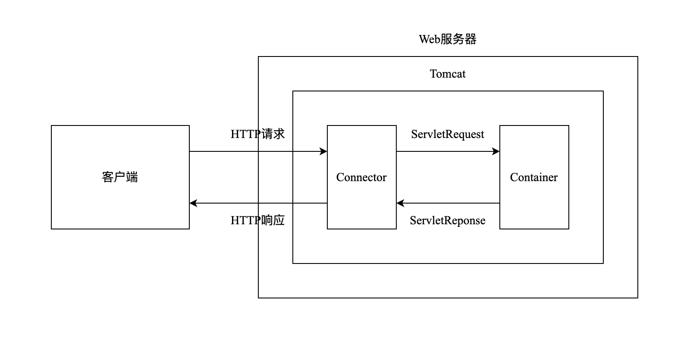
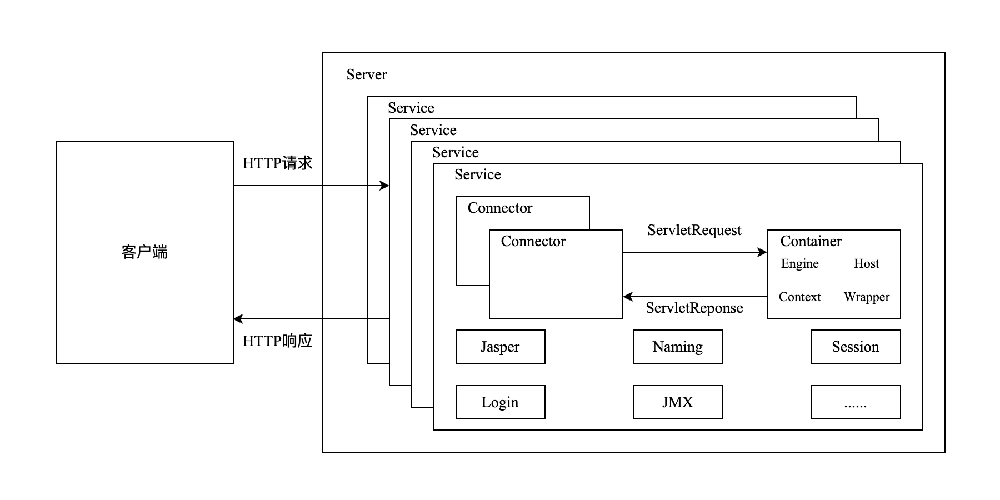
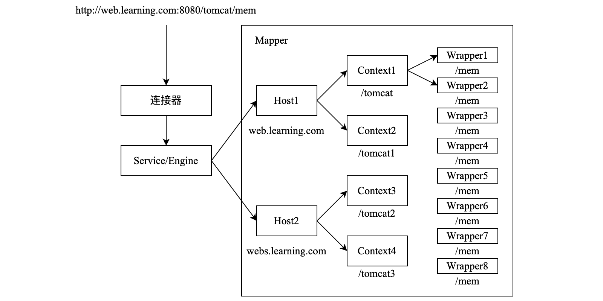
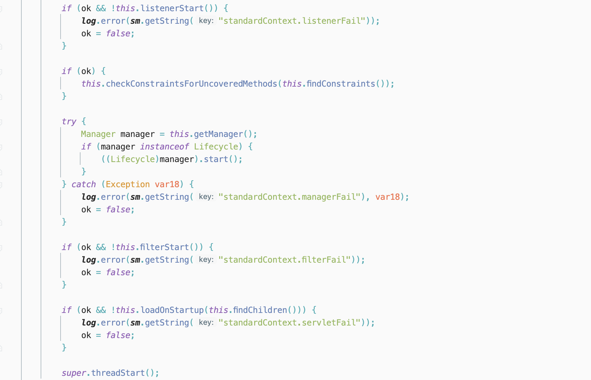
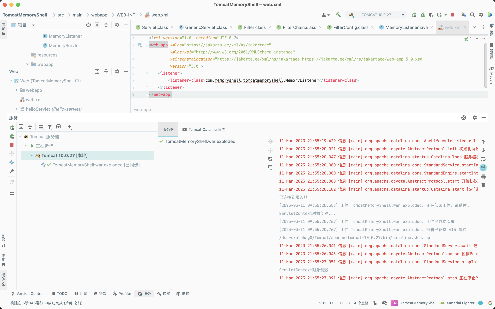
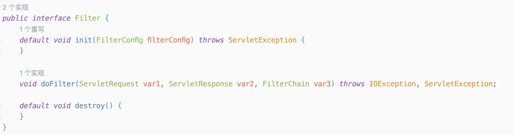
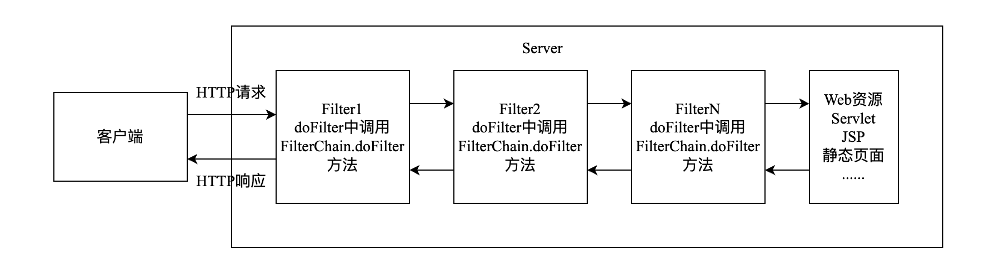
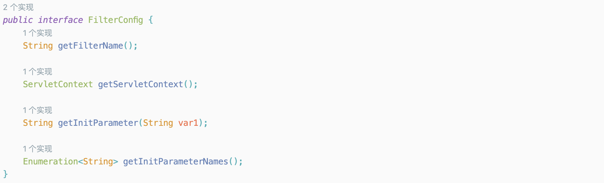
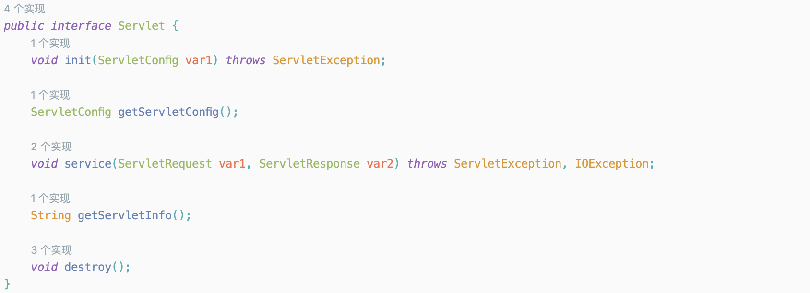

# Java Security Of Tomcat Architecture Analysis

## Introduction

​	`Apache Tomcat`软件是`Java Servlet`、`JavaServer Pages`、`Java Expression Language`和`Java WebSocket`技术的一个开源实现。`Java Servlet`、`JavaServer Pages`、`Java Expression Language`和`Java WebSocket`规范是在`Java Community Process`下开发的。

​	简单来说，`Tomcat`可以看成是`Web`服务器加`Servlet`容器。



​	在上面的流程图中，`Tomcat`通过`Connector`组件接收并解析`HTTP`请求，将`ServletRequest`对象发送给`Container`进行处理。`Container`处理完成后会将响应封装成`ServletRespone`对象返回给`Connector`，然后`Connector`再将`ServletRespone`对象解析成`HTTP`响应文本格式发送给客户端，至此`Tomcat`就完成了一次网络通信。

## Architecture



​	在`Tomcat`架构图中主要包含三个组件：`Service`、`Connectot`、`Container`。

- `Server`：`Web`服务器，一个`Server`中可以包含多个`Service`。
- `Service`：每一个`Service`都是独立的，它们共享一个`JVM`以及系统类库，并且一个`Service`负责维护多个`Connector`和一个`Container`。
- `Connector`：`Connector`用于连接`Service`和`Container`，解析客户端的请求并转发到`Container`，以及转发来自`Container`的响应。每一种不同的`Connector`都可以处理不同的请求协议，包括`HTTP/1.1`、`HTTP/2`、`AJP`等等。
- `Container`：`Tomcat`的`Container`包含四种子容器，分别为`Engine`、`Host`、`Context`和`Wrapper`。其中，一个`Container`对应一个`Engine`，一个`Engine`可以包含多个`Host`，一个`Host`可以包含多个`Context`，一个`Context`又包含多个`Wrapper`。
  - `Engine`：可以看成是容器对外提供功能的入口，每个`Engine`是`Host`的集合，用于管理各个`Host`。
  - `Host`：可以看成一个`虚拟主机`，一个`Tomcat`可以支持多个虚拟主机。虚拟主机的作用就是运行多个应用，它负责安装和展开这些应用，并且标识这个应用以便能够区分它们，每个虚拟主机对应的一个域名，不同`Host`容器接受处理对应不同域名的请求。
  - `Context`：上下文容器，可以将其看成一个`Web`应用，每个`Host`里面可以运行多个`Web`应用。同一个`Host`里面不同的`Context`，其`contextPath`必须不同，默认`Context`的`contextPath`为空格或斜杠。
  - `Wrapper`：对`Servlet`的抽象和包装，每个`Context`可以有多个`Wrapper`，用于支持不同的`Servlet`，每个`Wrapper`实例表示一个具体的`Servlet`定义，`Wrapper`主要负责管理`Servlet`，包括`Servlet`的装载、初始化、执行以及资源回收。

​	下图展示了请求在`Container`中的解析过程：



## Three Major Components

​	`Java Web`中有三大组件，分别是`Servlet`、`Filter`和`Listener`。三者的加载顺序为`Listener`->`Filter`->`Servlet`。

​	在`org.apache.catalina.core.StandardContext`类的`startInternal`方法中，首先调用了`listenerStart`，接着是`filterStart`，最后是`loadOnStartup`。这三处调用分别触发了`Listener`、`Filter`、`Servlet`的构造加载。



### Listener

#### Conception

​	`Listener`是一个实现了特定接口的`Java`程序，用于监听一个方法或者属性，当被监听的方法被调用或者属性改变时，就会自动执行某个方法。

​	与`Listener`相关的概念：

- 事件：某个方法被调用，或者属性的改变；
- 事件源：被监听的对象（如`ServletContext`、`requset`、方法等）；
- 监听器：用于监听事件源，当发生事件时会触发监听器。

​	监听器分类：

|     事件源     |             监听器              |                             描述                             |
| :------------: | :-----------------------------: | :----------------------------------------------------------: |
| ServletContext |     ServletContextListener      |         用于监听 ServletContext 对象的创建与销毁过程         |
|  HttpSession   |       HttpSessionListener       |          用于监听 HttpSession 对象的创建和销毁过程           |
| ServletRequest |     ServletRequestListener      |         用于监听 ServletRequest 对象的创建和销毁过程         |
| ServletContext | ServletContextAttributeListener |      用于监听 ServletContext 对象的属性新增、移除和替换      |
|  HttpSession   |  HttpSessionAttributeListener   |       用于监听 HttpSession 对象的属性新增、移除和替换        |
| ServletRequest | ServletRequestAttributeListener |    用于监听 HttpServletRequest 对象的属性新增、移除和替换    |
|  HttpSession   |   HttpSessionBindingListener    | 用于监听 JavaBean 对象绑定到 HttpSession 对象和从 HttpSession 对象解绑的事件 |
|  HttpSession   |  HttpSessionActivationListener  |         用于监听 HttpSession 中对象活化和钝化的过程          |

​	按照监听的对象不同将其划分为三类：`ServletContextListener`，`HttpSessionListener`和`ServletRequestListener`。	

#### Usage

- `ServletContextListener`配置

```java
package com.memoryshell.tomcatmemoryshell;

import jakarta.servlet.ServletContextEvent;
import jakarta.servlet.ServletContextListener;
import jakarta.servlet.annotation.WebListener;

@WebListener
public class MemoryListener implements ServletContextListener {
    @Override
    public void contextInitialized(ServletContextEvent servletContextEvent) {
        System.out.println("ServletContext对象创建...");
    }

    @Override
    public void contextDestroyed(ServletContextEvent servletContextEvent) {
        System.out.println("ServletContext对象销毁...");
    }
}
```

- `web.xml`配置

```xml
<?xml version="1.0" encoding="UTF-8"?>
<web-app xmlns="https://jakarta.ee/xml/ns/jakartaee"
         xmlns:xsi="http://www.w3.org/2001/XMLSchema-instance"
         xsi:schemaLocation="https://jakarta.ee/xml/ns/jakartaee https://jakarta.ee/xml/ns/jakartaee/web-app_5_0.xsd"
         version="5.0">
    <listener>
        <listener-class>com.memoryshell.tomcatmemoryshell.MemoryListener</listener-class>
    </listener>
</web-app>
```



### Filter

#### Conception

​	`Filter`用于拦截用户请求以及服务端的响应，能够在拦截之后对请求和响应做出相应的修改。`Filter`不是`Servlet`，不能直接访问，它能够对于`Web`应用中的资源（`Servlet`、`JSP`、静态页面等）做出拦截，从而实现一些相应的功能。

#### Life Cycle

​	`Filter`的生命周期分为三个阶段：

- 初始化阶段：`Filter`的初始化阶段只会在`Web`应用程序启动时调用一次。
- 拦截和过滤阶段：当客户请求访问与过滤器关联的`URL`的时候，`Servlet`过滤器将先执行`doFilter`方法。`FilterChain`参数用于访问后续过滤器。
- 销毁阶段：`Filter`的销毁阶段只会在web`应用移除或服务器停止时才调用一次来卸载`Filter`对象。



#### Usage

- `FilterChain`

​	一个`Servlet`可以注册多个`Filter`，`Web`容器会将注册的多个`Filter`组合成一个`"Filter链"`，并按照一定的顺序依次执行各`Filter`的`doFilter`方法。



- `Filter execution sequence`

​	由于`Filter`的注册方式不同，其执行顺序也有所不同。

1. 基于注解配置：按照类名的字符串比较规则比较，值小的先执行；
1. 使用`web.xml`配置：根据对应的`Mapping的`顺序组织，谁定义在上边谁就在前。

- `FilterConfig`

​	和`Servlet`类似，由于`Filter`也有可能访问`Servlet`，所以`Servlet`规范将代表`ServletContext`对象和`Filter`的配置参数信息都封装到一个称为`FilterConfig`的对象中。

​	`FilterConfig`接口则用于定义`FilterConfig`对象应该对外提供的方法，以便在`Filter`的`doFilter`方法中可以调用这些方法来获取`ServletContext`对象，以及获取在`web.xml`文件中的一些初始化参数。



### Servlet

#### Conception

​	`Servlet`是运行在`Web`服务器或应用服务器上的程序，它是作为来自`HTTP`客户端的请求和`HTTP`服务器上的数据库或应用程序之间的中间层。用来处理客户端请求的动态资源，并根据请求生成相应的返回信息提供给用户，当`Tomcat`接收到来自客户端的请求时，会将其解析成`RequestServlet`对象并发送到对应的`Servlet`上进行处理。

#### Life Cycle

​	`Servlet`的生命周期分为五个阶段：

- 加载阶段：当`Tomcat`第一次访问`Servlet`时，会创建`Servlet`的实例。
- 初始化阶段：当`Servlet`实例化后，`Tomcat`会调用`init`方法初始化这个对象。
- 处理服务阶段：当浏览器访问`Servlet`时，`Servlet`会调用`service`方法处理请求。
- 销毁阶段：当`Tomcat`关闭时或者检测到`Servlet`要从`Tomcat`删除时，会自动调用`destroy`方法，让该实例释放掉所占的资源。除此之外，一个`Servlet`如果长时间不被使用的话，也会被`Tomcat`自动销毁。
- 卸载阶段：当`Servlet`调用完`destroy`方法后，会等待垃圾回收。如果有需要再次使用这个`Servlet`时，会重新调用`init`方法进行初始化操作。



#### Usage

​	根据上文对`Servlet`生命周期的了解，当需要实现一个`Servlet`时，需要继承`Servlet`接口，并实现相应的五个方法。

​	在`Tomcat`中已经封装好了两个类，分别是`GenericServlet`类和`HttpServlet`类。`GenericServlet`抽象类实现了`Servlet`接口，并对`Servlet`接口中除`service`方法外的其它四个方法进行了简单实现。

​	通过继承`GenericServlet`类创建来`Servlet`，只需要重写`service`方法即可。但是，`GenericServlet`抽象类是一个通用的`Servlet`类，并不是针对某种应用场景而设计的，因此在处理`HTTP`请求的时候需要手动实现对`HTTP`请求的解析和封装。

​	`HttpServlet`是`GenericServlet`的子类，它在`GenericServlet`的基础上专门针对`HTTP`协议进行了处理。其针对每一种`HTTP`请求都设置了一种处理方法。当使用`HttpServlet`类的时候，只需要根据`HTTP`请求类型重写相应的处理方法即可。

```java
@WebServlet(name = "MemoryServlet", value = "/MemoryServlet")
public class MemoryServlet extends HttpServlet {
    private String message;

    @Override
    public void init() {
        message = "This is MemoryShell page!";
    }

    @Override
    public void doGet(HttpServletRequest request, HttpServletResponse response) throws IOException {
        response.setContentType("text/html");

        // Hello
        PrintWriter out = response.getWriter();
        out.println("<html><body>");
        out.println("<h1>" + message + "</h1>");
        out.println("</body></html>");
    }
}
```

## Reference

- [Java安全学习——Tomcat架构浅析](https://goodapple.top/archives/1359)


