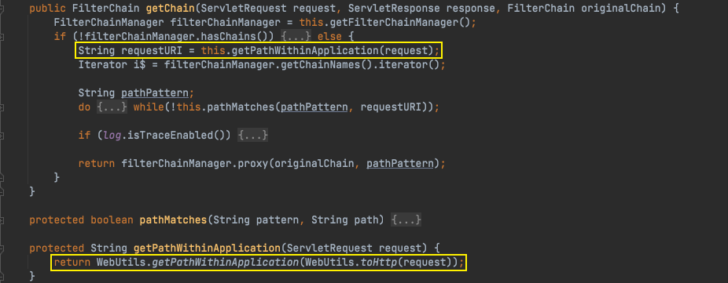
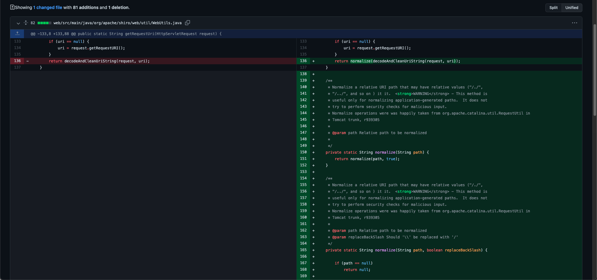

# Java安全学习—Shiro学习

Author: H3rmesk1t

Data: 2022.03.25

# 前言
本篇文章主要是简单地学习和分析权限校验框架`Shiro`在历史上爆出的共`11`个带有`CVE`编号的漏洞, 根据每个`CVE`漏洞的原理, 版本更新的代码来分析安全漏洞产生的原理、利用方式、特性等.

<div align=center></div>


# Shiro 简介
[Apache Shiro](https://shiro.apache.org/) is a powerful and easy-to-use Java security framework that performs authentication, authorization, cryptography, and session management. With Shiro's easy-to-understand API, you can quickly and easily secure any application – from the smallest mobile applications to the largest web and enterprise applications.


# Shiro 功能
Apache Shiro aims to be the most comprehensive, but also the easiest to use Java security framework available. Here are some of the frameworks finer points.
 - The easiest to understand Java Security API anywhere. Class and Interface names are intuitive and make sense. Anything is pluggable but good defaults exist for everything.
 - Support `authentication` ('logins') across one or more pluggable data sources (LDAP, JDBC, ActiveDirectory, etc).
 - Perform `authorization` ('access control') based on roles or fine-grained `permissions`, also using pluggable data sources.
 - First-class `caching` support for enhanced application performance.
 - Built-in POJO-based Enterprise `Session Management`. Use in both web and non-web environments or in any environment where Single Sign On (SSO) or clustered or distributed sessions are desired.
 - Heterogeneous client session access. You are no longer forced to use only the <tt>httpSession</tt> or Stateful Session Beans, which often unnecessarily tie applications to specific environments. Flash applets, C# applications, Java Web Start, and Web Applications, etc. can now all share session state regardless of deployment environment.
 - Simple Single Sign-On (SSO) support piggybacking the above Enterprise Session Management. If sessions are federated across multiple applications, the user's authentication state can be shared too. Log in once to any application and the others all recognize that log-in.
 - Secure data with the easiest possible `Cryptography` APIs available, giving you power and simplicity beyond what Java provides by default for ciphers and hashes.
 - An incredibly robust yet low-configuration web framework that can secure any url or resource, automatically handle logins and logouts, perform Remember Me services, and more.
 - Extremely low number of required dependencies. Standalone configuration requires only <tt>slf4j-api.jar</tt> and one of slf4j's binding .jars. Web configuration additionally requires <tt>commons-beanutils-core.jar</tt>. Feature-based dependencies (Ehcache caching, Quartz-based Session validation, Spring dependency injection, etc.) can be added when needed.

## Authentication
[Authentication](https://shiro.apache.org/authentication-features.html) is the process of identity verification – you are trying to verify a user is who they say they are. To do so, a user needs to provide some sort of proof of identity that your system understands and trusts.
 - `Subject Based`: Almost everything you do in Shiro is based on the currently executing user, called a Subject. And you can easily retrieve the Subject anywhere in your code. This makes it easier for you to understand and work with Shiro in your applications.
 - `Single Method call`: The authentication process is a single method call. Needing only one method call keeps the API simple and your application code clean, saving you time and effort.
 - `Rich Exception Hierarchy`: Shiro offers a rich exception hierarchy to offered detailed explanations for why a login failed. The hierarchy can help you more easily diagnose code bugs or customer services issues related to authentication. In addition, the richness can help you create more complex authentication functionality if needed.
 - `'Remember Me' built in`: Standard in the Shiro API is the ability to remember your users if they return to your application. You can offer a better user experience to them with minimal development effort.
 - `Pluggable data sources`: Shiro uses pluggable data access objects (DAOs), called Realms, to connect to security data sources like LDAP and Active Directory. To help you avoid building and maintaining integrations yourself, Shiro provides out-of-the-box realms for popular data sources like LDAP, Active Directory, and JDBC. If needed, you can also create your own realms to support specific functionality not included in the basic realms.
 - `Login with one or more realms`: Using Shiro, you can easily authenticate a user against one or more realms and return one unified view of their identity. In addition, you can customize the authentication process with Shiro's notion of an authentication strategy. The strategies can be setup in configuration files so changes don't require source code modifications – reducing complexity and maintenance effort.

## Authorization
[Authorization](https://shiro.apache.org/authorization-features.html), also called access control, is the process of determining access rights to resources in an application. 
 - `Subject-based`: Almost everything you do in Shiro is based on the currently executing user, called a Subject. And you can easily access the subject retrieve the Subject and checks its roles, permissions, or other relevant attributes anywhere in your code. This makes it easier for you to understand and work with Shiro in your applications.
 - `Checks based on roles or permissions`: Since the complexity of authorization differs greatly between applications, Shiro is designed to be flexible, supporting both role-based security and permission-based security based on your projects needs.
 - `Powerful and intuitive permission syntax`: As an option, Shiro provides an out-of-the-box permission syntax, called Wildcard Permissions, that help you model the fine grained access policies your application may have. By using Shiro's Wildcard Permissions you get an easy-to-process and human readable syntax. Moreoever, you don't have to go through the time-consuming effort and complexity of creating your own method for representing your access policies.
 - `Multiple enforcement options`: Authorization checks in Shiro can be done through in-code checks, JDK 1.5 annotations, AOP, and JSP/GSP Taglibs. Shiro's goal is to give you the choice to use the option you think are best based on your preferences and project needs.
 - `Strong caching support`: Any of the modern open-source and/or enterprise caching products can be plugged in to Shiro to provide a fast and efficient user-experience. For authorization, caching is crucial for performance in larger environments or with more complex policies using back-end security data sources.
 - `Pluggable data sources`: Shiro uses pluggable data access objects, referred to as Realms, to connect to security data sources where you keep your access control information, like an LDAP server or a relational database. To help you avoid building and maintaining integrations yourself, Shiro provides out-of-the-box realms for popular data sources like LDAP, Active Directory, and JDBC. If needed, you can also create your own realms to support specific functionality not included in the basic realms.
 - `Supports any data model`: Shiro can support any data model for access control — it doesn't force a model on you. Your realm implementation ultimately decides how your permissions and roles are grouped together and whether to return a "yes" or a "no" answer to Shiro. This feature allows you to architect your application in the manner you chose and Shiro will bend to support you.

## Permissions
Shiro defines a [Permission](https://shiro.apache.org/permissions.html) as a statement that defines an explicit behavior or action. It is a statement of raw functionality in an application and nothing more. Permissions are the lowest-level constructs in security polices, and they explicitly define only "what" the application can do.

Some examples of permissions:
 - Open a file.
 - View the '/user/list' web page.
 - Print documents.
 - Delete the 'jsmith' user.

The above examples of permissions, "Open a file", "View the 'user/list' web page", etc are all valid permission statements.However, it would be very difficult computationally to interpret those natural language strings and determine if a user is allowed to perform that behavior or not. So to enable easy-to-process yet still readable permission statements, Shiro provides powerful and intuitive permission syntax we refer to as the WildcardPermission.

## Caching
[Caching](https://shiro.apache.org/caching.html) is a first class feature built into Shiro from day one to ensure that security operations remain as fast as possible. However, while Caching as a concept is a fundamental part of Shiro, implementing a full Cache mechanism would be outside the core competency of a security framework. To that end, Shiro's cache support is basically an abstraction (wrapper) API that will 'sit' on top of an underlying production Cache mechanism (e.g. Hazelcast, Ehcache, OSCache, Terracotta, Coherence, GigaSpaces, JBossCache, etc). This allows a Shiro end-user to configure any cache mechanism they prefer.

Shiro has three important cache interfaces:
 - `CacheManager`: The primary Manager component for all caching, it returns Cache instances.
 - `Cache`: Maintains key/value pairs.
 - `CacheManagerAware`: Implemented by components wishing to receive and use a CacheManager instance.

A CacheManager returns Cache instances and various Shiro components use those Cache instances to cache data as necessary. Any Shiro component that implements CacheManagerAware will automatically receive a configured CacheManager, where it can be used to acquire Cache instances.

## Session Management
[Sessions](https://shiro.apache.org/session-management-features.html) are buckets of data that your users carry with them for a period of time when using your application. Sessions have traditionally been exclusive to web or EJB environments. No more! Shiro enables sessions for any application environment. Further, Shiro offers to a host of other great features to help you manage sessions.
 - `POJO/J2SE based (IoC friendly)`: Everything in Shiro (including all aspects of Sessions and Session Management) is interface-based and implemented with POJOs. This allows you to easily configure all session components with any JavaBeans-compatible configuration format, like JSON, YAML, Spring XML or similar mechanisms. You can also easily extend Shiro's components or write your own as necessary to fully customize session management functionality.
 - `Session Storage`: Because Shiro's Session objects are POJO-based, session data can be easily stored in any number of data sources. This allows you to customize exactly where your application's session data resides, for example, the file system, an enterprise cache, a relational database, or proprietary data store.
 - `Easy and Powerful Clustering`: Shiro's sessions can be easily clustered using any of the readily-available networked caching products, like Ehcache, Coherence, GigaSpaces, et. al. This means you can configure session clustering for Shiro once and only once, and no matter what web container you deploy to, your sessions will be clustered the same way. No need for container-specific configuration!
 - `Heterogeneous Client Access`: Unlike EJB or Web sessions, Shiro sessions can be 'shared' across various client technologies. For example, a desktop application could 'see' and 'share' the same physical session used by the same user in a server-side web application. We are unaware of any framework other than Shiro that can support this.
 - `Event listeners`: Event listeners allow you to listen to lifecycle events during a session's lifetime. You can listen for these events and react to them for custom application behavior - for example, updating a user record when their session expires.
 - `Host address retention`: Shiro Sessions retain the IP address of the host from where the session was initiated. This allows you to determine where the user is located and react accordingly (mostly useful in intranet environments where IP association is deterministic).
 - `Inactivity/expiration support`: Sessions expire due to inactivity as expected, but they can be prolonged via a touch() method to keep them 'alive' if desired. This is useful in Rich Internet Application (RIA) environments where the user might be using a desktop application, but may not be regularly communicating with the server, but the server session should not expire.
 - `Transparent web use`: Shiro's web support implements the HttpSession interface and all of it's associated APIs. This means you can use Shiro sessions in existing web applications and you don't need to change any of your existing web code.
 - `Can be used for SSO`: Because Shiro's sessions are POJO based, they are easily stored in any data source, and they can be 'shared' across applications if needed. This can be used to provide a simple sign-on experience since the shared session can retain authentication state.

## Cryptography
[Cryptography](https://shiro.apache.org/cryptography-features.html) is the practice of protecting information from undesired access by hiding it or converting it into nonsense so no one else can read it. Shiro focuses on two core elements of Cryptography: ciphers that encrypt data like email using a public or private key, and hashes (aka message digests) that irreversibly encrypt data like passwords.
 - `Interface-driven, POJO based`: All of Shiro’s APIs are interface-based and implemented as POJOs. This allows you to easily configure Shiro Cryptography components with JavaBeans-compatible formats like JSON, YAML, Spring XML and others. You can also override or customize Shiro as you see necessary, leveraging its API to save you time and effort.
 - `Simplified wrapper over JCE`: The Java Cryptography Extension (JCE) can be complicated and difficult to use unless you’re a cryptography expert. Shiro’s Cryptography APIs are much easier to understand and use, and they dramatically simplify JCE concepts. So now even Cryptography novices can find what they need in minutes rather than hours or days. And you won’t sacrifice any functionality because you still have access to more complicated JCE options if you need them.
 - `"Object Orientifies" cryptography concepts`: The JDK/JCE’s Cipher and Message Digest (Hash) classes are abstract classes and quite confusing, requiring you to use obtuse factory methods with type-unsafe string arguments to acquire instances you want to use. Shiro 'Object Orientifies' Ciphers and Hashes, basing them on a clean object hierarchy, and allows you to use them by simple instantiation.
 - `Runtime Exceptions`: Like everywhere else in Shiro, all cryptography exceptions are RuntimeExceptions. You can decide whether to catch an exception based on your needs.


# Shiro 关键组件
一次认证及授权的校验流程基本如下:
 - 应用程序通过获取当前访问的`Subject`并调用其相应校验方法;
 - `Subject`将校验委托给`SecurityManager`进行判断;
 - `SecurityManager`会调用`Realm`来获取信息来判断用户对应的角色能否进行操作.

## SecurityManager
`org.apache.shiro.mgt.SecurityManager`是`shiro`的一个核心接口, 接口负责了一个`Subject`的全部安全操作:
 - 接口本身定义了`createSubject`、`login`、`logout`三个方法用来创建`Subject`、登陆和退出.
 - 接口扩展了`org.apache.shiro.authc.Authenticator`接口, 提供了`authenticate`方法用来进行认证.
 - 接口扩展了`org.apache.shiro.authz.Authorizer`接口, 提供了对`Permission`和`Role`的校验方法, 包括`has`/`is`/`check`相关命名的方法.
 - 接口扩展了`org.apache.shiro.session.mgt.SessionManager`接口, 提供了`start`、`getSession`方法用来创建可获取会话.

并且`Shiro`为`SecurityManager`提供了一个包含了上述所有功能的默认实现类`org.apache.shiro.mgt.DefaultSecurityManager`.

<div align=center></div>

`DefaultSecurityManager`中包含以下属性:
 - `subjectFactory`: 默认使用`DefaultSubjectFactory`, 用来创建具体`Subject`实现类.
 - `subjectDAO`: 默认使用`DefaultSubjectDAO`, 用于将`Subject`中最近信息保存到`Session`里面.
 - `rememberMeManager`: 用于提供`RememberMe`相关功能.
 - `sessionManager`: 默认使用`DefaultSessionManager`, `Session`相关操作会委托给这个类.
 - `authorizer`: 默认使用`ModularRealmAuthorizer`, 用来配置授权策略.
 - `authenticator`: 默认使用`ModularRealmAuthenticator`, 用来配置认证策略.
 - `realm`: 对认证和授权的配置, 由用户自行配置, 包括`CasRealm`、`JdbcRealm`等.
 - `cacheManager`: 缓存管理, 由用户自行配置, 在认证和授权时先经过, 用来提升认证授权速度.

`DefaultSecurityManager`还有一个子类`org.apache.shiro.web.mgt.DefaultWebSecurityManager`,这个类在`shiro-web`包中, 是`Shiro`为`HTTP`/`SOAP`等`http`协议连接提供的实现类, 这个类默认创建配置了`org.apache.shiro.web.mgt.CookieRememberMeManager`用来提供`RememberMe`相关功能.

<div align=center></div>

## Subject
`org.apache.shiro.subject.Subject`是一个接口, 用来表示在`Shiro`中的一个用户. 因为在太多组件中都使用了`User`的概念, 所以`Shiro`故意避开了这个关键字, 使用了`Subject`.

`Subject`接口同样提供了认证、授权以及获取会话的能力, 在应用程序中如果想要获取一个当前的`Subject`, 通常使用`SecurityUtils#getSubject`方法.

实际上, `Subject`接口在`core`包中的实现类`org.apache.shiro.subject.support.DelegatingSubject`本质上也就是一个`SecurityManager`的代理类. `DelegatingSubject`中保存了一个`transient`修饰的`SecurityManager`成员变量, 在使用具体的校验方法时, 实际上委托`SecurityManager`进行处理.

<div align=center></div>

<div align=center></div>

## Realm
`Realm`主要用处是权限和角色的认定. `org.apache.shiro.realm.Realm`是`Shiro`中的一个接口, `Shiro`通过`Realm`来访问指定应用的安全实体——用户、角色、权限等. 一个`Realm`通常与一个数据源有`1`对`1`的对应关系, 如关系型数据库、文件系统或者其他类似的资源. 因此, 此接口的实现类将使用特定于数据源的`API`来进行认证或授权, 如`JDBC`、文件`IO`、`Hibernate/JPA`等等, 官方将其解释为: 特定于安全的`DAO`层.

在使用中, 开发人员通常不会直接实现`Realm`接口, 而是实现`Shiro`提供了一些相关功能的抽象类`AuthenticatingRealm`/`AuthorizingRealm`, 或者使用针对特定数据源提供的实现类如`JndiLdapRealm`/`JdbcRealm`/`PropertiesRealm`/`TextConfigurationRealm`/`IniRealm`等等.

<div align=center></div>

# Shiro 漏洞环境搭建
可以使用我自己搭建的一个简易的`Demo`: [ShiroVulnerabilityDemo](https://github.com/H3rmesk1t/JavaSec-Learn/tree/main/ShiroVulnerabilityDemo). 或者按照`su18`师傅文章中的[使用方式](https://su18.org/post/shiro-1/#:~:text=%E8%83%BD%E5%90%A6%E8%BF%9B%E8%A1%8C%E6%93%8D%E4%BD%9C%E3%80%82-,%E4%BD%BF%E7%94%A8,-%E6%9C%AC%E7%AB%A0%E6%9D%A5%E7%9C%8B%E4%B8%80%E4%B8%8B)来进行搭建.

# Shiro 漏洞分析复现
## CVE-2010-3863
### 漏洞信息
[CVE-2010-3863](https://cve.mitre.org/cgi-bin/cvename.cgi?name=CVE-2010-3863): Apache Shiro before 1.1.0, and JSecurity 0.9.x, does not canonicalize URI paths before comparing them to entries in the shiro.ini file, which allows remote attackers to bypass intended access restrictions via a crafted request, as demonstrated by the `/./account/index.jsp` URI.

### 漏洞分析
`Shiro`先调用`PathMatchingFilterChainResolver#getChain`方法获取和调用要执行的`Filter`.

<div align=center></div>

接着`getPathWithinApplication`方法调用`WebUtils.getPathWithinApplication`方法来获取请求路径. 该方法分别获取`Context`路径以及`URI`路径, 然后使用字符串截取的方式去除`Context`路径.

`getRequestUri`方法先获取`javax.servlet.include.request_uri`的值, 接着调用`decodeAndCleanUriString`方法进行处理.

`decodeAndCleanUriString`方法是`URL Decode`及针对`JBoss`/`Jetty`等中间件在`url`处添加`;jsessionid`之类的字符串的适配, 对`;`进行了截取.

<div align=center></div>

处理之后的请求`URL`将会使用`AntPathMatcher#doMatch`进行匹配尝试.

<div align=center></div>

<div align=center></div>

### 漏洞复现

在上文的跟进中可以看到在匹配之前并没有进行标准化路径处理, 这也就导致`URI`中如果出现一些特殊的字符, 就可能绕过安全校验. 比如如下配置:

```xml
[urls]
/user/** = authc
/admin/list = authc, roles[admin]
/admin/** = authc
/audit/** = authc, perms["audit:list"]
/** = anon
```

在上面的配置中, 为了一些有指定权限的需求的接口进行了配置, 并为其他全部的`URL /**`设置了`anno`的权限. 在这种配置下就会产生校验绕过的风险. 正常访问`/audit`, 会由于需要认证和权限被`Shiro`的`Filter`拦截并跳转至登录`URL`; 而访问`/./audit`, 由于其不能与配置文件匹配, 导致进入了`/**`的匹配范围, 导致可以越权访问.

<div align=center></div>

<div align=center></div>

### 漏洞修复
`Shiro`更新中添加了标准化路径函数, 对`/`、`//`、`/./`、`/../`等进行了处理.

<div align=center></div>

<div align=center></div>

## CVE-2014-0074
### 漏洞信息
[CVE-2014-0074](https://cve.mitre.org/cgi-bin/cvename.cgi?name=CVE-2014-0074): Apache Shiro 1.x before 1.2.3, when using an LDAP server with unauthenticated bind enabled, allows remote attackers to bypass authentication via an empty (1) username or (2) password.

### 漏洞分析
按照`BUG`提交者的配置, 设置`Realm`为`ActiveDirectoryRealm`并指定其`ldapContextFactory`为`JndiLdapContextFactory`. `BUG`提交者一共提出了两个场景, 一个是空账户加空密码绕过, 一个是空账户加任意密码绕过.

```ini
[main]
# 登陆地址
authc.loginUrl = /login

# ldap
ldapContextFactory = org.apache.shiro.realm.ldap.JndiLdapContextFactory
ldapContextFactory.url = ldap://127.0.0.1:389/

# realm
adRealm = org.apache.shiro.realm.activedirectory.ActiveDirectoryRealm
adRealm.ldapContextFactory = $ldapContextFactory
adRealm.searchBase = "cn=config,dc=h3rmesk1t,dc=org"


[urls]
/index = anon
/login = anon
/logout = logout
/** = authc
```

### 漏洞复现
#### 场景一
当`ldap`服务器允许匿名访问(Anonymous)时, 可以使用空用户和空密码登录. 首先访问`/login`接口登陆, 访问链接: `http://localhost:8080/login?username=cn=test,dc=h3rmesk1t,dc=org&password=test`, 成功登陆后页面跳转至`/user`, 显示认证后才会看到的页面, 并打印出了当前用户的`principal`. 随后访问`/logout`接口登出, 页面跳转回`/login`登陆页面. 再次尝试登陆, 使用空用户名及空密码, 访问链接: `http://localhost:8080/login?username=&password=`, 成功认证后页面跳转至`/user`, 可以访问到需要认证才展示的页面, 而`SecurityUtils.getSubject().getPrincipal()`的结果为`""`. 其他需要认证的页面也可以直接访问, 如`/admin`.

<div align=center></div>

<div align=center></div>

#### 场景二
首先修改`openldap`的配置文件开启未授权`bind`, 接下来使用空用户名+任意密码的组合尝试登陆, 访问链接: `http://localhost:8080/login?username=&password=123`, 发现同样会成功登陆, 页面跳转至`/user`, 同样`principal`为空字符串.

### 漏洞修复
[详细漏洞修复信息](https://github.com/apache/shiro/commit/f988846207f98c98ff24213ee9063798ea5d9b6c). 官方在`DefaultLdapContextFactory`和`JndiLdapContextFactory`中均加入了`validateAuthenticationInfo`方法用来校验`principal`和`credential`为空的情况, 只有`principal`不为空的情况下, 才会对`credential`进行校验. 并在`getLdapContext`方法创建`InitialLdapContext`前执行了校验, 如果为空将会抛出异常.


## CVE-2016-4437
### 漏洞信息
[CVE-2016-4437](): Apache Shiro before 1.2.5, when a cipher key has not been configured for the "remember me" feature, allows remote attackers to execute arbitrary code or bypass intended access restrictions via an unspecified request parameter.

### 漏洞分析
该漏洞问题主要是出在`RememberMe`中.
#### RememberMeManager


# 参考
 - [从 CVE 学 Shiro 安全](https://su18.org/post/shiro-5/)