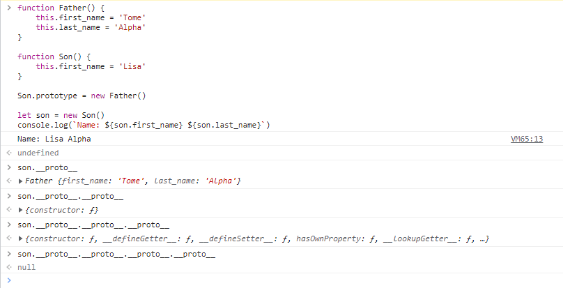

# 浅谈JavaScript原型链污染

Author: H3rmesk1t

Data: 2022.04.24

# 前置知识
## JavaScript的类与实例
在`JavaScript`中, 构造函数相当于类, 且可以将其实例化. 如果要定义一个类, 需要以定义构造函数的方式来定义. 在`JavaScript`中, 通过`new`关键词或`Object.create()`方法来进行对象实例的创建.

```javascript
function Func() {
    this.demo = 1;
}

var func = new Func();
```

<div align=center></div>

## JavaScript的prototype与__proto__
### 原型对象prototype
所有的`JavaScript`对象都会从一个原型对象`prototype`中继承属性和方法, `JavaScript`的每一个函数/类都有一个`prototype`属性, 用来指向该构造函数的原型.

例如前面的`Func`函数, 其`prototype`属性指向了该构造函数的原型本身.

<div align=center></div>

### __proto__属性
`JavaScript`的每一个实例对象都有一个`__proto__`属性指向该实例对象的原型. 例如前面的`Func`函数, 其实例对象`func`就有`__proto__`属性, 访问该属性可知是指向`func`这个实例对象的原型的.

<div align=center></div>

### 总结
实例对象由函数生成, 实例对象的`__proto__`属性是指向函数的`prototype`属性的.

<div align=center></div>

且在调用过程中, 无论是调用实例对象的`__proto__`属性, 还是调用构造函数/类的`prototype`属性, 它们均有一个`__proto__`属性指向`Object`, 而再往下调用`__proto__`属性就是调用`Object.__proto__`, 其值为`null`.

<div align=center></div>

# JavaScript原型链继承
## 原型链
原型链: 由于`__proto__`是任何`JavaScript`对象都有的属性, 而`JavaScript`中万物皆对象, 因此会形成一条`__proto__`连起来的链, 递归访问`__proto__`直至到终点即值为`null`. 上文中用到的`Func`构造函数和`func`实例对象的原型链如下:

```javascript
func -> Func.prototype -> Object.prototype -> null
```

数组的原型链:

```javascript
array -> Array.prototype -> Object.prototype -> null
```

日期的原型链:

```javascript
data -> Date.prototype -> Object.prototype -> null
```

函数的原型链:

```javascript
func -> function.prototype -> Object.prototype -> null
```

原型链的结构图如下图所示:

<div align=center></div>

这里`func`是实例对象, `Func.prototype`是原型, 原型通过`__proto__`访问原型对象, 实例对象继承的就是原型及其原型对象的属性.

## 继承的查找过程
调用对象属性时会查找属性, 如果本身没有，则会去`__proto__`中查找, 也就是构造函数的显式原型中查找, 如果构造函数中也没有该属性, 因为构造函数也是对象, 也有`__proto__`, 那么会去`__proto__`的显式原型中查找, 一直到`null`, 这一过程很好的说明了原型才是继承的基础. 例如如下代码, `Son`类继承了`Father`类的`last_name`属性, 最后输出的是`Name: Lisa Alpha`.

```javascript
function Father() {
    this.first_name = 'Tome'
    this.last_name = 'Alpha'
}

function Son() {
    this.first_name = 'Lisa'
}

Son.prototype = new Father()

let son = new Son()
console.log(`Name: ${son.first_name} ${son.last_name}`)
```

对于对象`son`在调用`son.last_name`的时候, 实际上`JavaScript`引擎会进行如下操作:
 - 在对象`son`中寻找`last_name`.
 - 如果找不到, 则在`son.__proto__`中寻找`last_name`.
 - 如果仍然找不到, 则继续在`son.__proto__.__proto__`中寻找`last_name`.
 - 依次寻找, 直到找到`null`结束. 比如, `Object.prototype`的`__proto__`就是`null`.

<div align=center></div>

# JavaScript原型链污染机制
在`JavaScript`中访问一个对象的属性可以用`param1.param2.param3`或者`praram1["param2"]["param3"]`来访问. 由于对象是无序的, 当使用第二种方式访问对象时, 只能使用指明下标的方式去访问. 因此我们可以通过`param1["__proto__"]`的方式去访问其原型对象. 原型链污染一般会出现在对象或数组的键名或属性名可控, 而且是赋值语句的情况下.

在实际应用场景中, 当攻击者控制并修改了一个对象的原型, 那么将可以影响所有和这个对象来自同一个类、父祖类的对象, 这种攻击方式就是原型链污染.

从代码层面上来理解原型链污染机制, 代码如下所示:

```javascript
function Func() {
    this.param = 1;
}

var func = new Func();
console.log(func.param);

func.__proto__.__proto__["params"] = 2;

var funcs = new Func();
console.log(funcs.params);
```

<div align=center></div>

# JavaScript原型链污染应用场景
在上文中说到了, 原型链污染一般会出现在对象或数组的键名或属性名可控, 而且是赋值语句的情况下. 因此, 一般可以设置`__proto__`值的场景, 即能够控制数组(对象)的键名的操作的场景中容易出现`JavaScript`原型链污染. 这里主要有以下两种:
 - 对象`merge`, 即合并数组对象的操作.
 - 对象`clone`, 内核中就是将待操作的对象`merge`到一个空对象中.

以对象`merge`为例, 参考[P神文章](https://www.leavesongs.com/PENETRATION/javascript-prototype-pollution-attack.html#:~:text=%E5%8E%9F%E5%9E%8B%E9%93%BE%E6%B1%A1%E6%9F%93%E3%80%82-,0x04%20%E5%93%AA%E4%BA%9B%E6%83%85%E5%86%B5%E4%B8%8B%E5%8E%9F%E5%9E%8B%E9%93%BE%E4%BC%9A%E8%A2%AB%E6%B1%A1%E6%9F%93%EF%BC%9F,-%E5%9C%A8%E5%AE%9E%E9%99%85%E5%BA%94%E7%94%A8)中用到的`merge`函数:

```javascript
function merge(target, source) {
    for (let key in source) {
        if (key in source && key in target) {
            merge(target[key], source[key])
        } else {
            target[key] = source[key]
        }
    }
}
```

其在合并的过程中, 存在赋值的操作`target[key] = source[key]`. 因此, 当控制`target`的键`key`为`__proto__`时就能对原型链进行污染. 示例`Payload`如下所示:

```javascript
let demo1 = {};
let demo2 = {name : 'h3', "__proto__" : {age : 20}};

merge(demo1, demo2);
console.log(demo1.name, demo1.age);

let demo3 = {};
console.log(demo3.name, demo3.age);
```

<div align=center></div>

可以看到该`Payload`并未污染成功, 这是因为, `JavaScript`创建`demo2`的过程中, `proto`已经代表`demo2`的原型, 此时遍历`demo2`的所有键名时, 拿到的是`[name, age]`, `proto`并不是一个`key`, 自然也不会修改`Object`的原型. 此时, 需要将`demo2`实例对象那部分改为`JSON`格式, 修改后的`Payload`如下:

```javascript
let demo1 = {};
let demo2 = JSON.parse('{"name" : \"h3\", "__proto__" : {"age" : 20}}');

merge(demo1, demo2);
console.log(demo1.name, demo1.age);

let demo3 = {};
console.log(demo3.age);
```

<div align=center></div>

可以看到, 新建的`demo3`对象, 也存在`age`属性, 说明`Object`已经被污染了. 这是因为, `JSON`解析的情况下, `__proto__`会被认为是一个真正的"键名", 而不代表"原型", 所以在遍历`demo2`的时候会存在这个键. `merge`操作是最常见可能控制键名的操作, 也最能被原型链攻击, 很多常见的库都存在这个问题.

# 参考
 - [深入理解 JavaScript Prototype 污染攻击](https://www.leavesongs.com/PENETRATION/javascript-prototype-pollution-attack.html#0x02-javascript)